
Для управления автомобилями Voyah используется приложение 岚图汽车.

Приложение только на китайском, используйте экранный переводчик.

Для работы с этим приложением, необходимо его установить на свой телефон и создать учётную запись на серверах Ланту.

Создание учётной записи состоит из нескольких шагов:

1. [Создание учётной записи WeChat](#wechat)
2. [Заведение китайского номера eSender](#esender-китайский-номер)
3. [Установка приложения Lantu](#установка-приложения)
4. [Создание аккаунта в приложении Lantu](#создание-аккаунта)

[Что можно делать в приложении](app.md).

# WeChat

WeChat — это китайский мессенджер, в котором есть мини-приложения.

1. Установить WeChat на телефон ([Android](https://apkpure.net/wechat/com.tencent.mm), [iOS](https://apps.apple.com/ru/app/wechat/id414478124))
2. Создать аккаунт на российский номер
3. Подтверждение аккаунта:
  - Найти того, кто подтвердит ваш QR-код. На Авито есть множество предложений этой услуги. Просить подтверждать код в чате — НЕ надо.
  - (проверить) Написать в поддержку WeChat, сказать, что подтвердить код некому, но очень хочется зарегистрироваться.

# eSender, китайский номер

eSender — это сервис виртуального китайского номера, позволяет получать SMS (больше нам не надо).

Существует как мини-приложение в WeChat и как отдельное приложение. Номер создаётся в мини-приложении WeChat.

## Настройка eSender

1. Запустить WeChat
2. В поле поиска наверху написать `esender` [1], в разделе `Поиск в интернете` нажать на первый результат [2].
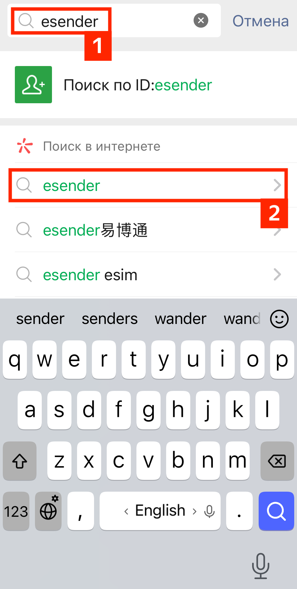
3. Повторный поиск найдёт официальный аккаунт, нажать на него.
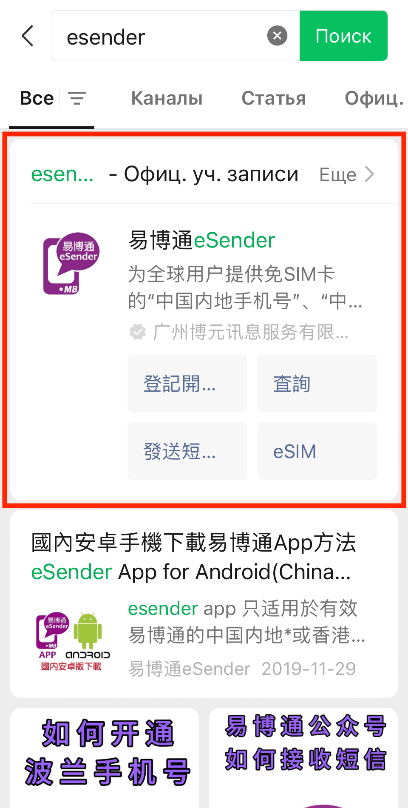
4. Откроется страница этого аккаунта, на него надо подписаться.
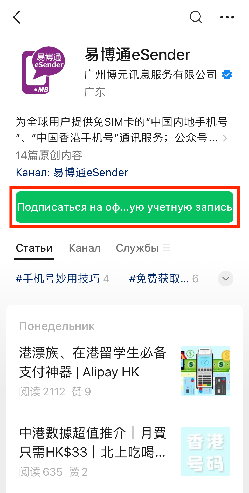
5. Согласиться с лицензионным соглашением
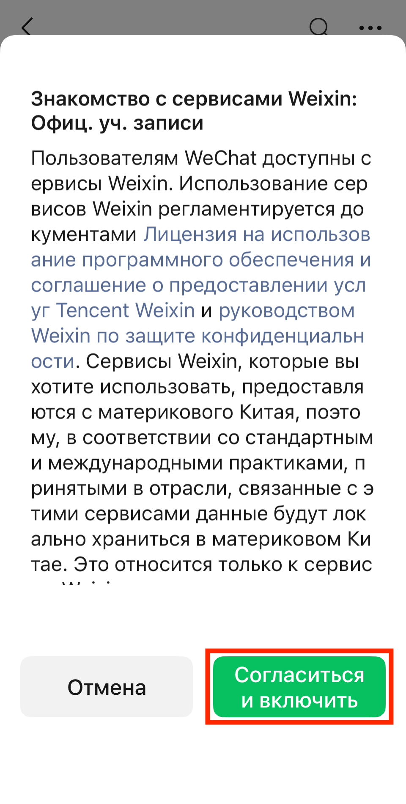
6. Выбрать русский язык в eSender
  - Нажать на правый нижний пункт меню [1], выбрать первый пункт в открывшемся списке [2]
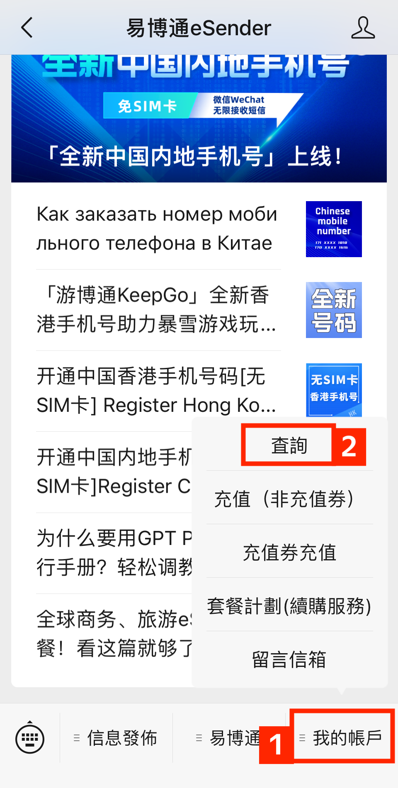
  - Откроется страница аккаунта пользователя, на ней нажать на выпадающий список [1] и выбрать русский язык [2]
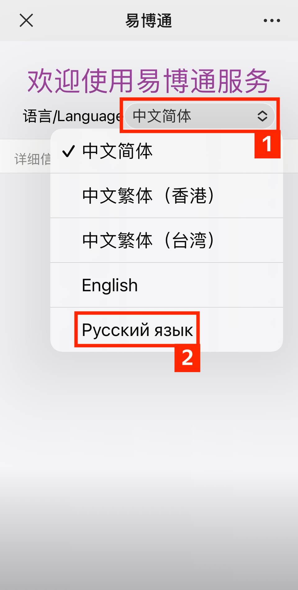

## Регистрация китайского номера eSender

Необходим загранпаспорт для подтверждения личности.

1. Нажать на средний пункт eSender в нижнем меню, выбрать Registration Service
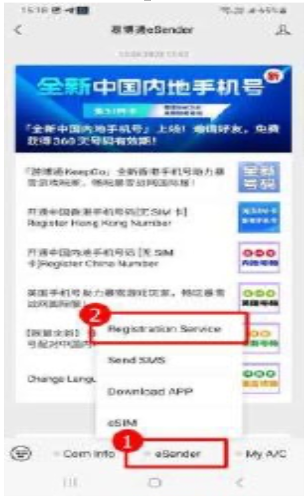
2. Нажать Mainland China Number
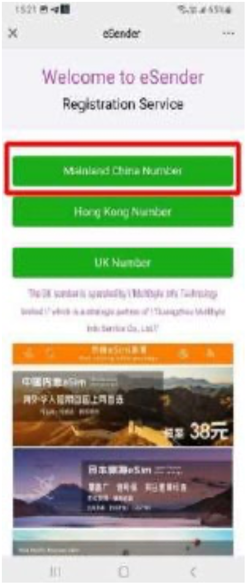
3. Нажать General Number Registration
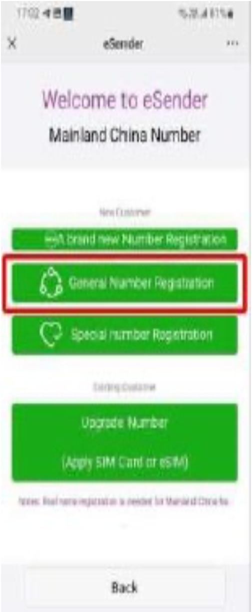
4. Нажать Non PRC resident ID card
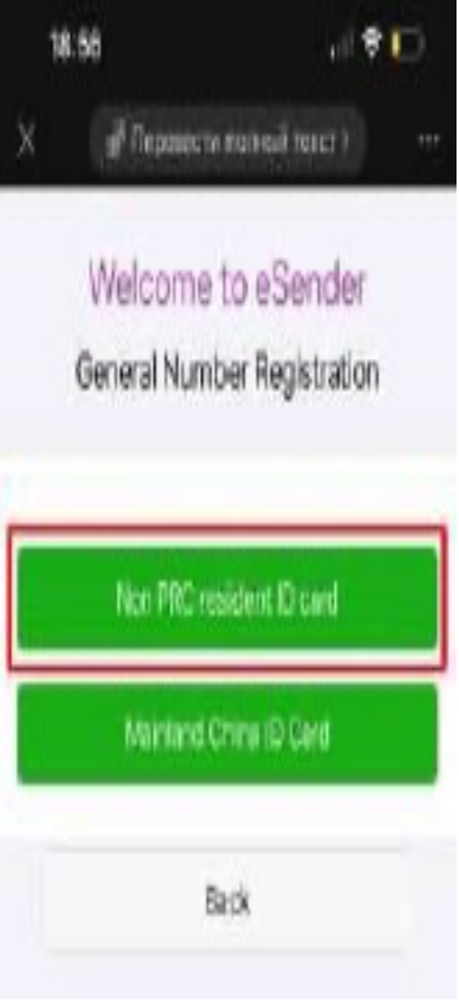
5. Заполнить форму
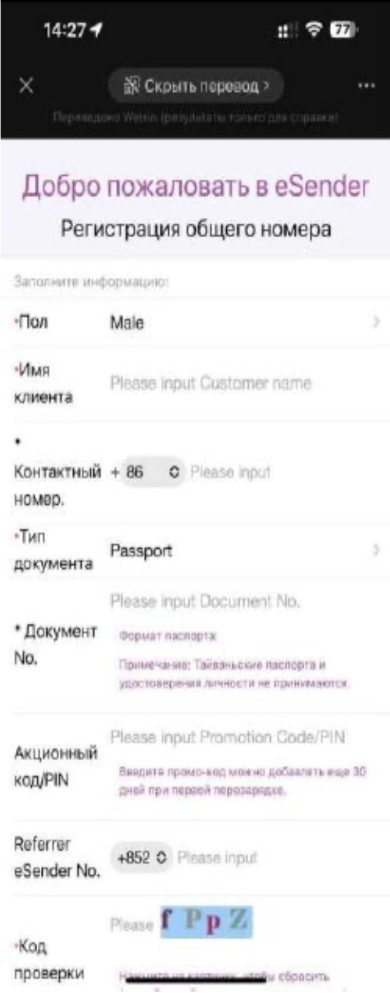
5. Согласиться с условиями использования
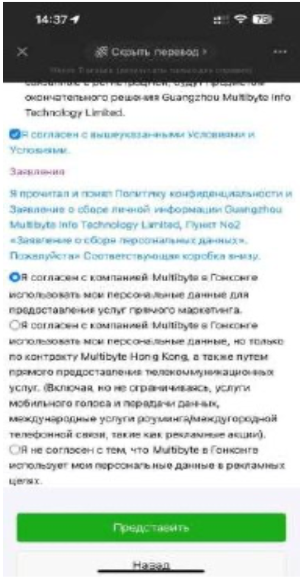
6. Регистрация номера закончена, можно записать свой китайский номер (обычно он используется без +86)
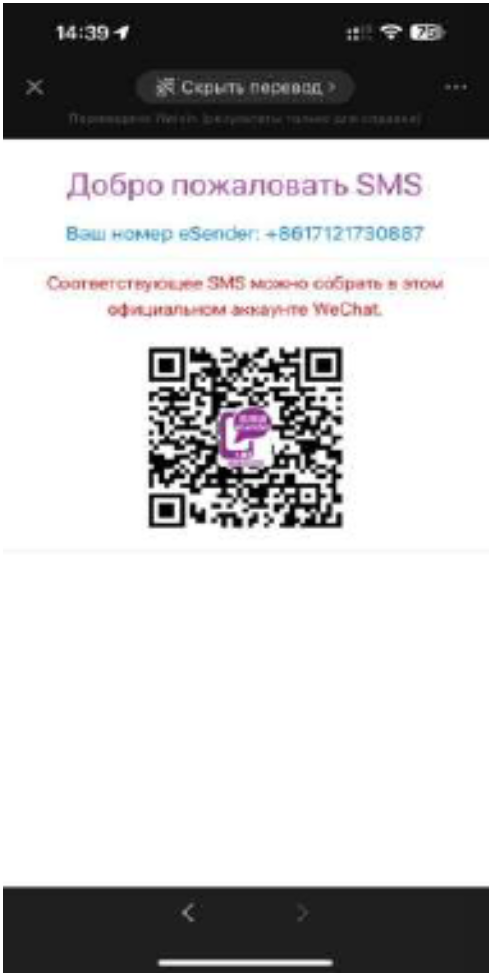

## Подтверждение личности

Сделайте фото:

1. Обложка паспорта (да, вот так странно)
2. Страница паспорта, где фото и все данные
3. Себя с этой страницей паспорта, чтобы данные паспорта хорошо читались

После регистрации приходит SMS сообщение о необходимости пройти подтверждение личности, предоставив фото паспорта.

1. В eSender будут два сообщения о необходимости подтверждения личности, нажать на выделенное
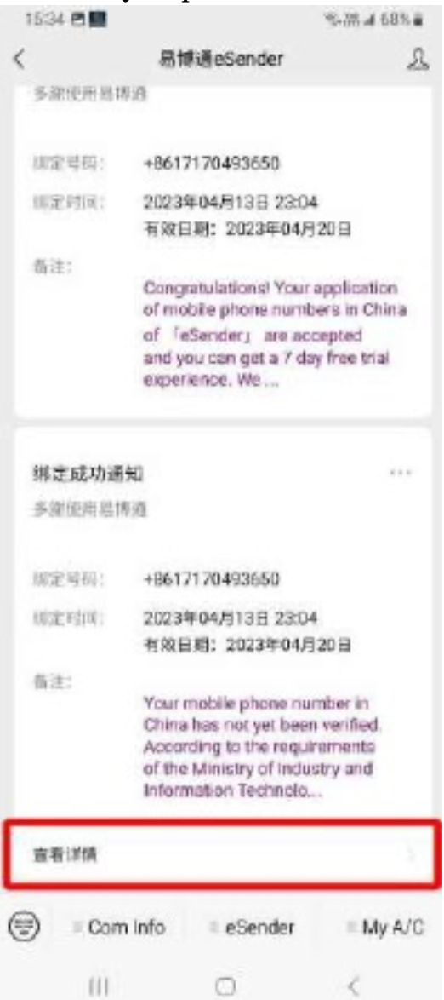
2. Выбрать English
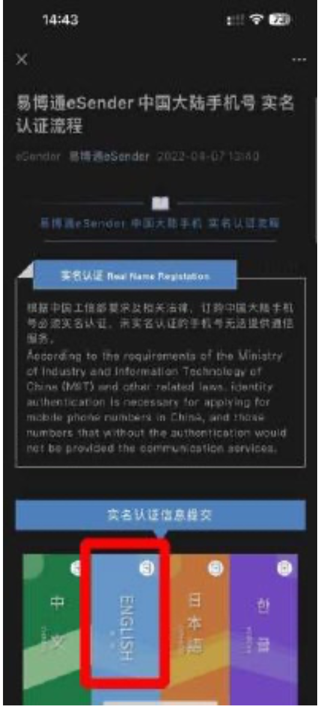
3. Заполнить форму
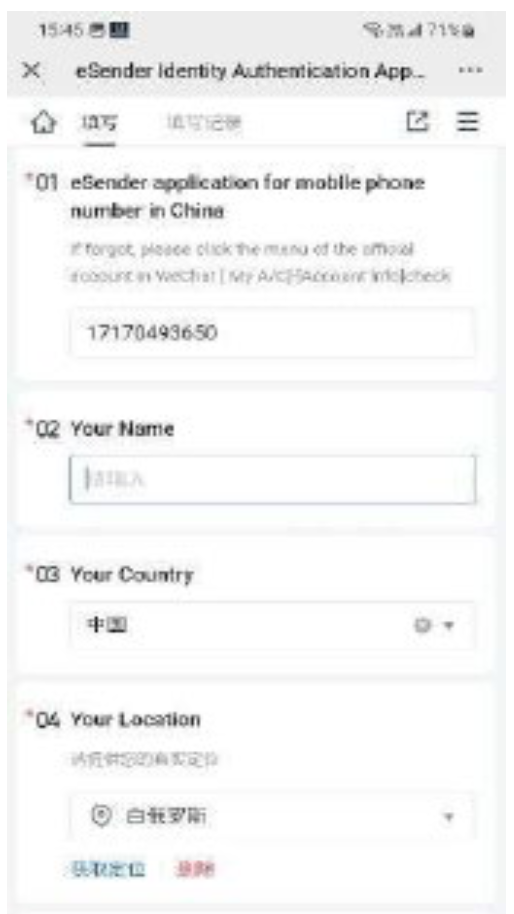
4. После проверки (обычно не больше часа), приходит сообщение
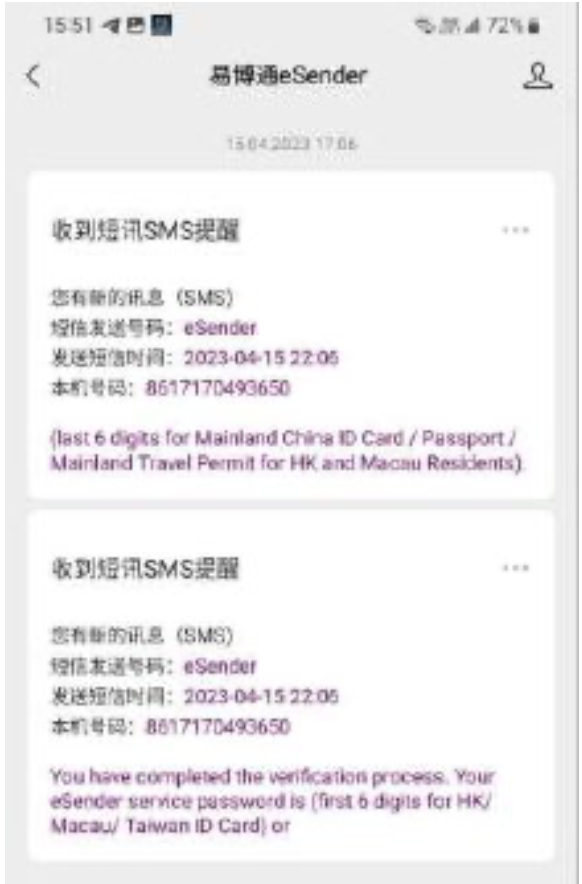

## Оплата eSender

Оплачивать номер можно на год, два или три. Выгоднее всего оплачивать на три года.

1. Нажать на правый нижний пункт меню My A/C, выбрать Top up в открывшемся списке
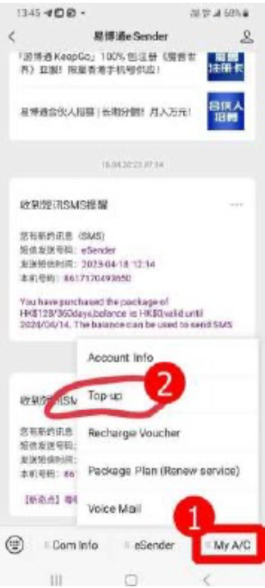
2. Выбрать номер в начале экрана
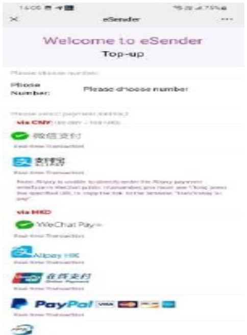
3. Выбрать YooMoney как систему пополнения

4. Выбрать срок пополнения
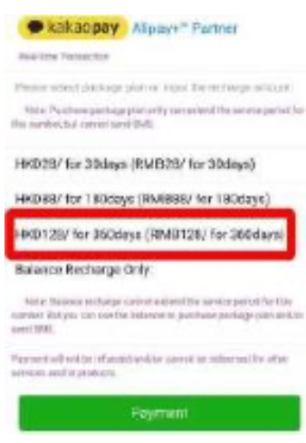
5. Нажать оплатить, увидеть сумму в рублях и пополнить отдельно баланс YooMoney на эту сумму

6. Оплатить балансом YooMoney

# Установка приложения
## Android

1. [Скачать APK из AppGallery от Huawei](https://appgallery.cloud.huawei.com/appdl/C103719447) или
2. [Скачать APK из APKPure](https://apkpure.net/lan-tu-qi-che/com.voyah.fassistant)

Установить на телефон.

## iOS

Приложение доступное в российском AppStore ставить НЕ надо. Оно НЕ работает, это приложение для Норвегии.

Надо устанавливать приложение из [китайского AppStore](https://apps.apple.com/app/id1550056350)

### (или) Переключение региона

Переключить свой AppStore на регион, где доступно приложение (Киргизия, Китай).

Установить приложение, переключиться обратно.

### (или) Завести новый аккаунт в AppStore

Завести новый аккаунт в AppStore на любой email и китайский номер телефона eSender с выбором региона Китай, переключиться на этот аккаунт.

Установить приложение, переключиться обратно.

### (или) Войти под публичным аккаунтом в AppStore (НЕ в iCloud)

В случае проблем с этим аккаунтом или для получения кода, обращаться к [makc_02vin](https://t.me/makc_02vin)

Войти под аккаунтом в AppStore (НЕ в iCloud!)

Логин:

`voyahf@gmail.com`

Пароль:

`vF15362478`

При запросе активации доп.аутентификации, выбрать пункт «Другой вариант» и там нажать НЕ активировать, после этого входить в аккаунт.

Установить приложение, переключиться обратно.

# Создание аккаунта

TODO
