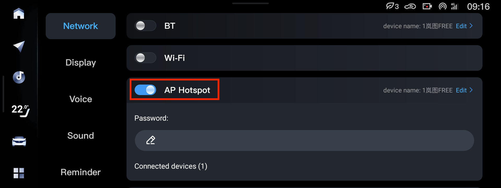

Точно работает [USB 2.0 Type-A — Type-A](https://www.ozon.ru/product/kabel-usb-2-0-pro-am-am-1-8-m-ekran-chernyy-cablexpert-193942384/)

Type-C — Type-C, Type-A — Type-C НЕ работает, порт Type-C в машине только для зарядки.

USB 3.0 может не работать, лучше USB 2.0.

# Windows

Type-C — Type-A (Type-C в ноутбук, Type-A в машину) иногда работает на Windows.

# Mac

Type-C — Type-A (Type-C в ноутбук, Type-A в машину) НЕ работает на Mac.

Если на Mac нет портов Type-A, нужно использовать переходник Type-C — Type-A, позволяющий передачу данных по USB 2.0. Подойдёт любой, каким вы подключаете флешки к ноутбуку.

Точно работает:
  - [UGREEN US173](https://www.ozon.ru/product/adapter-ugreen-us173-30155-usb-c-to-usb-3-0-a-female-adapter-tsvet-belyy-1066021481/)
  - [PROelectronic OTG]( https://www.ozon.ru/product/perehodnik-type-c-na-usb-proelectronic-s-usb-na-type-c-otg-3-0-701024442/)
  - [HUB USB HDMI PD 100W Type C](https://www.ozon.ru/product/perehodnik-hab-hub-usb-hdmi-pd-100w-type-c-6-v-1-podarok-na-23-fevralya-1058594485/), использовать порт USB 2.0, USB 3.0 НЕ работает.

# ADB over Wi-Fi

На дорестах (Android 9) можно подключиться к машине без кабеля, используя ADB over Wi-Fi.

Устанавливать так VoyahTweaks не стоит (хотя это возможно с исправлением скрипта установки), а установить быстро приложение в машину или изменить настройки — можно.

1. Включить в машине AP Hotspot

2. Подключиться с ноутбука к Wi-Fi сети машины

3. В консоли (терминал Мака, Adb AppControl в Windows) выполнить

`adb connect 192.168.43.1:5578`
