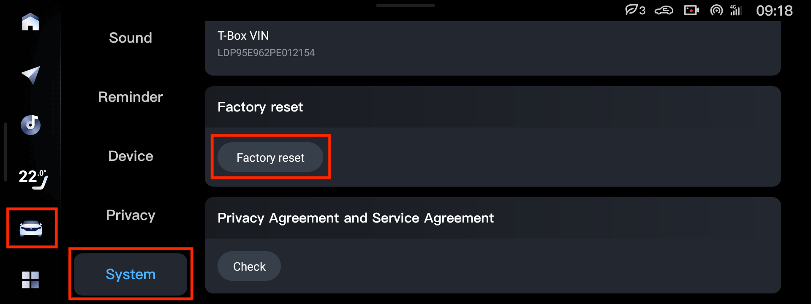

Машину можно сбросить к заводским настройкам, это приводит в исходное состояние всё, что было настроено и установлено в машине. Прошивка остаётся текущая.

1. На левой панели центрального экрана нажать на машинку
2. Прокрутить вниз до Settings (Настройки)
3. Прокрутить вниз до System (Система)
4. Прокрутить вниз до Factory reset (Сброс к заводским настройкам)

