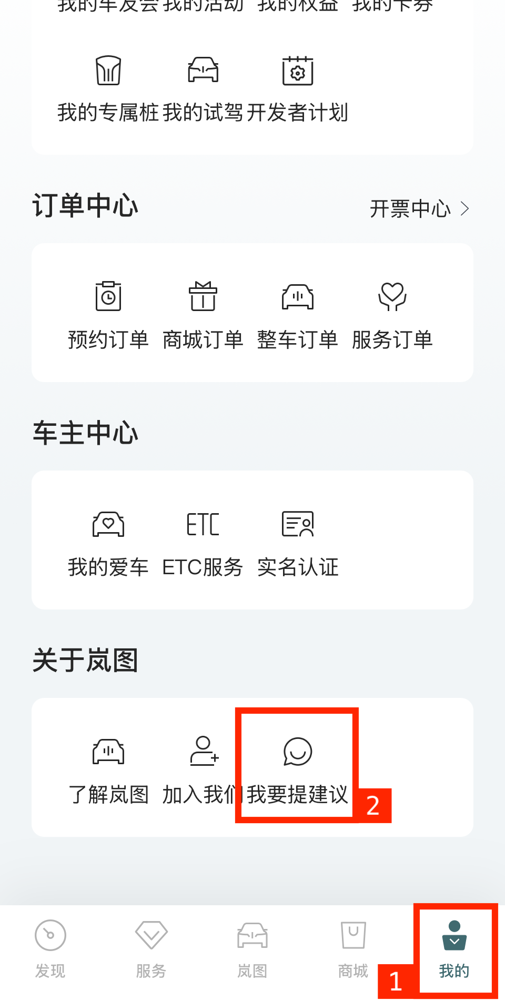
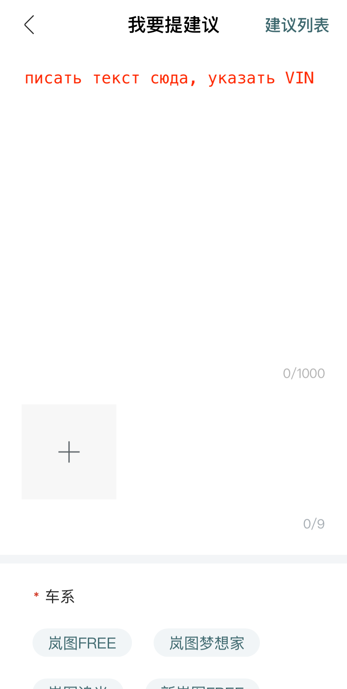
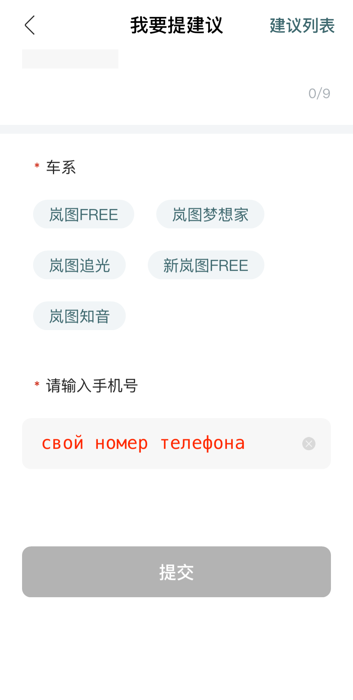
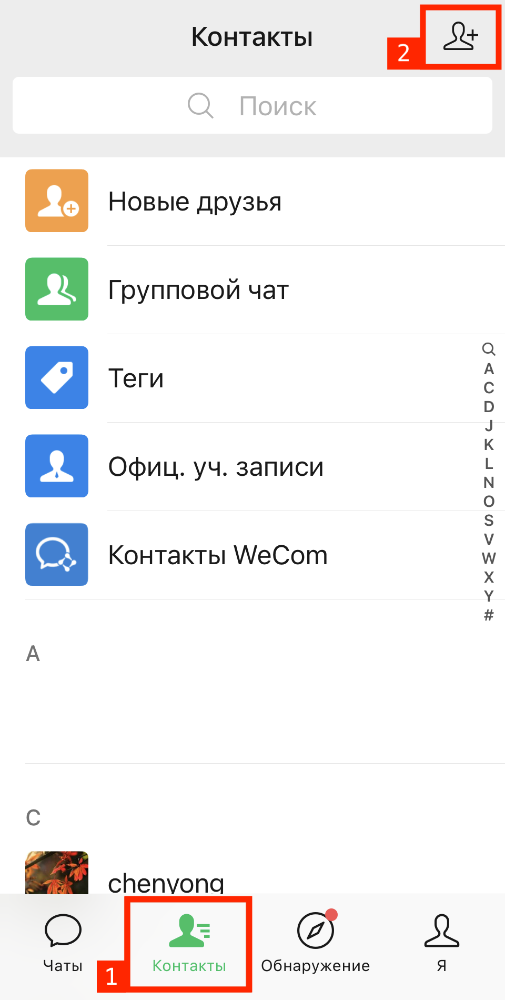
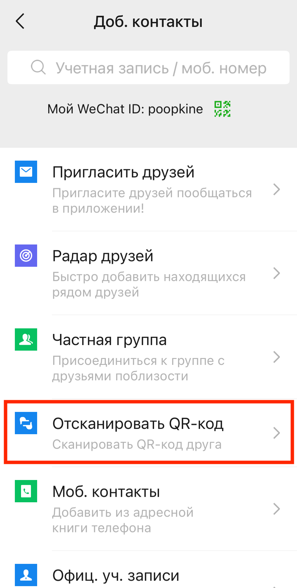
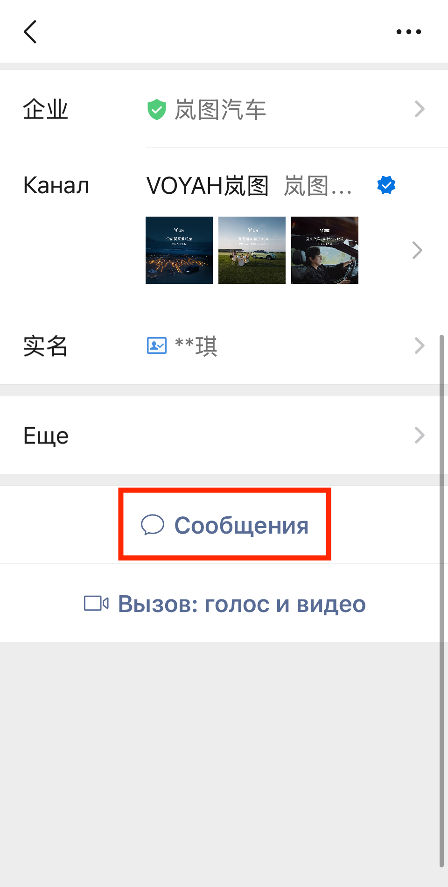
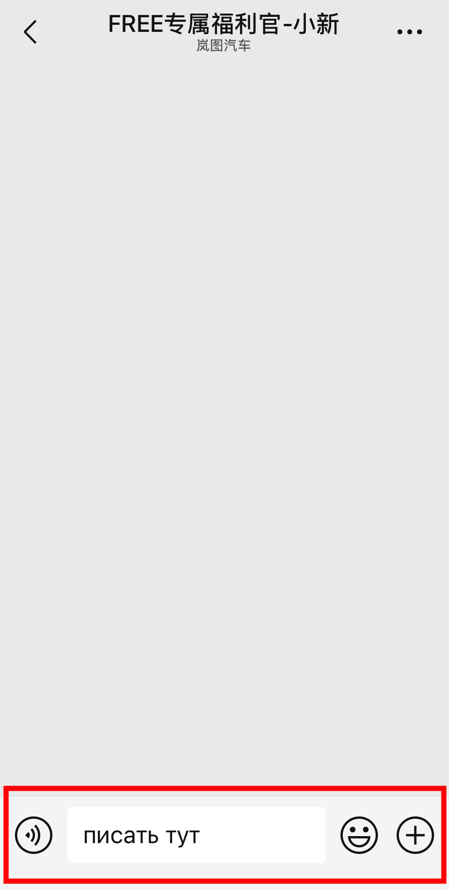

# Lantu

1. Нажать в правый нижний угол приложения [1]. Пролистать в конец, нажать на иконку поддержки [2]

2. Написать тест сообщения на китайском или английском, указать VIN машины

4. Выбрать категории обращения, указать номер телефона без +86, отправить

# WeChat

1. Нажать на вкладку Контакты [1]. Выбрать добавить контакт [2]

 Добавить контакт'>

2. Выбрать пункт Отсканировать QR-код

3. Отсканировать QR-код

4. Откроется страница контакта поддержки

5. Пролистать вниз до Сообщения

6. Написать сообщение на китайском или английском, указать VIN машины

# Email

Если нет возможности написать из Lantu или WeChat, можно написать на email

* `voyah-callcenter@voyah.com.cn`
* `voyah_global@voyah.com.cn`
* `voyah-callcenter@dfmc.com.cn`

