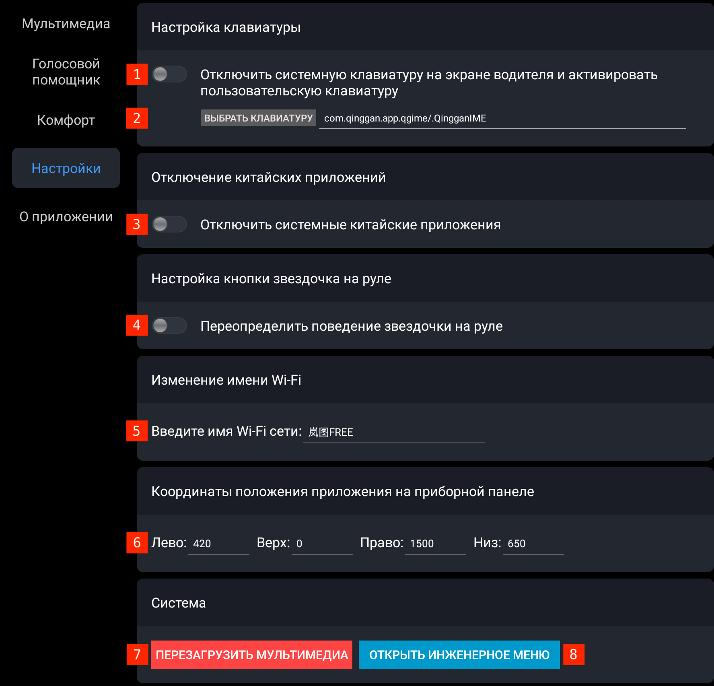

# Мультимедия

*Что и как отображается на центральном и пассажирском экранах.*

## 1. Управление музыкой на руле

Включает управление музыкой на руле. После включение этой настройки нужно [перезагрузить мультимедиа](reboot.md#мультимедиа).

Можно выбрать приложение мультимедиа по умолчанию (музыка или радио), запуск его при включении машины или кнопкой на руле, выключение при открытии двери автомобиля и изменение громкости музыки при старте машины. Само приложение выбирается в настройке голосовых команд `Музыка` или `Радио`.

## 2. Плавающая кнопка

Включает плавающую кнопку скрытия/показа левой панели. Эту кнопку можно переместить по экрану в любое удобное место.

## 3. Жест назад

Движение пальцем справа налево по центральному экрану от пассажирского делает жест `Назад`. Например, это нужно, чтобы выйти из настроек `FMPLay`.

## 4. Иконки приложений

VoyahTweaks заменяет иконки приложений на левой панели на сообственные, близкие к внешнему виду иконок машины. Эта опция включает использование оригинальных иконок приложений.

## 5. DPI

Изменение DPI для всех приложений.

Индивидуально изменить для конкретных приложений DPI в другое значение можно из лаунчера, сделав в нём долгое нажатие на иконку приложения.

Увеличение DPI увеличивает интерфейс приложений, текст и иконки становятся больше. Рекомендуется 210 или 240. При 210 в ЯМузыке видна обложка альбома на экране композиции, при 240 — она пропадает. В ЯНавигаторе текст на картах больше не становится, меняется только размер интерфейса.

## 6. Автозапуск на центральном экране

Автозапуск приложения на центральном экране. Активировать и выбрать приложение для автозапуска. Тут же можно выбрать автозапуск [разделения экрана](#12-разделение-экрана-split-screen).

## 7. Выбор приложения навигации

Выбор приложения на место `Навигатора` на левой панели центрального экрана. Нажать на `ВЫБРАТЬ ПРИЛОЖЕНИЕ`, выбрать из списка приложение. Активировать опцию.

## 8. Выбор приложения музыки

Выбор приложения на место `Музыки` на левой панели центрального экрана. Нажать на `ВЫБРАТЬ ПРИЛОЖЕНИЕ`, выбрать из списка приложение. Активировать опцию.

## 9. Автозапуск лаунчера на экране пассажира

На экране пассажира будет запускаться лаунчер приложений вместо приложения по умолчанию.

## 10. Автозапуск приложения на экране пассажира

Автозапуск приложения на экране пассажира. Активировать и выбрать приложение для автозапуска.

## 11. Выбор приложения на первое место на экране пассажира

Выбор приложения на первое место на левой панели экрана пассажира. Аналогично переопределяются остальные четыре места.

## 12. Разделение экрана (split screen)

Выбор приложений для левой и правой частей разделения экрана и пропорции разделения.

Активировать разделение экрана можно долгим нажатием на иконку музыки на левой панели центрального экрана.

# Голосовой помощник

*Включение голосового управления на русском и значения по умолчанию для команд про сиденья и приложения.*

## 1. Включить голосовой помощник

Включить русскоязычный голосовой помощник.

## 2. Уровни по умолчанию голосовых команд сидений

Выбрать уровень по умолчанию для голосовых команд сидений.

## 3. Двойное проветривание

Для команды «Проветривание» можно включить опцию опускания окон ниже.

## 4. Задержка открытия лючков

Для команд открытия лючков можно установить задержку их открытия.

## 5. Приложения для запуска голосовыми командами

Изменить приложение, которое будет запускаться по командам вызова приложений.

## 6. Голосовые команды

Далее идёт список всех [голосовых команд](tweaks_voice.md).

# Комфорт

*Настройка положений сидений/зеркал и включение опций машины.*

## 1. Настройки положений сидений/зеркал

Отрегулируйте положение водительского сидения/зеркал физическими кнопками на сиденье/двери, нажмите `Сохранить`. Для восстановления положения нажмите `Восстановить`. Можно сохранить три положения сидения.

## 2. Отключить звук предупреждения пешеходов

Отключить звук «летающей тарелки» при движении на низкой скорости. На приборке водителя появится жёлтый значок в левом верхнем углу, сигнализирующий о том, что звук отключен.

## 3. Forced EV

Включить режим меньшего использования ДВС на гибриде (не включает его до 10% разряда ВВБ, не включает его при резких ускорениях).

## 4. Отключить предупреждение о дистанции (FCW)

Отключить предупреждение об опасном приближении к машине перед вами.

## 5. Закрыть шторку после выхода из авто

Если ваша машина оборудована люком, то можно автоматически закрывать шторку люка при выходе из машины.

## 6. Открыть шторку после старта авто

Если ваша машина оборудована люком, то можно автоматически открывать шторку люка при старте машины.

## 7. Зимний пакет

При низких температурах окружающей среды, во время старта автомобиля, автоматически включает подогрев водительского или пассажирского сиденья.

По умолчанию:
* Температура от +5 до 0 — одну ступень
* Температура от 0 до -5 — две ступени
* Температура ниже -5 — три ступени

Длительность обогрева и деактивации до следующей длительной стоянки авто (более 1 часа) можно настроить.

## 8. Летний пакет

При высоких температурах окружающей среды, во время старта автомобиля, автоматически включает охлаждение водительского сиденья.

По умолчанию:
* Температура от 20 до 24 — одну ступень
* Температура от 24 до 27 — две ступени
* Температура выше 27 — три ступени

Длительность охлаждения и деактивации до следующей длительной стоянки авто (более 1 часа) можно настроить.

## 9. Режим вождения

Сохраняет при выходе из автомобиля последний выбранный режим вождения.

После посадки в автомобиль и нажатия педали тормоза восстанавливает последний сохраненный режим.

Используется только для гостевого аккаунта.

## 10. Apollo

Активирует Apollo. [Ответы на вопросы](https://t.me/voyahchat/32898/667028) экзамена по Apollo.

## 11. Разблокировка дверей при переводе в Parking

При переводе машины в Parking двери автоматически разблокируются.

# Настройки

*Выбор клавиатуры для центрального экрана, отключение китайский приложений, переопределение звёздочки на руле, активации автомобиля, изменение имени BT/Wi-Fi и координат вписывания навигатора при переносе на приборку водителя.*

## 1. Включение клавиатуры

Включить стороннюю клавиатуру.

## 2. Выбор клавиатуры

Выбрать установленную клавиатуру, например, `ru.yandex.androidkeyboard`, если [установлена Яндекс Клавиатура](https://t.me/voyahchat/558068/636895).

## 3. Отключение китайских приложений

Отключает не нужные китайские приложения.

## 4. Звёздочка на руле

Переопределяет звёздочку на руле как действие `Назад`.

## 5. Активация автомобиля

Активирует автомобиль, если он не был активирован до этого. Позволяет убрать QR-код при запуске машины. Опция работает только после оплаты подписки.

## 6. Русификация автомобиля

Русифицирует автомобиль, если была оплачена подписка с русификацией.

## 7. Имя машины

Переопределяет имя машины для BT/Wi-Fi.

## 8. Координаты на приборной панели

Координаты вписывания навигатора при переносе на приборку водителя.

Для вписывания на приборку машин ОД РФ нужно выставить [другие координаты](software_setup.md#навигатор-на-приборке-од-машин).

## 9. Перезагрузка мультимедиа

Перезагрузить мультимедиа вместо зажатия на руле «звёздочка + трубка».

## 10. Инженерное меню

Открывает инженерное меню без ввода пароля.

# Apollo

*Настройки Apollo для машин ОД РФ.*

# О приложении

*Версия приложения, описание, отправка логов, обновление приложения и срок окончания подписки.*

## 1. Версия приложения

Установленная версия VoyahTweaks, VIN код автомобиля, версия загруженных ресурсов.

## 2. Отправка логов

Если видите какую-то проблему — нажмите эту кнопку для отправки логов на сервер до перезагрузки мультимедиа или выключения машины.

После напишите разработчикам свой VIN и описание проблемы в [разделе чата](https://t.me/voyahchat/413159).

## 3. Обновление приложения

Проверка наличия обновления. Установка, если если есть новая версия.

## 4. Выбор языка

Выбор языка приложения настроек VoyahTweaks.

## 5. QR-код для оплаты

Создание QR-кода для оплаты, после сканирования кода на открывшейся странице надо будет ввести только email для получения чека об оплате.

## 6. Обновить ресурсы

Обновление ресурсов языковых пакетов без обновления приложения.

## 7. Срок подписки

Дата окончания действия подписки.

