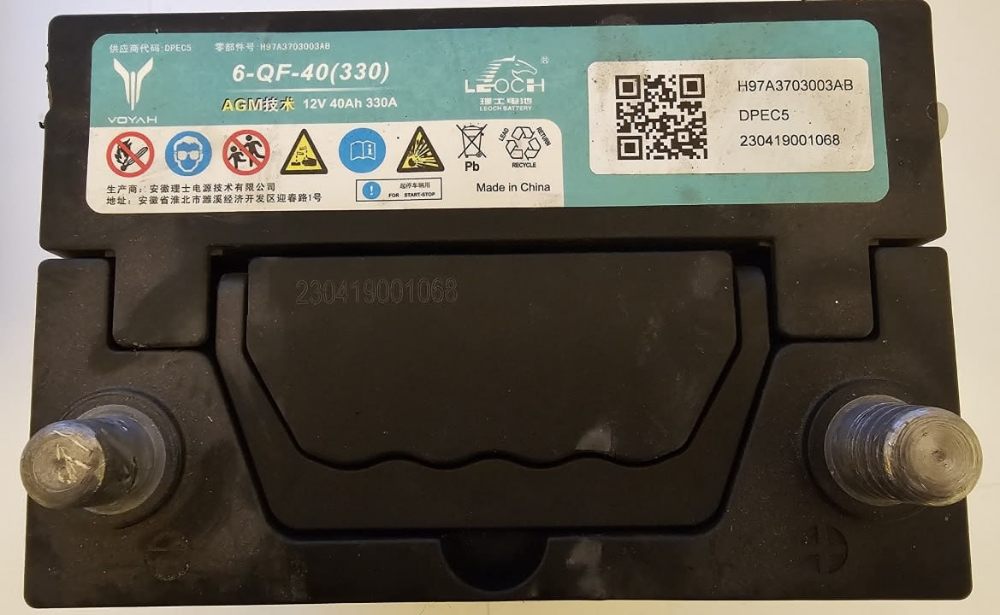

# Проблемы с АКБ
AGM аккумулятор не любит разряд. Большинство проблем с 12V аккумулятором из-за того, что во время перевозки высаживается АКБ (срабатывает сигнализация, регистратор пишет аварийные события, не отключен бесключевой доступ и ключи рядом). После долгого разряда АКБ начинает «болеть». Чтобы не испытывать проблем из-за умирающего аккумулятора его рекомендуется проверить после покупки, при возможности «полечить» специальной зарядкой или заменить.

# Параметры оригинального АКБ

> Типоразмер: B20 JIS 197×129×227 
> Полярность: Обратная [- +], (евро (0, L, R+)) 
> Размещение клемм: Выступают, азиатский тип (JIS) 
> Тип клемм по размеру: Толстые, конус, европейский стандарт +ø19,5×18 -ø17,9×19 (STD,1) 
> Емкость (C20), Ач: 40 
> Пусковой ток (EN), А: 330 

Физические размеры, снятые с реального аккумулятора:
> Длина (мм): ~193 (200 с выступом) 
> Ширина (мм): ~127 (135 с выступом) 
> Высота корпуса (мм): ~202 
> Высота общая (мм): ~224 

Аккумулятор полностью подпадает под японский JIS стандарт, но клеммы установлены «толстые», как на европейских батареях.

# Аналоги
1. [RDrive OEM 28800-21050 (S34B20L) AGM](https://www.rdrive.pro/index.php?option=com_virtuemart&view=productdetails&virtuemart_product_id=345&virtuemart_category_id=201)
2. Если нет AGM можно временно установить любой свинцовый аккумулятор B19 или B20 с клеммами T3 (или с комплектом адаптеров на тонкие клеммы). Емкость 35-45 АЧ. У свинцового АКБ напряжение ниже и машина будет считать, что он незаряжен и пытаться его дозаряжать, что будет приводить к разряду ВВБ.

# Зарядки
1. [RDrive C4-Li-DT](https://www.rdrive.pro/index.php?option=com_virtuemart&view=productdetails&virtuemart_product_id=460&virtuemart_category_id=197)
2. [RDrive C10-DT](https://www.rdrive.pro/index.php?option=com_virtuemart&view=productdetails&virtuemart_product_id=221&virtuemart_category_id=197&Itemid=427) (аккумуляторы до 200 Ач, брать если понимаете зачем оно вам надо)

# Статьи
1. [Разбираюсь с аккумулятором. Я не пойму почему он должен дохнуть](https://www.drive2.ru/l/686497128305919809/)
2. [Электрическая жизнь Voyah Free. Вторая серия](https://www.drive2.ru/l/688234906433626956/)
3. [Электрическая жизнь Voyah. Разобрал аккумулятор. 3я серия](https://www.drive2.ru/l/690935306991455395/)
4. [Электрическая жизнь Voyah. Токи. 4я серия. Читать до конца!](https://www.drive2.ru/l/694571666822424163/)

