Инструкция применима к гибридным Voyah Free 2021-2023 и 2024-2025 с 12-вольтовым аккумулятором под капотом.

## Важные предупреждения

- Перед работами с электрическими компонентами выключите все электроприборы и кнопку запуска/остановки.
- При подключении или отключении кабеля аккумулятора, зарядного устройства или проводов для запуска кнопка запуска/остановки должна быть в положении `OFF`; иначе возможно повреждение блоков управления или других электрических компонентов.
- Если инструмент или приспособление может коснуться открытого токоведущего вывода, необходимо отключить отрицательную клемму аккумулятора.
- После установки проверьте правильность фиксации облицовок, клемм и прижимной планки аккумулятора.

## Расположение аккумулятора

Аккумулятор расположен в моторном отсеке под облицовками REV.

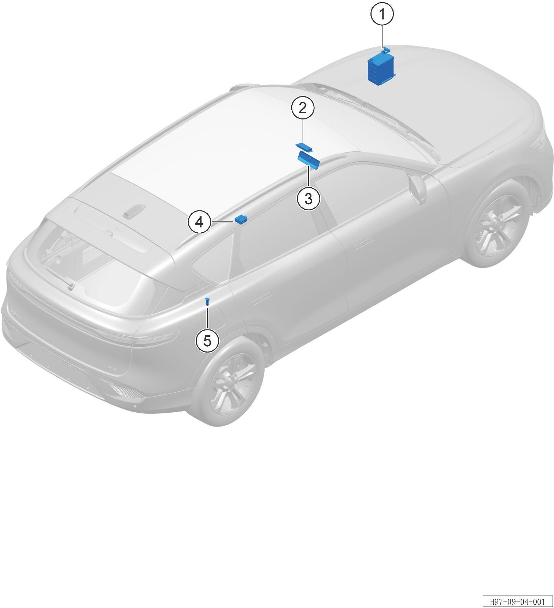

## Подготовка доступа

### 1. Откройте капот

Откройте моторный отсек и убедитесь, что все потребители и кнопка запуска/остановки выключены.

### 2. Снимите панель капота

Снимите панель капота: отстегните 17 фиксирующих клипс и снимите панель.

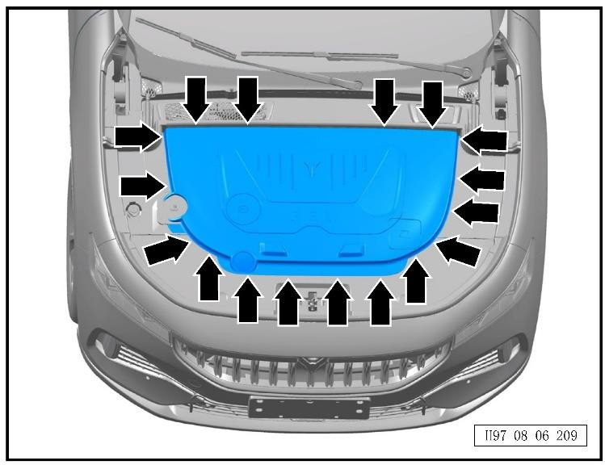

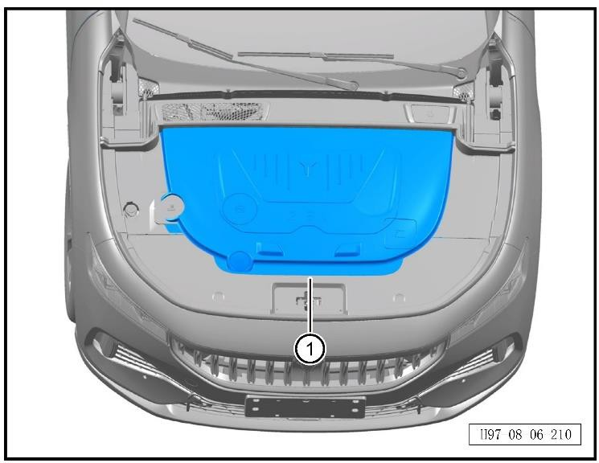

### 3. Снимите левый уплотнитель нижней панели лобового стекла

Для доступа к левой передней облицовке моторного отсека снимите левый уплотнитель нижней панели лобового стекла: отстегните 3 фиксирующие клипсы и снимите уплотнитель.

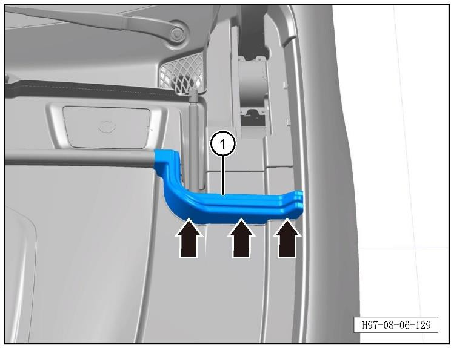

### 4. Снимите левую переднюю облицовку моторного отсека

Отстегните 12 фиксирующих клипс левой передней облицовки моторного отсека и снимите облицовку.

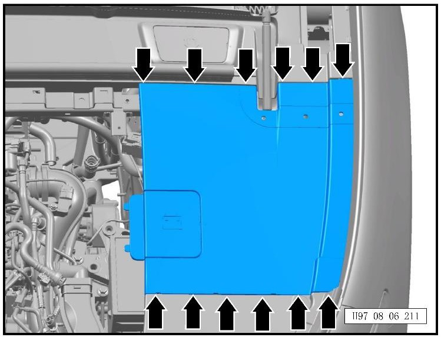

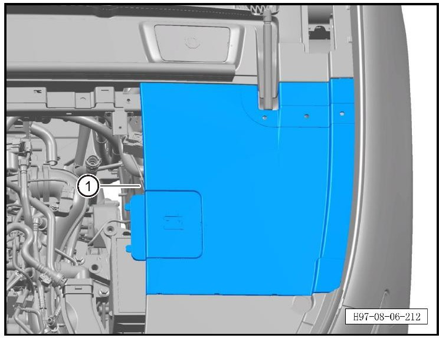

### 5. Снимите передний уплотнитель капота

Отстегните 26 фиксирующих клипс переднего уплотнителя капота и снимите уплотнитель.

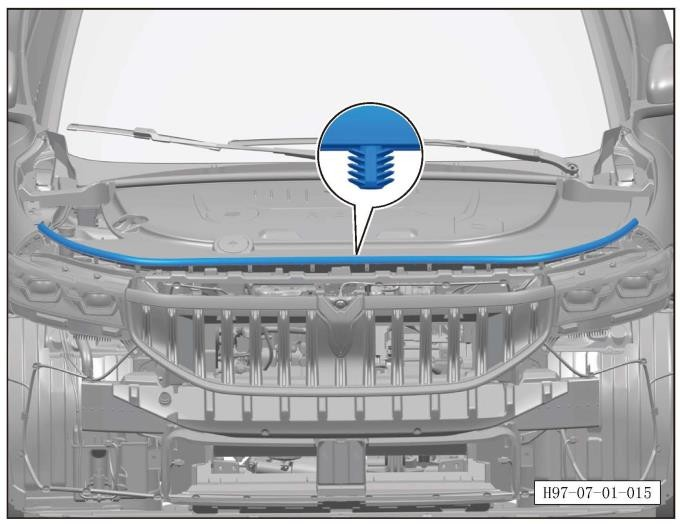

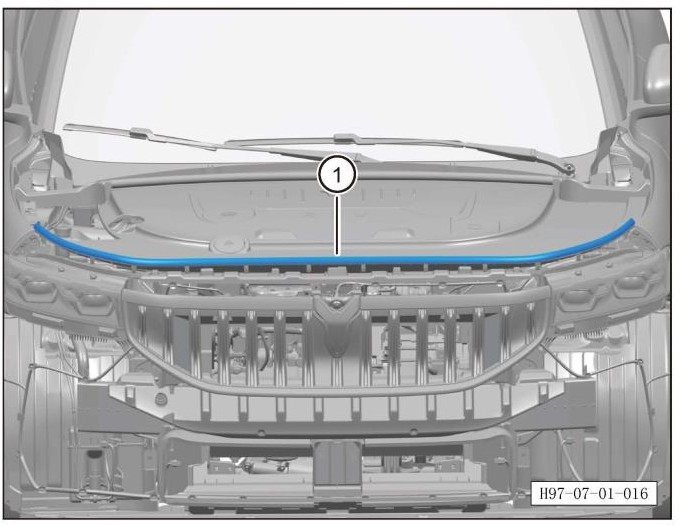

### 6. Снимите переднюю среднюю облицовку моторного отсека

Отстегните 18 фиксирующих клипс передней средней облицовки моторного отсека и снимите облицовку.

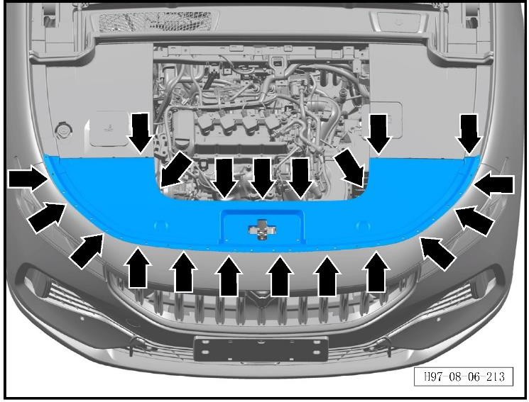

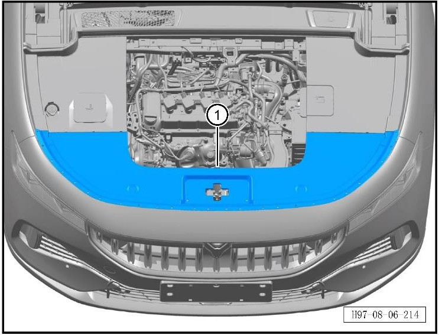

## Демонтаж аккумулятора

### 1. Снимите монтажную пластину аккумулятора

Отверните 2 болта монтажной пластины аккумулятора.

Момент затяжки при установке: `10 ± 1 Н·м`.

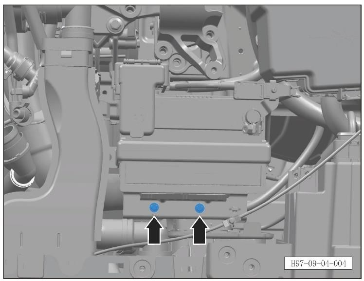

Снимите монтажную пластину.

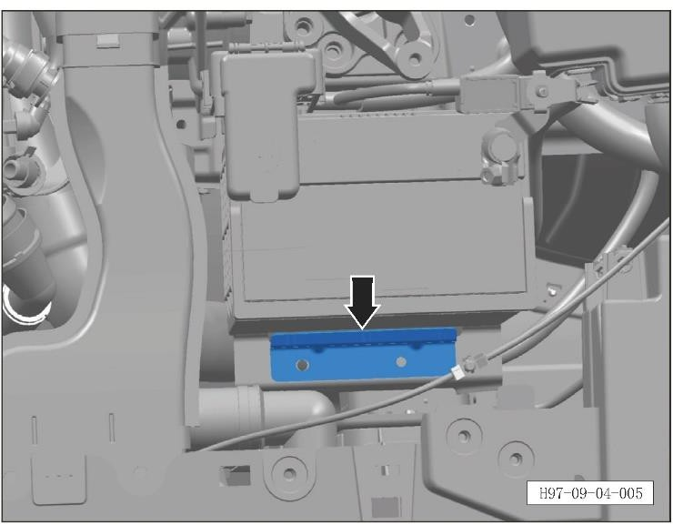

### 2. Снимите фиксирующую планку аккумулятора

Отверните 2 болта фиксирующей планки аккумулятора.

Момент затяжки при установке: `10 ± 1 Н·м`.

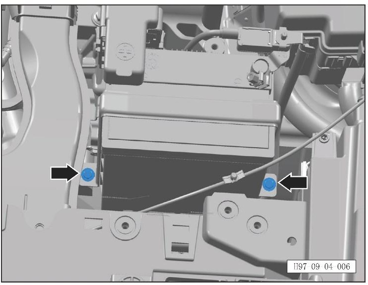

Снимите фиксирующую планку.

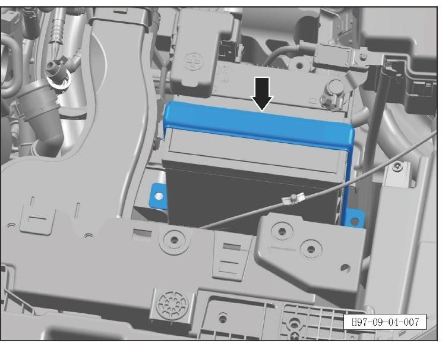

### 3. Отключите кабели аккумулятора

Ослабьте и отключите положительный кабель аккумулятора.

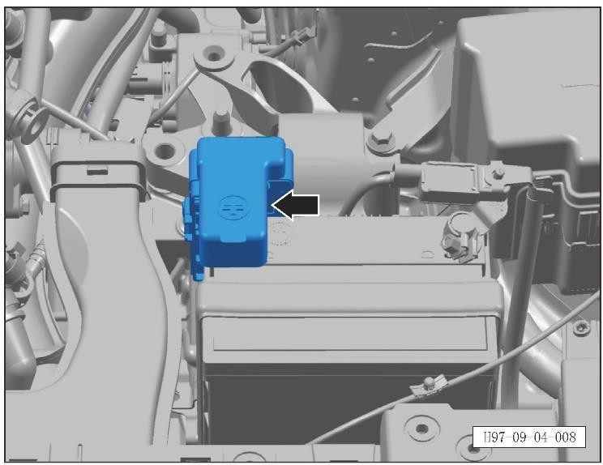

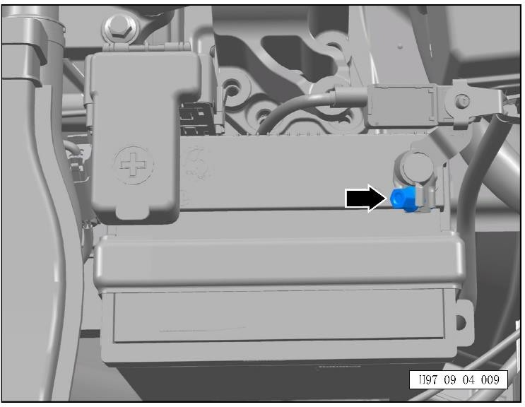

Ослабьте болт крепления отрицательного кабеля аккумулятора и снимите отрицательный кабель.

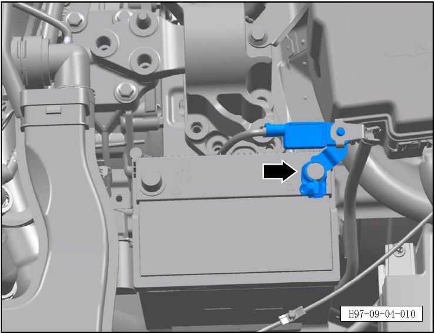

### 4. Извлеките аккумулятор

Аккуратно выньте аккумулятор из посадочного места.

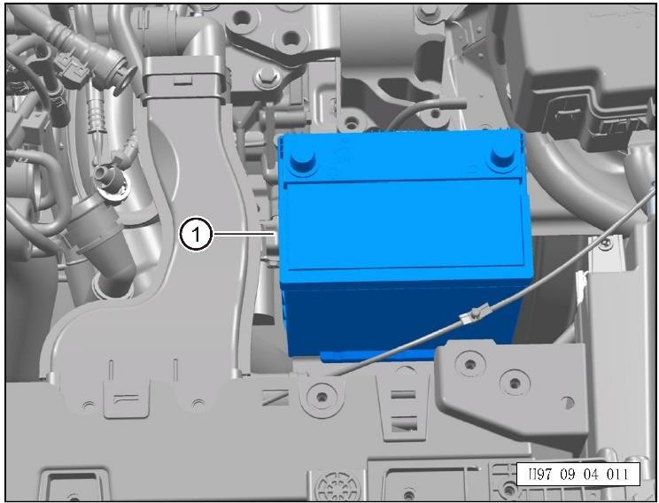

## Установка нового аккумулятора

Установка выполняется в обратном порядке:

1. Установите аккумулятор в посадочное место.
2. Подключите отрицательный и положительный кабели в обратном порядке демонтажа.
3. Установите фиксирующую планку аккумулятора и затяните 2 болта моментом `10 ± 1 Н·м`.
4. Установите монтажную пластину аккумулятора и затяните 2 болта моментом `10 ± 1 Н·м`.
5. Установите переднюю среднюю облицовку моторного отсека.
6. Установите передний уплотнитель капота.
7. Установите левую переднюю облицовку моторного отсека.
8. Установите левый уплотнитель нижней панели лобового стекла.
9. Установите панель капота REV.

## Контроль после установки

- Проверьте, что аккумулятор не перемещается в посадочном месте.
- Проверьте плотность посадки клемм.
- Проверьте, что облицовки и уплотнители установлены на все клипсы.
- Включите автомобиль и убедитесь, что на панели приборов нет ошибок по низковольтному питанию.

## Что уточнить

- Инструмент для снятия клипс облицовок.
- Размеры головок/ключей для болтов монтажной пластины, фиксирующей планки и клемм аккумулятора.
- Момент затяжки клемм аккумулятора.
- Необходимость снятия именно левой передней облицовки моторного отсека.
