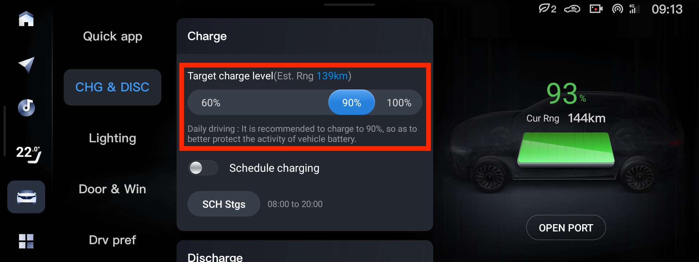
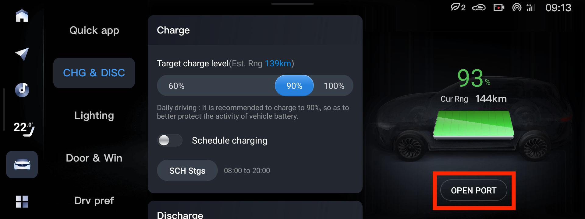
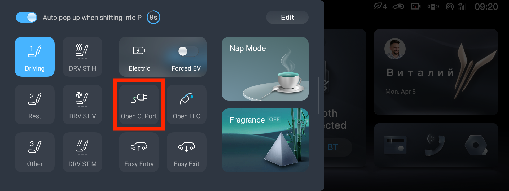
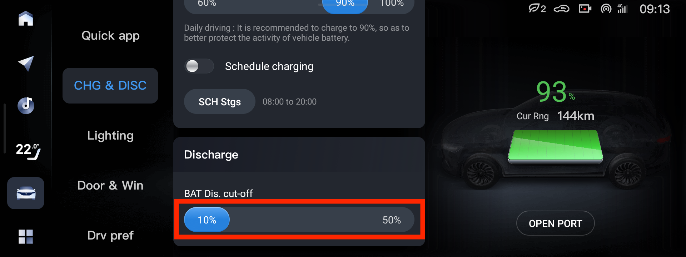

# Уровень заряда

Производитель рекомендует при ежедневном заряде заряжать до 90%. Перед дальней поездкой — заряжать до 100%, чтобы увеличить пробег на одном заряде.

# Открыть порт заряда

Открыть порт заряда можно из настроек машины

Или вытянув шторку слева на центральном экране

Кнопки открытия порта заряда и открытия бензобака на гибриде удобно расположить в шторке так же, как они расположены на машине.

# Разряд

От машины можно питать электроприборы до 3.5 кВт, вставив в порт заряда устройство для разряда, которое можно купить на Aliexpress (!!TODO ссылка!!)

!!TODO фото!!

Максимальный уровень разряда можно задать в настройках

