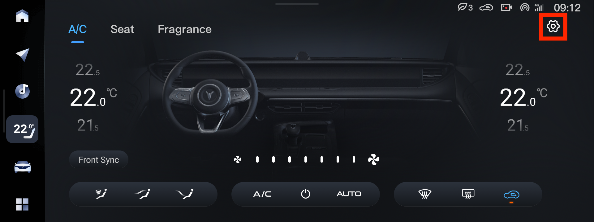
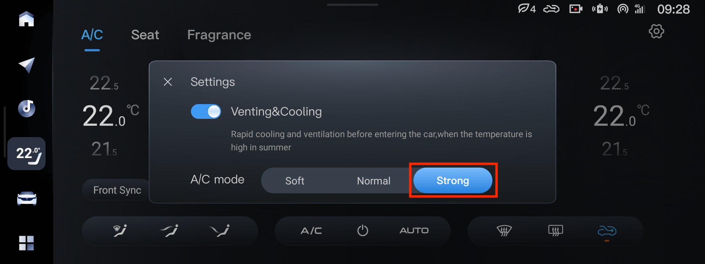
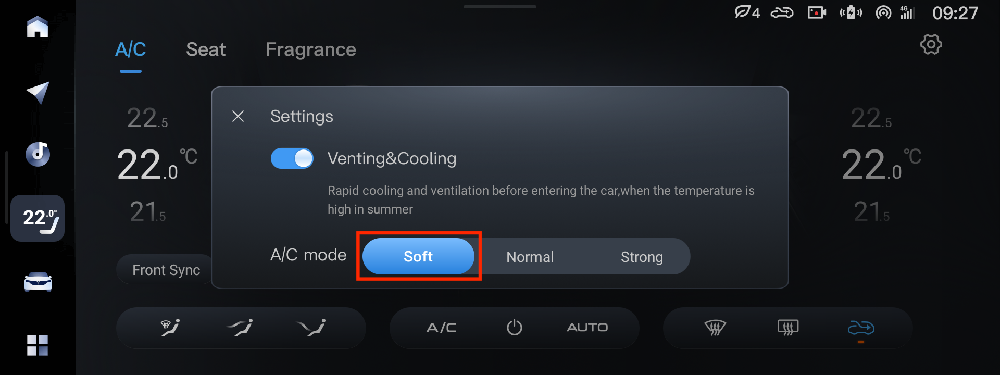
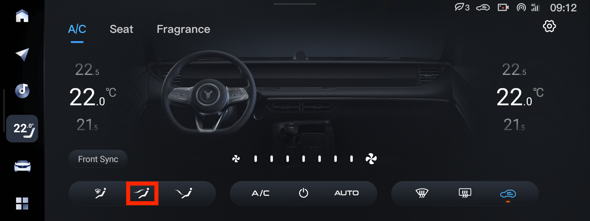
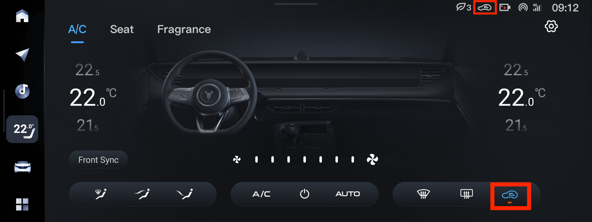
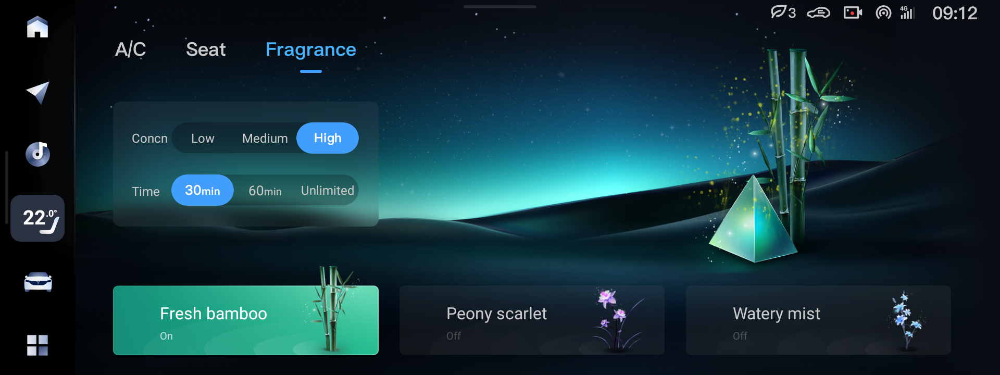
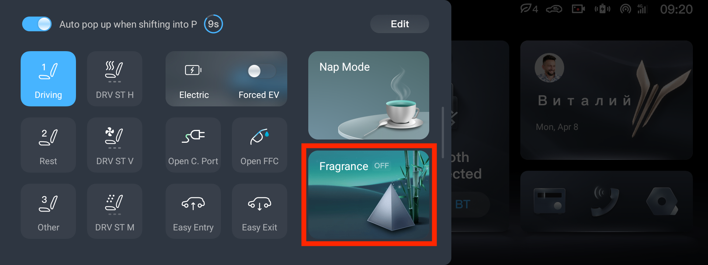

# Настройки

У климата есть настройки в правом верхнем углу.

Зимой рекомендуется включать режим `Strong`

Летом — режим `Soft`, чтобы не дуло резко холодным.

# Сзади

На ресте, чтобы дуло на пассажиров сзади, надо включить режим обдува прямо и закрыть заслонки спереди.

# Рециркуляция

Если в салоне запах выхлопных газов соседних машин — проверьте, что режим рециркуляции стоит в режиме «заслонка закрыта». Так же в режиме климата Auto в холодное время года машина сама открывает заслонку рецикуляции, даже если выбран вариант «заслонка закрыта». Избежать этого можно выключив режим Auto.

При нажатии на экране переключение идёт по трём режимам: открыта, auto, закрыта. При переключении физической кнопкой по двум: открыта, закрыта.

# Ароматизатор

В машине установлены три ароматизатора, включить которые можно на третьей вкладке климата

Или вытянув шторку слева на центральном экране

Перед использованием надо снять с ароматизаторов плёнку:

!!TODO!!: youtube

Так же можно их разобрать и залить другую жидкость

!!TODO!!
