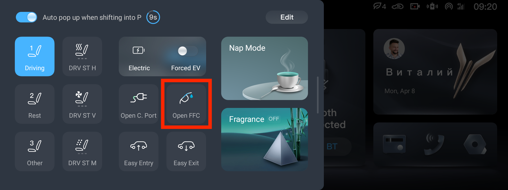
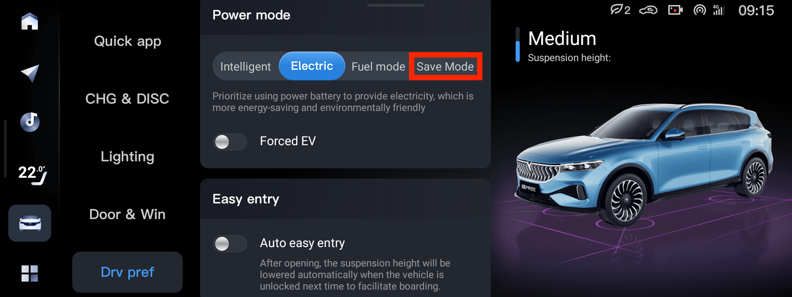
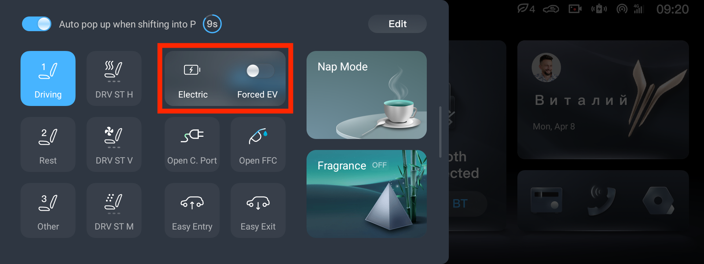
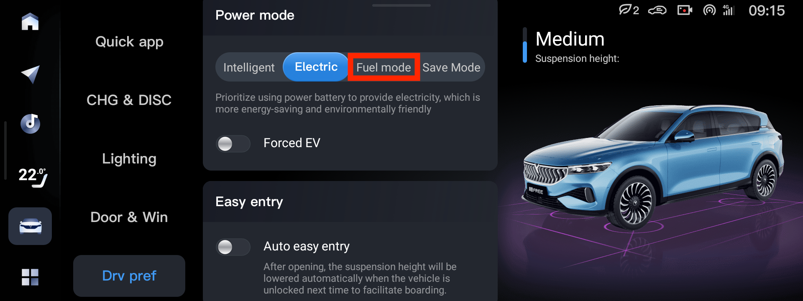

# Топливо

В Voyah Free 2021/2023 можно использовать АИ-92, в Voyah Free 2024/2025 — АИ-95.

Check engine может появляться при использовании некачественного бензина. Чтобы убрать предупреждение, можно выкатать бак и сменить бензин. Или прочитать ошибку сканером OBDII и, если она не про проблемы с ДВС, сбросить её.

# Открыть бензобак

Открыть бензобак можно вытянув шторку слева на центральном экране

Кнопки открытия порта заряда и открытия бензобака на гибриде удобно расположить в шторке так же, как они расположены на машине.

# Save

Используется для сохранения заряда при движении по трассе. В настройках можно выбрать желаемый уровень сохранения заряда (не выше 80%).

При использовании этого режима можно приехать с тем же уровнем батареи, что и выехал, но при высоких скоростях может быть повышенный расход бензина и повышенные обороты (до 3600).

На Voyah Free 2021 (NXP) и ранних прошивках Voyah Free 2024 было другое значение этого режима: он поддерживал тот уровень заряда на котором была включена машина.

Режим выбирается в настройках машины

Или вытянув шторку слева на центральном экране

# Fuel
# Hybrid

В последних прошивках название этого режима измененено на Hybrid.

Эмуляция параллельного гибрида, когда при движении одновременно используется батарея и ДВС. Позволяет проехать примерно двое больше на одном заряде батареи.

Обороты зависят от скорости движения, обычно 1500-2000.

На Voyah Free 2021 (NXP) и ранних прошивках Voyah Free 2024 было другое значение этого режима: он заряжал ВВБ при движении на высокой скорости.

Режим выбирается в настройках машины

Или вытянув шторку слева на центральном экране

# Electro
# Intellectual

Режим движения преимущественно без использования ДВС.

ДВС будет включаться:
1. При понижении заряда ВВБ ниже 20% (на Intellectual 30%)
2. При резком увеличении скорости
3. Если давно не включался и машина решит, что его пора «погонять»

# Forced EV

Дополнительная опция к режиму [Electro](#electro), позволяющая минимизировать использование ДВС.

ДВС будет включаться:
1. При понижении заряда ВВБ ниже 10%
2. Если давно не включался и машина решит, что его пора «погонять»

# Выбор режима движения в зависимости от расстояния

Значения приблизительные для лета. Зимой смело можно делить на полтора-два.

1. 150км — Электро с Forced EV
2. 250км – Hybrid
3. 250+км — Save и в конце доехать до зарядки на Electro остаток заряда ВВБ, если в конце пути есть зарядка

# Движение только на ДВС

Зарядить до 100% и выставить Save в 80%.

После остановки при следующем старте, если процент заряда ВВБ сильно ниже 80% — понижать Save до текущего заряда (например, стартуете с 75% — понижаете Save до 75%).

Делать заряд ВВБ до 100% минимум раз в месяц.

