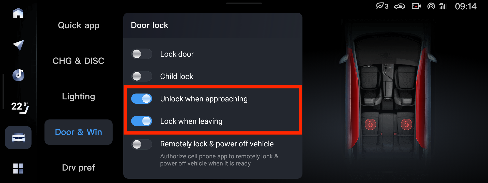

# Виды ключей

1. Прямоугольник (дорест33), физический ключ встроен, батарейка CR2032
2. Капля (дорест39, рест), физический ключ идёт отдельно, батарейка CR1632. Можно сделать копию физического ключа, [подходит болванка для Chevrolet Cruze Buick](https://sl.aliexpress.ru/p?key=k6McsxO)

# Бесключевой доступ

За бесключевой доступ отвечают две настройки:
    - Unlock when approaching (Разблокировать при подходе)
    - Lock when leaving (Заблокировать при уходе)

Бесключевой доступ может высаживать батарейку в ключе,
если ключ хранится близко к машине.

В норме батарейка в ключе не требует замены чаще чем раз в полгода.
