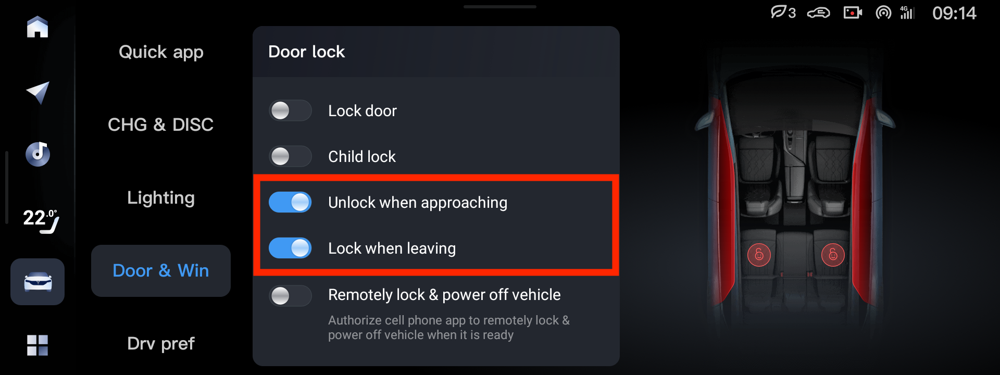

# Виды ключей

1. Прямоугольник (Free 2021), физический ключ встроен, батарейка CR2032
2. Капля (Free 2023-2025), физический ключ идёт отдельно, батарейка CR1632. Можно сделать копию физического ключа, [подходит болванка для Chevrolet Cruze Buick](https://sl.aliexpress.ru/p?key=k6McsxO) или [такая](https://www.ozon.ru/product/klyuch-zazhiganiya-art-lantuxys-1-sht-3242448497/)
3. Трапеция (Free 2026 Моторинвест), батарейка CR2032

# Бесключевой доступ

За бесключевой доступ отвечают две настройки:
- Unlock when approaching (Разблокировать при подходе)
- Lock when leaving (Заблокировать при уходе)

Бесключевой доступ может высаживать батарейку в ключе,
если ключ хранится близко к машине.

В норме батарейка в ключе не требует замены чаще чем раз в полгода.
