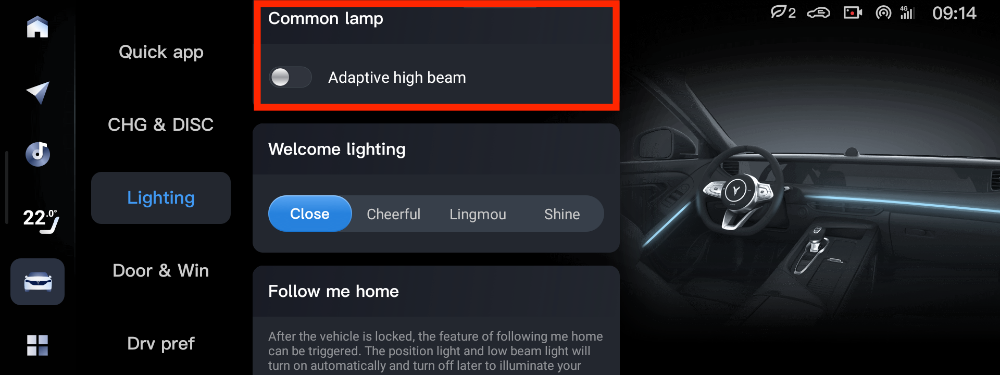

# Адаптивный свет

В рестайлингах эта функция недоступна.

Над доресте можно включить адаптивный дальний свет, который будет выключать сектора.

Плохо работает в сумерках и в городе, рекомендуется включать ночью на трассе.

# Регулировка

