- [5010-10 Кузов в сборе](#5010-10-кузов-в-сборе)
- [5011-10 Передний пол кузова](#5011-10-передний-пол-кузова)
- [5012-10 Задний пол в сборе](#5012-10-задний-пол-в-сборе)
- [5012-20 Задний пол в сборе](#5012-20-задний-пол-в-сборе)
- [5013-10 Кузовные заглушки](#5013-10-кузовные-заглушки)
- [5014-10 Щит передней перегородки](#5014-10-щит-передней-перегородки)
- [5015-10 Передний отсек](#5015-10-передний-отсек)
- [5015-11 Передний отсек](#5015-11-передний-отсек)
- [5016-10 Нижние защитные панели](#5016-10-нижние-защитные-панели)
- [5016-11 Нижние защитные панели](#5016-11-нижние-защитные-панели)
- [5017-10 Капот](#5017-10-капот)
- [5018-10 Передние крылья](#5018-10-передние-крылья)
- [5019-10 Боковина кузова](#5019-10-боковина-кузова)
- [5020-10 Передние стойки кузова](#5020-10-передние-стойки-кузова)
- [5022-10 Задние стойки кузова](#5022-10-задние-стойки-кузова)
- [5023-10 Подкрылки](#5023-10-подкрылки)
- [5024-10 Задняя панель](#5024-10-задняя-панель)
- [5025-10 Багажник и дверь багажника](#5025-10-багажник-и-дверь-багажника)
- [5026-10 Замок двери багажника](#5026-10-замок-двери-багажника)
- [5027-10 Крыша](#5027-10-крыша)
- [5027-11 Крыша](#5027-11-крыша)
- [5028-10 Передние двери](#5028-10-передние-двери)
- [5029-10 Замок передней двери](#5029-10-замок-передней-двери)
- [5030-10 Стекла передних дверей](#5030-10-стекла-передних-дверей)
- [5031-10 Задние двери](#5031-10-задние-двери)
- [5032-10 Замок задней двери](#5032-10-замок-задней-двери)
- [5033-10 Стекла задних дверей](#5033-10-стекла-задних-дверей)
- [5034-10 Личинка замка и ключ](#5034-10-личинка-замка-и-ключ)
- [5035-10 Лючок зарядного порта](#5035-10-лючок-зарядного-порта)
- [5036-10 Лючок топливной горловины](#5036-10-лючок-топливной-горловины)

# 5010-10 Кузов в сборе

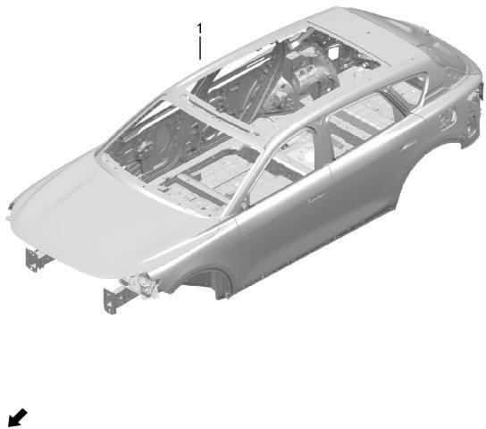

| Поз. | Артикул | Наименование | Кол-во | Системный номер | Примечание |
| ---: | --- | --- | ---: | --- | --- |
| 1 | 500001003 | Сварной кузов в сборе | 1 | H97A5000001CA | замена на 500001007 |
| 1 | 500001004 | Сварной кузов в сборе | 1 | H97A5000001DA | замена на 500001008 |
| 1 | 500001001 | Сварной кузов в сборе | 1 | H97A5000001AA | замена на 500001005 |
| 1 | 500001002 | Сварной кузов в сборе | 1 | H97A5000001BA | замена на 500001006 |
| 1 | 500001007 | Сварной кузов в сборе | 1 | H97A5000000AA | электрическая версия, панорамный люк, грунт, с четырьмя дверями и двумя крышками |
| 1 | 500001008 | Сварной кузов в сборе | 1 | H97A5000000BA | электрическая версия, панорамная крыша, грунт, с четырьмя дверями и двумя крышками |
| 1 | 500001005 | Сварной кузов в сборе | 1 | H97A5000000CA | версия с рендж-экстендером (ДВС), панорамный люк, грунт, с четырьмя дверями и двумя крышками |
| 1 | 500001006 | Сварной кузов в сборе | 1 | H97A5000000DA | версия с рендж-экстендером (ДВС), панорамная крыша, грунт, с четырьмя дверями и двумя крышками |

# 5011-10 Передний пол кузова

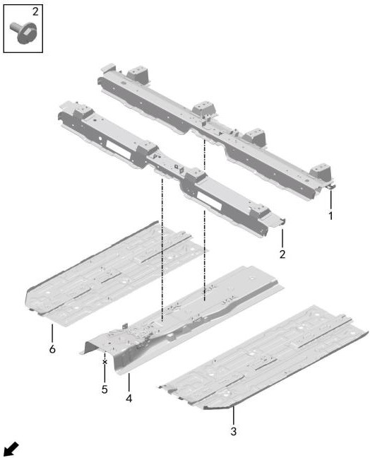

| Поз. | Артикул | Наименование | Кол-во | Системный номер | Примечание |
| ---: | --- | --- | ---: | --- | --- |
| 1 | 510007001 | Передняя поперечина переднего пола | 1 | H97A5101015AB |  |
| 2 | 510008001 | Задняя поперечина переднего пола | 1 | H97A5101020AB |  |
| 3 | 510005002 | Левый передний пол | 1 | H97A5101005AA | электрическая версия |
| 3 | 510005001 | Левый передний пол | 1 | H97A5101005CA | версия с рендж-экстендером (ДВС) |
| 4 | 510004002 | Центральный тоннель пола | 1 | H97A5101025AA | электрическая версия |
| 4 | 510004001 | Центральный тоннель пола | 1 | H97A5101025CA | версия с рендж-экстендером (ДВС) |
| 5 | Q11002001 | Болт | 4 | HQ1400616L2L |  |
| 6 | 510006002 | Правый передний пол | 1 | H97A5101010AA | электрическая версия |
| 6 | 510006001 | Правый передний пол | 1 | H97A5101010CA | версия с рендж-экстендером (ДВС) |

# 5012-10 Задний пол в сборе

- Описание: версия с рендж-экстендером (ДВС)

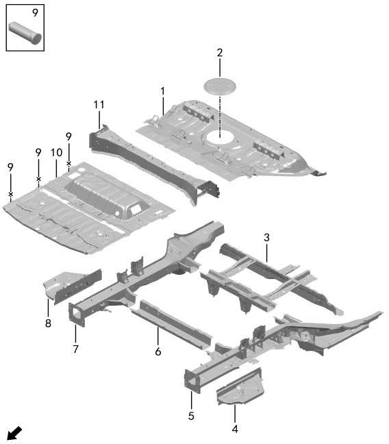

| Поз. | Артикул | Наименование | Кол-во | Системный номер | Примечание |
| ---: | --- | --- | ---: | --- | --- |
| 1 | 510104002 | Задняя секция пола в сборе | 1 | H97A5101030CA | замена на 510104004 |
| 1 | 510104004 | Задняя секция пола в сборе | 1 | H97A5101030CB |  |
| 2 | 500102001 | Крышка сервисного лючка топливного бака | 1 | 5001300-RA01 |  |
| 3 | 280001003 | Поперечина задней части рамы | 1 | H97A2800015CB | замена на 280001006 |
| 3 | 280001006 | Поперечина задней части рамы | 1 | H97A2800015CC |  |
| 4 | 511302001 | Заглушка соединительной пластины правого заднего лонжерона | 1 | H97A5113030AB |  |
| 5 | 511304002 | Правый лонжерон заднего пола | 1 | H97A5113010CB |  |
| 6 | 510106001 | Задняя поперечина заднего пола | 1 | H97A5101090AA |  |
| 7 | 511303002 | Левый лонжерон заднего пола | 1 | H97A5113005CB |  |
| 8 | 511301001 | Заглушка соединительной пластины левого заднего лонжерона | 1 | H97A5113025AA |  |
| 9 | Q11005001 | Приварной болт | 6 | HQ1140620 |  |
| 10 | 510107001 | Основной задний пол в сборе | 1 | H97A5101184AA | замена на 510107002 |
| 10 | 510107002 | Основной задний пол в сборе | 1 | H97A5101184AB |  |
| 11 | 510105001 | Поперечина спинки заднего сиденья | 1 | H97A5101035AA |  |

# 5012-20 Задний пол в сборе

- Описание: электрическая версия

| Поз. | Артикул | Наименование | Кол-во | Системный номер | Примечание |
| ---: | --- | --- | ---: | --- | --- |
| 1 | 510104001 | Задняя секция пола в сборе | 1 | H97A5101030AA | замена на 510104002 |
| 1 | 510104003 | Задняя секция пола в сборе | 1 | H97A5101030AB |  |
| 2 | 500102001 | Крышка сервисного лючка топливного бака | 1 | 5001300-RA01 |  |
| 3 | 280001004 | Поперечина задней части рамы | 1 | H97A2800015AB | замена на 280001005 |
| 3 | 280001005 | Поперечина задней части рамы | 1 | H97A2800015AC |  |
| 4 | 511302001 | Заглушка соединительной пластины правого заднего лонжерона | 1 | H97A5113030AB |  |
| 5 | 511304001 | Правый лонжерон заднего пола | 1 | H97A5113010AB |  |
| 6 | 510106001 | Задняя поперечина заднего пола | 1 | H97A5101090AA |  |
| 7 | 511303001 | Левый лонжерон заднего пола | 1 | H97A5113005AB |  |
| 8 | 511301001 | Заглушка соединительной пластины левого заднего лонжерона | 1 | H97A5113025AA |  |
| 9 | Q11005001 | Приварной болт | 6 | HQ1140620 |  |
| 10 | 510107001 | Основной задний пол в сборе | 1 | H97A5101184AA | замена на 510107002 |
| 10 | 510107002 | Основной задний пол в сборе | 1 | H97A5101184AB |  |
| 11 | 510105001 | Поперечина спинки заднего сиденья | 1 | H97A5101035AA |  |

# 5013-10 Кузовные заглушки

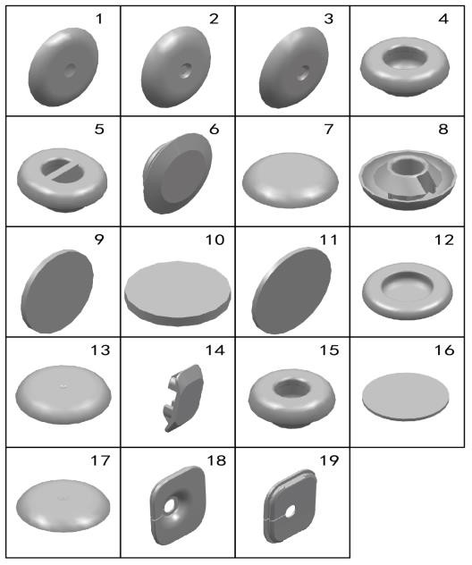

| Поз. | Артикул | Наименование | Кол-во | Системный номер | Примечание |
| ---: | --- | --- | ---: | --- | --- |
| 1 | 820004002 | Заглушка нижней части кузова | 26 | 8200136-RA01 | замена на 820004005 |
| 1 | 820004005 | Заглушка нижней части кузова | 26 | H97A5016008AA |  |
| 2 | 820004001 | Заглушка нижней части кузова | 12 | 8200135-RA01 | замена на 820004006 |
| 2 | 820004006 | Заглушка нижней части кузова | 12 | H97A5016009AA |  |
| 3 | 820003001 | Заглушка боковины | 15 | H97A5016006AA |  |
| 4 | 820004003 | Заглушка нижней части кузова | 6 | 8200142-RA01 | замена на 820004008 |
| 4 | 820004008 | Заглушка нижней части кузова | 6 | H97A5016017AA |  |
| 5 | 820004004 | Заглушка нижней части кузова | 4 | 8200143-RA01 | замена на 820004007 |
| 5 | 820004007 | Заглушка нижней части кузова | 4 | H97A5016010AA |  |
| 6 | 820008001 | Заглушка внутренней панели передней двери | 16 | 8200154-RA01 | замена на 820008002 |
| 6 | 820008002 | Заглушка внутренней панели передней двери | 16 | H97A5016007AA |  |
| 7 | 820007001 | Заглушка передней части кузова | 24 | 8200153-RA01 | замена на 820007002 |
| 7 | 820007002 | Заглушка передней части кузова | 24 | H97A5016016AA |  |
| 8 | 820006002 | Заглушка передней панели | 10 | 8200151-RA01 | замена на 820006003 |
| 8 | 820006003 | Заглушка передней панели | 10 | H97A5016005AA |  |
| 9 | 501601002 | Наклейка-заплатка | 24 | H97A5016003AA | размер Φ30 |
| 10 | 501601001 | Наклейка-заплатка | 44 | H97A5016002AA | размер Φ18 |
| 11 | 501601004 | Наклейка-заплатка | 6 | H97A5016013AA | размер Φ40 |
| 12 | 501602001 | Заглушка | 1 | H97A5016012AA | размер Φ36, без пневмоподвески |
| 13 | 820008002 | Заглушка внутренней панели передней двери | 22 | 8200155-RA01 | замена на 820008003 |
| 14 | 501603001 | Заглушка дренажного отверстия двери багажника | 3 | H97A5016023AA |  |
| 15 | 820005001 | Заглушка передней части кузова | 21 | 8200141-RA01 | замена на 820007002 |
| 16 | 501601003 | Наклейка-заплатка | 8 | H97A5016011AA | размер Φ50 |
| 17 | 820006001 | Заглушка передней панели | 1 | 8200156-RA01 | замена на 820006004 |
| 17 | 820006004 | Заглушка передней панели | 1 | H97A5016020AA |  |
| 18 | 501306001 | Внутренняя заглушка стойки A слева | 1 | H97A5013016AA |  |
| 19 | 501307001 | Внутренняя заглушка стойки A справа | 1 | H97A5013017AA |  |

# 5014-10 Щит передней перегородки

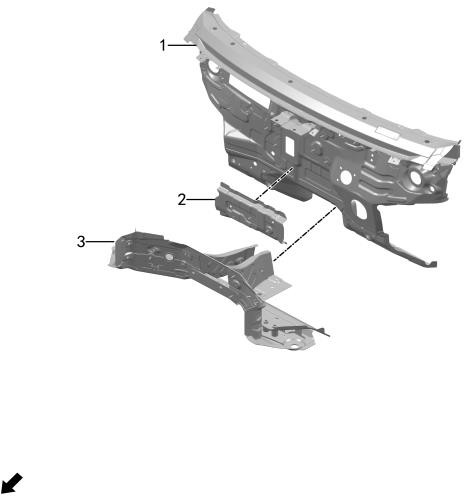

| Поз. | Артикул | Наименование | Кол-во | Системный номер | Примечание |
| ---: | --- | --- | ---: | --- | --- |
| 1 | 530006002 | Щит передней перегородки | 1 | H97A5300015CA | версия с рендж-экстендером (ДВС) |
| 1 | 530006001 | Щит передней перегородки | 1 | H97A5300015AA | электрическая версия |
| 2 | 530105001 | Поперечина передней перегородки | 1 | H97A5301112AA |  |
| 3 | 530003002 | Усилитель передней перегородки | 1 | H97A5300020CC | замена на 530003003 |
| 3 | 530003003 | Усилитель передней перегородки | 1 | H97A5300020CD | версия с рендж-экстендером (ДВС) |
| 3 | 530003001 | Усилитель передней перегородки | 1 | H97A5300020AA | замена на 530003004 |
| 3 | 530003004 | Усилитель передней перегородки | 1 | H97A5300020AB | электрическая версия |

# 5015-10 Передний отсек

- Описание: версия с рендж-экстендером (ДВС)

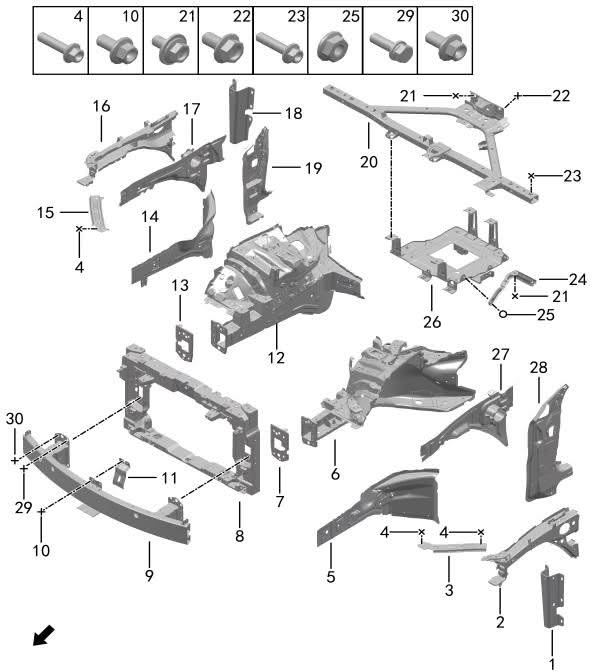

| Поз. | Артикул | Наименование | Кол-во | Системный номер | Примечание |
| ---: | --- | --- | ---: | --- | --- |
| 1 | 540135002 | Нижний усилитель левой стойки A | 1 | H97A5402039AB |  |
| 2 | 511201001 | Усилитель левой панели переднего отсека | 1 | H97A5020001AA |  |
| 3 | 530101001 | Левая монтажная пластина верхней поперечины радиатора | 1 | H97A5301021AA |  |
| 4 | Q11001008 | Фланцевый болт | 8 | HQ1840620 | замена на Q11002003 |
| 4 | Q11002003 | Болт | 8 | HQ140B0618L |  |
| 5 | 510305001 | Наружная панель передней части левого лонжерона | 1 | H97A5103016AA |  |
| 6 | 530007001 | Левый передний лонжерон | 1 | H97A2800005CA |  |
| 6 | 530007004 | Левый передний лонжерон | 1 | H97A2800005CB | замена на 530007006 |
| 6 | 530007006 | Левый передний лонжерон | 1 | H97A2800005CD |  |
| 7 | 530102001 | Левая соединительная пластина переднего усилителя бампера | 1 | H97A5301057AA |  |
| 8 | 500608001 | Передняя рамка | 1 | H97A5006036AA |  |
| 9 | 532001001 | Передний усилитель бампера | 1 | H97A5320005AA |  |
| 10 | Q11001001 | Фланцевый болт | 2 | HQ1840612 |  |
| 11 | 500601001 | Кронштейн замка переднего модуля | 1 | H97A5006010AA |  |
| 12 | 530008001 | Правый передний лонжерон | 1 | H97A2800010CB |  |
| 12 | 530008003 | Правый передний лонжерон | 1 | H97A2800010CC | замена на 530008005 |
| 12 | 530008005 | Правый передний лонжерон | 1 | H97A2800010CE |  |
| 13 | 530103001 | Правая соединительная пластина переднего усилителя бампера | 1 | H97A5301058AA |  |
| 14 | 510306001 | Наружная панель передней части правого лонжерона | 1 | H97A5103034AB |  |
| 15 | 530104001 | Правая монтажная пластина верхней поперечины радиатора | 1 | H97A5301111AB |  |
| 16 | 511202001 | Усилитель правой панели переднего отсека | 1 | H97A5020020AA |  |
| 17 | 530002002 | Правая панель переднего отсека | 1 | H97A5300010AB |  |
| 18 | 540136002 | Нижний усилитель правой стойки A | 1 | H97A5402040AB |  |
| 19 | 530005003 | Нижняя часть внутренней панели правой стойки A | 1 | H97A5300030AC |  |
| 20 | 500110003 | Комбинированная тяга отсека | 1 | H97A5001060CC | замена на 500110005 |
| 20 | 500110005 | Комбинированная тяга отсека | 1 | H97A5001060CD |  |
| 21 | Q11002009 | Болт | 5 | HQY140B0818L |  |
| 22 | Q11001071 | Фланцевый болт | 2 | HQ1860816L |  |
| 23 | Q11001026 | Фланцевый болт | 4 | HQ1840850 |  |
| 24 | 500114001 | Косая опорная пластина кронштейна GCU | 1 | H97A5001056CA |  |
| 25 | Q21001002 | Фланцевая гайка | 2 | HQ32006 |  |
| 26 | 500113001 | Монтажный лоток GCU | 1 | H97A5001055CB |  |
| 27 | 530001001 | Левая панель переднего отсека | 1 | H97A5300005AA |  |
| 28 | 530004003 | Нижняя часть внутренней панели левой стойки A | 1 | H97A5300025AC |  |
| 29 | Q11001011 | Фланцевый болт | 4 | HQ1840625L1 |  |
| 30 | Q11002015 | Болт | 8 | HQ1461035 |  |

# 5015-11 Передний отсек

- Описание: электрическая версия

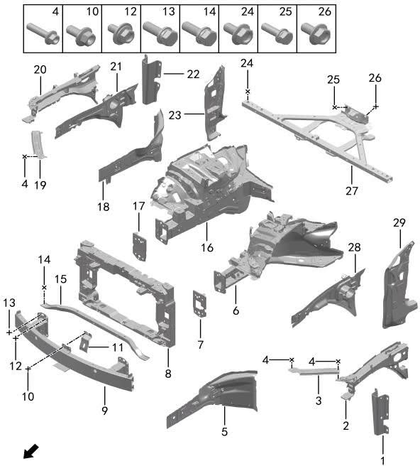

| Поз. | Артикул | Наименование | Кол-во | Системный номер | Примечание |
| ---: | --- | --- | ---: | --- | --- |
| 1 | 540135002 | Нижний усилитель левой стойки A | 1 | H97A5402039AB |  |
| 2 | 511201001 | Усилитель левой панели переднего отсека | 1 | H97A5020001AA |  |
| 3 | 530101001 | Левая монтажная пластина верхней поперечины радиатора | 1 | H97A5301021AA |  |
| 4 | Q11001008 | Фланцевый болт | 8 | HQ1840620 | замена на Q11002003 |
| 4 | Q11002003 | Болт | 8 | HQ140B0618L |  |
| 5 | 510305001 | Наружная панель передней части левого лонжерона | 1 | H97A5103016AA |  |
| 6 | 530007002 | Левый передний лонжерон | 1 | H97A2800005AA |  |
| 6 | 530007003 | Левый передний лонжерон | 1 | H97A2800005AB | замена на 530007005 |
| 6 | 530007005 | Левый передний лонжерон | 1 | H97A2800005AD |  |
| 7 | 530102001 | Левая соединительная пластина переднего усилителя бампера | 1 | H97A5301057AA |  |
| 8 | 500608001 | Передняя рамка | 1 | H97A5006036AA |  |
| 9 | 532001001 | Передний усилитель бампера | 1 | H97A5320005AA |  |
| 10 | Q11001011 | Фланцевый болт | 4 | HQ1840625L1 |  |
| 11 | 500601001 | Кронштейн замка переднего модуля | 1 | H97A5006010AA |  |
| 12 | Q11001011 | Фланцевый болт | 4 | HQ1840625L1 |  |
| 13 | Q11002015 | Болт | 8 | HQ1461035 |  |
| 14 | Q11002014 | Болт | 2 | HQ1460825 |  |
| 15 | 500119001 | Поперечина моторного отсека | 1 | H97A5001193AA |  |
| 16 | 530008002 | Правый передний лонжерон | 1 | H97A2800010AB |  |
| 16 | 530008004 | Правый передний лонжерон | 1 | H97A2800010AC | замена на 530008006 |
| 16 | 530008006 | Правый передний лонжерон | 1 | H97A2800010AE |  |
| 17 | 530103001 | Правая соединительная пластина переднего усилителя бампера | 1 | H97A5301058AA |  |
| 18 | 510306001 | Наружная панель передней части правого лонжерона | 1 | H97A5103034AB |  |
| 19 | 530104001 | Правая монтажная пластина верхней поперечины радиатора | 1 | H97A5301111AB |  |
| 20 | 511202001 | Усилитель правой панели переднего отсека | 1 | H97A5020020AA |  |
| 21 | 530002002 | Правая панель переднего отсека | 1 | H97A5300010AB |  |
| 22 | 540136002 | Нижний усилитель правой стойки A | 1 | H97A5402040AB |  |
| 23 | 530005003 | Нижняя часть внутренней панели правой стойки A | 1 | H97A5300030AC |  |
| 24 | Q11001026 | Фланцевый болт | 4 | HQ1840850 |  |
| 25 | Q11002009 | Болт | 2 | HQY140B0818L |  |
| 26 | Q11001071 | Фланцевый болт | 2 | HQ1860816L |  |
| 27 | 500110004 | Комбинированная тяга отсека | 1 | H97A5001060AB |  |
| 28 | 530001001 | Левая панель переднего отсека | 1 | H97A5300005AA |  |
| 29 | 530004003 | Нижняя часть внутренней панели левой стойки A | 1 | H97A5300025AC |  |

# 5016-10 Нижние защитные панели

- Описание: версия с рендж-экстендером (ДВС)

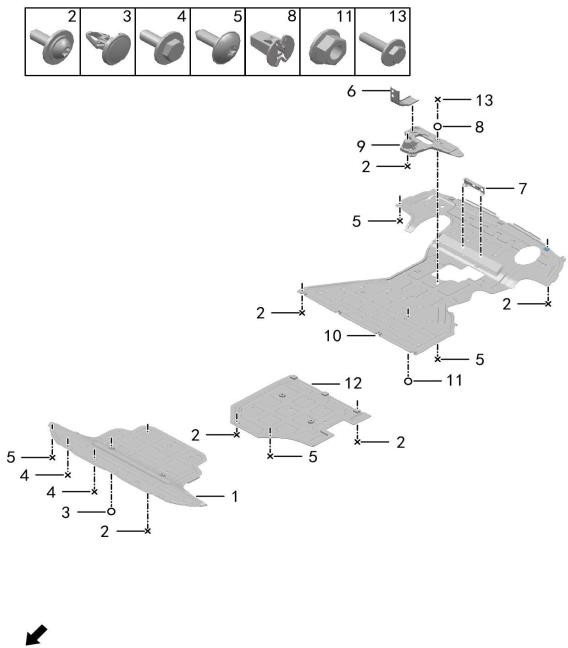

| Поз. | Артикул | Наименование | Кол-во | Системный номер | Примечание |
| ---: | --- | --- | ---: | --- | --- |
| 1 | 512005001 | Передняя нижняя защитная панель | 1 | H97A5120001AA |  |
| 2 | Q12001001 | Винт с внутренним шестигранником | 17 | HQY215B0618L2 |  |
| 3 | Q41001002 | Клипса | 2 | 09406-08302 |  |
| 4 | Q11002006 | Болт | 5 | HQ140B0626L2L |  |
| 5 | Q12001018 | Винт с внутренним шестигранником | 20 | HQY2714816L2 |  |
| 6 | 500122001 | Фиксирующий кронштейн нижней панели | 1 | H97A5001268CA |  |
| 7 | 500121001 | Кронштейн крепления задней нижней панели | 1 | H97A5001261AA |  |
| 8 | Q21004007 | Пластиковая гайка | 3 | 09138-48001 |  |
| 9 | 280201001 | Кронштейн задней нижней защитной панели | 1 | 2802471-RA51 |  |
| 10 | 512006003 | Задняя нижняя защитная панель | 1 | H97A5120002AB | замена на 512006005 |
| 10 | 512006005 | Задняя нижняя защитная панель | 1 | H97A5120002AC |  |
| 11 | Q21008004 | Шестигранная гайка | 2 | HQ32206L1L |  |
| 12 | 512007001 | Средняя нижняя защитная панель | 1 | H97A5120003AA | замена на 512007002 |
| 12 | 512007002 | Средняя нижняя защитная панель | 1 | H97A5120003AB |  |
| 13 | Q11002041 | Болт | 3 | HQ140B0626L2LS |  |

# 5016-11 Нижние защитные панели

- Описание: электрическая версия

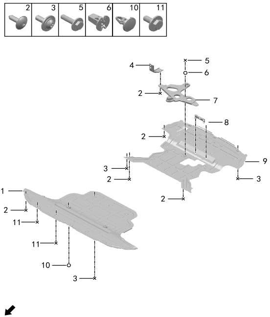

| Поз. | Артикул | Наименование | Кол-во | Системный номер | Примечание |
| ---: | --- | --- | ---: | --- | --- |
| 1 | 512005002 | Передняя нижняя защитная панель | 1 | H97A5120001BA | замена на 512005001 |
| 1 | 512005001 | Передняя нижняя защитная панель | 1 | H97A5120001AA |  |
| 2 | Q11002006 | Болт | 5 | HQ140B0626L2L |  |
| 3 | Q12001001 | Винт с внутренним шестигранником | 11 | HQY215B0618L2 |  |
| 4 | 500122001 | Фиксирующий кронштейн нижней панели | 1 | H97A5001268CA |  |
| 5 | Q11002041 | Болт | 3 | HQ140B0626L2LS |  |
| 6 | Q21004007 | Пластиковая гайка | 2 | 09138-48001 |  |
| 7 | 280201002 | Кронштейн задней нижней защитной панели | 1 | 2802471-RA01 |  |
| 8 | 500121001 | Кронштейн крепления задней нижней панели | 1 | H97A5001261AA |  |
| 9 | 512006006 | Задняя нижняя защитная панель | 1 | H97A5120002BC |  |
| 9 | 512006004 | Задняя нижняя защитная панель | 1 | H97A5120002BB | замена на 512006006 |
| 10 | Q41001002 | Клипса | 2 | 09406-08302 |  |
| 11 | Q12001018 | Винт с внутренним шестигранником | 18 | HQY2714816L2 |  |

# 5017-10 Капот

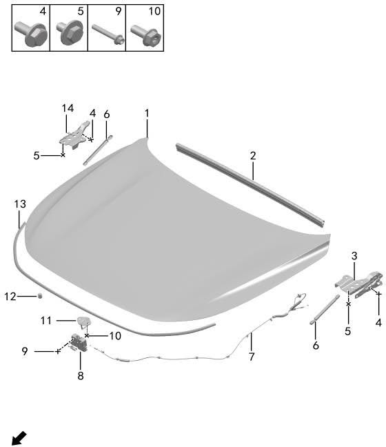

| Поз. | Артикул | Наименование | Кол-во | Системный номер | Примечание |
| ---: | --- | --- | ---: | --- | --- |
| 1 | 840202001 | Капот | 1 | H97A8402010AA |  |
| 2 | 840203001 | Задний уплотнитель капота | 1 | H97A8402014AA |  |
| 3 | 840208001 | Левая петля капота | 1 | H97A8402031AA |  |
| 4 | Q11002025 | Болт | 4 | HQY140B0820T8 |  |
| 5 | Q11002038 | Болт | 6 | HQY140B0818T8L |  |
| 6 | 840205001 | Опора капота | 2 | H97A8402017AA |  |
| 7 | 840206001 | Трос замка капота | 1 | H97A8402021AA |  |
| 8 | 840210001 | Замок капота в сборе | 1 | H97A8402035AA |  |
| 9 | Q11001026 | Фланцевый болт | 2 | HQ1840850 |  |
| 10 | Q11002026 | Болт | 2 | HQY1840820X2 |  |
| 11 | 840211001 | Скоба замка капота | 1 | H97A8402038AA |  |
| 12 | 820010001 | Буфер капота | 4 | 8200219-01 |  |
| 13 | 840204001 | Передний уплотнитель капота | 1 | H97A8402019AA |  |
| 14 | 840209001 | Правая петля капота | 1 | H97A8402032AA |  |

# 5018-10 Передние крылья

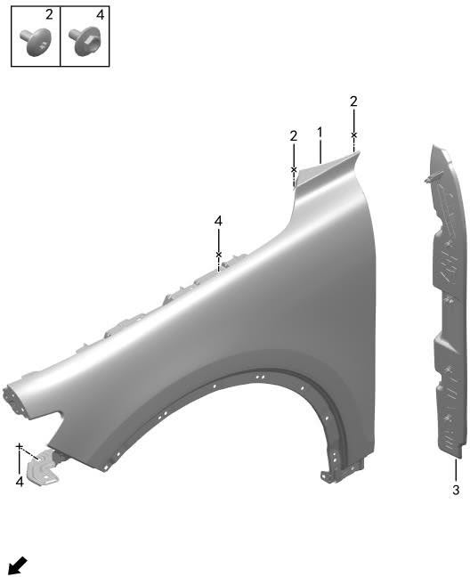

| Поз. | Артикул | Наименование | Кол-во | Системный номер | Примечание |
| ---: | --- | --- | ---: | --- | --- |
| 1 | 840303001 | Левое переднее крыло | 1 | H97A8403021AA |  |
| 1 | 840304001 | Правое переднее крыло | 1 | H97A8403022AA |  |
| 2 | Q11001091 | Фланцевый болт | 4 | HQY215B0612 |  |
| 3 | 840301001 | Левая декоративная накладка крыла | 1 | H97A8403003AA |  |
| 3 | 840302001 | Правая декоративная накладка крыла | 1 | H97A8403004AA |  |
| 4 | Q11001069 | Фланцевый болт | 18 | HQ1860612L |  |

# 5019-10 Боковина кузова

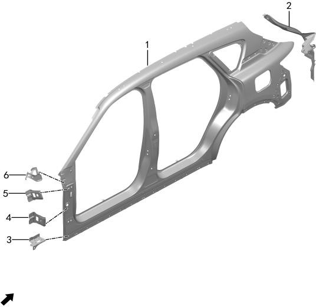

| Поз. | Артикул | Наименование | Кол-во | Системный номер | Примечание |
| ---: | --- | --- | ---: | --- | --- |
| 1 | 540119002 | Наружная панель левой боковины | 1 | H97A5401209AA |  |
| 1 | 540120003 | Наружная панель правой боковины | 1 | H97A5401214AA | версия с рендж-экстендером (ДВС) |
| 1 | 540120004 | Наружная панель правой боковины | 1 | H97A5401214CA | электрическая версия |
| 2 | 540117001 | Левый задний водосток | 1 | H97A5401075AA |  |
| 2 | 540118001 | Правый задний водосток | 1 | H97A5401080AA |  |
| 3 | 540105001 | Левый передний кронштейн наружной боковины | 1 | H97A5401065AA |  |
| 3 | 540106001 | Правый передний кронштейн наружной боковины | 1 | H97A5401070AA |  |
| 4 | 540102001 | Нижний кронштейн крепления крыла | 2 | H97A5401016AA |  |
| 5 | 540101001 | Средний задний кронштейн переднего крыла | 2 | H97A5401013AA |  |
| 6 | 540103001 | Левый верхний задний кронштейн переднего крыла | 1 | H97A5401045AA |  |
| 6 | 540104001 | Правый верхний задний кронштейн переднего крыла | 1 | H97A5401050AA |  |

# 5020-10 Передние стойки кузова

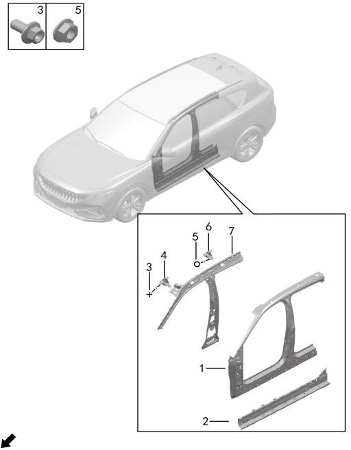

| Поз. | Артикул | Наименование | Кол-во | Системный номер | Примечание |
| ---: | --- | --- | ---: | --- | --- |
| 1 | 540133005 | Усилитель левой боковины кузова в сборе | 1 | H97A5401015AD | без стеклянной крыши, панорамный люк |
| 1 | 540133006 | Усилитель левой боковины кузова в сборе | 1 | H97A5401015BD | затемняемое стекло и атмосферная подсветка, без люка |
| 1 | 540134005 | Усилитель правой боковины кузова в сборе | 1 | H97A5401020AD | без стеклянной крыши, панорамный люк |
| 1 | 540134006 | Усилитель правой боковины кузова в сборе | 1 | H97A5401020BD | затемняемое стекло и атмосферная подсветка, без люка |
| 2 | 510002002 | Внутренняя панель левого порога | 1 | H97A5100015CA |  |
| 2 | 510002001 | Внутренняя панель левого порога | 1 | H97A5100015AA |  |
| 2 | 510003002 | Внутренняя панель правого порога | 1 | H97A5100020CA |  |
| 2 | 510003001 | Внутренняя панель правого порога | 1 | H97A5100020AA |  |
| 3 | Q11001001 | Фланцевый болт | 4 | HQ1840612 |  |
| 4 | 500106001 | Кронштейн левой передней ручки первого ряда | 1 | H97A5001041AB |  |
| 4 | 500107001 | Кронштейн правой передней ручки первого ряда | 1 | H97A5001043AB |  |
| 5 | Q21001010 | Фланцевая гайка | 8 | HQ32406 |  |
| 6 | 500108001 | Кронштейн левой задней ручки первого ряда | 1 | H97A5001045AB |  |
| 6 | 500109001 | Кронштейн правой задней ручки первого ряда | 1 | H97A5001047AB |  |
| 7 | 540121002 | Внутренняя панель левой боковины кузова в сборе | 1 | H97A5401025AD |  |
| 7 | 540122002 | Внутренняя панель правой боковины кузова в сборе | 1 | H97A5401030AD |  |

# 5022-10 Задние стойки кузова

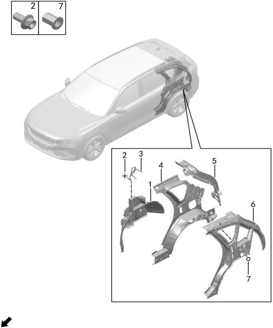

| Поз. | Артикул | Наименование | Кол-во | Системный номер | Примечание |
| ---: | --- | --- | ---: | --- | --- |
| 1 | 540128001 | Внутренняя панель левой задней колесной арки | 1 | H97A5401265AA | остатки на складе |
| 1 | 540128002 | Внутренняя панель левой задней колесной арки | 1 | H97A5401265AB |  |
| 1 | 540127001 | Внутренняя панель правой задней колесной арки | 1 | H97A5401250AA | остатки на складе |
| 1 | 540127002 | Внутренняя панель правой задней колесной арки | 1 | H97A5401250AB |  |
| 2 | Q11001015 | Фланцевый болт | 6 | HQ1840816 |  |
| 3 | 500115001 | Левая направляющая заднего ремня безопасности | 1 | H97A5001082AA |  |
| 3 | 500116001 | Правая направляющая заднего ремня безопасности | 1 | H97A5001086AA |  |
| 4 | 540129001 | Наружная панель левой задней колесной арки | 1 | H97A5401255AA | панорамный люк, без стеклянной крыши |
| 4 | 540129002 | Наружная панель левой задней колесной арки | 1 | H97A5401255BA | без люка, затемняемое стекло и атмосферная подсветка |
| 4 | 540130003 | Наружная панель правой задней колесной арки | 1 | H97A5401260CA | версия с рендж-экстендером (ДВС), панорамный люк, без стеклянной крыши |
| 4 | 540130004 | Наружная панель правой задней колесной арки | 1 | H97A5401260DA | версия с рендж-экстендером (ДВС), без люка, затемняемое стекло и атмосферная подсветка |
| 4 | 540130001 | Наружная панель правой задней колесной арки | 1 | H97A5401260AA | электрическая версия, панорамный люк, без стеклянной крыши |
| 5 | 540125001 | Внутренняя панель левой стойки D | 1 | H97A5401185AA |  |
| 5 | 540126001 | Внутренняя панель правой стойки D | 1 | H97A5401190AA |  |
| 6 | 540115001 | Усилитель левой задней боковины | 1 | H97A5401299AA | панорамный люк, без стеклянной крыши |
| 6 | 540115002 | Усилитель левой задней боковины | 1 | H97A5401299BA | без люка, затемняемое стекло и атмосферная подсветка |
| 6 | 540116001 | Усилитель правой задней боковины | 1 | H97A5401314AA | панорамный люк, без стеклянной крыши |
| 6 | 540116002 | Усилитель правой задней боковины | 1 | H97A5401314BA | без люка, затемняемое стекло и атмосферная подсветка |
| 7 | Q21006001 | Заклепочная гайка | 6 | HQY37206135 |  |

# 5023-10 Подкрылки

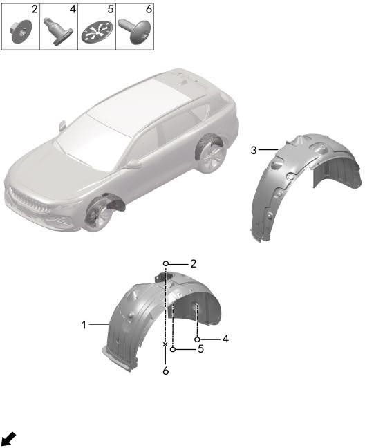

| Поз. | Артикул | Наименование | Кол-во | Системный номер | Примечание |
| ---: | --- | --- | ---: | --- | --- |
| 1 | 310111001 | Левый передний подкрылок | 1 | H97A3101005AB |  |
| 1 | 310112001 | Правый передний подкрылок | 1 | H97A3101010AB | замена на 310112002 |
| 1 | 310112002 | Правый передний подкрылок | 1 | H97A3101010AC |  |
| 2 | Q21004001 | Пластиковая гайка | 34 | HQY38001 |  |
| 3 | 310113001 | Левый задний подкрылок | 1 | H97A3101015AA |  |
| 3 | 310114001 | Правый задний подкрылок | 1 | H97A3101020AA |  |
| 4 | Q41001001 | Клипса | 8 | 09406-08301 |  |
| 5 | Q41003002 | Металлическая клипса | 2 | HQY68901L2 |  |
| 6 | Q12001018 | Винт с внутренним шестигранником | 20 | HQY2714816L2 |  |

# 5024-10 Задняя панель

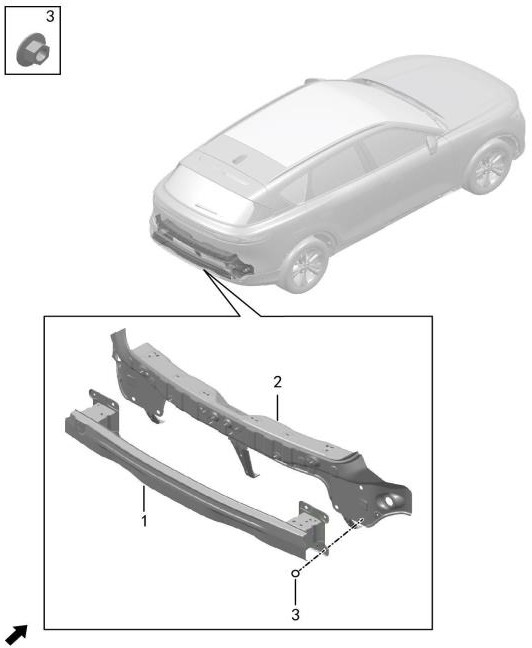

| Поз. | Артикул | Наименование | Кол-во | Системный номер | Примечание |
| ---: | --- | --- | ---: | --- | --- |
| 1 | 532002001 | Задний усилитель бампера в сборе | 1 | H97A5320010AA |  |
| 2 | 560101001 | Сварной узел задней панели | 1 | H97A5601030AA |  |
| 3 | Q21008002 | Шестигранная гайка | 8 | HQ32208L1L |  |

# 5025-10 Багажник и дверь багажника

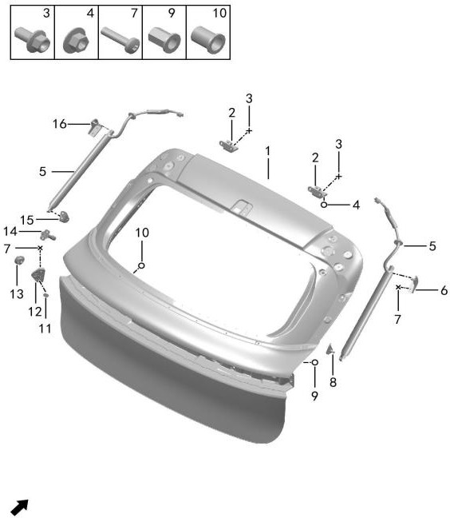

| Поз. | Артикул | Наименование | Кол-во | Системный номер | Примечание |
| ---: | --- | --- | ---: | --- | --- |
| 1 | 630101001 | Дверь багажника | 1 | H97A6301005AA |  |
| 2 | 630601002 | Петля двери багажника | 1 | H97A6306001AA |  |
| 3 | Q11001017 | Фланцевый болт | 4 | HQ1840816T10L2 |  |
| 4 | Q21008003 | Шестигранная гайка | 2 | HQY32008T10 |  |
| 5 | 630901001 | Электрическая стойка двери багажника в сборе | 2 | H97A6309007AA |  |
| 6 | 630903001 | Верхний кронштейн правой стойки двери багажника | 1 | H97A6309012AA |  |
| 7 | Q12001008 | Винт с внутренним шестигранником | 18 | Q215B0625T1F71 |  |
| 8 | 630905001 | Нижний кронштейн правой стойки двери багажника | 1 | H97A6309014AA |  |
| 9 | Q21006001 | Заклепочная гайка | 4 | HQY37206135 |  |
| 10 | Q21006002 | Заклепочная гайка | 1 | Q3720815 |  |
| 11 | 630804001 | Заглушка ограничителя | 4 | 6308105-RA01 |  |
| 12 | 630802001 | Ограничитель двери багажника на двери | 2 | 6308103-RA01 |  |
| 13 | 630803001 | Ограничитель двери багажника на кузове | 2 | 6308104-RA01 |  |
| 14 | 630801001 | Ограничитель двери багажника | 2 | 6308010-RA01 |  |
| 15 | 630904001 | Нижний кронштейн левой стойки двери багажника | 1 | H97A6309013AA |  |
| 16 | 630902001 | Верхний кронштейн левой стойки двери багажника | 1 | H97A6309011AA |  |

# 5026-10 Замок двери багажника

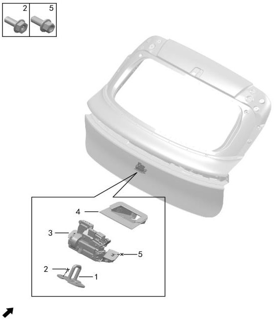

| Поз. | Артикул | Наименование | Кол-во | Системный номер | Примечание |
| ---: | --- | --- | ---: | --- | --- |
| 1 | 630502001 | Ответная часть замка двери багажника в сборе | 1 | H97A6305002AA |  |
| 2 | Q11002026 | Болт | 2 | HQY1840820X2 |  |
| 3 | 630501001 | Замок двери багажника в сборе | 1 | H97A6305001AA |  |
| 4 | 630503001 | Чехол замка двери багажника | 1 | H97A6305006AA |  |
| 5 | Q11001003 | Фланцевый болт | 2 | HQ1840614 |  |

# 5027-10 Крыша

- Описание: N1 и N2

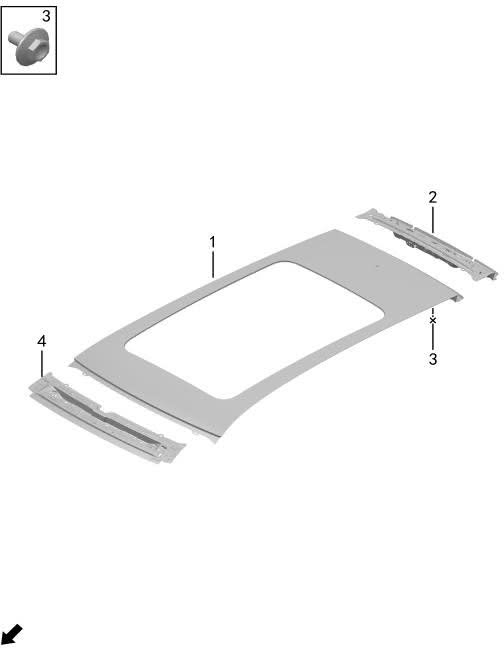

| Поз. | Артикул | Наименование | Кол-во | Системный номер | Примечание |
| ---: | --- | --- | ---: | --- | --- |
| 1 | 570104001 | Крыша в сборе | 1 | H97A5701015AA |  |
| 2 | 570102001 | Задняя поперечина крыши | 1 | H97A5701010AA |  |
| 3 | Q11001069 | Фланцевый болт | 10 | HQ1860612L |  |
| 4 | 570101001 | Передняя поперечина крыши | 1 | H97A5701005AA |  |

# 5027-11 Крыша

- Описание: N3

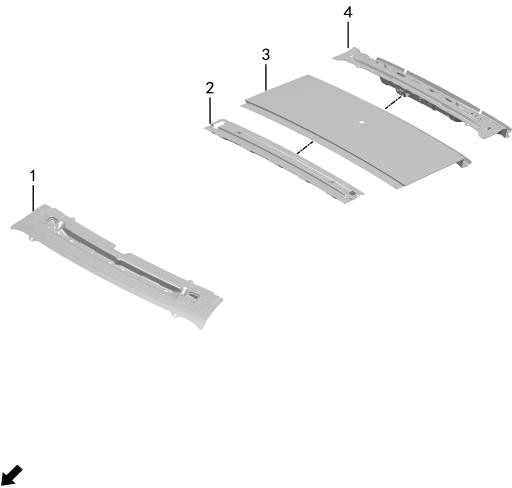

| Поз. | Артикул | Наименование | Кол-во | Системный номер | Примечание |
| ---: | --- | --- | ---: | --- | --- |
| 1 | 570101002 | Передняя поперечина крыши | 1 | H97A5701005BA |  |
| 2 | 570103001 | Средне-задняя поперечина крыши | 1 | H97A5701027BA |  |
| 3 | 570105001 | Наружная панель крыши | 1 | H97A5701008BA |  |
| 4 | 570102001 | Задняя поперечина крыши | 1 | H97A5701010AA |  |

# 5028-10 Передние двери

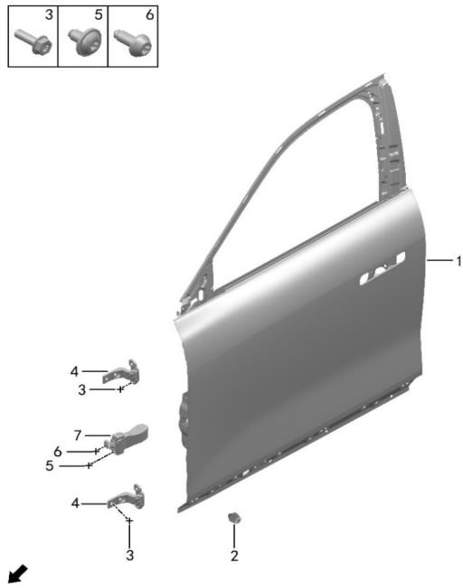

| Поз. | Артикул | Наименование | Кол-во | Системный номер | Примечание |
| ---: | --- | --- | ---: | --- | --- |
| 1 | 610101001 | Панель левой передней двери в сборе | 1 | H97A6101005AA |  |
| 1 | 610102001 | Панель правой передней двери в сборе | 1 | H97A6101010AA |  |
| 2 | 820009001 | Буферная прокладка | 2 | 8200215-SA01 |  |
| 3 | Q11002027 | Болт | 16 | HQY1840825T10L1 |  |
| 4 | 610601001 | Верхняя петля левой передней двери | 2 | 6106100-RA01 |  |
| 4 | 610602001 | Верхняя петля правой передней двери | 2 | 6106200-RA01 |  |
| 5 | Q12001015 | Винт с внутренним шестигранником | 4 | HQY2620610T8X2D |  |
| 6 | Q12001013 | Винт с внутренним шестигранником | 2 | HQY2600821T8X2D |  |
| 7 | 610901001 | Ограничитель передней двери | 2 | H97A6109001AA |  |

# 5029-10 Замок передней двери

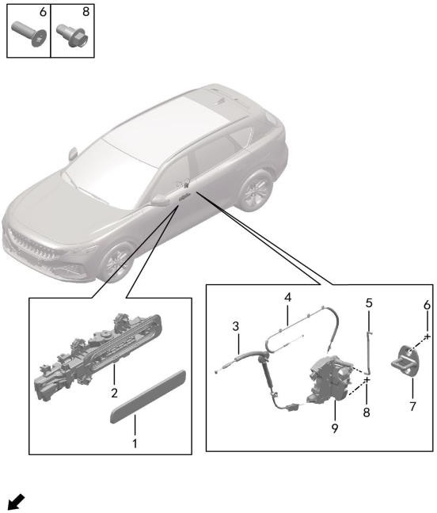

| Поз. | Артикул | Наименование | Кол-во | Системный номер | Примечание |
| ---: | --- | --- | ---: | --- | --- |
| 1 | 610807001 | Корпус наружной ручки левой передней двери | 1 | H97A6108009AA |  |
| 1 | 610808001 | Корпус наружной ручки правой передней двери | 1 | H97A6108010AA |  |
| 2 | 610801001 | Наружная ручка левой передней двери в сборе | 1 | H97A3718900AA |  |
| 2 | 610802001 | Наружная ручка правой передней двери в сборе | 1 | H97A3718901AA |  |
| 3 | 610501001 | Внутренний трос открытия передней двери | 2 | H97A6105007AA |  |
| 4 | 610502001 | Наружный трос открытия передней двери | 2 | H97A6105008AA |  |
| 5 | 610506001 | Тяга цилиндра замка | 1 | H97A6105006AA |  |
| 6 | Q12001012 | Винт с внутренним шестигранником | 4 | Q2580825T1F61 |  |
| 7 | 610505001 | Ответная часть замка двери | 2 | H97A6105013AA |  |
| 8 | Q12001024 | Винт с внутренним шестигранником | 6 | HQY2150615T8N2 |  |
| 8 | Q12001007 | Винт с внутренним шестигранником | 6 | HQY215B0616N2 | замена на Q12001024 |
| 9 | 610503001 | Замок левой передней двери | 1 | H97A6105011AA |  |
| 9 | 610504001 | Замок правой передней двери | 1 | H97A6105012AA |  |

# 5030-10 Стекла передних дверей

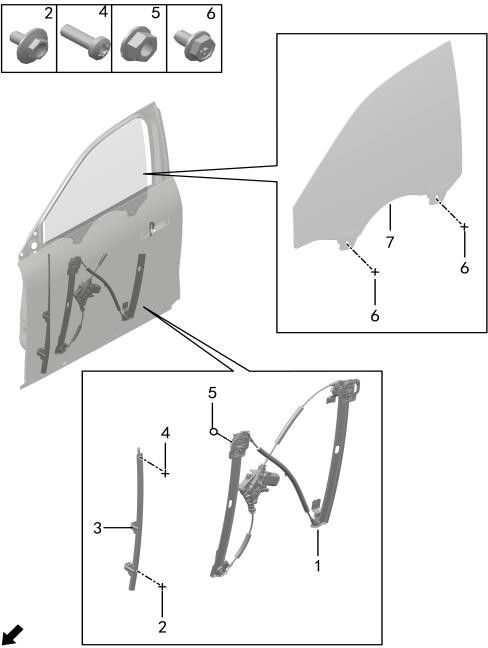

| Поз. | Артикул | Наименование | Кол-во | Системный номер | Примечание |
| ---: | --- | --- | ---: | --- | --- |
| 1 | 610401001 | Стеклоподъемник левой передней двери | 1 | H97A6104007AA |  |
| 1 | 610402001 | Стеклоподъемник правой передней двери | 1 | H97A6104008AA |  |
| 2 | Q11001069 | Фланцевый болт | 4 | HQ1860612L |  |
| 3 | 610403001 | Направляющая левой передней двери | 1 | H97A6104011AA |  |
| 3 | 610404001 | Направляющая правой передней двери | 1 | H97A6104021AA |  |
| 4 | Q12001003 | Винт с внутренним шестигранником | 2 | Q215B0516 |  |
| 5 | Q21001010 | Фланцевая гайка | 14 | HQ32406 |  |
| 6 | Q11002017 | Болт | 4 | HQY1470610T8X1 |  |
| 7 | 610303001 | Стекло левой передней двери | 1 | H97A6103011AA | закаленное стекло |
| 7 | 610303002 | Стекло левой передней двери | 1 | H97A6103011BA | многослойное шумо- и теплоизоляционное стекло |
| 7 | 610304001 | Стекло правой передней двери | 1 | H97A6103012AA | закаленное стекло |
| 7 | 610304002 | Стекло правой передней двери | 1 | H97A6103012BA | многослойное шумо- и теплоизоляционное стекло |

# 5031-10 Задние двери

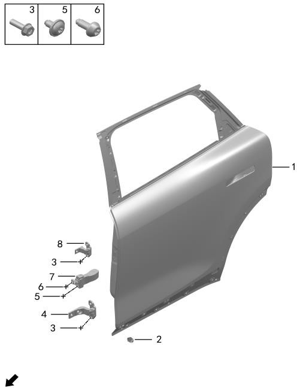

| Поз. | Артикул | Наименование | Кол-во | Системный номер | Примечание |
| ---: | --- | --- | ---: | --- | --- |
| 1 | 620101001 | Панель левой задней двери в сборе | 1 | H97A6201005AA |  |
| 1 | 620102001 | Панель правой задней двери в сборе | 1 | H97A6201010AA |  |
| 2 | 820009001 | Буферная прокладка | 2 | 8200215-SA01 |  |
| 3 | Q11002027 | Болт | 16 | HQY1840825T10L1 |  |
| 4 | 610601001 | Верхняя петля левой передней двери | 1 | 6106100-RA01 |  |
| 4 | 610602001 | Верхняя петля правой передней двери | 1 | 6106200-RA01 |  |
| 5 | Q12001015 | Винт с внутренним шестигранником | 4 | HQY2620610T8X2D |  |
| 6 | Q12001013 | Винт с внутренним шестигранником | 2 | HQY2600821T8X2D |  |
| 7 | 620901001 | Ограничитель задней двери | 2 | H97A6209001AA |  |
| 8 | 620601001 | Верхняя петля левой задней двери | 1 | 6206500-RA01 |  |
| 8 | 620602001 | Верхняя петля правой задней двери | 1 | 6206600-RA01 |  |

# 5032-10 Замок задней двери

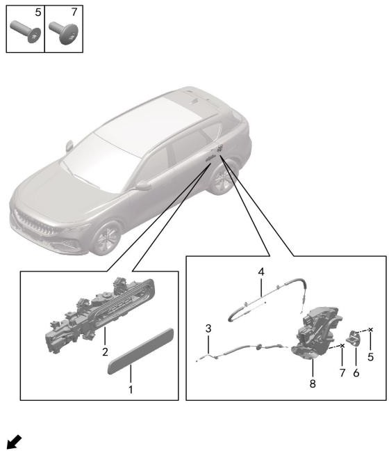

| Поз. | Артикул | Наименование | Кол-во | Системный номер | Примечание |
| ---: | --- | --- | ---: | --- | --- |
| 1 | 620803001 | Корпус наружной ручки левой задней двери | 1 | H97A6208009AA |  |
| 1 | 620804001 | Корпус наружной ручки правой задней двери | 1 | H97A6208010AA |  |
| 2 | 610803001 | Наружная ручка левой задней двери в сборе | 1 | H97A3718902AA |  |
| 2 | 610804001 | Наружная ручка правой задней двери в сборе | 1 | H97A3718903AA |  |
| 3 | 620503001 | Наружный трос открытия задней двери | 2 | H97A6205011AA |  |
| 4 | 620504001 | Внутренний трос открытия задней двери | 2 | H97A6205012AA |  |
| 5 | Q12001012 | Винт с внутренним шестигранником | 4 | Q2580825T1F61 |  |
| 6 | 610505001 | Ответная часть замка двери | 2 | H97A6105013AA |  |
| 7 | Q12001024 | Винт с внутренним шестигранником | 6 | HQY2150615T8N2 |  |
| 7 | Q12001007 | Винт с внутренним шестигранником | 6 | HQY215B0616N2 | замена на Q12001024 |
| 8 | 620502001 | Замок правой задней двери | 1 | H97A6205008AA |  |
| 8 | 620501001 | Замок левой задней двери | 1 | H97A6205007AA |  |

# 5033-10 Стекла задних дверей

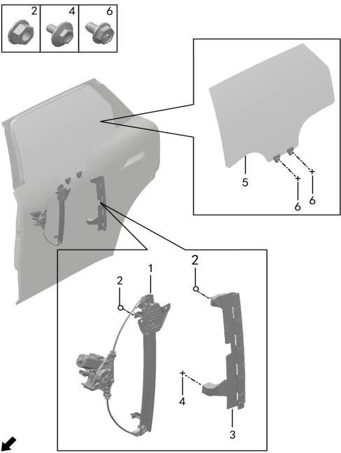

| Поз. | Артикул | Наименование | Кол-во | Системный номер | Примечание |
| ---: | --- | --- | ---: | --- | --- |
| 1 | 620401001 | Стеклоподъемник левой задней двери | 1 | H97A6204011AA |  |
| 1 | 620402001 | Стеклоподъемник правой задней двери | 1 | H97A6204012AA |  |
| 2 | Q21001010 | Фланцевая гайка | 16 | HQ32406 |  |
| 3 | 620305001 | Задняя направляющая стекла левой задней двери | 1 | H97A6203023AA |  |
| 3 | 620306001 | Задняя направляющая стекла правой задней двери | 1 | H97A6203024AA |  |
| 4 | Q11001069 | Фланцевый болт | 2 | HQ1860612L |  |
| 5 | 620301001 | Стекло левой задней двери | 1 | H97A6203007AA |  |
| 5 | 620302001 | Стекло правой задней двери | 1 | H97A6203008AA |  |
| 6 | Q11002017 | Болт | 4 | HQY1470610T8X1 |  |

# 5034-10 Личинка замка и ключ

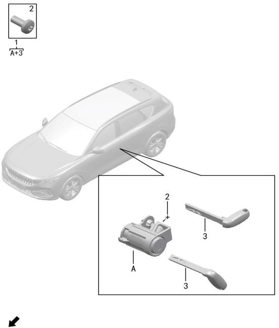

| Поз. | Артикул | Наименование | Кол-во | Системный номер | Примечание |
| ---: | --- | --- | ---: | --- | --- |
| 1 | 610507001 | Комплект личинки дверного замка | 1 | H97A6105900AA |  |
| 2 | Q12001004 | Винт с внутренним шестигранником | 1 | Q215B0614F61 |  |
| 3 | 610510001 | Заготовка ключа | 1 | H97A6105014AA |  |

# 5035-10 Лючок зарядного порта

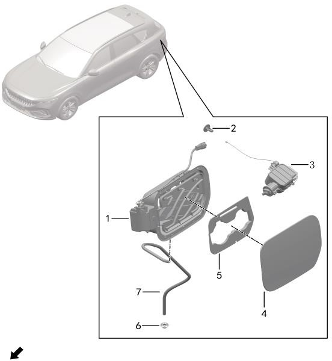

| Поз. | Артикул | Наименование | Кол-во | Системный номер | Примечание |
| ---: | --- | --- | ---: | --- | --- |
| 1 | 840402001 | Основание лючка зарядного порта | 1 | H97A8404002AA |  |
| 2 | 840405001 | Ручка аварийного открытия | 1 | H97A8404006AA |  |
| 3 | 840404001 | Замок лючка зарядного порта | 1 | H97A8404004AA |  |
| 4 | 840401001 | Крышка лючка зарядного порта | 1 | H97A8404001AA |  |
| 5 | 840403001 | Щиток лючка зарядного порта | 1 | H97A8404003AA |  |
| 6 | 840409001 | Чехол дренажной трубки | 1 | H97A8404011AA |  |
| 7 | 840413001 | Дренажная трубка лючка зарядного порта | 1 | H97A8404019AA |  |

# 5036-10 Лючок топливной горловины

- Описание: версия с рендж-экстендером (ДВС)

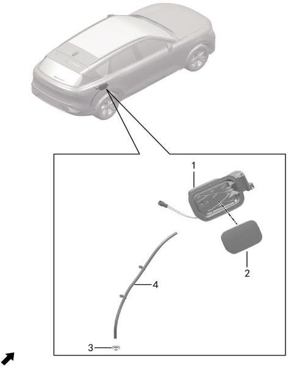

| Поз. | Артикул | Наименование | Кол-во | Системный номер | Примечание |
| ---: | --- | --- | ---: | --- | --- |
| 1 | 840407001 | Лючок топливной горловины в сборе | 1 | H97A8404008AA |  |
| 2 | 840406001 | Наружная панель лючка топливной горловины | 1 | H97A8404007AA |  |
| 3 | 840409001 | Чехол дренажной трубки | 1 | H97A8404011AA |  |
| 4 | 840412001 | Дренажная трубка лючка топливной горловины | 1 | H97A8404014AA |  |
