- [6010-10 Передний бампер](#6010-10-передний-бампер)
- [6010-11 Передний бампер](#6010-11-передний-бампер)
- [6011-10 Задний бампер](#6011-10-задний-бампер)
- [6011-11 Задний бампер](#6011-11-задний-бампер)
- [6012-10 Передняя решетка](#6012-10-передняя-решетка)
- [6012-11 Передняя решетка](#6012-11-передняя-решетка)
- [6013-10 Внутреннее зеркало и солнцезащитные козырьки](#6013-10-внутреннее-зеркало-и-солнцезащитные-козырьки)
- [6014-10 Наружные зеркала заднего вида](#6014-10-наружные-зеркала-заднего-вида)
- [6015-10 Механизм переднего стеклоочистителя](#6015-10-механизм-переднего-стеклоочистителя)
- [6016-10 Механизм заднего стеклоочистителя](#6016-10-механизм-заднего-стеклоочистителя)
- [6017-10 Омыватель](#6017-10-омыватель)
- [6018-10 Лобовое стекло](#6018-10-лобовое-стекло)
- [6020-10 Заднее стекло](#6020-10-заднее-стекло)
- [6021-10 Стекла задних форточек](#6021-10-стекла-задних-форточек)
- [6022-10 Декоративные элементы окон](#6022-10-декоративные-элементы-окон)
- [6023-10 Люк](#6023-10-люк)
- [6024-10 Стеклянная крыша люка](#6024-10-стеклянная-крыша-люка)
- [6025-10 Рейлинги](#6025-10-рейлинги)
- [6026-10 Защитные элементы кузова](#6026-10-защитные-элементы-кузова)
- [6027-10 Кузовные уплотнители и молдинги](#6027-10-кузовные-уплотнители-и-молдинги)
- [6028-10 Спойлер](#6028-10-спойлер)
- [6029-10 Эмблемы и наклейки](#6029-10-эмблемы-и-наклейки)
- [6030-10 Накладки моторного отсека](#6030-10-накладки-моторного-отсека)
- [6030-11 Накладки моторного отсека](#6030-11-накладки-моторного-отсека)
- [6032-10 Панель приборов](#6032-10-панель-приборов)
- [6032-11 Панель приборов](#6032-11-панель-приборов)
- [6033-10 Передние воздуховоды](#6033-10-передние-воздуховоды)
- [6034-10 Дефлекторы панели приборов](#6034-10-дефлекторы-панели-приборов)
- [6035-10 Поперечная балка панели приборов](#6035-10-поперечная-балка-панели-приборов)
- [6036-10 Центральная консоль](#6036-10-центральная-консоль)
- [6037-10 Задний воздуховод](#6037-10-задний-воздуховод)
- [6040-10 Обивка крыши](#6040-10-обивка-крыши)
- [6041-10 Передняя боковая обивка](#6041-10-передняя-боковая-обивка)
- [6042-10 Средняя боковая обивка](#6042-10-средняя-боковая-обивка)
- [6043-10 Задняя боковая обивка](#6043-10-задняя-боковая-обивка)
- [6044-10 Обивка передних дверей](#6044-10-обивка-передних-дверей)
- [6045-10 Обивка задних дверей](#6045-10-обивка-задних-дверей)
- [6046-10 Обивка задней двери](#6046-10-обивка-задней-двери)
- [6047-10 Ковровое покрытие](#6047-10-ковровое-покрытие)
- [6048-10 Отделка переднего багажника](#6048-10-отделка-переднего-багажника)
- [6049-10 Облицовка заднего багажного отсека](#6049-10-облицовка-заднего-багажного-отсека)
- [6049-11 Облицовка заднего багажного отсека](#6049-11-облицовка-заднего-багажного-отсека)
- [6050-10 Шумоизоляционные элементы](#6050-10-шумоизоляционные-элементы)
- [6051-10 Сиденье водителя](#6051-10-сиденье-водителя)
- [6051-11 Сиденье водителя](#6051-11-сиденье-водителя)
- [6052-10 Подушка и спинка сиденья водителя](#6052-10-подушка-и-спинка-сиденья-водителя)
- [6052-11 Подушка и спинка сиденья водителя](#6052-11-подушка-и-спинка-сиденья-водителя)
- [6052-12 Подушка и спинка сиденья водителя](#6052-12-подушка-и-спинка-сиденья-водителя)
- [6053-10 Сиденье переднего пассажира](#6053-10-сиденье-переднего-пассажира)
- [6054-10 Подушка и спинка сиденья переднего пассажира](#6054-10-подушка-и-спинка-сиденья-переднего-пассажира)
- [6054-11 Подушка и спинка сиденья переднего пассажира](#6054-11-подушка-и-спинка-сиденья-переднего-пассажира)
- [6054-12 Подушка и спинка сиденья переднего пассажира](#6054-12-подушка-и-спинка-сиденья-переднего-пассажира)
- [6055-10 Сиденья второго ряда](#6055-10-сиденья-второго-ряда)
- [6056-10 Подушка и спинка сидений второго ряда](#6056-10-подушка-и-спинка-сидений-второго-ряда)

## 6010-10 Передний бампер

- Описание: N1 стандартно

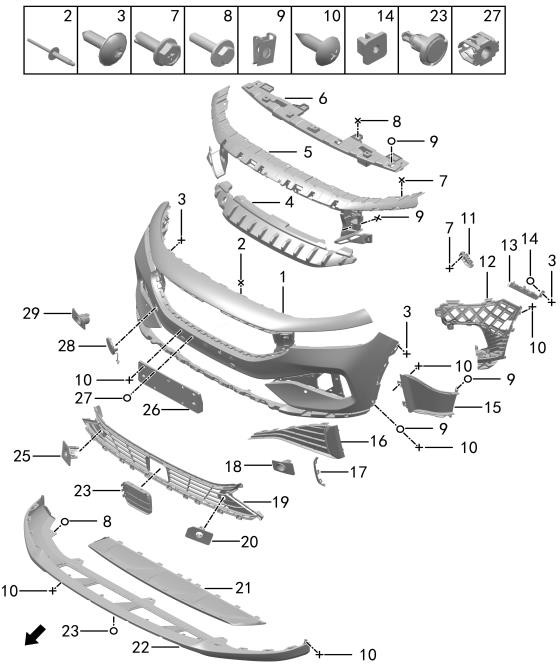

| Поз. | Артикул | Наименование | Кол-во | Системный номер | Примечание |
| ---: | --- | --- | ---: | --- | --- |
| 1 | 280320001 | Верхняя наружная панель переднего бампера | 1 | H97A2803085AA |  |
| 2 | Q13001002 | Заклепка | 4 | HQY4494822 |  |
| 3 | Q12001018 | Винт с внутренним шестигранником | 9 | HQY2714816L2 |  |
| 4 | 280325001 | Передний бампер энергопоглотитель | 1 | H97A2803028AA |  |
| 5 | 280312001 | Центральная опорная пластина переднего бампера | 1 | H97A2803019AA |  |
| 6 | 280303001 | Центральный кронштейн переднего бампера | 1 | H97A2803007AA | замена на 280303002 |
| 6 | 280303002 | Центральный кронштейн переднего бампера | 1 | H97A2803007AB |  |
| 7 | Q11002019 | Болт | 10 | HQY1470616T8L1 |  |
| 8 | Q11002019 | Болт | 6 | HQ140B0626L2L |  |
| 9 | Q21003001 | Пластинчатая пружинная гайка | 19 | HQY39705 |  |
| 10 | Q12002015 | Самонарезающий винт | 43 | Q2734816 |  |
| 11 | 280317001 | Левая верхняя опора переднего бампера | 1 | H97A2803033AA |  |
| 11 | 280318001 | Правая верхняя опора переднего бампера | 1 | H97A2803034AA |  |
| 12 | 280310001 | Левая опорная пластина переднего бампера | 1 | H97A2803017AA |  |
| 12 | 280311001 | Правая опорная пластина переднего бампера | 1 | H97A2803018AA |  |
| 13 | 280315001 | Левая опора переднего бампера | 1 | H97A2803029AA |  |
| 13 | 280316001 | Правая опора переднего бампера | 1 | H97A2803031AA |  |
| 14 | 610508001 | Гайка | 2 | 6105003-01 |  |
| 15 | 280323001 | Левая внутренняя боковая панель переднего бампера | 1 | H97A2803035AA |  |
| 15 | 280324001 | Правая внутренняя боковая панель переднего бампера | 1 | H97A2803036AA |  |
| 16 | 280308003BKJA | Левая декоративная накладка переднего бампера | 1 | H97A2803003ABBKJA | без системы ночного видения |
| 16 | 280308001BKJA | Левая декоративная накладка переднего бампера | 1 | H97A2803003AABKJA | замена на 280308003BKJA |
| 16 | 280309003BKJA | Правая декоративная накладка переднего бампера | 1 | H97A2803004ABBKJA | без системы ночного видения |
| 16 | 280309001BKJA | Правая декоративная накладка переднего бампера | 1 | H97A2803004AABKJA | замена на 280309003BKJA |
| 17 | 280321001SACA | Левая декоративная планка нижней решетки переднего бампера | 1 | H97A2803013AASACA |  |
| 17 | 280322001SACA | Правая декоративная планка нижней решетки переднего бампера | 1 | H97A2803014AASACA |  |
| 18 | 280313003 | Левый передний кронштейн радара | 1 | H97A2803023AA |  |
| 19 | 280304002 | Нижняя решетка переднего бампера | 1 | H97A2803008AB |  |
| 19 | 280304001 | Нижняя решетка переднего бампера | 1 | H97A2803008AA | замена на 280304002 |
| 20 | 280313001 | Левый передний кронштейн радара | 1 | H97A2803021AA |  |
| 21 | 280329001SRJA | Нижняя декоративная панель переднего бампера | 1 | H97A2803016AASRJA | глянцевый черный |
| 22 | 280302001 | Нижняя облицовка переднего бампера | 1 | H97A2803002AB |  |
| 23 | Q41001001 | Клипса | 3 | 09406-08301 |  |
| 24 | 280305002 | Заглушка нижней решетки | 1 | H97A2803037AB |  |
| 24 | 280305001 | Заглушка нижней решетки | 1 | H97A2803037AA | замена на 280305002 |
| 25 | 280314003 | Правый передний кронштейн радара | 1 | H97A2803024AA |  |
| 26 | 280307001BKGB | Передняя рамка номерного знака | 1 | H97A2803011AABKGB | глянцевый черный |
| 27 | Q21007001 | Пружинная гайка | 4 | HQY39606 |  |
| 28 | 280306001 | Заглушка переднего буксировочного крюка | 1 | H97A2803009AA |  |
| 29 | 280314001 | Правый передний кронштейн радара | 1 | H97A2803022AA | без автопарковки |

## 6010-11 Передний бампер

- Описание: N1 опция, N2 и N3 стандартно

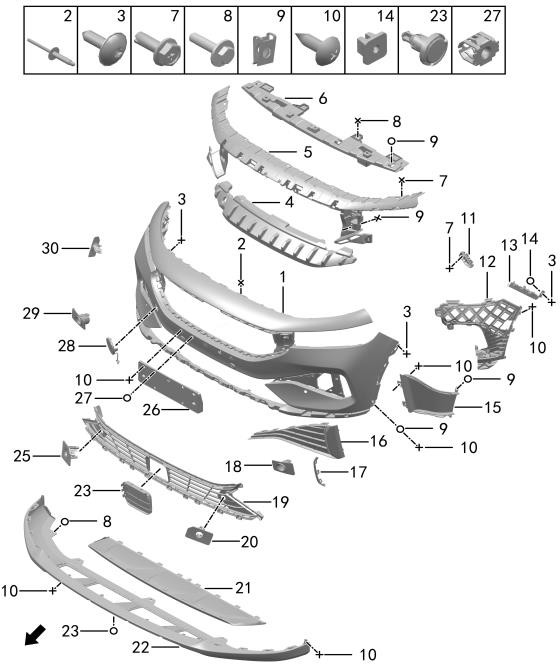

| Поз. | Артикул | Наименование | Кол-во | Системный номер | Примечание |
| ---: | --- | --- | ---: | --- | --- |
| 1 | 280320001 | Верхняя наружная панель переднего бампера | 1 | H97A2803085AA |  |
| 2 | Q13001002 | Заклепка | 4 | HQY4494822 |  |
| 3 | Q12001018 | Винт с внутренним шестигранником | 9 | HQY2714816L2 |  |
| 4 | 280325001 | Передний бампер энергопоглотитель | 1 | H97A2803028AA |  |
| 5 | 280312001 | Центральная опорная пластина переднего бампера | 1 | H97A2803019AA |  |
| 6 | 280303001 | Центральный кронштейн переднего бампера | 1 | H97A2803007AA | замена на 280303002 |
| 6 | 280303002 | Центральный кронштейн переднего бампера | 1 | H97A2803007AB |  |
| 7 | Q11002019 | Болт | 10 | HQY1470616T8L1 |  |
| 8 | Q11002006 | Болт | 6 | HQ140B0626L2L |  |
| 9 | Q21003001 | Пластинчатая пружинная гайка | 19 | HQY39705 |  |
| 10 | Q12002015 | Самонарезающий винт | 43 | Q2734816 |  |
| 11 | 280317001 | Левая верхняя опора переднего бампера | 1 | H97A2803033AA |  |
| 11 | 280318001 | Правая верхняя опора переднего бампера | 1 | H97A2803034AA |  |
| 12 | 280310001 | Левая опорная пластина переднего бампера | 1 | H97A2803017AA |  |
| 12 | 280311001 | Правая опорная пластина переднего бампера | 1 | H97A2803018AA |  |
| 13 | 280315001 | Левая опора переднего бампера | 1 | H97A2803029AA |  |
| 13 | 280316001 | Правая опора переднего бампера | 1 | H97A2803031AA |  |
| 14 | 610508001 | Гайка | 2 | 6105003-01 |  |
| 15 | 280323001 | Левая внутренняя боковая панель переднего бампера | 1 | H97A2803035AA |  |
| 15 | 280324001 | Правая внутренняя боковая панель переднего бампера | 1 | H97A2803036AA |  |
| 16 | 280313004 | Левый передний кронштейн радара | 1 | H97A2803025AA |  |
| 17 | 280308003BKJA | Левая декоративная накладка переднего бампера | 1 | H97A2803003ABBKJA | без системы ночного видения |
| 17 | 280309003BKJA | Правая декоративная накладка переднего бампера | 1 | H97A2803004ABBKJA | без системы ночного видения |
| 17 | 280308004BKJA | Левая декоративная накладка переднего бампера | 1 | H97A2803003BBBKJA | с системой ночного видения |
| 17 | 280308002BKJA | Левая декоративная накладка переднего бампера | 1 | H97A2803003BABKJA | замена на 280308004BKJA |
| 17 | 280309004BKJA | Правая декоративная накладка переднего бампера | 1 | H97A2803004BBBKJA | с системой ночного видения |
| 17 | 280309002BKJA | Правая декоративная накладка переднего бампера | 1 | H97A2803004BABKJA | замена на 280309004BKJA |
| 18 | 280321001SACA | Левая декоративная планка нижней решетки переднего бампера | 1 | H97A2803013AASACA | матовый хром |
| 18 | 280322001SACA | Правая декоративная планка нижней решетки переднего бампера | 1 | H97A2803014AASACA | матовый хром |
| 19 | 280313003 | Левый передний кронштейн радара | 1 | H97A2803023AA |  |
| 20 | 280304001 | Нижняя решетка переднего бампера | 1 | H97A2803008AA | замена на 280304002 |
| 20 | 280304002 | Нижняя решетка переднего бампера | 1 | H97A2803008AB |  |
| 21 | 280313002 | Левый передний кронштейн радара | 1 | H97A2803021BA |  |
| 22 | 280302001 | Нижняя облицовка переднего бампера | 1 | H97A2803002AB |  |
| 23 | 280329001SRJA | Нижняя декоративная панель переднего бампера | 1 | H97A2803016AASRJA |  |
| 24 | Q41001001 | Клипса | 3 | 09406-08301 |  |
| 25 | 280314002 | Правый передний кронштейн радара | 1 | H97A2803022BA |  |
| 26 | 280307001BKGB | Передняя рамка номерного знака | 1 | H97A2803011AABKGB |  |
| 27 | Q21007001 | Пружинная гайка | 4 | HQY39606 |  |
| 28 | 280306001 | Заглушка переднего буксировочного крюка | 1 | H97A2803009AA |  |
| 29 | 280314003 | Правый передний кронштейн радара | 1 | H97A2803024AA |  |
| 30 | 280314004 | Правый передний кронштейн радара | 1 | H97A2803026AA | с автопарковкой |

## 6011-10 Задний бампер

- Описание: N1 стандартно

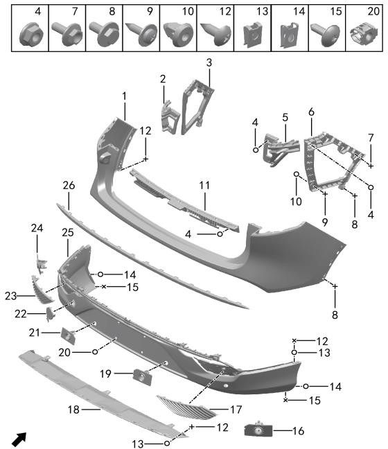

| Поз. | Артикул | Наименование | Кол-во | Системный номер | Примечание |
| ---: | --- | --- | ---: | --- | --- |
| 1 | 280402001 | Верхняя облицовка заднего бампера | 1 | H97A2804036AA |  |
| 2 | 280414001 | Левая верхняя опора заднего бампера | 1 | H97A2804023AA |  |
| 3 | 280412001 | Левая опора заднего бампера | 1 | H97A2804021AA |  |
| 4 | Q21001002 | Фланцевая гайка | 14 | HQ32006 |  |
| 5 | 280415001 | Правая верхняя опора заднего бампера | 1 | H97A2804024AA |  |
| 6 | 280413001 | Правая опора заднего бампера | 1 | H97A2804022AA |  |
| 7 | Q11001070 | Фланцевый болт | 6 | HQ1860616L |  |
| 8 | Q11002001 | Болт | 2 | HQ1400616L2L |  |
| 9 | Q12002006 | Самонарезающий винт | 4 | Q221B4819F62 |  |
| 10 | Q21004003 | Пластиковая гайка | 4 | HQY398B06 | замена на Q41006003 |
| 10 | Q41006003 | Герметичная клипса | 4 | HQY37605 |  |
| 11 | 280411001 | Верхняя опора заднего бампера | 1 | H97A2804020AA |  |
| 12 | Q12002013 | Самонарезающий винт | 5 | Q2734213 |  |
| 13 | Q21003002 | Пластинчатая пружинная гайка | 5 | HQY3974212 |  |
| 14 | Q21003001 | Пластинчатая пружинная гайка | 4 | HQY39705 |  |
| 15 | Q12001018 | Винт с внутренним шестигранником | 4 | HQY2714816L2 |  |
| 16 | 280409002 | Правый задний кронштейн радара | 1 | H97A2804016AA |  |
| 17 | 280405001 | Правая декоративная панель заднего бампера | 1 | H97A2804008AA |  |
| 18 | 280407001 | Нижняя декоративная панель заднего бампера | 1 | H97A2804012AA |  |
| 19 | 280409001 | Правый задний кронштейн радара | 1 | H97A2804014AA |  |
| 20 | Q21007001 | Пружинная гайка | 4 | HQY39606 |  |
| 21 | 280408001 | Левый задний кронштейн радара | 1 | H97A2804013AA |  |
| 22 | 280410001 | Заглушка заднего буксировочного крюка | 1 | H97A2804009AA |  |
| 23 | 280404001 | Левая декоративная панель заднего бампера | 1 | H97A2804007AA |  |
| 24 | 280408002 | Левый задний кронштейн радара | 1 | H97A2804015AA |  |
| 25 | 280403001 | Нижняя облицовка заднего бампера | 1 | H97A2804037AA |  |
| 26 | 280406001 | Центральная декоративная планка заднего бампера | 1 | H97A2804011AA |  |

## 6011-11 Задний бампер

- Описание: N1 опция, N2 и N3 стандартно

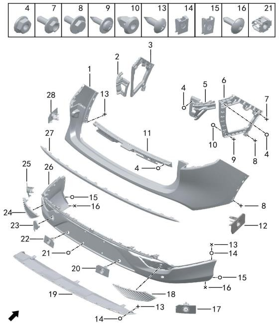

| Поз. | Артикул | Наименование | Кол-во | Системный номер | Примечание |
| ---: | --- | --- | ---: | --- | --- |
| 1 | 280402001 | Верхняя облицовка заднего бампера | 1 | H97A2804036AA |  |
| 2 | 280414001 | Левая верхняя опора заднего бампера | 1 | H97A2804023AA |  |
| 3 | 280412001 | Левая опора заднего бампера | 1 | H97A2804021AA |  |
| 4 | Q21001002 | Фланцевая гайка | 14 | HQ32006 |  |
| 5 | 280415001 | Правая верхняя опора заднего бампера | 1 | H97A2804024AA |  |
| 6 | 280413001 | Правая опора заднего бампера | 1 | H97A2804022AA |  |
| 7 | Q11001070 | Фланцевый болт | 6 | HQ1860616L |  |
| 8 | Q11002001 | Болт | 2 | HQ1400616L2L |  |
| 9 | Q12002006 | Самонарезающий винт | 4 | Q221B4819F62 |  |
| 10 | Q21004003 | Пластиковая гайка | 4 | HQY398B06 | замена на Q41006003 |
| 10 | Q41006003 | Пластиковая гайка | 4 | HQY37605 |  |
| 11 | 280411001 | Верхняя опора заднего бампера | 1 | H97A2804020AA |  |
| 12 | 280409003 | Правый задний кронштейн радара | 1 | H97A2804018AA | с автопарковкой |
| 13 | Q12002013 | Самонарезающий винт | 5 | Q2734213 |  |
| 14 | Q21003002 | Пластинчатая пружинная гайка | 4 | HQY3974212 |  |
| 15 | Q21003001 | Пластинчатая пружинная гайка | 4 | HQY39705 |  |
| 16 | Q12001018 | Винт с внутренним шестигранником | 4 | HQY2714816L2 |  |
| 17 | 280409002 | Правый задний кронштейн радара | 1 | H97A2804016AA |  |
| 18 | 280405001 | Правая декоративная панель заднего бампера | 1 | H97A2804008AA |  |
| 19 | 280407001 | Нижняя декоративная панель заднего бампера | 1 | H97A2804012AA |  |
| 20 | 280409001 | Правый задний кронштейн радара | 4 | H97A2804014AA |  |
| 21 | Q21007001 | Пружинная гайка | 1 | HQY39606 |  |
| 22 | 280408001 | Левый задний кронштейн радара | 1 | H97A2804013AA |  |
| 23 | 280410001 | Заглушка заднего буксировочного крюка | 1 | H97A2804009AA |  |
| 24 | 280404001 | Левая декоративная панель заднего бампера | 1 | H97A2804007AA |  |
| 25 | 280408002 | Левый задний кронштейн радара | 1 | H97A2804015AA |  |
| 26 | 280403001 | Нижняя облицовка заднего бампера | 1 | H97A2804037AA |  |
| 27 | 280406001 | Центральная декоративная планка заднего бампера | 1 | H97A2804011AA |  |
| 28 | 280408003 | Левый задний кронштейн радара | 5 | H97A2804017AA | с автопарковкой |

## 6012-10 Передняя решетка

- Описание: версия с рендж-экстендером (ДВС)

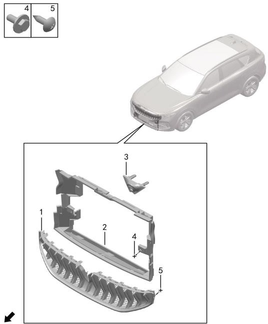

| Поз. | Артикул | Наименование | Кол-во | Системный номер | Примечание |
| ---: | --- | --- | ---: | --- | --- |
| 1 | 280328003BKJB | Передняя решетка | 1 | H97A2803015ABBKJB |  |
| 1 | 280328001BKJB | Передняя решетка | 1 | H97A2803015AABKJB | замена на 280328003BKJB |
| 1 | 280328003 | Передняя решетка | 1 | H97A2803015CA | ремкомплект для памятной версии с рендж-экстендером (ДВС) |
| 2 | 280326001 | Направляющая рамка радиатора | 1 | H97A2803027AA |  |
| 3 | 280327001 | Декоративная панель передней камеры | 1 | H97A2803038AA |  |
| 4 | Q11002001 | Болт | 5 | HQ1400616L2L |  |
| 5 | Q12002015 | Самонарезающий винт | 2 | Q2734816 |  |

## 6012-11 Передняя решетка

- Описание: электрическая версия

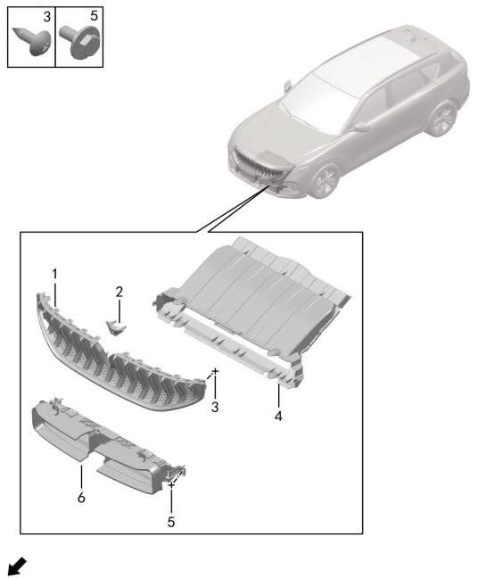

| Поз. | Артикул | Наименование | Кол-во | Системный номер | Примечание |
| ---: | --- | --- | ---: | --- | --- |
| 1 | 280328004BKJB | Передняя решетка | 1 | H97A2803015BBBKJB | электрическая версия, обычная серийная комплектация |
| 1 | 280328002BKJB | Передняя решетка | 1 | H97A2803015BABKJB | замена на 280328004BKJB |
| 1 | 280328004 | Передняя решетка | 1 | H97A2803015DA | ремкомплект для памятной версии электромобиля |
| 2 | 280327001 | Декоративная панель передней камеры | 1 | H97A2803038AA |  |
| 3 | Q12002015 | Самонарезающий винт | 2 | Q2734816 |  |
| 4 | 280319001 | Задняя направляющая рамка решетки | 1 | H97A2803039AA |  |
| 5 | Q11002001 | Болт | 5 | HQ1400616L2L |  |
| 6 | 280326002 | Направляющая рамка радиатора | 1 | H97A2803027BA |  |

## 6013-10 Внутреннее зеркало и солнцезащитные козырьки

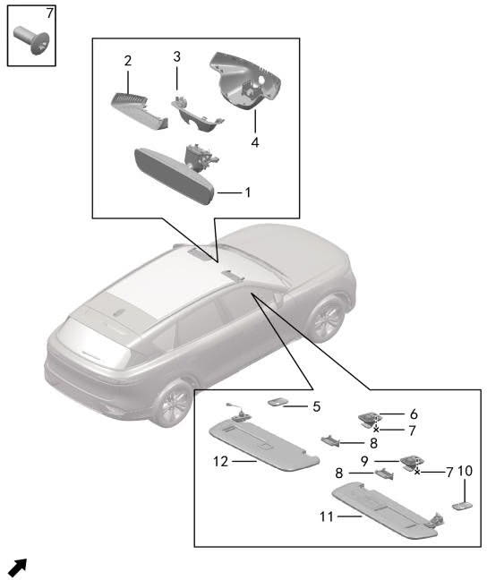

| Поз. | Артикул | Наименование | Кол-во | Системный номер | Примечание |
| ---: | --- | --- | ---: | --- | --- |
| 1 | 820101001 | Внутреннее зеркало заднего вида | 1 | H97A8201005AA |  |
| 2 | 820104001 | Задняя декоративная накладка внутреннего зеркала | 1 | H97A8201009AA |  |
| 3 | 820105001 | Заглушка декоративного кожуха | 1 | H97A8201013AA |  |
| 4 | 820103001 | Передняя декоративная накладка внутреннего зеркала | 1 | H97A8201008AA | с видеорегистратором |
| 4 | 820103002 | Передняя декоративная накладка внутреннего зеркала | 1 | H97A8201008BA | без видеорегистратора |
| 5 | 552505001BEGB | Накладка основания левого козырька | 1 | H97A5525005AABEGB | бежевый |
| 5 | 552505001BLGB | Накладка основания левого козырька | 1 | H97A5525005AABLGB | синий |
| 6 | 552503002BEGB | Крючок левого козырька | 1 | H97A5525003ABBEGB | бежевый |
| 6 | 552503002BLGB | Крючок левого козырька | 1 | H97A5525003ABBLGB | синий |
| 7 | Q12001011 | Винт с внутренним шестигранником | 6 | HQ2570820T8 |  |
| 8 | 552507001BEGB | Накладка крючка козырька | 2 | H97A5525007AABEGB | бежевый |
| 8 | 552507001BLGB | Накладка крючка козырька | 2 | H97A5525007AABLGB | синий |
| 9 | 552504002BEGB | Крючок правого козырька | 1 | H97A5525004ABBEGB | бежевый |
| 9 | 552504002BLGB | Крючок правого козырька | 1 | H97A5525004ABBLGB | синий |
| 10 | 552506001BEGB | Накладка основания правого козырька | 1 | H97A5525006AABEGB | бежевый |
| 10 | 552506001BLGB | Накладка основания правого козырька | 1 | H97A5525006AABLGB | синий |
| 11 | 552502001BETA | Правый солнцезащитный козырек | 1 | H97A5525002AABETA | бежевый |
| 11 | 552502001BLGB | Правый солнцезащитный козырек | 1 | H97A5525002AABLGB | синий |
| 12 | 552501001BETA | Левый солнцезащитный козырек | 1 | H97A5525001AABETA | бежевый |
| 12 | 552501001BLGB | Левый солнцезащитный козырек | 1 | H97A5525001AABLGB | синий |

## 6014-10 Наружные зеркала заднего вида

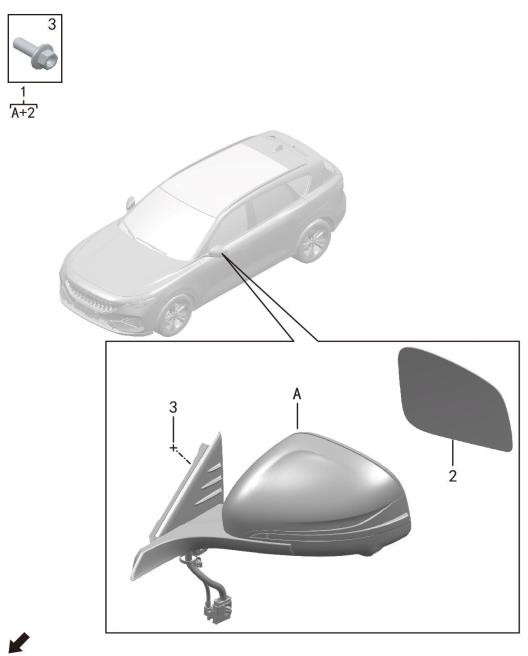

| Поз. | Артикул | Наименование | Кол-во | Системный номер | Примечание |
| ---: | --- | --- | ---: | --- | --- |
| 1 | 820201001GRBA | Левое наружное зеркало | 1 | H97A8202900AAGRBA | с контролем слепых зон |
| 1 | 820201001BLBC | Левое наружное зеркало | 1 | H97A8202900AABLBC | с контролем слепых зон |
| 1 | 820202002BLBC | Правое наружное зеркало | 1 | H97A8202901BABLBC | без контроля слепых зон |
| 1 | 820202002GRBC | Правое наружное зеркало | 1 | H97A8202901BAGRBA | без контроля слепых зон |
| 1 | 820201002GRBA | Левое наружное зеркало | 1 | H97A8202900BAGRBA | без контроля слепых зон |
| 1 | 820201002BLBC | Левое наружное зеркало | 1 | H97A8202900BABLBC | без контроля слепых зон |
| 1 | 820202001BLBC | Правое наружное зеркало | 1 | H97A8202901AABLBC | с контролем слепых зон |
| 1 | 820202001GRBA | Правое наружное зеркало | 1 | H97A8202901AAGRBA | с контролем слепых зон |
| 2 | 820205001 | Стеклянный элемент левого наружного зеркала | 1 | H97A8202013AA | с индикатором слепых зон |
| 2 | 820206001 | Стеклянный элемент правого наружного зеркала | 1 | H97A8202014AA | с индикатором слепых зон |
| 2 | 820207001 | Стеклянный элемент левого наружного зеркала | 1 | H97A8202013BA | без индикатора слепых зон |
| 2 | 820208001 | Стеклянный элемент правого наружного зеркала | 1 | H97A8202014BA | без индикатора слепых зон |
| 3 | Q11001004 | Фланцевый болт | 6 | HQ1840616 |  |

## 6015-10 Механизм переднего стеклоочистителя

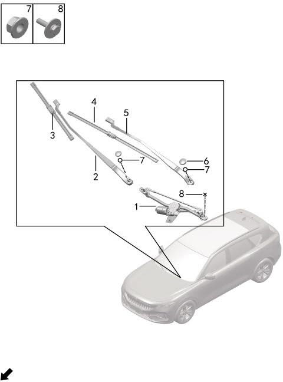

| Поз. | Артикул | Наименование | Кол-во | Системный номер | Примечание |
| ---: | --- | --- | ---: | --- | --- |
| 1 | 520501001 | Привод переднего стеклоочистителя | 1 | 3741100-RA01 |  |
| 2 | 520507001 | Правый рычаг переднего стеклоочистителя | 1 | H97A5205012AA |  |
| 3 | 520504001 | Правая передняя щетка стеклоочистителя | 1 | 5205203-RA01 |  |
| 4 | 520503001 | Левая передняя щетка стеклоочистителя | 1 | 5205103-RA01 |  |
| 5 | 520506001 | Левый рычаг переднего стеклоочистителя | 1 | H97A5205011AA |  |
| 6 | 520502001 | Колпачок оси рычага стеклоочистителя | 2 | 5205011-RA01 |  |
| 7 | Q21001005 | Фланцевая гайка | 2 | HQ32010 |  |
| 8 | Q11002016 | Болт | 3 | HQ146B0625X2L |  |

## 6016-10 Механизм заднего стеклоочистителя

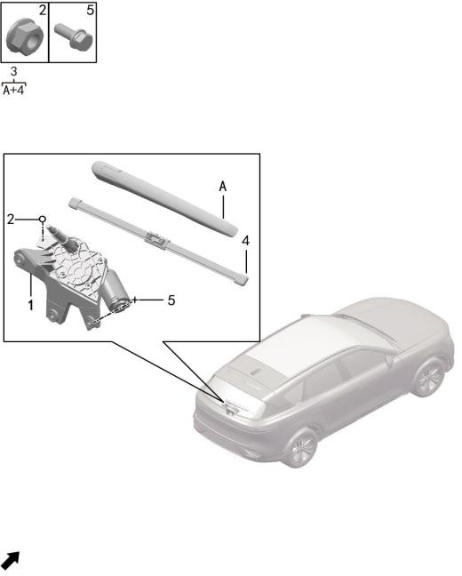

| Поз. | Артикул | Наименование | Кол-во | Системный номер | Примечание |
| ---: | --- | --- | ---: | --- | --- |
| 1 | 520508001 | Привод заднего стеклоочистителя | 1 | H97A5205016AA |  |
| 2 | Q21001004 | Фланцевая гайка | 1 | HQ32008 |  |
| 3 | 520505001 | Задний рычаг и щетка стеклоочистителя | 1 | H97A5205004AA |  |
| 4 | 520510001 | Задняя щетка стеклоочистителя | 1 | H97A5205006AA |  |
| 5 | Q11002016 | Болт | 3 | HQ146B0625X2L |  |

## 6017-10 Омыватель

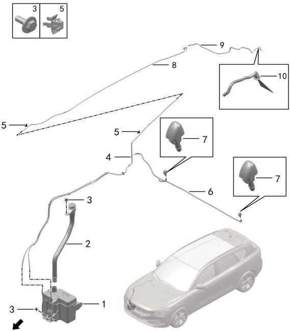

| Поз. | Артикул | Наименование | Кол-во | Системный номер | Примечание |
| ---: | --- | --- | ---: | --- | --- |
| 1 | 520701001 | Бачок омывающей жидкости | 1 | H97A5207001AA |  |
| 2 | 520707001 | Заливная трубка | 1 | H97A5207011AA |  |
| 3 | Q11002003 | Болт | 4 | HQ140B0618L |  |
| 4 | 520706001 | Передний трубопровод | 1 | H97A5207007AA |  |
| 5 | Q31003001 | Одинарный зажим трубки | 4 | HQY643005 |  |
| 6 | 520706002 | Передний трубопровод | 1 | H97A5207009AA |  |
| 7 | 520703001 | Левая форсунка | 2 | H97A5207003AA |  |
| 8 | 520705002 | Задний трубопровод | 1 | H97A5207008AA |  |
| 9 | 520705004 | Задний трубопровод | 1 | H97A5207010AB |  |
| 10 | 520702001 | Задняя форсунка | 1 | H97A5207002AA |  |

## 6018-10 Лобовое стекло

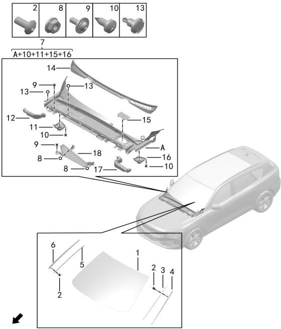

| Поз. | Артикул | Наименование | Кол-во | Системный номер | Примечание |
| ---: | --- | --- | ---: | --- | --- |
| 1 | 520001001 | Лобовое стекло | 1 | H97A5200005AA | замена на 520001004 |
| 1 | 520001004 | Лобовое стекло | 1 | H97A5200005AB | без системы ночного видения, без удержания полосы |
| 1 | 520001002 | Лобовое стекло | 1 | H97A5200005BA | замена на 520001005 |
| 1 | 520001005 | Лобовое стекло | 1 | H97A5200005BB | без системы ночного видения, с удержанием полосы |
| 1 | 520001003 | Лобовое стекло | 1 | H97A5200005CA | замена на 520001006 |
| 1 | 520001006 | Лобовое стекло | 1 | H97A5200005CB | с системой ночного видения, с удержанием полосы |
| 2 | Q13001001 | Заклепка | 12 | Q4400306 |  |
| 3 | 500628000 | Левая декоративная фиксирующая планка лобового стекла | 1 | H97A5006129AA |  |
| 4 | 500620001 | Левый молдинг лобового стекла | 1 | H97A5006125AA |  |
| 5 | 500629000 | Правая декоративная фиксирующая планка лобового стекла | 1 | H97A5006134AA |  |
| 6 | 500621001 | Правый молдинг лобового стекла | 1 | H97A5006130AA |  |
| 7 | 522001001 | Нижняя декоративная панель ветрового стекла | 1 | H97A5536005AA |  |
| 8 | Q21001002 | Фланцевая гайка | 2 | HQ32006 |  |
| 9 | Q12001002 | Винт с внутренним шестигранником | 3 | HQY215B0618X2 |  |
| 10 | Q12002010 | Самонарезающий винт | 8 | Q2714813 |  |
| 11 | 500626001 | Правый водоотводящий желоб | 1 | H97A5006062AA |  |
| 12 | 522003001 | Правое уплотнение нижней крышки | 1 | H97A8405034AA |  |
| 13 | Q41001001 | Клипса | 5 | 09406-08301 |  |
| 14 | 840207001 | Декоративная накладка задней кромки капота | 1 | H97A8402022AA |  |
| 15 | 500609001 | Крышка заливки тормозной жидкости | 1 | H97A5006041AA |  |
| 16 | 500625001 | Левый водоотводящий желоб | 1 | H97A5006061AA |  |
| 17 | 522002001 | Левое уплотнение нижней крышки | 1 | H97A8405033AA |  |
| 18 | 500622001 | Водоотводящий щиток | 1 | H97A5006149AA |  |

## 6020-10 Заднее стекло

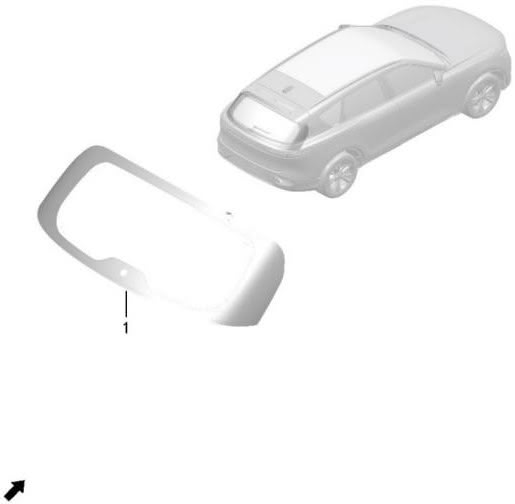

| Поз. | Артикул | Наименование | Кол-во | Системный номер | Примечание |
| ---: | --- | --- | ---: | --- | --- |
| 1 | 520003001 | Заднее стекло | 1 | H97A5200010AA |  |

## 6021-10 Стекла задних форточек

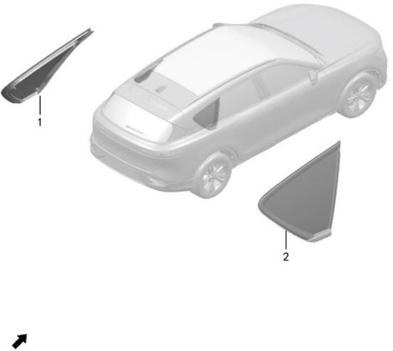

| Поз. | Артикул | Наименование | Кол-во | Системный номер | Примечание |
| ---: | --- | --- | ---: | --- | --- |
| 1 | 520601001 | Левое стекло задней форточки | 1 | H97A5206005AA |  |
| 2 | 520602001 | Правое стекло задней форточки | 1 | H97A5206010AA |  |

## 6022-10 Декоративные элементы окон

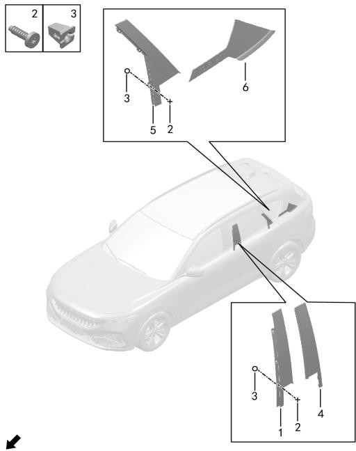

| Поз. | Артикул | Наименование | Кол-во | Системный номер | Примечание |
| ---: | --- | --- | ---: | --- | --- |
| 1 | 500610001 | Накладка стойки B левой передней двери | 1 | H97A5006045AB |  |
| 1 | 500611001 | Накладка стойки B правой передней двери | 2 | H97A5006050AB |  |
| 2 | Q12001014 | Винт с внутренним шестигранником | 18 | HQY2604816 |  |
| 3 | Q21004005 | Пластиковая гайка | 18 | HQY37803 |  |
| 4 | 500612001 | Накладка стойки B левой задней двери | 1 | H97A5006055AB |  |
| 4 | 500613001 | Накладка стойки B правой задней двери | 1 | H97A5006060AB |  |
| 5 | 500614001 | Накладка стойки C левой задней двери | 1 | H97A5006065AB | замена на 500614002 |
| 5 | 500614002 | Накладка стойки C левой задней двери | 1 | H97A5006065AC |  |
| 5 | 500615001 | Накладка стойки C правой задней двери | 1 | H97A5006070AB | замена на 500615002 |
| 5 | 500615002 | Накладка стойки C правой задней двери | 1 | H97A5006070AC |  |
| 6 | 500616001 | Накладка стойки D задней левой боковины | 1 | H97A5006075AA |  |
| 6 | 500617001 | Накладка стойки D задней правой боковины | 1 | H97A5006080AA |  |

## 6023-10 Люк

- Описание: N1 и N2 стандартно, N3 опция, панорамный люк

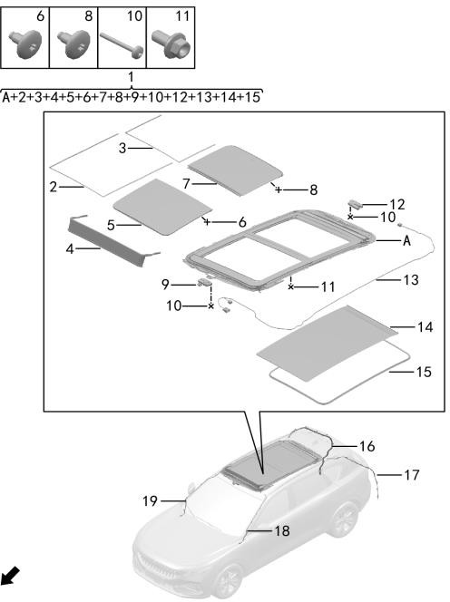

| Поз. | Артикул | Наименование | Кол-во | Системный номер | Примечание |
| ---: | --- | --- | ---: | --- | --- |
| 1 | 551803001BLTA | Люк в сборе | 1 | H97A5518005AABLTA | синий |
| 1 | 551803001BETA | Люк в сборе | 1 | H97A5518005AABETA | бежевый |
| 2 | 551816001 | Внутренний уплотнитель люка | 1 | H97A5518034AA |  |
| 3 | 551817001 | Уплотнитель заднего стекла люка | 1 | H97A5518038AA |  |
| 4 | 551815001 | Ветрозащитная сетка люка | 1 | H97A5518033AA |  |
| 5 | 551813001 | Переднее стекло люка | 1 | H97A5518031AA |  |
| 6 | Q12003003 | Винт | 8 | HQY970014 |  |
| 7 | 551814001 | Заднее стекло люка | 1 | H97A5518032AA |  |
| 8 | Q12003004 | Винт | 4 | HQY970015 |  |
| 9 | 551818001 | Электродвигатель люка | 1 | H97A5518035AA |  |
| 10 | Q11007001 | Болт электродвигателя | 6 | HQY970013 |  |
| 11 | Q11001001 | Фланцевый болт | 18 | HQ1840612 |  |
| 12 | 551819001 | Электродвигатель шторки люка | 1 | H97A5518036AA |  |
| 13 | 551820001 | Жгут проводки люка | 1 | H97A5518037AA |  |
| 14 | 551821001BLTA | Солнцезащитная шторка | 1 | H97A5518004AABLTA | синий |
| 14 | 551821001BETA | Солнцезащитная шторка | 1 | H97A5518004AABETA | бежевый |
| 15 | 551804001 | Люк уплотнитель | 1 | H97A5518006AA |  |
| 16 | 551811001 | Правая задняя дренажная трубка люка | 1 | H97A5518018AA |  |
| 17 | 551810001 | Левая задняя дренажная трубка люка | 1 | H97A5518017AA |  |
| 18 | 551808001 | Левая передняя дренажная трубка люка | 1 | H97A5518007AA |  |
| 19 | 551809001 | Правая передняя дренажная трубка люка | 1 | H97A5518008AA |  |

## 6024-10 Стеклянная крыша люка

- Описание: N1 и N2 опция, N3 стандартно, стеклянная крыша с люком

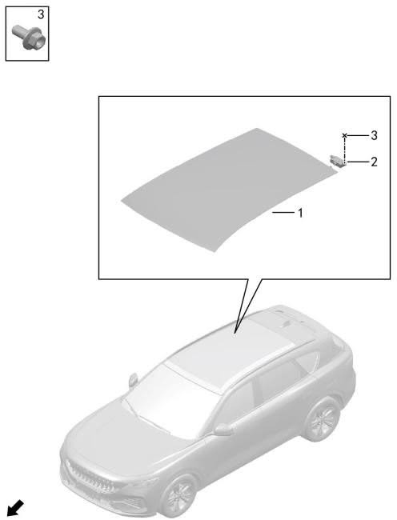

| Поз. | Артикул | Наименование | Кол-во | Системный номер | Примечание |
| ---: | --- | --- | ---: | --- | --- |
| 1 | 551822002 | Стеклянная крыша люка | 1 | H97A5518010AB |  |
| 2 | 570302001 | Контроллер электрохромного стекла | 1 | H97A3605809AA |  |
| 3 | Q11001001 | Фланцевый болт | 2 | HQ1840612 |  |

## 6025-10 Рейлинги

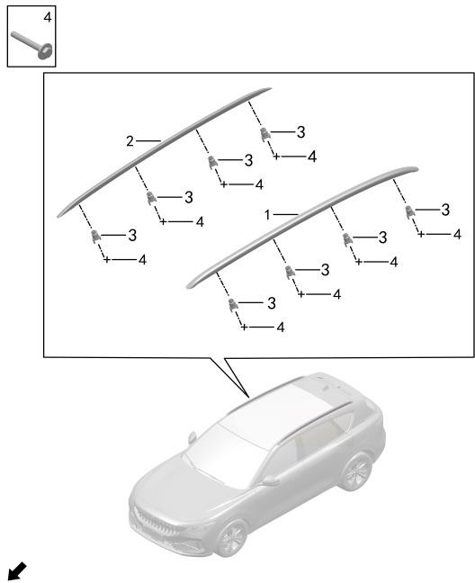

| Поз. | Артикул | Наименование | Кол-во | Системный номер | Примечание |
| ---: | --- | --- | ---: | --- | --- |
| 1 | 570401001 | Левый рейлинг | 1 | H97A5704005AA |  |
| 2 | 570402001 | Правый рейлинг | 1 | H97A5704010AA |  |
| 3 | Q71001001 | Регулятор допуска | 8 | HQY80108 |  |
| 4 | Q11002004 | Болт | 8 | HQ140B0645N1L |  |

## 6026-10 Защитные элементы кузова

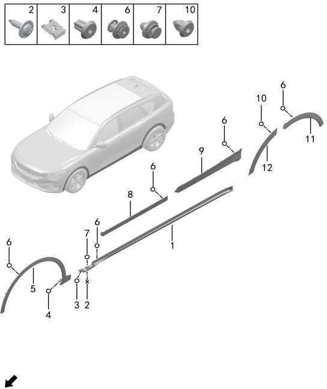

| Поз. | Артикул | Наименование | Кол-во | Системный номер | Примечание |
| ---: | --- | --- | ---: | --- | --- |
| 1 | 310109001 | Левая нижняя юбка | 1 | H97A3101055BA |  |
| 1 | 310110001 | Правая нижняя юбка | 1 | H97A3101060BA |  |
| 2 | Q12002006 | Самонарезающий винт | 20 | Q221B4819F62 |  |
| 3 | Q21003003 | Пластинчатая пружинная гайка | 6 | HQY3974817 |  |
| 4 | Q41006003 | Герметичная клипса | 2 | HQY37605 |  |
| 5 | 310103001 | Левая накладка передней арки | 1 | H97A3101025BA | замена на 310103002 |
| 5 | 310103002 | Левая накладка передней арки | 1 | H97A3101025BB |  |
| 5 | 310104001 | Правая накладка передней арки | 1 | H97A3101030BA | замена на 310104002 |
| 5 | 310104002 | Правая накладка передней арки | 1 | H97A3101030BB |  |
| 6 | 500627002 | Клипса | 88 | H97A5006799AA |  |
| 7 | Q21004003 | Пластиковая гайка | 22 | HQY398B06 |  |
| 8 | 500602001 | Левая защитная накладка передней двери | 1 | H97A5006015BA |  |
| 8 | 500603001 | Правая защитная накладка передней двери | 1 | H97A5006020BA |  |
| 9 | 500604001 | Левая защитная накладка задней двери | 1 | H97A5006025BA |  |
| 9 | 500605001 | Правая защитная накладка задней двери | 1 | H97A5006030BA |  |
| 10 | 500627001 | Клипса | 8 | H97A5006798AA |  |
| 11 | 310107001 | Задняя секция левой накладки задней арки | 1 | H97A3101045BA | замена на 310107002 |
| 11 | 310107002 | Задняя секция левой накладки задней арки | 1 | H97A3101045BB |  |
| 11 | 310108001 | Задняя секция правой накладки задней арки | 1 | H97A3101050BA | замена на 310108002 |
| 11 | 310108002 | Задняя секция правой накладки задней арки | 1 | H97A3101050BB |  |
| 12 | 310105001 | Передняя секция левой накладки задней арки | 1 | H97A3101035BA | замена на 310105002 |
| 12 | 310105002 | Передняя секция левой накладки задней арки | 1 | H97A3101035BB |  |
| 12 | 310106001 | Передняя секция правой накладки задней арки | 1 | H97A3101040BA | замена на 310106002 |
| 12 | 310106002 | Передняя секция правой накладки задней арки | 1 | H97A3101040BB |  |

## 6027-10 Кузовные уплотнители и молдинги

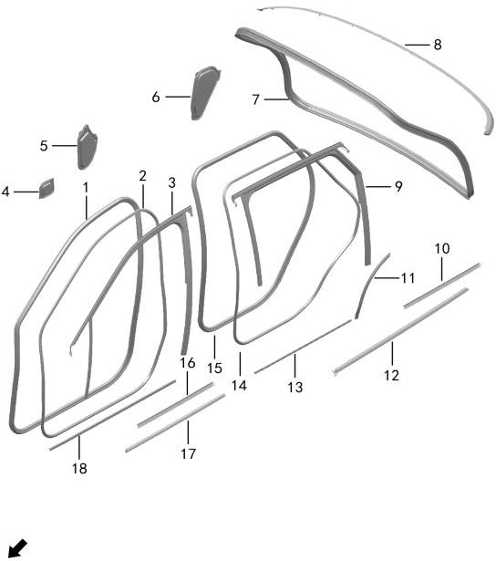

| Поз. | Артикул | Наименование | Кол-во | Системный номер | Примечание |
| ---: | --- | --- | ---: | --- | --- |
| 1 | 610701001 | Уплотнитель рамки левой передней двери | 1 | H97A6107007AA |  |
| 1 | 610702001 | Уплотнитель рамки правой передней двери | 1 | H97A6107008AA |  |
| 2 | 610707001 | Уплотнитель левой передней двери | 1 | H97A6107021AA |  |
| 2 | 610708001 | Уплотнитель правой передней двери | 1 | H97A6107022AA |  |
| 3 | 610301001 | Направляющий желоб стекла левой передней двери | 1 | H97A6103007AA |  |
| 3 | 610302001 | Направляющий желоб стекла правой передней двери | 1 | H97A6103008AA |  |
| 4 | 610709001 | Влагозащитная пленка левой передней двери | 1 | H97A6107026AA |  |
| 4 | 610710001 | Влагозащитная пленка правой передней двери | 1 | H97A6107029AA |  |
| 5 | 610709002 | Влагозащитная пленка левой передней двери | 1 | H97A6107027AA |  |
| 5 | 610710002 | Влагозащитная пленка правой передней двери | 1 | H97A6107028AA |  |
| 6 | 620711001 | Влагозащитная пленка левой задней двери | 1 | H97A6207027AA |  |
| 6 | 620712001 | Влагозащитная пленка правой задней двери | 1 | H97A6207028AA |  |
| 7 | 630701001 | Уплотнитель рамки двери багажника | 1 | H97A6307006AA |  |
| 8 | 630104001 | Молдинг двери багажника | 1 | H97A6301002AA | замена на 630104002 |
| 8 | 630104002 | Молдинг двери багажника | 1 | H97A6301002AB |  |
| 9 | 620303001 | Направляющий желоб стекла левой задней двери | 1 | H97A6203011AA |  |
| 9 | 620304001 | Направляющий желоб стекла правой задней двери | 1 | H97A6203012AA |  |
| 10 | 620703001 | Внутренний уплотнитель подоконной линии левой задней двери | 1 | H97A6207011AA |  |
| 10 | 620704001 | Внутренний уплотнитель подоконной линии правой задней двери | 1 | H97A6207012AA |  |
| 11 | 620709001 | Защитная накладка колесной арки левой задней двери | 1 | H97A6207023AA |  |
| 11 | 620710001 | Защитная накладка колесной арки правой задней двери | 1 | H97A6207024AA |  |
| 12 | 620701001 | Наружный уплотнитель подоконной линии левой задней двери | 1 | H97A6207007AA |  |
| 12 | 620702001 | Наружный уплотнитель подоконной линии правой задней двери | 1 | H97A6207008AA |  |
| 13 | 620111001 | Защитная накладка левой задней двери | 1 | H97A6201041AA |  |
| 13 | 620112001 | Защитная накладка правой задней двери | 1 | H97A6201042AA |  |
| 14 | 620707001 | Уплотнитель левой задней двери | 1 | H97A6207017AA |  |
| 14 | 620708001 | Уплотнитель правой задней двери | 1 | H97A6207018AA |  |
| 15 | 620705001 | Левый задний уплотнитель рамки двери | 1 | H97A6207013AA |  |
| 15 | 620706001 | Правый задний уплотнитель рамки двери | 1 | H97A6207014AA |  |
| 16 | 610705001 | Левый передняя дверь внутренний оконный уплотнитель | 1 | H97A6107013AA |  |
| 16 | 610706001 | Правый передняя дверь внутренний оконный уплотнитель | 1 | H97A6107014AA |  |
| 17 | 610703001 | Наружный уплотнитель подоконной линии левой передней двери | 1 | H97A6107011AA |  |
| 17 | 610704001 | Наружный уплотнитель подоконной линии правой передней двери | 1 | H97A6107012AA |  |
| 18 | 610110001 | Защитная накладка левой передней двери | 1 | H97A6101041AA |  |
| 18 | 610111001 | Защитная накладка правой передней двери | 1 | H97A6101042AA |  |

## 6028-10 Спойлер

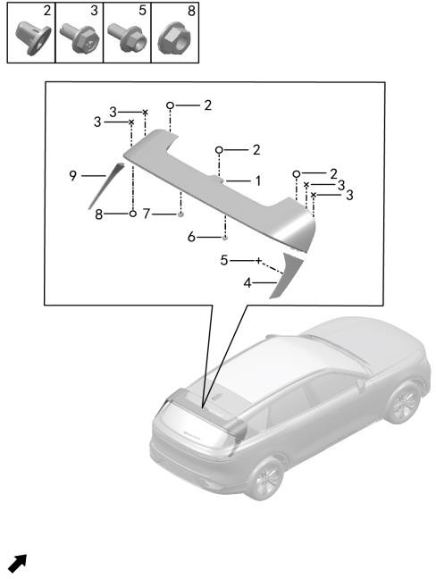

| Поз. | Артикул | Наименование | Кол-во | Системный номер | Примечание |
| ---: | --- | --- | ---: | --- | --- |
| 1 | 500606001 | Спойлер | 1 | H97A5006028AA |  |
| 2 | Q41006002 | Герметичная клипса | 3 | HQY37601 |  |
| 3 | Q11002018 | Болт | 4 | HQY1470612T8X1 |  |
| 4 | 630103001 | Правый задний боковой спойлер двери багажника | 1 | H97A6301080AA | замена на 630103002 |
| 4 | 630103002 | Правый задний боковой спойлер двери багажника | 1 | H97A6301080AB |  |
| 5 | Q11001001 | Фланцевый болт | 2 | HQ1840612 |  |
| 6 | 500623001 | Левая заглушка | 1 | H97A5006052AA |  |
| 7 | 500624001 | Правая заглушка | 1 | H97A5006053AA |  |
| 8 | Q21001011 | Фланцевая гайка | 3 | HQ32406L1 |  |
| 9 | 630102001 | Левый задний боковой спойлер двери багажника | 1 | H97A6301075AA | замена на 630102002 |
| 9 | 630102002 | Левый задний боковой спойлер двери багажника | 1 | H97A6301075AB |  |

## 6029-10 Эмблемы и наклейки

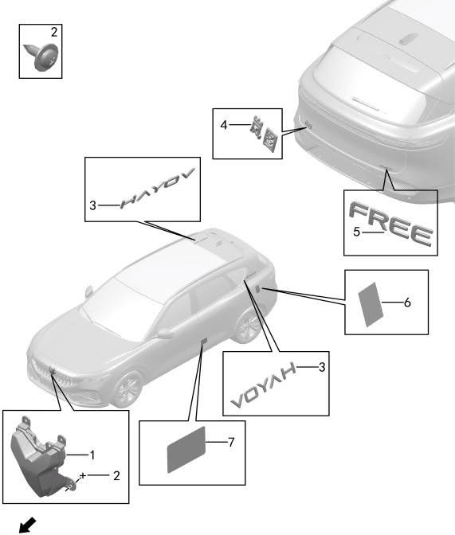

| Поз. | Артикул | Наименование | Кол-во | Системный номер | Примечание |
| ---: | --- | --- | ---: | --- | --- |
| 1 | 392501001 | Передняя эмблема | 1 | H97A3925001AA |  |
| 2 | Q12002004 | Самонарезающий винт | 4 | Q221B4816 |  |
| 3 | 392503001 | Боковой шильдик | 1 | H97A3925004AA |  |
| 4 | 392502001 | Задний шильдик | 1 | H97A3925003AA |  |
| 5 | 392301002 | Код модели | 1 | H97A3923002AA |  |
| 6 | 392303001 | Наклейка зарядной индикации | 1 | H97A3923006AA |  |
| 7 | 392302001 | Предупреждающая наклейка давления в шинах | 1 | H97A3923004AA |  |

## 6030-10 Накладки моторного отсека

- Описание: версия с рендж-экстендером (ДВС)

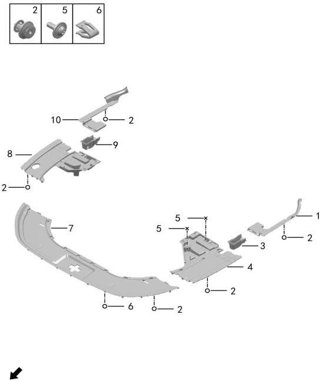

| Поз. | Артикул | Наименование | Кол-во | Системный номер | Примечание |
| ---: | --- | --- | ---: | --- | --- |
| 1 | 840505001 | Левая задняя декоративная панель моторного отсека | 1 | H97A8405025AA |  |
| 2 | Q41001003 | Клипса | 12 | 09406-08506 |  |
| 3 | 840510001 | Левая декоративная накладка шва | 1 | H97A8405031AA |  |
| 4 | 840501001 | Левая передняя декоративная панель моторного отсека | 1 | H97A8405005AA |  |
| 5 | Q12001002 | Винт с внутренним шестигранником | 4 | HQY215B0618X2 |  |
| 6 | Q41002001 | Пластиковая клипса | 31 | 09408-08003 |  |
| 7 | 840503003 | Передняя центральная декоративная панель моторного отсека | 1 | H97A8405015AC |  |
| 8 | 840502001 | Правая передняя декоративная панель моторного отсека | 1 | H97A8405010AA |  |
| 9 | 840506001 | Правая задняя декоративная панель моторного отсека | 1 | H97A8405030AA |  |
| 10 | 840511001 | Правая декоративная накладка шва | 1 | H97A8405035AA |  |

## 6030-11 Накладки моторного отсека

- Описание: электрическая версия

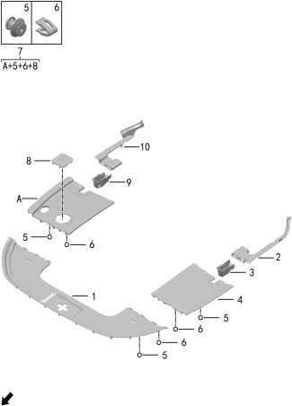

| Поз. | Артикул | Наименование | Кол-во | Системный номер | Примечание |
| ---: | --- | --- | ---: | --- | --- |
| 1 | 840503004 | Передняя центральная декоративная панель моторного отсека | 1 | H97A8405015BC |  |
| 2 | 840505001 | Левая задняя декоративная панель моторного отсека | 1 | H97A8405025AA |  |
| 3 | 840510001 | Левая декоративная накладка шва | 1 | H97A8405031AA |  |
| 4 | 840501002 | Левая передняя декоративная панель моторного отсека | 1 | H97A8405005BB |  |
| 5 | Q41001003 | Клипса | 12 | 09406-08506 |  |
| 6 | Q41002001 | Пластиковая клипса | 23 | 09408-08003 |  |
| 7 | 840502002 | Правая передняя декоративная панель моторного отсека | 1 | H97A8405010BA |  |
| 8 | 840511001 | Правая декоративная накладка шва | 1 | H97A8405035AA |  |
| 9 | 840506001 | Правая задняя декоративная панель моторного отсека | 1 | H97A8405030AA |  |

## 6032-10 Панель приборов

- Описание: версия с рендж-экстендером (ДВС), N1

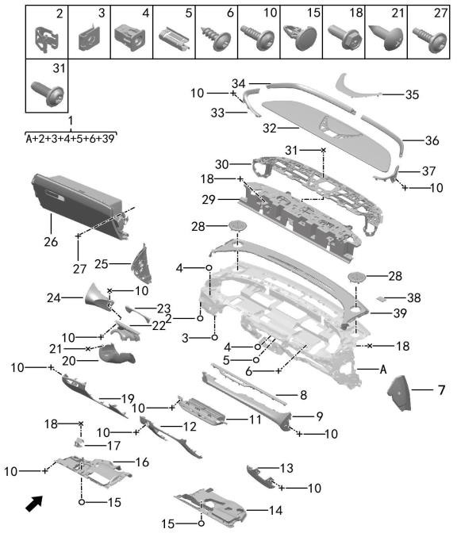

| Поз. | Артикул | Наименование | Кол-во | Системный номер | Примечание |
| ---: | --- | --- | ---: | --- | --- |
| 1 | 550101001BKGA | Панель приборов в сборе | 1 | H97A5501005AABKGA | черный |
| 2 | Q41001007 | Клипса | 64 | HQY970008 |  |
| 3 | Q21003006 | Пластинчатая пружинная гайка | 30 | HQY970012 |  |
| 4 | Q21004004 | Пластиковая гайка | 8 | HQY970011 |  |
| 5 | Q41001008 | Клипса | 2 | HQY970010 |  |
| 6 | Q12003001 | Винт | 3 | Q2734816F36 |  |
| 7 | 550131001BKGA | Правая торцевая крышка панели приборов | 1 | H97A5501080AABKGA | черный |
| 8 | 550106001GYPA | Задняя боковая декоративная планка | 1 | H97A5501041AAGYPA | серый металлик |
| 9 | 550113001BLAB | Правая декоративная панель | 1 | H97A5501900AABLAB | синий |
| 10 | Q12001020 | Винт с внутренним шестигранником | 42 | HQY27A4816 |  |
| 11 | 551702001 | Центральный дефлектор | 1 | H97A5517011AA |  |
| 12 | 550109001BKGA | Центральная защитная панель | 1 | H97A5501010AABKGA | черный |
| 13 | 550114001BKGA | Правая отделка бардачка | 1 | H97A5501012AABKGA | черный |
| 14 | 550129001BKGA | Правая нижняя панель панели приборов | 1 | H97A5501070AABKGA | черный |
| 15 | Q41001002 | Клипса | 11 | 09406-08302 |  |
| 16 | 550128001BKGA | Левая нижняя панель панели приборов | 1 | H97A5501065AABKGA | черный |
| 17 | 840201001 | Ручка открытия замка капота | 1 | 8402150-RA01 |  |
| 18 | Q11002020 | Болт | 27 | HQY1470616T8X1 |  |
| 19 | 550112001BKGA | Левая нижняя защитная панель | 1 | H97A5501105AABKGA | черный |
| 20 | 550135001BKGA | Нижний кожух рулевой колонки | 1 | H97A5501100AABKGA | черный |
| 20 | 550135001BEGA | Нижний кожух рулевой колонки | 1 | H97A5501100AABEGA | бежевый |
| 20 | 550135001BLGB | Нижний кожух рулевой колонки | 1 | H97A5501100AABLGB | синий |
| 21 | Q12002015 | Самонарезающий винт | 3 | Q2734816 |  |
| 22 | 550134001BEAA | Верхний кожух рулевой колонки | 1 | H97A5501095AABEAA | бежевый |
| 22 | 550134001BLAB | Верхний кожух рулевой колонки | 1 | H97A5501095AABLAB | синий |
| 22 | 550134001BRAA | Верхний кожух рулевой колонки | 1 | H97A5501095AABRAA | коричневый |
| 22 | 550134001BKAA | Верхний кожух рулевой колонки | 1 | H97A5501095AABKAA | черный |
| 23 | 550136001BLGB | Панель шторки | 1 | H97A5501099AABLGB | синий |
| 24 | 550110001BLAB | Левая декоративная панель | 1 | H97A5501025AABLAB | синий |
| 25 | 550130001BKGA | Левая торцевая крышка панели приборов | 1 | H97A5501075AABKGA | черный |
| 26 | 550127001BKGA | Бардачок | 1 | H97A5501060AABKGA | черный |
| 26 | 550127001BEGA | Бардачок | 1 | H97A5501060AABEGA | бежевый |
| 26 | 550127001BLGB | Бардачок | 1 | H97A5501060AABLGB | синий |
| 27 | Q12001021 | Винт с внутренним шестигранником | 9 | HQY27A4816X2 |  |
| 28 | 550139001BKPB | Крышка высокочастотного динамика | 2 | H97A5501128AABKPB | окраска черный |
| 28 | 550139001BLPC | Крышка высокочастотного динамика | 2 | H97A5501128AABLPC | окраска синий |
| 28 | 550139001BLPD | Крышка высокочастотного динамика | 2 | H97A5501128AABLPD | окраска синий |
| 28 | 550139001BRPA | Крышка высокочастотного динамика | 2 | H97A5501128AABRPA | окраска коричневый |
| 29 | 550137001 | Механизм подъема большого экрана | 1 | H97A5501110AA | замена на 550137002 |
| 29 | 550137002 | Механизм подъема большого экрана | 1 | H97A5501110AB |  |
| 30 | 550122001 | Каркас верхней крышки экрана | 1 | H97A5501035AA |  |
| 31 | Q12001016 | Винт с внутренним шестигранником | 16 | HQY27A0514 |  |
| 32 | 550125001BKAA | Верхняя крышка экрана | 1 | H97A5501055AABKAA | черный |
| 33 | 550104001BKGA | Левая декоративная планка | 1 | H97A5501007AABKGA | черный |
| 34 | 550102001GYPA | Левая передняя декоративная планка | 1 | H97A5501006AAGYPA | серый металлик |
| 35 | 550121001BRGB | Верхняя крышка экрана декоративный деталь | 1 | H97A5501016AABRGB | коричневый |
| 35 | 550121001BKGB | Верхняя крышка экрана декоративный деталь | 1 | H97A5501016AABKGB | черный |
| 35 | 550121001BLGD | Верхняя крышка экрана декоративный деталь | 1 | H97A5501016AABLGD | черный |
| 35 | 550121001BLGC | Верхняя крышка экрана декоративный деталь | 1 | H97A5501016AABLGC | синий |
| 36 | 550103001GYPA | Правая передняя декоративная планка | 1 | H97A5501014AAGYPA | серый металлик |
| 37 | 550105001BKGA | Правая декоративная планка | 1 | H97A5501008AABKGA | черный |
| 38 | 550140001 | Фетровая накладка панели приборов | 5 | H97A5501129AA |  |
| 39 | 550138001BKGA | Передняя панель размораживателя | 1 | H97A5501125AABKGA | черный |
| 39 | 550138001BLGA | Передняя панель размораживателя | 1 | H97A5501125AABLGA | синий |

## 6032-11 Панель приборов

- Описание: версия с рендж-экстендером (ДВС) N2/N3, электрическая версия

| Поз. | Артикул | Наименование | Кол-во | Системный номер | Примечание |
| ---: | --- | --- | ---: | --- | --- |
| 1 | 550101001BKGA | Панель приборов в сборе | 1 | H97A5501005AABKGA | черный |
| 1 | 550101001BLGA | Панель приборов в сборе | 1 | H97A5501005AABLGA | синий |
| 1 | 550101001BLGB | Панель приборов в сборе | 1 | H97A5501005AABLGB | синий |
| 1 | 550101001BRGA | Панель приборов в сборе | 1 | H97A5501005AABRGA | коричневый |
| 2 | Q41001007 | Клипса | 64 | HQY970008 |  |
| 3 | Q21003006 | Пластинчатая пружинная гайка | 30 | HQY970012 |  |
| 4 | Q21004004 | Пластиковая гайка | 8 | HQY970011 |  |
| 5 | Q41001008 | Клипса | 2 | HQY970010 |  |
| 6 | Q12003001 | Винт | 3 | Q2734816F36 |  |
| 7 | 550131001BKGA | Правая торцевая крышка панели приборов | 1 | H97A5501080AABKGA | черный |
| 7 | 550131001BEGA | Правая торцевая крышка панели приборов | 1 | H97A5501080AABEGA | бежевый |
| 7 | 550131001BLGB | Правая торцевая крышка панели приборов | 1 | H97A5501080AABLGB | синий |
| 7 | 550131001BRGA | Правая торцевая крышка панели приборов | 1 | H97A5501080AABRGA | коричневый |
| 8 | 550106001GYPA | Задняя боковая декоративная планка | 1 | H97A5501041AAGYPA | серый металлик |
| 9 | 550113001BLAB | Правая декоративная панель | 1 | H97A5501900AABLAB | синий |
| 9 | 550113001BEAA | Правая декоративная панель | 1 | H97A5501900AABEAA | бежевый |
| 9 | 550113001BRAB | Правая декоративная панель | 1 | H97A5501900AABRAB | светло-коричневый |
| 9 | 550113001BRAA | Правая декоративная панель | 1 | H97A5501900AABRAA | коричневый |
| 10 | Q12001020 | Винт с внутренним шестигранником | 33 | HQY27A4816 |  |
| 11 | 551702001 | Центральный дефлектор | 1 | H97A5517011AA |  |
| 12 | 550109001BKGA | Центральная защитная панель | 1 | H97A5501010AABKGA | черный |
| 12 | 550109001BEGA | Центральная защитная панель | 1 | H97A5501010AABEGA | бежевый |
| 12 | 550109001BLGB | Центральная защитная панель | 1 | H97A5501010AABLGB | синий |
| 13 | 550114001BLGB | Правая отделка бардачка | 1 | H97A5501012AABLGB | синий |
| 13 | 550114001BKGA | Правая отделка бардачка | 1 | H97A5501012AABKGA | черный |
| 13 | 550114001BEGA | Правая отделка бардачка | 1 | H97A5501012AABEGA | бежевый |
| 14 | 550129001BKGA | Правая нижняя панель панели приборов | 1 | H97A5501070AABKGA | черный |
| 15 | Q41001002 | Клипса | 11 | 09406-08302 |  |
| 16 | 550128001BKGA | Левая нижняя панель панели приборов | 1 | H97A5501065AABKGA | черный |
| 17 | 840201001 | Ручка открытия замка капота | 1 | 8402150-RA01 |  |
| 18 | Q11002020 | Болт | 27 | HQY1470616T8X1 |  |
| 19 | 550112001BKGA | Левая нижняя защитная панель | 1 | H97A5501105AABKGA | черный |
| 19 | 550112001BEGA | Левая нижняя защитная панель | 1 | H97A5501105AABEGA | бежевый |
| 19 | 550112001BLGB | Левая нижняя защитная панель | 1 | H97A5501105AABLGB | синий |
| 20 | 550135001BKGA | Нижний кожух рулевой колонки | 1 | H97A5501100AABKGA | черный |
| 20 | 550135001BEGA | Нижний кожух рулевой колонки | 1 | H97A5501100AABEGA | бежевый |
| 20 | 550135001BLGB | Нижний кожух рулевой колонки | 1 | H97A5501100AABLGB | синий |
| 21 | Q12002015 | Самонарезающий винт | 3 | Q2734816 |  |
| 22 | 550134001BLAB | Верхний кожух рулевой колонки | 1 | H97A5501095AABLAB | синий |
| 22 | 550134001BRAA | Верхний кожух рулевой колонки | 1 | H97A5501095AABRAA | коричневый |
| 22 | 550134001BKAA | Верхний кожух рулевой колонки | 1 | H97A5501095AABKAA | черный |
| 22 | 550134001BEAA | Верхний кожух рулевой колонки | 1 | H97A5501095AABEAA | бежевый |
| 23 | 550136001BLGB | Панель шторки | 1 | H97A5501099AABLGB | синий |
| 23 | 550136001BEGA | Панель шторки | 1 | H97A5501099AABEGA | бежевый |
| 23 | 550136001BRGC | Панель шторки | 1 | H97A5501099AABRGC | светло-коричневый |
| 23 | 550136001BRGA | Панель шторки | 1 | H97A5501099AABRGA | коричневый |
| 24 | 550110001BLAB | Левая декоративная панель | 1 | H97A5501025AABLAB | синий |
| 24 | 550110001BEAA | Левая декоративная панель | 1 | H97A5501025AABEAA | бежевый |
| 24 | 550110001BRAB | Левая декоративная панель | 1 | H97A5501025AABRAB | светло-коричневый |
| 24 | 550110001BRAA | Левая декоративная панель | 1 | H97A5501025AABRAA | коричневый |
| 25 | 550130001BLGB | Левая торцевая крышка панели приборов | 1 | H97A5501075AABLGB | синий |
| 25 | 550130001BRGA | Левая торцевая крышка панели приборов | 1 | H97A5501075AABRGA | коричневый |
| 25 | 550130001BKGA | Левая торцевая крышка панели приборов | 1 | H97A5501075AABKGA | черный |
| 25 | 550130001BEGA | Левая торцевая крышка панели приборов | 1 | H97A5501075AABEGA | бежевый |
| 26 | 550127001BKGA | Бардачок | 1 | H97A5501060AABKGA | черный |
| 26 | 550127001BEGA | Бардачок | 1 | H97A5501060AABEGA | бежевый |
| 26 | 550127001BLGB | Бардачок | 1 | H97A5501060AABLGB | синий |
| 27 | Q12001021 | Винт с внутренним шестигранником | 9 | HQY27A4816X2 |  |
| 28 | 550139002BKPB | Крышка высокочастотного динамика | 2 | H97A5501128BABKPB | окраска черный |
| 28 | 550139002BLPC | Крышка высокочастотного динамика | 2 | H97A5501128BABLPC | окраска синий |
| 28 | 550139002BLPD | Крышка высокочастотного динамика | 2 | H97A5501128BABLPD | окраска синий |
| 28 | 550139002BRPA | Крышка высокочастотного динамика | 2 | H97A5501128BABRPA | окраска коричневый |
| 29 | 550137001 | Механизм подъема большого экрана | 1 | H97A5501110AA | замена на 550137002 |
| 29 | 550137002 | Механизм подъема большого экрана | 1 | H97A5501110AB |  |
| 30 | 550122001 | Каркас верхней крышки экрана | 1 | H97A5501035AA |  |
| 31 | Q12001016 | Винт с внутренним шестигранником | 16 | HQY27A0514 |  |
| 32 | 550125002BKAA | Верхняя крышка экрана | 1 | H97A5501055BABKAA | Dynaudio, черный |
| 32 | 550125002BLAA | Верхняя крышка экрана | 1 | H97A5501055BABLAA | Dynaudio, синий |
| 32 | 550125001BLAA | Верхняя крышка экрана | 1 | H97A5501055AABLAA | обычная аудиосистема, синий |
| 32 | 550125001BRAA | Верхняя крышка экрана | 1 | H97A5501055AABRAA | обычная аудиосистема, коричневый |
| 32 | 550125001BLAB | Верхняя крышка экрана | 1 | H97A5501055AABLAB | обычная аудиосистема, синий |
| 32 | 550125002BRAA | Верхняя крышка экрана | 1 | H97A5501055BABRAA | Dynaudio, коричневый |
| 32 | 550125002BLAB | Верхняя крышка экрана | 1 | H97A5501055BABLAB | Dynaudio, синий |
| 33 | 550104001BKGA | Левая декоративная планка | 1 | H97A5501007AABKGA | черный |
| 33 | 550104001BLGA | Левая декоративная планка | 1 | H97A5501007AABLGA | синий |
| 33 | 550104001BLGB | Левая декоративная планка | 1 | H97A5501007AABLGB | синий |
| 33 | 550104001BRGA | Левая декоративная планка | 1 | H97A5501007AABRGA | коричневый |
| 34 | 550102001GYPA | Левая передняя декоративная планка | 1 | H97A5501006AAGYPA | серый металлик |
| 35 | 550126001BKGB | Кронштейн установки камеры | 1 | H97A5501059AABKGB | черный |
| 35 | 550126001BLGD | Кронштейн установки камеры | 1 | H97A5501059AABLGD | черный |
| 35 | 550126001BLGC | Кронштейн установки камеры | 1 | H97A5501059AABLGC | синий |
| 35 | 550126001BRGB | Кронштейн установки камеры | 1 | H97A5501059AABRGB | коричневый |
| 36 | 550103001GYPA | Правая передняя декоративная планка | 1 | H97A5501014AAGYPA | серый металлик |
| 37 | 550105001BKGA | Правая декоративная планка | 1 | H97A5501008AABKGA | черный |
| 37 | 550105001BLGA | Правая декоративная планка | 1 | H97A5501008AABLGA | синий |
| 37 | 550105001BLGB | Правая декоративная планка | 1 | H97A5501008AABLGB | синий |
| 37 | 550105001BRGA | Правая декоративная планка | 1 | H97A5501008AABRGA | коричневый |
| 38 | 550140001 | Фетровая накладка панели приборов | 5 | H97A5501129AA |  |
| 39 | 550138001BKGA | Передняя панель размораживателя | 1 | H97A5501125AABKGA | черный |
| 39 | 550138001BLGA | Передняя панель размораживателя | 1 | H97A5501125AABLGA | синий |

## 6033-10 Передние воздуховоды

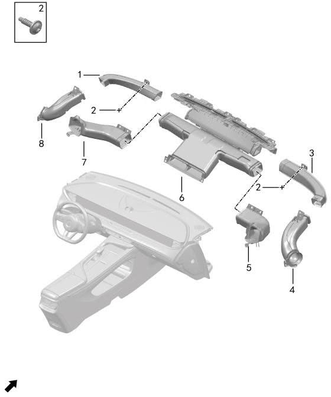

| Поз. | Артикул | Наименование | Кол-во | Системный номер | Примечание |
| ---: | --- | --- | ---: | --- | --- |
| 1 | 550116001 | Левый воздуховод размораживателя | 1 | H97A5501015AA |  |
| 2 | Q12001020 | Винт с внутренним шестигранником | 2 | HQY27A4816 |  |
| 3 | 550117001 | Правый воздуховод размораживателя | 1 | H97A5501020AA |  |
| 4 | 550120001 | Внутренняя часть правого воздуховода размораживателя | 1 | H97A5501124AA |  |
| 5 | 553311001 | Правый гибкий воздуховод | 1 | H97A5533012AA |  |
| 6 | 550118001 | Основной воздуховод в сборе | 1 | H97A5501120AA |  |
| 7 | 553310001 | Левый гибкий воздуховод | 1 | H97A5533011AA |  |
| 8 | 550119001 | Внутренняя часть левого воздуховода размораживателя | 1 | H97A5501123AA |  |

## 6034-10 Дефлекторы панели приборов

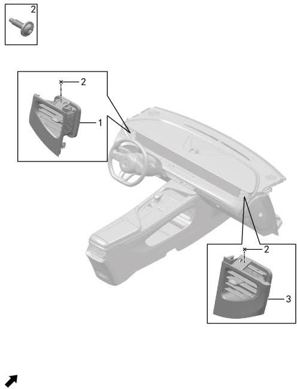

| Поз. | Артикул | Наименование | Кол-во | Системный номер | Примечание |
| ---: | --- | --- | ---: | --- | --- |
| 1 | 550123001 | Левый дефлектор | 1 | H97A5501045AA |  |
| 2 | Q12001020 | Винт с внутренним шестигранником | 2 | HQY27A4816 |  |
| 3 | 550124001 | Правый дефлектор | 1 | H97A5501050AA |  |

## 6035-10 Поперечная балка панели приборов

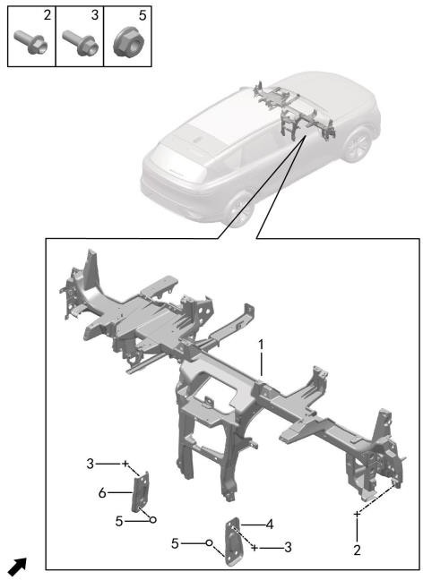

| Поз. | Артикул | Наименование | Кол-во | Системный номер | Примечание |
| ---: | --- | --- | ---: | --- | --- |
| 1 | 550115001 | Поперечина панели приборов | 1 | H97A5501013AA |  |
| 2 | Q11001018 | Фланцевый болт | 8 | HQ1840820 | замена на Q11002042 |
| 2 | Q11002042 | Болт | 8 | HQ140B0830X2L |  |
| 3 | Q11001004 | Фланцевый болт | 4 | HQ1840616 |  |
| 4 | 550108001 | Правый кронштейн соединения CCB | 1 | H97A5501011AA |  |
| 5 | Q21001002 | Фланцевая гайка | 4 | HQ32006 |  |
| 6 | 550107001 | Левый кронштейн соединения CCB | 1 | H97A5501009AA |  |

## 6036-10 Центральная консоль

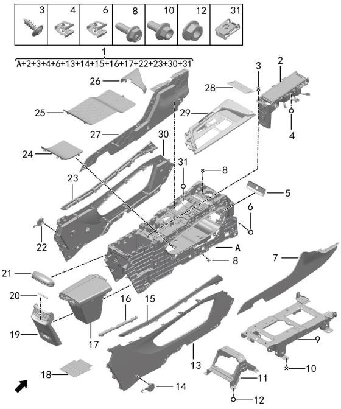

| Поз. | Артикул | Наименование | Кол-во | Системный номер | Примечание |
| ---: | --- | --- | ---: | --- | --- |
| 1 | 550503001BLAB | Центральная консоль | 1 | H97A5505005AABLAB | синий |
| 1 | 550503001BLAA | Центральная консоль | 1 | H97A5505005AABLAA | синий |
| 1 | 550503001BRAA | Центральная консоль | 1 | H97A5505005AABRAA | коричневый |
| 1 | 550503001BRAB | Центральная консоль | 1 | H97A5505005AABRAB | светло-коричневый |
| 2 | 553001001BKGB | Подстаканник со шторкой | 1 | H97A5530001AABKGB | черный |
| 3 | Q12003002 | Винт | 19 | HQY970009 |  |
| 4 | Q41001007 | Клипса | 8 | HQY970008 |  |
| 5 | 550514001BKGB | Крышка USB | 1 | H97A5505023AABKGB | черный |
| 6 | Q41001008 | Клипса | 52 | HQY970010 |  |
| 7 | 550513001BKGA | Правая передняя накладка-удлинитель | 1 | H97A5505022AABKGA | черный |
| 7 | 550513001BEGA | Правая передняя накладка-удлинитель | 1 | H97A5505022AABEGA | бежевый |
| 7 | 550513001BLGB | Правая передняя накладка-удлинитель | 1 | H97A5505022AABLGB | синий |
| 8 | Q11002020 | Болт | 10 | HQY1470616T8X1 |  |
| 9 | 500104001 | Средний кронштейн центральной консоли | 1 | H97A5001021AB |  |
| 10 | Q11001001 | Фланцевый болт | 4 | HQ1840612 |  |
| 11 | 500105001 | Задний кронштейн центральной консоли | 1 | H97A5001028AA |  |
| 12 | Q21001010 | Фланцевая гайка | 4 | HQ32406 |  |
| 13 | 550502001BKGA | Правая боковая панель центральной консоли | 1 | H97A5505002AABKGA | черный |
| 13 | 550502001BEGA | Правая боковая панель центральной консоли | 1 | H97A5505002AABEGA | бежевый |
| 13 | 550502001BLGB | Правая боковая панель центральной консоли | 1 | H97A5505002AABLGB | синий |
| 14 | 550521001BEGA | Правая заглушка винта | 2 | H97A5505041AABEGA | бежевый |
| 14 | 550521001BLGB | Правая заглушка винта | 2 | H97A5505041AABLGB | синий |
| 14 | 550521001BKGA | Правая заглушка винта | 2 | H97A5505041AABKGA | черный |
| 15 | 550516001BKAA | Правая боковая накладка | 1 | H97A5505025AABKAA | черный |
| 15 | 550516001BLAB | Правая боковая накладка | 1 | H97A5505025AABLAB | синий |
| 15 | 550516001BEAA | Правая боковая накладка | 1 | H97A5505025AABEAA | бежевый |
| 16 | 550517001BKPA | Декоративная планка подлокотника | 1 | H97A5505027AABKPA | глянцевый черный |
| 17 | 550301001BLAB | Подлокотник | 1 | H97A5503005AABLAB | синий |
| 17 | 550301001BRAA | Подлокотник | 1 | H97A5503005AABRAA | коричневый |
| 17 | 550301001BRAB | Подлокотник | 1 | H97A5503005AABRAB | светло-коричневый |
| 17 | 550301001BLAA | Подлокотник | 2 | H97A5503005AABLAA | синий |
| 18 | 550505001BKGB | Резиновый коврик подлокотника | 1 | H97A5505008AABKGB | черный |
| 19 | 550506001BKGA | Задняя крышка | 1 | H97A5505010AABKGA | черный |
| 19 | 550506001BEGA | Задняя крышка | 1 | H97A5505010AABEGA | бежевый |
| 19 | 550506001BLGB | Задняя крышка | 1 | H97A5505010AABLGB | синий |
| 20 | 550524001SACA | Декоративная планка с логотипом |  | H97A5505030AASACA | матовый хром |
| 21 | 550508001BLAB | Задняя накладка подлокотника | 1 | H97A5505015AABLAB | синий |
| 21 | 550508001BLAA | Задняя накладка подлокотника | 1 | H97A5505015AABLAA | синий |
| 21 | 550508001BRAB | Задняя накладка подлокотника | 1 | H97A5505015AABRAB | светло-коричневый |
| 21 | 550508001BRAA | Задняя накладка подлокотника | 1 | H97A5505015AABRAA | коричневый |
| 22 | 550522001BEGA | Левая заглушка винта | 2 | H97A5505040AABEGA | бежевый |
| 22 | 550522001BLGB | Левая заглушка винта | 2 | H97A5505040AABLGB | синий |
| 22 | 550522001BKGA | Левая заглушка винта | 2 | H97A5505040AABKGA | черный |
| 23 | 550515001BKAA | Левая боковая накладка | 1 | H97A5505024AABKAA | черный |
| 23 | 550515001BLAB | Левая боковая накладка | 1 | H97A5505024AABLAB | синий |
| 23 | 550515001BEAA | Левая боковая накладка | 1 | H97A5505024AABEAA | бежевый |
| 24 | 550510001BKGB | Заглушка ароматизатора | 1 | H97A5505017AABKGB | черный |
| 25 | 550504001BKGB | Резиновый коврик вещевого ящика | 1 | H97A5505006AABKGB | черный |
| 26 | 550509001BLAB | Крышка замка подлокотника | 1 | H97A5505016AABLAB | синий |
| 26 | 550509001BLAA | Крышка замка подлокотника | 1 | H97A5505016AABLAA | синий |
| 26 | 550509001BRAB | Крышка замка подлокотника | 1 | H97A5505016AABRAB | светло-коричневый |
| 26 | 550509001BRAA | Крышка замка подлокотника | 1 | H97A5505016AABRAA | коричневый |
| 27 | 550512001BKGA | Левая передняя накладка-удлинитель | 1 | H97A5505021AABKGA | черный |
| 27 | 550512001BEGA | Левая передняя накладка-удлинитель | 1 | H97A5505021AABEGA | бежевый |
| 27 | 550512001BLGB | Левая передняя накладка-удлинитель | 1 | H97A5505021AABLGB | синий |
| 28 | 550523001 | Коврик для телефона | 1 | H97A5505012BA |  |
| 29 | 550511002BLAB | Верхняя панель в сборе | 1 | H97A5505019BABLAB | замена на 550511004BLAB |
| 29 | 550511004BLAB | Верхняя панель в сборе | 1 | H97A5505019BBBLAB | синий |
| 29 | 550511002BLAA | Верхняя панель в сборе | 1 | H97A5505019BABLAA | замена на 550511004BLAA |
| 29 | 550511005BLAA | Верхняя панель в сборе | 1 | H97A5505019BBBLAA | синий |
| 29 | 550511001BLAA | Верхняя панель в сборе | 1 | H97A5505019AABLAA | синий |
| 29 | 550511001BRAB | Верхняя панель в сборе | 1 | H97A5505019AABRAB | светло-коричневый |
| 29 | 550511001BRAA | Верхняя панель в сборе | 1 | H97A5505019AABRAA | коричневый |
| 29 | 550511002BRAB | Верхняя панель в сборе | 1 | H97A5505019BABRAB | замена на 550511004BRAB |
| 29 | 550511006BRAB | Верхняя панель в сборе | 1 | H97A5505019BBBRAB | светло-коричневый |
| 29 | 550511002BRAA | Верхняя панель в сборе | 1 | H97A5505019BABRAA | замена на 550511004BRAA |
| 29 | 550511007BRAA | Верхняя панель в сборе | 1 | H97A5505019BBBRAA | коричневый |
| 29 | 550511001BLAB | Верхняя панель в сборе | 1 | H97A5505019AABLAB | замена на 550511003BLAB |
| 29 | 550511003BLAB | Верхняя панель в сборе | 1 | H97A5505019ABBLAB | синий |
| 30 | 550501001BKGA | Левая боковая панель центральной консоли | 1 | H97A5505001AABKGA | черный |
| 30 | 550501001BEGA | Левая боковая панель центральной консоли | 1 | H97A5505001AABEGA | бежевый |
| 30 | 550501001BLGB | Левая боковая панель центральной консоли | 1 | H97A5505001AABLGB | синий |
| 31 | Q21003004 | Пластинчатая пружинная гайка | 4 | HQY970007 |  |

## 6037-10 Задний воздуховод

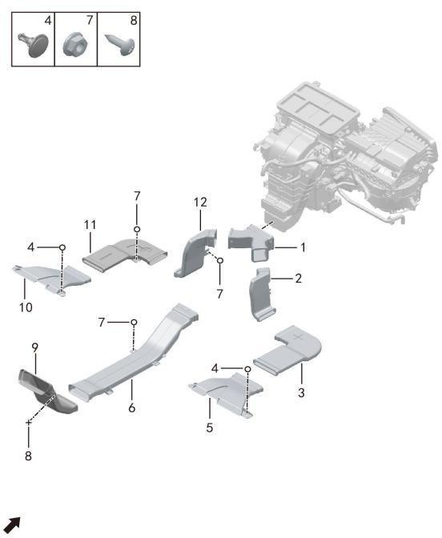

| Поз. | Артикул | Наименование | Кол-во | Системный номер | Примечание |
| ---: | --- | --- | ---: | --- | --- |
| 1 | 553305001 | Распределитель канала обдува ног заднего ряда | 1 | H97A5533005AA |  |
| 2 | 553302001 | Передняя секция правого заднего канала обдува ног | 1 | H97A5533002AA |  |
| 3 | 553304001 | Средняя секция правого заднего канала обдува ног | 1 | H97A5533004AA |  |
| 4 | Q41001011 | Клипса | 8 | HQY69601 |  |
| 5 | 553307001 | Задняя секция правого заднего канала обдува ног | 1 | H97A5533008AA |  |
| 6 | 553309001 | Передняя секция заднего лицевого воздуховода | 1 | H97A5533010AA |  |
| 7 | Q21001002 | Фланцевая гайка | 4 | HQ32006 |  |
| 8 | Q12002014 | Самонарезающий винт | 2 | Q2734216 |  |
| 9 | 553308001 | Задняя часть воздуховода обдува лица | 1 | H97A5533009AA |  |
| 10 | 553306001 | Задняя секция левого заднего канала обдува ног | 1 | H97A5533007AA |  |
| 11 | 553303001 | Средняя секция левого заднего канала обдува ног | 1 | H97A5533003AA |  |
| 12 | 553301001 | Передняя секция левого заднего канала обдува ног | 1 | H97A5533001AA |  |

## 6040-10 Обивка крыши

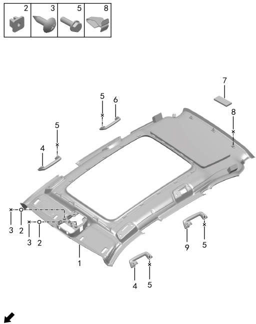

| Поз. | Артикул | Наименование | Кол-во | Системный номер | Примечание |
| ---: | --- | --- | ---: | --- | --- |
| 1 | 551801001BETA | Обивка крыши | 1 | H97A5518900AABETA | бежевый |
| 1 | 551801002BLTA | Обивка крыши | 1 | H97A5518900BABLTA | синий |
| 1 | 551801003BLTA | Обивка крыши | 1 | H97A5518900CBBLTA | синий |
| 1 | 551801002BETA | Обивка крыши | 1 | H97A5518900BABETA | бежевый |
| 1 | 551801003BETA | Обивка крыши | 1 | H97A5518900CBBETA | бежевый |
| 2 | Q21004006 | Пластиковая гайка | 2 | HQY398B01 |  |
| 3 | Q12002015 | Самонарезающий винт | 2 | Q2734816 |  |
| 4 | 552601001BEGB | Передняя потолочная ручка | 2 | H97A5526001AABEGB | бежевый |
| 4 | 552601001BLGB | Передняя потолочная ручка | 2 | H97A5526001AABLGB | синий |
| 5 | Q12001005 | Винт с внутренним шестигранником | 8 | HQY1400620 |  |
| 6 | 552603001BEGB | Правая задняя потолочная ручка | 1 | H97A5526008AABEGB | бежевый |
| 6 | 552603001BLGB | Правая задняя потолочная ручка | 1 | H97A5526008AABLGB | синий |
| 7 | 551802001 | Грибовидная застежка | 7 | H97A5518793AA |  |
| 8 | Q41001006 | Клипса | 4 | HQY970002 |  |
| 9 | 552602001BEGB | Левая задняя потолочная ручка | 1 | H97A5526007AABEGB | бежевый |
| 9 | 552602001BLGB | Левая задняя потолочная ручка | 1 | H97A5526007AABLGB | синий |

## 6041-10 Передняя боковая обивка

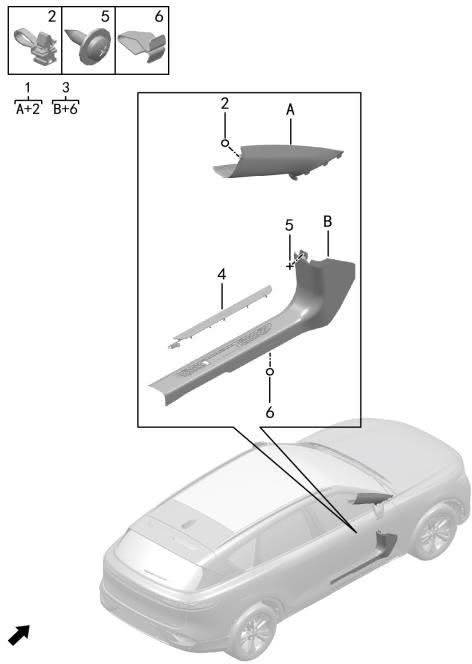

| Поз. | Артикул | Наименование | Кол-во | Системный номер | Примечание |
| ---: | --- | --- | ---: | --- | --- |
| 1 | 552001002BLTA | Левая верхняя накладка стойки A | 1 | H97A5520075ABBLTA | синий |
| 1 | 552001002BETA | Левая верхняя накладка стойки A | 1 | H97A5520075ABBETA | бежевый |
| 1 | 552002002BLTA | Правая верхняя накладка стойки A | 1 | H97A5520080ABBLTA | синий |
| 1 | 552002002BETA | Правая верхняя накладка стойки A | 1 | H97A5520080ABBETA | бежевый |
| 2 | Q41001010 | Клипса | 8 | HQY970006 |  |
| 3 | 551118001BLGB | Левая передняя накладка порога с приветственной подсветкой в сборе | 1 | H97A5511910BBBLGB | синий, подсветка приветствия: есть |
| 3 | 551119001BRGA | Правая передняя накладка порога с приветственной подсветкой в сборе | 1 | H97A5511911BBBRGA | коричневый, подсветка приветствия: есть |
| 3 | 551119002BLGB | Правая передняя накладка порога с приветственной подсветкой в сборе | 1 | H97A5511911BBBLGB | синий, подсветка приветствия: есть |
| 3 | 551118002BEGA | Левая передняя накладка порога с приветственной подсветкой в сборе | 1 | H97A5511910BBBEGA | бежевый, подсветка приветствия: есть |
| 3 | 551119003BKGA | Правая передняя накладка порога с приветственной подсветкой в сборе | 1 | H97A5511911BBBKGA | черный, подсветка приветствия: есть |
| 3 | 551119004BEGA | Правая передняя накладка порога с приветственной подсветкой в сборе | 1 | H97A5511911BBBEGA | бежевый, подсветка приветствия: есть |
| 3 | 551118003BKGA | Левая передняя накладка порога с приветственной подсветкой в сборе | 1 | H97A5511910BBBKGA | черный, подсветка приветствия: есть |
| 3 | 551118004BRGA | Левая передняя накладка порога с приветственной подсветкой в сборе | 1 | H97A5511910BBBRGA | коричневый, подсветка приветствия: есть |
| 3 | 551119005BLGB | Правая передняя накладка порога с приветственной подсветкой в сборе | 1 | H97A5511911ABBLGB | синий, подсветка приветствия: нет |
| 3 | 551118005BRGA | Левая передняя накладка порога с приветственной подсветкой в сборе | 1 | H97A5511910ABBRGA | коричневый, подсветка приветствия: нет |
| 3 | 551119006BRGA | Правая передняя накладка порога с приветственной подсветкой в сборе | 1 | H97A5511911ABBRGA | коричневый, подсветка приветствия: нет |
| 3 | 551118006BEGA | Левая передняя накладка порога с приветственной подсветкой в сборе | 1 | H97A5511910ABBEGA | бежевый, подсветка приветствия: нет |
| 3 | 551119007BKGA | Правая передняя накладка порога с приветственной подсветкой в сборе | 1 | H97A5511911ABBKGA | черный, подсветка приветствия: нет |
| 3 | 551119008BEGA | Правая передняя накладка порога с приветственной подсветкой в сборе | 1 | H97A5511911ABBEGA | бежевый, подсветка приветствия: нет |
| 3 | 551118007BKGA | Левая передняя накладка порога с приветственной подсветкой в сборе | 1 | H97A5511910ABBKGA | черный, подсветка приветствия: нет |
| 3 | 551118008BLGB | Левая передняя накладка порога с приветственной подсветкой в сборе | 1 | H97A5511910ABBLGB | синий, подсветка приветствия: нет |
| 4 | 551109001 | Левая передняя приветственная накладка порога | 1 | H97A5511051AA | без подсветки приветствия |
| 4 | 551109002 | Левая передняя приветственная накладка порога | 1 | H97A5511051BA | с подсветкой приветствия |
| 4 | 551110001 | Правая передняя приветственная накладка порога | 1 | H97A5511052AA | без подсветки приветствия |
| 4 | 551110002 | Правая передняя приветственная накладка порога | 1 | H97A5511052BA | с подсветкой приветствия |
| 5 | Q12002004 | Самонарезающий винт | 2 | Q221B4816 |  |
| 6 | Q41001006 | Клипса | 6 | HQY970002 |  |

## 6042-10 Средняя боковая обивка

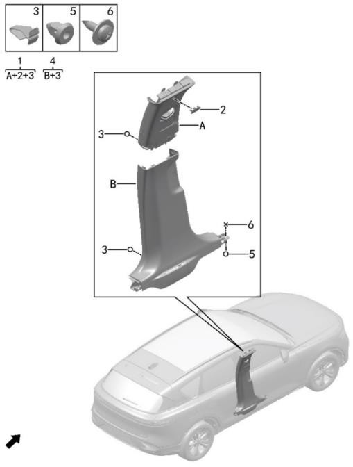

| Поз. | Артикул | Наименование | Кол-во | Системный номер | Примечание |
| ---: | --- | --- | ---: | --- | --- |
| 1 | 552003001BLTA | Левая верхняя накладка стойки B | 1 | H97A5520085ABBLTA | замена на 552003003BLTA |
| 1 | 552003002BETA | Левая верхняя накладка стойки B | 1 | H97A5520085ABBETA | замена на 552003003BETA |
| 1 | 552004001BLTA | Правая верхняя накладка стойки B | 1 | H97A5520090ABBLTA | замена на 552004003BLTA |
| 1 | 552004002BETA | Правая верхняя накладка стойки B | 1 | H97A5520090ABBETA | замена на 552004003BETA |
| 1 | 552003003BLTA | Левая верхняя накладка стойки B | 1 | H97A5520085ACBLTA | синий |
| 1 | 552003004BETA | Левая верхняя накладка стойки B | 1 | H97A5520085ACBETA | бежевый |
| 1 | 552004003BLTA | Правая верхняя накладка стойки B | 1 | H97A5520090ACBLTA | синий |
| 1 | 552004004BETA | Правая верхняя накладка стойки B | 1 | H97A5520090ACBETA | бежевый |
| 2 | 552030001 | Правая заглушка метки шторки безопасности стойки B | 2 | H97A5520176AA |  |
| 3 | Q41001006 | Клипса | 12 | HQY970002 |  |
| 4 | 552017001BKGA | Левая нижняя накладка стойки B | 1 | H97A5520125AABKGA | черный |
| 4 | 552017001BLGB | Левая нижняя накладка стойки B | 1 | H97A5520125AABLGB | синий |
| 4 | 552017001BRGA | Левая нижняя накладка стойки B | 1 | H97A5520125AABRGA | коричневый |
| 4 | 552017001BEGA | Левая нижняя накладка стойки B | 1 | H97A5520125AABEGA | бежевый |
| 4 | 552018001BKGA | Правая нижняя накладка стойки B | 1 | H97A5520130AABKGA | черный |
| 4 | 552018001BLGB | Правая нижняя накладка стойки B | 1 | H97A5520130AABLGB | синий |
| 4 | 552018001BRGA | Правая нижняя накладка стойки B | 1 | H97A5520130AABRGA | коричневый |
| 4 | 552018001BEGA | Правая нижняя накладка стойки B | 1 | H97A5520130AABEGA | бежевый |
| 5 | Q21004003 | Пластиковая гайка | 4 | HQY398B06 | замена на Q41006003 |
| 5 | Q41006003 | Герметичная клипса | 4 | HQY37605 |  |
| 6 | Q12002004 | Самонарезающий винт | 4 | Q221B4816 |  |

## 6043-10 Задняя боковая обивка

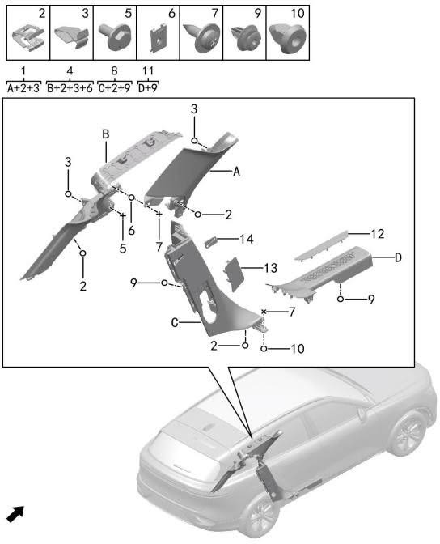

| Поз. | Артикул | Наименование | Кол-во | Системный номер | Примечание |
| ---: | --- | --- | ---: | --- | --- |
| 1 | 552019001BETA | Левая верхняя накладка стойки C | 1 | H97A5520135AABETA | бежевый |
| 1 | 552019001BLTA | Левая верхняя накладка стойки C | 1 | H97A5520135AABLTA | синий |
| 1 | 552020001BLTA | Правая верхняя накладка стойки C | 1 | H97A5520140AABLTA | синий |
| 1 | 552020001BETA | Правая верхняя накладка стойки C | 1 | H97A5520140AABETA | бежевый |
| 2 | Q41004001 | Зажим | 10 | HQY970005 | верхняя накладка стойки C в сборе, 2 шт.; нижняя накладка стойки C |
| 3 | Q41001006 | Клипса | 22 | HQY970002 | верхняя накладка стойки C в сборе, 8 шт.; верхняя накладка стойки D в сборе |
| 4 | 552023001BLGB | Левая верхняя накладка стойки D | 1 | H97A5520155AABLGB | замена на 552023003BLGB |
| 4 | 552023003BLGB | Левая верхняя накладка стойки D | 1 | H97A5520155ABBLGB | синий |
| 4 | 552023001BEGA | Левая верхняя накладка стойки D | 1 | H97A5520155AABEGA | замена на 552023002BEGA |
| 4 | 552023002BEGA | Левая верхняя накладка стойки D | 1 | H97A5520155ABBEGA | бежевый |
| 4 | 552024001BLGB | Правая верхняя накладка стойки D | 1 | H97A5520160AABLGB | замена на 552024003BLGB |
| 4 | 552024003BLGB | Правая верхняя накладка стойки D | 1 | H97A5520160ABBLGB | синий |
| 4 | 552024001BEGA | Правая верхняя накладка стойки D | 1 | H97A5520160AABEGA | замена на 552024002BEGA |
| 4 | 552024002BEGA | Правая верхняя накладка стойки D | 1 | H97A5520160ABBEGA | бежевый |
| 5 | Q11002001 | Болт | 2 | HQ1400616L2L |  |
| 6 | Q21003005 | Пластинчатая пружинная гайка | 2 | HQY970004 |  |
| 7 | Q12002004 | Самонарезающий винт | 8 | Q221B4816 | верхняя накладка стойки C в сборе, 2 шт.; нижняя накладка стойки C |
| 8 | 552021002BKAA | Левая нижняя накладка стойки C | 1 | H97A5520145ABBKAA | черный |
| 8 | 552021002BLAB | Левая нижняя накладка стойки C | 1 | H97A5520145ABBLAB | синий |
| 8 | 552021002BRAA | Левая нижняя накладка стойки C | 1 | H97A5520145ABBRAA | коричневый |
| 8 | 552021002BEAA | Левая нижняя накладка стойки C | 1 | H97A5520145ABBEAA | бежевый |
| 8 | 552022002BKAA | Правая нижняя накладка стойки C | 1 | H97A5520150ABBKAA | черный |
| 8 | 552022002BLAB | Правая нижняя накладка стойки C | 1 | H97A5520150ABBLAB | синий |
| 8 | 552022002BRAA | Правая нижняя накладка стойки C | 1 | H97A5520150ABBRAA | коричневый |
| 8 | 552022002BEAA | Правая нижняя накладка стойки C | 1 | H97A5520150ABBEAA | бежевый |
| 9 | Q41001009 | Клипса | 14 | HQY970003 | нижняя накладка стойки C в сборе, 8 шт.; накладка порога задней двери |
| 10 | Q21004003 | Пластиковая гайка | 4 | HQY398B06 | замена на Q41006003 |
| 10 | Q41006003 | Пластиковая гайка | 4 | HQY37605 |  |
| 11 | 551114003BKGA | Левая задняя накладка порога с приветственной подсветкой | 1 | H97A5512017AABKGA | черный |
| 11 | 551114003BLGB | Левая задняя накладка порога с приветственной подсветкой | 1 | H97A5512017AABLGB | синий |
| 11 | 551114003BRGA | Левая задняя накладка порога с приветственной подсветкой | 1 | H97A5512017AABRGA | коричневый |
| 11 | 551114003BEGA | Левая задняя накладка порога с приветственной подсветкой | 1 | H97A5512017AABEGA | бежевый |
| 11 | 551115001BLGB | Правая задняя накладка порога с приветственной подсветкой | 1 | H97A5512018AABLGB | синий |
| 11 | 551115001BRGA | Правая задняя накладка порога с приветственной подсветкой | 1 | H97A5512018AABRGA | коричневый |
| 11 | 551115001BEGA | Правая задняя накладка порога с приветственной подсветкой | 1 | H97A5512018AABEGA | бежевый |
| 11 | 551115001BKGA | Правая задняя накладка порога с приветственной подсветкой | 1 | H97A5512018AABKGA | черный |
| 12 | 551205001 | Левая задняя приветственная накладка порога | 1 | H97A5512013AA |  |
| 12 | 551206001 | Правая задняя приветственная накладка порога | 1 | H97A5512014AA |  |
| 13 | 552025001BKGA | Левая нижняя декоративная крышка стойки C | 1 | H97A5520163AABKGA | черный |
| 13 | 552025001BLGB | Левая нижняя декоративная крышка стойки C | 1 | H97A5520163AABLGB | синий |
| 13 | 552025001BRGA | Левая нижняя декоративная крышка стойки C | 1 | H97A5520163AABRGA | коричневый |
| 13 | 552025001BEGA | Левая нижняя декоративная крышка стойки C | 1 | H97A5520163AABEGA | бежевый |
| 13 | 552026001BLGB | Правая нижняя декоративная крышка стойки C | 1 | H97A5520164AABLGB | синий |
| 13 | 552026001BRGA | Правая нижняя декоративная крышка стойки C | 1 | H97A5520164AABRGA | коричневый |
| 13 | 552026001BEGA | Правая нижняя декоративная крышка стойки C | 1 | H97A5520164AABEGA | бежевый |
| 13 | 552026001BKGA | Правая нижняя декоративная крышка стойки C | 1 | H97A5520164AABKGA | черный |
| 14 | 552027002 | Левая декоративная накладка крюка фиксатора спинки сиденья | 1 | H97A5520165AB |  |
| 14 | 552028002 | Правая декоративная накладка крюка фиксатора спинки сиденья | 1 | H97A5520166AB |  |

## 6044-10 Обивка передних дверей

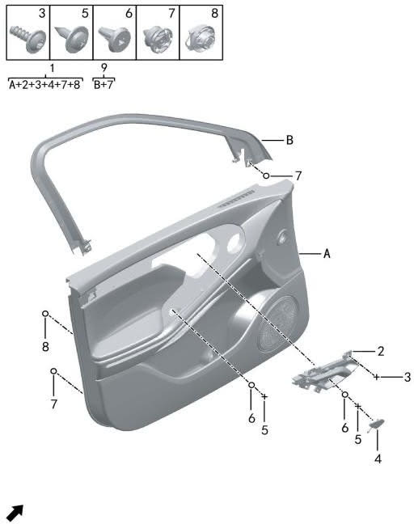

| Поз. | Артикул | Наименование | Кол-во | Системный номер | Примечание |
| ---: | --- | --- | ---: | --- | --- |
| 1 | 551103002BKAC | Правая передняя дверная карта | 1 | H97A5511901AABKAC | черный, обычная аудиосистема |
| 1 | 551101001BEAA | Левая передняя дверная карта | 1 | H97A5511900AABEAA | бежевый, обычная аудиосистема |
| 1 | 551101002BKAC | Левая передняя дверная карта | 1 | H97A5511900BABKAC | черный, аудиосистема Dynaudio |
| 1 | 551101002BEAA | Левая передняя дверная карта | 1 | H97A5511900BABEAA | бежевый, аудиосистема Dynaudio |
| 1 | 551101001BLAB | Левая передняя дверная карта | 1 | H97A5511900AABLAB | замена на 551101001BL02 |
| 1 | 551101001BL02 | Левая передняя дверная карта | 1 | H97A5511900AABL02 | синий, обычная аудиосистема |
| 1 | 551101001BRAA | Левая передняя дверная карта | 1 | H97A5511900AABRAA | коричневый, обычная аудиосистема |
| 1 | 551101002BLAB | Левая передняя дверная карта | 1 | H97A5511900BABLAB | замена на 551101002BL02 |
| 1 | 551101002BL02 | Левая передняя дверная карта | 1 | H97A5511900BABL02 | синий, аудиосистема Dynaudio |
| 1 | 551101002BRAA | Левая передняя дверная карта | 1 | H97A5511900BABRAA | коричневый, аудиосистема Dynaudio |
| 1 | 551103002BLAB | Правая передняя дверная карта | 1 | H97A5511901AABLAB | замена на 551103002BL02 |
| 1 | 551103002BL02 | Правая передняя дверная карта | 1 | H97A5511901AABL02 | синий, обычная аудиосистема |
| 1 | 551103002BRAA | Правая передняя дверная карта | 1 | H97A5511901AABRAA | коричневый, обычная аудиосистема |
| 1 | 551103001BLAB | Правая передняя дверная карта | 1 | H97A5511901BABLAB | замена на 551103001BL02 |
| 1 | 551103001BL02 | Правая передняя дверная карта | 1 | H97A5511901BABL02 | синий, аудиосистема Dynaudio |
| 1 | 551103001BRAA | Правая передняя дверная карта | 1 | H97A5511901BABRAA | коричневый, аудиосистема Dynaudio |
| 1 | 551101001BKAC | Левая передняя дверная карта | 1 | H97A5511900AABKAC | черный, обычная аудиосистема |
| 1 | 551103002BEAA | Правая передняя дверная карта | 1 | H97A5511901AABEAA | бежевый, обычная аудиосистема |
| 1 | 551103001BKAC | Правая передняя дверная карта | 1 | H97A5511901BABKAC | черный, аудиосистема Dynaudio |
| 1 | 551103001BEAA | Правая передняя дверная карта | 1 | H97A5511901BABEAA | бежевый, аудиосистема Dynaudio |
| 2 | 551105001 | Левая внутренняя ручка открывания | 1 | H97A5511035AA |  |
| 2 | 551106001 | Правая внутренняя ручка открывания | 1 | H97A5511040AA |  |
| 3 | Q12003005 | Винт | 8 | HQY970001 |  |
| 4 | 553504001 | Левая крышка винта внутренней ручки | 1 | H97A5535041AA |  |
| 4 | 553505001 | Правая крышка винта внутренней ручки | 1 | H97A5535042AA |  |
| 5 | Q12002005 | Самонарезающий винт | 6 | Q221B4816F38 |  |
| 6 | Q41006001 | Герметичная клипса | 6 | HQY37604 |  |
| 7 | 551116001 | Водозащитная клипса | 20 | H97A5511799AA |  |
| 8 | 551117000 | Противоударная клипса | 4 | H97A5511798AA |  |
| 9 | 551107001 | Левая верхняя декоративная накладка рамки передней двери | 1 | H97A5511041AA |  |
| 9 | 551108001 | Правая верхняя декоративная накладка рамки передней двери | 1 | H97A5511042AA |  |

## 6045-10 Обивка задних дверей

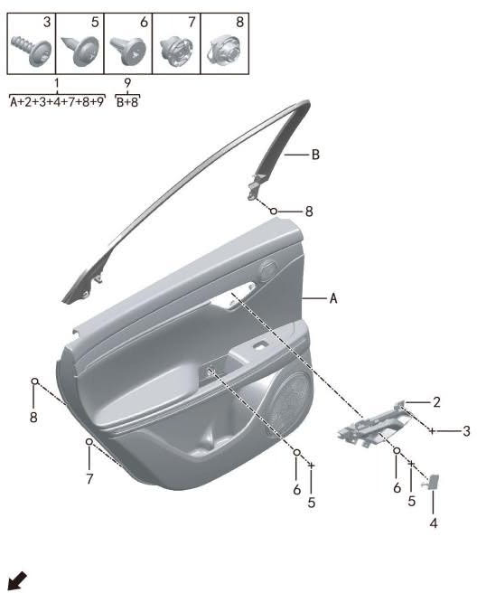

| Поз. | Артикул | Наименование | Кол-во | Системный номер | Примечание |
| ---: | --- | --- | ---: | --- | --- |
| 1 | 551201002BKAC | Левая задняя дверная карта | 1 | H97A5512900BABKAC | черный |
| 1 | 551201001BEAA | Левая задняя дверная карта | 1 | H97A5512900AABEAA | бежевый |
| 1 | 551201001BKAC | Левая задняя дверная карта | 1 | H97A5512900AABKAC | черный |
| 1 | 551201002BEAA | Левая задняя дверная карта | 1 | H97A5512900BABEAA | бежевый |
| 1 | 551201001BLAB | Левая задняя дверная карта | 1 | H97A5512900AABLAB | замена на 551201001BL02 |
| 1 | 551201001BL02 | Левая задняя дверная карта | 1 | H97A5512900AABL02 | синий |
| 1 | 551201001BRAA | Левая задняя дверная карта | 1 | H97A5512900AABRAA | коричневый |
| 1 | 551201002BLAB | Левая задняя дверная карта | 1 | H97A5512900BABLAB | замена на 551201002BL02 |
| 1 | 551201002BL02 | Левая задняя дверная карта | 1 | H97A5512900BABL02 | синий |
| 1 | 551201002BRAA | Левая задняя дверная карта | 1 | H97A5512900BABRAA | коричневый |
| 1 | 551202001BLAB | Правая задняя дверная карта | 1 | H97A5512901AABLAB | замена на 551202001BL02 |
| 1 | 551202001BL02 | Правая задняя дверная карта | 1 | H97A5512901AABL02 | синий |
| 1 | 551202001BRAA | Правая задняя дверная карта | 1 | H97A5512901AABRAA | коричневый |
| 1 | 551202002BLAB | Правая задняя дверная карта | 1 | H97A5512901BABLAB | замена на 551202002BL02 |
| 1 | 551202002BL02 | Правая задняя дверная карта | 1 | H97A5512901BABL02 | синий |
| 1 | 551202002BRAA | Правая задняя дверная карта | 1 | H97A5512901BABRAA | коричневый |
| 1 | 551202002BKAC | Правая задняя дверная карта | 1 | H97A5512901BABKAC | черный |
| 1 | 551202001BEAA | Правая задняя дверная карта | 1 | H97A5512901AABEAA | бежевый |
| 1 | 551202001BKAC | Правая задняя дверная карта | 1 | H97A5512901AABKAC | черный |
| 1 | 551202002BEAA | Правая задняя дверная карта | 1 | H97A5512901BABEAA | бежевый |
| 2 | 551105001 | Левая внутренняя ручка открывания | 1 | H97A5511035AA |  |
| 2 | 551106001 | Правая внутренняя ручка открывания | 1 | H97A5511040AA |  |
| 3 | Q12003005 | Винт | 8 | HQY970001 |  |
| 4 | 553504001 | Левая крышка винта внутренней ручки | 1 | H97A5535041AA |  |
| 4 | 553505001 | Правая крышка винта внутренней ручки | 1 | H97A5535042AA |  |
| 5 | Q12002005 | Самонарезающий винт | 6 | Q221B4816F38 |  |
| 6 | Q41006001 | Герметичная клипса | 6 | HQY37604 |  |
| 7 | 551116001 | Водозащитная клипса | 20 | H97A5511799AA |  |
| 8 | 551117000 | Противоударная клипса | 4 | H97A5511798AA |  |
| 9 | 551211001 | Левая верхняя декоративная накладка рамки задней двери | 1 | H97A5512033AA |  |
| 9 | 551212001 | Правая верхняя декоративная накладка рамки задней двери | 1 | H97A5512034AA |  |

## 6046-10 Обивка задней двери

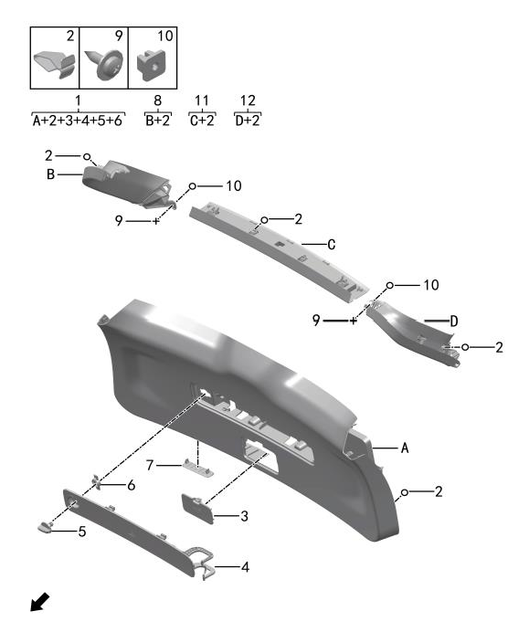

| Поз. | Артикул | Наименование | Кол-во | Системный номер | Примечание |
| ---: | --- | --- | ---: | --- | --- |
| 1 | 551501001 | Нижняя декоративная панель двери багажника | 1 | H97A5515010AA |  |
| 2 | Q41001006 | Клипса | 19 | HQY970002 |  |
| 3 | 551508001 | Крышка аварийного отверстия | 1 | H97A5515018AA |  |
| 4 | 551509001 | Основание крышки знака аварийной остановки | 1 | H97A5515045AA |  |
| 5 | 551510001 | Ручка крышки знака аварийной остановки | 1 | H97A5515046AA |  |
| 6 | 551511003 | Крепежная пластина ручки | 1 | H97A5515047AA |  |
| 7 | 551506001 | Крышка защелки ручки | 1 | H97A5515001AA |  |
| 8 | 551505001 | Правая декоративная панель двери багажника | 1 | H97A5515020AA |  |
| 9 | Q12002004 | Самонарезающий винт | 7 | Q221B4816 |  |
| 10 | Q21004006 | Пластиковая гайка | 7 | HQY398B01 |  |
| 11 | 551502001 | Верхняя декоративная панель двери багажника | 1 | H97A5515005AA |  |
| 12 | 551504001 | Левая декоративная панель двери багажника | 1 | H97A5515015AA |  |

## 6047-10 Ковровое покрытие

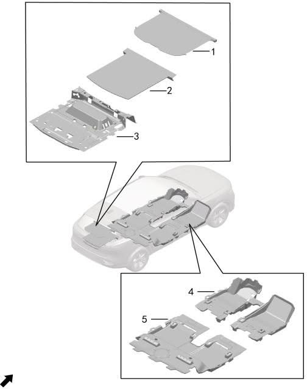

| Поз. | Артикул | Наименование | Кол-во | Системный номер | Примечание |
| ---: | --- | --- | ---: | --- | --- |
| 1 | 551507001 | Шторка багажного отделения | 1 | H97A5515023AA |  |
| 2 | 552201001 | Ковер багажника | 1 | H97A5522001AA |  |
| 3 | 551902001 | Ковровое покрытие заднего пола | 1 | H97A5519002AA |  |
| 4 | 551901001 | Передняя часть коврового покрытия пола | 1 | H97A5519001AA |  |
| 5 | 551903001 | Задняя часть коврового покрытия пола | 1 | H97A5519003AA |  |

## 6048-10 Отделка переднего багажника

- Описание: N1 стандартно

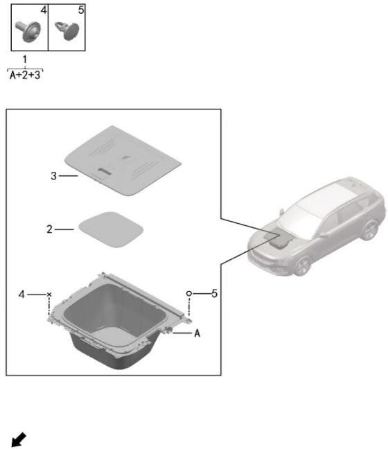

| Поз. | Артикул | Наименование | Кол-во | Системный номер | Примечание |
| ---: | --- | --- | ---: | --- | --- |
| 1 | 553507001 | Бокс переднего отсека | 1 | H97A5536025AB |  |
| 2 | 553508001 | Коврик бокса переднего отсека | 1 | H97A5536031AB |  |
| 3 | 553506001 | Крышка бокса переднего отсека | 1 | H97A5536016AA |  |
| 4 | Q12001002 | Винт с внутренним шестигранником | 8 | HQY215B0618X2 |  |
| 5 | Q41001002 | Клипса | 2 | 09406-08302 |  |

## 6049-10 Облицовка заднего багажного отсека

- Описание: N1 стандартно, электрическая версия N2 стандартно

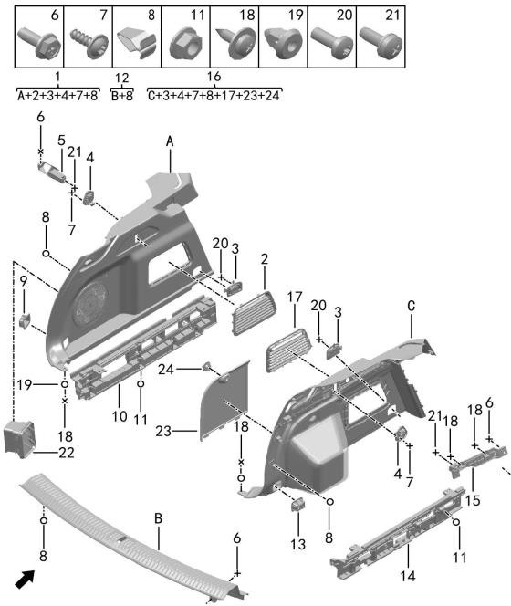

| Поз. | Артикул | Наименование | Кол-во | Системный номер | Примечание |
| ---: | --- | --- | ---: | --- | --- |
| 1 | 552008001BLGB | Левая задняя боковая обивка | 1 | H97A5520105AABLGB | синий |
| 1 | 552008001BEGA | Левая задняя боковая обивка | 1 | H97A5520105AABEGA | бежевый |
| 1 | 552008001BKGA | Левая задняя боковая обивка | 1 | H97A5520105AABKGA | графитовый черный |
| 2 | 552015001 | Левый вентиляционный выход багажника | 1 | H97A5520122AA | Dynaudio |
| 3 | 552005001 | Передний крючок багажника | 2 | H97A5520095AA |  |
| 4 | 552014001 | Крючок | 2 | H97A5520116AA |  |
| 5 | 552012001 | Левый монтажный кронштейн задней боковины | 1 | H97A5520113AA |  |
| 6 | Q11002020 | Болт | 7 | HQY1470616T8X1 |  |
| 7 | Q12003005 | Винт | 6 | HQY970001 |  |
| 8 | Q41001006 | Клипса | 12 | HQY970002 |  |
| 9 | 552006001 | Левый задний крючок багажника | 1 | H97A5520097AA |  |
| 10 | 552010001 | Нижний левый кронштейн задней боковины | 1 | H97A5520111AA |  |
| 11 | Q21001010 | Фланцевая гайка | 12 | HQ32406 |  |
| 12 | 551503001BKGA | Накладка порога двери багажника | 1 | H97A5515013AABKGA | черный |
| 13 | 552007001 | Правый задний крючок багажника | 1 | H97A5520102AA |  |
| 14 | 552011001 | Нижний правый кронштейн задней боковины | 1 | H97A5520112AA |  |
| 15 | 552013001 | Правый монтажный кронштейн задней боковины | 1 | H97A5520114AA |  |
| 16 | 552009001BLGB | Правая задняя боковая обивка | 1 | H97A5520110AABLGB | синий |
| 16 | 552009001BEGA | Правая задняя боковая обивка | 1 | H97A5520110AABEGA | бежевый |
| 16 | 552009001BKGA | Правая задняя боковая обивка | 1 | H97A5520110AABKGA | черный |
| 17 | 552016001 | Правый вентиляционный выход багажника | 1 | H97A5520126AA |  |
| 18 | Q12002004 | Самонарезающий винт | 4 | Q221B4816 |  |
| 19 | Q21004003 | Пластиковая гайка | 2 | HQY398B06 | замена на Q41006003 |
| 19 | Q41006003 | Герметичная клипса | 2 | HQY37605 |  |
| 20 | Q12001006 | Винт с внутренним шестигранником | 2 | Q215B0616T1F62 |  |
| 21 | Q12002001 | Самонарезающий винт | 2 | Q220B4813F38A |  |
| 22 | 820002001 | Клапан сброса давления | 2 | H97A5006013AA |  |
| 23 | 552031001 | Крышка инструментального отсека багажника | 1 | H97A5520123AA |  |
| 24 | 552032001 | Ручка крышки инструментального отсека багажника | 1 | H97A5520124AA |  |

## 6049-11 Облицовка заднего багажного отсека

- Описание: N3, версия с рендж-экстендером (ДВС) N2

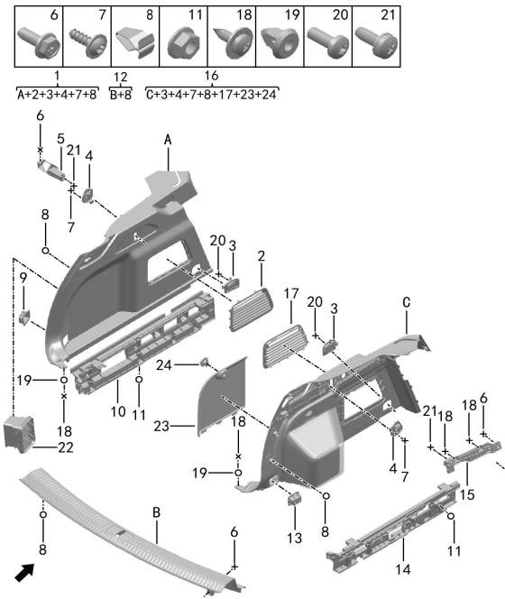

| Поз. | Артикул | Наименование | Кол-во | Системный номер | Примечание |
| ---: | --- | --- | ---: | --- | --- |
| 1 | 552008002BLGB | Левая задняя боковая обивка | 1 | H97A5520105BABLGB | синий |
| 1 | 552008002BEGA | Левая задняя боковая обивка | 1 | H97A5520105BABEGA | бежевый |
| 1 | 552008002BKGA | Левая задняя боковая обивка | 1 | H97A5520105BABKGA | графитовый черный |
| 2 | 552015001 | Левый вентиляционный выход багажника | 1 | H97A5520122AA | Dynaudio |
| 3 | 552005001 | Передний крючок багажника | 2 | H97A5520095AA |  |
| 4 | 552014001 | Крючок | 2 | H97A5520116AA |  |
| 5 | 552012001 | Левый монтажный кронштейн задней боковины | 1 | H97A5520113AA |  |
| 6 | Q11002020 | Болт | 7 | HQY1470616T8X1 |  |
| 7 | Q12003005 | Винт | 6 | HQY970001 |  |
| 8 | Q41001006 | Клипса | 12 | HQY970002 |  |
| 9 | 552006001 | Левый задний крючок багажника | 1 | H97A5520097AA |  |
| 10 | 552010001 | Нижний левый кронштейн задней боковины | 1 | H97A5520111AA |  |
| 11 | Q21001010 | Фланцевая гайка | 12 | HQ32406 |  |
| 12 | 551503001BKGA | Накладка порога двери багажника | 1 | H97A5515013AABKGA | черный |
| 13 | 552007001 | Правый задний крючок багажника | 1 | H97A5520102AA |  |
| 14 | 552011001 | Нижний правый кронштейн задней боковины | 1 | H97A5520112AA |  |
| 15 | 552013001 | Правый монтажный кронштейн задней боковины | 1 | H97A5520114AA |  |
| 16 | 552009001BKGA | Правая задняя боковая обивка | 1 | H97A5520110AABKGA | графитовый черный |
| 16 | 552009001BLGB | Правая задняя боковая обивка | 1 | H97A5520110AABLGB | синий |
| 16 | 552009001BEGA | Правая задняя боковая обивка | 1 | H97A5520110AABEGA | бежевый |
| 17 | 552016001 | Правый вентиляционный выход багажника | 1 | H97A5520126AA |  |
| 18 | Q12002004 | Самонарезающий винт | 4 | Q221B4816 |  |
| 19 | Q21004003 | Пластиковая гайка | 2 | HQY398B06 | замена на Q41006003 |
| 19 | Q41006003 | Герметичная клипса | 2 | HQY37605 |  |
| 20 | Q12001006 | Винт с внутренним шестигранником | 2 | Q215B0616T1F62 |  |
| 21 | Q12002001 | Самонарезающий винт | 2 | Q220B4813F38A |  |
| 22 | 820002001 | Клапан сброса давления | 2 | H97A5006013AA |  |
| 23 | 552031001 | Крышка инструментального отсека багажника | 1 | H97A5520123AA |  |
| 24 | 552032001 | Ручка крышки инструментального отсека багажника | 1 | H97A5520124AA |  |

## 6050-10 Шумоизоляционные элементы

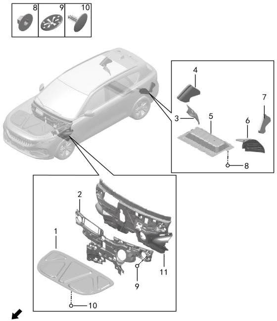

| Поз. | Артикул | Наименование | Кол-во | Системный номер | Примечание |
| ---: | --- | --- | ---: | --- | --- |
| 1 | 501303001 | Шумоизоляционный мат передней крышки | 1 | H97A5013003AA |  |
| 1 | 501303002 | Шумоизоляционный мат передней крышки | 1 | H97A5013003BA |  |
| 2 | 501305001 | Теплоизоляционный мат переднего отсека | 1 | H97A5536001AA | замена на 501305002 |
| 2 | 501305002 | Теплоизоляционный мат переднего отсека | 1 | H97A5536001AB |  |
| 3 | 310402001 | Правый шумоизоляционный мат под облицовкой колесной арки | 1 | H97A3104004AA |  |
| 4 | 501302001 | Правый звукопоглощающий мат задней боковины | 1 | H97A5013002AA |  |
| 5 | 553501001 | Теплоизоляционная прокладка электродвигателя | 1 | H97A5535002AA |  |
| 6 | 310401001 | Левый шумоизоляционный мат под облицовкой колесной арки | 1 | H97A3104003AA |  |
| 7 | 501301001 | Левый звукопоглощающий мат задней боковины | 1 | H97A5013001AA |  |
| 8 | Q21004001 | Пластиковая гайка | 9 | HQY38001 |  |
| 9 | Q41003001 | Металлическая клипса | 18 | HQY68901 |  |
| 10 | Q41001004 | Клипса | 11 | 09409-06201 |  |
| 11 | 501304001 | Шумоизоляционный мат щитка передней перегородки | 1 | H97A5013005AA | без стеклянной крыши, панорамный люк |
| 11 | 501304002 | Шумоизоляционный мат щитка передней перегородки | 1 | H97A5013005BA | затемняемое стекло и атмосферная подсветка |

## 6051-10 Сиденье водителя

- Описание: N1 стандартно

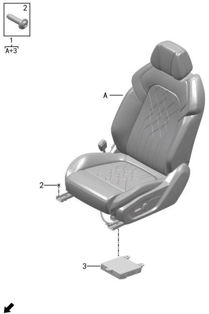

| Поз. | Артикул | Наименование | Кол-во | Системный номер | Примечание |
| ---: | --- | --- | ---: | --- | --- |
| 1 | 690001001BLTA | Сиденье водителя в сборе | 1 | H97A6900900AABLTA | черный |
| 2 | Q11002033 | Болт | 4 | HQY215B1035T10L2D |  |
| 3 | 680914001 | Контроллер сиденья водителя | 1 | H97A3608800AA |  |

## 6051-11 Сиденье водителя

- Описание: N1 опция, N2 и N3 стандартно

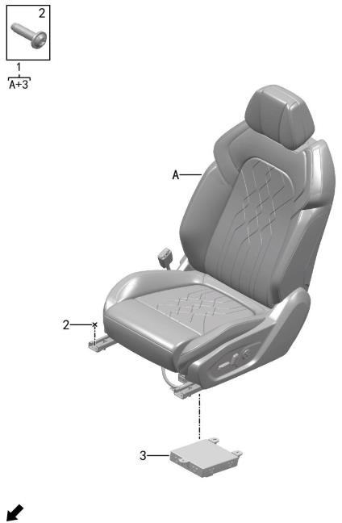

| Поз. | Артикул | Наименование | Кол-во | Системный номер | Примечание |
| ---: | --- | --- | ---: | --- | --- |
| 1 | 690001002BLAD | Сиденье водителя в сборе | 1 | H97A6900900BABLAD | черный |
| 1 | 690001002BEAB | Сиденье водителя в сборе | 1 | H97A6900900BABEAB | бежевый |
| 1 | 690001002BLAB | Сиденье водителя в сборе | 1 | H97A6900900BABLAB | синий |
| 1 | 690001002BRAA | Сиденье водителя в сборе | 1 | H97A6900900BABRAA | коричневый |
| 1 | 690001003BLAD | Сиденье водителя в сборе | 1 | H97A6900900CABLAD | черный |
| 1 | 690001003BLAB | Сиденье водителя в сборе | 1 | H97A6900900CABLAB | синий |
| 1 | 690001003BRAA | Сиденье водителя в сборе | 1 | H97A6900900CABRAA | коричневый |
| 1 | 690001003BEAB | Сиденье водителя в сборе | 1 | H97A6900900CABEAB | специальная версия с рендж-экстендером (ДВС); электрическая версия, бежевый |
| 2 | Q11002033 | Болт | 4 | HQY215B1035T10L2D |  |
| 3 | 680914002 | Контроллер сиденья водителя | 1 | H97A3608800BA |  |

## 6052-10 Подушка и спинка сиденья водителя

- Описание: N1 стандартно

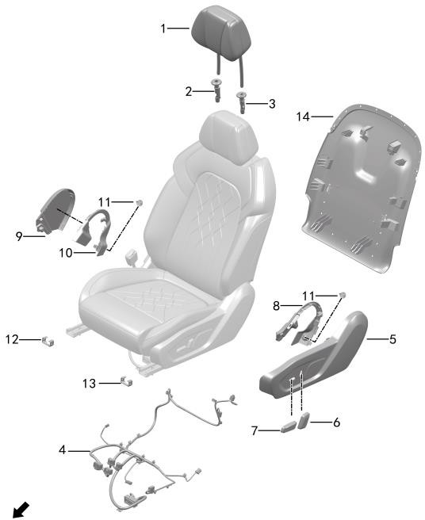

| Поз. | Артикул | Наименование | Кол-во | Системный номер | Примечание |
| ---: | --- | --- | ---: | --- | --- |
| 1 | 680801001BKLA | Передний подголовник | 1 | H97A6808001AABKLA | черный |
| 2 | 680802001BKGC | Гладкая направляющая втулка подголовника | 1 | H97A6808002AABKGC | черный |
| 3 | 680803001BKGC | Фиксируемая направляющая втулка подголовника | 1 | H97A6808003AABKGC | черный |
| 4 | 681001001 | Жгут проводов сиденья | 1 | H97A6810001AA |  |
| 5 | 680901001BKAA | Внешняя накладка сиденья водителя | 1 | H97A6809003AABKAA | черный |
| 6 | 680902001BKGC | Кнопка регулировки спинки | 1 | H97A6809001AABKGC | черный, хром |
| 7 | 680903001BKGC | Кнопка электропривода сиденья | 1 | H97A6809002AABKGC | черный, хром |
| 8 | 680904001BKAA | Внутренняя крышка снаружи водительского сиденья | 1 | H97A6809011AABKAA | черный |
| 9 | 680905001BKAA | Внутренняя накладка сиденья водителя | 1 | H97A6809004AABKAA | черный |
| 10 | 680906001BKAA | Внутренняя крышка с внутренней стороны водительского сиденья | 1 | H97A6809012AABKAA | черный |
| 11 | 680907001BKAA | Заглушка внутренней крышки снаружи водительского сиденья | 2 | H97A6809013AABKAA | черный |
| 12 | 691101001BKGC | Левая передняя крышка салазок водительского сиденья | 1 | H97A6911001AABKGC | черный |
| 13 | 691102001BKGC | Крышка салазок сиденья | 3 | H97A6911002AABKGC | черный |
| 14 | 680501001BKAA | Задняя панель сиденья | 1 | H97A6805001AABKAA | замена на 680501005BKAA |
| 14 | 680501005BKAA | Задняя панель сиденья | 1 | H97A6805001ABBKAA | черный |

## 6052-11 Подушка и спинка сиденья водителя

- Описание: N2 стандартно

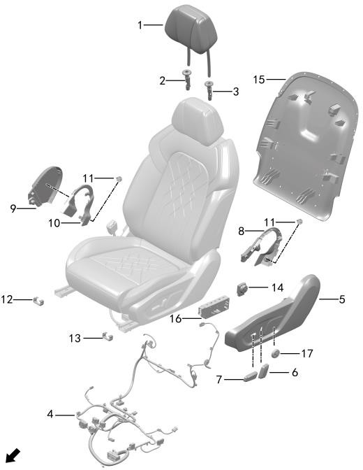

| Поз. | Артикул | Наименование | Кол-во | Системный номер | Примечание |
| ---: | --- | --- | ---: | --- | --- |
| 1 | 680801001BKLA | Передний подголовник | 1 | H97A6808001AABKLA | черный |
| 1 | 680801001BRLA | Передний подголовник | 1 | H97A6808001AABRLA | светло-коричневый |
| 1 | 680801001BELA | Передний подголовник | 1 | H97A6808001AABELA | бежевый |
| 1 | 680801001BEAB | Передний подголовник | 1 | H97A6808001AABEAB | сине-бежевый |
| 2 | 680802001BKGC | Гладкая направляющая втулка подголовника | 1 | H97A6808002AABKGC | черный |
| 2 | 680802001BRGD | Гладкая направляющая втулка подголовника | 1 | H97A6808002AABRGD | светло-коричневый |
| 2 | 680802001BEGB | Гладкая направляющая втулка подголовника | 1 | H97A6808002AABEGB | бежевый |
| 2 | 680802001BLGE | Гладкая направляющая втулка подголовника | 1 | H97A6808002AABLGE | синий |
| 3 | 680803001BKGC | Фиксируемая направляющая втулка подголовника | 1 | H97A6808003AABKGC | черный |
| 3 | 680803001BRGD | Фиксируемая направляющая втулка подголовника | 1 | H97A6808003AABRGD | светло-коричневый |
| 3 | 680803001BEGB | Фиксируемая направляющая втулка подголовника | 1 | H97A6808003AABEGB | бежевый |
| 3 | 680803001BLGE | Фиксируемая направляющая втулка подголовника | 1 | H97A6808003AABLGE | синий |
| 4 | 681001002 | Жгут проводов сиденья | 1 | H97A6810001BA |  |
| 5 | 680901002BKAA | Внешняя накладка сиденья водителя | 1 | H97A6809003BABKAA | черный |
| 5 | 680901002BLAB | Внешняя накладка сиденья водителя | 1 | H97A6809003BABLAB | синий |
| 5 | 680901002BRAA | Внешняя накладка сиденья водителя | 1 | H97A6809003BABRAA | коричневый |
| 5 | 680901002BLAA | Внешняя накладка сиденья водителя | 1 | H97A6809003BABLAA | синий |
| 6 | 680902001BKGC | Кнопка регулировки спинки | 1 | H97A6809001AABKGC | черный, матовый хром |
| 7 | 680903001BKGC | Кнопка электропривода сиденья | 1 | H97A6809002AABKGC | черный, матовый хром |
| 8 | 680904001BKAA | Внутренняя крышка снаружи водительского сиденья | 1 | H97A6809011AABKAA | черный |
| 8 | 680904001BLAB | Внутренняя крышка снаружи водительского сиденья | 1 | H97A6809011AABLAB | синий |
| 8 | 680904001BRAA | Внутренняя крышка снаружи водительского сиденья | 1 | H97A6809011AABRAA | коричневый |
| 8 | 680904001BLAA | Внутренняя крышка снаружи водительского сиденья | 1 | H97A6809011AABLAA | синий |
| 9 | 680905001BKAA | Внутренняя накладка сиденья водителя | 1 | H97A6809004AABKAA | черный |
| 9 | 680905001BLAB | Внутренняя накладка сиденья водителя | 1 | H97A6809004AABLAB | синий |
| 9 | 680905001BRAA | Внутренняя накладка сиденья водителя | 1 | H97A6809004AABRAA | коричневый |
| 9 | 680905001BLAA | Внутренняя накладка сиденья водителя | 1 | H97A6809004AABLAA | синий |
| 10 | 680906001BKAA | Внутренняя крышка с внутренней стороны водительского сиденья | 1 | H97A6809012AABKAA | черный |
| 10 | 680906001BLAB | Внутренняя крышка с внутренней стороны водительского сиденья | 1 | H97A6809012AABLAB | синий |
| 10 | 680906001BRAA | Внутренняя крышка с внутренней стороны водительского сиденья | 1 | H97A6809012AABRAA | коричневый |
| 10 | 680906001BLAA | Внутренняя крышка с внутренней стороны водительского сиденья | 1 | H97A6809012AABLAA | синий |
| 11 | 680907001BKAA | Заглушка внутренней крышки снаружи водительского сиденья | 2 | H97A6809013AABKAA | черный |
| 11 | 680907001BLAB | Заглушка внутренней крышки снаружи водительского сиденья | 2 | H97A6809013AABLAB | синий |
| 11 | 680907001BRAA | Заглушка внутренней крышки снаружи водительского сиденья | 2 | H97A6809013AABRAA | коричневый |
| 11 | 680907001BLAA | Заглушка внутренней крышки снаружи водительского сиденья | 2 | H97A6809013AABLAA | синий |
| 12 | 691101001BKGC | Левая передняя крышка салазок водительского сиденья | 1 | H97A6911001AABKGC | черный |
| 13 | 691102001BKGC | Крышка салазок сиденья | 3 | H97A6911002AABKGC | черный |
| 14 | 680909001BKGC | Переключатель поясничной опоры | 1 | H97A6809005AABKGC | черный |
| 15 | 680501001BKAA | Задняя панель сиденья | 1 | H97A6805001AABKAA | замена на 680501005BKAA |
| 15 | 680501004BRAB | Задняя панель сиденья | 1 | H97A6805001AABRAB | замена на 680501008BRAB |
| 15 | 680501002BEAA | Задняя панель сиденья | 1 | H97A6805001AABEAA | замена на 680501006BEAA |
| 15 | 680501003BLAA | Задняя панель сиденья | 1 | H97A6805001AABLAA |  |
| 15 | 680501005BKAA | Задняя панель сиденья | 1 | H97A6805001ABBKAA | черный |
| 15 | 680501008BRAB | Задняя панель сиденья | 1 | H97A6805001ABBRAB | светло-коричневый |
| 15 | 680501006BEAA | Задняя панель сиденья | 1 | H97A6805001ABBEAA | бежевый |
| 15 | 680501007BLAA | Задняя панель сиденья | 1 | H97A6805001ABBLAA | синий |

## 6052-12 Подушка и спинка сиденья водителя

- Описание: N1 опция, N3 стандартно

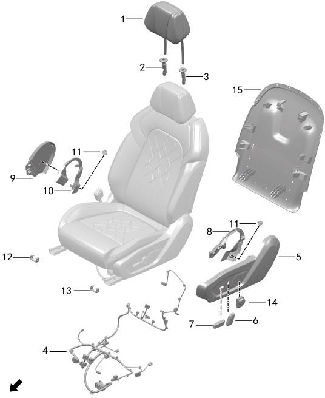

| Поз. | Артикул | Наименование | Кол-во | Системный номер | Примечание |
| ---: | --- | --- | ---: | --- | --- |
| 1 | 680801001BKLA | Передний подголовник | 1 | H97A6808001AABKLA | черный |
| 1 | 680801001BRLA | Передний подголовник | 1 | H97A6808001AABRLA | светло-коричневый |
| 1 | 680801001BELA | Передний подголовник | 1 | H97A6808001AABELA | бежевый |
| 1 | 680801001BEAB | Передний подголовник | 1 | H97A6808001AABEAB | сине-бежевый |
| 2 | 680802001BKGC | Гладкая направляющая втулка подголовника | 1 | H97A6808002AABKGC | черный |
| 2 | 680802001BRGD | Гладкая направляющая втулка подголовника | 1 | H97A6808002AABRGD | светло-коричневый |
| 2 | 680802001BEGB | Гладкая направляющая втулка подголовника | 1 | H97A6808002AABEGB | бежевый |
| 2 | 680802001BLGE | Гладкая направляющая втулка подголовника | 1 | H97A6808002AABLGE | синий |
| 3 | 680803001BKGC | Фиксируемая направляющая втулка подголовника | 1 | H97A6808003AABKGC | черный |
| 3 | 680803001BRGD | Фиксируемая направляющая втулка подголовника | 1 | H97A6808003AABRGD | светло-коричневый |
| 3 | 680803001BEGB | Фиксируемая направляющая втулка подголовника | 1 | H97A6808003AABEGB | бежевый |
| 3 | 680803001BLGE | Фиксируемая направляющая втулка подголовника | 1 | H97A6808003AABLGE | синий |
| 4 | 681001003 | Жгут проводов сиденья | 1 | H97A6810001CA |  |
| 5 | 680901002BKAA | Внешняя накладка сиденья водителя | 1 | H97A6809003BABKAA | черный |
| 5 | 680901002BLAB | Внешняя накладка сиденья водителя | 1 | H97A6809003BABLAB | синий |
| 5 | 680901002BRAA | Внешняя накладка сиденья водителя | 1 | H97A6809003BABRAA | коричневый |
| 5 | 680901002BLAA | Внешняя накладка сиденья водителя | 1 | H97A6809003BABLAA | синий |
| 6 | 680902001BKGC | Кнопка регулировки спинки | 1 | H97A6809001AABKGC | черный, матовый хром |
| 7 | 680903001BKGC | Кнопка электропривода сиденья | 1 | H97A6809002AABKGC | черный, матовый хром |
| 8 | 680904001BKAA | Внутренняя крышка снаружи водительского сиденья | 1 | H97A6809011AABKAA | черный |
| 8 | 680904001BLAB | Внутренняя крышка снаружи водительского сиденья | 1 | H97A6809011AABLAB | синий |
| 8 | 680904001BRAA | Внутренняя крышка снаружи водительского сиденья | 1 | H97A6809011AABRAA | коричневый |
| 8 | 680904001BLAA | Внутренняя крышка снаружи водительского сиденья | 1 | H97A6809011AABLAA | синий |
| 9 | 680905001BKAA | Внутренняя накладка сиденья водителя | 1 | H97A6809004AABKAA | черный |
| 9 | 680905001BLAB | Внутренняя накладка сиденья водителя | 1 | H97A6809004AABLAB | синий |
| 9 | 680905001BRAA | Внутренняя накладка сиденья водителя | 1 | H97A6809004AABRAA | коричневый |
| 9 | 680905001BLAA | Внутренняя накладка сиденья водителя | 1 | H97A6809004AABLAA | синий |
| 10 | 680906001BKAA | Внутренняя крышка с внутренней стороны водительского сиденья | 1 | H97A6809012AABKAA | черный |
| 10 | 680906001BLAB | Внутренняя крышка с внутренней стороны водительского сиденья | 1 | H97A6809012AABLAB | синий |
| 10 | 680906001BRAA | Внутренняя крышка с внутренней стороны водительского сиденья | 1 | H97A6809012AABRAA | коричневый |
| 10 | 680906001BLAA | Внутренняя крышка с внутренней стороны водительского сиденья | 1 | H97A6809012AABLAA | синий |
| 11 | 680907001BKAA | Заглушка внутренней крышки снаружи водительского сиденья | 2 | H97A6809013AABKAA | черный |
| 11 | 680907001BLAB | Заглушка внутренней крышки снаружи водительского сиденья | 2 | H97A6809013AABLAB | синий |
| 11 | 680907001BRAA | Заглушка внутренней крышки снаружи водительского сиденья | 2 | H97A6809013AABRAA | коричневый |
| 11 | 680907001BLAA | Заглушка внутренней крышки снаружи водительского сиденья | 2 | H97A6809013AABLAA | синий |
| 12 | 691101001BKGC | Левая передняя крышка салазок водительского сиденья | 1 | H97A6911001AABKGC | черный |
| 13 | 691102001BKGC | Крышка салазок сиденья | 3 | H97A6911002AABKGC | черный |
| 14 | 680909001BKGC | Переключатель поясничной опоры | 1 | H97A6809005AABKGC | черный |
| 15 | 680501001BKAA | Задняя панель сиденья | 1 | H97A6805001AABKAA | замена на 680501005BKAA |
| 15 | 680501004BRAB | Задняя панель сиденья | 1 | H97A6805001AABRAB | замена на 680501008BRAB |
| 15 | 680501002BEAA | Задняя панель сиденья | 1 | H97A6805001AABEAA | замена на 680501006BEAA |
| 15 | 680501003BLAA | Задняя панель сиденья | 1 | H97A6805001AABLAA |  |
| 15 | 680501005BKAA | Задняя панель сиденья | 1 | H97A6805001ABBKAA | черный |
| 15 | 680501008BRAB | Задняя панель сиденья | 1 | H97A6805001ABBRAB | светло-коричневый |
| 15 | 680501006BEAA | Задняя панель сиденья | 1 | H97A6805001ABBEAA | бежевый |
| 15 | 680501007BLAA | Задняя панель сиденья | 1 | H97A6805001ABBLAA | синий |

## 6053-10 Сиденье переднего пассажира

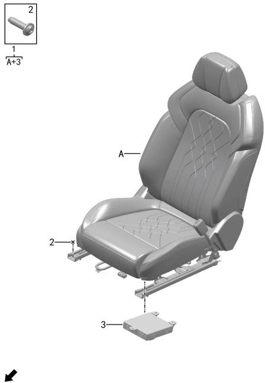

| Поз. | Артикул | Наименование | Кол-во | Системный номер | Примечание |
| ---: | --- | --- | ---: | --- | --- |
| 1 | 690002001BLTA | Сиденье переднего пассажира в сборе | 1 | H97A6900901AABLTA | черно-синий |
| 1 | 690002003BEAB | Сиденье переднего пассажира в сборе | 1 | H97A6900901CABEAB | бежевый |
| 1 | 690002003BLAB | Сиденье переднего пассажира в сборе | 1 | H97A6900901CABLAB | синий |
| 1 | 690002003BRAA | Сиденье переднего пассажира в сборе | 1 | H97A6900901CABRAA | коричневый |
| 1 | 690002003BLAD | Сиденье переднего пассажира в сборе | 1 | H97A6900901CABLAD | черно-синий |
| 1 | 690002002BLAD | Сиденье переднего пассажира в сборе | 1 | H97A6900901BABLAD | черно-синий |
| 1 | 690002002BEAB | Сиденье переднего пассажира в сборе | 1 | H97A6900901BABEAB | бежевый |
| 1 | 690002002BLAB | Сиденье переднего пассажира в сборе | 1 | H97A6900901BABLAB | синий |
| 1 | 690002002BRAA | Сиденье переднего пассажира в сборе | 1 | H97A6900901BABRAA | коричневый |
| 2 | Q11002033 | Болт | 4 | HQY215B1035T10L2D |  |
| 3 | 680914001 | Контроллер сиденья водителя | 1 | H97A3608800AA |  |

## 6054-10 Подушка и спинка сиденья переднего пассажира

- Описание: N1 стандартно

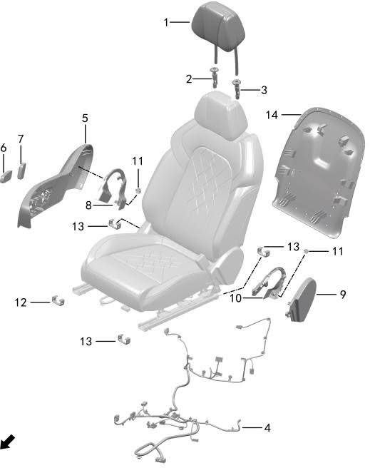

| Поз. | Артикул | Наименование | Кол-во | Системный номер | Примечание |
| ---: | --- | --- | ---: | --- | --- |
| 1 | 680801001BKLA | Передний подголовник | 1 | H97A6808001AABKLA | черный |
| 2 | 680802001BKGC | Гладкая направляющая втулка подголовника | 1 | H97A6808002AABKGC | черный |
| 3 | 680803001BKGC | Фиксируемая направляющая втулка подголовника | 1 | H97A6808003AABKGC | черный |
| 4 | 681001004 | Жгут проводов сиденья | 1 | H97A6810002AA |  |
| 5 | 680908001BKAA | Внешняя накладка пассажирского сиденья | 1 | H97A6809006AABKAA | черный |
| 6 | 680902002BKGC | Кнопка регулировки спинки | 1 | H97A6809008AABKGC | черный, матовый хром |
| 7 | 680903002BKGC | Кнопка электропривода сиденья | 1 | H97A6809009AABKGC | черный, матовый хром |
| 8 | 680911001BKAA | Внутренняя крышка снаружи пассажирского сиденья | 1 | H97A6809014AABKAA | черный |
| 9 | 680912001BKAA | Внутренняя накладка пассажирского сиденья | 1 | H97A6809007AABKAA | черный |
| 10 | 680913001BKAA | Внутренняя крышка с внутренней стороны пассажирского сиденья | 1 | H97A6809015AABKAA | черный |
| 11 | 680907001BKAA | Заглушка внутренней крышки снаружи водительского сиденья | 2 | H97A6809013AABKAA | черный |
| 12 | 691103001BKGC | Правая передняя крышка салазок пассажирского сиденья | 1 | H97A6911006AABKGC | черный |
| 13 | 691102001BKGC | Крышка салазок сиденья | 3 | H97A6911002AABKGC | черный |
| 14 | 680501001BKAA | Задняя панель сиденья | 1 | H97A6805001AABKAA | замена на 680501005BKAA |
| 14 | 680501005BKAA | Задняя панель сиденья | 1 | H97A6805001ABBKAA | черный |

## 6054-11 Подушка и спинка сиденья переднего пассажира

- Описание: N2 стандартно

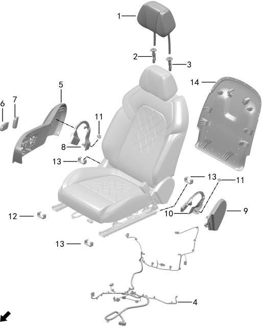

| Поз. | Артикул | Наименование | Кол-во | Системный номер | Примечание |
| ---: | --- | --- | ---: | --- | --- |
| 1 | 680801001BKLA | Передний подголовник | 1 | H97A6808001AABKLA | черный |
| 1 | 680801001BRLA | Передний подголовник | 1 | H97A6808001AABRLA | светло-коричневый |
| 1 | 680801001BELA | Передний подголовник | 1 | H97A6808001AABELA | бежевый |
| 1 | 680801001BEAB | Передний подголовник | 1 | H97A6808001AABEAB | сине-бежевый |
| 2 | 680802001BKGC | Гладкая направляющая втулка подголовника | 1 | H97A6808002AABKGC | черный |
| 2 | 680802001BRGD | Гладкая направляющая втулка подголовника | 1 | H97A6808002AABRGD | светло-коричневый |
| 2 | 680802001BEGB | Гладкая направляющая втулка подголовника | 1 | H97A6808002AABEGB | бежевый |
| 2 | 680802001BLGE | Гладкая направляющая втулка подголовника | 1 | H97A6808002AABLGE | синий |
| 3 | 680803001BKGC | Фиксируемая направляющая втулка подголовника | 1 | H97A6808003AABKGC | черный |
| 3 | 680803001BRGD | Фиксируемая направляющая втулка подголовника | 1 | H97A6808003AABRGD | светло-коричневый |
| 3 | 680803001BEGB | Фиксируемая направляющая втулка подголовника | 1 | H97A6808003AABEGB | бежевый |
| 3 | 680803001BLGE | Фиксируемая направляющая втулка подголовника | 1 | H97A6808003AABLGE | синий |
| 4 | 681001005 | Жгут проводов сиденья | 1 | H97A6810002BA |  |
| 5 | 680908002BKAA | Внешняя накладка пассажирского сиденья | 1 | H97A6809006BABKAA | черный |
| 5 | 680908002BLAB | Внешняя накладка пассажирского сиденья | 1 | H97A6809006BABLAB | синий |
| 5 | 680908002BRAA | Внешняя накладка пассажирского сиденья | 1 | H97A6809006BABRAA | коричневый |
| 5 | 680908002BLAA | Внешняя накладка пассажирского сиденья | 1 | H97A6809006BABLAA | синий |
| 6 | 680902002BKGC | Кнопка регулировки спинки | 1 | H97A6809008AABKGC | черный, матовый хром |
| 7 | 680903002BKGC | Кнопка электропривода сиденья | 1 | H97A6809009AABKGC | черный, матовый хром |
| 8 | 680911001BKAA | Внутренняя крышка снаружи пассажирского сиденья | 1 | H97A6809014AABKAA | черный |
| 8 | 680911001BLAB | Внутренняя крышка снаружи пассажирского сиденья | 1 | H97A6809014AABLAB | синий |
| 8 | 680911001BRAA | Внутренняя крышка снаружи пассажирского сиденья | 1 | H97A6809014AABRAA | коричневый |
| 8 | 680911001BLAA | Внутренняя крышка снаружи пассажирского сиденья | 1 | H97A6809014AABLAA | синий |
| 9 | 680912001BKAA | Внутренняя накладка пассажирского сиденья | 1 | H97A6809007AABKAA | черный |
| 9 | 680912001BLAB | Внутренняя накладка пассажирского сиденья | 1 | H97A6809007AABLAB | синий |
| 9 | 680912001BRAA | Внутренняя накладка пассажирского сиденья | 1 | H97A6809007AABRAA | коричневый |
| 9 | 680912001BLAA | Внутренняя накладка пассажирского сиденья | 1 | H97A6809007AABLAA | синий |
| 10 | 680913001BKAA | Внутренняя крышка с внутренней стороны пассажирского сиденья | 1 | H97A6809015AABKAA | черный |
| 10 | 680913001BLAB | Внутренняя крышка с внутренней стороны пассажирского сиденья | 1 | H97A6809015AABLAB | синий |
| 10 | 680913001BRAA | Внутренняя крышка с внутренней стороны пассажирского сиденья | 1 | H97A6809015AABRAA | коричневый |
| 10 | 680913001BLAA | Внутренняя крышка с внутренней стороны пассажирского сиденья | 1 | H97A6809015AABLAA | синий |
| 11 | 680907001BKAA | Заглушка внутренней крышки снаружи водительского сиденья | 2 | H97A6809013AABKAA | черный |
| 11 | 680907001BLAB | Заглушка внутренней крышки снаружи водительского сиденья | 2 | H97A6809013AABLAB | синий |
| 11 | 680907001BRAA | Заглушка внутренней крышки снаружи водительского сиденья | 2 | H97A6809013AABRAA | коричневый |
| 11 | 680907001BLAA | Заглушка внутренней крышки снаружи водительского сиденья | 2 | H97A6809013AABLAA | синий |
| 12 | 691103001BKGC | Правая передняя крышка салазок пассажирского сиденья | 1 | H97A6911006AABKGC | черный |
| 13 | 691102001BKGC | Крышка салазок сиденья | 3 | H97A6911002AABKGC | черный |
| 14 | 680501001BKAA | Задняя панель сиденья | 1 | H97A6805001AABKAA | замена на 680501005BKAA |
| 14 | 680501004BRAB | Задняя панель сиденья | 1 | H97A6805001AABRAB | замена на 680501008BRAB |
| 14 | 680501002BEAA | Задняя панель сиденья | 1 | H97A6805001AABEAA | замена на 680501006BEAA |
| 14 | 680501003BLAA | Задняя панель сиденья | 1 | H97A6805001AABLAA |  |
| 14 | 680501005BKAA | Задняя панель сиденья | 1 | H97A6805001ABBKAA | черный |
| 14 | 680501008BRAB | Задняя панель сиденья | 1 | H97A6805001ABBRAB | светло-коричневый |
| 14 | 680501006BEAA | Задняя панель сиденья | 1 | H97A6805001ABBEAA | бежевый |
| 14 | 680501007BLAA | Задняя панель сиденья | 1 | H97A6805001ABBLAA | синий |

## 6054-12 Подушка и спинка сиденья переднего пассажира

- Описание: N1 опция, N3 стандартно, специальная версия: рендж-экстендер; электрическая версия

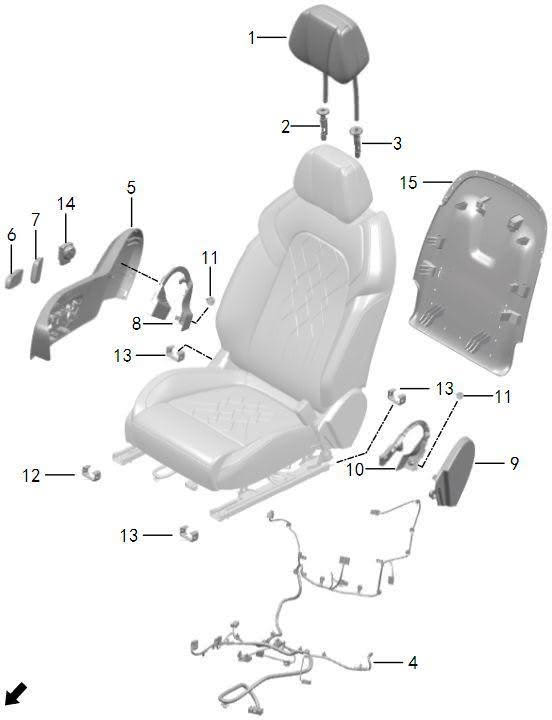

| Поз. | Артикул | Наименование | Кол-во | Системный номер | Примечание |
| ---: | --- | --- | ---: | --- | --- |
| 1 | 680801001BKLA | Передний подголовник | 1 | H97A6808001AABKLA | черный |
| 1 | 680801001BRLA | Передний подголовник | 1 | H97A6808001AABRLA | светло-коричневый |
| 1 | 680801001BELA | Передний подголовник | 1 | H97A6808001AABELA | бежевый |
| 1 | 680801001BEAB | Передний подголовник | 1 | H97A6808001AABEAB | сине-бежевый |
| 2 | 680802001BKGC | Гладкая направляющая втулка подголовника | 1 | H97A6808002AABKGC | черный |
| 2 | 680802001BRGD | Гладкая направляющая втулка подголовника | 1 | H97A6808002AABRGD | светло-коричневый |
| 2 | 680802001BEGB | Гладкая направляющая втулка подголовника | 1 | H97A6808002AABEGB | бежевый |
| 2 | 680802001BLGE | Гладкая направляющая втулка подголовника | 1 | H97A6808002AABLGE | синий |
| 3 | 680803001BKGC | Фиксируемая направляющая втулка подголовника | 1 | H97A6808003AABKGC | черный |
| 3 | 680803001BRGD | Фиксируемая направляющая втулка подголовника | 1 | H97A6808003AABRGD | светло-коричневый |
| 3 | 680803001BEGB | Фиксируемая направляющая втулка подголовника | 1 | H97A6808003AABEGB | бежевый |
| 3 | 680803001BLGE | Фиксируемая направляющая втулка подголовника | 1 | H97A6808003AABLGE | синий |
| 4 | 681001006 | Жгут проводов сиденья | 1 | H97A6810002CA |  |
| 5 | 680908002BKAA | Внешняя накладка пассажирского сиденья | 1 | H97A6809006BABKAA | черный |
| 5 | 680908002BLAB | Внешняя накладка пассажирского сиденья | 1 | H97A6809006BABLAB | синий |
| 5 | 680908002BRAA | Внешняя накладка пассажирского сиденья | 1 | H97A6809006BABRAA | коричневый |
| 5 | 680908002BLAA | Внешняя накладка пассажирского сиденья | 1 | H97A6809006BABLAA | синий |
| 6 | 680902002BKGC | Кнопка регулировки спинки | 1 | H97A6809008AABKGC | черный, матовый хром |
| 7 | 680903002BKGC | Кнопка электропривода сиденья | 1 | H97A6809009AABKGC | черный, матовый хром |
| 8 | 680911001BKAA | Внутренняя крышка снаружи пассажирского сиденья | 1 | H97A6809014AABKAA | черный |
| 8 | 680911001BLAB | Внутренняя крышка снаружи пассажирского сиденья | 1 | H97A6809014AABLAB | синий |
| 8 | 680911001BRAA | Внутренняя крышка снаружи пассажирского сиденья | 1 | H97A6809014AABRAA | коричневый |
| 8 | 680911001BLAA | Внутренняя крышка снаружи пассажирского сиденья | 1 | H97A6809014AABLAA | синий |
| 9 | 680912001BKAA | Внутренняя накладка пассажирского сиденья | 1 | H97A6809007AABKAA | черный |
| 9 | 680912001BLAB | Внутренняя накладка пассажирского сиденья | 1 | H97A6809007AABLAB | синий |
| 9 | 680912001BRAA | Внутренняя накладка пассажирского сиденья | 1 | H97A6809007AABRAA | коричневый |
| 9 | 680912001BLAA | Внутренняя накладка пассажирского сиденья | 1 | H97A6809007AABLAA | синий |
| 10 | 680913001BKAA | Внутренняя крышка с внутренней стороны пассажирского сиденья | 1 | H97A6809015AABKAA | черный |
| 10 | 680913001BLAB | Внутренняя крышка с внутренней стороны пассажирского сиденья | 1 | H97A6809015AABLAB | синий |
| 10 | 680913001BRAA | Внутренняя крышка с внутренней стороны пассажирского сиденья | 1 | H97A6809015AABRAA | коричневый |
| 10 | 680913001BLAA | Внутренняя крышка с внутренней стороны пассажирского сиденья | 1 | H97A6809015AABLAA | синий |
| 11 | 680907001BKAA | Заглушка внутренней крышки снаружи водительского сиденья | 2 | H97A6809013AABKAA | черный |
| 11 | 680907001BLAB | Заглушка внутренней крышки снаружи водительского сиденья | 2 | H97A6809013AABLAB | синий |
| 11 | 680907001BRAA | Заглушка внутренней крышки снаружи водительского сиденья | 2 | H97A6809013AABRAA | коричневый |
| 11 | 680907001BLAA | Заглушка внутренней крышки снаружи водительского сиденья | 2 | H97A6809013AABLAA | синий |
| 12 | 691103001BKGC | Правая передняя крышка салазок пассажирского сиденья | 1 | H97A6911006AABKGC | черный |
| 13 | 691102001BKGC | Крышка салазок сиденья | 3 | H97A6911002AABKGC | черный |
| 14 | 680909001BKGC | Переключатель поясничной опоры | 1 | H97A6809005AABKGC | черный |
| 15 | 680501001BKAA | Задняя панель сиденья | 1 | H97A6805001AABKAA | замена на 680501005BKAA |
| 15 | 680501004BRAB | Задняя панель сиденья | 1 | H97A6805001AABRAB | замена на 680501008BRAB |
| 15 | 680501002BEAA | Задняя панель сиденья | 1 | H97A6805001AABEAA | замена на 680501006BEAA |
| 15 | 680501003BLAA | Задняя панель сиденья | 1 | H97A6805001AABLAA |  |
| 15 | 680501005BKAA | Задняя панель сиденья | 1 | H97A6805001ABBKAA | черный |
| 15 | 680501008BRAB | Задняя панель сиденья | 1 | H97A6805001ABBRAB | светло-коричневый |
| 15 | 680501006BEAA | Задняя панель сиденья | 1 | H97A6805001ABBEAA | бежевый |
| 15 | 680501007BLAA | Задняя панель сиденья | 1 | H97A6805001ABBLAA | синий |

## 6055-10 Сиденья второго ряда

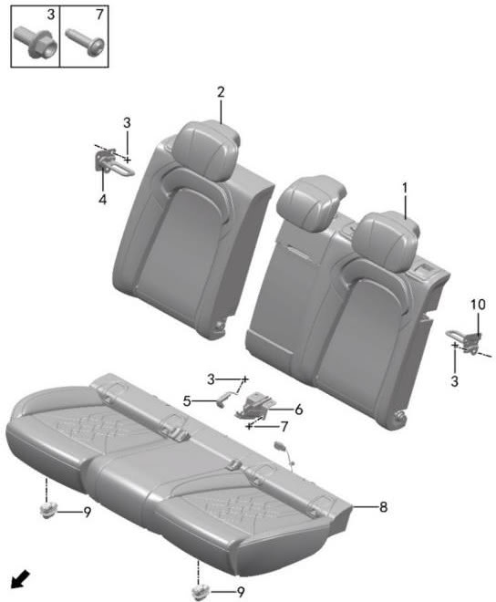

| Поз. | Артикул | Наименование | Кол-во | Системный номер | Примечание |
| ---: | --- | --- | ---: | --- | --- |
| 1 | 700001003BLTA | Левая спинка заднего сиденья | 1 | H97A7000900ABBLTA | черно-синий |
| 1 | 700001004BEAA | Левая спинка заднего сиденья | 1 | H97A7000900BBBEAA | бежевый |
| 1 | 700001004BLAB | Левая спинка заднего сиденья | 1 | H97A7000900BBBLAB | синий |
| 1 | 700001004BRAA | Левая спинка заднего сиденья | 1 | H97A7000900BBBRAA | коричневый |
| 1 | 700001004BLAD | Левая спинка заднего сиденья | 1 | H97A7000900BBBLAD | черно-синий |
| 2 | 700502001BLTA | Правая спинка заднего сиденья | 1 | H97A7005010AABLTA | синий |
| 2 | 700502002BLAD | Правая спинка заднего сиденья | 1 | H97A7005010BABLAD | черный |
| 2 | 700502002BEAA | Правая спинка заднего сиденья | 1 | H97A7005010BABEAA | бежевый |
| 2 | 700502002BLAB | Правая спинка заднего сиденья | 1 | H97A7005010BABLAB | синий |
| 2 | 700502002BRAA | Правая спинка заднего сиденья | 1 | H97A7005010BABRAA | коричневый |
| 3 | Q11001015 | Фланцевый болт | 7 | HQ1840816 |  |
| 4 | 701002001 | Правый фиксатор спинки заднего сиденья | 1 | H97A7010002AA |  |
| 5 | 701004001 | Крышка центрального кронштейна | 1 | H97A7010004AA |  |
| 6 | 701003001 | Центральный кронштейн спинки заднего сиденья | 1 | H97A7010003AA |  |
| 7 | Q11002033 | Болт | 4 | HQY215B1035T10L2D |  |
| 8 | 700301001BLTA | Подушка заднего сиденья | 1 | H97A7003005AABLTA | синий |
| 8 | 700301002BLAD | Подушка заднего сиденья | 1 | H97A7003005BABLAD | черный |
| 8 | 700301002BEAA | Подушка заднего сиденья | 1 | H97A7003005BABEAA | бежевый |
| 8 | 700301002BLAB | Подушка заднего сиденья | 1 | H97A7003005BABLAB | синий |
| 8 | 700301002BRAA | Подушка заднего сиденья | 1 | H97A7003005BABRAA | коричневый |
| 9 | Q41005001 | Клипса подушки сиденья | 2 | HQY398B02 |  |
| 10 | 701001001 | Левый фиксатор спинки заднего сиденья | 1 | H97A7010001AA |  |

## 6056-10 Подушка и спинка сидений второго ряда

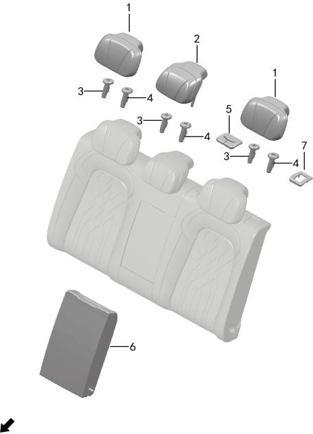

| Поз. | Артикул | Наименование | Кол-во | Системный номер | Примечание |
| ---: | --- | --- | ---: | --- | --- |
| 1 | 700803001BKLA | Боковой подголовник заднего ряда | 1 | H97A7008003AABKLA | черный |
| 1 | 700803001BEAA | Боковой подголовник заднего ряда | 1 | H97A7008003AABEAA | сине-бежевый |
| 1 | 700803001BRLA | Боковой подголовник заднего ряда | 1 | H97A7008003AABRLA | светло-коричневый |
| 1 | 700803001BELA | Боковой подголовник заднего ряда | 1 | H97A7008003AABELA | бежевый |
| 2 | 700804001BKLA | Центральный подголовник заднего ряда | 1 | H97A7008004AABKLA | черный |
| 2 | 700804001BEAA | Центральный подголовник заднего ряда | 1 | H97A7008004AABEAA | сине-бежевый |
| 2 | 700804001BRLA | Центральный подголовник заднего ряда | 1 | H97A7008004AABRLA | светло-коричневый |
| 2 | 700804001BELA | Центральный подголовник заднего ряда | 1 | H97A7008004AABELA | бежевый |
| 3 | 700801001BKGC | Гладкая направляющая втулка подголовника | 1 | H97A7008001AABKGC | черный |
| 3 | 700801001BRGD | Гладкая направляющая втулка подголовника | 1 | H97A7008001AABRGD | светло-коричневый |
| 3 | 700801001BEGB | Гладкая направляющая втулка подголовника | 1 | H97A7008001AABEGB | бежевый |
| 4 | 700802001BKGC | Фиксируемая направляющая втулка подголовника | 1 | H97A7008002AABKGC | черный |
| 4 | 700802001BRGD | Фиксируемая направляющая втулка подголовника | 1 | H97A7008002AABRGD | светло-коричневый |
| 4 | 700802001BEGB | Фиксируемая направляющая втулка подголовника | 1 | H97A7008002AABEGB | бежевый |
| 5 | 701005001BKGC | Крышка ремня безопасности | 1 | H97A7010006AABKGC | черный |
| 5 | 701005001BRGD | Крышка ремня безопасности | 1 | H97A7010006AABRGD | светло-коричневый |
| 5 | 701005001BEGB | Крышка ремня безопасности | 1 | H97A7010006AABEGB | бежевый |
| 6 | 700601001BKAB | Подлокотник в сборе | 1 | H97A7006002AABKAB | черный |
| 6 | 700601001BEAC | Подлокотник в сборе | 1 | H97A7006002AABEAC | бежевый |
| 6 | 700601001BLAC | Подлокотник в сборе | 1 | H97A7006002AABLAC | светло-коричневый |
| 7 | 701101001BKGC | Крышка разблокировки спинки | 1 | H97A7011001AABKGC | черный |
| 7 | 701101001BRGD | Крышка разблокировки спинки | 1 | H97A7011001AABRGD | светло-коричневый |
| 7 | 701101001BEGB | Крышка разблокировки спинки | 1 | H97A7011001AABEGB | бежевый |
