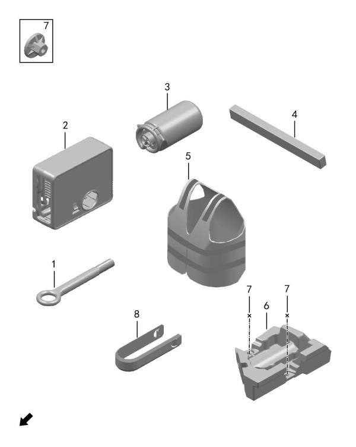

- [8010-10 Бортовой инструмент](#8010-10-бортовой-инструмент)
- [8012-10 Эксплуатационные жидкости](#8012-10-эксплуатационные-жидкости)
- [8013-10 Расходные материалы](#8013-10-расходные-материалы)

## 8010-10 Бортовой инструмент

| Поз. | Артикул | Наименование | Кол-во | Системный номер | Примечание |
| ---: | --- | --- | ---: | --- | --- |
| 1 | 390101001 | Буксировочный крюк | 1 | H97A3901001AA |  |
| 2 | 310501001 | Компрессор | 1 | 3105003-RA01 |  |
| 3 | 390001001 | Жидкость для ремонта шин | 1 | 3900009-RA01 |  |
| 4 | 392601002 | Аварийный треугольник | 1 | H97A3924001AA |  |
| 5 | 390002001 | Светоотражающий жилет | 1 | 3900014-RA01 |  |
| 6 | 390003001 | Ящик бортового инструмента | 1 | 8218054-RA01 |  |
| 7 | Q21004001 | Пластиковая гайка | 2 | HQY38001 |  |
| 8 | 391801002 | Съемник декоративных крышек | 1 | H97A3918002AA | 255/50 R19; 255/45 R20, стартовая версия |

## 8012-10 Эксплуатационные жидкости

- Схема в исходном документе отсутствует.

| Поз. | Артикул | Наименование | Кол-во | Системный номер | Примечание |
| ---: | --- | --- | ---: | --- | --- |
| 1 | H41201000 | Моторное масло для ДВС рендж-экстендера |  | H41201000 | Castrol, 4 л, SN 5W-30 |
| 1 | H41201001 | Моторное масло для ДВС рендж-экстендера |  | H41201001 | Castrol, 4 л, SN 0W-20 |
| 1 | H41201002 | Моторное масло для ДВС рендж-экстендера |  | H41201002 | Castrol, 4 л, SN 0W-30, зимнее |
| 1 | H41201003 | Моторное масло для ДВС рендж-экстендера |  | H41201003 | Mobil, 4 л, SN 5W-30 |
| 1 | H41201004 | Моторное масло для ДВС рендж-экстендера |  | H41201004 | Mobil, 4 л, SN 0W-30, зимнее |
| 2 | H43001000 | Жидкость омывателя |  | H43001000 | этиленгликолевая, -25 C, 2 л |
| 3 | H42001000 | Хладагент |  | H42001000 | R134a, 250 г |
| 4 | H41202001 | Масло электродвигателя |  | H41202001 | Kunlun ETF-EMC, для электромеханической трансмиссии |
| 5 | H42801000 | Тормозная жидкость |  | H42801000 | Kunlun Star 7104-1 |
| 6 | H41901000 | Охлаждающая жидкость |  | H41901000 | полностью органический антифриз Dongfeng Castrol Lingjun H1 |
| 6 | H41901001 | Охлаждающая жидкость |  | H41901001 | полностью органический антифриз Dongfeng Castrol Lingjun H1 |

## 8013-10 Расходные материалы

- Схема в исходном документе отсутствует.

| Поз. | Артикул | Наименование | Кол-во | Системный номер | Примечание |
| ---: | --- | --- | ---: | --- | --- |
| 1 | H45001000 | Клей для стекол |  | H45001000 | 600 мл, тюбик |
| 2 | H45002000 | Активатор стекольного клея |  | H45002000 | 500 мл, бутылка |
| 3 | H45003000 | Очиститель стекольного клея |  | H45003000 | 1 л, бутылка |
| 4 | H45101000 | Копировальная бумага |  | H45101000 | 100 шт. |
| 5 | H45201000 | Антикоррозийное покрытие днища |  | H45201000 | 500 мл, бутылка; Henkel |
| 6 | H45301000 | Праймер |  | H45301000 | 3M 4298U, для приклейки кронштейна радара, 1 л, банка |
| 7 | H45401001 | Смазка |  | H45401001 | универсальная смазка для высокотемпературных и нагруженных деталей |
| 8 | H45501001 | Защитное средство для клемм аккумулятора |  | H45501001 | защита клемм АКБ от коррозии |
| 9 | H45601001 | Резьбовая паста |  | H45601001 | антизадирная смазка для высокотемпературных деталей, например кислородные датчики |
| 10 | H45701001 | Герметик двигателя |  | H45701001 | черный силиконовый герметик для двигателя |
| 10 | H45701002 | Герметик двигателя |  | H45701002 | силиконовый герметик для боковых поверхностей двигателя |
| 11 | H45402001 | Проникающая смазка |  | H45402001 | для демонтажа крепежа |
| 12 | H45602001 | Фиксатор резьбы |  | H45602001 | средняя прочность, фиксация резьбы и защита от коррозии |
| 13 | H45801001 | Промышленный цианоакрилатный клей |  | H45801001 | для быстрого склеивания разных материалов, например резина |
| 14 | H41301001 | Очиститель дроссельной заслонки |  | H41301001 | для обработки поверхностей деталей после разборки механических узлов |
| 15 | H45901001 | Очиститель деталей |  | H45901001 | очистка поверхностей деталей без следов, летучий состав |
