- [1010-10 Высоковольтная батарея](#1010-10-высоковольтная-батарея)
- [1010-11 Высоковольтная батарея](#1010-11-высоковольтная-батарея)
- [1011-10 Передний приводной электродвигатель](#1011-10-передний-приводной-электродвигатель)
- [1012-10 Задний приводной электродвигатель](#1012-10-задний-приводной-электродвигатель)
- [1013-10 Контроллер автомобиля](#1013-10-контроллер-автомобиля)
- [1013-11 Контроллер автомобиля](#1013-11-контроллер-автомобиля)
- [1014-10 Высоковольтная распределительная коробка](#1014-10-высоковольтная-распределительная-коробка)
- [1014-11 Высоковольтная распределительная коробка](#1014-11-высоковольтная-распределительная-коробка)
- [1016-10 Зарядный разъем](#1016-10-зарядный-разъем)
- [1017-10 Бортовое зарядное устройство](#1017-10-бортовое-зарядное-устройство)
- [1020-10 Высоковольтный жгут батарейного блока](#1020-10-высоковольтный-жгут-батарейного-блока)
- [1020-11 Высоковольтный жгут батарейного блока](#1020-11-высоковольтный-жгут-батарейного-блока)
- [1021-10 Высоковольтный жгут переднего электродвигателя](#1021-10-высоковольтный-жгут-переднего-электродвигателя)
- [1022-10 Высоковольтный жгут заднего электродвигателя](#1022-10-высоковольтный-жгут-заднего-электродвигателя)
- [1023-10 Высоковольтный жгут PTC и компрессора](#1023-10-высоковольтный-жгут-ptc-и-компрессора)
- [1023-11 Высоковольтный жгут PTC и компрессора](#1023-11-высоковольтный-жгут-ptc-и-компрессора)
- [1030-10 Рендж-экстендер](#1030-10-рендж-экстендер)
- [1032-10 Крышка ГБЦ](#1032-10-крышка-гбц)
- [1033-10 Головка блока цилиндров](#1033-10-головка-блока-цилиндров)
- [1034-10 Декоративная крышка двигателя](#1034-10-декоративная-крышка-двигателя)
- [1035-10 Клапанный механизм](#1035-10-клапанный-механизм)
- [1036-10 Блок цилиндров](#1036-10-блок-цилиндров)
- [1037-10 Коленвал и маховик](#1037-10-коленвал-и-маховик)
- [1038-10 Поршень и шатун](#1038-10-поршень-и-шатун)
- [1039-10 Распредвал](#1039-10-распредвал)
- [1040-10 Масляный насос](#1040-10-масляный-насос)
- [1041-10 Масляный поддон и фильтр](#1041-10-масляный-поддон-и-фильтр)
- [1042-10 Трубка вентиляции картера](#1042-10-трубка-вентиляции-картера)
- [1043-10 Контроллер двигателя](#1043-10-контроллер-двигателя)

## 1010-10 Высоковольтная батарея

- Описание: версия с рендж-экстендером (ДВС)

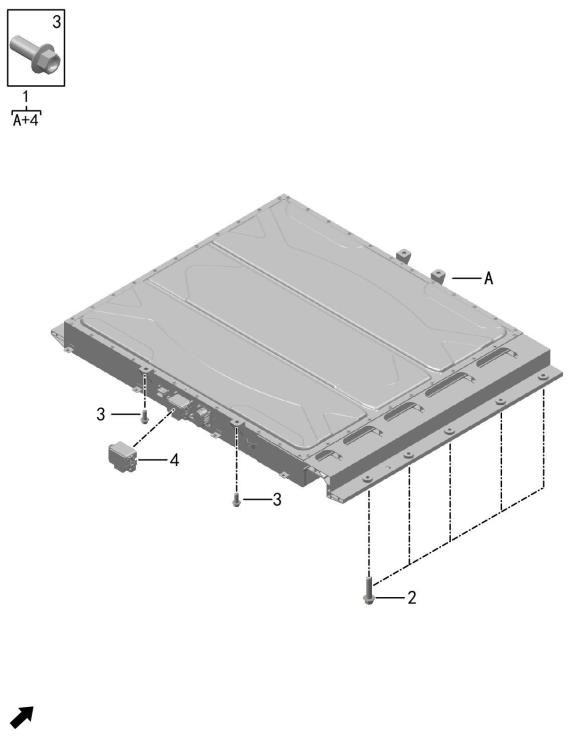

| Поз. | Артикул | Наименование | Кол-во | Системный номер | Примечание |
| ---: | --- | --- | ---: | --- | --- |
| 1 | 920105003 | Тяговая батарея | 1 | H97A9201005DC |  |
| 2 | Q11001057 | Фланцевый болт | 10 | HQY1851253T10L1 |  |
| 3 | Q11002039 | Болт | 4 | HQY1851233T10L1 |  |
| 4 | 926001002 | Сервисный выключатель | 1 | H97A9260003BA |  |

## 1010-11 Высоковольтная батарея

- Описание: электрическая версия

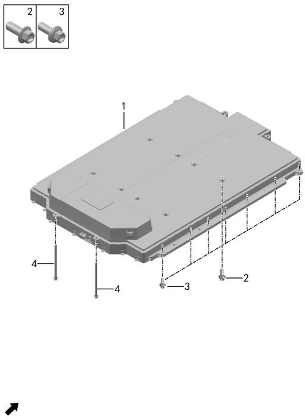

| Поз. | Артикул | Наименование | Кол-во | Системный номер | Примечание |
| ---: | --- | --- | ---: | --- | --- |
| 1 | 920105001 | Тяговая батарея | 1 | H97A9201005FA |  |
| 2 | Q11001014 | Фланцевый болт | 8 | HQ18408147T10L1D |  |
| 3 | Q11002039 | Болт | 14 | HQY1851233T10L1 |  |
| 4 | Q11001054 | Фланцевый болт | 4 | HQ1851230T10L1 |  |

## 1011-10 Передний приводной электродвигатель

- Описание: полный привод

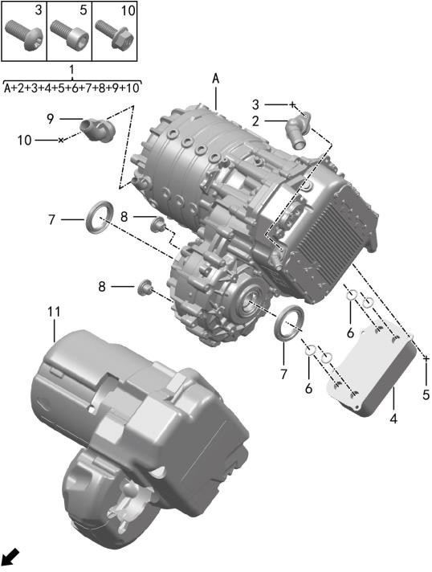

| Поз. | Артикул | Наименование | Кол-во | Системный номер | Примечание |
| ---: | --- | --- | ---: | --- | --- |
| 1 | 910021001 | Передний приводной электродвигатель | 1 | H97A3621809AA |  |
| 2 | 362101001 | Входной патрубок охлаждающей жидкости | 1 | H97A3621007AA |  |
| 3 | Q12001022 | Винт с внутренним шестигранником | 2 | 09120-0512T1 |  |
| 4 | 362104001 | Масляный радиатор | 1 | H97A3621004AA |  |
| 5 | Q12001023 | Винт с внутренним шестигранником | 4 | Q218B0612TS |  |
| 6 | 362102001 | Уплотнительное кольцо | 4 | H97A3621002AA |  |
| 7 | 362103001 | Сальник полуоси | 2 | H97A3621003AA |  |
| 8 | 362105001 | Пробка заливки и слива масла | 2 | H97A3621005AA |  |
| 9 | 362106001 | Штуцер охлаждающей жидкости | 1 | H97A3621006AA |  |
| 10 | Q11002036 | Болт | 1 | Q1860616TS |  |
| 11 | 553509001 | Кожух переднего электродвигателя | 1 | H97A5535003AA | замена на 553509002 |
| 11 | 553509002 | Кожух переднего электродвигателя | 1 | H97A5535003AB | электрическая версия |

## 1012-10 Задний приводной электродвигатель

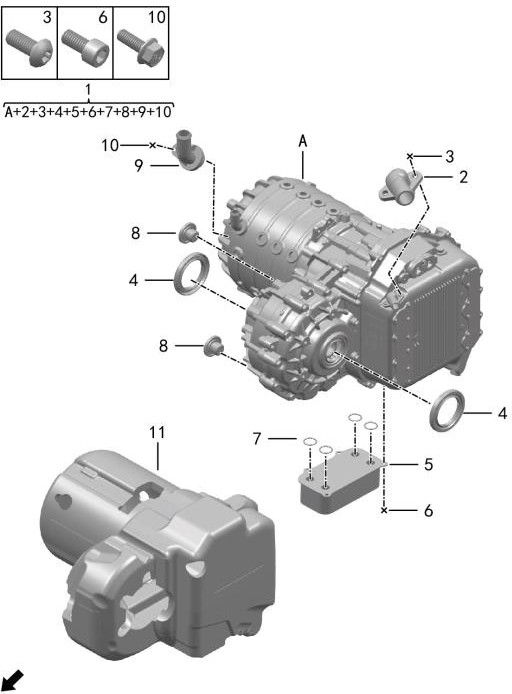

| Поз. | Артикул | Наименование | Кол-во | Системный номер | Примечание |
| ---: | --- | --- | ---: | --- | --- |
| 1 | 910022001 | Задний приводной электродвигатель | 1 | H97A3621812AA |  |
| 2 | 362101001 | Входной патрубок охлаждающей жидкости | 1 | H97A3621007AA |  |
| 3 | Q12001022 | Винт с внутренним шестигранником | 2 | 09120-0512T1 |  |
| 4 | 362103001 | Сальник полуоси | 2 | H97A3621003AA |  |
| 5 | 362104001 | Масляный радиатор | 1 | H97A3621004AA |  |
| 6 | Q12001023 | Винт с внутренним шестигранником | 4 | Q218B0612TS |  |
| 7 | 362102001 | Уплотнительное кольцо | 4 | H97A3621002AA |  |
| 8 | 362105001 | Пробка заливки и слива масла | 2 | H97A3621005AA |  |
| 9 | 362106001 | Штуцер охлаждающей жидкости | 1 | H97A3621006AA |  |
| 10 | Q11002036 | Болт | 1 | Q1860616TS |  |
| 11 | 553510001 | Кожух заднего электродвигателя | 1 | H97A5535004AA | замена на 553510002 |
| 11 | 553510002 | Кожух заднего электродвигателя | 1 | H97A5535004AB |  |

## 1013-10 Контроллер автомобиля

- Описание: версия с рендж-экстендером (ДВС), включая памятную версию

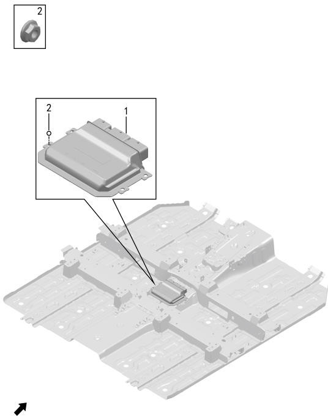

| Поз. | Артикул | Наименование | Кол-во | Системный номер | Примечание |
| ---: | --- | --- | ---: | --- | --- |
| 1 | 361080002 | Контроллер автомобиля | 1 | H97A3610800BA |  |
| 2 | Q21001001 | Фланцевая гайка | 4 | HQ32005 |  |

## 1013-11 Контроллер автомобиля

- Описание: электрическая версия, включая памятную версию

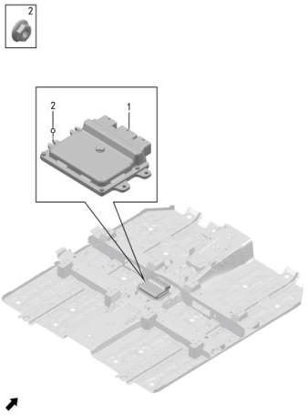

| Поз. | Артикул | Наименование | Кол-во | Системный номер | Примечание |
| ---: | --- | --- | ---: | --- | --- |
| 1 | 361080001 | Контроллер автомобиля | 1 | H97A3610800AB | замена на 361080003 |
| 1 | 361080003 | Контроллер автомобиля | 1 | H97A3610800AC |  |
| 2 | Q21001001 | Фланцевая гайка | 4 | HQ32005 |  |

## 1014-10 Высоковольтная распределительная коробка

- Описание: версия с рендж-экстендером (ДВС)

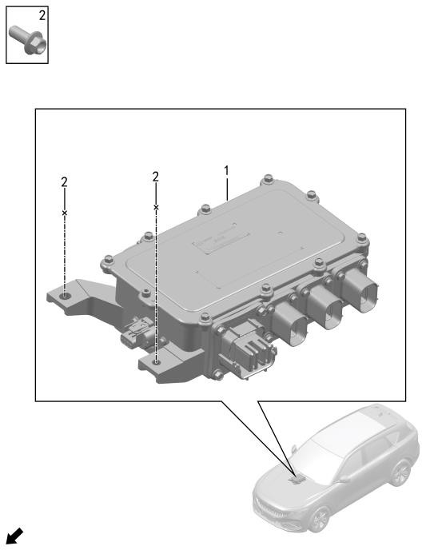

| Поз. | Артикул | Наименование | Кол-во | Системный номер | Примечание |
| ---: | --- | --- | ---: | --- | --- |
| 1 | 932201001 | Высоковольтный блок переднего отсека | 1 | H97A9322001AA | задний привод |
| 1 | 932201002 | Высоковольтный блок переднего отсека | 1 | H97A9322001BA | полный привод |
| 2 | Q11001019 | Фланцевый болт | 4 | HQ1840820L1 |  |

## 1014-11 Высоковольтная распределительная коробка

- Описание: электрическая версия

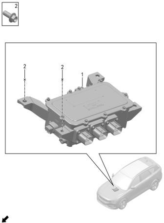

| Поз. | Артикул | Наименование | Кол-во | Системный номер | Примечание |
| ---: | --- | --- | ---: | --- | --- |
| 1 | 932201003 | Высоковольтный блок переднего отсека | 1 | H97A9322001CA | задний привод |
| 1 | 932201004 | Высоковольтный блок переднего отсека | 1 | H97A9322001DA | полный привод |
| 2 | Q11001019 | Фланцевый болт | 4 | HQ1840820L1 |  |

## 1016-10 Зарядный разъем

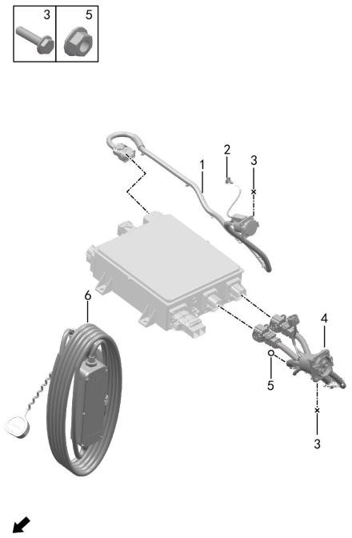

| Поз. | Артикул | Наименование | Кол-во | Системный номер | Примечание |
| ---: | --- | --- | ---: | --- | --- |
| 1 | 934000001 | Разъем медленной зарядки | 1 | H97A9340002AA |  |
| 2 | 840405001 | Ручка аварийного открытия | 1 | H97A8404006AA |  |
| 3 | Q11008001 | Болт крепления разъема быстрой и медленной зарядки | 8 | HQY1870625 |  |
| 4 | 934001001 | Разъем быстрой зарядки | 1 | H97A9340003AA |  |
| 5 | Q21012001 | Гайка заземления | 1 | HQY32006 |  |
| 6 | 934003001 | Зарядный пистолет | 1 | H97A9340001AA |  |

## 1017-10 Бортовое зарядное устройство

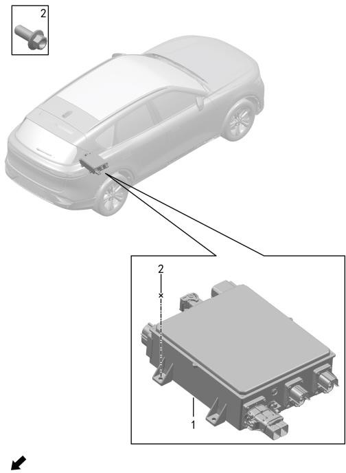

| Поз. | Артикул | Наименование | Кол-во | Системный номер | Примечание |
| ---: | --- | --- | ---: | --- | --- |
| 1 | 934002001 | Бортовое зарядное устройство | 1 | H97A3619815AA | замена на 934002002 |
| 1 | 934002002 | Бортовое зарядное устройство | 1 | H97A3619815AB |  |
| 2 | Q11001019 | Фланцевый болт | 4 | HQ1840820L1 |  |

## 1020-10 Высоковольтный жгут батарейного блока

- Описание: версия с рендж-экстендером (ДВС)

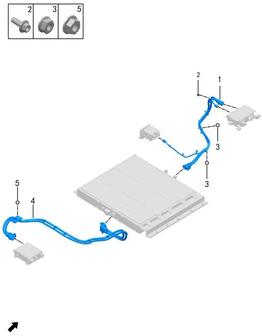

| Поз. | Артикул | Наименование | Кол-во | Системный номер | Примечание |
| ---: | --- | --- | ---: | --- | --- |
| 1 | 932500001 | Передний высоковольтный жгут тяговой батареи | 1 | H97A9325039AA | замена на 932500003 |
| 1 | 932500003 | Передний высоковольтный жгут тяговой батареи | 1 | H97A9325039AB |  |
| 2 | Q11001005 | Фланцевый болт | 1 | HQ1840616L1 |  |
| 3 | Q21001002 | Фланцевая гайка | 7 | HQ32006 |  |
| 4 | 932501001 | Задний высоковольтный жгут тяговой батареи | 1 | H97A9325010AA |  |
| 5 | Q21001010 | Фланцевая гайка | 4 | HQ32406 |  |

## 1020-11 Высоковольтный жгут батарейного блока

- Описание: электрическая версия

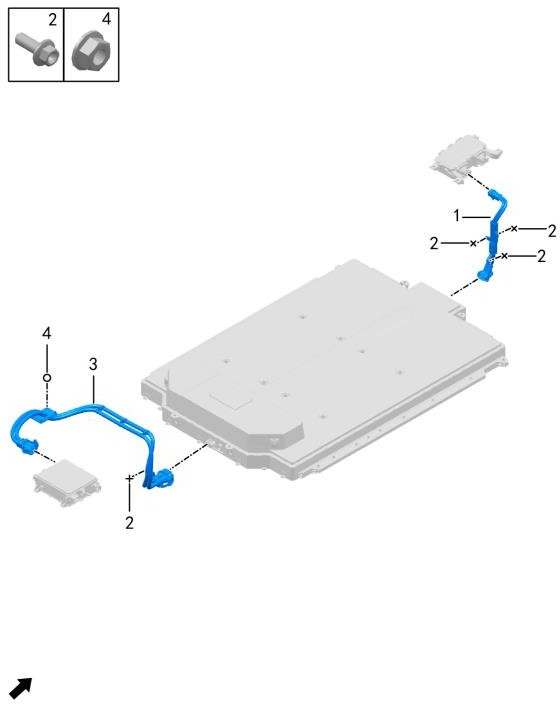

| Поз. | Артикул | Наименование | Кол-во | Системный номер | Примечание |
| ---: | --- | --- | ---: | --- | --- |
| 1 | 932500002 | Передний высоковольтный жгут тяговой батареи | 1 | H97A9325003BA |  |
| 2 | Q11001005 | Фланцевый болт | 4 | HQ1840616L1 |  |
| 3 | 932501002 | Задний высоковольтный жгут тяговой батареи | 1 | H97A9325010BA |  |
| 4 | Q21001010 | Фланцевая гайка | 4 | HQ32406 |  |

## 1021-10 Высоковольтный жгут переднего электродвигателя

- Описание: полный привод

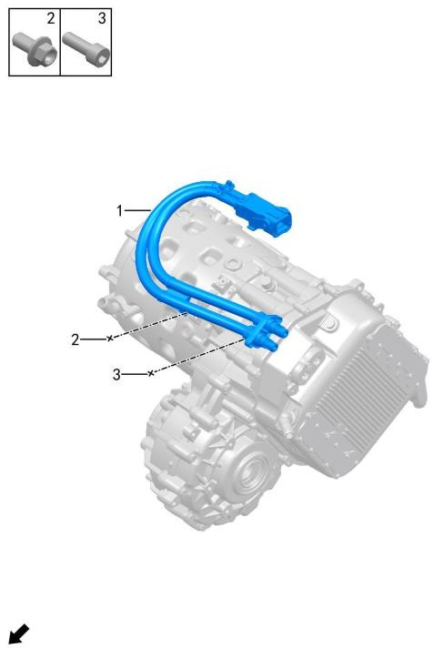

| Поз. | Артикул | Наименование | Кол-во | Системный номер | Примечание |
| ---: | --- | --- | ---: | --- | --- |
| 1 | 932502000 | Высоковольтный жгут переднего электродвигателя | 1 | H97A9325004AA | версия с рендж-экстендером (ДВС), полный привод |
| 1 | 932502001 | Высоковольтный жгут переднего электродвигателя | 1 | H97A9325004BA | электрическая версия, полный привод |
| 2 | Q11001016 | Фланцевый болт | 1 | HQ1840816L1 |  |
| 3 | Q12001010 | Винт с внутренним шестигранником | 2 | Q218B0618F38 |  |

## 1022-10 Высоковольтный жгут заднего электродвигателя

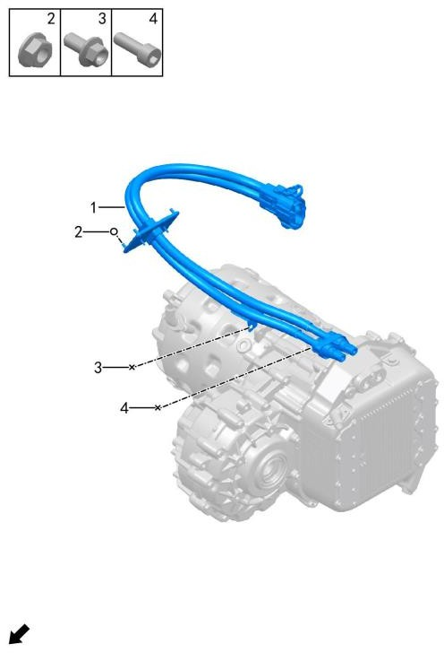

| Поз. | Артикул | Наименование | Кол-во | Системный номер | Примечание |
| ---: | --- | --- | ---: | --- | --- |
| 1 | 932503000 | Высоковольтный жгут заднего электродвигателя | 1 | H97A9325008BA |  |
| 2 | Q21001010 | Фланцевая гайка | 4 | HQ32406 |  |
| 3 | Q11001016 | Фланцевый болт | 1 | HQ1840816L1 |  |
| 4 | Q12001010 | Винт с внутренним шестигранником | 2 | Q218B0618F38 |  |

## 1023-10 Высоковольтный жгут PTC и компрессора

- Описание: версия с рендж-экстендером (ДВС)

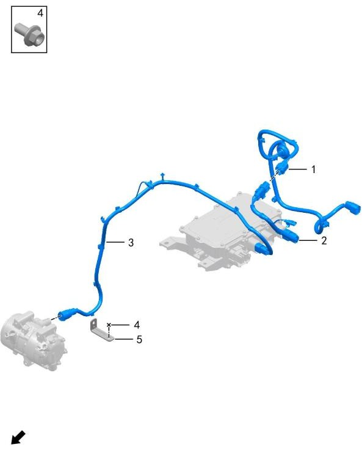

| Поз. | Артикул | Наименование | Кол-во | Системный номер | Примечание |
| ---: | --- | --- | ---: | --- | --- |
| 1 | 932504001 | Высоковольтный жгут PTC кондиционера | 1 | H97A9325011AA |  |
| 2 | 932504002 | Высоковольтный жгут PTC кондиционера | 1 | H97A9325017AA |  |
| 3 | 932506002 | Высоковольтный жгут компрессора | 1 | H97A9325006AC |  |
| 4 | Q11001002 | Фланцевый болт | 1 | HQ1840612L1 |  |
| 5 | 932508001 | Кронштейн высоковольтного жгута | 1 | H97A9325025AA |  |

## 1023-11 Высоковольтный жгут PTC и компрессора

- Описание: электрическая версия

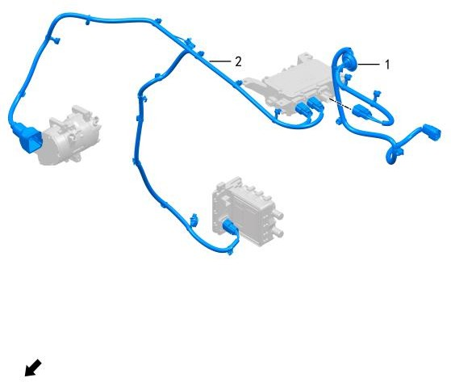

| Поз. | Артикул | Наименование | Кол-во | Системный номер | Примечание |
| ---: | --- | --- | ---: | --- | --- |
| 1 | 932504003 | Высоковольтный жгут PTC кондиционера | 1 | H97A9325011BA |  |
| 2 | 932505001 | Высоковольтный жгут PTC и компрессора | 1 | H97A9325012AB |  |

## 1030-10 Рендж-экстендер

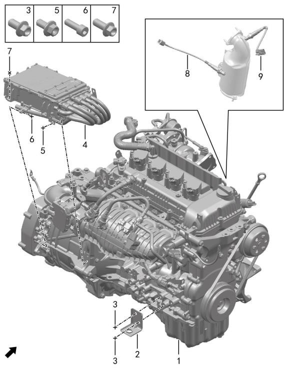

| Поз. | Артикул | Наименование | Кол-во | Системный номер | Примечание |
| ---: | --- | --- | ---: | --- | --- |
| 1 | 100001001 | Рендж-экстендер | 1 | SFG15TR-002 |  |
| 2 | 100020001 | Технологический кронштейн сборки двигателя | 1 | H97A1000007AA |  |
| 3 | Q11001016 | Фланцевый болт | 2 | HQ1840816L1 |  |
| 4 | 361301001 | Контроллер генератора | 1 | H97A3613001AA | замена на 361301002 |
| 4 | 361301002 | Контроллер генератора | 1 | H97A3613001AB |  |
| 5 | Q11001002 | Фланцевый болт | 4 | HQ1840612L1 |  |
| 6 | Q12001010 | Винт с внутренним шестигранником | 8 | Q218B0618F38 |  |
| 7 | Q11001019 | Фланцевый болт | 4 | HQ1840820L1 |  |
| 8 | 111808002 | Кислородный датчик | 1 | 2111040-RA52 |  |
| 9 | 111808001 | Кислородный датчик | 1 | 2111030-RA52 |  |

## 1032-10 Крышка ГБЦ

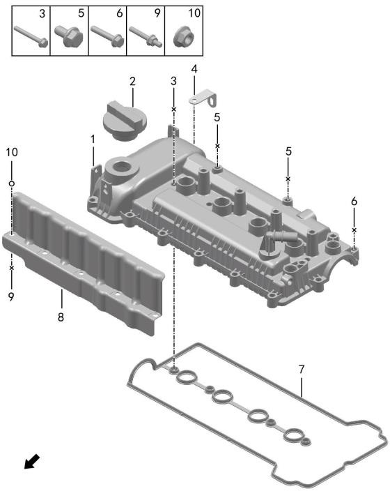

| Поз. | Артикул | Наименование | Кол-во | Системный номер | Примечание |
| ---: | --- | --- | ---: | --- | --- |
| 1 | 100304001 | Крышка ГБЦ | 1 | 1003200-F07-00 |  |
| 2 | 100305001 | Лючок топливной горловины | 1 | 1003280-D15-00 |  |
| 3 | Q11001034 | Фланцевый болт | 4 | Q1840650F36 | M6×50 |
| 4 | 101509001 | Кронштейн ГБЦ | 1 | 101502Q-F00-16 |  |
| 5 | Q11001081 | Фланцевый болт | 2 | Q1860612F36 | M6×12 |
| 6 | Q11001033 | Фланцевый болт | 9 | Q1840632F36 | M6×32 |
| 7 | 100301001 | Прокладка крышки ГБЦ | 1 | 1003002-F00-16A |  |
| 8 | 100302002 | Теплоэкран крышки ГБЦ | 1 | 1003015-F08-12 |  |
| 9 | 101504001 | Шпилька | 5 | 1015241-F08-01 |  |
| 10 | Q21001008 | Фланцевая гайка | 5 | Q32006T2F36 | M6 |

## 1033-10 Головка блока цилиндров

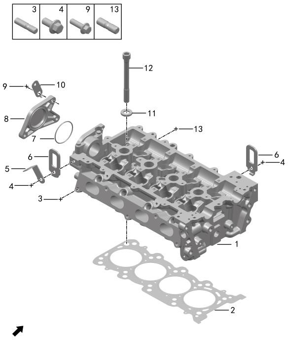

| Поз. | Артикул | Наименование | Кол-во | Системный номер | Примечание |
| ---: | --- | --- | ---: | --- | --- |
| 1 | 100303002 | Головка блока цилиндров | 1 | 1003100-F08-00A |  |
| 2 | 101507001 | Прокладка ГБЦ | 1 | 1015080-F00-00 |  |
| 3 | 100018001 | Шпилька | 2 | 1000106-C03-00 |  |
| 4 | Q11001035 | Фланцевый болт | 2 | Q1840816F36 | M8×16 |
| 5 | 101509001 | Кронштейн ГБЦ | 1 | 101502Q-F00-16 |  |
| 6 | 100017001 | Проушина двигателя | 2 | 1000401-E01-00A |  |
| 7 | 100306001 | Уплотнительное кольцо крышки вакуумного насоса | 1 | 3541001-F08-00A |  |
| 8 | 100307001 | Крышка вакуумного насоса | 1 | 3541002-F08-00 |  |
| 9 | Q11001038 | Фланцевый болт | 3 | Q1840825F36 | M8×25 |
| 10 | 100008001 | Кронштейн жгута картера | 1 | 1000864-D02-00 |  |
| 11 | 100014001 | Шайба болта ГБЦ | 10 | 1000113-C03-00 |  |
| 12 | 101513001 | Болт ГБЦ | 10 | 1015038-F00-00 |  |
| 13 | 100805001 | Шпилька выпускного коллектора | 9 | 1008214-F00-00 |  |

## 1034-10 Декоративная крышка двигателя

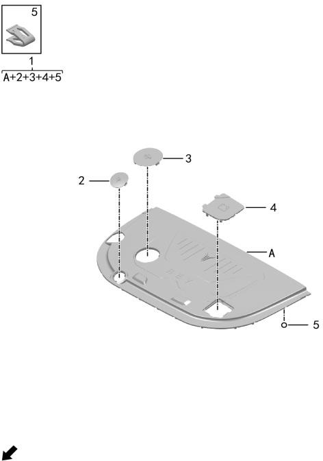

| Поз. | Артикул | Наименование | Кол-во | Системный номер | Примечание |
| ---: | --- | --- | ---: | --- | --- |
| 1 | 840504002 | Декоративная крышка двигателя | 1 | H97A8405020AD |  |
| 2 | 840508001 | Декоративная крышка щупа | 1 | H97A8405023AA |  |
| 3 | 840507001 | Декоративная крышка маслозаливной горловины | 1 | H97A8405022AA |  |
| 4 | 840509002 | Батарея сервисный люк крышка | 1 | H97A8405036BA |  |
| 5 | Q41002001 | Пластиковая клипса | 13 | 09408-08003 |  |

## 1035-10 Клапанный механизм

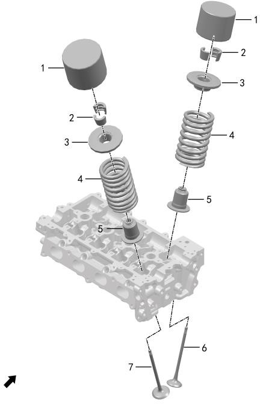

| Поз. | Артикул | Наименование | Кол-во | Системный номер | Примечание |
| ---: | --- | --- | ---: | --- | --- |
| 1 | 100707002 | Толкатель клапана | 16 | 1007006-H00-00 |  |
| 2 | 100703001 | Сухарь клапана | 32 | 1007006-E07-00 |  |
| 3 | 100705001 | Тарелка клапанной пружины | 16 | 1007029-E07-00 |  |
| 4 | 100704001 | Клапанная пружина | 16 | 1007026-E01-00 |  |
| 5 | 100706001 | Маслосъемный колпачок | 16 | 1007100-F00-00 |  |
| 6 | 100701001 | Выпускной клапан | 8 | 1007005-F00-00 |  |
| 7 | 100702001 | Впускной клапан | 8 | 1007032-E07-00 |  |

## 1036-10 Блок цилиндров

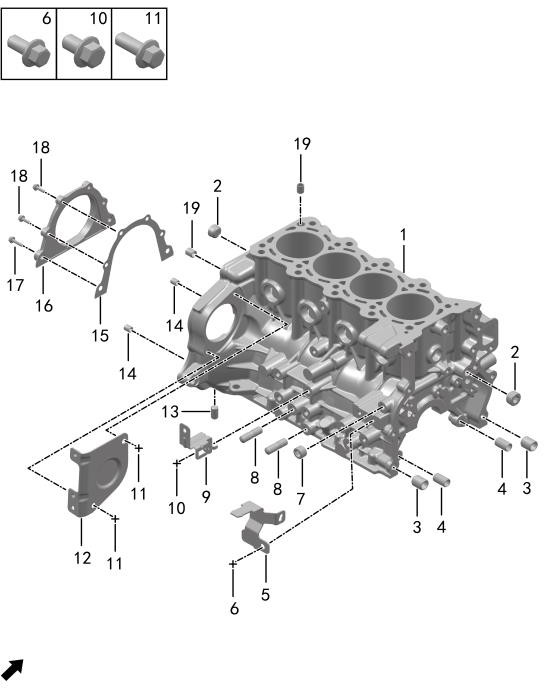

| Поз. | Артикул | Наименование | Кол-во | Системный номер | Примечание |
| ---: | --- | --- | ---: | --- | --- |
| 1 | 100200001 | Блок цилиндров | 1 | 1002100-F08-01B |  |
| 2 | 100202000 | Коническая пробка | 2 | 1002033-B00-00 |  |
| 3 | 100201000 | Установочная втулка | 2 | 1002005-C03-00A |  |
| 4 | 100002001 | Установочный штифт масляного насоса | 2 | 1000925-E01-00 |  |
| 5 | 101502002 | Кронштейн | 1 | 101502H-F08-12 |  |
| 6 | Q11001035 | Фланцевый болт | 1 | Q1840816F36 |  |
| 7 | 100202001 | Коническая пробка | 1 | 1002003-V00-00 |  |
| 8 | 111804001 | Шпилька турбонагнетателя | 2 | 1118006-F00-00 |  |
| 9 | 100204001 | Кронштейн жгута трансмиссии | 1 | 1000031-D15-00 |  |
| 10 | Q11001092 | Фланцевый болт | 1 | Q1851016F36 |  |
| 11 | Q11001036 | Фланцевый болт | 2 | Q1840820F36 | M8×20 |
| 12 | 370801002 | Стартер крышка | 1 | 3708002-F08-12A |  |
| 13 | 100003001 | Установочный штифт передней крышки | 2 | 1000122-A00-00 |  |
| 14 | 100006001 | Установочная втулка задней крышки | 2 | 1000014-A00-00 |  |
| 15 | 100016001 | Прокладка задней крышки коленвала | 1 | 1000516-E01-00 |  |
| 16 | 100203000 | Задняя крышка коленвала | 1 | 1002200-E01-00 |  |
| 17 | Q11001085 | Фланцевый болт | 2 | Q1860625F36 | M6×25 |
| 18 | Q11001084 | Фланцевый болт | 4 | Q1860620F36 | M6×20 |
| 19 | 100005001 | Установочный штифт ГБЦ | 4 | 1000028-A00-00 |  |

## 1037-10 Коленвал и маховик

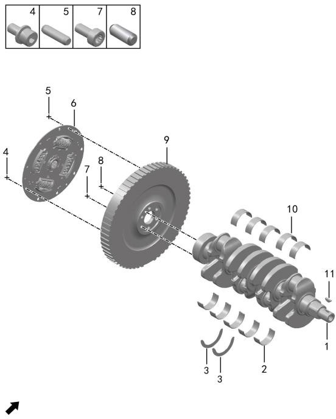

| Поз. | Артикул | Наименование | Кол-во | Системный номер | Примечание |
| ---: | --- | --- | ---: | --- | --- |
| 1 | 100501002 | Коленчатый вал | 1 | 1005001-F00-00A |  |
| 2 | 100503001 | Нижний коренной вкладыш | 5 | 1005007-F00-08 |  |
| 3 | 100015001 | Упорное полукольцо коленвала | 2 | 1000047-A00-00 |  |
| 4 | 101505001 | Болт | 9 | 1015246-K00-00 |  |
| 5 | 100004001 | Нажимной диск установочный штифт | 3 | 1000211-B00-00 |  |
| 6 | 100505001 | Ограничитель крутящего момента | 1 | 1005200-K03-00 |  |
| 7 | 101516001 | Болт маховика | 6 | 101501A-H03-00 |  |
| 8 | 100003001 | Установочный штифт передней крышки | 1 | 1000122-A00-00 |  |
| 9 | 100504001 | Маховик | 1 | 1005100-F08-01 |  |
| 10 | 100502001 | Верхний коренной вкладыш | 5 | 1005005-F00-08 |  |
| 11 | Q51001001 | Шпонка | 1 | Q5500519 |  |

## 1038-10 Поршень и шатун

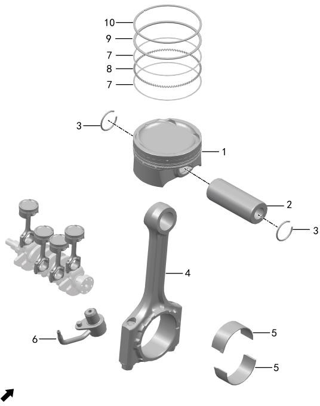

| Поз. | Артикул | Наименование | Кол-во | Системный номер | Примечание |
| ---: | --- | --- | ---: | --- | --- |
| 1 | 100405002 | Поршень | 4 | 1004001-F11-00A |  |
| 2 | 100402001 | Поршневой палец | 4 | 1004004-F00-00 |  |
| 3 | 100401001 | Стопорное кольцо поршневого пальца | 8 | 1004003-F00-00 |  |
| 4 | 100404002 | Шатун | 4 | 1004100-F11-00A |  |
| 5 | 100403001 | Шатунный вкладыш | 8 | 1004005-F00-08 |  |
| 6 | 130009001 | Форсунка охлаждения поршня | 4 | 1300100-F00-00A |  |
| 7 | 100406001 | Маслосъемное кольцо | 8 | 1004151-F11-00 |  |
| 8 | 100409001 | Втулка | 4 | 1004152-F11-00 |  |
| 9 | 100407001 | Второе компрессионное кольцо | 4 | 1004142-F11-00A |  |
| 10 | 100408001 | Первое компрессионное кольцо | 4 | 1004141-F11-00 |  |

## 1039-10 Распредвал

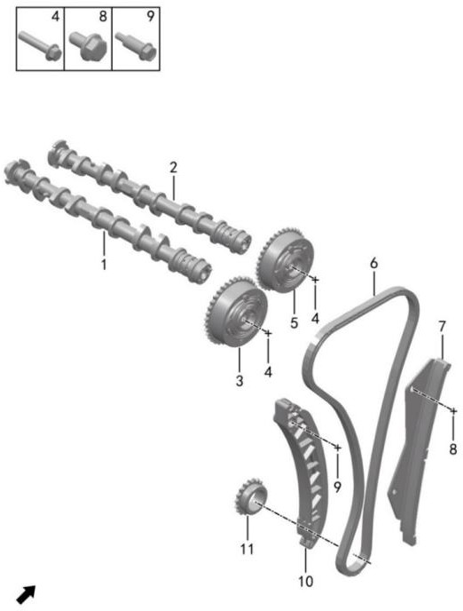

| Поз. | Артикул | Наименование | Кол-во | Системный номер | Примечание |
| ---: | --- | --- | ---: | --- | --- |
| 1 | 100601001 | Впускной распредвал | 1 | 1006100-F00-16 |  |
| 2 | 100602001 | Выпускной распредвал | 1 | 1006200-F00-16 |  |
| 3 | 100608001 | Впускной VCP | 1 | 1021700-E08-09 |  |
| 4 | 101514001 | Болт | 2 | 1015243-E03-05 | M10×1.25×48 |
| 5 | 100607001 | Выпускной VCP | 1 | 1021600-E08-09 |  |
| 6 | 100604001 | Цепь ГРМ | 1 | 1021060-F00-16 |  |
| 7 | 100606001 | Направляющая цепи ГРМ | 1 | 1021200-E01-00 |  |
| 8 | Q11001081 | Фланцевый болт | 3 | Q1860612F36 | M6×12 |
| 9 | 100613001 | Натяжная планка болт | 1 | 1021102-C03-00 |  |
| 10 | 100605001 | Натяжная планка цепи ГРМ | 1 | 1021161-F00-16 |  |
| 11 | 100603001 | Звездочка коленвала ГРМ | 1 | 1021002-F00-16 |  |

## 1040-10 Масляный насос

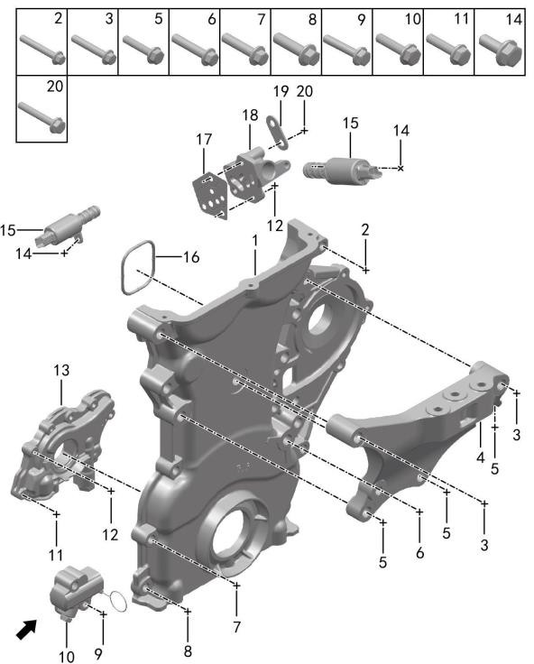

| Поз. | Артикул | Наименование | Кол-во | Системный номер | Примечание |
| ---: | --- | --- | ---: | --- | --- |
| 1 | 100610002 | Сальник крышки цепи ГРМ | 1 | 1021500-F08-12 |  |
| 2 | Q11001093 | Фланцевый болт | 1 | Q1851055F36 |  |
| 3 | Q11001096 | Фланцевый болт | 2 | Q1851090TF61 | M10×1.25×90 |
| 4 | 100116001 | Правый кронштейн опоры | 1 | 1001B41-F08-12 |  |
| 5 | Q11001068 | Фланцевый болт | 3 | Q1851065TF61 | M10×1.25×65 |
| 6 | Q11001063 | Фланцевый болт | 5 | Q1851045F36 | M10×1.25×45 |
| 7 | Q11001041 | Фланцевый болт | 4 | Q1840835F36 | M8×35 |
| 8 | Q11001040 | Фланцевый болт | 2 | Q1840830F36 | M8×30 |
| 9 | Q11001033 | Фланцевый болт | 2 | Q1840632F36 | M6×32 |
| 10 | 100609001 | Натяжитель цепи ГРМ | 1 | 1021300-C03-00 |  |
| 11 | Q11001086 | Фланцевый болт | 2 | Q1860630F36 | M6×30 |
| 12 | Q11001085 | Фланцевый болт | 5 | Q1860625F36 | M6×25 |
| 13 | 101101001 | Масляный насос | 1 | 1011100-F00-00 |  |
| 14 | Q11001083 | Фланцевый болт | 2 | Q1860616F36 | M6×16 |
| 15 | 100611001 | Клапан управления OCV | 2 | 1021800-D03-00 |  |
| 16 | 101508001 | Уплотнительное кольцо корпуса водяного насоса | 1 | 101501N-F00-16A |  |
| 17 | 100013001 | Прокладка корпуса клапана OCV | 1 | 1000529-E01-00 |  |
| 18 | 100612001 | Корпус клапана OCV | 1 | 1021810-E01-00 |  |
| 19 | 100011001 | Кронштейн жгута клапана OCV | 1 | 1000378-B09-00 |  |
| 20 | Q11001087 | Фланцевый болт | 2 | Q1860640F36 | M6×40 |

## 1041-10 Масляный поддон и фильтр

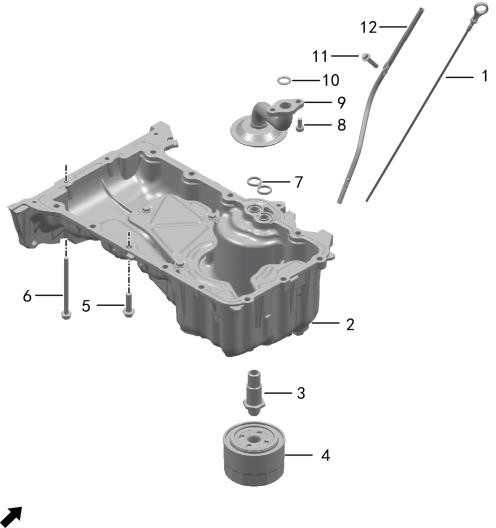

| Поз. | Артикул | Наименование | Кол-во | Системный номер | Примечание |
| ---: | --- | --- | ---: | --- | --- |
| 1 | 100902001 | Масляный щуп | 1 | 1009050-F08-01 |  |
| 2 | 100903001 | Масляный поддон | 1 | 1009100-F08-01 |  |
| 3 | 101201001 | Соединительная трубка | 1 | 1012001-F00-03 |  |
| 4 | 101202001 | Масляный фильтр | 1 | 1012200-F08-12 |  |
| 5 | Q11001040 | Фланцевый болт | 13 | Q1840830F36 | M8×30 |
| 6 | Q11001089 | Фланцевый болт | 2 | Q1860690F36 | M6×90 |
| 7 | 100904001 | Прокладка | 1 | 1009112-F00-00 |  |
| 8 | Q11002011 | Сливная пробка | 2 | Q1420616F36 | M6×16 |
| 9 | 101001001 | Маслоприемник | 1 | 1010100-F08-01 |  |
| 10 | 100012001 | Уплотнительное кольцо маслоприемника | 1 | 1000531-E01-00 |  |
| 11 | Q11001081 | Фланцевый болт | 1 | Q1860612F36 | M6×12 |
| 12 | 100901001 | Направляющая трубка масляного щупа | 1 | 1009040-F00-16 |  |
| 13 | 100907001 | Болт | 1 | 1009101-C03-00 |  |
| 14 | 100908001 | Прокладка | 1 | 1009104-C03-00 |  |

## 1042-10 Трубка вентиляции картера

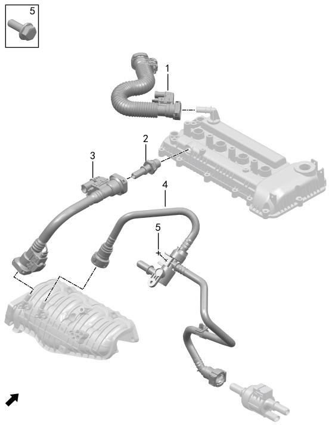

| Поз. | Артикул | Наименование | Кол-во | Системный номер | Примечание |
| ---: | --- | --- | ---: | --- | --- |
| 1 | 101401003 | Вентиляционная трубка | 1 | 1014001-F08-01A |  |
| 2 | 101402001 | Клапан PCV | 1 | 1014040-F07-00 |  |
| 3 | 101401002 | Вентиляционная трубка | 1 | 1014002-F08-01 |  |
| 4 | 110001002 | Вентиляционная трубка с двумя обратными клапанами | 1 | 1100040-F08-12 |  |
| 5 | Q11001031 | Фланцевый болт | 1 | Q1840616F36 | M6×16 |

## 1043-10 Контроллер двигателя

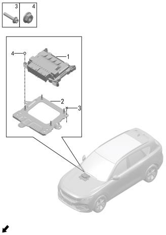

| Поз. | Артикул | Наименование | Кол-во | Системный номер | Примечание |
| ---: | --- | --- | ---: | --- | --- |
| 1 | 360101001 | Контроллер двигателя | 1 | H97A3601800AA |  |
| 2 | 500117001 | Кронштейн ECU | 1 | H97A5001094CA |  |
| 3 | Q11001004 | Фланцевый болт | 3 | HQ1840616 |  |
| 4 | Q21001002 | Фланцевая гайка | 4 | HQ32006 |  |
