- [3010-10 Передний приводной вал](#3010-10-передний-приводной-вал)
- [3011-10 Задний приводной вал](#3011-10-задний-приводной-вал)
- [3012-10 Селектор передач в сборе](#3012-10-селектор-передач-в-сборе)
- [3013-10 Опоры двигателя](#3013-10-опоры-двигателя)
- [3014-10 Опоры переднего электродвигателя](#3014-10-опоры-переднего-электродвигателя)
- [3014-11 Опоры переднего электродвигателя](#3014-11-опоры-переднего-электродвигателя)
- [3015-10 Опоры заднего электродвигателя](#3015-10-опоры-заднего-электродвигателя)
- [3016-10 Колёса и декоративные колпаки](#3016-10-колёса-и-декоративные-колпаки)
- [3016-11 Колёса и декоративные колпаки](#3016-11-колёса-и-декоративные-колпаки)
- [3016-12 Колёса и декоративные колпаки](#3016-12-колёса-и-декоративные-колпаки)
- [3017-10 Передний подрамник](#3017-10-передний-подрамник)
- [3017-11 Передний подрамник](#3017-11-передний-подрамник)
- [3018-10 Задний подрамник](#3018-10-задний-подрамник)
- [3019-10 Передний амортизатор](#3019-10-передний-амортизатор)
- [3021-10 Передняя пневмоподвеска](#3021-10-передняя-пневмоподвеска)
- [3020-10 Задний амортизатор](#3020-10-задний-амортизатор)
- [3020-11 Задний амортизатор](#3020-11-задний-амортизатор)
- [3022-10 Задняя пневмоподвеска](#3022-10-задняя-пневмоподвеска)
- [3023-10 Задняя винтовая пружина](#3023-10-задняя-винтовая-пружина)
- [3024-10 Электрокомпрессор и ресивер](#3024-10-электрокомпрессор-и-ресивер)
- [3025-10 Датчик высоты](#3025-10-датчик-высоты)
- [3026-10 Воздушные магистрали](#3026-10-воздушные-магистрали)
- [3027-10 Блок управления активной подвеской](#3027-10-блок-управления-активной-подвеской)
- [3028-10 Передние рычаги](#3028-10-передние-рычаги)
- [3029-10 Задние рычаги](#3029-10-задние-рычаги)
- [3030-10 Передний стабилизатор](#3030-10-передний-стабилизатор)
- [3031-10 Задний стабилизатор](#3031-10-задний-стабилизатор)
- [3032-10 Рулевое колесо](#3032-10-рулевое-колесо)
- [3033-10 Рулевая колонка](#3033-10-рулевая-колонка)
- [3034-10 Рулевой механизм](#3034-10-рулевой-механизм)
- [3034-11 Рулевой механизм](#3034-11-рулевой-механизм)
- [3043-10 Датчики скорости колеса](#3043-10-датчики-скорости-колеса)
- [3043-11 Датчики скорости колеса](#3043-11-датчики-скорости-колеса)
- [3044-10 Передний тормозной диск](#3044-10-передний-тормозной-диск)
- [3045-10 Задний тормозной диск](#3045-10-задний-тормозной-диск)
- [3046-10 Тормозная педаль](#3046-10-тормозная-педаль)
- [3047-10 Педаль акселератора](#3047-10-педаль-акселератора)
- [3048-10 Тормозные шланги](#3048-10-тормозные-шланги)
- [3049-10 Тормозные трубки](#3049-10-тормозные-трубки)
- [3050-10 Блок управления тормозами](#3050-10-блок-управления-тормозами)
- [3051-10 Модуль управления шасси](#3051-10-модуль-управления-шасси)
- [3053-10 Расширенные системы помощи водителю](#3053-10-расширенные-системы-помощи-водителю)
- [3056-10 Парковочная помощь](#3056-10-парковочная-помощь)
- [3056-11 Парковочная помощь](#3056-11-парковочная-помощь)
- [3057-10 Системы видеообзора](#3057-10-системы-видеообзора)
- [3057-11 Системы видеообзора](#3057-11-системы-видеообзора)

# 3010-10 Передний приводной вал

- Описание: полный привод

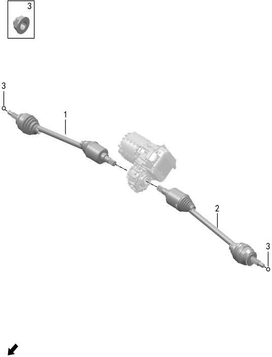

| Поз. | Артикул | Наименование | Кол-во | Системный номер | Примечание |
| ---: | --- | --- | ---: | --- | --- |
| 1 | 220302001 | Правый передний приводной вал | 1 | H97A2309002AA | замена на 220302002 |
| 1 | 220302002 | Правый передний приводной вал | 1 | H97A2309002AB |  |
| 2 | 220301001 | Левый передний приводной вал | 1 | H97A2309001AA | замена на 220301002 |
| 2 | 220301002 | Левый передний приводной вал | 1 | H97A2309001AB |  |
| 3 | Q21002004 | Стопорная гайка | 2 | HQY32322 |  |

# 3011-10 Задний приводной вал

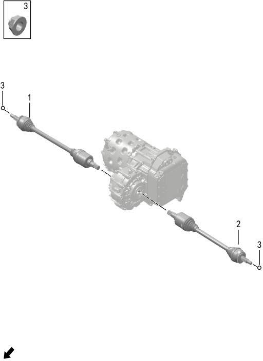

| Поз. | Артикул | Наименование | Кол-во | Системный номер | Примечание |
| ---: | --- | --- | ---: | --- | --- |
| 1 | 220102001 | Правый задний приводной вал | 1 | H97A2409002AA | замена на 220102002 |
| 1 | 220102002 | Правый задний приводной вал | 1 | H97A2409002AB |  |
| 2 | 220101001 | Левый задний приводной вал | 1 | H97A2409001AA | замена на 220101002 |
| 2 | 220101002 | Левый задний приводной вал | 1 | H97A2409001AB |  |
| 3 | Q21002004 | Стопорная гайка | 2 | HQY32322 |  |

# 3012-10 Селектор передач в сборе

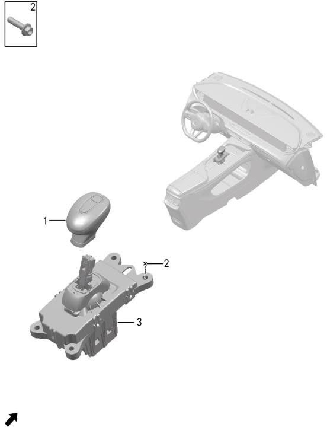

| Поз. | Артикул | Наименование | Кол-во | Системный номер | Примечание |
| ---: | --- | --- | ---: | --- | --- |
| 1 | 170201001 | Ручка селектора | 1 | H97A1702006AA |  |
| 2 | Q11001010 | Фланцевый болт | 4 | HQ1840625 |  |
| 3 | 362701001 | Механизм селектора | 1 | H97A3627800AA | замена на 362701002 |
| 3 | 362701002 | Механизм селектора | 1 | H97A3627800BA |  |

# 3013-10 Опоры двигателя

- Описание: версия с рендж-экстендером (ДВС)

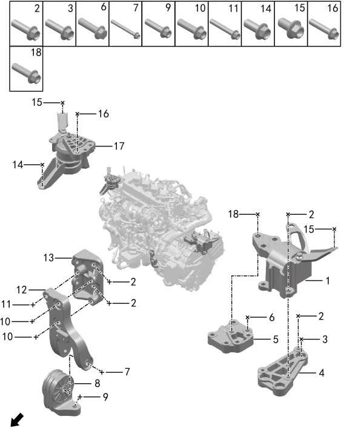

| Поз. | Артикул | Наименование | Кол-во | Системный номер | Примечание |
| ---: | --- | --- | ---: | --- | --- |
| 1 | 100105001 | Левая опора силового агрегата | 1 | H97A1001001AA |  |
| 2 | Q11001046 | Фланцевый болт | 5 | HQ1851035T10L1 |  |
| 3 | Q11001028 | Фланцевый болт | 3 | HQ1841035T10L1 |  |
| 4 | 100112001 | Левый соединительный кронштейн опоры | 1 | 1001355-RA52 |  |
| 5 | 100113001 | Левый кронштейн опоры | 1 | 1001A41-F08-01 |  |
| 6 | Q11001062 | Фланцевый болт | 4 | Q1851040TF61 | M10×1.25×40 |
| 7 | Q11001053 | Фланцевый болт | 1 | HQ18512120T10L1U |  |
| 8 | 100115001 | Передняя подушка опоры силового агрегата | 1 | 1001332-RA52 |  |
| 9 | Q11001058 | Фланцевый болт | 2 | HQ1851250T10L1U |  |
| 10 | Q11001055 | Фланцевый болт | 2 | HQ1851245T10L1 |  |
| 11 | Q11001059 | Фланцевый болт | 1 | HQ1851280T10L1 |  |
| 12 | 100110001 | Передний кронштейн опоры силового агрегата | 1 | 1001331-RA52 |  |
| 13 | 100111001 | Передний кронштейн крепления опоры | 1 | 1001353-RA52 |  |
| 14 | Q11001027 | Фланцевый болт | 3 | HQ1841025T10L1 |  |
| 15 | Q11001016 | Фланцевый болт | 2 | HQ1840816L1 |  |
| 16 | Q11001048 | Фланцевый болт | 3 | HQ1851050T10L1 |  |
| 17 | 100106002 | Правая опора силового агрегата | 1 | 1001320-RA52 |  |
| 18 | Q11001056 | Фланцевый болт | 3 | HQ1851245T10L1U |  |

# 3014-10 Опоры переднего электродвигателя

- Описание: версия с рендж-экстендером (ДВС), полный привод

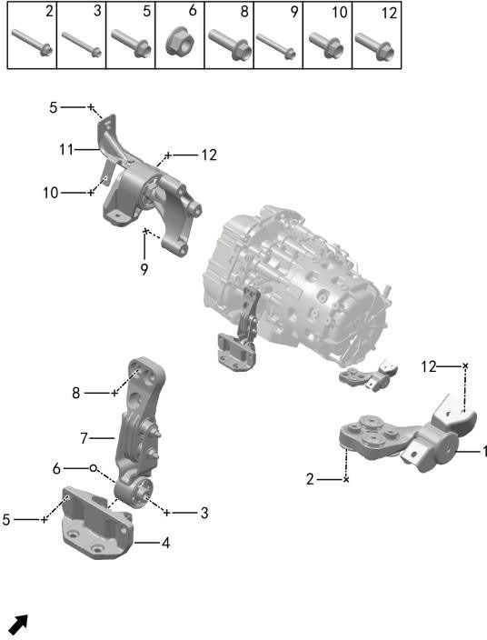

| Поз. | Артикул | Наименование | Кол-во | Системный номер | Примечание |
| ---: | --- | --- | ---: | --- | --- |
| 1 | 100102001 | Правая опора переднего электродвигателя | 1 | 1001130-RA01 |  |
| 2 | Q11001049 | Фланцевый болт | 4 | HQ1851065T10L1 |  |
| 3 | Q11001052 | Фланцевый болт | 1 | HQ18512100T10L1U |  |
| 4 | 100107001 | Задний кронштейн опоры переднего электродвигателя | 1 | 1001180-RA01 |  |
| 5 | Q11001030 | Фланцевый болт | 6 | HQ1841040T10L1 |  |
| 6 | Q21001007 | Фланцевая гайка | 1 | HQ32012T10L1U |  |
| 7 | 100103001 | Задняя опора переднего электродвигателя | 1 | 1001170-RA01 |  |
| 8 | Q11001046 | Фланцевый болт | 3 | HQ1851035T10L1 |  |
| 9 | Q11001050 | Фланцевый болт | 3 | HQ1851070T10L1 |  |
| 10 | Q11001027 | Фланцевый болт | 1 | HQ1841025T10L1 |  |
| 11 | 100101002 | Передняя опора переднего электродвигателя | 1 | 1001150-RA51 |  |
| 12 | Q11001028 | Фланцевый болт | 4 | HQ1841035T10L1 |  |

# 3014-11 Опоры переднего электродвигателя

- Описание: электрическая версия, полный привод

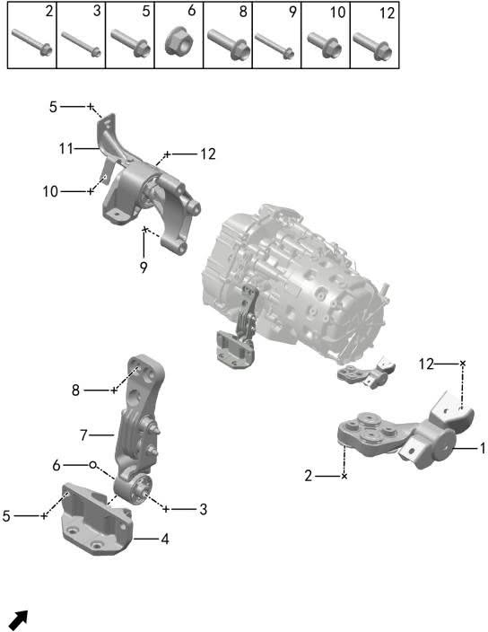

| Поз. | Артикул | Наименование | Кол-во | Системный номер | Примечание |
| ---: | --- | --- | ---: | --- | --- |
| 1 | 100102001 | Правая опора переднего электродвигателя | 1 | 1001130-RA01 |  |
| 2 | Q11001049 | Фланцевый болт | 4 | HQ1851065T10L1 |  |
| 3 | Q11001052 | Фланцевый болт | 1 | HQ18512100T10L1U |  |
| 4 | 100107001 | Задний кронштейн опоры переднего электродвигателя | 1 | 1001180-RA01 |  |
| 5 | Q11001030 | Фланцевый болт | 6 | HQ1841040T10L1 |  |
| 6 | Q21001007 | Фланцевая гайка | 1 | HQ32012T10L1U |  |
| 7 | 100103001 | Задняя опора переднего электродвигателя | 1 | 1001170-RA01 |  |
| 8 | Q11001046 | Фланцевый болт | 3 | HQ1851035T10L1 |  |
| 9 | Q11001051 | Фланцевый болт | 3 | HQ1851080T10L1 |  |
| 10 | Q11001027 | Фланцевый болт | 1 | HQ1841025T10L1 |  |
| 11 | 100101001 | Передняя опора переднего электродвигателя | 1 | 1001150-RA01 |  |
| 12 | Q11001028 | Фланцевый болт | 4 | HQ1841035T10L1 |  |

# 3015-10 Опоры заднего электродвигателя

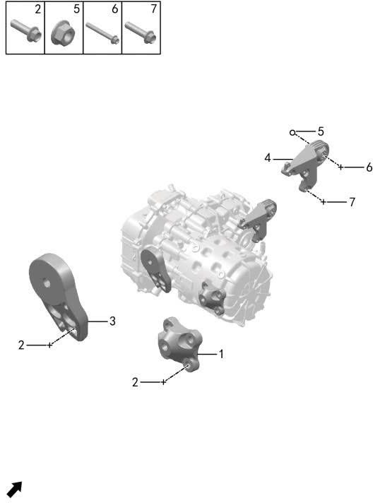

| Поз. | Артикул | Наименование | Кол-во | Системный номер | Примечание |
| ---: | --- | --- | ---: | --- | --- |
| 1 | 100108001 | Кронштейн правой опоры заднего электродвигателя | 1 | 1001231-RA01 |  |
| 2 | Q11001046 | Фланцевый болт | 7 | HQ1851035T10L1 |  |
| 3 | 100109001 | Задний кронштейн опоры заднего электродвигателя | 1 | 1001271-RA01 |  |
| 4 | 100104001 | Передняя опора заднего электродвигателя | 1 | 1001250-RA01 |  |
| 5 | Q21001007 | Фланцевая гайка | 1 | HQ32012T10L1U |  |
| 6 | Q11001052 | Фланцевый болт | 1 | HQ18512100T10L1U |  |
| 7 | Q11001047 | Фланцевый болт | 3 | HQ1851045T10L1 |  |

# 3016-10 Колёса и декоративные колпаки

- Описание: 255/50 R19

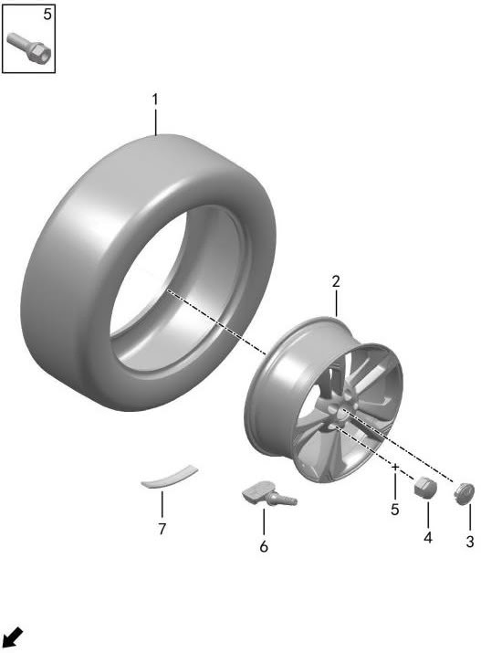

| Поз. | Артикул | Наименование | Кол-во | Системный номер | Примечание |
| ---: | --- | --- | ---: | --- | --- |
| 1 | 310601002 | Шина | 4 | H97A3106001AA | 255/50 R19, полностью окрашенный алюминиевый диск, обычное колесо |
| 2 | 310101001 | Колесо | 4 | H97A3101001AA | легкосплавный диск 255/50 R19, обычное колесо |
| 3 | 310201001BKPA | Декоративный колпак колеса | 4 | H97A3102001AABKPA |  |
| 4 | Q61001001 | Декоративная крышка колесного болта | 20 | HQY72621 |  |
| 5 | Q11006001 | Колёсный болт | 20 | HQY1851432T10L1 |  |
| 6 | 792001001 | Датчик давления в шине | 4 | H56A7920001AA |  |
| 7 | 310102001 | Балансировочный грузик колеса | 4 | HPFA5017001AA |  |

# 3016-11 Колёса и декоративные колпаки

- Описание: 255/45 R20

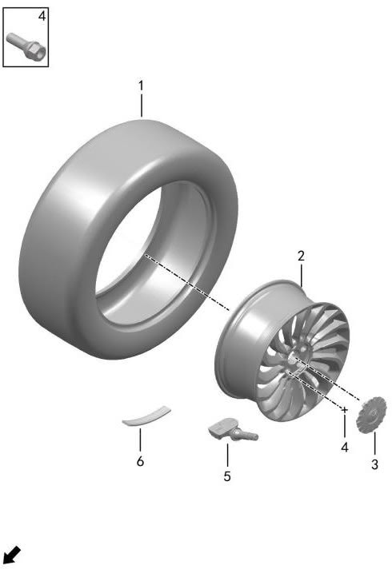

| Поз. | Артикул | Наименование | Кол-во | Системный номер | Примечание |
| ---: | --- | --- | ---: | --- | --- |
| 1 | 310601001 | Шина | 4 | 3106100-RA01 | 255/45 R20, полностью окрашенный алюминиевый диск, Pirelli |
| 2 | 310101002 | Колесо | 4 | H97A3101001BA | легкосплавный диск 255/45 R20, Pirelli |
| 3 | 310201002 | Декоративный колпак колеса | 4 | H97A3102001BA |  |
| 4 | Q11006001 | Колёсный болт | 20 | HQY1851432T10L1 |  |
| 5 | 792001001 | Датчик давления в шине | 4 | H56A7920001AA |  |
| 6 | 310102001 | Балансировочный грузик колеса | 4 | HPFA5017001AA |  |

# 3016-12 Колёса и декоративные колпаки

- Описание: 255/45 R20, специальная версия

| Поз. | Артикул | Наименование | Кол-во | Системный номер | Примечание |
| ---: | --- | --- | ---: | --- | --- |
| 1 | 310601001 | Шина | 4 | 3106100-RA01 | шина 255/45 R20, полностью окрашенный алюминиевый диск |
| 2 | 310101003BLPA | Колесо | 4 | H97A3101001CABLPA | легкосплавный диск 255/45 R20, Pirelli |
| 2 | 310101003BLPB | Колесо | 4 | H97A3101001CABLPB | легкосплавный диск 255/45 R20, Pirelli |
| 3 | 310201001BLPA | Декоративный колпак колеса | 4 | H97A3102001AABLPA |  |
| 3 | 310201001BLPB | Декоративный колпак колеса | 4 | H97A3102001AABLPB |  |
| 4 | Q61001001 | Декоративная крышка колесного болта | 20 | HQY72621 |  |
| 5 | Q11006001 | Колёсный болт | 20 | HQY1851432T10L1 |  |
| 6 | 792001001 | Датчик давления в шине | 4 | H56A7920001AA |  |
| 7 | 310102001 | Балансировочный грузик колеса | 4 | HPFA5017001AA |  |

# 3017-10 Передний подрамник

- Описание: версия с рендж-экстендером (ДВС)

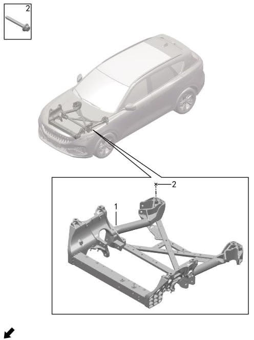

| Поз. | Артикул | Наименование | Кол-во | Системный номер | Примечание |
| ---: | --- | --- | ---: | --- | --- |
| 1 | 281001001 | Передний подрамник | 1 | 2810300-RA51 |  |
| 2 | Q11002029 | Болт | 8 | HQ18612100T10L1QD |  |

# 3017-11 Передний подрамник

- Описание: электрическая версия

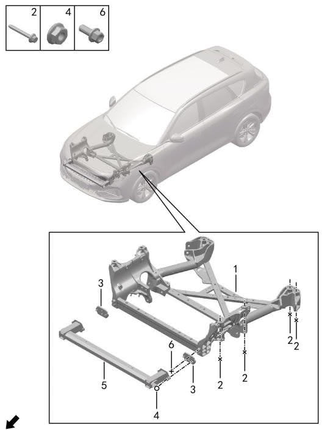

| Поз. | Артикул | Наименование | Кол-во | Системный номер | Примечание |
| ---: | --- | --- | ---: | --- | --- |
| 1 | 281001002 | Передний подрамник | 1 | H97A2810001AA |  |
| 1 | 281001003 | Передний подрамник | 1 | H97A2810001BA |  |
| 2 | Q11002029 | Болт | 8 | HQ18612100T10L1QD |  |
| 3 | 500103001 | Монтажная пластина | 2 | H97A5001006AA |  |
| 4 | Q21001002 | Фланцевая гайка | 4 | HQ32006 |  |
| 5 | 500101001 | Соединительная балка переднего подрамника | 1 | H97A5001050AA |  |
| 6 | Q11001003 | Фланцевый болт | 4 | HQ1840614 |  |

# 3018-10 Задний подрамник

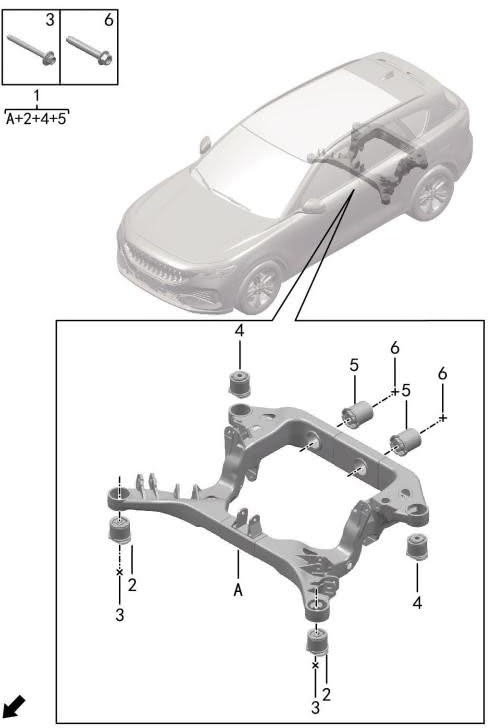

| Поз. | Артикул | Наименование | Кол-во | Системный номер | Примечание |
| ---: | --- | --- | ---: | --- | --- |
| 1 | 281002001 | Задний подрамник | 1 | H97A2820900AA | замена на 281002002 |
| 1 | 281002002 | Задний подрамник | 1 | H97A2820900BA |  |
| 2 | 281003001 | Втулка крепления заднего подрамника | 2 | 891002911200 |  |
| 3 | Q11002024 | Болт | 4 | HQY18014145T10L1D | замена на Q11002043 |
| 3 | Q11002043 | Болт | 4 | HQY18014145T10L1A |  |
| 4 | 281004001 | Втулка крепления заднего подрамника | 2 | 891002911300 |  |
| 5 | 100114001 | Втулка правой опоры заднего электродвигателя | 2 | 1001232-RA01 |  |
| 6 | Q11001061 | Фланцевый болт | 2 | HQ18516100T10L1D |  |

# 3019-10 Передний амортизатор

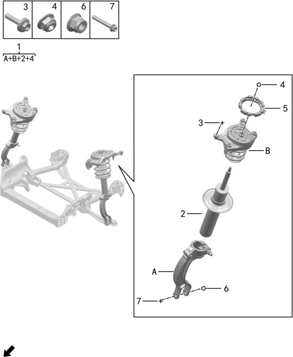

| Поз. | Артикул | Наименование | Кол-во | Системный номер | Примечание |
| ---: | --- | --- | ---: | --- | --- |
| 1 | 290501001 | Узел левой передней стойки амортизатора | 1 | H97A2905001AA | версия с рендж-экстендером (ДВС), задний привод |
| 1 | 290502001 | Узел правой передней стойки амортизатора | 1 | H97A2905002AA | версия с рендж-экстендером (ДВС), задний привод |
| 1 | 290501005 | Узел левой передней стойки амортизатора | 1 | H97A2905001GA | версия с рендж-экстендером (ДВС), полный привод |
| 1 | 290502005 | Узел правой передней стойки амортизатора | 1 | H97A2905002GA | версия с рендж-экстендером (ДВС), полный привод |
| 1 | 290501003 | Узел левой передней стойки амортизатора | 1 | H97A2905001DA | электрическая версия, задний привод |
| 1 | 290502003 | Узел правой передней стойки амортизатора | 1 | H97A2905002DA | электрическая версия, задний привод |
| 1 | 290501006 | Узел левой передней стойки амортизатора | 1 | H97A2905001HA | электрическая версия, полный привод |
| 1 | 290502006 | Узел правой передней стойки амортизатора | 1 | H97A2905002HA | электрическая версия, полный привод |
| 2 | 290519000 | Передний амортизатор | 1 | H97A2905012AA | версия с рендж-экстендером (ДВС), задний привод |
| 2 | 290519001 | Передний амортизатор | 1 | H97A2905012DA | электрическая версия, задний привод |
| 2 | 290519002 | Передний амортизатор | 1 | H97A2905012GA | версия с рендж-экстендером (ДВС), полный привод |
| 2 | 290519003 | Передний амортизатор | 1 | H97A2905012HA | электрическая версия, полный привод |
| 3 | Q11002031 | Болт | 8 | HQY1861050T10L1D |  |
| 4 | Q21011016 | Стопорная гайка | 8 | HQY970017 |  |
| 5 | 290409001 | Резиновая подушка переднего амортизатора | 2 | 2904105-RA01 |  |
| 6 | Q21002013 | Стопорная гайка | 2 | HQY33912T10L1U |  |
| 7 | Q11001060 | Фланцевый болт | 2 | HQ1851285T10L1DU |  |

# 3020-10 Задний амортизатор

- Описание: версия с рендж-экстендером (ДВС)

| Поз. | Артикул | Наименование | Кол-во | Системный номер | Примечание |
| ---: | --- | --- | ---: | --- | --- |
| 1 | 291501001 | Узел задней стойки амортизатора | 2 | H97A2915001AA | задний привод |
| 1 | 291501003 | Узел задней стойки амортизатора | 2 | H97A2915001CA | полный привод, с пневмоподвеской |
| 1 | 291501005 | Узел задней стойки амортизатора | 2 | H97A2915001EA | полный привод, без пневмоподвески |
| 2 | Q21011016 | Стопорная гайка | 1 | HQY970017 |  |
| 3 | Q11001080 | Фланцевый болт | 2 | HQY1861490T10L1QD |  |
| 4 | Q22001001 | Шайба | 2 | HQY401B14 |  |
| 5 | 291507000 | Задний амортизатор | 2 | H97A2915002AA | задний привод |
| 5 | 291507002 | Задний амортизатор | 2 | H97A2915002CA | полуактивная пневмоподвеска, полный привод |
| 5 | 291507004 | Задний амортизатор | 2 | H97A2915002EA | без пневмоподвески, полный привод |
| 6 | Q11002022 | Болт | 4 | HQY1801035T10L1 |  |

# 3020-11 Задний амортизатор

- Описание: электрическая версия

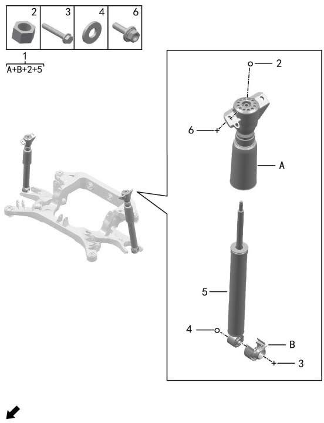

| Поз. | Артикул | Наименование | Кол-во | Системный номер | Примечание |
| ---: | --- | --- | ---: | --- | --- |
| 1 | 291501002 | Узел задней стойки амортизатора | 2 | H97A2915001BA | задний привод |
| 1 | 291501004 | Узел задней стойки амортизатора | 2 | H97A2915001DA | полный привод, с пневмоподвеской |
| 1 | 291501006 | Узел задней стойки амортизатора | 2 | H97A2915001FA | полный привод, без пневмоподвески |
| 2 | Q21011016 | Стопорная гайка | 1 | HQY970017 |  |
| 3 | Q11001080 | Фланцевый болт | 2 | HQY1861490T10L1QD |  |
| 4 | Q22001001 | Шайба | 2 | HQY401B14 |  |
| 5 | 291507001 | Задний амортизатор | 2 | H97A2915002BA | задний привод |
| 5 | 291507003 | Задний амортизатор | 2 | H97A2915002DA | полуактивная пневмоподвеска, полный привод |
| 5 | 291507005 | Задний амортизатор | 2 | H97A2915002FA | без пневмоподвески, полный привод |
| 6 | Q11002022 | Болт | 4 | HQY1801035T10L1 |  |

# 3021-10 Передняя пневмоподвеска

- Описание: полуактивная пневмоподвеска, полный привод

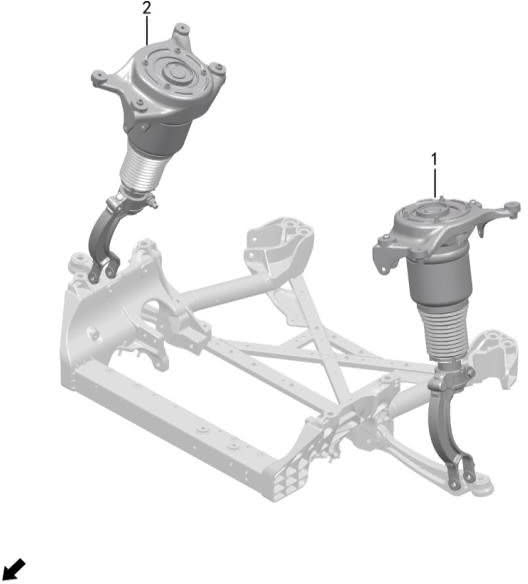

| Поз. | Артикул | Наименование | Кол-во | Системный номер | Примечание |
| ---: | --- | --- | ---: | --- | --- |
| 1 | 290503001 | Левая передняя пневмопружина | 1 | H97A2902005AA | замена на 290503003 |
| 1 | 290503003 | Узел левой передней стойки пневмоподвески | 1 | H97A2902005AB | версия с рендж-экстендером (ДВС) |
| 1 | 290503002 | Левая передняя пневмопружина | 1 | H97A2902005BA | замена на 290503004 |
| 1 | 290503004 | Узел левой передней стойки пневмоподвески | 1 | H97A2902005BB | электрическая версия |
| 2 | 290504001 | Правая передняя пневмопружина | 1 | H97A2902010AA | замена на 290504003 |
| 2 | 290504003 | Узел правой передней стойки пневмоподвески | 1 | H97A2902010AB | версия с рендж-экстендером (ДВС) |
| 2 | 290504002 | Правая передняя пневмопружина | 1 | H97A2902010BA | замена на 290504004 |
| 2 | 290504004 | Узел правой передней стойки пневмоподвески | 1 | H97A2902010BB | электрическая версия |

# 3022-10 Задняя пневмоподвеска

- Описание: полуактивная пневмоподвеска, полный привод

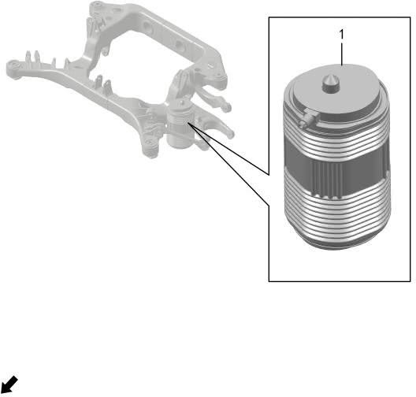

| Поз. | Артикул | Наименование | Кол-во | Системный номер | Примечание |
| ---: | --- | --- | ---: | --- | --- |
| 1 | 291201001 | Левая задняя пневмопружина | 1 | H97A2912015AB |  |
| 1 | 291202001 | Правая задняя пневмопружина | 1 | H97A2912020AB |  |

# 3023-10 Задняя винтовая пружина

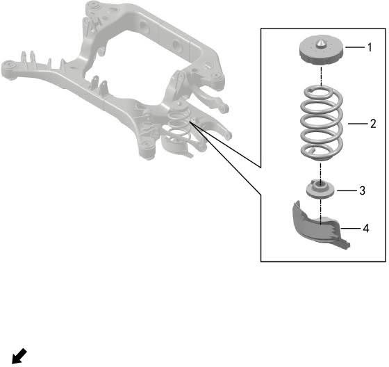

| Поз. | Артикул | Наименование | Кол-во | Системный номер | Примечание |
| ---: | --- | --- | ---: | --- | --- |
| 1 | 291210001 | Верхняя подушка задней пружины | 2 | 2912102-RA01 |  |
| 2 | 291200001 | Задняя винтовая пружина | 2 | H97A2912001AA | версия с рендж-экстендером (ДВС) |
| 2 | 291200002 | Задняя винтовая пружина | 2 | H97A2912001BA | электрическая версия |
| 3 | 291211001 | Нижняя подушка задней пружины | 2 | 2912103-RA01 |  |
| 4 | 291203001 | Левый задний пыльник пружины | 1 | 2912330-RA01 |  |
| 4 | 291204001 | Правый задний пыльник пружины | 1 | 2912340-RA01 |  |

# 3024-10 Электрокомпрессор и ресивер

- Описание: полуактивная пневмоподвеска

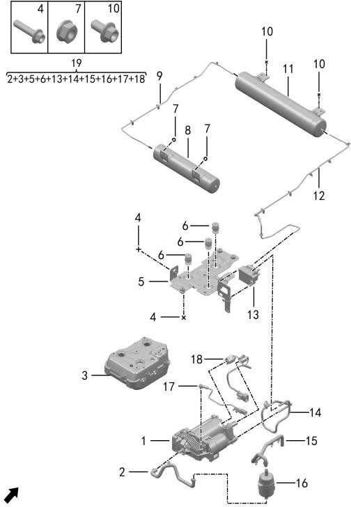

| Поз. | Артикул | Наименование | Кол-во | Системный номер | Примечание |
| ---: | --- | --- | ---: | --- | --- |
| 1 | 111306001 | Горизонтальный компрессор | 1 | H97A1113011AA |  |
| 2 | 111309001 | Задний впускной шланг | 1 | H97A1113013AA |  |
| 3 | 111307001 | Шумоизоляционный кожух электроклапанного насоса | 1 | H97A1113002AA |  |
| 4 | Q11001023 | Фланцевый болт | 4 | HQ1840835L1 |  |
| 5 | 111311002 | Кронштейн блока подачи воздуха | 1 | H97A1113017AA |  |
| 6 | 111305001 | Комплект первичной опоры | 3 | H97A1113010AA |  |
| 7 | Q21001004 | Фланцевая гайка | 4 | HQ32008 |  |
| 8 | 114101002 | Ресивер | 1 | H97A1141002AA |  |
| 9 | 294112001 | Соединительная магистраль дополнительного ресивера | 1 | H97A2941016AB |  |
| 10 | Q11001015 | Фланцевый болт | 4 | HQ1840816 |  |
| 11 | 114101001 | Ресивер | 1 | H97A1141001AA |  |
| 12 | 294111001 | Магистраль компрессора к основному ресиверу | 1 | H97A2941014AC |  |
| 13 | 111314001 | Распределительный клапан пневмоподвески | 1 | H97A1113006AA |  |
| 14 | 111313001 | Магистраль компрессора к распределительному клапану | 1 | H97A1113016AA |  |
| 15 | 111304001 | Передний впускной шланг | 1 | H97A1113009AA |  |
| 16 | 111310001 | Впускной фильтр | 1 | H97A1113014AA |  |
| 17 | 111308001 | Датчик температуры | 1 | H97A1113012AA |  |
| 18 | 111312001 | Переходный жгут компрессора | 1 | H97A1113015AA |  |
| 19 | 111301001 | Электрический компрессор и принадлежности | 1 | H97A1113001AB |  |

# 3025-10 Датчик высоты

- Описание: полуактивная пневмоподвеска

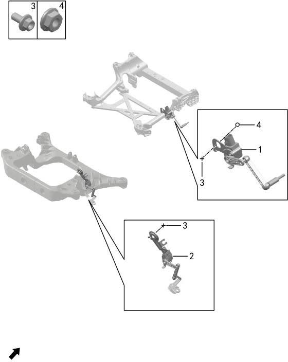

| Поз. | Артикул | Наименование | Кол-во | Системный номер | Примечание |
| ---: | --- | --- | ---: | --- | --- |
| 1 | 294113001 | Левый передний датчик высоты | 1 | H97A2941005AB |  |
| 1 | 294114001 | Правый передний датчик высоты | 1 | H97A2941010AB |  |
| 2 | 294115001 | Левый задний датчик высоты | 1 | H97A2941015AA | замена на 294115002 |
| 2 | 294115002 | Левый задний датчик высоты | 1 | H97A2941015AB |  |
| 2 | 294116001 | Правый задний датчик высоты | 1 | H97A2941020AA | замена на 294116002 |
| 2 | 294116002 | Правый задний датчик высоты | 1 | H97A2941020AB |  |
| 3 | Q11001002 | Фланцевый болт | 4 | HQ1840612L1 |  |
| 4 | Q21001003 | Фланцевая гайка | 2 | HQ32006L1 |  |

# 3026-10 Воздушные магистрали

- Описание: полуактивная пневмоподвеска

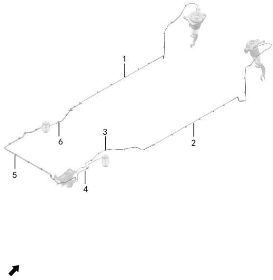

| Поз. | Артикул | Наименование | Кол-во | Системный номер | Примечание |
| ---: | --- | --- | ---: | --- | --- |
| 1 | 294104001 | Передний участок магистрали левой передней пневмопружины | 1 | H97A2941006AB |  |
| 2 | 294106001 | Передний участок магистрали правой передней пневмопружины | 1 | H97A2941008AB |  |
| 3 | 294107001 | Задний участок магистрали правой передней пневмопружины | 1 | H97A2941009AB |  |
| 4 | 294109001 | Магистраль правой задней пневмопружины | 1 | H97A2941012AB |  |
| 5 | 294108001 | Магистраль левой задней пневмопружины | 1 | H97A2941011AB |  |
| 6 | 294105001 | Задний участок магистрали левой передней пневмопружины | 1 | H97A2941007AB |  |

# 3027-10 Блок управления активной подвеской

- Описание: полуактивная пневмоподвеска

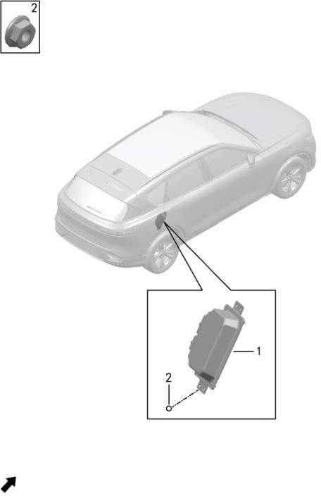

| Поз. | Артикул | Наименование | Кол-во | Системный номер | Примечание |
| ---: | --- | --- | ---: | --- | --- |
| 1 | 361402001 | Контроллер пневмоподвески | 1 | H97A3614800AA |  |
| 1 | 361402002 | Контроллер пневмоподвески | 1 | H97A3614800AB |  |
| 2 | Q21001003 | Фланцевая гайка | 4 | HQ32006L1 |  |

# 3028-10 Передние рычаги

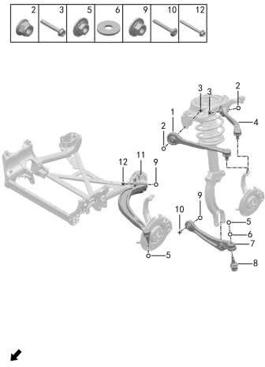

| Поз. | Артикул | Наименование | Кол-во | Системный номер | Примечание |
| ---: | --- | --- | ---: | --- | --- |
| 1 | 290401001 | Левый верхний рычаг передней подвески | 1 | 2904310-RA01 |  |
| 1 | 290402001 | Правый верхний рычаг передней подвески | 1 | 2904320-RA01 |  |
| 2 | Q21002010 | Стопорная гайка | 6 | HQ33810T10L1 |  |
| 3 | Q11001075 | Фланцевый болт | 4 | HQY1861068T10L1 |  |
| 4 | 290403001 | Левый задний верхний рычаг задней подвески | 1 | 2904410-RA01 |  |
| 4 | 290404001 | Правый задний верхний рычаг задней подвески | 1 | 2904420-RA01 |  |
| 5 | Q21002016 | Стопорная гайка | 4 | HQY32014T10L1UA |  |
| 6 | Q22001006 | Шайба | 4 | HQY40214 |  |
| 7 | 290405001 | Левый нижний рычаг передней подвески | 1 | 2904500-RA01 |  |
| 7 | 290406001 | Правый нижний рычаг передней подвески | 1 | 2904600-RA01 |  |
| 8 | 290410001 | Наружная шаровая опора нижнего переднего рычага | 2 | 2904610-RA01 |  |
| 9 | Q21002001 | Стопорная гайка | 4 | HQY32012T10L1U |  |
| 10 | Q11002032 | Болт | 2 | HQY2151295T10L1DU |  |
| 11 | 290407001 | Левый задний нижний рычаг задней подвески | 1 | 2904700-RA01 |  |
| 11 | 290408001 | Правый задний нижний рычаг задней подвески | 1 | 2904800-RA01 |  |
| 12 | Q11001077 | Фланцевый болт | 2 | HQY18612123T10L1D |  |

# 3029-10 Задние рычаги

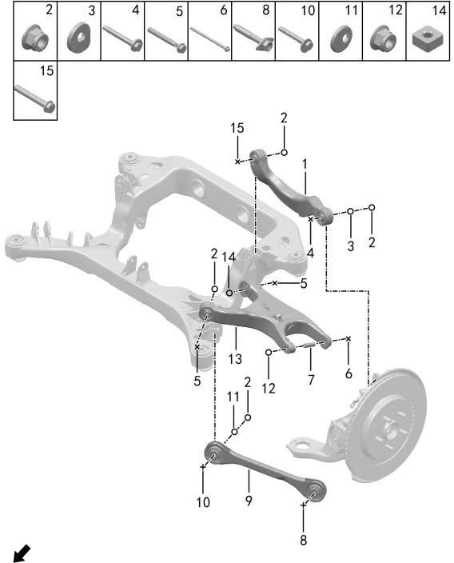

| Поз. | Артикул | Наименование | Кол-во | Системный номер | Примечание |
| ---: | --- | --- | ---: | --- | --- |
| 1 | 291401001 | Левый задний верхний рычаг | 1 | 2914100-RA01 |  |
| 1 | 291402001 | Правый задний верхний рычаг | 1 | 2914200-RA01 |  |
| 2 | Q21002013 | Стопорная гайка | 8 | HQY33912T10L1U |  |
| 3 | Q22002002 | Эксцентриковая шайба | 2 | HQY402B1202 |  |
| 4 | Q11003001 | Эксцентриковый болт | 2 | HQ18612105T10L1PU |  |
| 5 | Q11002008 | Болт | 4 | HQY14012107T10L1U |  |
| 6 | Q11002028 | Болт | 2 | HQY18514265T10L1D |  |
| 7 | 291406001 | Втулка заднего нижнего рычага | 2 | 2914011-RA01 |  |
| 8 | Q11002030 | Болт | 2 | HQY1861280T10L1DU |  |
| 9 | 291405001 | Рычаг регулировки схождения задней подвески | 2 | H97A2914007AA |  |
| 10 | Q11003002 | Эксцентриковый болт | 2 | HQ1861295T10L1PU | замена на Q11003003 |
| 10 | Q11003003 | Эксцентриковый болт | 2 | HQ1861295T10L1PUA |  |
| 11 | Q22002001 | Эксцентриковая шайба | 2 | HQY402B1201 | замена на Q22002003 |
| 11 | Q22002003 | Эксцентриковая шайба | 2 | HQY402B1201A |  |
| 12 | Q21002012 | Стопорная гайка | 2 | HQ33914T10L1 |  |
| 13 | 291403001 | Левый задний нижний рычаг | 1 | 2914500-RA01 |  |
| 13 | 291404001 | Правый задний нижний рычаг | 1 | 2914600-RA01 |  |
| 14 | Q21005001 | Квадратная гайка | 2 | HQY31012T10L1U |  |
| 15 | Q11002002 | Болт | 2 | HQ1401290T10L1QU |  |

# 3030-10 Передний стабилизатор

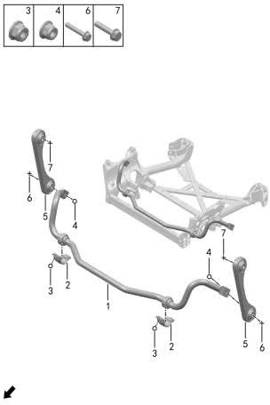

| Поз. | Артикул | Наименование | Кол-во | Системный номер | Примечание |
| ---: | --- | --- | ---: | --- | --- |
| 1 | 290602001 | Передний стабилизатор | 1 | H97A2906001AA |  |
| 2 | 290603001 | Кронштейн переднего стабилизатора | 2 | H97A2906004AA |  |
| 3 | Q21002009 | Стопорная гайка | 4 | HQ33808T10L1 |  |
| 4 | Q21002010 | Стопорная гайка | 2 | HQ33810T10L1 |  |
| 5 | 290601001 | Стойка переднего стабилизатора | 2 | 2906150-RA01 | замена на 290601002 |
| 5 | 290601002 | Стойка переднего стабилизатора | 2 | H97A2906002AA |  |
| 6 | Q11001079 | Фланцевый болт | 2 | HQY1861060T10L1QD |  |
| 7 | Q11002031 | Болт | 2 | HQY1861050T10L1D |  |

# 3031-10 Задний стабилизатор

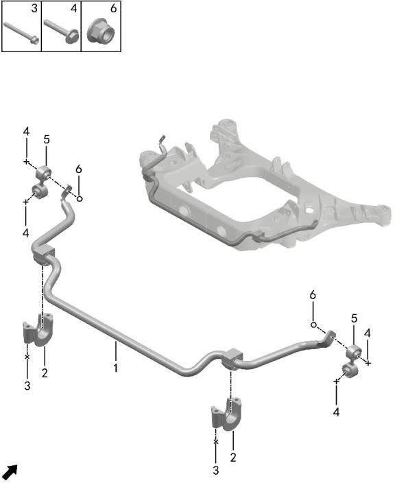

| Поз. | Артикул | Наименование | Кол-во | Системный номер | Примечание |
| ---: | --- | --- | ---: | --- | --- |
| 1 | 291603001 | Задний стабилизатор | 1 | H97A2916001AA | версия с рендж-экстендером (ДВС), задний привод; электрическая версия, задний привод; электрическая версия, полный привод |
| 1 | 291603002 | Задний стабилизатор | 1 | H97A2916001BA | версия с рендж-экстендером (ДВС), полный привод; электрическая версия, полный привод, без пневмоподвески |
| 2 | 291601001 | Кронштейн заднего стабилизатора | 2 | 2916120-RA01 |  |
| 3 | Q11001073 | Фланцевый болт | 4 | HQY1860880T10L1QD |  |
| 4 | Q11002007 | Болт | 4 | HQY1401065T10L1QD |  |
| 5 | 291602001 | Стойка заднего стабилизатора | 2 | 2916150-RA01 |  |
| 6 | Q21002010 | Стопорная гайка | 2 | HQ33810T10L1 |  |

# 3032-10 Рулевое колесо

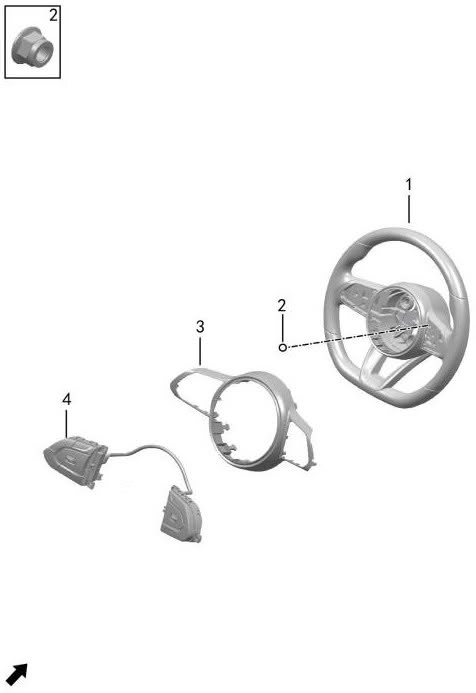

| Поз. | Артикул | Наименование | Кол-во | Системный номер | Примечание |
| ---: | --- | --- | ---: | --- | --- |
| 1 | 340201004BKAB | Рулевое колесо | 1 | H97A3402003AABKAB | черный |
| 1 | 340201004BRAC | Рулевое колесо | 1 | H97A3402003AABRAC | светло-коричневый |
| 1 | 340201005BEAC | Рулевое колесо | 1 | H97A3402003BABEAC | бежево-коричневый |
| 1 | 340201005BLAC | Рулевое колесо | 1 | H97A3402003BABLAC | сине-коричневый |
| 2 | Q21002011 | Стопорная гайка | 1 | HQ33912 |  |
| 3 | 340202001 | Декоративная накладка рулевого колеса | 1 | H97A3402005AA |  |

# 3033-10 Рулевая колонка

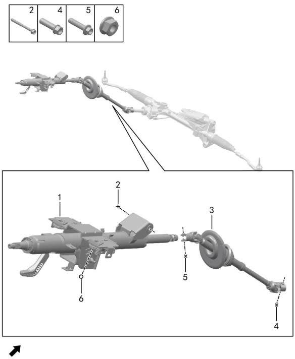

| Поз. | Артикул | Наименование | Кол-во | Системный номер | Примечание |
| ---: | --- | --- | ---: | --- | --- |
| 1 | 340401001 | Верхний рулевой вал | 1 | 3404110-RA01 | замена на 340401002 |
| 1 | 340401002 | Верхний рулевой вал | 2 | H97A3404001AA |  |
| 2 | Q11001090 | Фланцевый болт | 1 | HQY1880890D |  |
| 3 | 340402001 | Нижний рулевой вал | 1 | 3404120-RA01 |  |
| 4 | Q11001029 | Фланцевый болт | 1 | HQ1841035T10L1S |  |
| 5 | Q11001024 | Фланцевый болт | 1 | HQ1840835T10L1S |  |
| 6 | Q21001004 | Фланцевая гайка | 2 | HQ32008 |  |

# 3034-10 Рулевой механизм

- Описание: электрическая версия

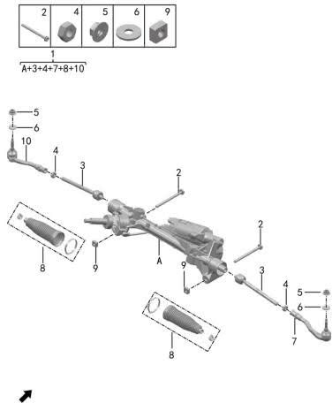

| Поз. | Артикул | Наименование | Кол-во | Системный номер | Примечание |
| ---: | --- | --- | ---: | --- | --- |
| 1 | 340002001 | Рулевой механизм | 1 | H97A3400001AA | замена на 340002002 |
| 1 | 340002002 | Рулевой механизм | 1 | H97A3400001AB |  |
| 2 | Q11002023 | Болт | 2 | HQY18012152T10L1W |  |
| 3 | 340007001 | Внутренняя рулевая тяга | 2 | H97A3400011AA |  |
| 4 | Q21009001 | Гайка соединения внутренней и наружной тяг | 2 | HQY970021 |  |
| 5 | Q21002019 | Стопорная гайка | 2 | HQY33112T10L1U |  |
| 6 | Q22001005 | Шайба | 2 | HQY40212 |  |
| 7 | 340006001 | Правый наружный наконечник рулевой тяги | 1 | H97A3400010AA |  |
| 8 | 340008001 | Ремкомплект пыльника | 2 | H97A3400012AA |  |
| 9 | Q21005002 | Квадратная гайка | 2 | HQY31012W |  |
| 10 | 340005001 | Левый наружный наконечник рулевой тяги | 1 | H97A3400009AA |  |

# 3034-11 Рулевой механизм

- Описание: версия с рендж-экстендером (ДВС)

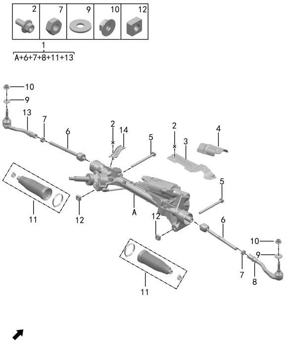

| Поз. | Артикул | Наименование | Кол-во | Системный номер | Примечание |
| ---: | --- | --- | ---: | --- | --- |
| 1 | 340002001 | Рулевой механизм | 1 | H97A3400001AA | замена на 340002002 |
| 1 | 340002002 | Рулевой механизм | 1 | H97A3400001AB |  |
| 2 | Q11001001 | Фланцевый болт | 4 | HQ1840612 |  |
| 3 | 340001001 | Теплозащитный экран рулевой рейки | 1 | 3412075-RA51 |  |
| 4 | 340004001 | Теплоизоляционная прокладка рулевой рейки | 1 | 3412077-RA51 |  |
| 5 | Q11002023 | Болт | 2 | HQY18012152T10L1W |  |
| 6 | 340007001 | Внутренняя рулевая тяга | 2 | H97A3400011AA |  |
| 7 | Q21009001 | Гайка соединения внутренней и наружной тяг | 2 | HQY970021 |  |
| 8 | 340006001 | Правый наружный наконечник рулевой тяги | 1 | H97A3400010AA |  |
| 9 | Q22001005 | Шайба | 2 | HQY40212 |  |
| 10 | Q21002019 | Стопорная гайка | 2 | HQY33112T10L1U |  |
| 11 | 340008001 | Ремкомплект пыльника | 2 | H97A3400012AA |  |
| 12 | Q21005002 | Квадратная гайка | 2 | HQY31012W |  |
| 13 | 340005001 | Левый наружный наконечник рулевой тяги | 1 | H97A3400009AA |  |
| 14 | 340003001 | Кронштейн жгута мотора EPS | 1 | H97A3400007AA |  |

# 3043-10 Датчики скорости колеса

- Описание: без пневмоподвески

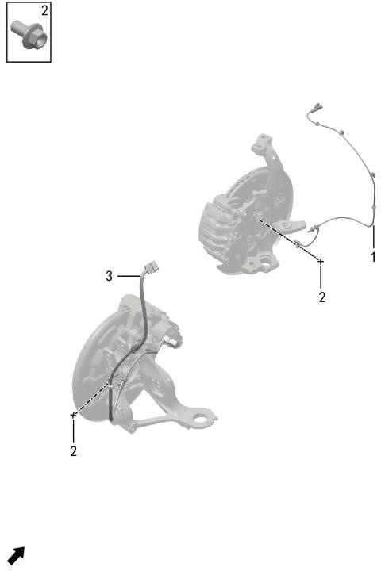

| Поз. | Артикул | Наименование | Кол-во | Системный номер | Примечание |
| ---: | --- | --- | ---: | --- | --- |
| 1 | 360208004 | Левый передний датчик скорости колеса | 1 | H97A3602004CA | задний привод |
| 1 | 360210004 | Правый передний датчик скорости колеса | 1 | H97A3602022CA | задний привод |
| 1 | 360208003 | Левый передний датчик скорости колеса | 1 | H97A3602004BA | полный привод |
| 1 | 360210003 | Правый передний датчик скорости колеса | 1 | H97A3602022BA | полный привод |
| 2 | Q11001001 | Фланцевый болт | 4 | HQ1840612 |  |
| 3 | 360209003 | Левый задний датчик скорости колеса | 1 | H97A3602007BA |  |
| 3 | 360211003 | Правый задний датчик скорости колеса | 1 | H97A3602008BA |  |

# 3043-11 Датчики скорости колеса

- Описание: полуактивная пневмоподвеска

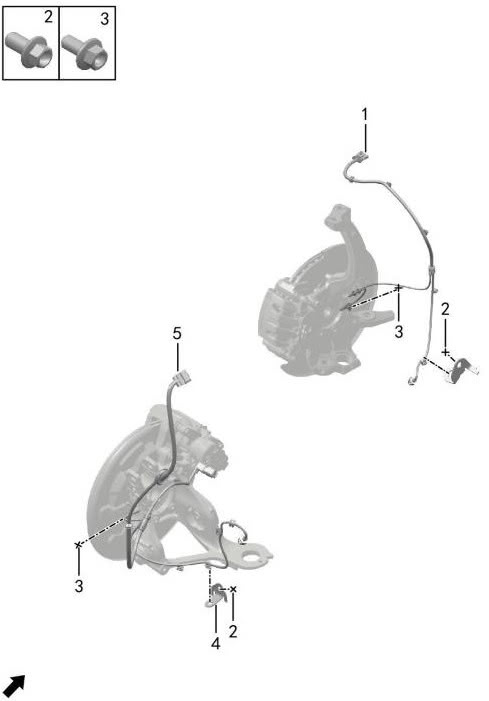

| Поз. | Артикул | Наименование | Кол-во | Системный номер | Примечание |
| ---: | --- | --- | ---: | --- | --- |
| 1 | 360208002 | Левый передний датчик скорости колеса | 1 | H97A3602004AC | замена на 360208005 |
| 1 | 360208005 | Левый передний датчик скорости колеса | 1 | H97A3602004AD |  |
| 1 | 360210002 | Правый передний датчик скорости колеса | 1 | H97A3602022AC | замена на 360210005 |
| 1 | 360210005 | Правый передний датчик скорости колеса | 1 | H97A3602022AD |  |
| 2 | Q11001016 | Фланцевый болт | 2 | HQ1840816L1 |  |
| 3 | Q11001001 | Фланцевый болт | 4 | HQ1840612 |  |
| 4 | 294119001 | Левый задний кронштейн жгута | 1 | H97A2941026AA |  |
| 4 | 294120001 | Правый задний кронштейн жгута | 1 | H97A2941027AA |  |
| 5 | 360209004 | Левый задний датчик скорости колеса | 1 | H97A3602007AB | замена на 360209005 |
| 5 | 360209005 | Левый задний датчик скорости колеса | 1 | H97A3602007AC |  |
| 5 | 360211004 | Правый задний датчик скорости колеса | 1 | H97A3602008AB | замена на 360211005 |
| 5 | 360211005 | Правый задний датчик скорости колеса | 1 | H97A3602008AC |  |

# 3044-10 Передний тормозной диск

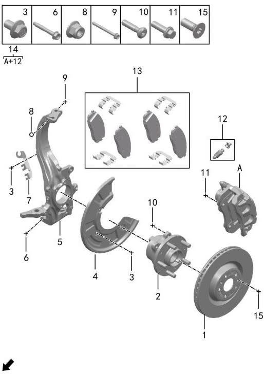

| Поз. | Артикул | Наименование | Кол-во | Системный номер | Примечание |
| ---: | --- | --- | ---: | --- | --- |
| 1 | 350108001 | Передний тормозной диск | 2 | 3501101-RA01 |  |
| 2 | 350105002 | Подшипник передней ступицы | 2 | 3501600-RA02 | задний привод |
| 2 | 350105001 | Подшипник передней ступицы | 2 | 3501600-RA01 | полный привод |
| 3 | 350111001 | Фланцевый болт | 8 | 3501312-RA01 |  |
| 4 | 350103001 | Левый защитный щиток переднего тормозного диска | 1 | 3501301-RA01 |  |
| 4 | 350104001 | Правый защитный щиток переднего тормозного диска | 1 | 3501401-RA01 |  |
| 5 | 350106001 | Левый передний поворотный кулак | 1 | 3501371-RA01 |  |
| 5 | 350107001 | Правый передний поворотный кулак | 1 | 3501381-RA01 |  |
| 6 | Q11001076 | Фланцевый болт | 2 | HQY1861072T10L1D |  |
| 7 | 350112001 | Левый кронштейн переднего датчика скорости колеса | 1 | 3501311-RA01 |  |
| 7 | 350113001 | Правый кронштейн переднего датчика скорости колеса | 1 | 3501411-RA01 |  |
| 8 | Q21002010 | Стопорная гайка | 2 | HQ33810T10L1 |  |
| 9 | Q11001074 | Фланцевый болт | 2 | HQY18610110T10L1D |  |
| 10 | 350110001 | Соединительный болт подшипника | 8 | 3501105-RA01 |  |
| 11 | 350109001 | Болт кронштейна | 4 | 3501103-RA01 |  |
| 12 | 350117001 | Комплект переднего штуцера прокачки | 1 | 3501472-RA01 |  |
| 13 | 350118001 | Передние тормозные колодки | 1 | 3501510-RA01 | замена на 350118002 |
| 13 | 350118002 | Передние тормозные колодки | 1 | H97A3501018AA | комплект на автомобиль, включая фрикционные накладки, стопорное кольцо |
| 14 | 350115001 | Левый передний тормозной суппорт | 1 | 3501471-RA01 |  |
| 14 | 350116001 | Правый передний тормозной суппорт | 1 | 3501481-RA01 |  |
| 15 | 350114001 | Винт крепления тормозного диска | 4 | 3501102-RA01 |  |

# 3045-10 Задний тормозной диск

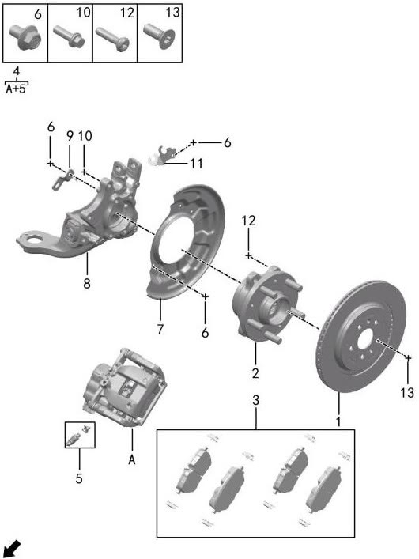

| Поз. | Артикул | Наименование | Кол-во | Системный номер | Примечание |
| ---: | --- | --- | ---: | --- | --- |
| 1 | 350207001 | Задний тормозной диск | 2 | 3502101-RA01 |  |
| 2 | 350105001 | Подшипник передней ступицы | 2 | 3501600-RA01 |  |
| 3 | 350213001 | Задние тормозные колодки | 1 | 3502100-RA01 | замена на 350213002 |
| 3 | 350213002 | Задние тормозные колодки | 1 | H97A3502020AA | комплект на автомобиль, включая фрикционные накладки, стопорное кольцо |
| 4 | 350203001 | Левый задний тормозной суппорт | 1 | H97A3502011AA |  |
| 4 | 350204001 | Правый задний тормозной суппорт | 1 | H97A3502012AA |  |
| 5 | 350117001 | Комплект переднего штуцера прокачки | 1 | 3501472-RA01 |  |
| 6 | 350111001 | Фланцевый болт | 12 | 3501312-RA01 |  |
| 7 | 350205001 | Левый защитный щиток заднего тормозного диска | 1 | 3502301-RA01 |  |
| 7 | 350206001 | Правый защитный щиток заднего тормозного диска | 1 | 3502401-RA01 |  |
| 8 | 350210001 | Левый задний поворотный кулак | 1 | 3502371-RA01 |  |
| 8 | 350211001 | Правый задний поворотный кулак | 1 | 3502381-RA01 |  |
| 9 | 350209002 | Кронштейн заднего датчика скорости колеса | 1 | 3502312-RA01 |  |
| 9 | 350209004 | Кронштейн заднего датчика скорости колеса | 1 | 3502412-RA01 |  |
| 10 | 350208001 | Болт кронштейна | 4 | 3502103-RA01 |  |
| 11 | 350209001 | Кронштейн заднего датчика скорости колеса | 1 | 3502311-RA01 |  |
| 11 | 350209003 | Кронштейн заднего датчика скорости колеса | 1 | 3502411-RA01 |  |
| 12 | 350110001 | Соединительный болт подшипника | 8 | 3501105-RA01 |  |
| 13 | 350114001 | Винт крепления тормозного диска | 4 | 3501102-RA01 |  |

# 3046-10 Тормозная педаль

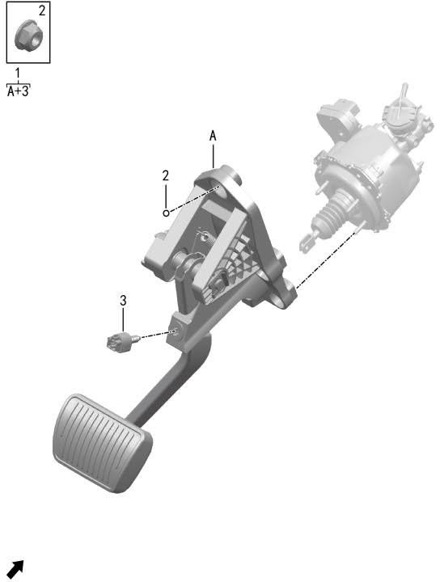

| Поз. | Артикул | Наименование | Кол-во | Системный номер | Примечание |
| ---: | --- | --- | ---: | --- | --- |
| 1 | 350401001 | Тормозная педаль | 1 | H97A3504005AB |  |
| 2 | Q21002006 | Стопорная гайка | 1 | HQ33008 |  |
| 3 | 350402001 | Выключатель тормоза | 1 | H97A3608010AA |  |

# 3047-10 Педаль акселератора

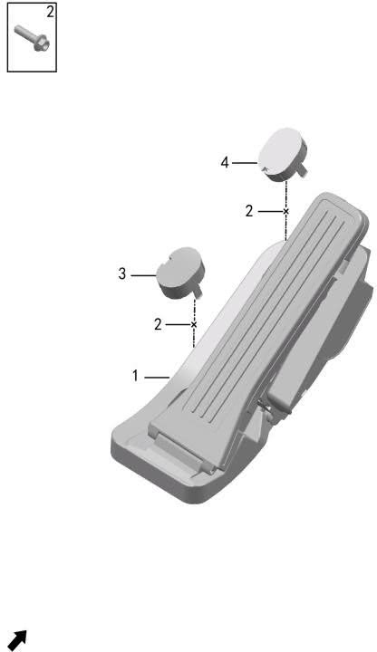

| Поз. | Артикул | Наименование | Кол-во | Системный номер | Примечание |
| ---: | --- | --- | ---: | --- | --- |
| 1 | 110801001 | Педаль электронного акселератора | 1 | 1108200-RA01 |  |
| 2 | Q11001011 | Фланцевый болт | 2 | HQ1840625L1 |  |
| 3 | 110802002 | Заглушка педали акселератора | 1 | 1108312-RA01 |  |
| 4 | 110802001 | Заглушка педали акселератора | 1 | 1108311-RA01 |  |

# 3048-10 Тормозные шланги

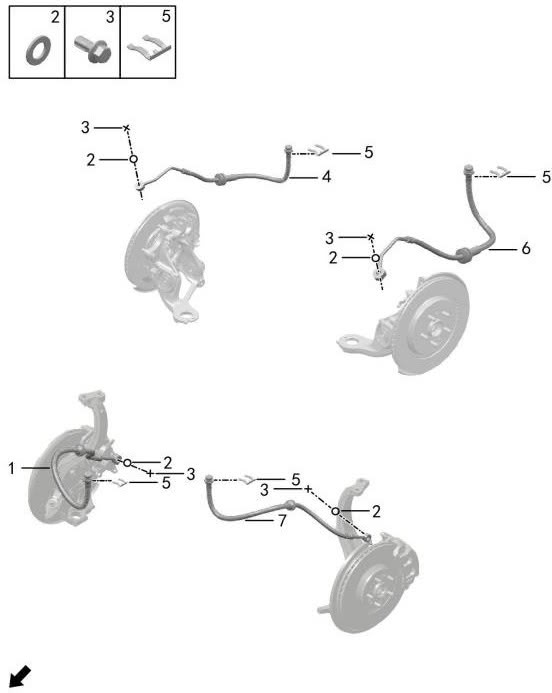

| Поз. | Артикул | Наименование | Кол-во | Системный номер | Примечание |
| ---: | --- | --- | ---: | --- | --- |
| 1 | 350602001 | Правый передний тормозной шланг | 1 | H97A3506011AA |  |
| 2 | 350606001 | Монтажная шайба | 8 | 3506102-E1 | замена на 350606002 |
| 2 | 350606002 | Монтажная шайба | 8 | HQY40210 |  |
| 3 | 350607001 | Соединительный болт | 4 | 3506101-E1 | замена на 350607002 |
| 3 | 350607002 | Соединительный болт | 4 | HQY1841022T9 |  |
| 4 | 350611001 | Правый задний тормозной шланг | 1 | H97A3506013AA |  |
| 5 | Q42001001 | Стопорное кольцо E-типа | 4 | HQY3931301 | замена на Q42001002 |
| 5 | Q42001002 | Стопорное кольцо E-типа | 4 | HQY3931301A |  |
| 6 | 350610001 | Левый задний тормозной шланг | 1 | H97A3506012AA |  |
| 7 | 350601001 | Левый передний тормозной шланг | 1 | H97A3506010AA |  |

# 3049-10 Тормозные трубки

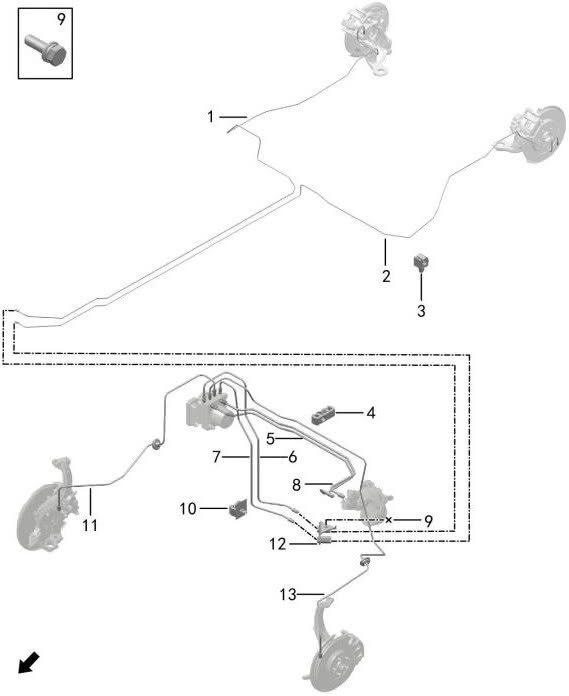

| Поз. | Артикул | Наименование | Кол-во | Системный номер | Примечание |
| ---: | --- | --- | ---: | --- | --- |
| 1 | 294101002 | Задняя тормозная магистраль | 1 | H97A2941002AA |  |
| 2 | 294101001 | Задняя тормозная магистраль | 1 | H97A2941001AA |  |
| 3 | 350605001 | Одинарный зажим тормозной магистрали | 14 | 3506150-RA01 | замена на 350605002 |
| 3 | 350605002 | Одинарный зажим тормозной магистрали | 14 | HQY643006 |  |
| 4 | 350604001 | Тройной зажим тормозной магистрали | 2 | 3506108-RA01 | замена на 350604002 |
| 4 | 350604002 | Тройной зажим тормозной магистрали | 2 | HQY645003 |  |
| 5 | 350603002 | Передняя тормозная магистраль | 1 | H97A3506002AA |  |
| 6 | 350603006 | Передняя тормозная магистраль | 1 | H97A3506006AA |  |
| 7 | 350603005 | Передняя тормозная магистраль | 1 | H97A3506005AA |  |
| 8 | 350603001 | Передняя тормозная магистраль | 1 | H97A3506001AA |  |
| 9 | Q11002013 | Болт | 1 | HQ1460620 |  |
| 10 | 350608001 | Двойной зажим | 7 | 3506140-RA01 | замена на 350608002 |
| 10 | 350608002 | Двойной зажим | 7 | HQY644003 |  |
| 11 | 350603004 | Передняя тормозная магистраль | 1 | H97A3506004AA |  |
| 12 | 350609001 | Четырёхходовой соединитель | 1 | H97A3506014AA |  |
| 13 | 350603003 | Передняя тормозная магистраль | 1 | H97A3506003AA |  |

# 3050-10 Блок управления тормозами

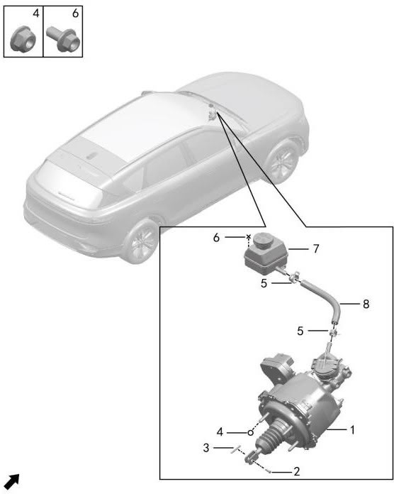

| Поз. | Артикул | Наименование | Кол-во | Системный номер | Примечание |
| ---: | --- | --- | ---: | --- | --- |
| 1 | 361702001 | Интеллектуальный усилитель | 1 | H97A3617803AA |  |
| 2 | Q14002001 | Штифт | 1 | HQY510B0801 |  |
| 3 | Q14001001 | Шплинт | 1 | Q5003220 |  |
| 4 | Q21002006 | Стопорная гайка | 4 | HQ33008 |  |
| 5 | Q31001004 | Зажим трубки | 2 | Q673C18F62 |  |
| 6 | Q11001001 | Фланцевый болт | 1 | HQ1840612 |  |
| 7 | 353901001 | Бачок и принадлежности | 1 | 3505110-RA01 |  |
| 8 | 353902001 | Соединительный шланг бачка | 1 | 3505115-RA01 |  |

# 3051-10 Модуль управления шасси

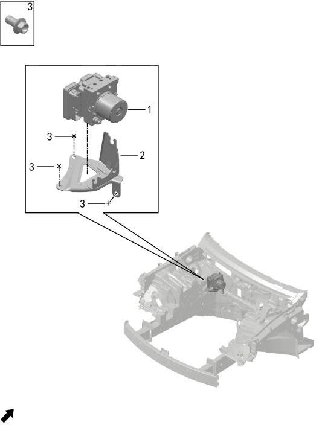

| Поз. | Артикул | Наименование | Кол-во | Системный номер | Примечание |
| ---: | --- | --- | ---: | --- | --- |
| 1 | 361701001 | Исполнительный механизм ESC | 1 | H97A3617800AA |  |
| 2 | 355005001 | Кронштейн исполнительного механизма ESC | 1 | H97A3550001AA |  |
| 3 | Q11001015 | Фланцевый болт | 3 | HQ1840816 |  |

# 3053-10 Расширенные системы помощи водителю

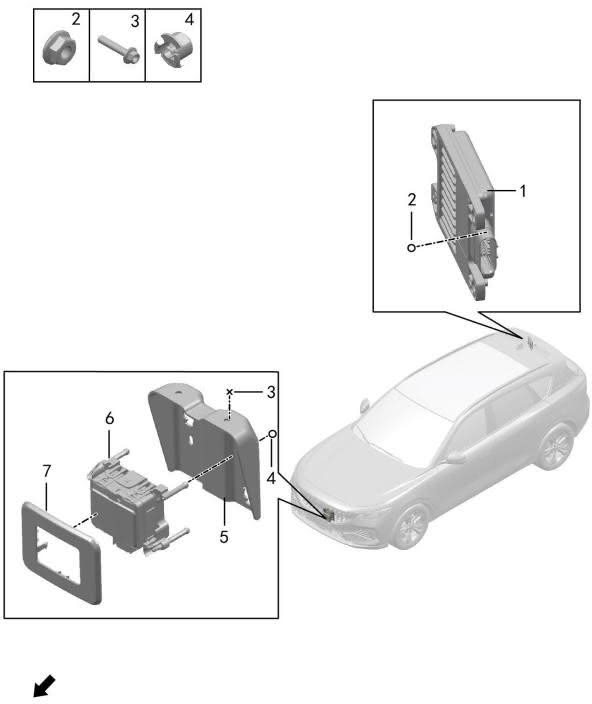

| Поз. | Артикул | Наименование | Кол-во | Системный номер | Примечание |
| ---: | --- | --- | ---: | --- | --- |
| 1 | 362903001 | Левый задний угловой радар | 1 | H97A3629806AA |  |
| 1 | 362904001 | Правый задний угловой радар | 1 | H97A3629809AA |  |
| 2 | Q21001002 | Фланцевая гайка | 6 | HQ32006 |  |
| 3 | Q11001004 | Фланцевый болт | 2 | HQ1840616 |  |
| 4 | 356002001 | Клипса крепления миллиметрового радара | 3 | 3560111-RA01 |  |
| 5 | 362906001 | Кронштейн переднего миллиметрового радара | 1 | H97A3629012AA |  |
| 6 | 362902001 | Передний радар миллиметрового диапазона | 1 | H97A3629803AA |  |
| 7 | 356001001 | Декоративный кожух миллиметрового радара | 1 | H97A3629011AA |  |

# 3056-10 Парковочная помощь

- Описание: N1 стандартно

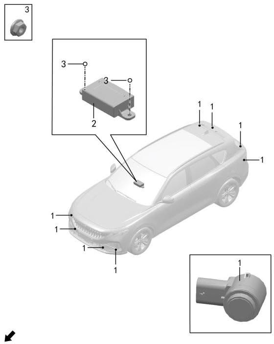

| Поз. | Артикул | Наименование | Кол-во | Системный номер | Примечание |
| ---: | --- | --- | ---: | --- | --- |
| 1 | 378501001 | Датчик заднего парктроника | 8 | H97A3785002AA |  |
| 2 | 362907001 | Блок управления задним парктроником | 1 | H97A3629812AA |  |
| 3 | Q21001002 | Фланцевая гайка | 2 | HQ32006 |  |

# 3056-11 Парковочная помощь

- Описание: N1 опция, N2 и N3 стандартно

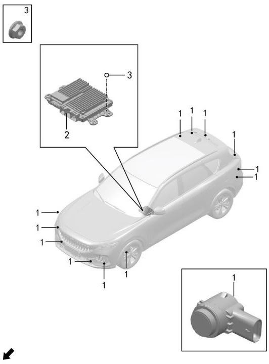

| Поз. | Артикул | Наименование | Кол-во | Системный номер | Примечание |
| ---: | --- | --- | ---: | --- | --- |
| 1 | 378502001 | Датчик парковочного радара | 12 | H97A3785004AA |  |
| 2 | 362910001 | Контроллер автопарковки | 1 | H97A3629821AA | замена на 362910002 |
| 2 | 362910002 | Контроллер автопарковки | 1 | H97A3629821AB |  |
| 3 | Q21001002 | Фланцевая гайка | 2 | HQ32006 |  |

# 3057-10 Системы видеообзора

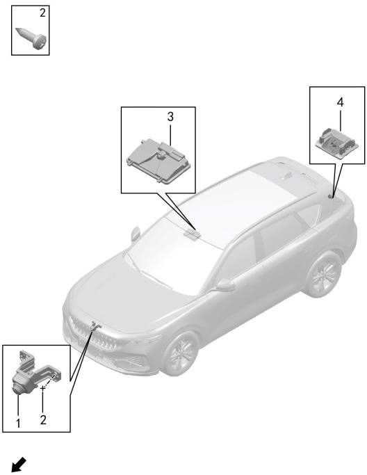

| Поз. | Артикул | Наименование | Кол-во | Системный номер | Примечание |
| ---: | --- | --- | ---: | --- | --- |
| 1 | 791401001 | Передняя камера | 1 | H97A7914001AA |  |
| 2 | Q12002009 | Самонарезающий винт | 2 | Q2714216 |  |
| 3 | 362905001 | Передняя моно-камера | 1 | H97A3629800AA |  |
| 4 | 791402001 | Задняя камера | 1 | H97A7914002AA |  |

# 3057-11 Системы видеообзора

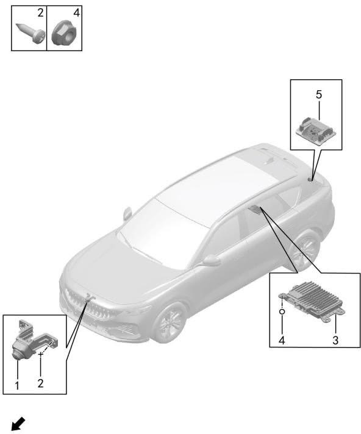

| Поз. | Артикул | Наименование | Кол-во | Системный номер | Примечание |
| ---: | --- | --- | ---: | --- | --- |
| 1 | 791401001 | Передняя камера | 1 | H97A7914001AA |  |
| 2 | Q12002009 | Самонарезающий винт | 2 | Q2714216 |  |
| 3 | 362908001 | Блок управления круговым обзором | 1 | H97A3629815AA |  |
| 4 | Q21001002 | Фланцевая гайка | 2 | HQ32006 |  |
| 5 | 791402001 | Задняя камера | 1 | H97A7914002AA |  |
