- [4010-10 Радиатор кондиционера](#4010-10-радиатор-кондиционера)
- [4010-11 Радиатор кондиционера](#4010-11-радиатор-кондиционера)
- [4011-10 Компрессор кондиционера](#4011-10-компрессор-кондиционера)
- [4011-11 Компрессор кондиционера](#4011-11-компрессор-кондиционера)
- [4012-10 Система кондиционирования](#4012-10-система-кондиционирования)
- [4012-11 Система кондиционирования](#4012-11-система-кондиционирования)
- [4013-10 Испаритель кондиционера](#4013-10-испаритель-кондиционера)
- [4015-10 PTC кондиционера](#4015-10-ptc-кондиционера)
- [4016-10 Контроллер кондиционера](#4016-10-контроллер-кондиционера)
- [4017-10 Панель управления кондиционером](#4017-10-панель-управления-кондиционером)
- [4018-10 Ароматизатор](#4018-10-ароматизатор)
- [4020-10 Подушка безопасности водителя](#4020-10-подушка-безопасности-водителя)
- [4021-10 Подушка безопасности пассажира](#4021-10-подушка-безопасности-пассажира)
- [4024-10 Передние ремни безопасности](#4024-10-передние-ремни-безопасности)
- [4027-10 Задние ремни безопасности](#4027-10-задние-ремни-безопасности)
- [4027-11 Задние ремни безопасности](#4027-11-задние-ремни-безопасности)
- [4028-10 Регулятор высоты](#4028-10-регулятор-высоты)
- [4030-10 Передний датчик столкновения](#4030-10-передний-датчик-столкновения)
- [4031-10 Боковые датчики столкновения](#4031-10-боковые-датчики-столкновения)
- [4034-10 Блок управления подушками безопасности](#4034-10-блок-управления-подушками-безопасности)

# 4010-10 Радиатор кондиционера

- Описание: версия с рендж-экстендером (ДВС)

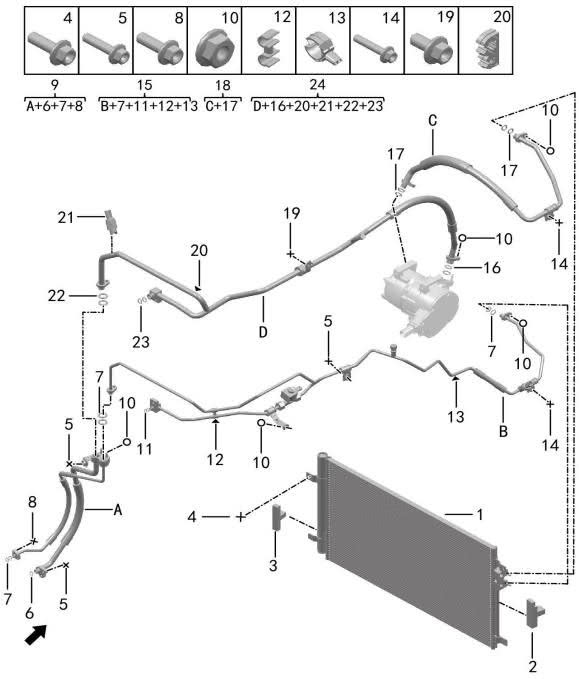

| Поз. | Артикул | Наименование | Кол-во | Системный номер | Примечание |
| ---: | --- | --- | ---: | --- | --- |
| 1 | 810501002 | Радиатор кондиционера | 1 | 8105100-RA52 |  |
| 2 | 810502001 | Правая уплотнительная прокладка радиатора кондиционера | 1 | H97A8105001AA |  |
| 3 | 810503001 | Левая уплотнительная прокладка радиатора кондиционера | 1 | H97A8105006AA |  |
| 4 | Q11001006 | Фланцевый болт | 2 | HQ1840618 |  |
| 5 | Q11001010 | Фланцевый болт | 4 | HQ1840625 |  |
| 6 | 810703008 | Уплотнительное кольцо | 1 | H97A8107005AJ | φ10.8×φ2.4 |
| 7 | 810703002 | Уплотнительное кольцо | 9 | H97A8107005AC | φ7.65×φ1.78 |
| 8 | Q11001006 | Фланцевый болт | 2 | HQ1840618 |  |
| 9 | 810903001 | Трубка кондиционера модуля охлаждения батареи | 1 | 8109100-RA51 |  |
| 10 | Q21001002 | Фланцевая гайка | 7 | HQ32006 |  |
| 11 | 810703003 | Уплотнительное кольцо | 2 | H97A8107005AD | φ6.8×φ1.9 |
| 12 | 810706001 | Двойной зажим | 1 | H97A8107008AA |  |
| 13 | 810706002 | Двойной зажим | 1 | H97A8107008AB |  |
| 14 | Q11001012 | Фланцевый болт | 3 | HQ1840630 |  |
| 15 | 810701002 | Входная трубка переднего испарителя | 1 | H97A8107001BA |  |
| 16 | 810703006 | Уплотнительное кольцо | 2 | H97A8107005AG | φ17.17×φ1.78 |
| 17 | 810703001 | Уплотнительное кольцо | 4 | H97A8107005AA | φ10.82×φ1.78 |
| 18 | 810801001 | Нагнетательная трубка компрессора | 1 | 8108120-RA52 |  |
| 19 | Q11001001 | Фланцевый болт | 1 | HQ1840612 |  |
| 20 | 810707001 | Двойной зажим | 1 | H97A8107010AA |  |
| 21 | 810705001 | Датчик давления и температуры | 1 | H97A8107007AA |  |
| 22 | 810703005 | Уплотнительное кольцо | 2 | H97A8107005AF | φ14×φ1.78 |
| 23 | 810703004 | Уплотнительное кольцо | 2 | H97A8107005AE | φ13.6×φ2.43 |
| 24 | 810702002 | Выходная трубка переднего испарителя | 1 | H97A8107002BA |  |

# 4010-11 Радиатор кондиционера

- Описание: электрическая версия

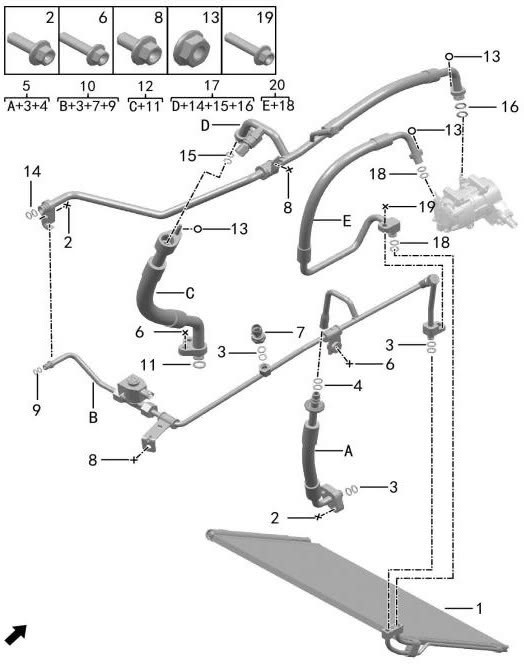

| Поз. | Артикул | Наименование | Кол-во | Системный номер | Примечание |
| ---: | --- | --- | ---: | --- | --- |
| 1 | 810501001 | Радиатор кондиционера | 1 | 8105100-RA01 |  |
| 2 | Q11001006 | Фланцевый болт | 3 | HQ1840618 |  |
| 3 | 810703002 | Уплотнительное кольцо | 6 | H97A8107005AC | φ7.65×φ1.78 |
| 4 | 810703007 | Уплотнительное кольцо | 2 | H97A8107005AH | φ7.37×φ1.9 |
| 5 | 810901001 | Входная трубка кондиционера | 1 | 8109010-RA01 |  |
| 6 | Q11001010 | Фланцевый болт | 3 | HQ1840625 |  |
| 7 | 810704001 | Датчик давления | 1 | H97A8107006AA |  |
| 8 | Q11001001 | Фланцевый болт | 2 | HQ1840612 |  |
| 9 | 810703003 | Уплотнительное кольцо | 2 | H97A8107005AD | φ6.8×φ1.9 |
| 10 | 810701001 | Входная трубка переднего испарителя | 1 | H97A8107001AA |  |
| 11 | 810703008 | Уплотнительное кольцо | 1 | H97A8107005AJ | φ10.8×φ2.4 |
| 12 | 810902001 | Выходная трубка кондиционера | 1 | 8109020-RA01 |  |
| 13 | Q21001002 | Фланцевая гайка | 3 | HQ32006 |  |
| 14 | 810703004 | Уплотнительное кольцо | 2 | H97A8107005AE | φ13.6×φ2.43 |
| 15 | 810703005 | Уплотнительное кольцо | 2 | H97A8107005AF | φ14×φ1.78 |
| 16 | 810703006 | Уплотнительное кольцо | 2 | H97A8107005AG | φ17.17×φ1.78 |
| 17 | 810702001 | Выходная трубка переднего испарителя | 1 | H97A8107002AA |  |
| 18 | 810703001 | Уплотнительное кольцо | 4 | H97A8107005AA | φ10.82×φ1.78 |
| 19 | Q11001022 | Фланцевый болт | 1 | HQ1840835 |  |
| 20 | 810801002 | Нагнетательная трубка компрессора | 1 | H97A8108001AA |  |

# 4011-10 Компрессор кондиционера

- Описание: версия с рендж-экстендером (ДВС)

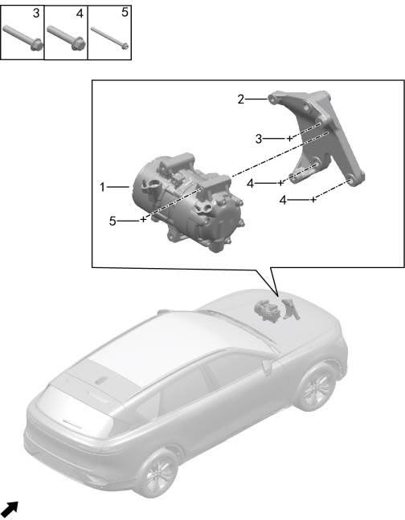

| Поз. | Артикул | Наименование | Кол-во | Системный номер | Примечание |
| ---: | --- | --- | ---: | --- | --- |
| 1 | 810310002 | Компрессор | 1 | H97A8103001AA |  |
| 2 | 101503001 | Кронштейн компрессора кондиционера | 1 | 1015041-F08-01 |  |
| 3 | Q11001068 | Фланцевый болт | 1 | Q1851065TF61 | M10×1.25×65 |
| 4 | Q11001066 | Фланцевый болт | 2 | Q1851050TF61 | M10×1.25×50 |
| 5 | Q11001013 | Фланцевый болт | 3 | HQ18408100 |  |

# 4011-11 Компрессор кондиционера

- Описание: электрическая версия

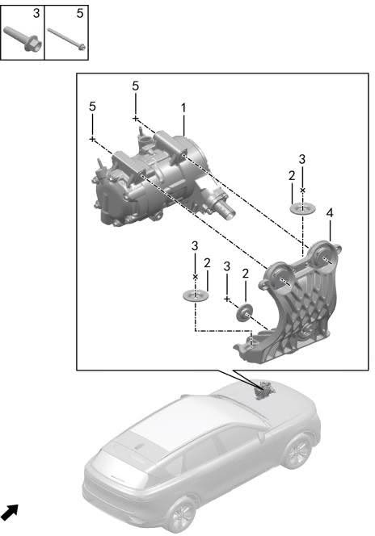

| Поз. | Артикул | Наименование | Кол-во | Системный номер | Примечание |
| ---: | --- | --- | ---: | --- | --- |
| 1 | 810310002 | Компрессор | 1 | H97A8103001AA |  |
| 2 | 810313002 | Ограничитель опоры компрессора | 3 | 8103131-RA01 |  |
| 3 | Q11001022 | Фланцевый болт | 3 | HQ1840835 |  |
| 4 | 810301001 | Кронштейн компрессора | 1 | H97A8103002AA |  |
| 5 | Q11001013 | Фланцевый болт | 3 | HQ18408100 |  |

# 4012-10 Система кондиционирования

- Описание: N1 и N2 стандартно

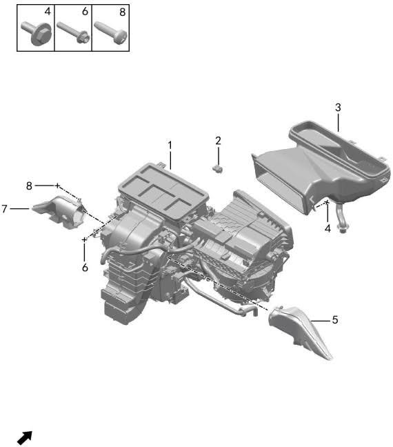

| Поз. | Артикул | Наименование | Кол-во | Системный номер | Примечание |
| ---: | --- | --- | ---: | --- | --- |
| 1 | 810001001 | Блок кондиционера в сборе | 1 | H97A8100001AA |  |
| 2 | 810011001 | Датчик температуры воздуховода | 1 | H97A8114001AA |  |
| 3 | 551701001 | Воздуховод впуска кондиционера | 1 | H97A5517010AA |  |
| 4 | Q11001004 | Фланцевый болт | 4 | HQ1840616 |  |
| 5 | 550133001 | Правый воздуховод обдува ног | 1 | H97A5501090AA |  |
| 6 | Q11002003 | Болт | 6 | HQ140B0618L |  |
| 7 | 550132001 | Левый воздуховод обдува ног | 1 | H97A5501085AA |  |
| 8 | Q12002012 | Самонарезающий винт | 2 | Q2724216 |  |

# 4012-11 Система кондиционирования

- Описание: N1 опция, N3 стандартно

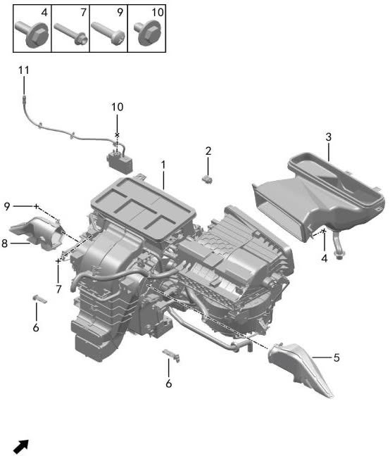

| Поз. | Артикул | Наименование | Кол-во | Системный номер | Примечание |
| ---: | --- | --- | ---: | --- | --- |
| 1 | 810001002 | Блок кондиционера в сборе | 1 | H97A8100001BA | контроль воздуха в салоне: есть |
| 2 | 810011001 | Датчик температуры воздуховода | 1 | H97A8114001AA | контроль воздуха в салоне: нет |
| 3 | 551701001 | Воздуховод впуска кондиционера | 1 | H97A5517010AA |  |
| 4 | Q11001004 | Фланцевый болт | 4 | HQ1840616 |  |
| 5 | 550133001 | Правый воздуховод обдува ног | 1 | H97A5501090AA |  |
| 6 | 810012001 | Датчик качества воздуха | 2 | H97A3602809AA | контроль воздуха в салоне: есть |
| 7 | Q11002003 | Болт | 6 | HQ140B0618L |  |
| 8 | 550132001 | Левый воздуховод обдува ног | 1 | H97A5501085AA |  |
| 9 | Q12002012 | Самонарезающий винт | 2 | Q2724216 |  |
| 10 | Q11002005 | Болт | 1 | HQ140B0816L |  |
| 11 | 360205001 | Датчик PM2.5 | 1 | H97A3602800AA |  |

# 4013-10 Испаритель кондиционера

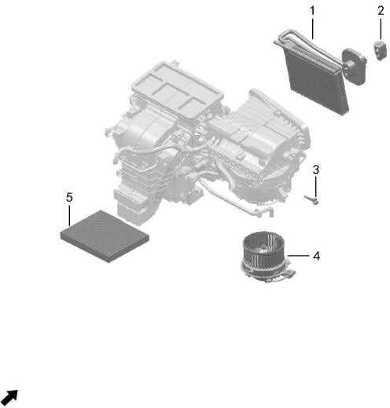

| Поз. | Артикул | Наименование | Кол-во | Системный номер | Примечание |
| ---: | --- | --- | ---: | --- | --- |
| 1 | 810010001 | Сердцевина испарителя | 1 | H97A8100012AA |  |
| 2 | 810007001 | Расширительный клапан | 1 | H97A8100011AA |  |
| 3 | 810006001 | Датчик температуры испарителя | 1 | H97A8100010AA |  |
| 4 | 810005001 | Вентилятор | 1 | H97A8100009AA |  |
| 5 | 810004001 | Фильтрующий элемент кондиционера | 1 | H97A8100008AA |  |

# 4015-10 PTC кондиционера

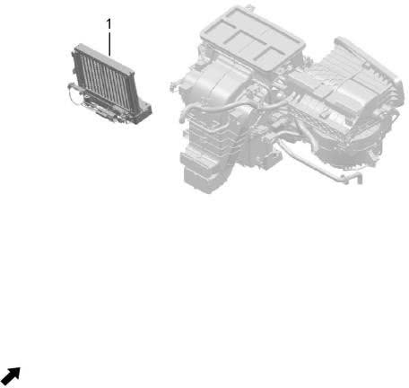

| Поз. | Артикул | Наименование | Кол-во | Системный номер | Примечание |
| ---: | --- | --- | ---: | --- | --- |
| 1 | 810009001 | Блок PTC в сборе | 1 | H97A8115001AA |  |

# 4016-10 Контроллер кондиционера

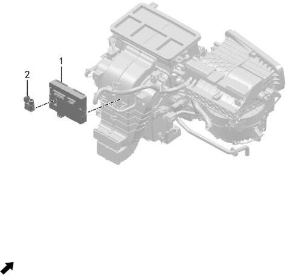

| Поз. | Артикул | Наименование | Кол-во | Системный номер | Примечание |
| ---: | --- | --- | ---: | --- | --- |
| 1 | 810002001 | Контроллер автоматического кондиционера | 1 | H97A3615800AA |  |
| 2 | 811401001 | Датчик температуры салона | 1 | 8114100-RA01 |  |

# 4017-10 Панель управления кондиционером

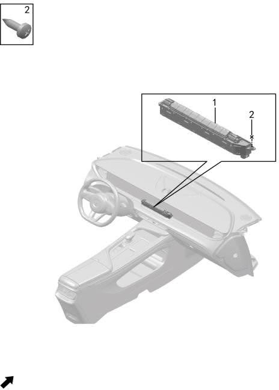

| Поз. | Артикул | Наименование | Кол-во | Системный номер | Примечание |
| ---: | --- | --- | ---: | --- | --- |
| 1 | 373502001 | Панель управления автоматическим кондиционером | 1 | H97A3735001AA |  |
| 2 | Q12002011 | Самонарезающий винт | 2 | Q2714816 |  |

# 4018-10 Ароматизатор

- Описание: N1 опция, N3 стандартно

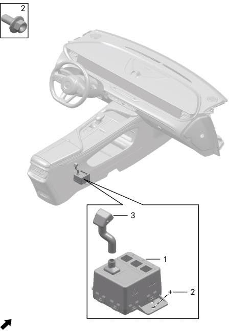

| Поз. | Артикул | Наименование | Кол-во | Системный номер | Примечание |
| ---: | --- | --- | ---: | --- | --- |
| 1 | 810003001 | Ароматизатор | 1 | H97A3615806AA | замена на 810003002 |
| 1 | 810003002 | Ароматизатор | 1 | H97A3615806AB |  |
| 2 | Q11001001 | Фланцевый болт | 3 | HQ1840612 |  |
| 3 | 810008001 | Трубка подачи аромата | 1 | H97A3615827AA |  |

# 4020-10 Подушка безопасности водителя

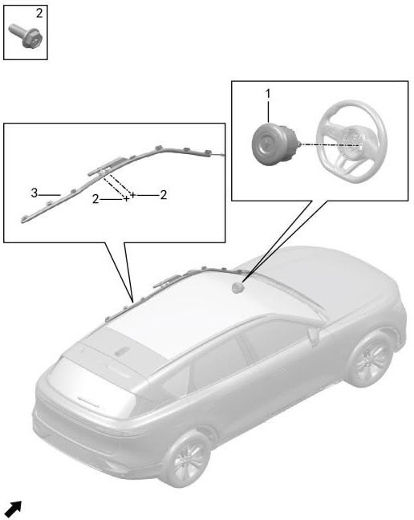

| Поз. | Артикул | Наименование | Кол-во | Системный номер | Примечание |
| ---: | --- | --- | ---: | --- | --- |
| 1 | 823004001BKGA | Подушка безопасности водителя | 1 | H97A8230007AABKGA | черный |
| 1 | 823004001BRGC | Подушка безопасности водителя | 1 | H97A8230007AABRGC | светло-коричневый |
| 1 | 823004001BEGA | Подушка безопасности водителя | 1 | H97A8230007AABEGA | бежевый |
| 2 | Q11002020 | Болт | 2 | HQY1470616T8X1 |  |
| 3 | 823005002 | Левая шторка безопасности | 1 | H97A8230005AB |  |

# 4021-10 Подушка безопасности пассажира

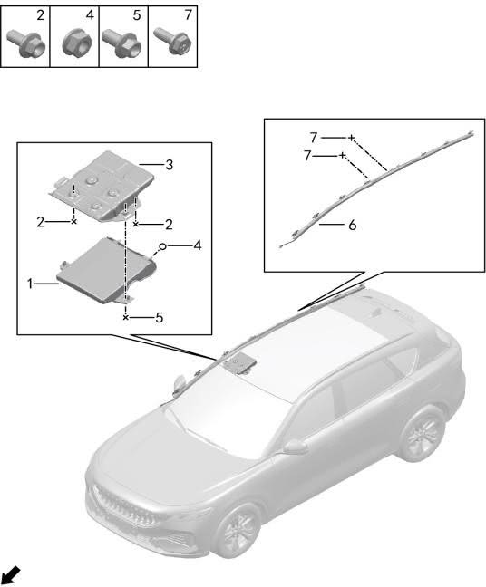

| Поз. | Артикул | Наименование | Кол-во | Системный номер | Примечание |
| ---: | --- | --- | ---: | --- | --- |
| 1 | 823003001 | Подушка безопасности пассажира | 1 | H97A8230006AA | замена на 823003002 |
| 1 | 823003002 | Подушка безопасности пассажира | 1 | H97A8230006AB |  |
| 2 | Q11001001 | Фланцевый болт | 5 | HQ1840612 |  |
| 3 | 570001001 | Кронштейн пассажирской подушки | 1 | H97A5700030AB |  |
| 4 | Q21001004 | Фланцевая гайка | 2 | HQ32008 |  |
| 5 | Q11001015 | Фланцевый болт | 1 | HQ1840816 |  |
| 6 | 823006002 | Правая шторка безопасности | 1 | H97A8230010AB |  |
| 7 | Q11002020 | Болт | 2 | HQY1470616T8X1 |  |

# 4024-10 Передние ремни безопасности

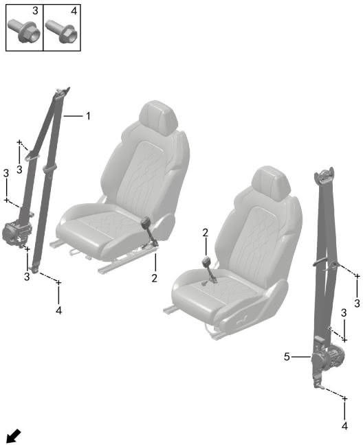

| Поз. | Артикул | Наименование | Кол-во | Системный номер | Примечание |
| ---: | --- | --- | ---: | --- | --- |
| 1 | 821204001 | Правый передний ремень безопасности | 1 | H97A8212010AA | замена на 821204003 |
| 1 | 821204003 | Правый передний ремень безопасности | 1 | H97A8212010AB | замена на 821204005 |
| 1 | 821204005 | Правый передний ремень безопасности | 1 | H97A8212010AC | обычная серийная версия |
| 1 | 821204002 | Правый передний ремень безопасности | 1 | H97A8212010BA | замена на 821204004 |
| 1 | 821204004 | Правый передний ремень безопасности | 1 | H97A8212010BB | замена на 821204006 |
| 1 | 821204006 | Правый передний ремень безопасности | 1 | H97A8212010BC | стартовая специальная версия |
| 2 | 821206002 | Замок переднего ремня безопасности | 2 | H97A8212007AB |  |
| 3 | Q11001001 | Фланцевый болт | 6 | HQ1840612 |  |
| 4 | Q11002035 | Болт | 2 | HQY71625 |  |
| 5 | 821203001 | Левый передний ремень безопасности | 1 | H97A8212005AA | замена на 821203003 |
| 5 | 821203003 | Левый передний ремень безопасности | 1 | H97A8212005AB | замена на 821203005 |
| 5 | 821203005 | Левый передний ремень безопасности | 1 | H97A8212005AC | обычная серийная версия |
| 5 | 821203002 | Левый передний ремень безопасности | 1 | H97A8212005BA | замена на 821203004 |
| 5 | 821203004 | Левый передний ремень безопасности | 1 | H97A8212005BB | замена на 821203006 |
| 5 | 821203006 | Левый передний ремень безопасности | 1 | H97A8212005BC | стартовая специальная версия |

# 4027-10 Задние ремни безопасности

| Поз. | Артикул | Наименование | Кол-во | Системный номер | Примечание |
| ---: | --- | --- | ---: | --- | --- |
| 1 | 821201003 | Боковой ремень безопасности второго ряда | 2 | H97A8212001AB |  |
| 2 | Q11002035 | Болт | 4 | HQY71625 |  |
| 3 | 821202003 | Центральный ремень безопасности второго ряда | 1 | H97A8212003AB |  |
| 4 | 821207001 | Одинарная задняя пряжка ремня безопасности | 1 | H97A8212011AA |  |
| 5 | 821208001 | Двойная задняя пряжка ремня безопасности | 1 | H97A8212012AA |  |

# 4027-11 Задние ремни безопасности

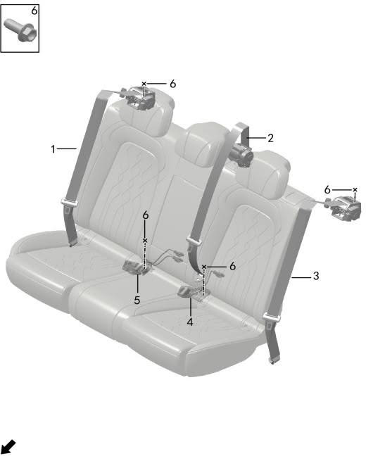

| Поз. | Артикул | Наименование | Кол-во | Системный номер | Примечание |
| ---: | --- | --- | ---: | --- | --- |
| 1 | 821211001 | Правый ремень безопасности второго ряда | 1 | H97A8212002BB |  |
| 2 | 821202004 | Центральный ремень безопасности второго ряда | 1 | H97A8212003BB |  |
| 3 | 821210002 | Левый ремень безопасности второго ряда | 1 | H97A8212009BB |  |
| 4 | 821207001 | Одинарная задняя пряжка ремня безопасности | 1 | H97A8212011AA |  |
| 5 | 821208001 | Двойная задняя пряжка ремня безопасности | 1 | H97A8212012AA |  |
| 6 | Q11002035 | Болт | 4 | HQY71625 |  |

# 4028-10 Регулятор высоты

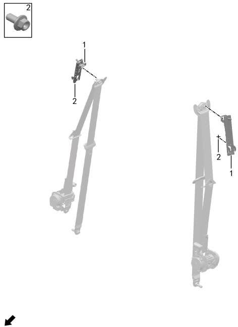

| Поз. | Артикул | Наименование | Кол-во | Системный номер | Примечание |
| ---: | --- | --- | ---: | --- | --- |
| 1 | 821205002 | Регулятор высоты ремня безопасности | 2 | H97A8212004AB |  |
| 2 | Q11001001 | Фланцевый болт | 6 | HQ1840612 |  |

# 4030-10 Передний датчик столкновения

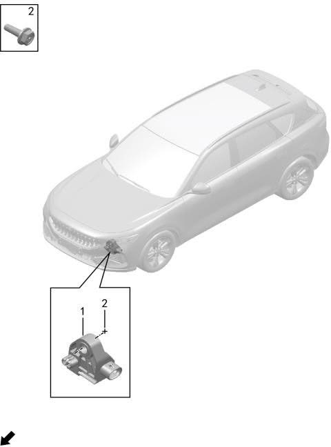

| Поз. | Артикул | Наименование | Кол-во | Системный номер | Примечание |
| ---: | --- | --- | ---: | --- | --- |
| 1 | 360201001 | Передний датчик столкновения | 2 | H973602001 |  |
| 2 | Q11002021 | Болт | 4 | HQY1470620T8X1 |  |

# 4031-10 Боковые датчики столкновения

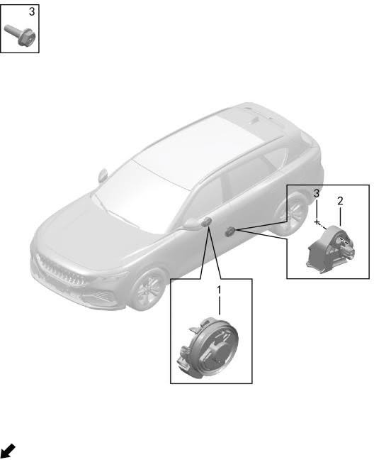

| Поз. | Артикул | Наименование | Кол-во | Системный номер | Примечание |
| ---: | --- | --- | ---: | --- | --- |
| 1 | 360203001 | Датчик давления двери | 2 | H973602003 |  |
| 2 | 360202001 | Боковой датчик столкновения | 2 | H973602002 |  |
| 3 | Q11002021 | Болт | 4 | HQY1470620T8X1 |  |

# 4034-10 Блок управления подушками безопасности

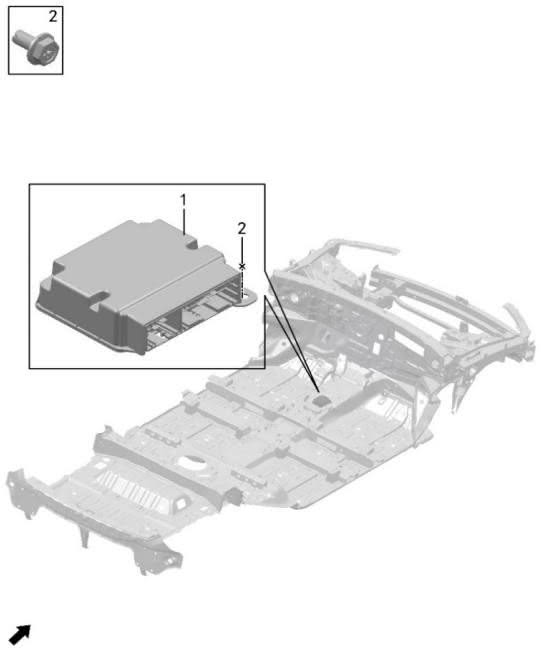

| Поз. | Артикул | Наименование | Кол-во | Системный номер | Примечание |
| ---: | --- | --- | ---: | --- | --- |
| 1 | 360701001 | Электронный блок управления подушками безопасности | 1 | H97A3607800AA |  |
| 2 | Q11002018 | Болт | 3 | HQY1470612T8X1 |  |
