- [2010-10 Топливный бак](#2010-10-топливный-бак)
- [2011-10 Топливоподача](#2011-10-топливоподача)
- [2012-10 Система улавливания паров топлива](#2012-10-система-улавливания-паров-топлива)
- [2013-10 Топливная рампа и форсунки](#2013-10-топливная-рампа-и-форсунки)
- [2014-10 Воздушный фильтр](#2014-10-воздушный-фильтр)
- [2015-10 Свечи и катушки зажигания](#2015-10-свечи-и-катушки-зажигания)
- [2016-10 Ремень и натяжитель](#2016-10-ремень-и-натяжитель)
- [2017-10 Генератор](#2017-10-генератор)
- [2019-10 Электронные компоненты двигателя](#2019-10-электронные-компоненты-двигателя)
- [2020-10 Горячая часть выхлопа](#2020-10-горячая-часть-выхлопа)
- [2021-10 Интеркулер](#2021-10-интеркулер)
- [2022-10 Турбонагнетатель](#2022-10-турбонагнетатель)
- [2023-10 Впускной и выпускной коллекторы](#2023-10-впускной-и-выпускной-коллекторы)
- [2024-10 Впускной тракт](#2024-10-впускной-тракт)
- [2025-10 Глушитель](#2025-10-глушитель)
- [2027-10 Радиатор](#2027-10-радиатор)
- [2027-11 Радиатор](#2027-11-радиатор)
- [2029-10 Передние трубопроводы охлаждения](#2029-10-передние-трубопроводы-охлаждения)
- [2029-11 Передние трубопроводы охлаждения](#2029-11-передние-трубопроводы-охлаждения)
- [2029-12 Передние трубопроводы охлаждения](#2029-12-передние-трубопроводы-охлаждения)
- [2029-13 Передние трубопроводы охлаждения](#2029-13-передние-трубопроводы-охлаждения)
- [2030-10 Задние трубопроводы охлаждения](#2030-10-задние-трубопроводы-охлаждения)
- [2030-11 Задние трубопроводы охлаждения](#2030-11-задние-трубопроводы-охлаждения)
- [2031-10 Вентилятор охлаждения](#2031-10-вентилятор-охлаждения)
- [2031-11 Вентилятор охлаждения](#2031-11-вентилятор-охлаждения)
- [2032-10 Водяной насос](#2032-10-водяной-насос)
- [2033-10 Система термостатирования батареи](#2033-10-система-термостатирования-батареи)
- [2033-11 Система термостатирования батареи](#2033-11-система-термостатирования-батареи)
- [2034-10 Расширительный бачок](#2034-10-расширительный-бачок)
- [2034-11 Расширительный бачок](#2034-11-расширительный-бачок)
- [2034-12 Расширительный бачок](#2034-12-расширительный-бачок)
- [2034-13 Расширительный бачок](#2034-13-расширительный-бачок)

# 2010-10 Топливный бак

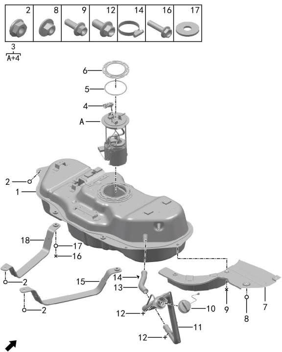

| Поз. | Артикул | Наименование | Кол-во | Системный номер | Примечание |
| ---: | --- | --- | ---: | --- | --- |
| 1 | 110100001 | Топливный бак | 1 | 1101600-RA51 |  |
| 2 | Q21001006 | Фланцевая гайка | 3 | HQ32010T10L1 |  |
| 3 | 110610001 | Электрический топливный насос | 1 | H97A1106001AA |  |
| 4 | 110140001 | Датчик давления топлива | 1 | 1101400-RA52 | замена на 110140002 |
| 4 | 110140002 | Датчик давления топлива | 1 | H56A1106004AA |  |
| 5 | 110601001 | Уплотнительное кольцо топливного насоса | 1 | 1106102-RA51 |  |
| 6 | 110602001 | Прижимная пластина топливного насоса | 1 | 1106012-RA51 |  |
| 7 | 110300001 | Теплозащитный экран бака | 1 | H97A1103009AA |  |
| 8 | Q21008004 | Шестигранная гайка | 2 | HQ32206L1L |  |
| 9 | Q11001005 | Фланцевый болт | 2 | HQ1840616L1 |  |
| 10 | 110167051 | Крышка топливного бака | 1 | H97A1103001AA |  |
| 11 | 110407000 | Заливная топливная труба | 1 | H97A1104007AA | замена на 110407001 |
| 11 | 110407001 | Заливная топливная труба | 1 | H97A1104007AB |  |
| 12 | Q11001016 | Фланцевый болт | 3 | HQ1840816L1 |  |
| 13 | 110404001 | Шланг заливной топливной трубы | 1 | H97A1104004AA | замена на 110404002 |
| 13 | 110404002 | Шланг заливной топливной трубы | 1 | H97A1104004AB |  |
| 14 | Q31002002 | Хомут | 2 | Q67640 |  |
| 15 | 110101001 | Крепежная лента топливного бака | 1 | 1101910-RA51 |  |
| 16 | Q11001072 | Фланцевый болт | 2 | HQ1861040T10L1 |  |
| 17 | Q22001004 | Шайба | 2 | Q402B10F61 |  |
| 18 | 110101002 | Крепежная лента топливного бака | 1 | 1101920-RA51 |  |

# 2011-10 Топливоподача

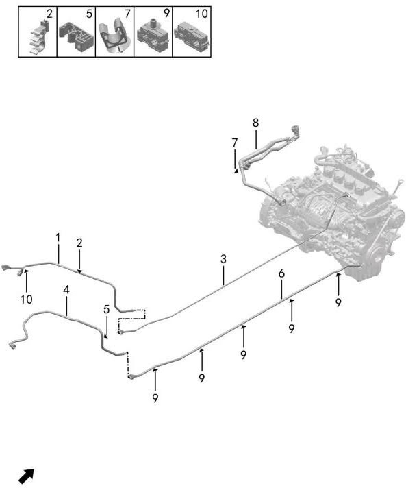

| Поз. | Артикул | Наименование | Кол-во | Системный номер | Примечание |
| ---: | --- | --- | ---: | --- | --- |
| 1 | 110400002 | Подающая топливная трубка | 1 | H97A1104008AB |  |
| 2 | 110403001 | Зажим топливной трубки | 1 | 1104235-RA51 | замена на 110403002 |
| 2 | 110403002 | Зажим топливной трубки | 1 | H97A1104024AA |  |
| 3 | 110400001 | Подающая топливная трубка | 1 | H97A1104002AA |  |
| 4 | 110401002 | Трубка продувки адсорбера | 1 | H97A1174002AB |  |
| 5 | 110422002 | Двойной зажим трубки | 1 | 1104231-RA51 |  |
| 6 | 110401001 | Трубка продувки адсорбера | 1 | H97A1174001AA |  |
| 7 | 110423001 | Одинарный зажим топливной трубки | 1 | 1104234-RA51 |  |
| 8 | 110402000 | Трубка высокого давления продувки | 1 | 1104300-RA52 |  |
| 9 | 110422000 | Двойной зажим трубки | 5 | 1104221-RA51 |  |
| 10 | 110422001 | Двойной зажим трубки | 1 | 1104222-RA51 | замена на 110422003 |
| 10 | 110422003 | Двойной зажим трубки | 1 | H56A1104023AA |  |

# 2012-10 Система улавливания паров топлива

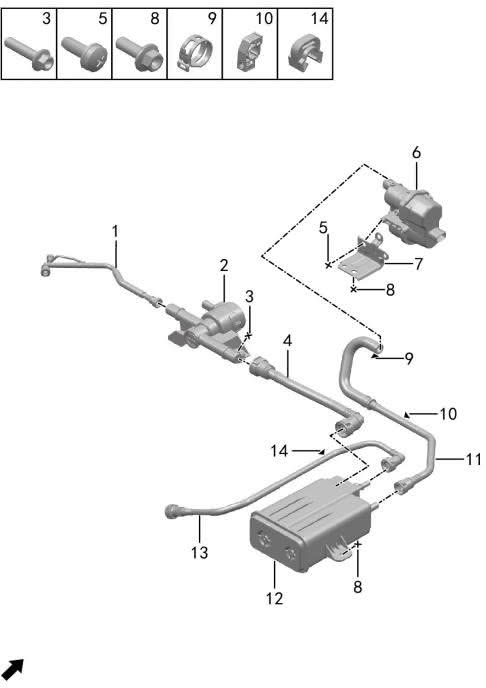

| Поз. | Артикул | Наименование | Кол-во | Системный номер | Примечание |
| ---: | --- | --- | ---: | --- | --- |
| 1 | 110418051 | Трубка паров топлива | 1 | 1104180-RA51 |  |
| 2 | 111600001 | Изолирующий клапан бака | 1 | H97A1116001AA |  |
| 3 | Q11001011 | Фланцевый болт | 2 | HQ1840625L1 |  |
| 4 | 110107001 | Направляющая изолирующего клапана бака | 1 | 1101791-RA51 |  |
| 5 | Q12002001 | Самонарезающий винт | 3 | Q220B4813F38A |  |
| 6 | 110103001 | Модуль диагностики утечки бака | 1 | 1101780-RA52 | замена на 110103002 |
| 6 | 110103002 | Модуль диагностики утечки бака | 1 | H56A1116002AA |  |
| 7 | 110104001 | Кронштейн диагностического модуля | 1 | H97A1101001AA |  |
| 8 | Q11001005 | Фланцевый болт | 7 | HQ1840616L1 |  |
| 9 | Q31001005 | Зажим трубки | 1 | Q673C23F61 |  |
| 10 | 110423003 | Одинарный зажим топливной трубки | 1 | 1104234-RA53 | замена на 110423004 |
| 10 | 110423004 | Одинарный зажим топливной трубки | 1 | H56A1104013AA |  |
| 11 | 110105001 | Воздуховод | 1 | 1101730-RA51 |  |
| 12 | 110106001 | Адсорбер | 1 | 1101700-RA51 |  |
| 13 | 110401000 | Трубка продувки адсорбера | 1 | 1104211-RA51 |  |
| 14 | 110423002 | Одинарный зажим топливной трубки | 1 | 1104234-RA52 |  |

# 2013-10 Топливная рампа и форсунки

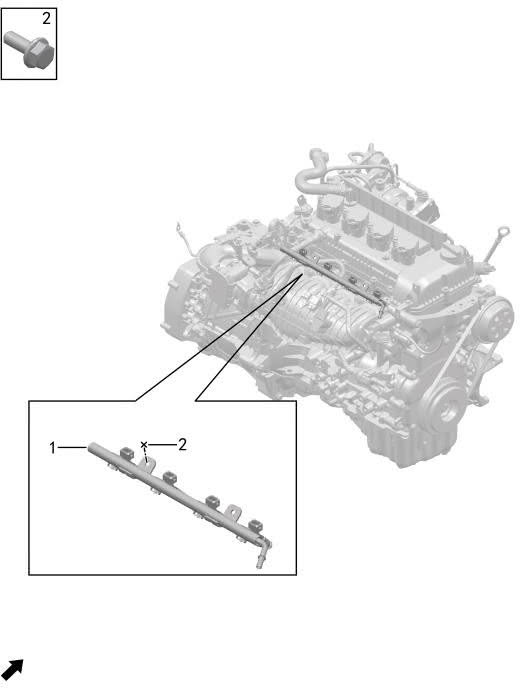

| Поз. | Артикул | Наименование | Кол-во | Системный номер | Примечание |
| ---: | --- | --- | ---: | --- | --- |
| 1 | 361401001 | Топливная рампа | 1 | 3614100-F07-00 |  |
| 2 | Q11001083 | Фланцевый болт | 2 | Q1860616F36 | M6×16 |

# 2014-10 Воздушный фильтр

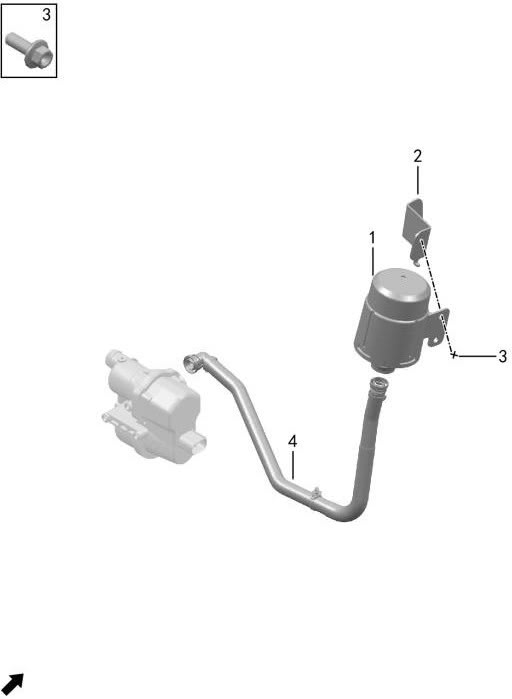

| Поз. | Артикул | Наименование | Кол-во | Системный номер | Примечание |
| ---: | --- | --- | ---: | --- | --- |
| 1 | 110102001 | Воздушный фильтр | 1 | 1101731-RA52 |  |
| 2 | 110500001 | Кронштейн воздушного фильтра | 1 | H97A1105002AA |  |
| 3 | Q11001005 | Фланцевый болт | 7 | HQ1840616L1 |  |
| 4 | 110406001 | Воздуховод воздушного фильтра | 1 | H97A1104006AA |  |

# 2015-10 Свечи и катушки зажигания

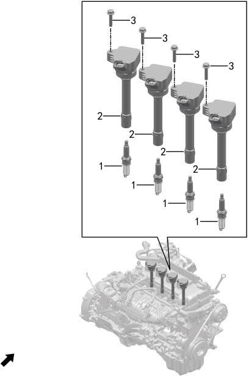

| Поз. | Артикул | Наименование | Кол-во | Системный номер | Примечание |
| ---: | --- | --- | ---: | --- | --- |
| 1 | 370701001 | Свеча зажигания | 4 | 3707200-F00-00A |  |
| 2 | 370501001 | Катушка зажигания | 4 | 3705100-F07-00 |  |
| 3 | Q11001086 | Фланцевый болт | 4 | Q1860630F36 | M6×30 |

# 2016-10 Ремень и натяжитель

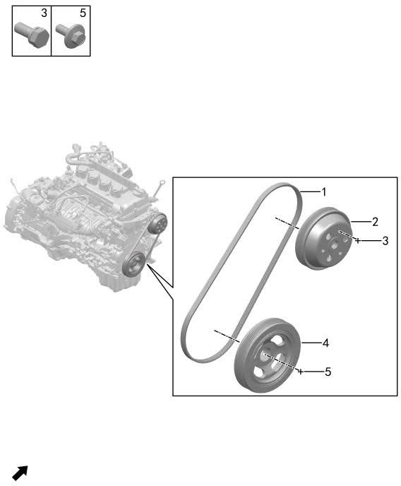

| Поз. | Артикул | Наименование | Кол-во | Системный номер | Примечание |
| ---: | --- | --- | ---: | --- | --- |
| 1 | 102303001 | Водяной насос ремень | 1 | 1025004-F08-00 |  |
| 2 | 102302001 | Водяной насос шкив | 1 | 1025001-F08-00 |  |
| 3 | Q11002012 | Болт | 3 | Q1420820F36 | M8×20 |
| 4 | 102301002 | Активный шкив | 1 | 1025100-F08-00A |  |
| 5 | 101515001 | Активный шкив болт | 1 | 1015246-F00-16 |  |

# 2017-10 Генератор

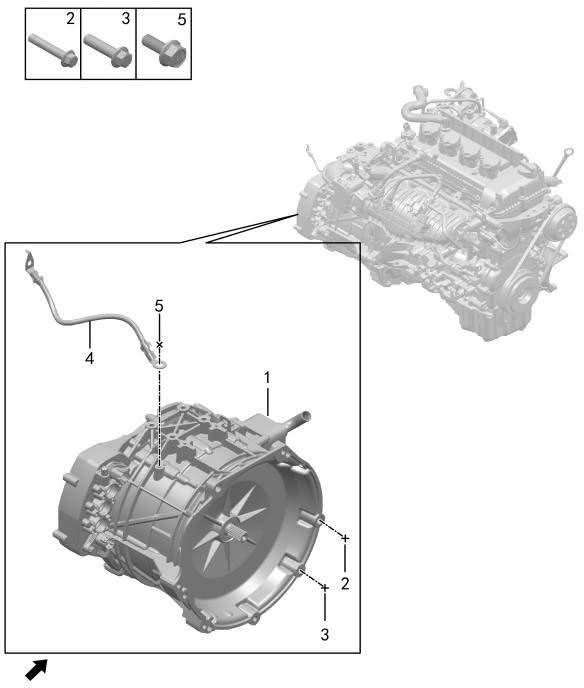

| Поз. | Артикул | Наименование | Кол-во | Системный номер | Примечание |
| ---: | --- | --- | ---: | --- | --- |
| 1 | 101506002 | Генератор | 1 | 2100100-F08-12 |  |
| 2 | Q11001064 | Фланцевый болт | 2 | Q1851045TF61 | M10×1.25×45 |
| 3 | Q11001062 | Фланцевый болт | 5 | Q1851040TF61 | M10×1.25×40 |
| 4 | 101517001 | Провод массы генератора | 1 | 4001200-F00-16A |  |
| 5 | Q11001035 | Фланцевый болт | 2 | Q1840816F36 | M8×16 |

# 2019-10 Электронные компоненты двигателя

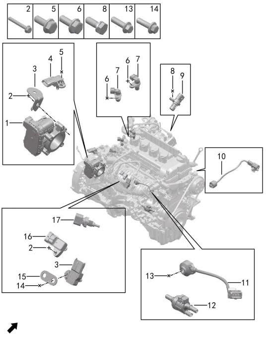

| Поз. | Артикул | Наименование | Кол-во | Системный номер | Примечание |
| ---: | --- | --- | ---: | --- | --- |
| 1 | 361107001 | Электронный дроссельный узел | 1 | 3765100-F07-00 |  |
| 2 | Q11001088 | Фланцевый болт | 4 | Q1860650F36 | M6×50 |
| 3 | 101511001 | Кронштейн электронной дроссельной заслонки | 1 | 101502X-F08-01 |  |
| 4 | 361102001 | Датчик давления и температуры впуска | 2 | 3611500-DA03-00 |  |
| 5 | Q11001031 | Фланцевый болт | 1 | Q1840616F36 | M6×16 |
| 6 | Q11001083 | Фланцевый болт | 3 | Q1860616F36 | M6×16 |
| 7 | 375201001 | Датчик положения распредвала | 2 | 3752020-D15-02 |  |
| 8 | Q11002011 | Болт | 1 | Q1420616F36 | M6×16 |
| 9 | 361106001 | Датчик положения коленвала | 1 | 3611900-E21-01 |  |
| 10 | 361104001 | Датчик давления масла | 1 | 3611600-E01-00C |  |
| 11 | 361105001 | Датчик детонации | 1 | 3611600-H03-00 |  |
| 12 | 113001001 | Клапан адсорбера | 1 | 1130100-H03-00 |  |
| 13 | Q11001039 | Фланцевый болт | 1 | Q1840828F36 | M8×28 |
| 14 | Q11001032 | Фланцевый болт | 1 | Q1840620F36 | M6×20 |
| 15 | 100011001 | Кронштейн жгута клапана OCV | 1 | 1000378-B09-00 |  |
| 16 | 361103001 | Датчик атмосферного давления | 1 | 3611500-F00-00 |  |
| 17 | 361101001 | Датчик температуры охлаждающей жидкости | 2 | 3611200-B11-00 |  |

# 2020-10 Горячая часть выхлопа

- Описание: версия с рендж-экстендером (ДВС)

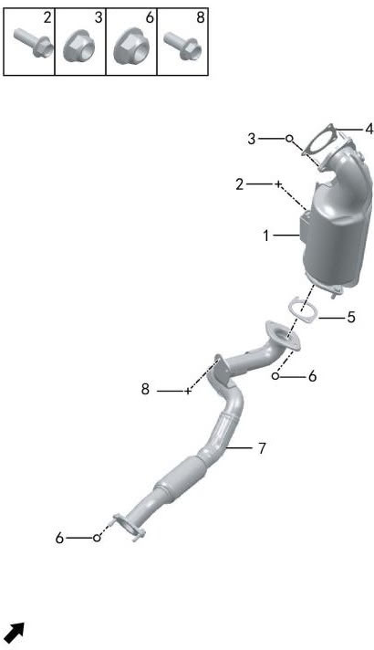

| Поз. | Артикул | Наименование | Кол-во | Системный номер | Примечание |
| ---: | --- | --- | ---: | --- | --- |
| 1 | 120500000 | Каталитический нейтрализатор в сборе | 1 | H97A1205003AA |  |
| 2 | Q11001045 | Фланцевый болт | 1 | HQ1851030T10L1 |  |
| 3 | Q21002005 | Стопорная гайка | 2 | HQ32410T10L1U |  |
| 4 | 120513000 | Прокладка каталитического нейтрализатора | 1 | 1201130-RA51 |  |
| 5 | 120513001 | Прокладка каталитического нейтрализатора | 1 | 1201130-RA52 |  |
| 6 | Q21002005 | Стопорная гайка | 4 | HQ32410T10L1U |  |
| 7 | 120517000 | Гофрированная труба в сборе | 1 | 1201170-RA53 |  |
| 8 | Q11001094 | Фланцевый болт | 2 | HQ1851020N1 |  |

# 2021-10 Интеркулер

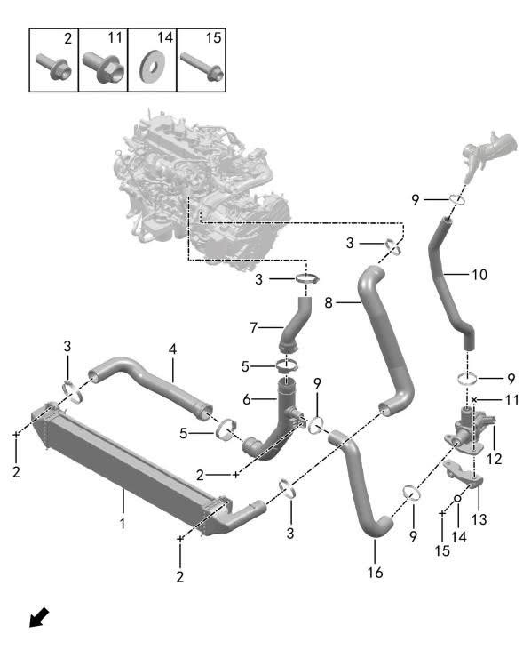

| Поз. | Артикул | Наименование | Кол-во | Системный номер | Примечание |
| ---: | --- | --- | ---: | --- | --- |
| 1 | 111910000 | Интеркулер | 1 | 1119100-RA52 |  |
| 2 | Q11001005 | Фланцевый болт | 3 | HQ1840616L1 |  |
| 3 | Q31002003 | Хомут | 4 | Q67660 |  |
| 4 | 111912000 | Впускной шланг центрального охладителя | 1 | 1119121-RA52 |  |
| 5 | Q31002003 | Хомут | 2 | Q67660 |  |
| 6 | 111913001 | Впускная трубка центрального охладителя | 1 | 1119122-RA52 |  |
| 7 | 111912001 | Впускной шланг центрального охладителя | 1 | 1119123-RA52 |  |
| 8 | 111900001 | Выходной шланг центрального охладителя | 1 | H97A1119004AA |  |
| 9 | Q31002002 | Хомут | 4 | Q67640 |  |
| 10 | 111901001 | Выходной шланг клапана сброса давления | 1 | H97A1119005AA |  |
| 11 | Q11001016 | Фланцевый болт | 2 | HQ1840816L1 |  |
| 12 | 360001001 | Клапан RCV в сборе | 1 | 3600400-RA52 |  |
| 13 | 280101001 | Кронштейн клапана RCV | 1 | H97A2801007AA |  |
| 14 | Q22001003 | Шайба | 2 | Q402B08F61 |  |
| 15 | Q11001025 | Фланцевый болт | 2 | HQ1840840L1 |  |
| 16 | 111902001 | Впускной шланг клапана сброса давления | 1 | H97A1119006AA |  |

# 2022-10 Турбонагнетатель

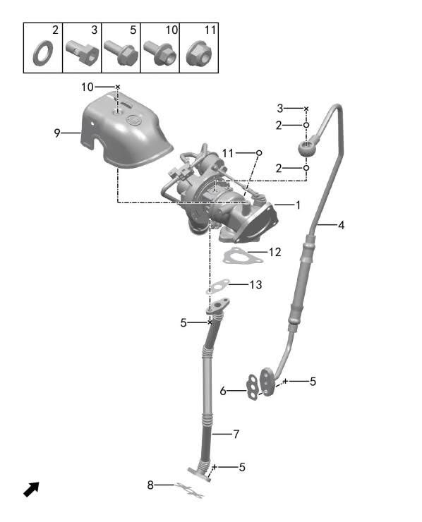

| Поз. | Артикул | Наименование | Кол-во | Системный номер | Примечание |
| ---: | --- | --- | ---: | --- | --- |
| 1 | 111803001 | Турбонагнетатель | 1 | 1118100-F00-00C |  |
| 2 | 111806001 | Медная шайба | 2 | 1118008-F00-00 |  |
| 3 | 111809001 | Масляный болт турбокомпрессора | 1 | 1118002-F00-00 |  |
| 4 | 100905001 | Трубка подачи масла турбонагнетателя | 1 | 1009060-F00-00 |  |
| 5 | Q11001083 | Фланцевый болт | 6 | Q1860616F36 | M6×16 |
| 6 | 130014001 | Входная масляная трубка прокладка | 1 | 1300018-F00-00 |  |
| 7 | 100906001 | Трубка слива масла турбонагнетателя | 1 | 1009070-F00-00 |  |
| 8 | 130012001 | Обратная масляная трубка прокладка | 1 | 1300021-F00-00 |  |
| 9 | 111801001 | Теплозащитный кожух турбонагнетателя | 1 | 1118110-RA52 |  |
| 10 | Q11001001 | Фланцевый болт | 3 | HQ1840612 |  |
| 11 | 111807001 | Турбокомпрессор гайка | 1 | 1118009-F00-00 |  |
| 12 | 111802001 | Прокладка впускного патрубка турбокомпрессора | 1 | 1118004-F00-00B |  |
| 13 | 130012002 | Обратная масляная трубка прокладка | 1 | 1300019-F00-00 |  |

# 2023-10 Впускной и выпускной коллекторы

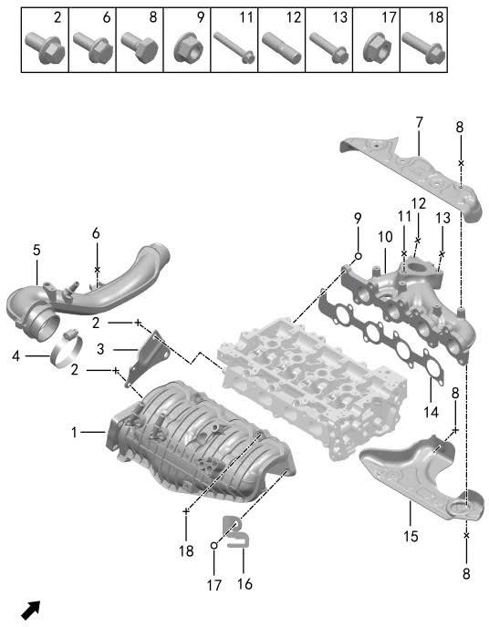

| Поз. | Артикул | Наименование | Кол-во | Системный номер | Примечание |
| ---: | --- | --- | ---: | --- | --- |
| 1 | 100802001 | Впускной коллектор | 1 | 1008100-F08-01 |  |
| 2 | Q11001035 | Фланцевый болт | 4 | Q1840816F36 | M8×16 |
| 3 | 101501001 | Кронштейн впускного коллектора | 1 | 101501F-F00-00 |  |
| 4 | Q31002004 | Хомут | 1 | Q67676F36 |  |
| 5 | 100801001 | Впускная труба | 1 | 1008001-F08-01 |  |
| 6 | Q11001083 | Фланцевый болт | 2 | Q1860616F36 | M6×16 |
| 7 | 100807001 | Верхний теплоэкран | 1 | 1008240-F00-00 |  |
| 8 | Q11002010 | Болт | 7 | Q140B0612F36 | M6×12 |
| 9 | 100806001 | Гайка выпускного коллектора | 9 | 1008215-F00-00 |  |
| 10 | 100803001 | Выпускной коллектор | 1 | 1008200-F00-00 |  |
| 11 | 111805001 | Турбокомпрессор болт | 1 | 1118001-F00-00 |  |
| 12 | 111804001 | Шпилька турбонагнетателя | 1 | 1118006-F00-00 |  |
| 13 | 111805002 | Турбокомпрессор болт | 1 | 1118012-F00-00 |  |
| 14 | 100804001 | Прокладка выпускного коллектора | 1 | 1008210-E01-00 |  |
| 15 | 100808001 | Нижний теплоэкран | 1 | 1008250-F00-00 |  |
| 16 | 101502003 | Кронштейн | 1 | 101502G-F08-12 |  |
| 17 | Q21001009 | Фланцевая гайка | 2 | Q32008T13F36 | M8 |
| 18 | Q11001040 | Фланцевый болт | 3 | Q1840830F36 | M8×30 |

# 2024-10 Впускной тракт

- Описание: версия с рендж-экстендером (ДВС)

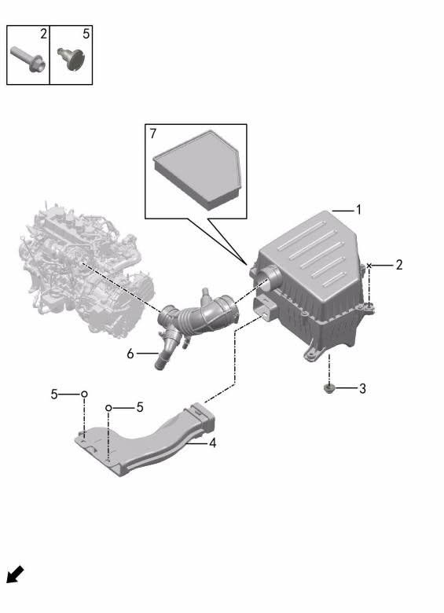

| Поз. | Артикул | Наименование | Кол-во | Системный номер | Примечание |
| ---: | --- | --- | ---: | --- | --- |
| 1 | 110910000 | Воздушный фильтр в сборе | 1 | H97A1109003AA |  |
| 2 | Q11001021 | Фланцевый болт | 2 | HQ1840830L1 |  |
| 3 | 110913000 | Резиновая опора воздушного фильтра | 1 | 1109132-RA52 |  |
| 4 | 110915000 | Впускная труба воздушного фильтра | 1 | 1109150-RA52 |  |
| 5 | Q41001001 | Клипса | 2 | 09406-08301 |  |
| 6 | 110919000 | Выходная труба воздушного фильтра | 1 | 1109190-RA52 |  |
| 7 | 110901000 | Фильтрующий элемент воздушного фильтра | 1 | 1109120-RA52 |  |

# 2025-10 Глушитель

- Описание: версия с рендж-экстендером (ДВС)

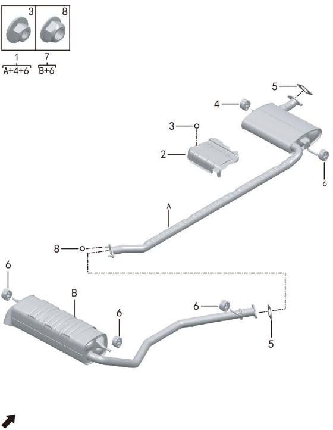

| Поз. | Артикул | Наименование | Кол-во | Системный номер | Примечание |
| ---: | --- | --- | ---: | --- | --- |
| 1 | 120100000 | Передний глушитель | 1 | H97A1201005AA |  |
| 2 | 120102000 | Теплозащитный экран глушителя | 1 | H97A1201011AA |  |
| 3 | Q21008004 | Шестигранная гайка | 3 | HQ32206L1L |  |
| 4 | 120115002 | Подвес | 1 | H97A1201016AB |  |
| 5 | 120114000 | Прокладка глушителя | 2 | 1201140-RA51 |  |
| 6 | 120115001 | Подвес | 4 | H97A1201016AA |  |
| 7 | 120101001 | Задний глушитель | 1 | H97A1201010AA |  |
| 8 | Q21002005 | Стопорная гайка | 4 | HQ32410T10L1U |  |

# 2027-10 Радиатор

- Описание: версия с рендж-экстендером (ДВС)

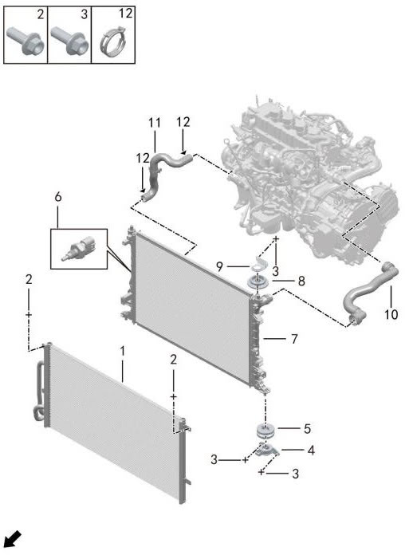

| Поз. | Артикул | Наименование | Кол-во | Системный номер | Примечание |
| ---: | --- | --- | ---: | --- | --- |
| 1 | 130101001 | Низкотемпературный радиатор | 1 | H97A1301001AA |  |
| 2 | Q11001005 | Фланцевый болт | 2 | HQ1840616L1 |  |
| 3 | Q11001011 | Фланцевый болт | 8 | HQ1840625L1 |  |
| 4 | 130201001 | Нижний кронштейн радиатора | 2 | 1302033-RA51 |  |
| 5 | 130202002 | Втулка радиатора | 2 | 1302020-RA51 |  |
| 6 | 100019001 | Датчик температуры охлаждающей жидкости радиатора | 1 | H97A1000003AA |  |
| 7 | 130102001 | Радиатор | 1 | H97A1301002AA |  |
| 8 | 130202001 | Втулка радиатора | 2 | 1302040-FA01 |  |
| 9 | 130204002 | Верхний кронштейн радиатора | 2 | H97A1301007AA |  |
| 10 | 130342001 | Входная трубка охлаждения радиатора | 1 | 1303010-RA52 |  |
| 11 | 130343001 | Выходная трубка охлаждения радиатора | 1 | H97A1303009AA |  |
| 12 | Q31001013 | Зажим трубки | 2 | Q673C40 | замена на Q31001014 |
| 12 | Q31001014 | Зажим трубки | 2 | Q673C40F61 |  |

# 2027-11 Радиатор

- Описание: электрическая версия

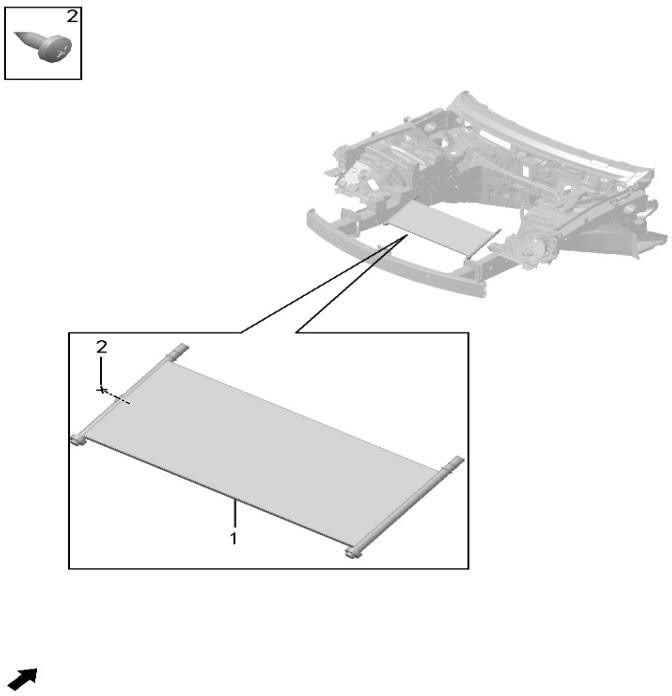

| Поз. | Артикул | Наименование | Кол-во | Системный номер | Примечание |
| ---: | --- | --- | ---: | --- | --- |
| 1 | 130101000 | Низкотемпературный радиатор | 1 | 1301120-RA01 |  |
| 2 | Q12002010 | Самонарезающий винт | 1 | Q2714813 |  |

# 2029-10 Передние трубопроводы охлаждения

- Описание: охлаждение переднего электродвигателя, версия с рендж-экстендером (ДВС), задний привод

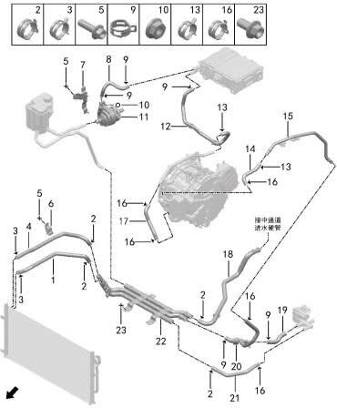

| Поз. | Артикул | Наименование | Кол-во | Системный номер | Примечание |
| ---: | --- | --- | ---: | --- | --- |
| 1 | 130330001 | Выпускной патрубок низкотемпературного радиатора | 1 | H97A1303015AA |  |
| 2 | Q31001010 | Зажим трубки | 5 | Q673C26F62B |  |
| 3 | Q31001012 | Зажим трубки | 2 | Q673C27F62K |  |
| 4 | 130316002 | Впускной патрубок низкотемпературного радиатора | 1 | H97A1303016AA | замена на 130316003 |
| 4 | 130316003 | Впускной патрубок низкотемпературного радиатора | 1 | H97A1303016AB |  |
| 5 | Q11001009 | Фланцевый болт | 1 | HQ1840620L1 |  |
| 6 | 130305005 | Зажим водяной трубки | 1 | H97A1300034AA |  |
| 7 | 130707001 | Кронштейн насоса | 1 | H97A1307015AA |  |
| 8 | 130333001 | Впускной патрубок контроллера расширителя хода | 1 | H97A1303013AB |  |
| 9 | Q31001011 | Зажим трубки | 5 | Q673C27F62 |  |
| 10 | Q21001002 | Фланцевая гайка | 2 | HQ32006 |  |
| 11 | 130704003 | Водяной насос в сборе | 1 | H97A1307001CA |  |
| 12 | 130334001 | Выпускной патрубок контроллера расширителя хода | 1 | H97A1303118AA |  |
| 13 | Q31001009 | Зажим трубки | 2 | Q673C24F62K |  |
| 14 | 130336001 | Выпускной патрубок генератора | 1 | 1303183-RA52 |  |
| 15 | 130331001 | Выходная трубка охлаждения двигателя | 1 | H97A1303011AA |  |
| 16 | Q31001006 | Зажим трубки | 5 | Q673C23F62B |  |
| 17 | 130335001 | Входная трубка охлаждения генератора | 1 | 1303181-RA52 |  |
| 18 | 130340001 | Мягкий выпускной патрубок центрального канала | 1 | H97A1303008AA |  |
| 19 | 130347001 | Задняя секция выходной трубки охлаждения генератора | 1 | H97A1303017BA |  |
| 20 | 130336002 | Выпускной патрубок генератора | 1 | H97A1303017AB |  |
| 21 | 130346001 | Задняя секция выпускного патрубка радиатора | 1 | 1301022-RA52 |  |
| 22 | 130329001 | Трубка охлаждения в сборе | 1 | H97A1303036AA |  |
| 23 | Q11001016 | Фланцевый болт | 4 | HQ1840816L1 |  |

# 2029-11 Передние трубопроводы охлаждения

- Описание: охлаждение переднего электродвигателя, версия с рендж-экстендером (ДВС), полный привод

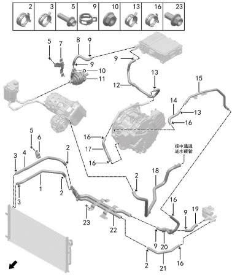

| Поз. | Артикул | Наименование | Кол-во | Системный номер | Примечание |
| ---: | --- | --- | ---: | --- | --- |
| 1 | 130330001 | Выпускной патрубок низкотемпературного радиатора | 1 | H97A1303015AA |  |
| 2 | Q31001010 | Зажим трубки | 7 | Q673C26F62B |  |
| 3 | Q31001012 | Зажим трубки | 2 | Q673C27F62K |  |
| 4 | 130316002 | Впускной патрубок низкотемпературного радиатора | 1 | H97A1303016AA | замена на 130316003 |
| 4 | 130316003 | Впускной патрубок низкотемпературного радиатора | 1 | H97A1303016AB |  |
| 5 | Q11001009 | Фланцевый болт | 1 | HQ1840620L1 |  |
| 6 | 130305005 | Зажим водяной трубки | 1 | H97A1300034AA |  |
| 7 | 130707001 | Кронштейн насоса | 1 | H97A1307015AA |  |
| 8 | 130333001 | Впускной патрубок контроллера расширителя хода | 1 | H97A1303013AB |  |
| 9 | Q31001011 | Зажим трубки | 7 | Q673C27F62 |  |
| 10 | Q21001002 | Фланцевая гайка | 2 | HQ32006 |  |
| 11 | 130704003 | Водяной насос в сборе | 1 | H97A1307001CA |  |
| 12 | 130334001 | Выпускной патрубок контроллера расширителя хода | 1 | H97A1303118AA |  |
| 13 | Q31001009 | Зажим трубки | 4 | Q673C24F62K |  |
| 14 | 130336001 | Выпускной патрубок генератора | 1 | 1303183-RA52 |  |
| 15 | 130331001 | Выходная трубка охлаждения двигателя | 1 | H97A1303011AA |  |
| 16 | Q31001006 | Зажим трубки | 7 | Q673C23F62B |  |
| 17 | 130335001 | Входная трубка охлаждения генератора | 1 | 1303181-RA52 |  |
| 18 | 130340002 | Мягкий выпускной патрубок центрального канала | 1 | H97A1303008BA |  |
| 19 | 130347001 | Задняя секция выходной трубки охлаждения генератора | 1 | H97A1303017BA |  |
| 20 | 130336002 | Выпускной патрубок генератора | 1 | H97A1303017AB |  |
| 21 | 130346001 | Задняя секция выпускного патрубка радиатора | 1 | 1301022-RA52 |  |
| 22 | 130329002 | Трубка охлаждения в сборе | 1 | H97A1303036BA |  |
| 23 | Q11001016 | Фланцевый болт | 3 | HQ1840816L1 |  |

# 2029-12 Передние трубопроводы охлаждения

- Описание: охлаждение переднего электродвигателя, электрическая версия, задний привод

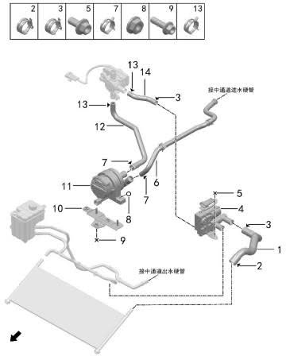

| Поз. | Артикул | Наименование | Кол-во | Системный номер | Примечание |
| ---: | --- | --- | ---: | --- | --- |
| 1 | 130330002 | Выпускной патрубок низкотемпературного радиатора | 1 | 1301021-RA01 |  |
| 2 | Q31001010 | Зажим трубки | 1 | Q673C26F62B |  |
| 3 | Q31001006 | Зажим трубки | 2 | Q673C23F62B |  |
| 4 | 130302001 | Трёхходовой клапан | 1 | 1314100-RA01 |  |
| 5 | Q11001002 | Фланцевый болт | 2 | HQ1840612L1 |  |
| 6 | 130319001 | Трубка охлаждения от водяного насоса к зарядному устройству | 1 | H97A1303010AA |  |
| 7 | Q31001011 | Зажим трубки | 2 | Q673C27F62 |  |
| 8 | Q21001002 | Фланцевая гайка | 2 | HQ32006 |  |
| 9 | Q11001009 | Фланцевый болт | 2 | HQ1840620L1 |  |
| 10 | 130706002 | Кронштейн насоса | 1 | H97A1307003BA |  |
| 11 | 130704001 | Водяной насос в сборе | 1 | H97A1307001AA |  |
| 12 | 130318002 | Патрубок четырёхходового клапана | 1 | 1303143-RA01 |  |
| 13 | Q31001009 | Зажим трубки | 2 | Q673C24F62K |  |
| 14 | 130318007 | Патрубок четырёхходового клапана | 1 | H97A1303056AA |  |

# 2029-13 Передние трубопроводы охлаждения

- Описание: охлаждение переднего электродвигателя, электрическая версия, полный привод

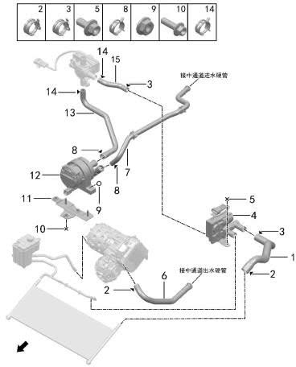

| Поз. | Артикул | Наименование | Кол-во | Системный номер | Примечание |
| ---: | --- | --- | ---: | --- | --- |
| 1 | 130330002 | Выпускной патрубок низкотемпературного радиатора | 1 | 1301021-RA01 |  |
| 2 | Q31001010 | Зажим трубки | 2 | Q673C26F62B |  |
| 3 | Q31001006 | Зажим трубки | 2 | Q673C23F62B |  |
| 4 | 130302001 | Трёхходовой клапан | 1 | 1314100-RA01 |  |
| 5 | Q11001002 | Фланцевый болт | 2 | HQ1840612L1 |  |
| 6 | 130325001 | Входная трубка охлаждения переднего электродвигателя | 1 | H97A1303003AA |  |
| 7 | 130319001 | Трубка охлаждения от водяного насоса к зарядному устройству | 1 | H97A1303010AA |  |
| 8 | Q31001011 | Зажим трубки | 2 | Q673C27F62 |  |
| 9 | Q21001002 | Фланцевая гайка | 2 | HQ32006 |  |
| 10 | Q11001009 | Фланцевый болт | 2 | HQ1840620L1 |  |
| 11 | 130706002 | Кронштейн насоса | 1 | H97A1307003BA |  |
| 12 | 130704001 | Водяной насос в сборе | 1 | H97A1307001AA |  |
| 13 | 130318002 | Патрубок четырёхходового клапана | 1 | 1303143-RA01 |  |
| 14 | Q31001009 | Зажим трубки | 2 | Q673C24F62K |  |
| 15 | 130318007 | Патрубок четырёхходового клапана | 1 | H97A1303056AA |  |

# 2030-10 Задние трубопроводы охлаждения

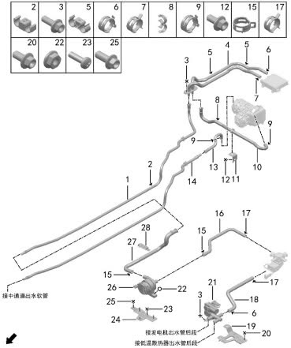

| Поз. | Артикул | Наименование | Кол-во | Системный номер | Примечание |
| ---: | --- | --- | ---: | --- | --- |
| 1 | 130321001 | Впускной патрубок центрального канала | 1 | H97A1303004AA |  |
| 2 | 130306001 | Двойная трубка охлаждения фиксатор | 7 | 1303051-RA01 |  |
| 3 | Q11001005 | Фланцевый болт | 4 | HQ1840616L1 |  |
| 4 | 130317001 | Патрубок зарядного устройства | 1 | H97A1303014BA |  |
| 5 | 130305001 | Зажим водяной трубки | 2 | 1303044-RA01 |  |
| 6 | Q31001006 | Зажим трубки | 2 | Q673C23F62B |  |
| 7 | Q31001007 | Зажим трубки | 1 | Q673C23F62K |  |
| 8 | 130305003 | Зажим водяной трубки | 2 | 2127124-RA01 |  |
| 9 | Q31001010 | Зажим трубки | 2 | Q673C26F62B |  |
| 10 | 130322001 | Впускной патрубок заднего электродвигателя | 1 | 1303023-RA01 |  |
| 11 | 130301001 | Кронштейн водяной трубки | 1 | H97A1303018AA |  |
| 12 | Q11001002 | Фланцевый болт | 1 | HQ1840612L1 |  |
| 13 | 130323001 | Выпускной патрубок заднего электродвигателя | 1 | 1303024-RA01 |  |
| 14 | 130339001 | Жёсткий выпускной патрубок центрального канала | 1 | H97A1303006AA |  |
| 15 | Q31001011 | Зажим трубки | 2 | Q673C27F62 |  |
| 16 | 130705001 | Шланг входа охлаждения водяного насоса | 1 | 1307111-RA53 |  |
| 17 | Q31001009 | Зажим трубки | 2 | Q673C24F62K |  |
| 18 | 130318005 | Патрубок четырёхходового клапана | 1 | 1303142-RA52 | замена на 130318007 |
| 18 | 130318007 | Патрубок четырёхходового клапана | 1 | H97A1303056AA |  |
| 19 | 130304002 | Кронштейн трёхходового клапана | 1 | H97A1300003AA |  |
| 20 | Q11001016 | Фланцевый болт | 1 | HQ1840816L1 |  |
| 21 | 130302001 | Трёхходовой клапан | 1 | 1314100-RA01 |  |
| 22 | Q21001002 | Фланцевая гайка | 2 | HQ32006 |  |
| 23 | Q12001009 | Винт с внутренним шестигранником | 1 | Q215B0825F61 |  |
| 24 | 130706003 | Кронштейн насоса | 1 | H97A1307003AA |  |
| 25 | Q11001019 | Фланцевый болт | 4 | HQ1840820L1 |  |
| 26 | 130704002 | Водяной насос в сборе | 1 | H97A1307001BA |  |
| 27 | 130338001 | Выпускной патрубок насоса | 1 | H97A1303007AA |  |
| 28 | 130308002 | Тройной зажим водяной трубки | 1 | H97A1303087AA |  |

# 2030-11 Задние трубопроводы охлаждения

- Описание: охлаждение заднего электродвигателя, электрическая версия

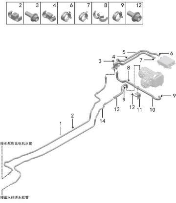

| Поз. | Артикул | Наименование | Кол-во | Системный номер | Примечание |
| ---: | --- | --- | ---: | --- | --- |
| 1 | 130321002 | Впускной патрубок центрального канала | 1 | H97A1303004BA |  |
| 2 | 130306001 | Двойная трубка охлаждения фиксатор | 9 | 1303051-RA01 |  |
| 3 | Q11001005 | Фланцевый болт | 2 | HQ1840616L1 |  |
| 4 | 130305001 | Зажим водяной трубки | 2 | 1303044-RA01 |  |
| 5 | 130317001 | Патрубок зарядного устройства | 1 | H97A1303014BA |  |
| 6 | Q31001006 | Зажим трубки | 1 | Q673C23F62B |  |
| 7 | Q31001007 | Зажим трубки | 1 | Q673C23F62K |  |
| 8 | 130305003 | Зажим водяной трубки | 2 | 2127124-RA01 |  |
| 9 | Q31001010 | Зажим трубки | 2 | Q673C26F62B |  |
| 10 | 130322001 | Впускной патрубок заднего электродвигателя | 1 | 1303023-RA01 |  |
| 11 | 130301001 | Кронштейн водяной трубки | 1 | H97A1303018AA |  |
| 12 | Q11001002 | Фланцевый болт | 1 | HQ1840612L1 |  |
| 13 | 130323001 | Выпускной патрубок заднего электродвигателя | 1 | 1303024-RA01 |  |
| 14 | 130324001 | Выходная трубка охлаждения центрального тоннеля | 1 | H97A1303006BA | задний привод |
| 14 | 130324002 | Выходная трубка охлаждения центрального тоннеля | 1 | H97A1303006CA | полный привод |

# 2031-10 Вентилятор охлаждения

- Описание: версия с рендж-экстендером (ДВС)

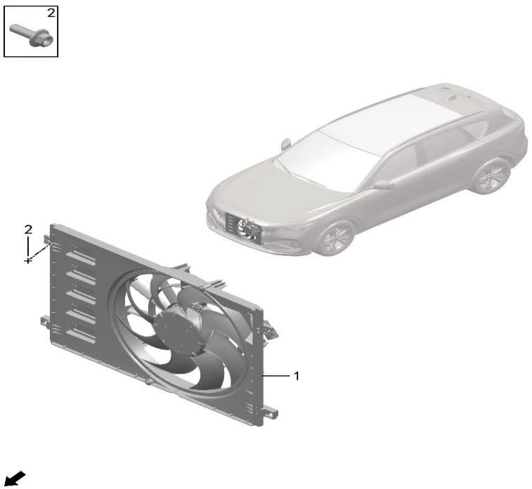

| Поз. | Артикул | Наименование | Кол-во | Системный номер | Примечание |
| ---: | --- | --- | ---: | --- | --- |
| 1 | 130800002 | Электродвигатель вентилятора радиатора | 1 | H97A1308001AA |  |
| 2 | Q11001007 | Фланцевый болт | 2 | HQ1840618L1 |  |

# 2031-11 Вентилятор охлаждения

- Описание: электрическая версия

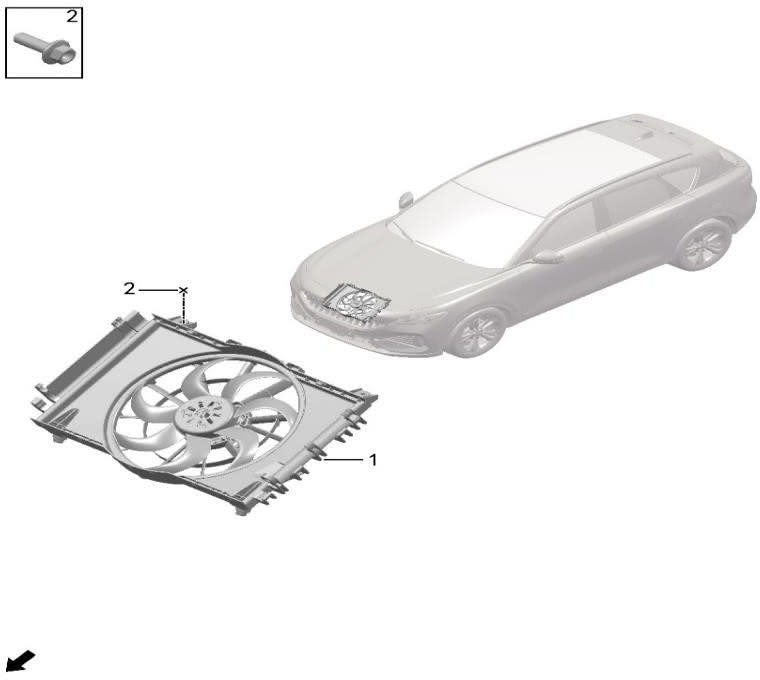

| Поз. | Артикул | Наименование | Кол-во | Системный номер | Примечание |
| ---: | --- | --- | ---: | --- | --- |
| 1 | 130800001 | Электродвигатель вентилятора радиатора | 1 | 1308100-RA01 |  |
| 2 | Q11001021 | Фланцевый болт | 2 | HQ1840830L1 |  |

# 2032-10 Водяной насос

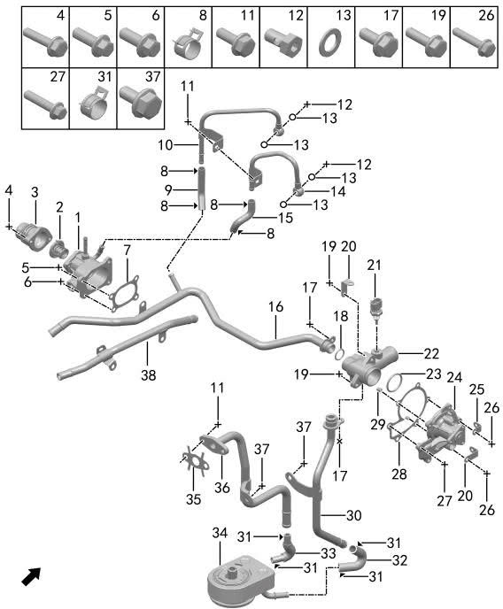

| Поз. | Артикул | Наименование | Кол-во | Системный номер | Примечание |
| ---: | --- | --- | ---: | --- | --- |
| 1 | 130311001 | Корпус выхода охлаждающей жидкости | 1 | 1303C00-F08-01A |  |
| 2 | 130601001 | Термостат | 1 | 1306300-F00-16 |  |
| 3 | 130310001 | Торцевая крышка корпуса выхода охлаждающей жидкости | 1 | 1303001-F08-01A | замена на 130310002 |
| 3 | 130310002 | Торцевая крышка корпуса выхода охлаждающей жидкости | 1 | 1303001-F08-01 |  |
| 4 | Q11001085 | Фланцевый болт | 2 | Q1860625F36 | M6×25 |
| 5 | Q11001036 | Фланцевый болт | 3 | Q1840820F36 | M8×20 |
| 6 | Q11001037 | Фланцевый болт | 1 | Q1840823F36 | M8×23 |
| 7 | 130013001 | Прокладка корпуса выхода охлаждающей жидкости | 1 | 1300027-F00-00 |  |
| 8 | Q31001002 | Зажим трубки | 4 | Q673C16 |  |
| 9 | 130002001 | Обратный шланг охлаждения турбокомпрессора | 1 | 1300009-F00-00B |  |
| 10 | 130008001 | Обратная трубка охлаждения турбокомпрессора | 1 | 1300420-F08-01 |  |
| 11 | Q11001083 | Фланцевый болт | 3 | Q1860616F36 | M6×16 |
| 12 | 111809001 | Масляный болт турбокомпрессора | 2 | 1118002-F00-00 |  |
| 13 | 111806001 | Медная шайба | 4 | 1118008-F00-00 |  |
| 14 | 130007001 | Входная трубка охлаждения турбокомпрессора | 1 | 1300410-F08-02 |  |
| 15 | 130001001 | Входной шланг охлаждения турбокомпрессора | 1 | 1300008-F00-00C |  |
| 16 | 130314001 | Обратная трубка отопителя | 1 | 1303A40-F08-01 |  |
| 17 | Q11001082 | Фланцевый болт | 2 | Q1860614F36 | M6×14 |
| 18 | 100012001 | Уплотнительное кольцо маслоприемника | 1 | 1000531-E01-00 |  |
| 19 | Q11001084 | Фланцевый болт | 2 | Q1860620F36 | M6×20 |
| 20 | 100010001 | Кронштейн жгута катушек зажигания | 2 | 1000809-A26-00 |  |
| 21 | 361101001 | Датчик температуры охлаждающей жидкости | 1 | 3611200-B11-00 |  |
| 22 | 130702001 | Торцевая крышка входа охлаждения водяного насоса | 1 | 1307111-F08-01 |  |
| 23 | 130703001 | Уплотнительное кольцо торцевой крышки входа охлаждения | 1 | 1307113-F00-16 |  |
| 24 | 130701001 | Водяной насос в сборе | 1 | 1307100-F07-04 |  |
| 25 | 101510001 | Кронштейн насоса | 1 | 101502U-F00-16 |  |
| 26 | Q11001086 | Фланцевый болт | 4 | Q1860630F36 | M6×30 |
| 27 | Q11001042 | Фланцевый болт | 2 | Q1840836F36 |  |
| 28 | 130011001 | Прокладка водяного насоса | 1 | 1300015-F00-16 |  |
| 29 | 100006001 | Установочная втулка задней крышки | 2 | 1000014-A00-00 |  |
| 30 | 130006001 | Обратная трубка охлаждения охладителя | 1 | 1300050-F08-00 |  |
| 31 | Q31001003 | Зажим трубки | 4 | Q673C18 |  |
| 32 | 130004001 | Обратная трубка масляного радиатора | 1 | 1300024-F08-00 |  |
| 33 | 130003001 | Входная трубка масляного радиатора | 1 | 1300023-F08-01 |  |
| 34 | 130010001 | Масляный охладитель | 1 | 1300300-F00-03A |  |
| 35 | 130012001 | Обратная масляная трубка прокладка | 1 | 1300021-F00-00 |  |
| 36 | 130005001 | Входная трубка охлаждения охладителя | 1 | 1300040-F08-01 |  |
| 37 | Q11001081 | Фланцевый болт | 2 | Q1860612F36 | M6×12 |
| 38 | 130315001 | Выходная трубка охлаждения | 1 | 1303D00-F08-01 |  |

# 2033-10 Система термостатирования батареи

- Описание: версия с рендж-экстендером (ДВС), система термостатирования батареи

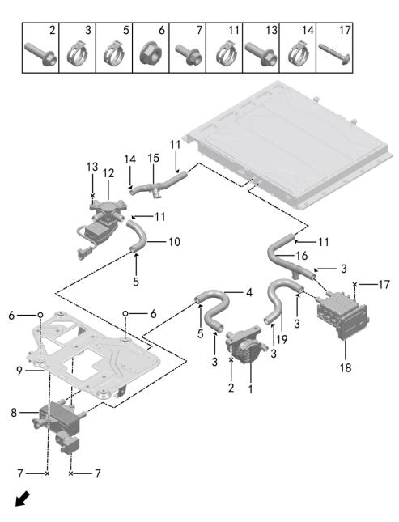

| Поз. | Артикул | Наименование | Кол-во | Системный номер | Примечание |
| ---: | --- | --- | ---: | --- | --- |
| 1 | 130704002 | Водяной насос в сборе | 1 | H97A1307001BA |  |
| 2 | Q11001011 | Фланцевый болт | 2 | HQ1840625L1 |  |
| 3 | Q31001011 | Зажим трубки | 4 | Q673C27F62 | замена на Q31001010 |
| 4 | 130327003 | Выходная трубка охлаждения охладителя батареи | 1 | H97A1303065AA |  |
| 5 | Q31001008 | Зажим трубки | 2 | Q673C24F62 |  |
| 6 | Q21001012 | Фланцевая гайка | 4 | HQ32008L1 |  |
| 7 | Q11001009 | Фланцевый болт | 2 | HQ1840620L1 |  |
| 8 | 810750002 | Охладитель батареи | 1 | 8107500-RA51 |  |
| 9 | 130203002 | Кронштейн радиатора | 1 | H97A1302001AA |  |
| 10 | 130318006 | Патрубок четырёхходового клапана | 1 | 1303144-RA52 |  |
| 11 | Q31001010 | Зажим трубки | 6 | Q673C26F62B |  |
| 12 | 130303001 | Четырехходовой клапан | 1 | 1314300-RA01 |  |
| 13 | Q11001009 | Фланцевый болт | 2 | HQ1840620L1 |  |
| 14 | Q31001009 | Зажим трубки | 2 | Q673C24F62K |  |
| 15 | 924604002 | Выходная трубка тяговой батареи | 1 | H97A9246002BA |  |
| 16 | 924603002 | Входная трубка тяговой батареи | 1 | H97A9246001BA |  |
| 17 | Q12001017 | Винт с внутренним шестигранником | 6 | HQY27A0615N2 | замена на Q12001025 |
| 17 | Q12001025 | Винт с внутренним шестигранником | 6 | Q215B0612T1F61 |  |
| 18 | 924001001 | Водяной PTC-нагреватель | 1 | H97A9240001AA | замена на 924001002 |
| 18 | 924001002 | Водяной PTC-нагреватель | 1 | H97A9240001AB |  |
| 19 | 811501001 | Входная трубка PTC-нагревателя | 1 | H97A8115002AA |  |

# 2033-11 Система термостатирования батареи

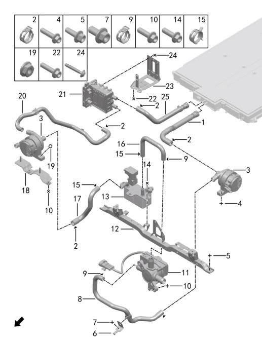

| Поз. | Артикул | Наименование | Кол-во | Системный номер | Примечание |
| ---: | --- | --- | ---: | --- | --- |
| 1 | 924604001 | Выходная трубка тяговой батареи | 1 | H97A9246002AA |  |
| 2 | Q31001011 | Зажим трубки | 6 | Q673C27F62 | замена на Q31001010 |
| 2 | Q31001010 | Зажим трубки | 6 | Q673C26F62B |  |
| 3 | 130704002 | Водяной насос в сборе | 2 | H97A1307001BA |  |
| 4 | Q11001011 | Фланцевый болт | 2 | HQ1840625L1 |  |
| 5 | Q11001020 | Фланцевый болт | 2 | HQ1840825L1 |  |
| 6 | 130301002 | Кронштейн водяной трубки | 1 | H97A1303018BA |  |
| 7 | Q11001002 | Фланцевый болт | 1 | HQ1840612L1 |  |
| 8 | 130318004 | Патрубок четырёхходового клапана | 1 | H97A1303012AA | замена на 130318008 |
| 8 | 130318008 | Патрубок четырёхходового клапана | 1 | H97A1303012AB |  |
| 9 | Q31001009 | Зажим трубки | 2 | Q673C24F62K |  |
| 10 | Q11001009 | Фланцевый болт | 4 | HQ1840620L1 |  |
| 11 | 130303001 | Четырехходовой клапан | 1 | 1314300-RA01 |  |
| 12 | 130203001 | Кронштейн радиатора | 1 | H97A1302001BA |  |
| 13 | 810750001 | Охладитель батареи | 1 | 8107500-RA01 |  |
| 14 | Q11001009 | Фланцевый болт | 3 | HQ1840620L1 |  |
| 15 | Q31001008 | Зажим трубки | 2 | Q673C24F62 |  |
| 16 | 130318003 | Патрубок четырёхходового клапана | 1 | 1303144-RA01 |  |
| 17 | 130327002 | Выходная трубка охлаждения охладителя батареи | 1 | 2127740-RA01 |  |
| 18 | 130706001 | Кронштейн насоса | 1 | H97A1307002AA |  |
| 19 | Q21001002 | Фланцевая гайка | 2 | HQ32006 |  |
| 20 | 811501002 | Входная трубка PTC-нагревателя | 1 | H97A8115002BA |  |
| 21 | 924001001 | Водяной PTC-нагреватель | 1 | H97A9240001AA | замена на 924001002 |
| 21 | 924001002 | Водяной PTC-нагреватель | 1 | H97A9240001AB |  |
| 22 | Q11001016 | Фланцевый болт | 3 | HQ1840816L1 |  |
| 23 | 924002001 | Кронштейн водяного PTC-нагревателя | 1 | H97A9240002AA |  |
| 24 | Q12001017 | Винт с внутренним шестигранником | 6 | HQY27A0615N2 | замена на Q12001025 |
| 24 | Q12001025 | Винт с внутренним шестигранником | 6 | Q215B0612T1F61 |  |
| 25 | 924603001 | Входная трубка тяговой батареи | 1 | H97A9246001AA |  |

# 2034-10 Расширительный бачок

- Описание: версия с рендж-экстендером (ДВС), задний привод

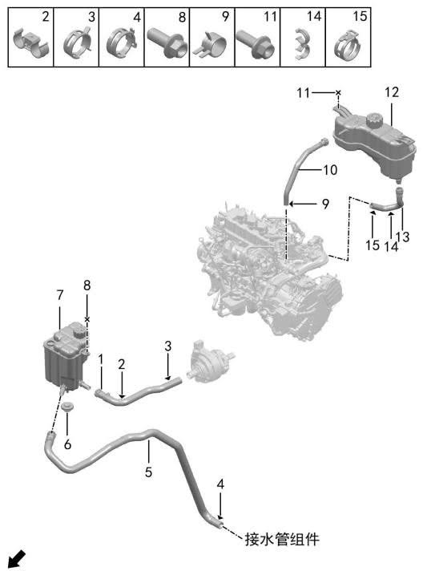

| Поз. | Артикул | Наименование | Кол-во | Системный номер | Примечание |
| ---: | --- | --- | ---: | --- | --- |
| 1 | 130332001 | Выходная трубка расширительного бачка | 1 | H97A1303054AB |  |
| 2 | 130305002 | Зажим водяной трубки | 1 | 2127123-RA01 |  |
| 3 | Q31001011 | Зажим трубки | 1 | Q673C27F62 |  |
| 4 | Q31001010 | Зажим трубки | 1 | Q673C26F62B |  |
| 5 | 130337002 | Входная трубка расширительного бачка | 1 | H97A1303027AB |  |
| 6 | 130313001 | Втулка расширительного бачка | 1 | 1303043-RA01 |  |
| 7 | 130312002 | Расширительный бачок | 1 | H97A1311013AA |  |
| 8 | Q11001019 | Фланцевый болт | 4 | HQ1840820L1 |  |
| 9 | Q31001001 | Зажим трубки | 1 | Q673C15 | замена на Q31001015 |
| 9 | Q31001015 | Зажим трубки | 1 | Q673C15F61 |  |
| 10 | 130344001 | Воздухоотводная трубка расширительного бачка | 1 | 1303037-RA52 |  |
| 11 | Q11001005 | Фланцевый болт | 2 | HQ1840616L1 |  |
| 12 | 130312003 | Расширительный бачок | 1 | H97A1311014AA |  |
| 13 | 130345001 | Радиатор шланг | 1 | 1303036-RA52 |  |
| 14 | 130305003 | Зажим водяной трубки | 1 | 2127124-RA01 |  |
| 15 | Q31001009 | Зажим трубки | 1 | Q673C24F62K |  |

# 2034-11 Расширительный бачок

- Описание: версия с рендж-экстендером (ДВС), полный привод

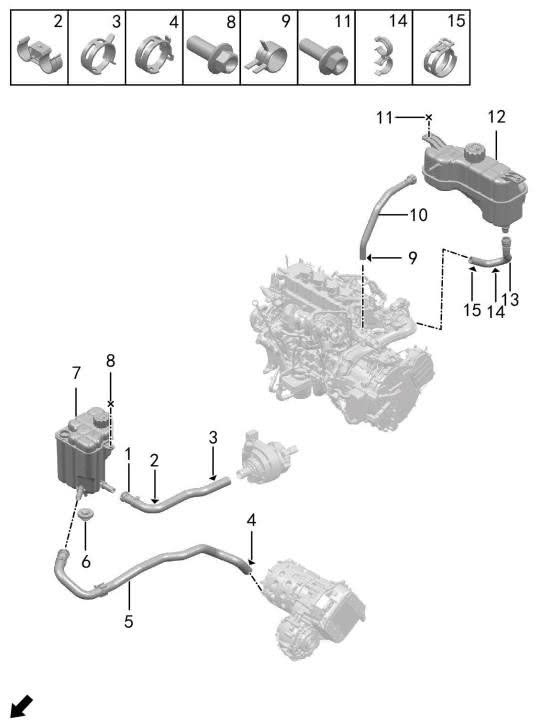

| Поз. | Артикул | Наименование | Кол-во | Системный номер | Примечание |
| ---: | --- | --- | ---: | --- | --- |
| 1 | 130332001 | Выходная трубка расширительного бачка | 1 | H97A1303054AB |  |
| 2 | 130305002 | Зажим водяной трубки | 1 | 2127123-RA01 |  |
| 3 | Q31001011 | Зажим трубки | 1 | Q673C27F62 |  |
| 4 | Q31001010 | Зажим трубки | 1 | Q673C26F62B |  |
| 5 | 130337001 | Входная трубка расширительного бачка | 1 | H97A1303027BB |  |
| 6 | 130313001 | Втулка расширительного бачка | 1 | 1303043-RA01 |  |
| 7 | 130312002 | Расширительный бачок | 1 | H97A1311013AA |  |
| 8 | Q11001019 | Фланцевый болт | 4 | HQ1840820L1 |  |
| 9 | Q31001001 | Зажим трубки | 1 | Q673C15 | замена на Q31001015 |
| 9 | Q31001015 | Зажим трубки | 1 | Q673C15F61 |  |
| 10 | 130344001 | Воздухоотводная трубка расширительного бачка | 1 | 1303037-RA52 |  |
| 11 | Q11001005 | Фланцевый болт | 2 | HQ1840616L1 |  |
| 12 | 130312003 | Расширительный бачок | 1 | H97A1311014AA |  |
| 13 | 130345001 | Радиатор шланг | 1 | 1303036-RA52 |  |
| 14 | 130305003 | Зажим водяной трубки | 1 | 2127124-RA01 |  |
| 15 | Q31001009 | Зажим трубки | 1 | Q673C24F62K |  |

# 2034-12 Расширительный бачок

- Описание: электрическая версия, задний привод

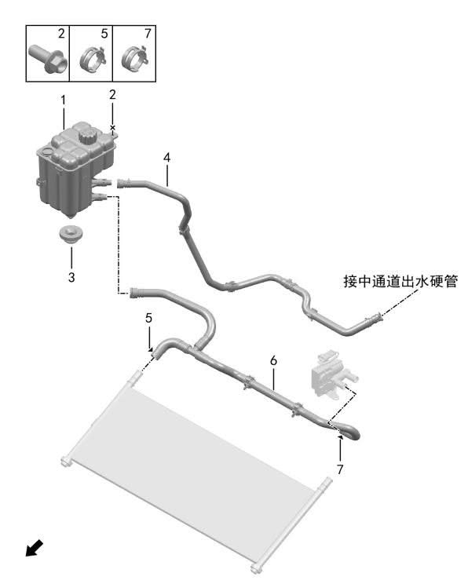

| Поз. | Артикул | Наименование | Кол-во | Системный номер | Примечание |
| ---: | --- | --- | ---: | --- | --- |
| 1 | 130312001 | Расширительный бачок | 1 | H97A1311013BA |  |
| 2 | Q11001019 | Фланцевый болт | 4 | HQ1840820L1 |  |
| 3 | 130313001 | Втулка расширительного бачка | 1 | 1303043-RA01 |  |
| 4 | 130337003 | Входная трубка расширительного бачка | 1 | H97A1303027CA |  |
| 5 | Q31001010 | Зажим трубки | 1 | Q673C26F62B |  |
| 6 | 130316001 | Впускной патрубок низкотемпературного радиатора | 1 | H97A1303016BA |  |
| 7 | Q31001006 | Зажим трубки | 1 | Q673C23F62B |  |

# 2034-13 Расширительный бачок

- Описание: электрическая версия, полный привод

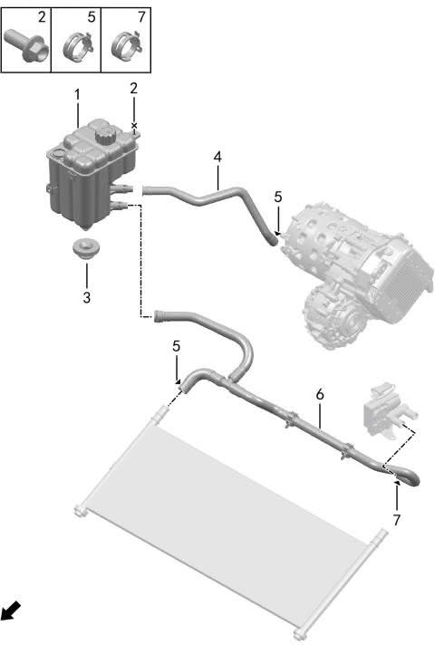

| Поз. | Артикул | Наименование | Кол-во | Системный номер | Примечание |
| ---: | --- | --- | ---: | --- | --- |
| 1 | 130312001 | Расширительный бачок | 1 | H97A1311013BA |  |
| 2 | Q11001019 | Фланцевый болт | 4 | HQ1840820L1 |  |
| 3 | 130313001 | Втулка расширительного бачка | 1 | 1303043-RA01 |  |
| 4 | 130320001 | Выходная трубка охлаждения переднего электродвигателя | 1 | H97A1303060AA |  |
| 5 | Q31001010 | Зажим трубки | 2 | Q673C26F62B |  |
| 6 | 130316001 | Впускной патрубок низкотемпературного радиатора | 1 | H97A1303016BA |  |
| 7 | Q31001006 | Зажим трубки | 1 | Q673C23F62B |  |
