- [7010-10 Жгут проводки двигателя](#7010-10-жгут-проводки-двигателя)
- [7011-10 Жгуты переднего отсека](#7011-10-жгуты-переднего-отсека)
- [7011-20 Жгуты переднего отсека](#7011-20-жгуты-переднего-отсека)
- [7013-10 Жгут панели приборов](#7013-10-жгут-панели-приборов)
- [7013-11 Жгут панели приборов](#7013-11-жгут-панели-приборов)
- [7014-10 Жгут центральной консоли](#7014-10-жгут-центральной-консоли)
- [7015-10 Жгут потолка](#7015-10-жгут-потолка)
- [7016-10 Жгут кузова](#7016-10-жгут-кузова)
- [7016-11 Жгут кузова](#7016-11-жгут-кузова)
- [7017-10 Жгуты передних дверей](#7017-10-жгуты-передних-дверей)
- [7018-10 Жгуты задних дверей](#7018-10-жгуты-задних-дверей)
- [7019-10 Жгут двери багажника](#7019-10-жгут-двери-багажника)
- [7020-10 Жгут переднего бампера](#7020-10-жгут-переднего-бампера)
- [7021-10 Жгут заднего бампера](#7021-10-жгут-заднего-бампера)
- [7022-10 Жгуты массы](#7022-10-жгуты-массы)
- [7022-11 Жгуты массы](#7022-11-жгуты-массы)
- [7022-12 Жгуты массы](#7022-12-жгуты-массы)
- [7022-13 Жгуты массы](#7022-13-жгуты-массы)
- [7023-10 Аккумулятор](#7023-10-аккумулятор)
- [7023-11 Аккумулятор](#7023-11-аккумулятор)
- [7024-10 Разъемы питания](#7024-10-разъемы-питания)
- [7025-10 Беспроводная зарядка телефона](#7025-10-беспроводная-зарядка-телефона)
- [7026-10 Передние фары](#7026-10-передние-фары)
- [7027-10 Противотуманные фонари](#7027-10-противотуманные-фонари)
- [7028-10 Задние фонари](#7028-10-задние-фонари)
- [7029-10 Внешний индикатор зарядки](#7029-10-внешний-индикатор-зарядки)
- [7030-10 Салонное освещение](#7030-10-салонное-освещение)
- [7032-10 Подсветка дверей](#7032-10-подсветка-дверей)
- [7033-10 Динамики](#7033-10-динамики)
- [7034-10 Контроллер предупреждения пешеходов](#7034-10-контроллер-предупреждения-пешеходов)
- [7037-10 Система ночного видения](#7037-10-система-ночного-видения)
- [7038-10 Видеорегистратор](#7038-10-видеорегистратор)
- [7039-10 Камера мониторинга водителя](#7039-10-камера-мониторинга-водителя)
- [7040-10 Контроллер камер автомобиля](#7040-10-контроллер-камер-автомобиля)
- [7041-10 Камера мониторинга заднего ряда](#7041-10-камера-мониторинга-заднего-ряда)
- [7042-10 Сенсорная панель](#7042-10-сенсорная-панель)
- [7043-10 Переключатели](#7043-10-переключатели)
- [7044-10 Комбинированные переключатели](#7044-10-комбинированные-переключатели)
- [7045-10 Управление открытием и закрытием двери багажника](#7045-10-управление-открытием-и-закрытием-двери-багажника)
- [7046-10 Мультимедийная головная система](#7046-10-мультимедийная-головная-система)
- [7047-10 Мультимедийный дисплей](#7047-10-мультимедийный-дисплей)
- [7048-10 Антенны](#7048-10-антенны)
- [7050-10 Акустические динамики](#7050-10-акустические-динамики)
- [7050-20 Акустические динамики](#7050-20-акустические-динамики)
- [7051-10 Микрофоны](#7051-10-микрофоны)
- [7051-11 Микрофоны](#7051-11-микрофоны)
- [7052-10 Телематический блок](#7052-10-телематический-блок)
- [7053-10 Бесключевой доступ и запуск](#7053-10-бесключевой-доступ-и-запуск)
- [7054-10 Система сенсорного открытия ногой](#7054-10-система-сенсорного-открытия-ногой)
- [7055-10 Устройства управления кузовом](#7055-10-устройства-управления-кузовом)
- [7056-10 Предохранители и реле жгута переднего отсека](#7056-10-предохранители-и-реле-жгута-переднего-отсека)
- [7056-11 Предохранители и реле жгута переднего отсека](#7056-11-предохранители-и-реле-жгута-переднего-отсека)
- [7057-10 Предохранители и реле салонного жгута](#7057-10-предохранители-и-реле-салонного-жгута)
- [7057-11 Предохранители и реле салонного жгута](#7057-11-предохранители-и-реле-салонного-жгута)

# 7010-10 Жгут проводки двигателя

- Описание: версия с рендж-экстендером (ДВС)

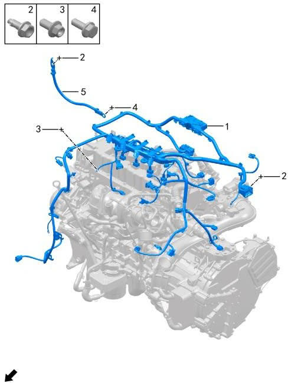

| Поз. | Артикул | Наименование | Кол-во | Системный номер | Примечание |
| ---: | --- | --- | ---: | --- | --- |
| 1 | 372420002 | Жгут проводки двигателя | 1 | H97A3724302AB |  |
| 2 | Q11004003 | Болт массы | 3 | HQ1840614N1 |  |
| 3 | Q11001015 | Фланцевый болт | 1 | HQ1840816 |  |
| 4 | Q11001083 | Фланцевый болт | 2 | Q1860616F36 | M6×16 |
| 5 | 372424002 | Провод массы | 1 | 4001200-F08-12 |  |

# 7011-10 Жгуты переднего отсека

- Описание: версия с рендж-экстендером (ДВС)

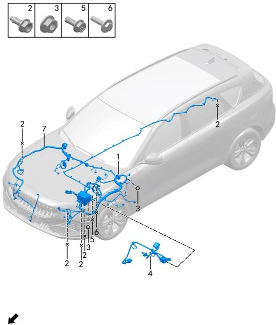

| Поз. | Артикул | Наименование | Кол-во | Системный номер | Примечание |
| ---: | --- | --- | ---: | --- | --- |
| 1 | 372416005 | Левый жгут переднего отсека | 1 | H97A3724306AA | задний привод, без пневмоподвески, без автопарковки |
| 1 | 372416006 | Левый жгут переднего отсека | 1 | H97A3724306AD | полный привод, без пневмоподвески, с автопарковкой |
| 1 | 372416007 | Левый жгут переднего отсека | 1 | H97A3724306AC | полный привод, с пневмоподвеской, с автопарковкой |
| 1 | 372416004 | Левый жгут переднего отсека | 1 | H97A3724306AE | полный привод, без пневмоподвески, без автопарковки |
| 2 | Q11004003 | Болт массы | 6 | Q41006003 |  |
| 3 | Q21001010 | Фланцевая гайка | 3 | HQ32406 |  |
| 4 | 372415003 | Жгут переднего подрамника | 1 | H97A3724305AA | задний привод |
| 4 | 372415004 | Жгут переднего подрамника | 1 | H97A3724305AB | полный привод |
| 5 | Q11002019 | Болт | 1 | HQY1470616T8L1 |  |
| 6 | Q11004004 | Болт массы | 1 | HQY1460616N1 |  |
| 7 | 372417004 | Правый жгут переднего отсека | 1 | H97A3724307AA | без пневмоподвески, без интегрированного круиз-контроля |
| 7 | 372417005 | Правый жгут переднего отсека | 1 | H97A3724307AB | без пневмоподвески, с интегрированным круиз-контролем |
| 7 | 372417006 | Правый жгут переднего отсека | 1 | H97A3724307AC | с пневмоподвеской, с интегрированным круиз-контролем |

# 7011-20 Жгуты переднего отсека

- Описание: электрическая версия

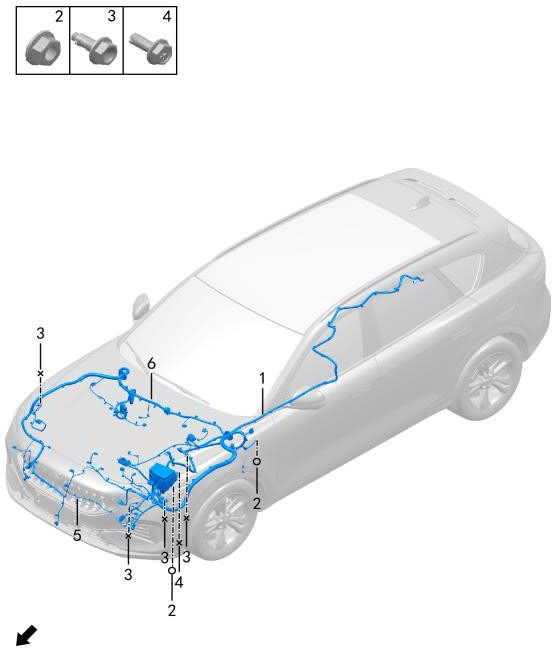

| Поз. | Артикул | Наименование | Кол-во | Системный номер | Примечание |
| ---: | --- | --- | ---: | --- | --- |
| 1 | 372416001 | Левый жгут переднего отсека | 1 | H97A3724206AA | задний привод, без пневмоподвески, без автопарковки |
| 1 | 372416002 | Левый жгут переднего отсека | 1 | H97A3724206AB | задний привод, без пневмоподвески, с автопарковкой |
| 1 | 372416003 | Левый жгут переднего отсека | 1 | H97A3724206AC | полный привод, без пневмоподвески, с автопарковкой |
| 1 | 372416008 | Левый жгут переднего отсека | 1 | H97A3724206AE | полный привод, без пневмоподвески, без автопарковки |
| 1 | 372416009 | Левый жгут переднего отсека | 1 | H97A3724206AD | полный привод, с пневмоподвеской, с автопарковкой |
| 2 | Q21001010 | Фланцевая гайка | 3 | HQ32406 |  |
| 3 | Q11004003 | Болт массы | 6 | HQ1840614N1 |  |
| 4 | Q11002019 | Болт | 1 | HQY1470616T8L1 |  |
| 5 | 372415001 | Жгут переднего подрамника | 1 | H97A3724205AA | задний привод |
| 5 | 372415002 | Жгут переднего подрамника | 1 | H97A3724205AB | полный привод |
| 6 | 372417007 | Правый жгут переднего отсека | 1 | H97A3724207AD | без пневмоподвески, без интегрированного круиз-контроля |
| 6 | 372417008 | Правый жгут переднего отсека | 1 | H97A3724207AE | без пневмоподвески, с интегрированным круиз-контролем |
| 6 | 372417009 | Правый жгут переднего отсека | 1 | H97A3724207AF | с пневмоподвеской, с интегрированным круиз-контролем |

# 7013-10 Жгут панели приборов

- Описание: версия с рендж-экстендером (ДВС)

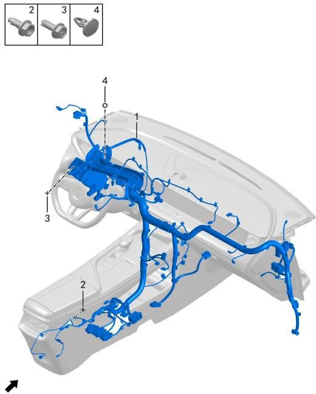

| Поз. | Артикул | Наименование | Кол-во | Системный номер | Примечание |
| ---: | --- | --- | ---: | --- | --- |
| 1 | 372418005 | Жгут панели приборов | 1 | H97A3724308AA | панорамный люк, с системой круговой парковки, без системы ночного видения |
| 1 | 372418006 | Жгут панели приборов | 1 | H97A3724308AE | панорамный люк, без системы круговой парковки, с системой ночного видения |
| 1 | 372418008 | Жгут панели приборов | 1 | H97A3724308AD | панорамная крыша, без системы круговой парковки, с системой ночного видения |
| 1 | 372418010 | Жгут панели приборов | 1 | H97A3724308AC | панорамный люк, без системы круговой парковки, с системой ночного видения |
| 2 | Q11004003 | Болт массы | 4 | HQ1840614N1 |  |
| 3 | Q11002019 | Болт | 2 | HQY1470616T8L1 |  |
| 4 | Q41001002 | Клипса | 4 | 09406-08302 |  |

# 7013-11 Жгут панели приборов

- Описание: электрическая версия

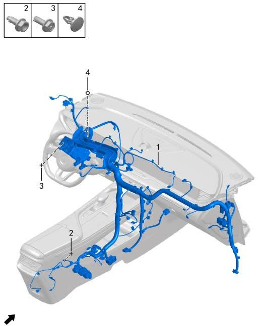

| Поз. | Артикул | Наименование | Кол-во | Системный номер | Примечание |
| ---: | --- | --- | ---: | --- | --- |
| 1 | 372418001 | Жгут панели приборов | 1 | H97A3724208AA | панорамный люк, с системой круговой парковки, без системы ночного видения |
| 1 | 372418002 | Жгут панели приборов | 1 | H97A3724208AB | панорамный люк, без системы круговой парковки, с системой ночного видения |
| 1 | 372418004 | Жгут панели приборов | 1 | H97A3724208AD | панорамная крыша, без системы круговой парковки, с системой ночного видения |
| 1 | 372418009 | Жгут панели приборов | 1 | H97A3724208AC | панорамный люк, без системы круговой парковки, с системой ночного видения |
| 2 | Q11004003 | Болт массы | 4 | HQ1840614N1 |  |
| 3 | Q11002019 | Болт | 2 | HQY1470616T8L1 |  |
| 4 | Q41001002 | Клипса | 4 | 09406-08302 |  |

# 7014-10 Жгут центральной консоли

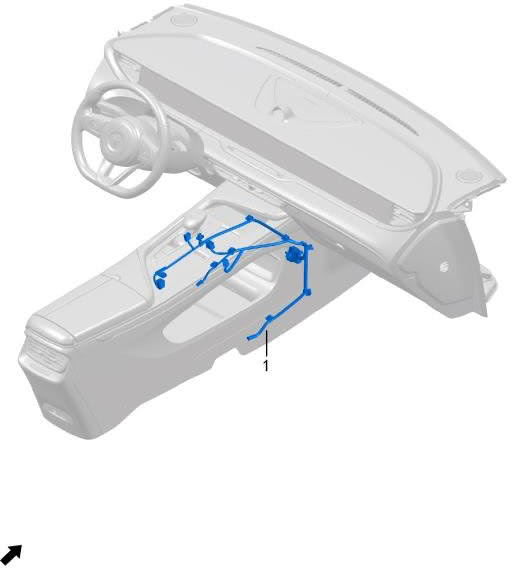

| Поз. | Артикул | Наименование | Кол-во | Системный номер | Примечание |
| ---: | --- | --- | ---: | --- | --- |
| 1 | 372402001 | Жгут центральной консоли | 1 | H97A3724109AA | без беспроводной зарядки телефона |
| 1 | 372402002 | Жгут центральной консоли | 1 | H97A3724109AB | с беспроводной зарядкой телефона |

# 7015-10 Жгут потолка

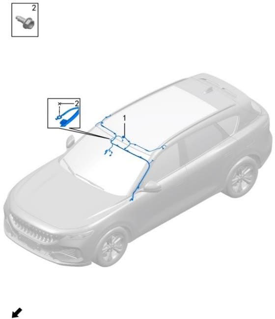

| Поз. | Артикул | Наименование | Кол-во | Системный номер | Примечание |
| ---: | --- | --- | ---: | --- | --- |
| 1 | 372411001 | Жгут потолка | 1 | H97A3724119AA | электрическая версия, панорамный люк, микрофон: передний ряд |
| 1 | 372411002 | Жгут потолка | 1 | H97A3724119AB | версия с рендж-экстендером (ДВС), панорамный люк, микрофон: передний ряд |
| 1 | 372411003 | Жгут потолка | 1 | H97A3724119AC | версия с рендж-экстендером (ДВС), панорамный люк, микрофон: передний ряд |
| 1 | 372411004 | Жгут потолка | 1 | H97A3724119AD | электрическая версия, панорамный люк, микрофон: передний ряд |
| 1 | 372411005 | Жгут потолка | 1 | H97A3724119AE | панорамная крыша, с системой ночного видения |
| 1 | 372411006 | Жгут потолка | 1 | H97A3724119AF | панорамная крыша, без системы ночного видения |
| 2 | Q11004003 | Болт массы | 1 | HQ1840614N1 |  |

# 7016-10 Жгут кузова

- Описание: версия с рендж-экстендером (ДВС)

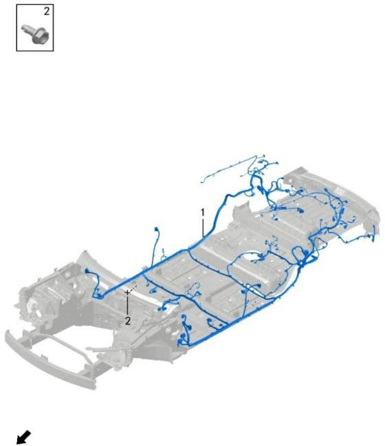

| Поз. | Артикул | Наименование | Кол-во | Системный номер | Примечание |
| ---: | --- | --- | ---: | --- | --- |
| 1 | 372419011 | Жгут кузова | 1 | H97A3724310AL | полный привод, с системой круговой парковки |
| 1 | 372419012 | Жгут кузова | 1 | H97A3724310AH | панорамная крыша |
| 1 | 372419013 | Жгут кузова | 1 | H97A3724310AE | задний привод, с системой круговой парковки |
| 1 | 372419014 | Жгут кузова | 1 | H97A3724310AN | полный привод, люк |
| 1 | 372419018 | Жгут кузова | 1 | H97A3724310AU | полный привод, панорамная крыша |
| 1 | 372419019 | Жгут кузова | 1 | H97A3724310AG | Люк |
| 2 | Q11004003 | Болт массы | 8 | HQ1840614N1 |  |

# 7016-11 Жгут кузова

- Описание: электрическая версия

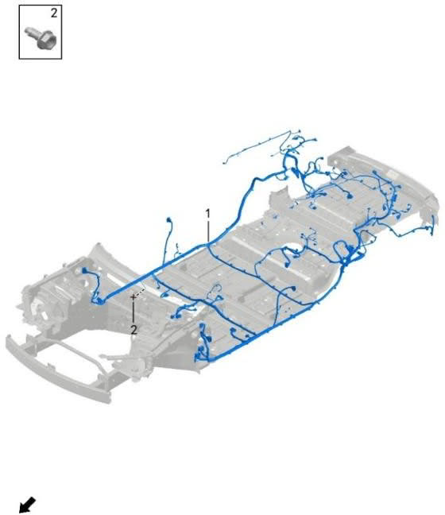

| Поз. | Артикул | Наименование | Кол-во | Системный номер | Примечание |
| ---: | --- | --- | ---: | --- | --- |
| 1 | 372419001 | Жгут кузова | 1 | H97A3724210AL | полный привод, с системой круговой парковки |
| 1 | 372419002 | Жгут кузова | 1 | H97A3724210AF | задний привод, люк |
| 1 | 372419003 | Жгут кузова | 1 | H97A3724210AG | полный привод, люк |
| 1 | 372419004 | Жгут кузова | 1 | H97A3724210AE | задний привод, с системой круговой парковки |
| 1 | 372419010 | Жгут кузова | 1 | H97A3724210AJ | затемняемое стекло и атмосферная подсветка |
| 1 | 372419015 | Жгут кузова | 1 | H97A3724210AN | задний привод, панорамная крыша |
| 1 | 372419016 | Жгут кузова | 1 | H97A3724210AU | полный привод, панорамная крыша |
| 1 | 372419017 | Жгут кузова | 1 | H97A3724210AH |  |
| 2 | Q11004003 | Болт массы | 8 | HQ1840614N1 |  |

# 7017-10 Жгуты передних дверей

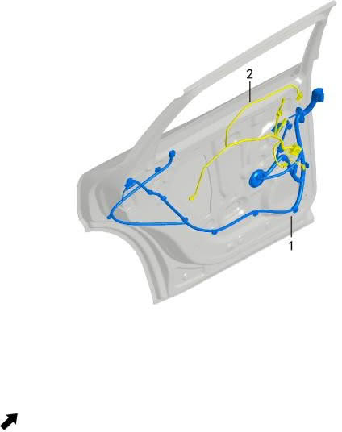

| Поз. | Артикул | Наименование | Кол-во | Системный номер | Примечание |
| ---: | --- | --- | ---: | --- | --- |
| 1 | 372403001 | Левый жгут передней двери | 1 | H97A3724111AA | 8 динамиков |
| 1 | 372403003 | Левый жгут передней двери | 1 | H97A3724111AC | 10 динамиков |
| 1 | 372405001 | Правый жгут передней двери | 1 | H97A3724113AA | 8 динамиков |
| 1 | 372405003 | Правый жгут передней двери | 1 | H97A3724113AC | 10 динамиков |
| 2 | 372404001 | Левый жгут обивки передней двери | 1 | H97A3724112AA |  |
| 2 | 372406001 | Правый жгут обивки передней двери | 1 | H97A3724114AA |  |

# 7018-10 Жгуты задних дверей

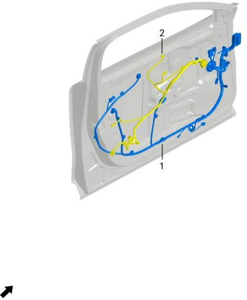

| Поз. | Артикул | Наименование | Кол-во | Системный номер | Примечание |
| ---: | --- | --- | ---: | --- | --- |
| 1 | 372407001 | Левый жгут задней двери | 1 | H97A3724115AA |  |
| 1 | 372409001 | Правый жгут задней двери | 1 | H97A3724117AA |  |
| 2 | 372408001 | Левый жгут обивки задней двери | 1 | H97A3724116AA | 8 динамиков |
| 2 | 372408003 | Левый жгут обивки задней двери | 1 | H97A3724116AC | 10 динамиков |
| 2 | 372410001 | Правый жгут обивки задней двери | 1 | H97A3724118AA | 8 динамиков |
| 2 | 372410003 | Правый жгут обивки задней двери | 1 | H97A3724118AC | 10 динамиков |

# 7019-10 Жгут двери багажника

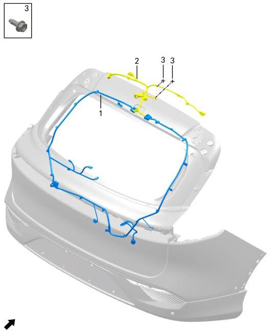

| Поз. | Артикул | Наименование | Кол-во | Системный номер | Примечание |
| ---: | --- | --- | ---: | --- | --- |
| 1 | 372413001 | Жгут двери багажника | 1 | H97A3724121AA |  |
| 2 | 372412001 | Переходной жгут двери багажника | 1 | H97A3724120AA |  |
| 3 | Q11004003 | Болт массы | 3 | HQ1840614N1 |  |

# 7020-10 Жгут переднего бампера

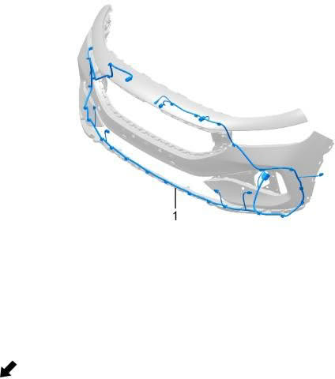

| Поз. | Артикул | Наименование | Кол-во | Системный номер | Примечание |
| ---: | --- | --- | ---: | --- | --- |
| 1 | 372401001 | Жгут переднего бампера | 1 | H97A3724101AA | без автопарковки |
| 1 | 372401002 | Жгут переднего бампера | 1 | H97A3724101AB | с автопарковкой, без системы ночного видения |
| 1 | 372401003 | Жгут переднего бампера | 1 | H97A3724101AC | с автопарковкой, с системой ночного видения |

# 7021-10 Жгут заднего бампера

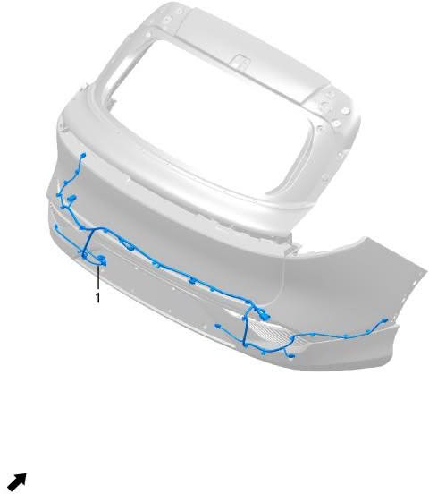

| Поз. | Артикул | Наименование | Кол-во | Системный номер | Примечание |
| ---: | --- | --- | ---: | --- | --- |
| 1 | 372414001 | Жгут заднего бампера | 1 | H97A3724122AA | без автопарковки |
| 1 | 372414002 | Жгут заднего бампера | 1 | H97A3724122AB | с автопарковкой |

# 7022-10 Жгуты массы

- Описание: версия с рендж-экстендером (ДВС), задний привод

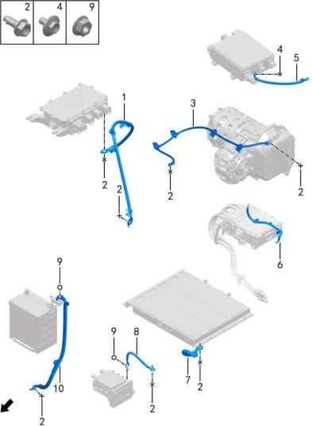

| Поз. | Артикул | Наименование | Кол-во | Системный номер | Примечание |
| ---: | --- | --- | ---: | --- | --- |
| 1 | 372433001 | Провод массы высоковольтного блока | 1 | H97A3730304AA |  |
| 2 | Q11004003 | Болт массы | 8 | HQ1840614N1 |  |
| 3 | 372430001 | Задний электродвигатель провод массы | 1 | H97A3730105AA |  |
| 4 | Q11001095 | Фланцевый болт | 2 | HQ1840812N1 |  |
| 5 | 372431001 | Провод массы onboard charger | 1 | H97A3730106AA |  |
| 6 | 372435001 | Жгут массы GCU | 1 | H97A3730309AA |  |
| 7 | 372426002 | Провод массы тяговой батареи | 1 | H97A3730302AA |  |
| 8 | 372434001 | Жгут массы PTC | 1 | H97A3730310AA |  |
| 9 | Q21001010 | Фланцевая гайка | 2 | HQ32406 |  |
| 10 | 372425002 | Провод массы аккумулятора | 1 | H97A3730301AA |  |
| 12 | 350612002 | Стяжка | 1 | Q67405300 |  |

# 7022-11 Жгуты массы

- Описание: версия с рендж-экстендером (ДВС), полный привод

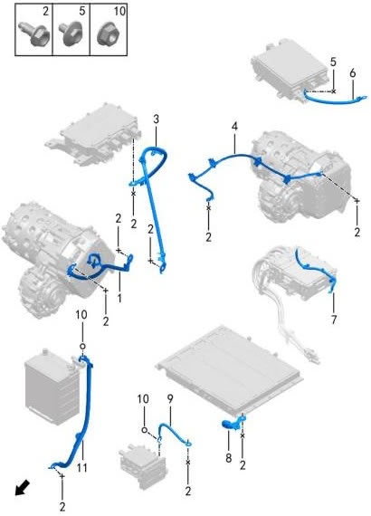

| Поз. | Артикул | Наименование | Кол-во | Системный номер | Примечание |
| ---: | --- | --- | ---: | --- | --- |
| 1 | 372427002 | Провод массы переднего двигателя | 1 | H97A3730303AA |  |
| 2 | Q11004003 | Болт массы | 10 | HQ1840614N1 |  |
| 3 | 372433001 | Провод массы высоковольтного блока | 1 | H97A3730304AA |  |
| 4 | 372430001 | Задний электродвигатель провод массы | 1 | H97A3730105AA |  |
| 5 | Q11001095 | Фланцевый болт | 2 | HQ1840812N1 |  |
| 6 | 372431001 | Провод массы onboard charger | 1 | H97A3730106AA |  |
| 7 | 372435001 | Жгут массы GCU | 1 | H97A3730309AA |  |
| 8 | 372426002 | Провод массы тяговой батареи | 1 | H97A3730302AA |  |
| 9 | 372434001 | Жгут массы PTC | 1 | H97A3730310AA |  |
| 10 | Q21001010 | Фланцевая гайка | 2 | HQ32406 |  |
| 11 | 372425002 | Провод массы аккумулятора | 1 | H97A3730301AA |  |
| 12 | 350612002 | Стяжка | 1 | Q67405300 |  |

# 7022-12 Жгуты массы

- Описание: электрическая версия, задний привод

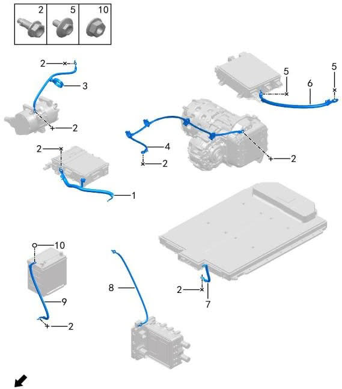

| Поз. | Артикул | Наименование | Кол-во | Системный номер | Примечание |
| ---: | --- | --- | ---: | --- | --- |
| 1 | 372429001 | Провод массы высоковольтного блока | 1 | H97A3730204AA |  |
| 2 | Q11004003 | Болт массы | 13 | HQ1840614N1 |  |
| 3 | 372432001 | Компрессор провод массы | 1 | H97A3730207AA |  |
| 4 | 372430001 | Задний электродвигатель провод массы | 1 | H97A3730105AA |  |
| 5 | Q11001095 | Фланцевый болт | 2 | HQ1840812N1 |  |
| 6 | 372431001 | Провод массы onboard charger | 1 | H97A3730106AA |  |
| 7 | 372426001 | Провод массы тяговой батареи | 1 | H97A3730202AA |  |
| 8 | 372434002 | Жгут массы PTC | 1 | H97A3730210AA |  |
| 9 | 372425001 | Провод массы аккумулятора | 1 | H97A3730201AA |  |
| 10 | Q21001010 | Фланцевая гайка | 1 | HQ32406 |  |

# 7022-13 Жгуты массы

- Описание: электрическая версия, полный привод

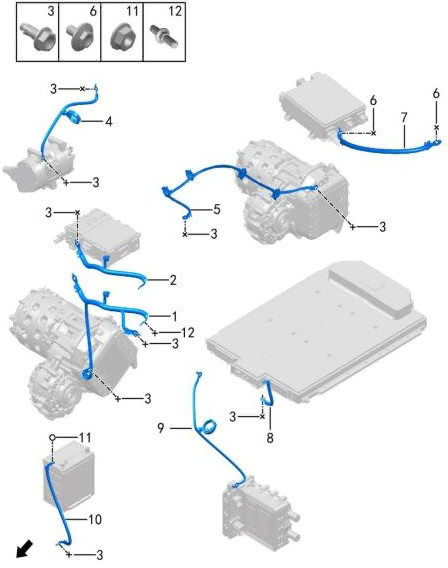

| Поз. | Артикул | Наименование | Кол-во | Системный номер | Примечание |
| ---: | --- | --- | ---: | --- | --- |
| 1 | 372427001 | Провод массы переднего двигателя | 1 | H97A3730203AA |  |
| 2 | 372429001 | Провод массы высоковольтного блока | 1 | H97A3730204AA |  |
| 3 | Q11004003 | Болт массы | 13 | HQ1840614N1 |  |
| 4 | 372432001 | Компрессор провод массы | 1 | H97A3730207AA |  |
| 5 | 372430001 | Задний электродвигатель провод массы | 1 | H97A3730105AA |  |
| 6 | Q11001095 | Фланцевый болт | 2 | HQ1840812N1 |  |
| 7 | 372431001 | Провод массы onboard charger | 1 | H97A3730106AA |  |
| 8 | 372426001 | Провод массы тяговой батареи | 1 | H97A3730202AA |  |
| 9 | 372434003 | Жгут массы PTC | 1 | H97A3730210AB |  |
| 10 | 372425001 | Провод массы аккумулятора | 1 | H97A3730201AA |  |
| 11 | Q21001010 | Фланцевая гайка | 1 | HQ32406 |  |
| 12 | Q11009001 | Шпилька массы | 1 | HQY1300820 |  |

# 7023-10 Аккумулятор

- Описание: версия с рендж-экстендером (ДВС)

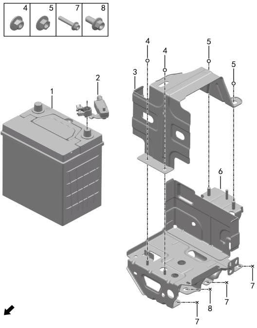

| Поз. | Артикул | Наименование | Кол-во | Системный номер | Примечание |
| ---: | --- | --- | ---: | --- | --- |
| 1 | 370302001 | Аккумулятор | 1 | H97A3703003AA |  |
| 2 | 370301001 | Датчик аккумулятора | 1 | H97A3602812AA |  |
| 3 | 500118002 | Крепежный ремень аккумулятора | 1 | H97A5001104CA |  |
| 4 | Q21008001 | Шестигранная гайка | 2 | HQ32206L |  |
| 5 | Q21008002 | Шестигранная гайка | 2 | HQ32208L1L |  |
| 6 | 500111001 | Монтажный комплект аккумулятора | 1 | H97A5001124CB |  |
| 7 | Q11001004 | Фланцевый болт | 7 | HQ1840616 |  |
| 8 | Q11001015 | Фланцевый болт | 1 | HQ1840816 |  |

# 7023-11 Аккумулятор

- Описание: электрическая версия

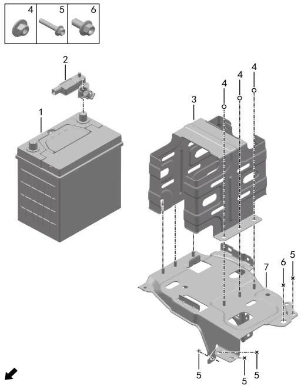

| Поз. | Артикул | Наименование | Кол-во | Системный номер | Примечание |
| ---: | --- | --- | ---: | --- | --- |
| 1 | 370302001 | Аккумулятор | 1 | H97A3703003AA |  |
| 2 | 370301001 | Датчик аккумулятора | 1 | H97A3602812AA |  |
| 3 | 500118001 | Крепежный ремень аккумулятора | 1 | H97A5001104AB |  |
| 4 | Q21008001 | Шестигранная гайка | 6 | HQ32206L |  |
| 5 | Q11001004 | Фланцевый болт | 7 | HQ1840616 |  |
| 6 | Q11001015 | Фланцевый болт | 1 | HQ1840816 |  |
| 7 | 500120000 | Кронштейн площадки аккумулятора | 1 | H97A5001125AB |  |

# 7024-10 Разъемы питания

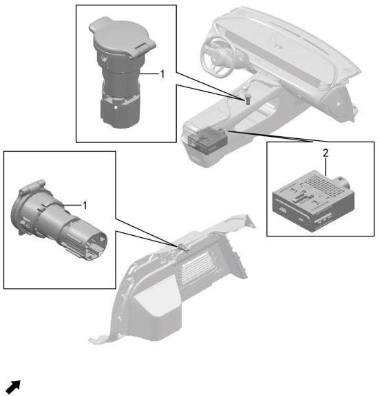

| Поз. | Артикул | Наименование | Кол-во | Системный номер | Примечание |
| ---: | --- | --- | ---: | --- | --- |
| 1 | 372501001 | Розетка 12V | 2 | H97A3725001AA |  |
| 2 | 362901001BKGE | USB-зарядка | 1 | H97A3629002AABKGE | черный |
| 2 | 362901001BEGE | USB-зарядка | 1 | H97A3629002AABEGE | бежевый |
| 2 | 362901001BLGC | USB-зарядка | 1 | H97A3629002AABLGC | синий |

# 7025-10 Беспроводная зарядка телефона

- Описание: версия с рендж-экстендером (ДВС): N1/N2 опция, N3 стандартно; электрическая версия: N1 опция, N2/N3 стандартно

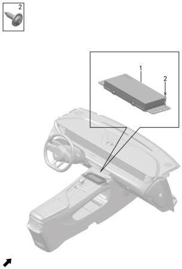

| Поз. | Артикул | Наименование | Кол-во | Системный номер | Примечание |
| ---: | --- | --- | ---: | --- | --- |
| 1 | 363001001 | Контроллер зарядки телефона | 1 | H97A3609006AA |  |
| 2 | Q12002003 | Самонарезающий винт | 4 | Q221B4216 |  |

# 7026-10 Передние фары

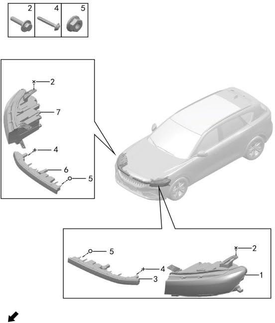

| Поз. | Артикул | Наименование | Кол-во | Системный номер | Примечание |
| ---: | --- | --- | ---: | --- | --- |
| 1 | 371101001 | Левая передняя фара | 1 | H97A3711001AA | передняя фара: LED |
| 1 | 371101002 | Левая передняя фара | 1 | H97A3711001BA | передняя фара: матричная LED |
| 2 | Q11002040 | Болт | 8 | HQ146B0630L2L |  |
| 3 | 371103001 | Левый передний габаритный огонь | 1 | H97A3711003AA |  |
| 4 | Q12002007 | Самонарезающий винт | 2 | HQY27A0530 |  |
| 5 | Q21001002 | Фланцевая гайка | 4 | HQ32006 |  |
| 6 | 371104001 | Правый передний габаритный огонь | 1 | H97A3711004AA |  |
| 7 | 371102001 | Правая передняя фара | 1 | H97A3711002AA | замена на 371102003 |
| 7 | 371102003 | Правая передняя фара | 1 | H97A3711002AB | передняя фара: LED |
| 7 | 371102002 | Правая передняя фара | 1 | H97A3711002BA | замена на 371102004 |
| 7 | 371102004 | Правая передняя фара | 1 | H97A3711002BB | передняя фара: матричная LED |

# 7027-10 Противотуманные фонари

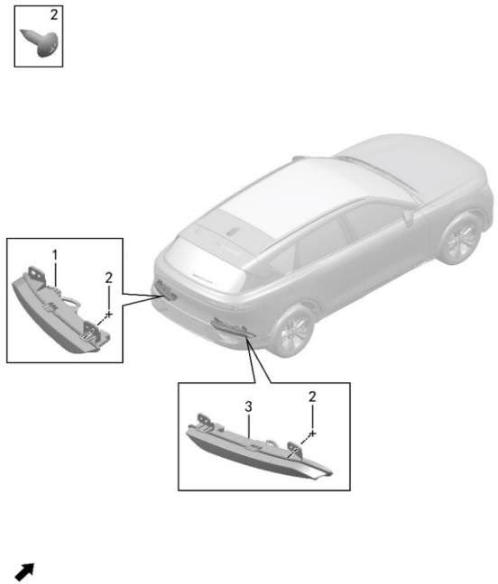

| Поз. | Артикул | Наименование | Кол-во | Системный номер | Примечание |
| ---: | --- | --- | ---: | --- | --- |
| 1 | 371603001 | Левый задний противотуманный фонарь | 1 | H97A3716003AA |  |
| 2 | Q12002015 | Самонарезающий винт | 8 | Q2734816 |  |
| 3 | 371604001 | Правый задний противотуманный фонарь | 1 | H97A3716004AA |  |

# 7028-10 Задние фонари

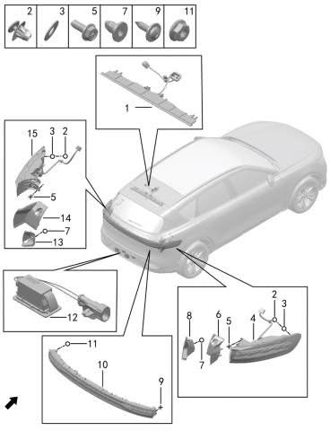

| Поз. | Артикул | Наименование | Кол-во | Системный номер | Примечание |
| ---: | --- | --- | ---: | --- | --- |
| 1 | 371608001 | Высокий стоп-сигнал | 1 | H97A3716009AA |  |
| 2 | 371611001 | Клипса | 2 | 8220313-RA01 |  |
| 3 | 820001001 | Уплотнительный поролон фигурной клипсы | 2 | 8200011-RA01 |  |
| 4 | 371602001 | Правый задний комбинированный фонарь | 1 | H97A3716002AA |  |
| 5 | Q11002020 | Болт | 6 | HQY1470616T8X1 |  |
| 6 | 371610001 | Правая боковая панель неподвижной секции заднего комбинированного фонаря | 1 | H97A3716012AA |  |
| 7 | Q41001005 | Клипса | 2 | HQY37602 |  |
| 8 | 371607001 | Правая боковая панель подвижной секции заднего комбинированного фонаря | 1 | H97A3716008AA |  |
| 9 | Q12002003 | Самонарезающий винт | 2 | Q221B4216 |  |
| 10 | 371605001 | Подвижная секция заднего комбинированного фонаря | 1 | H97A3716006AA |  |
| 11 | Q21001002 | Фланцевая гайка | 6 | HQ32006 |  |
| 12 | 371701001 | Подсветка номера | 2 | 4108010-RA01 |  |
| 13 | 371606001 | Левая боковая панель подвижной секции заднего комбинированного фонаря | 1 | H97A3716007AA |  |
| 14 | 371609001 | Левая боковая панель неподвижной секции заднего комбинированного фонаря | 1 | H97A3716011AA |  |
| 15 | 371601001 | Левый задний комбинированный фонарь | 1 | H97A3716001AA |  |

# 7029-10 Внешний индикатор зарядки

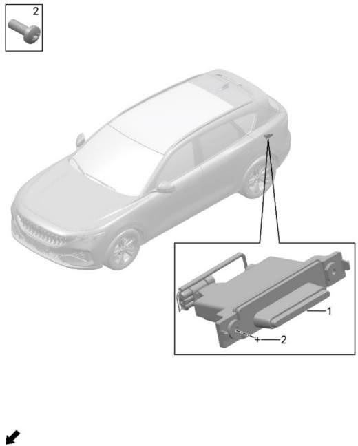

| Поз. | Артикул | Наименование | Кол-во | Системный номер | Примечание |
| ---: | --- | --- | ---: | --- | --- |
| 1 | 840411001 | Индикатор зарядки | 1 | H97A8404013AA |  |
| 2 | Q12001006 | Винт с внутренним шестигранником | 2 | Q215B0616T1F62 |  |

# 7030-10 Салонное освещение

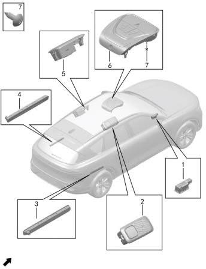

| Поз. | Артикул | Наименование | Кол-во | Системный номер | Примечание |
| ---: | --- | --- | ---: | --- | --- |
| 1 | 371414001 | Точечный источник света | 4 | H97A3718016AA |  |
| 2 | 371402002BEGE | Правый задний плафон | 1 | H97A3714002BBBEGE | замена на 371402003BEGE |
| 2 | 371402003BEGE | Правый задний плафон | 1 | H97A3714002BCBEGE | бежевый |
| 2 | 371402002BLGC | Правый задний плафон | 1 | H97A3714002BBBLGC | замена на 371402003BLGC |
| 2 | 371402003BLGC | Правый задний плафон | 1 | H97A3714002BCBLGC | синий |
| 3 | 371405001 | Правый фонарь багажника | 1 | H97A3718021AA |  |
| 4 | 371404001 | Левый фонарь багажника | 2 | H97A3718001AA |  |
| 5 | 371401002BLGC | Левый задний плафон | 1 | H97A3714001BBBLGC | замена на 371401003BLGC |
| 5 | 371401003BLGC | Левый задний плафон | 1 | H97A3714001BCBLGC | синий |
| 5 | 371401002BEGE | Левый задний плафон | 1 | H97A3714001BBBEGE | замена на 371401003BEGE |
| 5 | 371401003BEGE | Левый задний плафон | 1 | H97A3714001BCBEGE | бежевый |
| 6 | 371403004 | Передний плафон | 1 | H97A3714005AC | замена на 371403006 |
| 6 | 371403006 | Передний плафон | 1 | H97A3714005AD | без контроля безопасности в салоне, без стеклянной крыши |
| 6 | 371403002BLGC | Передний плафон | 1 | H97A3714005BBBLGC | замена на 371403004BLGC |
| 6 | 371403004BLGC | Передний плафон | 1 | H97A3714005BCBLGC | замена на 371403006BLGC |
| 6 | 371403007BLGC | Передний плафон | 1 | H97A3714005BDBLGC | мониторинг пассажиров, без стеклянной крыши, синий |
| 6 | 371403002BEGE | Передний плафон | 1 | H97A3714005BBBEGE | замена на 371403004BEGE |
| 6 | 371403004BEGE | Передний плафон | 1 | H97A3714005BCBEGE | замена на 371403006BEGE |
| 6 | 371403008BEGE | Передний плафон | 1 | H97A3714005BDBEGE | мониторинг пассажиров, без стеклянной крыши, бежевый |
| 6 | 371403003BLGC | Передний плафон | 1 | H97A3714005CBBLGC | замена на 371403005BLGC |
| 6 | 371403005BLGC | Передний плафон | 1 | H97A3714005CCBLGC | замена на 371403007BLGC |
| 6 | 371403010BLGC | Передний плафон | 1 | H97A3714005CDBLGC | мониторинг пассажиров, затемняемое стекло и атмосферная подсветка, синий |
| 6 | 371403003BEGE | Передний плафон | 1 | H97A3714005CBBEGE | замена на 371403005BEGE |
| 6 | 371403005BEGE | Передний плафон | 1 | H97A3714005CCBEGE | замена на 371403007BEGE |
| 6 | 371403009BEGE | Передний плафон | 1 | H97A3714005CDBEGE | мониторинг пассажиров, затемняемое стекло и атмосферная подсветка, бежевый |
| 7 | Q12002015 | Самонарезающий винт | 2 | Q2734816 |  |

# 7032-10 Подсветка дверей

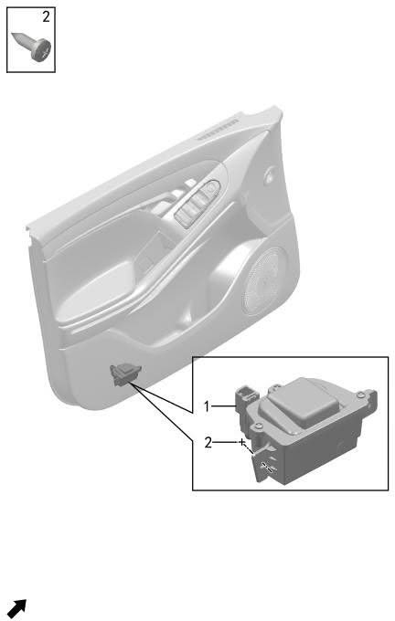

| Поз. | Артикул | Наименование | Кол-во | Системный номер | Примечание |
| ---: | --- | --- | ---: | --- | --- |
| 1 | 371412001 | Левая подсветка передней двери | 1 | H97A3718013AA |  |
| 1 | 371413001 | Правая подсветка передней двери | 1 | H97A3718014AA |  |
| 2 | Q12002011 | Самонарезающий винт | 4 | Q2714816 |  |

# 7033-10 Динамики

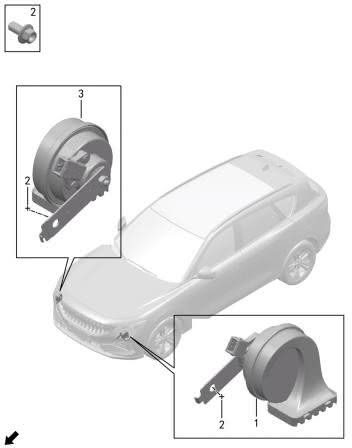

| Поз. | Артикул | Наименование | Кол-во | Системный номер | Примечание |
| ---: | --- | --- | ---: | --- | --- |
| 1 | 372101001 | Низкочастотный динамик | 1 | H97A3721001AA |  |
| 2 | Q11001015 | Фланцевый болт | 2 | HQ1840816 |  |
| 3 | 372102001 | Высокочастотный динамик | 1 | H97A3721002AA |  |

# 7034-10 Контроллер предупреждения пешеходов

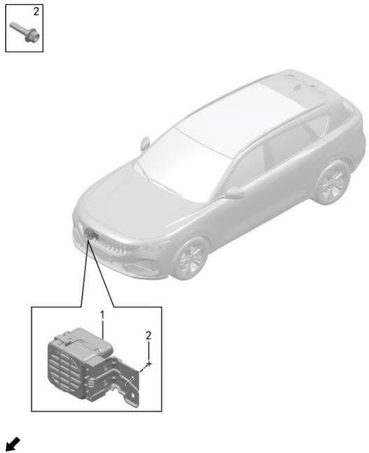

| Поз. | Артикул | Наименование | Кол-во | Системный номер | Примечание |
| ---: | --- | --- | ---: | --- | --- |
| 1 | 362912001 | Контроллер предупреждения пешеходов | 1 | H97A3629827AA |  |
| 2 | Q11001010 | Фланцевый болт | 2 | HQ1840625 |  |

# 7037-10 Система ночного видения

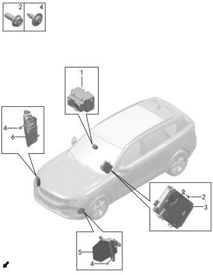

| Поз. | Артикул | Наименование | Кол-во | Системный номер | Примечание |
| ---: | --- | --- | ---: | --- | --- |
| 1 | 791406001 | Камера блока ночного видения | 1 | H97A7914007AA |  |
| 2 | Q11002020 | Болт | 3 | HQY1470616T8X1 |  |
| 3 | 362911001 | Контроллер блока ночного видения | 1 | H97A3629824AA |  |
| 4 | Q12002015 | Самонарезающий винт | 6 | Q2734816 |  |
| 5 | 791410001 | Левая подсветка блока ночного видения | 1 | H97A7914011AA |  |
| 6 | 791411001 | Правая подсветка блока ночного видения | 1 | H97A7914012AA |  |

# 7038-10 Видеорегистратор

- Описание: версия с рендж-экстендером (ДВС): N1, опция

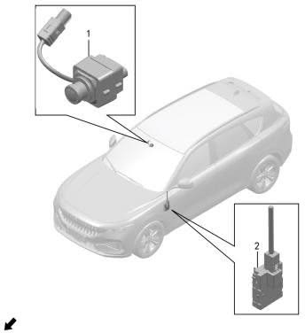

| Поз. | Артикул | Наименование | Кол-во | Системный номер | Примечание |
| ---: | --- | --- | ---: | --- | --- |
| 1 | 791408001 | Камера видеорегистратора | 1 | H97A7914014AA |  |
| 2 | 791409001 | Модуль карты памяти | 1 | H97A7914009AA |  |

# 7039-10 Камера мониторинга водителя

- Описание: версия с рендж-экстендером (ДВС): N1, опция

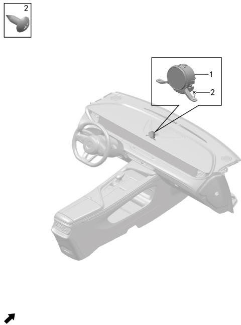

| Поз. | Артикул | Наименование | Кол-во | Системный номер | Примечание |
| ---: | --- | --- | ---: | --- | --- |
| 1 | 791407001 | Камера мониторинга водителя | 1 | H97A7914013AA |  |
| 2 | Q12002013 | Самонарезающий винт | 2 | Q2734213 |  |

# 7040-10 Контроллер камер автомобиля

- Описание: версия с рендж-экстендером (ДВС): N1, опция

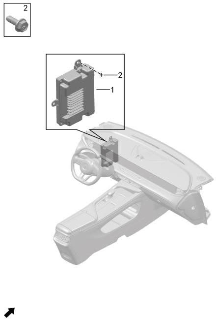

| Поз. | Артикул | Наименование | Кол-во | Системный номер | Примечание |
| ---: | --- | --- | ---: | --- | --- |
| 1 | 362909001 | Контроллер камер автомобиля | 1 | H97A3629818AA | замена на 362909002 |
| 1 | 362909002 | Контроллер камер автомобиля | 1 | H97A3629818AB |  |
| 2 | Q11002020 | Болт | 3 | HQY1470616T8X1 |  |

# 7041-10 Камера мониторинга заднего ряда

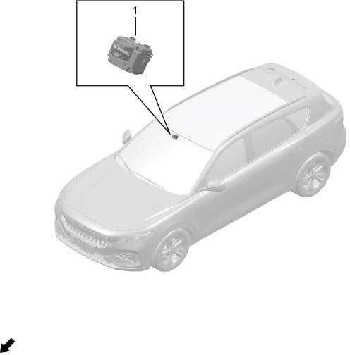

| Поз. | Артикул | Наименование | Кол-во | Системный номер | Примечание |
| ---: | --- | --- | ---: | --- | --- |
| 1 | 791405001 | Камера мониторинга заднего ряда | 1 | H97A7914006AA |  |

# 7042-10 Сенсорная панель

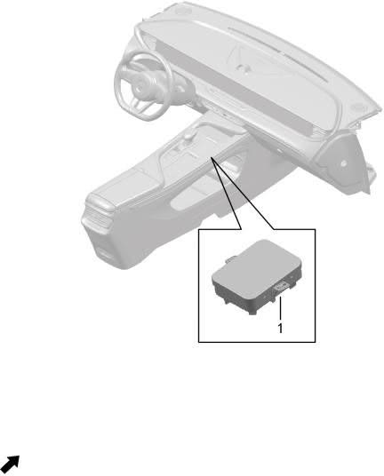

| Поз. | Артикул | Наименование | Кол-во | Системный номер | Примечание |
| ---: | --- | --- | ---: | --- | --- |
| 1 | 374801001 | Сенсорная панель | 1 | H97A3748001AA |  |

# 7043-10 Переключатели

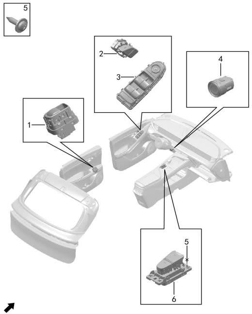

| Поз. | Артикул | Наименование | Кол-во | Системный номер | Примечание |
| ---: | --- | --- | ---: | --- | --- |
| 1 | 374601001 | Переключатель стеклоподъемника | 3 | H97A3746002AA |  |
| 2 | 372004001 | Переключатель центрального замка | 1 | H97A3720008AA |  |
| 3 | 372001001 | Переключатель окна левой передней двери | 1 | H97A3605815AA |  |
| 4 | 372003001 | Кнопка запуска | 1 | H97A3720006AA |  |
| 5 | Q12002003 | Самонарезающий винт | 6 | Q221B4216 |  |
| 6 | 372005001 | Выключатель электронного стояночного тормоза | 1 | H97A3720009AA |  |

# 7044-10 Комбинированные переключатели

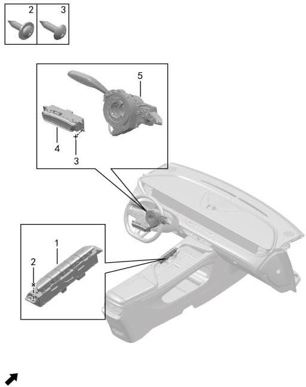

| Поз. | Артикул | Наименование | Кол-во | Системный номер | Примечание |
| ---: | --- | --- | ---: | --- | --- |
| 1 | 373501001 | Комбинированный переключатель центральной консоли | 1 | H97A3735002AA | автопарковка: нет |
| 1 | 373501002 | Комбинированный переключатель центральной консоли | 1 | H97A3735002BA | автопарковка: есть |
| 2 | Q12002003 | Самонарезающий винт | 6 | Q221B4216 |  |
| 3 | Q12002014 | Самонарезающий винт | 2 | Q2734216 |  |
| 4 | 370901001 | Переключатель света | 1 | H97A3709001AA |  |
| 5 | 372002001 | Переключатель рулевой колонки | 1 | H97A3720005AA | замена на 372002002 |
| 5 | 372002002 | Переключатель рулевой колонки | 1 | H97A3720005AB |  |

# 7045-10 Управление открытием и закрытием двери багажника

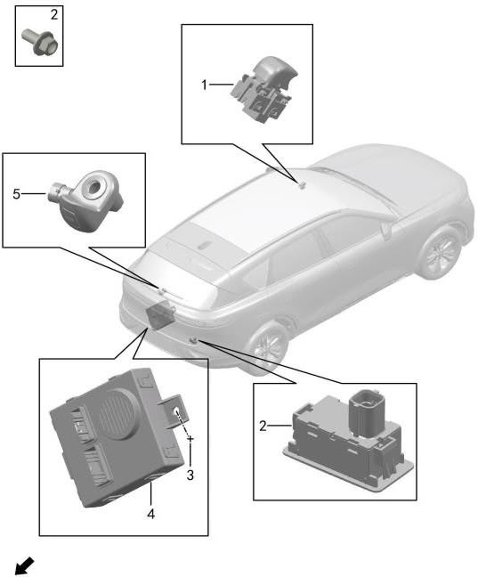

| Поз. | Артикул | Наименование | Кол-во | Системный номер | Примечание |
| ---: | --- | --- | ---: | --- | --- |
| 1 | 372006001 | Переключатель двери багажника | 1 | H97A3720011AA |  |
| 2 | 372007001 | Переключатель закрытия двери багажника | 1 | H97A3720012AA |  |
| 3 | Q11001001 | Фланцевый болт | 2 | HQ1840612 |  |
| 4 | 361601001 | Контроллер электропривода двери багажника | 1 | H97A3605800AA | замена на 361601004 |
| 4 | 361601004 | Контроллер электропривода двери багажника | 1 | H97A3605800AB | замена на 361601005 |
| 4 | 361601005 | Контроллер электропривода двери багажника | 1 | H97A3605800AC |  |
| 5 | 372008001 | Переключатель открытия крышки багажника | 1 | H97A3720013AA | замена на 372008002 |
| 5 | 372008002 | Переключатель открытия крышки багажника | 1 | H97A3720013AB |  |

# 7046-10 Мультимедийная головная система

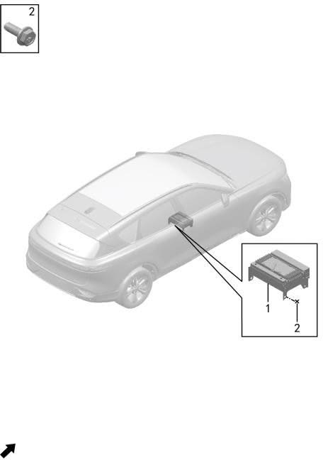

| Поз. | Артикул | Наименование | Кол-во | Системный номер | Примечание |
| ---: | --- | --- | ---: | --- | --- |
| 1 | 790901001 | Головное устройство MP5 | 1 | H97A3631800AA | аудиосистема: обычная |
| 1 | 790901002 | Головное устройство MP5 | 1 | H97A3631800BA | аудиосистема: Dynaudio |
| 2 | Q11002020 | Болт | 4 | HQY1470616T8X1 |  |

# 7047-10 Мультимедийный дисплей

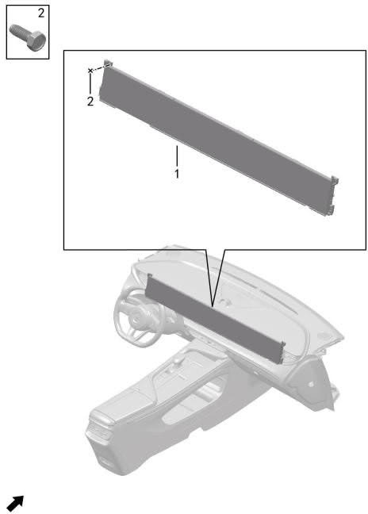

| Поз. | Артикул | Наименование | Кол-во | Системный номер | Примечание |
| ---: | --- | --- | ---: | --- | --- |
| 1 | 791201001 | Мультимедийный дисплей | 1 | H97A7912002AA |  |
| 2 | Q11002034 | Болт | 7 | HQY2790616 |  |

# 7048-10 Антенны

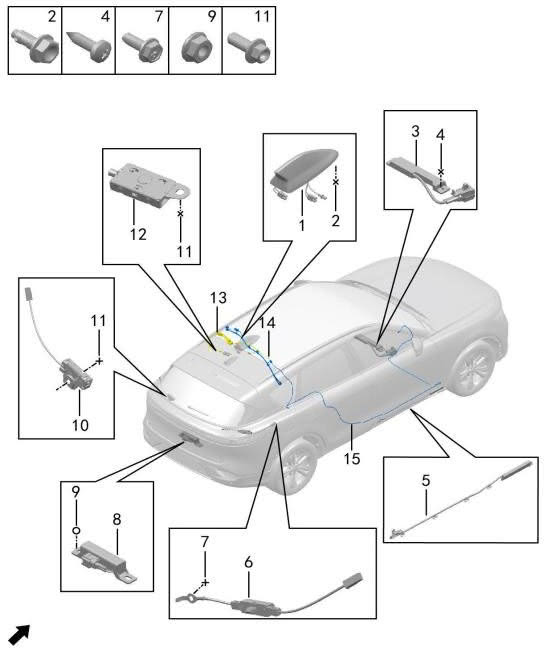

| Поз. | Артикул | Наименование | Кол-во | Системный номер | Примечание |
| ---: | --- | --- | ---: | --- | --- |
| 1 | 790303001 | Плавниковая антенна | 1 | H97A7903003AA |  |
| 2 | Q11004003 | Болт массы | 2 | HQ1840614N1 |  |
| 3 | 790307001 | Передняя PS-антенна | 1 | H97A7903011AA |  |
| 4 | Q12002008 | Самонарезающий винт | 2 | Q2713513 |  |
| 5 | 790305001 | Антенна бесключевого доступа левой передней двери | 1 | H97A7903009AA |  |
| 5 | 790306001 | Антенна бесключевого доступа правой передней двери | 1 | H97A7903010AA |  |
| 6 | 790310001 | Минусовой фильтр | 1 | H97A7903007AA |  |
| 7 | Q11002020 | Болт | 1 | HQY1470616T8X1 |  |
| 8 | 790308001 | Задняя PS-антенна | 2 | H97A7903012AA |  |
| 9 | Q21001002 | Фланцевая гайка | 4 | HQ32006 |  |
| 10 | 790309001 | Плюсовой фильтр | 1 | H97A7903006AA |  |
| 11 | Q11001018 | Фланцевый болт | 2 | HQ1840820 |  |
| 12 | 790311001 | Антенный усилитель | 1 | H97A7903008AA |  |
| 13 | 790302002 | Задний антенный кабель | 1 | H97A7903901AB |  |
| 14 | 790304001 | Антенный кабель | 1 | H97A7903004AA |  |
| 15 | 790301001 | Передний антенный кабель | 1 | H97A7903001AA |  |

# 7050-10 Акустические динамики

- Описание: N1 стандартно; электрическая версия: N2 стандартно

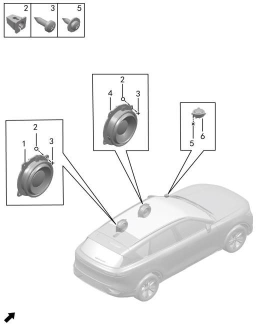

| Поз. | Артикул | Наименование | Кол-во | Системный номер | Примечание |
| ---: | --- | --- | ---: | --- | --- |
| 1 | 790907001 | Низкочастотный динамик задней двери | 2 | H97A7909007AA |  |
| 2 | Q21004005 | Пластиковая гайка | 16 | HQY37803 |  |
| 3 | Q12002011 | Самонарезающий винт | 16 | Q2714816 |  |
| 4 | 790902001 | Низкочастотный динамик передней двери | 2 | H97A7909001AA |  |
| 5 | Q12002002 | Самонарезающий винт | 12 | HQY27A0385 |  |
| 6 | 790903003 | Высокочастотный динамик | 4 | H97A7909002CA |  |

# 7050-20 Акустические динамики

- Описание: N1 опция; N3 стандартно; версия с рендж-экстендером (ДВС): N2 стандартно

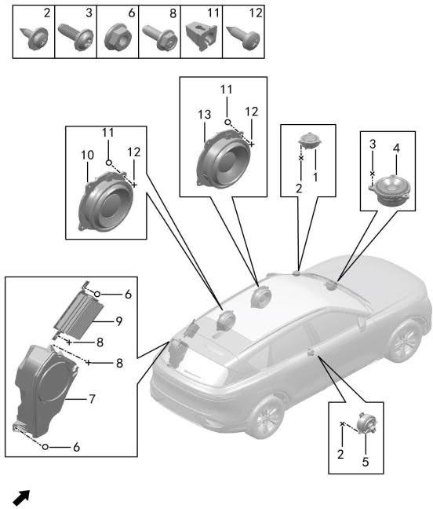

| Поз. | Артикул | Наименование | Кол-во | Системный номер | Примечание |
| ---: | --- | --- | ---: | --- | --- |
| 1 | 790903001 | Высокочастотный динамик | 2 | H97A7909002AA |  |
| 2 | Q12002002 | Самонарезающий винт | 12 | HQY27A0385 |  |
| 3 | Q12001016 | Винт с внутренним шестигранником | 3 | HQY27A0514 |  |
| 4 | 790904001 | Центральный динамик | 1 | H97A7909003AA |  |
| 5 | 790903002 | Высокочастотный динамик | 2 | H97A7909002BA |  |
| 6 | Q21001002 | Фланцевая гайка | 4 | HQ32006 |  |
| 7 | 790905001 | Сабвуфер | 1 | H97A7909004AA |  |
| 8 | Q11002020 | Болт | 7 | HQY1470616T8X1 |  |
| 9 | 790906001 | Усилитель | 1 | H97A7909006AA | замена на 790906002 |
| 9 | 790906002 | Усилитель | 1 | H97A7909006AB |  |
| 10 | 790907002 | Низкочастотный динамик задней двери | 2 | H97A7909007BA |  |
| 11 | Q21004005 | Пластиковая гайка | 16 | HQY37803 |  |
| 12 | Q12002011 | Самонарезающий винт | 16 | Q2714816 |  |
| 13 | 790902002 | Низкочастотный динамик передней двери | 2 | H97A7909001BA |  |

# 7051-10 Микрофоны

- Описание: N1 стандартно

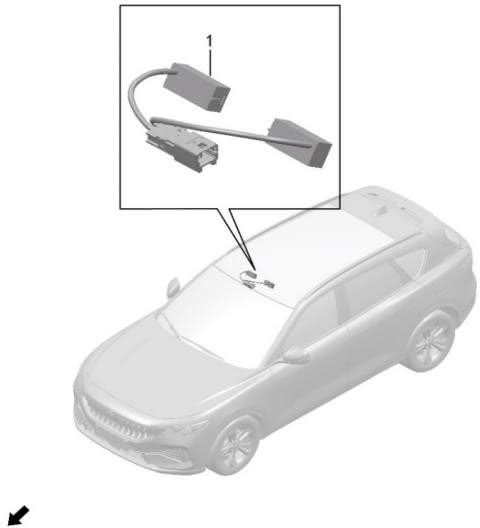

| Поз. | Артикул | Наименование | Кол-во | Системный номер | Примечание |
| ---: | --- | --- | ---: | --- | --- |
| 1 | 791102003 | Микрофоны | 1 | H97A7911003AA |  |

# 7051-11 Микрофоны

- Описание: N2 и N3 стандартно

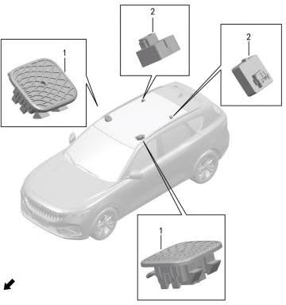

| Поз. | Артикул | Наименование | Кол-во | Системный номер | Примечание |
| ---: | --- | --- | ---: | --- | --- |
| 1 | 791102001BLGF | Микрофоны | 2 | H97A7911001AABLGF | светло-коричневый, синий |
| 1 | 791102001BEGC | Микрофоны | 2 | H97A7911001AABEGC | бежевый |
| 2 | 791102002 | Микрофоны | 2 | H97A7911002AA |  |

# 7052-10 Телематический блок

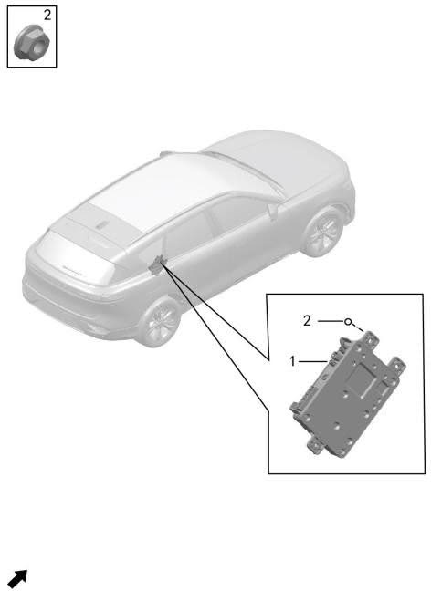

| Поз. | Артикул | Наименование | Кол-во | Системный номер | Примечание |
| ---: | --- | --- | ---: | --- | --- |
| 1 | 363005001 | T-BOX | 1 | H97A3630800AA | замена на 363005002 |
| 1 | 363005002 | T-BOX | 1 | H97A3630800AB |  |
| 2 | Q11001008 | Фланцевый болт | 2 | HQ1840620 |  |

# 7053-10 Бесключевой доступ и запуск

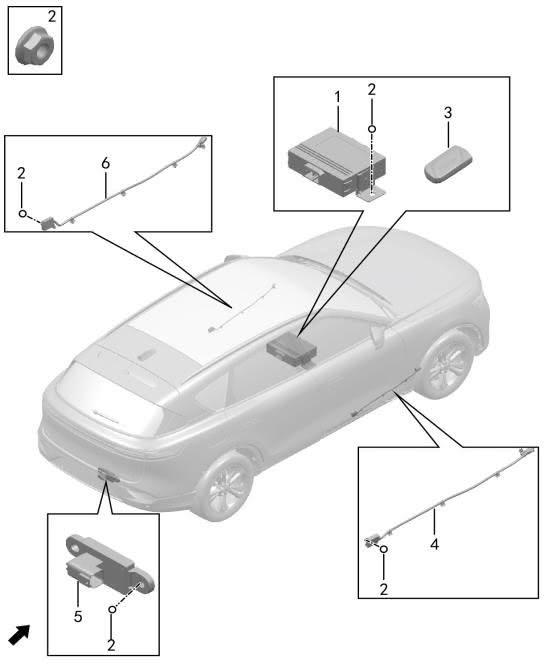

| Поз. | Артикул | Наименование | Кол-во | Системный номер | Примечание |
| ---: | --- | --- | ---: | --- | --- |
| 1 | 360901001 | Основной Bluetooth-модуль | 1 | H97A3609800AA | замена на 360901002 |
| 1 | 360901002 | Основной Bluetooth-модуль | 1 | H97A3609800AB |  |
| 2 | Q21001002 | Фланцевая гайка | 4 | HQ32006 |  |
| 3 | 370401002 | Интеллектуальный пульт-ключ | 2 | H97A3719900AA |  |
| 4 | 363003001 | Правый передний дополнительный Bluetooth-модуль двери | 1 | H97A3609806AA |  |
| 5 | 360902001 | Дополнительный Bluetooth-модуль | 1 | H97A3609809AA |  |
| 6 | 363002001 | Левый передний дополнительный Bluetooth-модуль двери | 1 | H97A3609803AA |  |

# 7054-10 Система сенсорного открытия ногой

- Описание: N1 опция, N2 и N3 стандартно

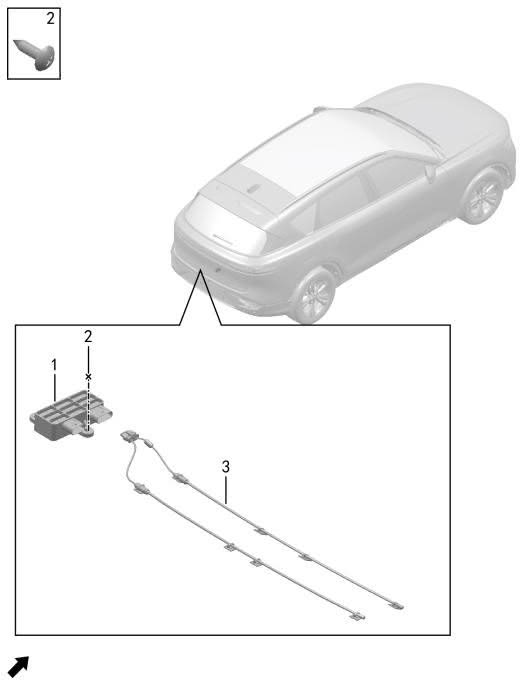

| Поз. | Артикул | Наименование | Кол-во | Системный номер | Примечание |
| ---: | --- | --- | ---: | --- | --- |
| 1 | 360207001 | Контроллер сенсора открытия ногой | 1 | H97A3602806AA |  |
| 2 | Q12002014 | Самонарезающий винт | 3 | Q2734216 |  |
| 3 | 360204001 | Сенсорная планка открытия ногой | 1 | H97A3602009AA |  |

# 7055-10 Устройства управления кузовом

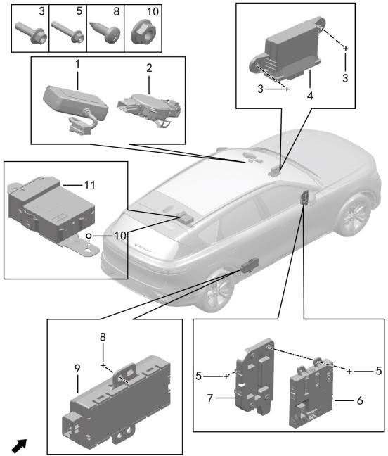

| Поз. | Артикул | Наименование | Кол-во | Системный номер | Примечание |
| ---: | --- | --- | ---: | --- | --- |
| 1 | 362913001 | Система бесконтактной оплаты проезда | 1 | H97A3629839AA |  |
| 2 | 360206001 | Датчик дождя и освещенности | 1 | H97A3602803AA |  |
| 3 | Q21001002 | Фланцевая гайка | 3 | HQ32006 |  |
| 4 | 363004001 | Шлюз | 1 | H97A3630803AA | замена на 363004002 |
| 4 | 363004002 | Шлюз | 1 | H97A3630803AB |  |
| 5 | Q11001004 | Фланцевый болт | 7 | HQ1840616 |  |
| 6 | 361001004 | Центральный блок управления | 1 | H97A3610803AC |  |
| 6 | 361001003 | Центральный блок управления | 1 | H97A3610803AB | замена на 361001004 |
| 6 | 361001002 | Центральный блок управления | 1 | H97A3610803AA | замена на 361001003 |
| 7 | 361002001 | Кронштейн центрального блока управления | 1 | H97A3610001AA |  |
| 8 | Q12002011 | Самонарезающий винт | 8 | Q2714816 |  |
| 9 | 361603001 | Контроллер дверной ручки | 4 | H97A3605812AA | замена на 361603002 |
| 9 | 361603002 | Контроллер дверной ручки | 4 | H97A3605812AB |  |
| 10 | Q21001002 | Фланцевая гайка | 2 | HQ32006 |  |
| 11 | 361602001 | Контроллер защиты стекол от защемления | 1 | H97A3605806AA |  |

# 7056-10 Предохранители и реле жгута переднего отсека

- Описание: передний отсек, версия с рендж-экстендером (ДВС)

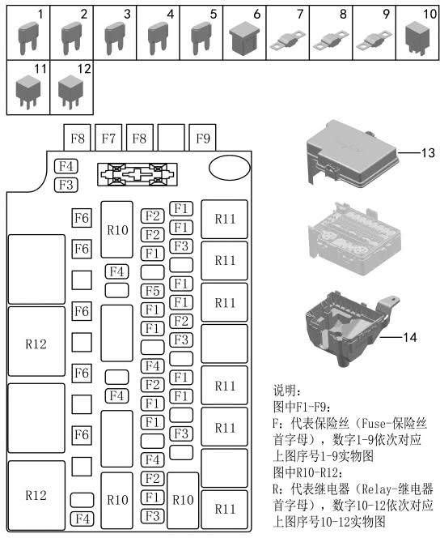

| Поз. | Артикул | Наименование | Кол-во | Системный номер | Примечание |
| ---: | --- | --- | ---: | --- | --- |
| 1 | 372301001 | Предохранитель (MINI) | 12 | H97A3723402AA |  |
| 2 | 372301002 | Предохранитель (MINI) | 5 | H97A3723403AA |  |
| 3 | 372301003 | Предохранитель (MINI) | 5 | H97A3723404AA |  |
| 4 | 372301004 | Предохранитель (MINI) | 6 | H97A3723405AA |  |
| 5 | 372301005 | Предохранитель (MINI) | 1 | H97A3723407AA |  |
| 6 | 372302002 | Предохранитель (JCASE) | 5 | H97A3723409AA |  |
| 7 | 372303001 | Предохранитель (MIDI) | 1 | H97A3723412AA |  |
| 8 | 372303002 | Предохранитель (MIDI) | 2 | H97A3723413AA |  |
| 9 | 372303003 | Предохранитель (MIDI) | 1 | H97A3723418AA |  |
| 10 | 372304004 | Реле | 3 | H97A3723427AA |  |
| 11 | 372304002 | Реле | 6 | H97A3723425AA |  |
| 12 | 372304003 | Реле | 2 | H97A3723426AA |  |
| 13 | 372305001 | Верхняя крышка блока предохранителей | 1 | H97A3723201AA |  |
| 14 | 372306001 | Нижняя крышка блока предохранителей | 1 | H97A3723202AA |  |
| 15 | 372301007 | Предохранитель (MINI) | 1 | H97A3723401AA |  |

# 7056-11 Предохранители и реле жгута переднего отсека

- Описание: передний отсек, электрическая версия

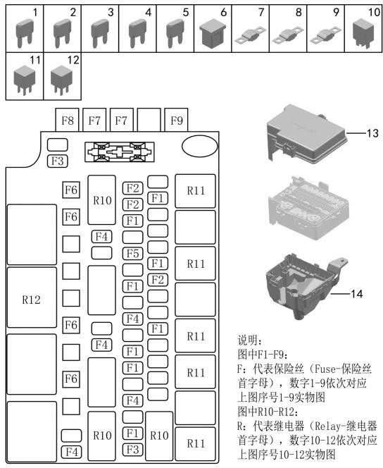

| Поз. | Артикул | Наименование | Кол-во | Системный номер | Примечание |
| ---: | --- | --- | ---: | --- | --- |
| 1 | 372301001 | Предохранитель (MINI) | 8 | H97A3723402AA |  |
| 2 | 372301002 | Предохранитель (MINI) | 3 | H97A3723403AA |  |
| 3 | 372301003 | Предохранитель (MINI) | 2 | H97A3723404AA |  |
| 4 | 372301004 | Предохранитель (MINI) | 5 | H97A3723405AA |  |
| 5 | 372301005 | Предохранитель (MINI) | 1 | H97A3723407AA |  |
| 6 | 372302002 | Предохранитель (JCASE) | 4 | H97A3723409AA |  |
| 7 | 372303001 | Предохранитель (MIDI) | 2 | H97A3723412AA |  |
| 8 | 372303002 | Предохранитель (MIDI) | 1 | H97A3723413AA |  |
| 9 | 372303003 | Предохранитель (MIDI) | 1 | H97A3723418AA |  |
| 10 | 372304004 | Реле | 3 | H97A3723427AA |  |
| 11 | 372304002 | Реле | 5 | H97A3723425AA |  |
| 12 | 372304003 | Реле | 1 | H97A3723426AA |  |
| 13 | 372305001 | Верхняя крышка блока предохранителей | 1 | H97A3723201AA |  |
| 14 | 372306001 | Нижняя крышка блока предохранителей | 1 | H97A3723202AA |  |
| 15 | 372301007 | Предохранитель (MINI) | 1 | H97A3723401AA |  |

# 7057-10 Предохранители и реле салонного жгута

- Описание: салон, версия с рендж-экстендером (ДВС)

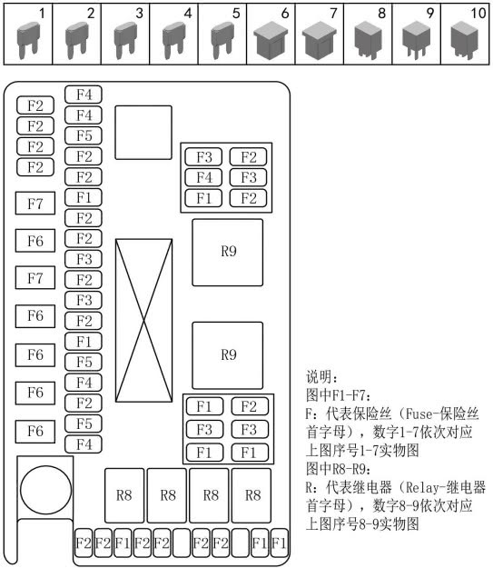

| Поз. | Артикул | Наименование | Кол-во | Системный номер | Примечание |
| ---: | --- | --- | ---: | --- | --- |
| 1 | 372301001 | Предохранитель (MINI) | 9 | H97A3723402AA |  |
| 2 | 372301002 | Предохранитель (MINI) | 20 | H97A3723403AA |  |
| 3 | 372301003 | Предохранитель (MINI) | 6 | H97A3723404AA |  |
| 4 | 372301004 | Предохранитель (MINI) | 5 | H97A3723405AA |  |
| 5 | 372301005 | Предохранитель (MINI) | 3 | H97A3723407AA |  |
| 6 | 372302001 | Предохранитель (JCASE) | 5 | H97A3723408AA |  |
| 7 | 372302002 | Предохранитель (JCASE) | 2 | H97A3723409AA |  |
| 8 | 372304002 | Реле | 4 | H97A3723425AA |  |
| 9 | 372304003 | Реле | 2 | H97A3723426AA |  |
| 10 | 372304004 | Реле | 3 | H97A3723427AA |  |

# 7057-11 Предохранители и реле салонного жгута

- Описание: салон, электрическая версия

| Поз. | Артикул | Наименование | Кол-во | Системный номер | Примечание |
| ---: | --- | --- | ---: | --- | --- |
| 1 | 372301001 | Предохранитель (MINI) | 8 | H97A3723402AA |  |
| 2 | 372301002 | Предохранитель (MINI) | 20 | H97A3723403AA |  |
| 3 | 372301003 | Предохранитель (MINI) | 6 | H97A3723404AA |  |
| 4 | 372301004 | Предохранитель (MINI) | 5 | H97A3723405AA |  |
| 5 | 372301005 | Предохранитель (MINI) | 3 | H97A3723407AA |  |
| 6 | 372302001 | Предохранитель (JCASE) | 5 | H97A3723408AA |  |
| 7 | 372302002 | Предохранитель (JCASE) | 2 | H97A3723409AA |  |
| 8 | 372304002 | Реле | 2 | H97A3723425AA |  |
| 9 | 372304003 | Реле | 2 | H97A3723426AA |  |
| 10 | 372304004 | Реле | 3 | H97A3723427AA |  |
