- [5011-10 Передний пол кузова](#5011-10-передний-пол-кузова)
- [5011-11 Передний пол кузова](#5011-11-передний-пол-кузова)
- [5012-10 Задний пол кузова](#5012-10-задний-пол-кузова)
- [5012-11 Задний пол кузова](#5012-11-задний-пол-кузова)
- [5013-10 Кузовные заглушки](#5013-10-кузовные-заглушки)
- [5014-10 Щит передней перегородки](#5014-10-щит-передней-перегородки)
- [5015-10 Передний отсек](#5015-10-передний-отсек)
- [5016-10 Нижние защитные панели](#5016-10-нижние-защитные-панели)
- [5017-10 Капот](#5017-10-капот)
- [5018-10 Передние крылья](#5018-10-передние-крылья)
- [5019-10 Боковина кузова](#5019-10-боковина-кузова)
- [5020-10 Передние стойки кузова](#5020-10-передние-стойки-кузова)
- [5020-11 Передние стойки кузова](#5020-11-передние-стойки-кузова)
- [5022-10 Задние стойки кузова](#5022-10-задние-стойки-кузова)
- [5023-10 Подкрылки](#5023-10-подкрылки)
- [5024-10 Задняя панель](#5024-10-задняя-панель)
- [5025-10 Багажник и дверь багажника](#5025-10-багажник-и-дверь-багажника)
- [5026-10 Замок двери багажника](#5026-10-замок-двери-багажника)
- [5027-10 Крыша](#5027-10-крыша)
- [5027-11 Крыша](#5027-11-крыша)
- [5028-10 Передние двери](#5028-10-передние-двери)
- [5029-10 Замок передней двери](#5029-10-замок-передней-двери)
- [5030-10 Стекла передних дверей](#5030-10-стекла-передних-дверей)
- [5031-10 Задние двери](#5031-10-задние-двери)
- [5032-10 Замок задней двери](#5032-10-замок-задней-двери)
- [5033-10 Стекла задних дверей](#5033-10-стекла-задних-дверей)
- [5034-10 Личинка замка и ключ](#5034-10-личинка-замка-и-ключ)
- [5035-10 Лючок зарядного порта](#5035-10-лючок-зарядного-порта)
- [5036-10 Лючок топливной горловины](#5036-10-лючок-топливной-горловины)

# 5011-10 Передний пол кузова

- Применимость группы: с 2023-04-01
- Описание: Материал порога: сталь

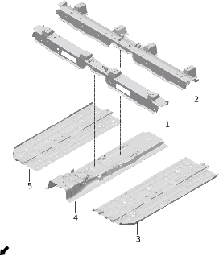

| Поз. | Артикул | Наименование | Кол-во | Применимость | Примечание |
| ---: | --- | --- | ---: | --- | --- |
| 1 | 510007001 | Передняя поперечина переднего пола | 1 | 2022-07-10 - 2024-10-03 |  |
| 1 | 510007002 | Передняя поперечина переднего пола | 1 | с 2024-08-02 |  |
| 2 | 510008001 | Задняя поперечина переднего пола | 1 | с 2022-07-10 |  |
| 3 | 510005010 | Левый передний пол | 1 | 2022-07-10 - 2024-06-24 |  |
| 3 | 510005015 | Левый передний пол | 1 | с 2024-06-24 |  |
| 4 | 510004004 | Центральный тоннель пола | 1 | с 2022-07-10 |  |
| 5 | 510006012 | Правый передний пол | 1 | с 2022-07-10 |  |
| 5 | 510006014 | Правый передний пол | 1 | с 2024-06-24 |  |

# 5011-11 Передний пол кузова

- Применимость группы: с 2023-05-23
- Описание: Материал порога: алюминий

| Поз. | Артикул | Наименование | Кол-во | Применимость | Примечание |
| ---: | --- | --- | ---: | --- | --- |
| 1 | 510007001 | Передняя поперечина переднего пола | 1 | 2022-07-10 - 2024-10-03 |  |
| 1 | 510007002 | Передняя поперечина переднего пола | 1 | с 2024-08-02 |  |
| 2 | 510008001 | Задняя поперечина переднего пола | 1 | с 2022-07-10 |  |
| 3 | 510005011 | Левый передний пол | 1 | с 2023-05-22 |  |
| 3 | 510005016 | Левый передний пол | 1 | с 2024-06-24 |  |
| 4 | 510004006 | Центральный тоннель пола | 1 | с 2023-05-22 |  |
| 5 | 510006012 | Правый передний пол | 1 | с 2022-07-10 |  |
| 5 | 510006014 | Правый передний пол | 1 | с 2024-06-24 |  |

# 5012-10 Задний пол кузова

- Применимость группы: с 2023-05-04
- Описание: Материал порога: сталь

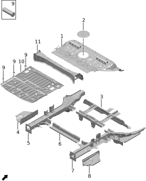

| Поз. | Артикул | Наименование | Кол-во | Применимость | Примечание |
| ---: | --- | --- | ---: | --- | --- |
| 1 | 510104015 | Задняя секция пола в сборе | 1 | с 2023-06-15 |  |
| 2 | 500102002 | Крышка сервисного лючка топливного бака | 1 | с 2022-07-10 |  |
| 3 | 280001006 | Поперечина задней части рамы | 1 | с 2022-07-10 |  |
| 4 | 511301002 | Заглушка соединительной пластины левого заднего лонжерона | 1 | с 2022-07-10 |  |
| 5 | 511303007 | Левый задний лонжерон заднего пола | 1 | с 2023-05-04 |  |
| 5 | 511303014 | Левый задний лонжерон заднего пола | 1 | с 2024-06-04 |  |
| 6 | 510106003 | Задняя поперечина заднего пола | 1 | с 2022-07-10 |  |
| 7 | 511304008 | Правый задний лонжерон заднего пола | 1 | 2022-10-30 - 2024-06-04 |  |
| 7 | 511304011 | Правый задний лонжерон заднего пола | 1 | с 2024-06-04 |  |
| 8 | 511302001 | Заглушка соединительной пластины правого заднего лонжерона | 1 | 2022-07-10 - 2024-08-12 | Мощность заднего электромотора 200 кВт |
| 8 | 511302002 | Заглушка соединительной пластины правого заднего лонжерона | 1 | с 2024-08-12 | Мощность заднего электромотора 200 кВт |
| 8 | 511302003 | Заглушка соединительной пластины правого заднего лонжерона | 1 | с 2024-03-15 | Мощность заднего электромотора 215 кВт |
| 9 | Q11005001 | Приварной болт | 6 | с 2022-07-10 |  |
| 10 | 510107005 | Основной задний пол в сборе | 1 | с 2022-07-10 |  |
| 11 | 510105003 | Балка спинки сиденья | 1 | с 2022-07-10 |  |

# 5012-11 Задний пол кузова

- Применимость группы: с 2023-05-23
- Описание: Материал порога: алюминий

| Поз. | Артикул | Наименование | Кол-во | Применимость | Примечание |
| ---: | --- | --- | ---: | --- | --- |
| 1 | 510104012 | Задняя секция пола в сборе | 1 | с 2023-08-01 |  |
| 2 | 500102002 | Крышка сервисного лючка топливного бака | 1 | с 2022-07-10 |  |
| 3 | 280001009 | Поперечина задней части рамы | 1 | с 2023-05-22 |  |
| 4 | 511301002 | Заглушка соединительной пластины левого заднего лонжерона | 1 | с 2022-07-10 |  |
| 5 | 511303007 | Левый задний лонжерон заднего пола | 1 | с 2023-05-04 |  |
| 5 | 511303014 | Левый задний лонжерон заднего пола | 1 | с 2024-06-04 |  |
| 6 | 510106003 | Задняя поперечина заднего пола | 1 | с 2022-07-10 |  |
| 7 | 511304008 | Правый задний лонжерон заднего пола | 1 | 2022-10-30 - 2024-06-04 |  |
| 7 | 511304011 | Правый задний лонжерон заднего пола | 1 | с 2024-06-04 |  |
| 8 | 511302001 | Заглушка соединительной пластины правого заднего лонжерона | 1 | 2022-07-10 - 2024-08-12 | Мощность заднего электромотора 200 кВт |
| 8 | 511302002 | Заглушка соединительной пластины правого заднего лонжерона | 1 | с 2024-08-12 | Мощность заднего электромотора 200 кВт |
| 8 | 511302003 | Заглушка соединительной пластины правого заднего лонжерона | 1 | с 2024-03-15 | Мощность заднего электромотора 215 кВт |
| 9 | Q11005001 | Приварной болт | 6 | с 2022-07-10 |  |
| 10 | 510107005 | Основной задний пол в сборе | 1 | с 2022-07-10 |  |
| 11 | 510105003 | Балка спинки сиденья | 1 | с 2022-07-10 |  |

# 5013-10 Кузовные заглушки

- Применимость группы: с 2023-04-01
- Описание: Общая конфигурация: универсально для серии

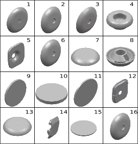

| Поз. | Артикул | Наименование | Кол-во | Применимость | Примечание |
| ---: | --- | --- | ---: | --- | --- |
| 1 | 820004005 | Заглушка нижней части кузова | 26 | с 2022-07-10 |  |
| 2 | 820004006 | Заглушка нижней части кузова | 13 | с 2022-07-10 |  |
| 3 | 820003001 | Заглушка боковины | 19 | с 2022-07-10 |  |
| 4 | 820004008 | Заглушка нижней части кузова | 4 | с 2022-07-10 |  |
| 5 | 501306001 | Внутренняя заглушка стойки A слева | 1 | с 2022-07-10 |  |
| 6 | 820008004 | Заглушка внутренней панели передней двери | 7 | с 2022-07-10 |  |
| 7 | 820007002 | Заглушка передней части кузова | 10 | с 2022-07-10 |  |
| 8 | 820006003 | Заглушка передней панели | 1 | с 2022-07-10 |  |
| 9 | 501601002 | Наклейка-заплатка | 26 | с 2022-07-10 | Диаметр 30 |
| 10 | 501601001 | Наклейка-заплатка | 8 | с 2022-07-10 | Диаметр 18 |
| 11 | 501601004 | Наклейка-заплатка | 2 | с 2022-07-10 | Диаметр 40 |
| 12 | 501307001 | Внутренняя заглушка стойки A справа | 1 | с 2022-07-10 |  |
| 13 | 820008003 | Заглушка внутренней панели передней двери | 4 | с 2022-07-10 | Электрохромное стекло + атмосферная подсветка |
| 14 | 501603001 | Заглушка дренажного отверстия двери багажника | 3 | с 2022-07-10 |  |
| 15 | 501601003 | Наклейка-заплатка | 8 | с 2022-07-10 | Диаметр 50 |
| 16 | 820004007 | Заглушка нижней части кузова | 3 | с 2022-07-10 |  |

# 5014-10 Щит передней перегородки

- Применимость группы: с 2023-06-09
- Описание: Общая конфигурация: универсально для серии

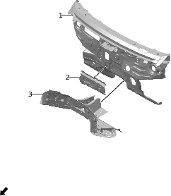

| Поз. | Артикул | Наименование | Кол-во | Применимость | Примечание |
| ---: | --- | --- | ---: | --- | --- |
| 1 | 530006003 | Щит передней перегородки | 1 | с 2023-05-22 |  |
| 1 | 530006006 | Щит передней перегородки | 1 | 2024-09-06 - 9999-12-30 |  |
| 2 | 530105002 | Поперечина передней перегородки | 1 | с 2022-07-10 |  |
| 3 | 530003011 | Усилитель передней перегородки | 1 | с 2022-07-10 |  |
| 3 | 530003017 | Усилитель передней перегородки | 1 | с 2024-03-15 |  |

# 5015-10 Передний отсек

- Применимость группы: с 2023-04-01
- Описание: Общая конфигурация: универсально для серии

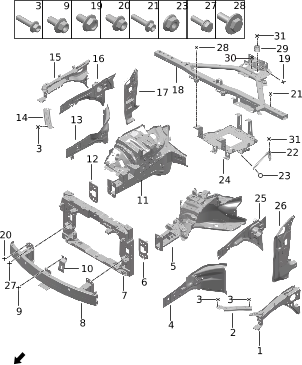

| Поз. | Артикул | Наименование | Кол-во | Применимость | Примечание |
| ---: | --- | --- | ---: | --- | --- |
| 1 | 511201001 | Усилитель левой панели переднего отсека | 1 | с 2022-07-10 |  |
| 2 | 530101001 | Левая монтажная пластина верхней поперечины радиатора | 1 | 2022-07-10 - 2024-06-03 |  |
| 2 | 530101006 | Левая монтажная пластина верхней поперечины радиатора | 1 | с 2024-06-03 |  |
| 3 | Q11002003 | Болт | 8 | с 2022-07-10 |  |
| 4 | 510305001 | Наружная панель передней части левого лонжерона | 1 | с 2022-07-10 |  |
| 5 | 530007012 | Левый передний лонжерон | 1 | с 2022-10-01 | Мощность заднего электромотора 200 кВт |
| 5 | 530007017 | Левый передний лонжерон | 1 | с 2024-10-13 | Мощность заднего электромотора 215 кВт |
| 6 | 530102001 | Левая соединительная пластина переднего усилителя бампера | 1 | 2022-07-10 - 2024-08-14 |  |
| 6 | 530102004 | Левая соединительная пластина переднего усилителя бампера | 1 | с 2024-06-15 |  |
| 7 | 500608006 | Передняя рамка | 1 | 2022-07-10 - 2024-07-16 |  |
| 7 | 500608012 | Передняя рамка | 1 |  |  |
| 7 | 500608013 | Передняя рамка | 1 | с 2024-06-15 |  |
| 8 | 532001003 | Передний усилитель бампера | 1 | 2022-07-10 - 2024-07-18 |  |
| 8 | 532001007 | Передний усилитель бампера | 1 | с 2024-07-18 |  |
| 9 | Q11001001 | Фланцевый болт | 2 | с 2022-07-10 |  |
| 10 | 500601001 | Кронштейн замка переднего модуля | 1 | с 2022-07-10 |  |
| 11 | 530008011 | Правый передний лонжерон | 1 | с 2023-05-22 |  |
| 11 | 530008014 | Правый передний лонжерон | 1 | 2024-03-15 - 2024-11-20 |  |
| 11 | 530008017 | Правый передний лонжерон | 1 | с 2024-10-13 |  |
| 12 | 530103001 | Правая соединительная пластина переднего усилителя бампера | 1 | с 2022-07-10 |  |
| 13 | 510306001 | Наружная панель передней части правого лонжерона | 1 | с 2022-07-10 |  |
| 14 | 530104001 | Правая монтажная пластина верхней поперечины радиатора | 1 | 2022-07-10 - 2024-06-03 |  |
| 14 | 530104006 | Правая монтажная пластина верхней поперечины радиатора | 1 | с 2024-06-03 |  |
| 15 | 511202001 | Усилитель правой панели переднего отсека | 1 | с 2022-07-10 |  |
| 16 | 530002002 | Правая панель переднего отсека | 1 | с 2022-07-10 |  |
| 17 | 530005005 | Нижняя часть внутренней панели правой стойки A | 1 | с 2022-08-01 |  |
| 18 | 500110007 | Комбинированная тяга отсека | 1 | 2022-07-10 - 2023-09-29 |  |
| 18 | 500110011 | Комбинированная тяга отсека | 1 | 2023-09-29 - 2023-12-12 |  |
| 18 | 500110012 | Комбинированная тяга отсека | 1 | 2023-12-12 - 2024-01-03 |  |
| 18 | 500110013 | Комбинированная тяга отсека | 1 | с 2024-01-03 |  |
| 19 | Q11001071 | Фланцевый болт | 2 | с 2022-07-10 |  |
| 20 | Q11001011 | Фланцевый болт | 4 | с 2022-07-10 |  |
| 21 | Q11001240 | Фланцевый болт | 4 | с 2024-06-15 |  |
| 22 | 500114002 | Косая опорная пластина кронштейна GCU | 1 | 2022-07-10 - 2023-09-29 |  |
| 22 | 500114003 | Косая опорная пластина кронштейна GCU | 1 | с 2023-09-29 |  |
| 23 | Q21001002 | Фланцевая гайка | 2 | с 2022-07-10 |  |
| 24 | 500113004 | Монтажный лоток GCU | 1 | 2022-07-10 - 2023-09-29 |  |
| 24 | 500113007 | Монтажный лоток GCU | 1 | с 2023-09-29 |  |
| 25 | 530001001 | Левая панель переднего отсека | 1 | с 2022-07-10 |  |
| 26 | 530004005 | Нижняя часть внутренней панели левой стойки A | 1 | с 2022-08-01 |  |
| 27 | Q11002098 | Болт | 4 | с 2022-07-10 |  |
| 28 | Q11002163 | Болт | 2 | с 2023-09-29 |  |
| 29 | 100125001 | Виброгасящая прокладка | 2 | 2023-04-15 - 2023-10-09 |  |
| 29 | 100125002 | Виброгасящая прокладка | 2 | с 2023-09-29 |  |
| 30 | Q11001165 | Фланцевый болт | 1 | с 2023-09-29 |  |
| 31 | Q11002162 | Болт | 3 | с 2023-09-29 |  |

# 5016-10 Нижние защитные панели

- Применимость группы: с 2023-04-01
- Описание: Общая конфигурация: универсально для серии

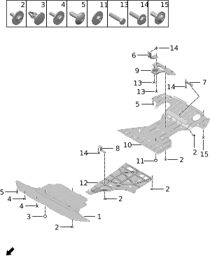

| Поз. | Артикул | Наименование | Кол-во | Применимость | Примечание |
| ---: | --- | --- | ---: | --- | --- |
| 1 | 512005007 | Передняя нижняя защитная панель | 1 | с 2022-07-10 |  |
| 2 | Q11001191 | Фланцевый болт | 26 | с 2022-09-01 |  |
| 3 | Q41001002 | Клипса | 2 | с 2022-07-10 |  |
| 4 | Q11002099 | Болт | 5 | с 2022-09-01 |  |
| 5 | Q12001018 | Винт с внутренним шестигранником | 8 | с 2022-07-10 |  |
| 6 | 500122004 | Узел фиксирующего кронштейна нижней панели | 1 | с 2022-07-10 |  |
| 7 | 500121002 | Узел кронштейна крепления задней нижней панели | 1 | с 2022-07-10 |  |
| 8 | 500122003 | Узел фиксирующего кронштейна нижней панели | 1 | с 2022-07-10 |  |
| 9 | 280201010 | Кронштейн задней нижней защитной панели | 1 | 2022-07-10 - 2024-10-26 | Емкость батареи 39 кВт*ч |
| 9 | 280201022 | Кронштейн задней нижней защитной панели | 1 | с 2024-06-15 | Емкость батареи 43 кВт*ч |
| 10 | 512006011 | Задняя нижняя защитная панель | 1 | с 2022-07-10 | Элементы CATL; емкость батареи 39 кВт*ч |
| 10 | 512006022 | Задняя нижняя защитная панель | 1 | 2023-08-01 - 2024-05-29 | Элементы SVOLT; емкость батареи 39 кВт*ч |
| 10 | 512006030 | Задняя нижняя защитная панель | 1 | с 2024-05-29 | Элементы CATL; емкость батареи 43 кВт*ч |
| 11 | Q21008005 | Шестигранная гайка | 2 | с 2022-07-10 |  |
| 12 | 512007003 | Средняя нижняя защитная панель | 1 | с 2022-07-10 | Артефакт источника: емкость батареи 39 кВт*ч; задний электромотор |
| 12 | 512007006 | Средняя нижняя защитная панель | 1 | с 2024-05-16 | Артефакт источника: CATL; емкость батареи 4... |
| 12 | 512007007 | Средняя нижняя защитная панель | 1 | с 2024-05-07 | Артефакт источника: емкость батареи 43 кВт*ч; задний электромотор |
| 13 | Q11002041 | Болт | 3 | с 2022-07-10 |  |
| 14 | Q11002006 | Болт | 6 | с 2022-07-10 |  |
| 15 | Q12001001 | Винт с внутренним шестигранником | 3 | с 2022-07-10 |  |

# 5017-10 Капот

- Применимость группы: с 2023-05-05
- Описание: Общая конфигурация: универсально для серии

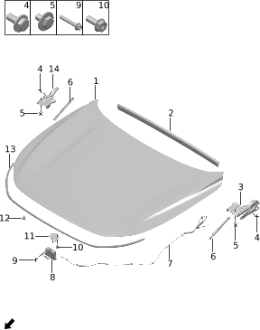

| Поз. | Артикул | Наименование | Кол-во | Применимость | Примечание |
| ---: | --- | --- | ---: | --- | --- |
| 1 | 840202001 | Капот | 1 | с 2023-05-22 |  |
| 2 | 840203001 | Задний уплотнитель капота | 1 | с 2022-07-10 |  |
| 3 | 840208005 | Левая петля капота | 1 | с 2023-07-14 |  |
| 4 | Q11002025 | Болт | 4 | с 2022-07-10 |  |
| 5 | Q11002038 | Болт | 6 | с 2022-07-10 |  |
| 6 | 840205001 | Опора капота | 2 | с 2022-07-10 |  |
| 7 | 840206001 | Трос замка капота | 1 | с 2022-07-10 |  |
| 8 | 840210001 | Замок капота в сборе | 1 | с 2022-07-10 |  |
| 9 | Q11001026 | Фланцевый болт | 2 | с 2022-07-10 |  |
| 10 | Q11002026 | Болт | 2 | с 2022-07-10 |  |
| 11 | 840211001 | Скоба замка капота | 1 | с 2022-07-10 |  |
| 12 | 820010002 | Буфер капота | 4 | с 2022-07-10 |  |
| 13 | 840204001 | Передний уплотнитель капота | 1 | с 2022-07-10 |  |
| 14 | 840209005 | Правая петля капота | 1 | с 2023-07-14 |  |

# 5018-10 Передние крылья

- Применимость группы: с 2023-05-06
- Описание: Общая конфигурация: универсально для серии

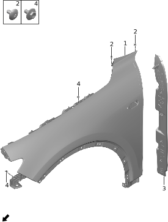

| Поз. | Артикул | Наименование | Кол-во | Применимость | Примечание |
| ---: | --- | --- | ---: | --- | --- |
| 1 | 840303005 | Левое переднее крыло | 1 | с 2023-05-22 |  |
| 1 | 840304005 | Правое переднее крыло | 1 | с 2023-05-22 |  |
| 2 | Q11001091 | Фланцевый болт | 2 | с 2022-07-10 |  |
| 3 | 840301001 | Левая декоративная накладка крыла | 1 | с 2022-07-10 |  |
| 3 | 840302001 | Правая декоративная накладка крыла | 1 | с 2022-07-10 |  |
| 4 | Q11001069 | Фланцевый болт | 9 | с 2022-07-10 |  |

# 5019-10 Боковина кузова

- Применимость группы: с 2023-05-06
- Описание: Общая конфигурация: универсально для серии

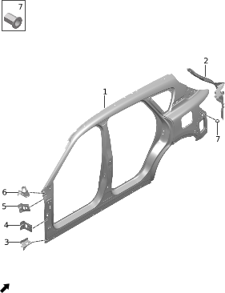

| Поз. | Артикул | Наименование | Кол-во | Применимость | Примечание |
| ---: | --- | --- | ---: | --- | --- |
| 1 | 540119002 | Наружная панель левой боковины | 1 | с 2023-05-22 |  |
| 1 | 540120003 | Наружная панель правой боковины | 1 | с 2023-05-22 |  |
| 2 | 540117001 | Левый задний водосток | 1 | с 2023-05-22 |  |
| 2 | 540118001 | Правый задний водосток | 1 | с 2023-05-22 |  |
| 3 | 540105001 | Левый передний кронштейн наружной боковины | 1 | с 2022-07-10 |  |
| 3 | 540106001 | Правый передний кронштейн наружной боковины | 1 | с 2022-07-10 |  |
| 4 | 540102001 | Нижний кронштейн крыла | 2 | с 2022-07-10 |  |
| 5 | 540101001 | Средний задний кронштейн переднего крыла | 2 | с 2022-07-10 |  |
| 6 | 540103001 | Левый верхний задний кронштейн переднего крыла | 1 | с 2022-07-10 |  |
| 6 | 540104001 | Правый верхний задний кронштейн переднего крыла | 1 | с 2022-07-10 |  |
| 7 | Q21006001 | Заклепочная гайка | 6 | с 2022-07-10 |  |

# 5020-10 Передние стойки кузова

- Применимость группы: с 2023-05-06
- Описание: Материал порога: сталь

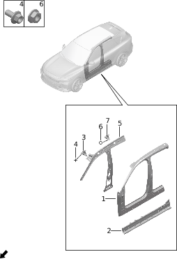

| Поз. | Артикул | Наименование | Кол-во | Применимость | Примечание |
| ---: | --- | --- | ---: | --- | --- |
| 1 | 540133007 | Усилитель левой боковины | 1 | с 2022-08-01 | Без стеклянной крыши |
| 1 | 540133008 | Усилитель левой боковины | 1 | с 2022-08-01 | Электрохромное стекло + атмосферная подсветка |
| 1 | 540134007 | Усилитель правой боковины | 1 | с 2022-08-01 | Без стеклянной крыши |
| 1 | 540134008 | Усилитель правой боковины | 1 | с 2022-08-01 | Электрохромное стекло + атмосферная подсветка |
| 2 | 510002002 | Внутренняя панель левого порога | 1 | 2022-07-10 - 2024-03-15 |  |
| 2 | 510002015 | Внутренняя панель левого порога | 1 | 2024-03-15 - 2024-12-30 |  |
| 2 | 510002016 | Внутренняя панель левого порога | 1 | с 2024-12-30 |  |
| 2 | 510003002 | Внутренняя панель правого порога | 1 | 2022-07-10 - 2024-03-15 |  |
| 2 | 510003018 | Внутренняя панель правого порога | 1 | 2024-03-15 - 2024-12-30 |  |
| 2 | 510003019 | Внутренняя панель правого порога | 1 | с 2024-12-30 |  |
| 3 | 500106001 | Кронштейн левой передней ручки первого ряда | 1 | с 2022-07-10 |  |
| 3 | 500107001 | Кронштейн правой передней ручки первого ряда | 1 | с 2022-07-10 |  |
| 4 | Q11002018 | Болт | 4 | с 2022-07-10 |  |
| 5 | 540121002 | Внутренняя панель левой боковины | 1 | с 2022-07-10 |  |
| 5 | 540122002 | Внутренняя панель правой боковины | 1 | с 2022-07-10 |  |
| 6 | Q21001010 | Фланцевая гайка | 8 | с 2022-07-10 |  |
| 7 | 500108001 | Кронштейн левой задней ручки первого ряда | 1 | с 2022-07-10 |  |
| 7 | 500109001 | Кронштейн правой задней ручки первого ряда | 1 | с 2022-07-10 |  |

# 5020-11 Передние стойки кузова

- Применимость группы: с 2023-05-23
- Описание: Материал порога: алюминий

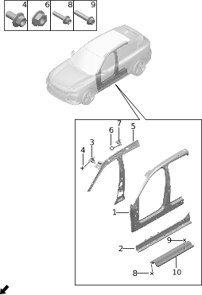

| Поз. | Артикул | Наименование | Кол-во | Применимость | Примечание |
| ---: | --- | --- | ---: | --- | --- |
| 1 | 540133007 | Усилитель левой боковины | 1 | с 2022-08-01 | Без стеклянной крыши |
| 1 | 540133008 | Усилитель левой боковины | 1 | с 2022-08-01 | Электрохромное стекло + атмосферная подсветка |
| 1 | 540134007 | Усилитель правой боковины | 1 | с 2022-08-01 | Без стеклянной крыши |
| 1 | 540134008 | Усилитель правой боковины | 1 | с 2022-08-01 | Электрохромное стекло + атмосферная подсветка |
| 2 | 510002011 | Внутренняя панель левого порога | 1 | с 2023-05-22 |  |
| 2 | 510002014 | Внутренняя панель левого порога | 1 | с 2024-06-04 |  |
| 2 | 510003012 | Внутренняя панель правого порога | 1 | с 2023-05-22 |  |
| 2 | 510003017 | Внутренняя панель правого порога | 1 | с 2024-06-04 |  |
| 3 | 500106001 | Кронштейн левой передней ручки первого ряда | 1 | с 2022-07-10 |  |
| 3 | 500107001 | Кронштейн правой передней ручки первого ряда | 1 | с 2022-07-10 |  |
| 4 | Q11002018 | Болт | 4 | с 2022-07-10 |  |
| 5 | 540121002 | Внутренняя панель левой боковины | 1 | с 2022-07-10 |  |
| 5 | 540122002 | Внутренняя панель правой боковины | 1 | с 2022-07-10 |  |
| 6 | Q21001010 | Фланцевая гайка | 8 | с 2022-07-10 |  |
| 7 | 500108001 | Кронштейн левой задней ручки первого ряда | 1 | с 2022-07-10 |  |
| 7 | 500109001 | Кронштейн правой задней ручки первого ряда | 1 | с 2022-07-10 |  |
| 8 | Q11001180 | Фланцевый болт | 4 | с 2023-07-03 |  |
| 9 | Q11001079 | Фланцевый болт | 2 | с 2022-07-10 |  |
| 10 | 500100001 | Пороговый соединительный элемент | 1 | с 2023-08-01 | Элементы SVOLT |

# 5022-10 Задние стойки кузова

- Применимость группы: с 2023-05-06
- Описание: Тип силовой установки: EREV

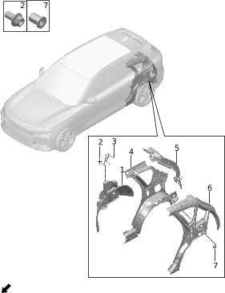

| Поз. | Артикул | Наименование | Кол-во | Применимость | Примечание |
| ---: | --- | --- | ---: | --- | --- |
| 1 | 540127003 | Внутренняя панель правой задней колесной арки | 1 | с 2022-07-10 | Мощность заднего электромотора 200 кВт |
| 1 | 540127005 | Внутренняя панель правой задней колесной арки | 1 | с 2024-06-15 | Мощность заднего электромотора 215 кВт |
| 1 | 540128002 | Внутренняя панель левой задней колесной арки | 1 | с 2022-07-10 |  |
| 2 | Q11001015 | Фланцевый болт | 6 | с 2022-07-10 |  |
| 3 | 500115001 | Левая направляющая заднего ремня безопасности | 1 | с 2022-07-10 |  |
| 3 | 500116001 | Правая направляющая заднего ремня безопасности | 1 | с 2022-07-10 |  |
| 4 | 540129003 | Наружная панель левой задней колесной арки | 1 | с 2023-05-22 | Электрохромное стекло + атмосферная подсветка |
| 4 | 540129004 | Наружная панель левой задней колесной арки | 1 | с 2023-05-22 | Панорамная крыша, без стеклянной крышки |
| 4 | 540130005 | Наружная панель правой задней колесной арки | 1 | с 2023-05-22 | Электрохромное стекло + атмосферная подсветка |
| 4 | 540130008 | Наружная панель правой задней колесной арки | 1 | с 2023-05-22 | Панорамная крыша, без стеклянной крышки |
| 5 | 540125001 | Внутренняя панель левой стойки D | 1 | с 2022-07-10 |  |
| 5 | 540126001 | Внутренняя панель правой стойки D | 1 | с 2022-07-10 |  |
| 6 | 540115001 | Усилитель левой задней боковины | 1 | с 2023-05-22 | Панорамная крыша, без стеклянной крышки |
| 6 | 540115002 | Усилитель левой задней боковины | 1 | с 2023-05-22 | Электрохромное стекло + атмосферная подсветка |
| 6 | 540116001 | Усилитель правой задней боковины | 1 | с 2023-05-22 | Панорамная крыша, без стеклянной крышки |
| 6 | 540116002 | Усилитель правой задней боковины | 1 | с 2023-05-22 | Электрохромное стекло + атмосферная подсветка |
| 7 | Q21006001 | Заклепочная гайка | 6 | с 2022-07-10 |  |

# 5023-10 Подкрылки

- Применимость группы: с 2023-05-06
- Описание: Общая конфигурация: универсально для серии

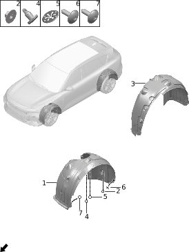

| Поз. | Артикул | Наименование | Кол-во | Применимость | Примечание |
| ---: | --- | --- | ---: | --- | --- |
| 1 | 310111005 | Левый передний подкрылок | 1 | 2022-07-10 - 2024-10-18 |  |
| 1 | 310111009 | Левый передний подкрылок | 1 | с 2024-10-18 |  |
| 1 | 310112005 | Правый передний подкрылок | 1 | 2022-07-10 - 2024-10-18 |  |
| 1 | 310112013 | Правый передний подкрылок | 1 | с 2024-10-18 |  |
| 2 | Q21004001 | Пластиковая гайка | 34 | с 2022-07-10 |  |
| 3 | 310113003 | Левый задний подкрылок | 1 | с 2022-07-10 |  |
| 3 | 310114003 | Правый задний подкрылок | 1 | с 2022-07-10 |  |
| 4 | Q41001028 | Клипса | 8 | с 2022-10-01 |  |
| 5 | Q41003003 | Металлическая клипса | 2 | с 2022-10-01 |  |
| 6 | Q12001018 | Винт с внутренним шестигранником | 16 | с 2022-07-10 |  |
| 7 | Q12001029 | Винт с внутренним шестигранником | 4 |  | Для версии без внутренней панели-шторки использовать позицию 4 |

# 5024-10 Задняя панель

- Применимость группы: с 2023-05-06
- Описание: Общая конфигурация: универсально для серии

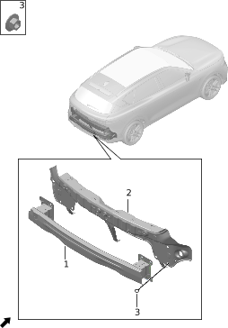

| Поз. | Артикул | Наименование | Кол-во | Применимость | Примечание |
| ---: | --- | --- | ---: | --- | --- |
| 1 | 532002001 | Задний усилитель бампера | 1 | 2022-07-10 - 2024-06-04 |  |
| 1 | 532002006 | Задний усилитель бампера | 1 | с 2024-06-04 |  |
| 2 | 560101006 | Сварной узел задней панели | 1 | с 2023-04-15 |  |
| 3 | Q21008003 | Шестигранная гайка | 8 | с 2022-07-10 |  |

# 5025-10 Багажник и дверь багажника

- Применимость группы: с 2023-05-06
- Описание: Общая конфигурация: универсально для серии

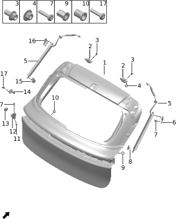

| Поз. | Артикул | Наименование | Кол-во | Применимость | Примечание |
| ---: | --- | --- | ---: | --- | --- |
| 1 | 630101001 | Дверь багажника | 1 | с 2023-05-22 |  |
| 2 | 630601002 | Петля двери багажника | 2 | с 2022-07-10 |  |
| 3 | Q11001017 | Фланцевый болт | 4 | с 2022-07-10 |  |
| 4 | Q21008003 | Шестигранная гайка | 2 | с 2022-07-10 |  |
| 5 | 630901001 | Электрическая стойка двери багажника в сборе | 2 | с 2022-07-10 |  |
| 6 | 630903001 | Верхний кронштейн правой стойки двери багажника | 1 | с 2022-07-10 |  |
| 7 | Q12001040 | Винт с внутренним шестигранником | 18 | с 2023-08-24 |  |
| 8 | 630905001 | Нижний кронштейн правой стойки двери багажника | 1 | с 2022-07-10 |  |
| 9 | Q21006001 | Заклепочная гайка | 4 | с 2022-07-10 |  |
| 10 | Q21006002 | Заклепочная гайка | 1 | с 2022-07-10 |  |
| 11 | 630804001 | Заглушка ограничителя | 4 | с 2022-07-10 |  |
| 12 | 630802003 | Ограничитель двери багажника на двери | 2 | с 2022-07-10 |  |
| 13 | 630803002 | Ограничитель двери багажника на кузове | 2 | с 2022-07-10 |  |
| 14 | 630801002 | Ограничитель двери багажника | 2 | с 2022-07-10 |  |
| 15 | 630904001 | Нижний кронштейн левой стойки двери багажника | 1 | с 2022-07-10 |  |
| 16 | 630902001 | Верхний кронштейн левой стойки двери багажника | 1 | с 2022-07-10 |  |
| 17 | Q12001008 | Винт с внутренним шестигранником | 4 | с 2022-07-10 |  |

# 5026-10 Замок двери багажника

- Применимость группы: с 2023-05-06
- Описание: Общая конфигурация: универсально для серии

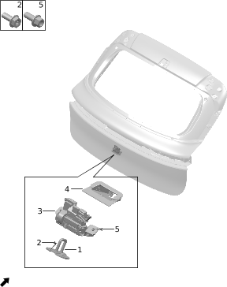

| Поз. | Артикул | Наименование | Кол-во | Применимость | Примечание |
| ---: | --- | --- | ---: | --- | --- |
| 1 | 630502001 | Ответная часть замка двери багажника в сборе | 1 | с 2022-07-10 |  |
| 2 | Q11002026 | Болт | 2 | с 2022-07-10 |  |
| 3 | 630501001 | Замок двери багажника в сборе | 1 | с 2022-07-10 |  |
| 4 | 630503001 | Чехол замка двери багажника | 1 | с 2022-07-10 |  |
| 5 | Q11001003 | Фланцевый болт | 2 | с 2022-07-10 |  |

# 5027-10 Крыша

- Применимость группы: с 2023-05-06
- Описание: Тип крыши: электрохромное стекло + атмосферная подсветка

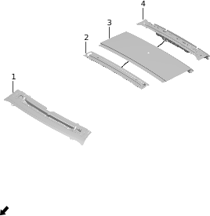

| Поз. | Артикул | Наименование | Кол-во | Применимость | Примечание |
| ---: | --- | --- | ---: | --- | --- |
| 1 | 570101002 | Передняя поперечина крыши | 1 | с 2022-07-10 |  |
| 2 | 570103001 | Средне-задняя поперечина крыши | 1 | с 2022-07-10 |  |
| 3 | 570105002 | Наружная панель крыши | 1 | с 2022-07-10 |  |
| 4 | 570102001 | Задняя поперечина крыши | 1 | с 2022-07-10 |  |

# 5027-11 Крыша

- Применимость группы: с 2023-05-23
- Описание: Тип крыши: без стекла

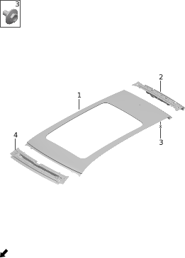

| Поз. | Артикул | Наименование | Кол-во | Применимость | Примечание |
| ---: | --- | --- | ---: | --- | --- |
| 1 | 570104001 | Крыша в сборе | 1 | с 2023-05-22 |  |
| 2 | 570102001 | Задняя поперечина крыши | 1 | с 2022-07-10 |  |
| 3 | Q11001069 | Фланцевый болт | 10 | с 2022-07-10 |  |
| 4 | 570101001 | Передняя поперечина крыши | 1 | с 2022-07-10 |  |

# 5028-10 Передние двери

- Применимость группы: с 2023-05-06
- Описание: Общая конфигурация: универсально для серии

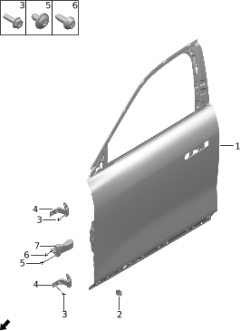

| Поз. | Артикул | Наименование | Кол-во | Применимость | Примечание |
| ---: | --- | --- | ---: | --- | --- |
| 1 | 610101005 | Левая передняя дверь | 1 | с 2023-05-22 |  |
| 1 | 610102005 | Правая передняя дверь | 1 | с 2023-05-22 |  |
| 2 | 610902002 | Буферная прокладка | 2 | с 2022-07-10 |  |
| 3 | Q11002027 | Болт | 16 | с 2022-07-10 |  |
| 4 | 610601001 | Верхняя петля левой передней двери | 2 | с 2022-07-10 |  |
| 4 | 610601003 | Верхняя петля левой передней двери | 2 | с 2024-12-31 |  |
| 4 | 610602001 | Верхняя петля правой передней двери | 2 | с 2022-07-10 |  |
| 4 | 610602003 | Верхняя петля правой передней двери | 2 | с 2024-12-31 |  |
| 5 | Q12001015 | Винт с внутренним шестигранником | 4 | с 2022-07-10 |  |
| 6 | Q12001032 | Винт с внутренним шестигранником | 2 | с 2022-07-10 |  |
| 7 | 610901001 | Ограничитель передней двери | 2 | 2022-07-10 - 2023-11-11 |  |
| 7 | 610901005 | Ограничитель передней двери | 2 | с 2023-11-11 |  |

# 5029-10 Замок передней двери

- Применимость группы: с 2023-05-06
- Описание: Тип ручки: скрытые ручки на четырех дверях

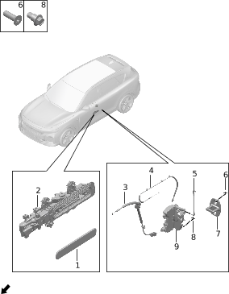

| Поз. | Артикул | Наименование | Кол-во | Применимость | Примечание |
| ---: | --- | --- | ---: | --- | --- |
| 1 | 610807001 | Корпус наружной ручки левой передней двери | 1 | с 2022-07-10 |  |
| 1 | 610808001 | Корпус наружной ручки правой передней двери | 1 | с 2022-07-10 |  |
| 2 | 610801003 | Наружная ручка левой передней двери в сборе | 1 | с 2022-07-10 |  |
| 2 | 610802003 | Наружная ручка правой передней двери в сборе | 1 | с 2022-07-10 |  |
| 3 | 610501003 | Внутренний трос открытия передней двери | 2 | с 2022-11-06 |  |
| 4 | 610502001 | Наружный трос открытия передней двери | 2 | с 2022-07-10 |  |
| 5 | 610506001 | Тяга цилиндра замка | 1 | с 2022-07-10 |  |
| 6 | Q12001012 | Винт с внутренним шестигранником | 4 | с 2022-07-10 |  |
| 7 | 610505001 | Ответная часть замка двери | 2 | с 2022-07-10 |  |
| 8 | Q12001040 | Винт с внутренним шестигранником | 6 | с 2023-08-24 |  |
| 9 | 610503001 | Замок левой передней двери | 1 | с 2022-07-10 |  |
| 9 | 610504001 | Замок правой передней двери | 1 | с 2022-07-10 |  |

# 5030-10 Стекла передних дверей

- Применимость группы: с 2023-05-06
- Описание: Общая конфигурация: универсально для серии

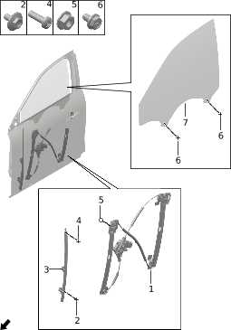

| Поз. | Артикул | Наименование | Кол-во | Применимость | Примечание |
| ---: | --- | --- | ---: | --- | --- |
| 1 | 610401001 | Стеклоподъемник левой передней двери | 1 | с 2022-07-10 |  |
| 1 | 610402001 | Стеклоподъемник правой передней двери | 1 | с 2022-07-10 |  |
| 2 | Q11001069 | Фланцевый болт | 4 | с 2022-07-10 |  |
| 3 | 610403001 | Направляющая левой передней двери | 1 | с 2022-07-10 |  |
| 3 | 610404001 | Направляющая правой передней двери | 1 | с 2022-07-10 |  |
| 4 | Q12001003 | Винт с внутренним шестигранником | 2 | с 2022-07-10 |  |
| 5 | Q21001010 | Фланцевая гайка | 14 | с 2022-07-10 |  |
| 6 | Q11002017 | Болт | 4 | с 2022-07-10 |  |
| 7 | 610303002 | Стекло левой передней двери | 1 | с 2022-07-10 |  |
| 7 | 610304002 | Стекло правой передней двери | 1 | с 2022-07-10 |  |

# 5031-10 Задние двери

- Применимость группы: с 2023-05-06
- Описание: Общая конфигурация: универсально для серии

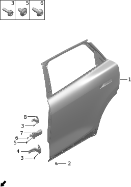

| Поз. | Артикул | Наименование | Кол-во | Применимость | Примечание |
| ---: | --- | --- | ---: | --- | --- |
| 1 | 620101004 | Левая задняя дверь | 1 | с 2023-05-22 |  |
| 1 | 620102004 | Правая задняя дверь | 1 | с 2023-05-22 |  |
| 2 | 610902002 | Буферная прокладка | 2 | с 2022-07-10 |  |
| 3 | Q11002027 | Болт | 16 | с 2022-07-10 |  |
| 4 | 610601001 | Верхняя петля левой передней двери | 1 | с 2022-07-10 |  |
| 4 | 610601003 | Верхняя петля левой передней двери | 1 | с 2024-12-31 |  |
| 4 | 610602001 | Верхняя петля правой передней двери | 1 | с 2022-07-10 |  |
| 4 | 610602003 | Верхняя петля правой передней двери | 1 | с 2024-12-31 |  |
| 5 | Q12001015 | Винт с внутренним шестигранником | 4 | с 2022-07-10 |  |
| 6 | Q12001032 | Винт с внутренним шестигранником | 2 | с 2022-07-10 |  |
| 7 | 620901001 | Ограничитель задней двери | 2 | 2022-07-10 - 2023-11-11 |  |
| 7 | 620901003 | Ограничитель задней двери | 2 | с 2023-11-11 |  |
| 8 | 620601001 | Верхняя петля левой задней двери | 1 | с 2022-07-10 |  |
| 8 | 620601002 | Верхняя петля левой задней двери | 1 | с 2024-12-31 |  |
| 8 | 620602001 | Верхняя петля правой задней двери | 1 | с 2022-07-10 |  |
| 8 | 620602002 | Верхняя петля правой задней двери | 1 | с 2024-12-31 |  |

# 5032-10 Замок задней двери

- Применимость группы: с 2023-05-06
- Описание: Тип ручки: скрытые ручки на четырех дверях

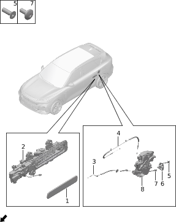

| Поз. | Артикул | Наименование | Кол-во | Применимость | Примечание |
| ---: | --- | --- | ---: | --- | --- |
| 1 | 620803001 | Корпус наружной ручки левой задней двери | 1 | с 2022-07-10 |  |
| 1 | 620804001 | Корпус наружной ручки правой задней двери | 1 | с 2022-07-10 |  |
| 2 | 610803003 | Наружная ручка левой задней двери в сборе | 1 | с 2022-07-10 |  |
| 2 | 610804003 | Наружная ручка правой задней двери в сборе | 1 | с 2022-07-10 |  |
| 3 | 620504002 | Внутренний трос открытия задней двери | 2 | с 2022-11-06 |  |
| 4 | 620503001 | Наружный трос открытия задней двери | 2 | с 2022-07-10 |  |
| 5 | Q12001012 | Винт с внутренним шестигранником | 4 | с 2022-07-10 |  |
| 6 | 610505001 | Ответная часть замка двери | 2 | с 2022-07-10 |  |
| 7 | Q12001040 | Винт с внутренним шестигранником | 6 | с 2023-08-24 |  |
| 8 | 620501001 | Замок левой задней двери | 1 | с 2022-07-10 |  |
| 8 | 620502001 | Замок правой задней двери | 1 | с 2022-07-10 |  |

# 5033-10 Стекла задних дверей

- Применимость группы: с 2023-05-06
- Описание: Общая конфигурация: универсально для серии

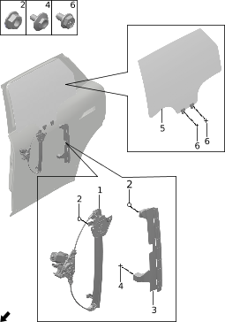

| Поз. | Артикул | Наименование | Кол-во | Применимость | Примечание |
| ---: | --- | --- | ---: | --- | --- |
| 1 | 620401001 | Стеклоподъемник левой задней двери | 1 | с 2022-07-10 |  |
| 1 | 620402001 | Стеклоподъемник правой задней двери | 1 | с 2022-07-10 |  |
| 2 | Q21001010 | Фланцевая гайка | 16 | с 2022-07-10 |  |
| 3 | 620305001 | Задняя направляющая стекла левой задней двери | 1 | с 2022-07-10 |  |
| 3 | 620306001 | Задняя направляющая стекла правой задней двери | 1 | с 2022-07-10 |  |
| 4 | Q11001069 | Фланцевый болт | 2 | с 2022-07-10 |  |
| 5 | 620301001 | Стекло левой задней двери | 1 | с 2022-07-10 | Закаленное приватное стекло второго ряда |
| 5 | 620301007 | Стекло левой задней двери | 1 | с 2024-03-15 | Шумоизолирующее приватное стекло второго ряда |
| 5 | 620302001 | Стекло правой задней двери | 1 | с 2022-07-10 | Закаленное приватное стекло второго ряда |
| 5 | 620302007 | Стекло правой задней двери | 1 | с 2024-03-15 | Шумоизолирующее приватное стекло второго ряда |
| 6 | Q11002017 | Болт | 4 | с 2022-07-10 |  |

# 5034-10 Личинка замка и ключ

- Применимость группы: с 2023-05-06
- Описание: Общая конфигурация: универсально для серии

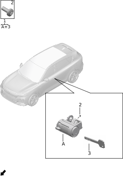

| Поз. | Артикул | Наименование | Кол-во | Применимость | Примечание |
| ---: | --- | --- | ---: | --- | --- |
| 1 | 610507002 | Комплект личинки дверного замка | 1 | с 2022-07-10 |  |
| 2 | Q12001004 | Винт с внутренним шестигранником | 1 | с 2022-07-10 |  |
| 3 | 610512001 | Механический ключ | 1 | с 2022-07-10 |  |

# 5035-10 Лючок зарядного порта

- Применимость группы: с 2023-05-06
- Описание: Общая конфигурация: универсально для серии

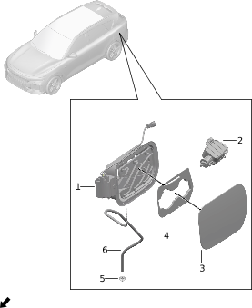

| Поз. | Артикул | Наименование | Кол-во | Применимость | Примечание |
| ---: | --- | --- | ---: | --- | --- |
| 1 | 840402003 | Основание лючка зарядного порта | 1 | 2022-07-10 - 2024-06-11 |  |
| 1 | 840402010 | Основание лючка зарядного порта | 1 | 2024-06-11 - 2024-07-31 |  |
| 1 | 840402014 | Основание лючка зарядного порта | 1 | с 2024-07-31 |  |
| 2 | 840404001 | Замок лючка зарядного порта | 1 | с 2022-07-10 |  |
| 3 | 840401001 | Крышка лючка зарядного порта | 1 | с 2022-07-10 |  |
| 4 | 840403002 | Щиток лючка зарядного порта | 1 | с 2022-07-10 |  |
| 5 | 840409001 | Чехол дренажной трубки | 1 | с 2022-07-10 |  |
| 6 | 840413001 | Дренажная трубка лючка зарядного порта | 1 | с 2022-07-10 |  |

# 5036-10 Лючок топливной горловины

- Применимость группы: с 2023-05-06
- Описание: Тип силовой установки: EREV

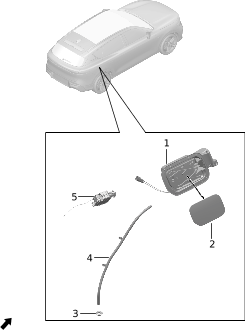

| Поз. | Артикул | Наименование | Кол-во | Применимость | Примечание |
| ---: | --- | --- | ---: | --- | --- |
| 1 | 840407001 | Лючок топливной горловины в сборе | 1 | 2022-07-10 - 2024-07-31 |  |
| 1 | 840407006 | Лючок топливной горловины в сборе | 1 | с 2024-07-31 |  |
| 2 | 840406001 | Наружная панель лючка топливной горловины | 1 | с 2022-07-10 |  |
| 3 | 840409001 | Чехол дренажной трубки | 1 | с 2022-07-10 |  |
| 4 | 840412001 | Дренажная трубка лючка топливной горловины | 1 | с 2022-07-10 |  |
| 5 | 840404001 | Замок лючка зарядного порта | 1 | с 2022-07-10 |  |

