- [3010-10 Передний приводной вал](#3010-10-передний-приводной-вал)
- [3011-10 Задний приводной вал](#3011-10-задний-приводной-вал)
- [3013-10 Опоры двигателя](#3013-10-опоры-двигателя)
- [3014-10 Опоры переднего электродвигателя](#3014-10-опоры-переднего-электродвигателя)
- [3015-10 Опоры заднего электродвигателя](#3015-10-опоры-заднего-электродвигателя)
- [3016-10 Колёса и декоративные колпаки](#3016-10-колёса-и-декоративные-колпаки)
- [3016-11 Колёса и декоративные колпаки](#3016-11-колёса-и-декоративные-колпаки)
- [3017-10 Передний подрамник](#3017-10-передний-подрамник)
- [3017-11 Передний подрамник](#3017-11-передний-подрамник)
- [3018-10 Задний подрамник](#3018-10-задний-подрамник)
- [3019-10 Передний амортизатор](#3019-10-передний-амортизатор)
- [3020-10 Задний амортизатор](#3020-10-задний-амортизатор)
- [3021-10 Передняя пневмопружина](#3021-10-передняя-пневмопружина)
- [3022-10 Задняя пневмопружина](#3022-10-задняя-пневмопружина)
- [3023-10 Задняя винтовая пружина](#3023-10-задняя-винтовая-пружина)
- [3024-10 Компрессор и ресивер](#3024-10-компрессор-и-ресивер)
- [3025-10 Датчик высоты](#3025-10-датчик-высоты)
- [3026-10 Воздушные магистрали](#3026-10-воздушные-магистрали)
- [3027-10 Блок управления пневмоподвеской](#3027-10-блок-управления-пневмоподвеской)
- [3028-10 Передние рычаги](#3028-10-передние-рычаги)
- [3029-10 Задние рычаги](#3029-10-задние-рычаги)
- [3030-10 Передний стабилизатор](#3030-10-передний-стабилизатор)
- [3031-10 Задний стабилизатор](#3031-10-задний-стабилизатор)
- [3032-10 Рулевое колесо](#3032-10-рулевое-колесо)
- [3033-10 Рулевая колонка](#3033-10-рулевая-колонка)
- [3034-10 Рулевой механизм](#3034-10-рулевой-механизм)
- [3043-10 Датчики скорости колеса](#3043-10-датчики-скорости-колеса)
- [3044-10 Передний тормозной диск](#3044-10-передний-тормозной-диск)
- [3044-11 Передний тормозной диск](#3044-11-передний-тормозной-диск)
- [3045-10 Задний тормозной диск](#3045-10-задний-тормозной-диск)
- [3046-10 Тормозная педаль](#3046-10-тормозная-педаль)
- [3047-10 Педаль акселератора](#3047-10-педаль-акселератора)
- [3048-10 Тормозные шланги](#3048-10-тормозные-шланги)
- [3049-10 Тормозные трубки](#3049-10-тормозные-трубки)
- [3050-10 Блок управления тормозами](#3050-10-блок-управления-тормозами)
- [3051-10 Модуль управления шасси](#3051-10-модуль-управления-шасси)
- [3053-10 Расширенные системы помощи водителю](#3053-10-расширенные-системы-помощи-водителю)
- [3056-10 Парковочная помощь](#3056-10-парковочная-помощь)
- [3057-10 Системы видеообзора](#3057-10-системы-видеообзора)

## 3010-10 Передний приводной вал

- Применимость группы: с 2023-04-26
- Описание: Тип привода: полный привод

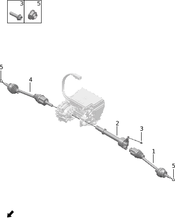

| Поз. | Артикул | Наименование | Кол-во | Применимость | Примечание |
| ---: | --- | --- | ---: | --- | --- |
| 1 | 220301011 | Левый передний приводной вал | 1 | 2022-07-10 - 2024-07-12 |  |
| 1 | 220301018 | Левый передний приводной вал | 1 | с 2024-07-12 |  |
| 2 | 230901005 | Передний соединительный вал | 1 | с 2023-04-07 |  |
| 3 | Q11001028 | Фланцевый болт | 2 | с 2022-07-10 |  |
| 4 | 220302011 | Правый передний приводной вал | 1 | 2022-07-10 - 2024-07-12 |  |
| 4 | 220302018 | Правый передний приводной вал | 1 | с 2024-07-12 |  |
| 5 | Q21002004 | Стопорная гайка | 2 | с 2022-07-10 |  |

## 3011-10 Задний приводной вал

- Применимость группы: с 2023-04-26
- Описание: Общая конфигурация: универсально для серии

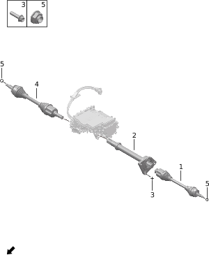

| Поз. | Артикул | Наименование | Кол-во | Применимость | Примечание |
| ---: | --- | --- | ---: | --- | --- |
| 1 | 220101014 | Левый задний приводной вал | 1 | 2023-09-05 - 2024-01-09 | Мощность заднего электродвигателя 200 kW |
| 1 | 220101020 | Левый задний приводной вал | 1 | с 2024-01-09 | Мощность заднего электродвигателя 200 kW |
| 1 | 220101024 | Левый задний приводной вал | 1 | с 2024-06-15 | Мощность заднего электродвигателя 215 kW |
| 2 | 240901008 | Соединительный вал | 1 | с 2023-04-07 | Мощность заднего электродвигателя 200 kW |
| 2 | 240901010 | Соединительный вал | 1 | с 2024-06-15 | Мощность заднего электродвигателя 215 kW |
| 3 | Q11001163 | Фланцевый болт | 3 | с 2022-07-10 |  |
| 4 | 220102009 | Правый задний приводной вал | 1 | 2022-07-10 - 2024-01-06 | Мощность заднего электродвигателя 200 kW |
| 4 | 220102018 | Правый задний приводной вал | 1 | с 2024-01-06 | Мощность заднего электродвигателя 200 kW |
| 4 | 220102022 | Правый задний приводной вал | 1 | с 2024-06-15 | Мощность заднего электродвигателя 215 kW |
| 5 | Q21002004 | Стопорная гайка | 2 | с 2022-07-10 |  |

## 3013-10 Опоры двигателя

- Применимость группы: с 2023-04-26
- Описание: VVT: изменяемый выпуск

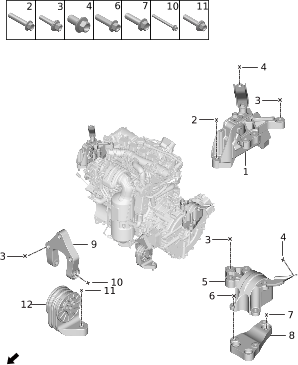

| Поз. | Артикул | Наименование | Кол-во | Применимость | Примечание |
| ---: | --- | --- | ---: | --- | --- |
| 1 | 100118002 | Правая опора двигателя | 1 | с 2022-07-10 |  |
| 2 | Q11002150 | Болт | 2 | с 2022-07-10 |  |
| 3 | Q11001057 | Фланцевый болт | 9 | с 2022-07-10 |  |
| 4 | Q11001016 | Фланцевый болт | 2 | с 2022-07-10 |  |
| 5 | 100105002 | Левая опора силового агрегата | 1 | с 2022-07-10 |  |
| 6 | Q11001046 | Фланцевый болт | 3 | с 2022-07-10 |  |
| 7 | Q11001028 | Фланцевый болт | 3 | с 2022-07-10 |  |
| 8 | 100123001 | Кронштейн левой опоры двигателя | 1 | с 2022-07-10 |  |
| 9 | 100124002 | Кронштейн передней опоры двигателя | 1 | с 2022-07-10 |  |
| 10 | Q11001053 | Фланцевый болт | 1 | с 2022-07-10 |  |
| 11 | Q11001180 | Фланцевый болт | 2 | с 2023-07-03 |  |
| 12 | 100123002 | Кронштейн левой опоры двигателя | 1 | с 2022-07-10 |  |

## 3014-10 Опоры переднего электродвигателя

- Применимость группы: с 2023-04-26
- Описание: Тип привода: полный привод

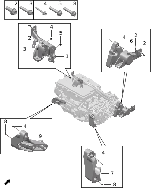

| Поз. | Артикул | Наименование | Кол-во | Применимость | Примечание |
| ---: | --- | --- | ---: | --- | --- |
| 1 | 231202002 | Левая передняя опора переднего электродвигателя | 1 | с 2022-07-10 |  |
| 2 | Q11001027 | Фланцевый болт | 4 | с 2022-07-10 |  |
| 3 | Q11001028 | Фланцевый болт | 1 | с 2022-07-10 |  |
| 4 | Q11001118 | Фланцевый болт | 12 | с 2022-07-10 |  |
| 5 | Q11001030 | Фланцевый болт | 2 | с 2022-07-10 |  |
| 6 | 231201002 | Правая передняя опора переднего электродвигателя | 1 | с 2022-07-10 |  |
| 7 | 231203001 | Кронштейн правой опоры переднего электродвигателя | 1 | с 2022-07-10 |  |
| 8 | Q11001061 | Фланцевый болт | 2 | 2022-07-10 - 2024-11-20 |  |
| 9 | 231204001 | Кронштейн левой опоры переднего электродвигателя | 1 | с 2022-07-10 |  |

## 3015-10 Опоры заднего электродвигателя

- Применимость группы: с 2023-04-26
- Описание: Общая конфигурация: универсально для серии

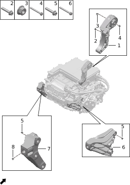

| Поз. | Артикул | Наименование | Кол-во | Применимость | Примечание |
| ---: | --- | --- | ---: | --- | --- |
| 1 | 100104003 | Передняя опора заднего электродвигателя | 1 | с 2022-07-10 |  |
| 2 | Q11001120 | Фланцевый болт | 4 | с 2022-07-10 |  |
| 3 | Q21002001 | Стопорная гайка | 1 | с 2022-07-10 |  |
| 4 | Q11002008 | Болт | 1 | с 2022-07-10 |  |
| 5 | Q11001118 | Фланцевый болт | 6 | с 2022-07-10 |  |
| 6 | 100108003 | Кронштейн правой опоры заднего электродвигателя | 1 | с 2022-07-10 |  |
| 7 | 241001002 | Кронштейн левой опоры заднего электродвигателя | 1 | с 2022-07-10 |  |
| 8 | Q11001061 | Фланцевый болт | 2 | 2022-07-10 - 2024-11-20 |  |

## 3016-10 Колёса и декоративные колпаки

- Применимость группы: с 2023-04-26
- Описание: 55/45 R20 && стиль диска: глянцевый чёрный

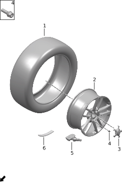

| Поз. | Артикул | Наименование | Кол-во | Применимость | Примечание |
| ---: | --- | --- | ---: | --- | --- |
| 1 | 310601007 | Шина | 4 | с 2022-07-10 | Шина Michelin с шумоподавлением |
| 1 | 310601009 | Шина | 4 | с 2024-02-15 | Шина Pirelli с шумоподавлением |
| 2 | 310101018 | Колесо | 4 | с 2023-04-15 |  |
| 3 | 310201007 | Декоративный колпак колеса | 4 | с 2023-02-05 |  |
| 4 | Q11006001 | Колёсный болт | 20 | с 2022-07-10 |  |
| 5 | 792001003 | Датчик давления в шине | 4 | с 2022-10-01 |  |
| 6 | 310102001 | Балансировочный грузик колеса | 99 | с 2022-07-10 |  |

## 3016-11 Колёса и декоративные колпаки

- Применимость группы: с 2023-05-23
- Описание: /45 R20 && стиль диска: молниеносный

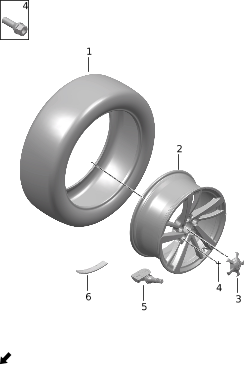

| Поз. | Артикул | Наименование | Кол-во | Применимость | Примечание |
| ---: | --- | --- | ---: | --- | --- |
| 1 | 310601007 | Шина | 4 | с 2022-07-10 | Шина Michelin с шумоподавлением |
| 1 | 310601009 | Шина | 4 | с 2024-02-15 | Шина Pirelli с шумоподавлением |
| 2 | 310101025 | Колесо | 4 | с 2024-06-25 |  |
| 3 | 310201007 | Декоративный колпак колеса | 4 | с 2023-02-05 |  |
| 4 | Q11006001 | Колёсный болт | 20 | с 2022-07-10 |  |
| 5 | 792001003 | Датчик давления в шине | 4 | с 2022-10-01 |  |
| 6 | 310102001 | Балансировочный грузик колеса | 99 | с 2022-07-10 |  |

## 3017-10 Передний подрамник

- Применимость группы: с 2023-04-26
- Описание: Тип привода: полный привод

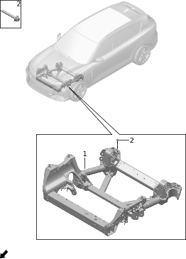

| Поз. | Артикул | Наименование | Кол-во | Применимость | Примечание |
| ---: | --- | --- | ---: | --- | --- |
| 1 | 281001016 | Передний подрамник | 1 | 2022-07-10 - 2024-10-22 |  |
| 2 | Q11002029 | Болт | 8 | с 2022-07-10 |  |

## 3017-11 Передний подрамник

- Применимость группы: с 2023-05-23
- Описание: Тип привода: задний привод

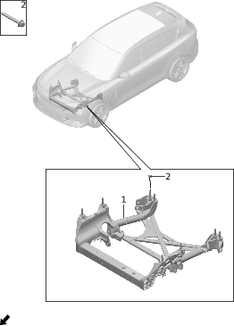

| Поз. | Артикул | Наименование | Кол-во | Применимость | Примечание |
| ---: | --- | --- | ---: | --- | --- |
| 1 | 281001019 | Передний подрамник | 1 | с 2024-03-15 | Задний привод |
| 2 | Q11002029 | Болт | 8 | с 2022-07-10 |  |

## 3018-10 Задний подрамник

- Применимость группы: с 2023-04-26
- Описание: Общая конфигурация: универсально для серии

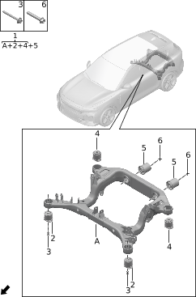

| Поз. | Артикул | Наименование | Кол-во | Применимость | Примечание |
| ---: | --- | --- | ---: | --- | --- |
| 1 | 281002006 | Задний подрамник | 1 | 2023-07-14 - 2024-10-22 |  |
| 1 | 281002008 | Задний подрамник | 1 | с 2024-10-22 |  |
| 2 | 281003001 | Втулка крепления заднего подрамника | 2 | 2022-07-10 - 2024-10-22 |  |
| 2 | 281003002 | Втулка крепления заднего подрамника | 2 | с 2024-10-22 |  |
| 3 | Q11002043 | Болт | 4 | с 2022-07-10 |  |
| 4 | 281004001 | Втулка крепления заднего подрамника | 2 | с 2022-07-10 |  |
| 5 | 241005002 | Узел задней опоры заднего электродвигателя | 2 | с 2022-07-10 |  |
| 6 | Q11001061 | Фланцевый болт | 2 | 2022-07-10 - 2024-11-20 |  |

## 3019-10 Передний амортизатор

- Применимость группы: с 2023-05-23
- Описание: Тип привода: задний привод

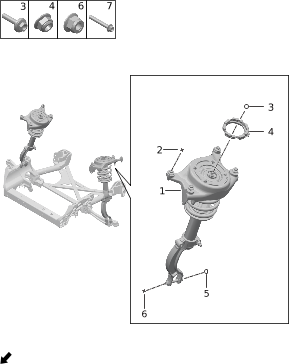

| Поз. | Артикул | Наименование | Кол-во | Применимость | Примечание |
| ---: | --- | --- | ---: | --- | --- |
| 1 | 290501010 | Узел левой передней стойки амортизатора | 1 | с 2024-03-15 |  |
| 1 | 290502008 | Узел правой передней стойки амортизатора | 1 | с 2024-03-15 |  |
| 2 | Q11002031 | Болт | 8 | с 2022-07-10 |  |
| 3 | Q21011016 | Стопорная гайка | 2 | с 2022-07-10 |  |
| 4 | 290409001 | Резиновая подушка переднего амортизатора | 2 | с 2022-07-10 |  |
| 5 | Q21002013 | Стопорная гайка | 2 | с 2022-07-10 |  |
| 6 | Q11001121 | Фланцевый болт | 2 | с 2022-07-10 |  |

## 3020-10 Задний амортизатор

- Применимость группы: с 2023-04-26
- Описание: Общая конфигурация: универсально для серии

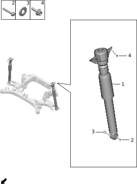

| Поз. | Артикул | Наименование | Кол-во | Применимость | Примечание |
| ---: | --- | --- | ---: | --- | --- |
| 1 | 291501010 | Узел задней стойки амортизатора | 2 | 2024-03-15 - 2024-07-11 | Задний привод |
| 1 | 291501012 | Узел задней стойки амортизатора | 2 | 2022-07-10 - 2024-07-04 | Полный привод |
| 1 | 291501027 | Узел задней стойки амортизатора | 2 | с 2024-07-11 | Задний привод |
| 1 | 291501028 | Узел задней стойки амортизатора | 2 | с 2024-07-04 | Полный привод |
| 2 | Q11001080 | Фланцевый болт | 2 | с 2022-07-10 |  |
| 3 | Q22001001 | Шайба | 2 | с 2022-07-10 |  |
| 4 | Q11002022 | Болт | 4 | с 2022-07-10 |  |

## 3021-10 Передняя пневмопружина

- Применимость группы: с 2023-04-26
- Описание: Пневмоподвеска: полуактивная пневмоподвеска

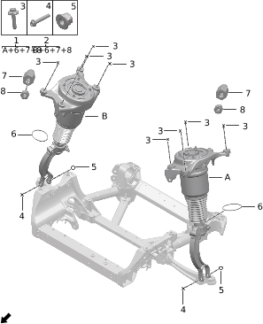

| Поз. | Артикул | Наименование | Кол-во | Применимость | Примечание |
| ---: | --- | --- | ---: | --- | --- |
| 1 | 290503017 | Узел левой передней стойки пневмоподвески | 1 | с 2022-10-01 |  |
| 2 | 290504017 | Узел правой передней стойки пневмоподвески | 1 | с 2022-10-01 |  |
| 3 | Q11002031 | Болт | 8 | с 2022-07-10 |  |
| 4 | Q11001121 | Фланцевый болт | 2 | с 2022-07-10 |  |
| 5 | Q21002013 | Стопорная гайка | 2 | с 2022-07-10 |  |
| 6 | 290524001 | Скользящий подшипник пневмопружины | 2 | с 2022-10-01 |  |
| 7 | 290525001 | Клапан удержания давления пневмопружины | 2 | с 2022-10-01 |  |
| 8 | 294123001 | Соединитель воздушной магистрали | 2 | с 2022-10-01 |  |
| 8 | 294123002 | Соединитель воздушной магистрали | 2 | с 2024-04-02 |  |

## 3022-10 Задняя пневмопружина

- Применимость группы: с 2023-04-26
- Описание: Пневмоподвеска: полуактивная пневмоподвеска

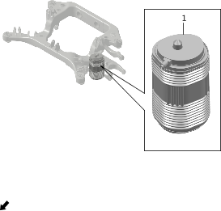

| Поз. | Артикул | Наименование | Кол-во | Применимость | Примечание |
| ---: | --- | --- | ---: | --- | --- |
| 1 | 291201004 | Левая задняя пневмопружина | 1 | с 2022-07-10 |  |
| 1 | 291202004 | Правая задняя пневмопружина | 1 | с 2022-07-10 |  |

## 3023-10 Задняя винтовая пружина

- Применимость группы: с 2023-05-23
- Описание: Тип привода: задний привод

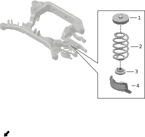

| Поз. | Артикул | Наименование | Кол-во | Применимость | Примечание |
| ---: | --- | --- | ---: | --- | --- |
| 1 | 291210001 | Верхняя подушка задней пружины | 2 | с 2024-03-15 |  |
| 2 | 291200001 | Задняя винтовая пружина | 2 | с 2024-03-15 |  |
| 3 | 291211001 | Нижняя подушка задней пружины | 2 | с 2024-03-15 |  |
| 4 | 291203001 | Левый задний пыльник пружины | 1 | с 2024-03-15 |  |
| 4 | 291204001 | Правый задний пыльник пружины | 1 | с 2024-03-15 |  |

## 3024-10 Компрессор и ресивер

- Применимость группы: с 2023-04-26
- Описание: Пневмоподвеска: полуактивная пневмоподвеска

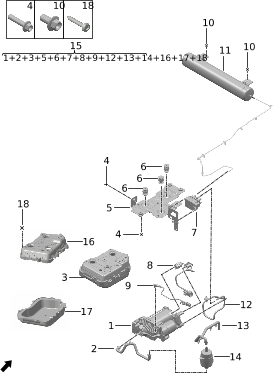

| Поз. | Артикул | Наименование | Кол-во | Применимость | Примечание |
| ---: | --- | --- | ---: | --- | --- |
| 1 | 111306001 | Горизонтальный компрессор | 1 | 2022-07-10 - 2024-04-17 |  |
| 1 | 111306002 | Горизонтальный компрессор | 1 | с 2024-04-17 |  |
| 1 | 111306003 | Горизонтальный компрессор | 1 | с 2024-04-17 |  |
| 2 | 111309001 | Задний впускной шланг | 1 | с 2022-07-10 |  |
| 2 | 111309002 | Задний впускной шланг | 1 | с 2024-04-17 |  |
| 3 | 111307001 | Шумоизоляционный кожух электроклапанного насоса | 1 | с 2022-07-10 |  |
| 4 | Q11001103 | Фланцевый болт | 4 | с 2022-07-10 |  |
| 5 | 111311002 | Кронштейн блока подачи воздуха | 1 | с 2022-07-10 |  |
| 5 | 111311003 | Кронштейн блока подачи воздуха | 1 | с 2024-04-17 |  |
| 6 | 111305001 | Комплект первичной опоры | 3 | с 2022-07-10 |  |
| 6 | 111305002 | Комплект первичной опоры | 3 | с 2024-04-17 |  |
| 7 | 111314001 | Распределительный клапан пневмоподвески | 1 | с 2022-07-10 |  |
| 7 | 111314003 | Распределительный клапан пневмоподвески | 1 | с 2024-04-17 |  |
| 8 | 111312001 | Переходный жгут компрессора | 1 | с 2022-07-10 |  |
| 8 | 111312003 | Переходный жгут компрессора | 1 | с 2024-04-17 |  |
| 9 | 111308001 | Датчик температуры | 1 | с 2022-07-10 |  |
| 9 | 111308002 | Датчик температуры | 1 | с 2024-04-17 |  |
| 10 | Q11001015 | Фланцевый болт | 4 | с 2022-07-10 |  |
| 11 | 114101004 | Ресивер | 1 | 2023-06-27 - 2024-07-04 |  |
| 11 | 114101005 | Ресивер | 1 | с 2024-07-04 |  |
| 12 | 111313001 | Магистраль компрессора к распределительному клапану | 1 | с 2022-07-10 |  |
| 12 | 294112002 | Магистраль компрессора к распределительному клапану | 1 | с 2024-04-17 |  |
| 13 | 111304001 | Передний впускной шланг | 1 | с 2022-07-10 |  |
| 13 | 111304002 | Передний впускной шланг | 1 | с 2024-04-17 |  |
| 14 | 111310001 | Впускной фильтр | 1 | с 2022-07-10 |  |
| 14 | 111310002 | Впускной фильтр | 1 | с 2024-04-17 |  |
| 15 | 111301001 | Электрический компрессор и принадлежности | 1 | 2022-07-10 - 2023-12-15 |  |
| 15 | 111301004 | Электрический компрессор и принадлежности | 1 | 2023-12-15 - 2024-04-17 |  |
| 15 | 111301005 | Электрический компрессор и принадлежности | 1 | с 2024-04-17 |  |
| 16 | 111319001 | Верхний шумоизоляционный кожух электроклапанного насоса | 1 | с 2024-04-17 |  |
| 17 | 111320001 | Нижний шумоизоляционный кожух электроклапанного насоса | 1 | с 2024-04-17 |  |
| 18 | Q12003039 | Винт | 6 | с 2024-04-17 |  |

## 3025-10 Датчик высоты

- Применимость группы: с 2023-04-26
- Описание: Пневмоподвеска: полуактивная пневмоподвеска

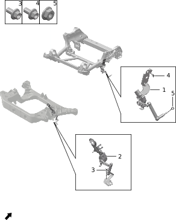

| Поз. | Артикул | Наименование | Кол-во | Применимость | Примечание |
| ---: | --- | --- | ---: | --- | --- |
| 1 | 294113001 | Левый передний датчик высоты | 1 | с 2022-07-10 |  |
| 1 | 294114001 | Правый передний датчик высоты | 1 | с 2022-07-10 |  |
| 2 | 294115004 | Левый задний датчик высоты | 1 | с 2023-10-04 |  |
| 2 | 294116004 | Правый задний датчик высоты | 1 | с 2023-10-04 |  |
| 3 | Q11001002 | Фланцевый болт | 2 | с 2022-07-10 |  |
| 4 | Q11001016 | Фланцевый болт | 2 | с 2022-07-10 |  |
| 5 | Q21001003 | Фланцевая гайка | 2 | с 2022-07-10 |  |

## 3026-10 Воздушные магистрали

- Применимость группы: с 2023-04-26
- Описание: Пневмоподвеска: полуактивная пневмоподвеска

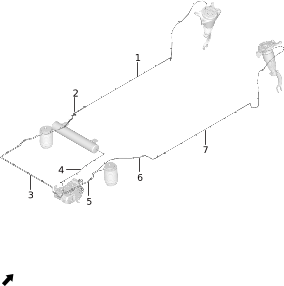

| Поз. | Артикул | Наименование | Кол-во | Применимость | Примечание |
| ---: | --- | --- | ---: | --- | --- |
| 1 | 294104001 | Передний участок магистрали левой передней пневмопружины | 1 | 2022-07-10 - 2023-08-25 |  |
| 1 | 294104004 | Передний участок магистрали левой передней пневмопружины | 1 | с 2023-08-25 |  |
| 2 | 294105001 | Задний участок магистрали левой передней пневмопружины | 1 | 2022-07-10 - 2023-08-20 |  |
| 2 | 294105004 | Задний участок магистрали левой передней пневмопружины | 1 | с 2023-08-20 |  |
| 3 | 294108001 | Магистраль левой задней пневмопружины | 1 | 2022-07-10 - 2023-08-20 |  |
| 3 | 294108004 | Магистраль левой задней пневмопружины | 1 | с 2023-08-20 |  |
| 4 | 294111001 | Магистраль компрессора к основному ресиверу | 1 | 2022-07-10 - 2023-08-22 |  |
| 4 | 294111004 | Магистраль компрессора к основному ресиверу | 1 | с 2023-08-22 |  |
| 5 | 294109001 | Магистраль правой задней пневмопружины | 1 | 2022-07-10 - 2023-08-29 |  |
| 5 | 294109004 | Магистраль правой задней пневмопружины | 1 | с 2023-08-29 |  |
| 6 | 294107001 | Задний участок магистрали правой передней пневмопружины | 1 | 2022-07-10 - 2023-08-22 |  |
| 6 | 294107004 | Задний участок магистрали правой передней пневмопружины | 1 | с 2023-08-22 |  |
| 7 | 294106001 | Передний участок магистрали правой передней пневмопружины | 1 | 2022-07-10 - 2023-08-26 |  |
| 7 | 294106007 | Передний участок магистрали правой передней пневмопружины | 1 | с 2023-08-26 |  |

## 3027-10 Блок управления пневмоподвеской

- Применимость группы: с 2023-04-26
- Описание: Пневмоподвеска: полуактивная пневмоподвеска

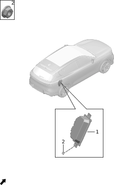

| Поз. | Артикул | Наименование | Кол-во | Применимость | Примечание |
| ---: | --- | --- | ---: | --- | --- |
| 1 | 361402007 | Контроллер пневмоподвески | 1 | с 2022-10-01 |  |
| 2 | Q21001003 | Фланцевая гайка | 4 | с 2022-07-10 |  |

## 3028-10 Передние рычаги

- Применимость группы: с 2023-04-26
- Описание: Общая конфигурация: универсально для серии

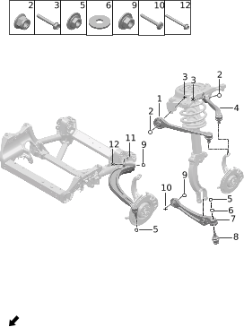

| Поз. | Артикул | Наименование | Кол-во | Применимость | Примечание |
| ---: | --- | --- | ---: | --- | --- |
| 1 | 290412001 | Левый передний верхний рычаг передней подвески | 1 | с 2022-07-10 |  |
| 1 | 290413001 | Правый передний верхний рычаг передней подвески | 1 | с 2022-07-10 |  |
| 2 | Q21002010 | Стопорная гайка | 4 | с 2022-07-10 |  |
| 3 | Q11001075 | Фланцевый болт | 4 | с 2022-07-10 |  |
| 4 | 290414001 | Левый задний верхний рычаг передней подвески | 1 | с 2022-07-10 |  |
| 4 | 290415001 | Правый задний верхний рычаг передней подвески | 1 | с 2022-07-10 |  |
| 5 | Q21002016 | Стопорная гайка | 4 | с 2022-07-10 |  |
| 6 | Q22001006 | Шайба | 2 | с 2022-07-10 |  |
| 7 | 290416001 | Левый передний нижний рычаг передней подвески | 1 | с 2022-07-10 |  |
| 7 | 290417001 | Правый передний нижний рычаг передней подвески | 1 | с 2022-07-10 |  |
| 8 | 290411002 | Посадочное место шаровой опоры нижнего рычага передней подвески | 2 | с 2022-07-10 |  |
| 9 | Q21002001 | Стопорная гайка | 4 | с 2022-07-10 |  |
| 10 | Q11002032 | Болт | 2 | с 2022-07-10 |  |
| 11 | 290405003 | Левый нижний рычаг передней подвески | 1 | с 2022-07-10 |  |
| 11 | 290406003 | Правый нижний рычаг передней подвески | 1 | с 2022-07-10 |  |
| 12 | Q11001077 | Фланцевый болт | 2 | с 2022-07-10 |  |

## 3029-10 Задние рычаги

- Применимость группы: с 2023-04-26
- Описание: Общая конфигурация: универсально для серии

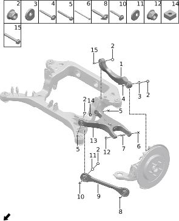

| Поз. | Артикул | Наименование | Кол-во | Применимость | Примечание |
| ---: | --- | --- | ---: | --- | --- |
| 1 | 291403002 | Левый задний верхний рычаг задней подвески | 1 | с 2022-07-10 |  |
| 1 | 291404002 | Правый задний верхний рычаг задней подвески | 1 | с 2022-07-10 |  |
| 2 | Q21002013 | Стопорная гайка | 2 | с 2022-07-10 |  |
| 3 | Q22002002 | Эксцентриковая шайба | 2 | с 2022-07-10 |  |
| 4 | Q11003001 | Эксцентриковый болт | 2 | с 2022-07-10 |  |
| 5 | Q11002008 | Болт | 4 | с 2022-07-10 |  |
| 6 | Q11002028 | Болт | 2 | с 2022-07-10 |  |
| 7 | 291413001 | Втулка крепления нижнего заднего рычага | 2 | с 2022-07-10 |  |
| 8 | Q11002030 | Болт | 2 | с 2022-07-10 |  |
| 9 | 291405001 | Рычаг регулировки схождения задней подвески | 2 | с 2022-07-10 |  |
| 10 | Q11003003 | Эксцентриковый болт | 2 | с 2022-07-10 |  |
| 11 | Q22002003 | Эксцентриковая шайба | 2 | с 2022-07-10 |  |
| 12 | Q21002012 | Стопорная гайка | 2 | с 2022-07-10 |  |
| 13 | 291408002 | Правый задний нижний рычаг задней подвески | 1 | с 2022-07-10 |  |
| 13 | 291412001 | Левый задний нижний рычаг задней подвески | 1 | с 2022-07-10 |  |
| 14 | Q21005001 | Квадратная гайка | 2 | с 2022-07-10 |  |
| 15 | Q11002002 | Болт | 2 | с 2022-07-10 |  |

## 3030-10 Передний стабилизатор

- Применимость группы: с 2023-04-26
- Описание: Общая конфигурация: универсально для серии

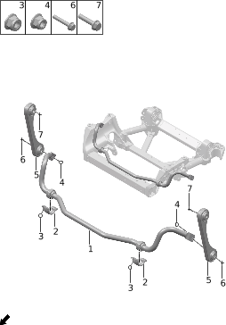

| Поз. | Артикул | Наименование | Кол-во | Применимость | Примечание |
| ---: | --- | --- | ---: | --- | --- |
| 1 | 290602006 | Передний стабилизатор | 1 | с 2023-06-26 |  |
| 2 | 290603002 | Кронштейн переднего стабилизатора | 2 | с 2023-06-26 |  |
| 3 | Q21002009 | Стопорная гайка | 4 | с 2022-07-10 |  |
| 4 | Q21002010 | Стопорная гайка | 2 | с 2022-07-10 |  |
| 5 | 290601003 | Стойка переднего стабилизатора | 2 | с 2022-07-10 |  |
| 6 | Q11001079 | Фланцевый болт | 2 | с 2022-07-10 |  |
| 7 | Q11002047 | Болт | 2 | с 2022-07-10 |  |

## 3031-10 Задний стабилизатор

- Применимость группы: с 2023-04-27
- Описание: Общая конфигурация: универсально для серии

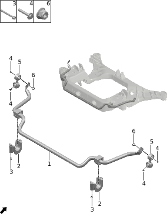

| Поз. | Артикул | Наименование | Кол-во | Применимость | Примечание |
| ---: | --- | --- | ---: | --- | --- |
| 1 | 291603002 | Задний стабилизатор | 1 | с 2022-07-10 |  |
| 2 | 291601001 | Кронштейн заднего стабилизатора | 2 | с 2022-07-10 |  |
| 3 | Q11001073 | Фланцевый болт | 4 | с 2022-07-10 |  |
| 4 | Q11002007 | Болт | 2 | с 2022-07-10 |  |
| 5 | 291602003 | Стойка заднего стабилизатора | 2 | с 2022-07-10 |  |
| 6 | Q21002010 | Стопорная гайка | 2 | с 2022-07-10 |  |

## 3032-10 Рулевое колесо

- Применимость группы: с 2023-04-27
- Описание: Общая конфигурация: универсально для серии

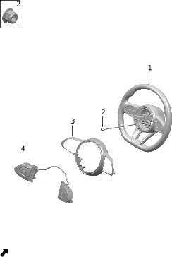

| Поз. | Артикул | Наименование | Кол-во | Применимость | Примечание |
| ---: | --- | --- | ---: | --- | --- |
| 1 | 340201029BKAB | Рулевое колесо | 1 | с 2023-03-10 | Черный + синий |
| 1 | 340201030AR02 | Рулевое колесо | 1 | с 2023-03-10 | Красный + бежевый |
| 1 | 340201031BRAC | Рулевое колесо | 1 | с 2023-03-10 | Светло-коричневый + синий |
| 1 | 340201043AG16 | Рулевое колесо | 1 | с 2024-04-17 | Черный + серый |
| 1 | 340201043AK02 | Рулевое колесо | 1 | с 2024-04-17 | Черный + зеленый |
| 2 | Q21002011 | Стопорная гайка | 1 | с 2022-07-10 |  |
| 3 | 340202001 | Декоративная накладка рулевого колеса | 1 | с 2022-07-10 | Матовый серебристый |
| 3 | 340202014 | Декоративная накладка рулевого колеса | 1 | с 2024-04-17 | Черный хром |
| 4 | 550001011 | Подрулевой переключатель | 1 | с 2023-03-10 | Матовый серебристый |
| 4 | 550001014 | Подрулевой переключатель | 1 | с 2024-04-17 | Черный хром |

## 3033-10 Рулевая колонка

- Применимость группы: с 2023-04-27
- Описание: Общая конфигурация: универсально для серии

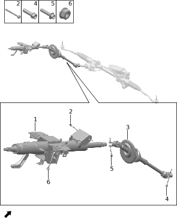

| Поз. | Артикул | Наименование | Кол-во | Применимость | Примечание |
| ---: | --- | --- | ---: | --- | --- |
| 1 | 340401002 | Верхний рулевой вал | 1 | с 2022-07-10 |  |
| 2 | Q11001090 | Фланцевый болт | 1 | с 2022-07-10 |  |
| 3 | 340402002 | Нижний рулевой вал | 1 | 2022-07-10 - 2024-01-08 |  |
| 3 | 340402003 | Нижний рулевой вал | 1 | с 2024-01-08 |  |
| 4 | Q11001029 | Фланцевый болт | 1 | с 2022-07-10 |  |
| 5 | Q11001024 | Фланцевый болт | 1 | с 2022-07-10 |  |
| 6 | Q21001004 | Фланцевая гайка | 2 | с 2022-07-10 |  |

## 3034-10 Рулевой механизм

- Применимость группы: с 2023-04-27
- Описание: Общая конфигурация: универсально для серии

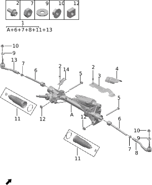

| Поз. | Артикул | Наименование | Кол-во | Применимость | Примечание |
| ---: | --- | --- | ---: | --- | --- |
| 1 | 340002009 | Рулевая рейка | 1 | 2023-02-13 - 2023-12-13 | Емкость батарейного блока: 39 kWh |
| 1 | 340002015 | Рулевая рейка | 1 | 2023-12-13 - 2024-03-27 | Емкость батарейного блока: 39 kWh |
| 1 | 340002016 | Рулевая рейка | 1 | 2024-03-27 - 2024-04-18 | Емкость батарейного блока: 39 kWh |
| 1 | 340002017 | Рулевая рейка | 1 | 2024-03-27 - 2024-07-21 | Емкость батарейного блока: 39 kWh |
| 1 | 340002018 | Рулевая рейка | 1 | 2024-03-21 - 2024-08-09 | Емкость батарейного блока: 43 kWh |
| 1 | 340002023 | Рулевая рейка | 1 | с 2024-07-21 | Емкость батарейного блока: 39 kWh |
| 1 | 340002024 | Рулевая рейка | 1 | с 2024-08-09 | Емкость батарейного блока: 43 kWh |
| 2 | Q11001001 | Фланцевый болт | 4 | с 2022-07-10 |  |
| 3 | 340001003 | Теплозащитный экран рулевой рейки | 1 | с 2022-07-10 |  |
| 4 | 340004001 | Теплоизоляционная прокладка рулевой рейки | 1 | с 2022-07-10 |  |
| 5 | Q11002052 | Болт | 2 | с 2022-07-10 |  |
| 6 | 340007001 | Внутренняя рулевая тяга | 2 | с 2022-07-10 |  |
| 7 | Q21009001 | Гайка соединения внутренней и наружной тяг | 2 | с 2022-07-10 |  |
| 8 | 340006001 | Правый наружный наконечник рулевой тяги | 1 | с 2022-07-10 |  |
| 9 | Q22001013 | Шайба | 2 | с 2023-08-15 |  |
| 10 | Q21002023 | Стопорная гайка | 2 | с 2023-03-28 |  |
| 11 | 340008001 | Ремкомплект пыльника | 2 | с 2022-07-10 |  |
| 12 | Q21005002 | Квадратная гайка | 2 | с 2022-07-10 |  |
| 13 | 340005001 | Левый наружный наконечник рулевой тяги | 1 | с 2022-07-10 |  |
| 14 | 340003001 | Кронштейн жгута мотора EPS | 1 | с 2022-07-10 |  |

## 3043-10 Датчики скорости колеса

- Применимость группы: с 2023-04-01
- Описание: Общая конфигурация: универсально для серии

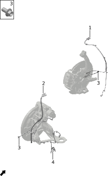

| Поз. | Артикул | Наименование | Кол-во | Применимость | Примечание |
| ---: | --- | --- | ---: | --- | --- |
| 1 | 360208004 | Левый передний датчик скорости колеса | 1 | с 2024-03-15 | Задний привод; без пневмоподвески |
| 1 | 360208005 | Левый передний датчик скорости колеса | 1 | с 2022-07-10 | Полный привод; полуактивная пневмоподвеска |
| 1 | 360210004 | Правый передний датчик скорости колеса | 1 | с 2024-03-15 | Задний привод; без пневмоподвески |
| 1 | 360210005 | Правый передний датчик скорости колеса | 1 | с 2022-07-10 | Полный привод; полуактивная пневмоподвеска |
| 2 | 360209003 | Левый задний датчик скорости колеса | 1 | с 2024-03-15 | Задний привод; без пневмоподвески |
| 2 | 360209005 | Левый задний датчик скорости колеса | 1 | с 2022-07-10 | Полный привод; полуактивная пневмоподвеска |
| 2 | 360211003 | Правый задний датчик скорости колеса | 1 | с 2024-03-15 | Задний привод; без пневмоподвески |
| 2 | 360211005 | Правый задний датчик скорости колеса | 1 | с 2022-07-10 | Полный привод; полуактивная пневмоподвеска |
| 3 | Q11001001 | Фланцевый болт | 4 | с 2022-07-10 |  |
| 4 | 294119001 | Левый задний кронштейн жгута | 1 | с 2022-07-10 |  |
| 4 | 294120001 | Правый задний кронштейн жгута | 1 | с 2022-07-10 |  |

## 3044-10 Передний тормозной диск

- Применимость группы: с 2023-04-28
- Описание: Емкость батарейного блока: 39 kWh

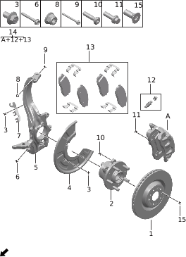

| Поз. | Артикул | Наименование | Кол-во | Применимость | Примечание |
| ---: | --- | --- | ---: | --- | --- |
| 1 | 350108001 | Передний тормозной диск | 2 | с 2022-07-10 |  |
| 2 | 350105001 | Подшипник передней ступицы | 2 | с 2022-07-10 |  |
| 2 | 350105003 | Подшипник передней ступицы | 2 | с 2022-07-10 |  |
| 3 | 350111001 | Фланцевый болт | 8 | с 2022-07-10 |  |
| 4 | 350103001 | Левый защитный щиток переднего тормозного диска | 1 | с 2022-07-10 |  |
| 4 | 350104001 | Правый защитный щиток переднего тормозного диска | 1 | с 2022-07-10 |  |
| 5 | 350106006 | Левый передний поворотный кулак | 1 | с 2023-07-20 |  |
| 5 | 350107006 | Правый передний поворотный кулак | 1 | с 2023-07-20 |  |
| 6 | Q11001076 | Фланцевый болт | 2 | с 2022-07-10 |  |
| 7 | 350112001 | Левый кронштейн переднего датчика скорости колеса | 1 | с 2022-07-10 |  |
| 7 | 350113001 | Правый кронштейн переднего датчика скорости колеса | 1 | с 2022-07-10 |  |
| 8 | Q21002010 | Стопорная гайка | 2 | с 2022-07-10 |  |
| 9 | Q11001074 | Фланцевый болт | 2 | с 2022-07-10 |  |
| 10 | 350110001 | Соединительный болт подшипника | 8 | с 2022-07-10 |  |
| 11 | 350109001 | Болт кронштейна | 4 | с 2022-07-10 |  |
| 12 | 350117001 | Комплект переднего штуцера прокачки | 2 | с 2022-07-10 |  |
| 13 | 350118002 | Передние тормозные колодки | 1 | с 2023-05-22 | Один комплект на автомобиль, включая фрикционные накладки и пружины |
| 14 | 350115001 | Левый передний тормозной суппорт | 1 | с 2022-07-10 |  |
| 14 | 350116001 | Правый передний тормозной суппорт | 1 | с 2023-07-20 |  |
| 15 | 350114001 | Винт крепления тормозного диска | 4 | с 2022-07-10 |  |

## 3044-11 Передний тормозной диск

- Применимость группы: с 2023-05-23
- Описание: Емкость батарейного блока: 43 kWh

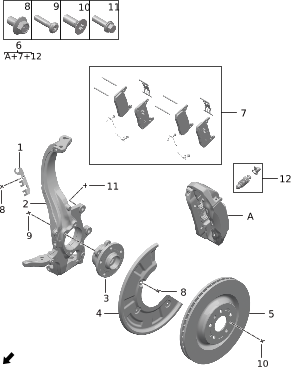

| Поз. | Артикул | Наименование | Кол-во | Применимость | Примечание |
| ---: | --- | --- | ---: | --- | --- |
| 1 | 350112001 | Левый кронштейн переднего датчика скорости колеса | 1 | с 2022-07-10 |  |
| 1 | 350113001 | Правый кронштейн переднего датчика скорости колеса | 1 | с 2022-07-10 |  |
| 2 | 350106006 | Левый передний поворотный кулак | 1 | с 2023-07-20 |  |
| 2 | 350107006 | Правый передний поворотный кулак | 1 | с 2023-07-20 |  |
| 3 | 350105002 | Подшипник передней ступицы | 2 | с 2024-03-15 | Задний привод |
| 3 | 350105003 | Подшипник передней ступицы | 2 | с 2022-07-10 | Полный привод |
| 4 | 350103003 | Левый защитный щиток переднего тормозного диска | 1 | с 2024-03-15 |  |
| 4 | 350104003 | Правый защитный щиток переднего тормозного диска | 1 | с 2024-03-15 |  |
| 5 | 350108006 | Передний тормозной диск | 2 | с 2024-03-15 |  |
| 6 | 350115010HSKQ | Левый передний тормозной суппорт | 1 | с 2024-05-07 |  |
| 6 | 350115014HSKQ | Левый передний тормозной суппорт | 1 |  |  |
| 6 | 350116010HSKQ | Правый передний тормозной суппорт | 1 | с 2024-05-07 |  |
| 6 | 350116014HSKQ | Правый передний тормозной суппорт | 1 |  |  |
| 7 | 350118005 | Передние тормозные колодки | 1 | с 2024-03-15 | Один комплект на автомобиль, включая фрикционные накладки и пружины |
| 7 | 350118006 | Передние тормозные колодки | 1 |  | Один комплект на автомобиль, включая фрикционные накладки и пружины |
| 8 | 350111001 | Фланцевый болт | 8 | с 2022-07-10 |  |
| 9 | 350110001 | Соединительный болт подшипника | 8 | с 2022-07-10 |  |
| 10 | 350114001 | Винт крепления тормозного диска | 4 | с 2022-07-10 |  |
| 11 | 350109001 | Болт кронштейна | 4 | с 2022-07-10 |  |
| 12 | 350117003 | Комплект переднего штуцера прокачки | 2 | с 2024-03-15 |  |

## 3045-10 Задний тормозной диск

- Применимость группы: с 2023-04-28
- Описание: Общая конфигурация: универсально для серии

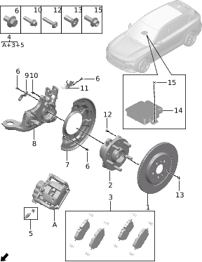

| Поз. | Артикул | Наименование | Кол-во | Применимость | Примечание |
| ---: | --- | --- | ---: | --- | --- |
| 1 | 350207001 | Задний тормозной диск | 2 | с 2022-07-10 |  |
| 2 | 350105001 | Подшипник передней ступицы | 2 | с 2022-07-10 |  |
| 2 | 350105003 | Подшипник передней ступицы | 2 | с 2022-07-10 |  |
| 3 | 350213002 | Задние тормозные колодки | 1 | с 2023-05-22 | Один комплект на автомобиль, включая фрикционные накладки и пружины |
| 4 | 350203001 | Левый задний тормозной суппорт | 1 | с 2022-07-10 | Емкость батарейного блока: 39 kWh |
| 4 | 350203006HSKQ | Левый задний тормозной суппорт | 1 | с 2024-04-23 | Емкость батарейного блока: 43 kWh |
| 4 | 350204001 | Правый задний тормозной суппорт | 1 | с 2022-07-10 | Емкость батарейного блока: 39 kWh |
| 4 | 350204006HSKQ | Правый задний тормозной суппорт | 1 | с 2024-04-23 | Емкость батарейного блока: 43 kWh |
| 5 | 350212001 | Комплект заднего штуцера прокачки | 1 | с 2022-07-10 |  |
| 6 | 350111001 | Фланцевый болт | 12 | с 2022-07-10 |  |
| 7 | 350205001 | Левый защитный щиток заднего тормозного диска | 1 | с 2022-07-10 |  |
| 7 | 350206001 | Правый защитный щиток заднего тормозного диска | 1 | с 2022-07-10 |  |
| 8 | 350210001 | Левый задний поворотный кулак | 1 | с 2022-07-10 |  |
| 8 | 350211001 | Правый задний поворотный кулак | 1 | с 2022-07-10 |  |
| 9 | 350209002 | Кронштейн заднего датчика скорости колеса | 1 | с 2022-07-10 | Левый |
| 9 | 350209004 | Кронштейн заднего датчика скорости колеса | 1 | с 2022-07-10 | Правый |
| 10 | 350208001 | Болт кронштейна | 4 | с 2022-07-10 |  |
| 11 | 350209001 | Кронштейн заднего датчика скорости колеса | 1 | с 2022-07-10 | Левый |
| 11 | 350209003 | Кронштейн заднего датчика скорости колеса | 1 | с 2022-07-10 | Правый |
| 12 | 350110001 | Соединительный болт подшипника | 8 | с 2022-07-10 |  |
| 13 | 350114001 | Винт крепления тормозного диска | 4 | с 2022-07-10 |  |
| 14 | 350216009 | Контроллер EPB | 1 | с 2022-07-10 |  |
| 15 | Q11002020 | Болт | 2 | с 2022-07-10 |  |

## 3046-10 Тормозная педаль

- Применимость группы: с 2023-04-28
- Описание: Общая конфигурация: универсально для серии

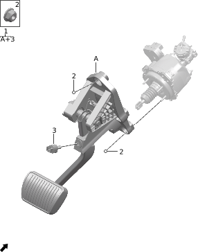

| Поз. | Артикул | Наименование | Кол-во | Применимость | Примечание |
| ---: | --- | --- | ---: | --- | --- |
| 1 | 350401006 | Тормозная педаль | 1 | с 2023-02-05 |  |
| 2 | Q21002006 | Стопорная гайка | 5 | с 2022-07-10 |  |
| 3 | 350402003 | Выключатель тормоза | 1 | с 2022-07-10 |  |

## 3047-10 Педаль акселератора

- Применимость группы: с 2023-05-06
- Описание: Общая конфигурация: универсально для серии

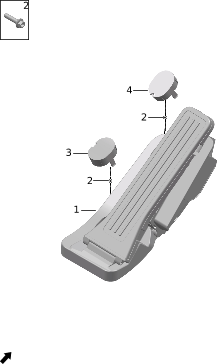

| Поз. | Артикул | Наименование | Кол-во | Применимость | Примечание |
| ---: | --- | --- | ---: | --- | --- |
| 1 | 110801003 | Педаль электронного акселератора | 1 | с 2023-02-05 |  |
| 2 | Q11001008 | Фланцевый болт | 2 | с 2022-07-10 |  |
| 3 | 110802002 | Заглушка педали акселератора | 1 | с 2022-07-10 |  |
| 4 | 110802001 | Заглушка педали акселератора | 1 | с 2022-07-10 |  |

## 3048-10 Тормозные шланги

- Применимость группы: с 2023-04-28
- Описание: Общая конфигурация: универсально для серии

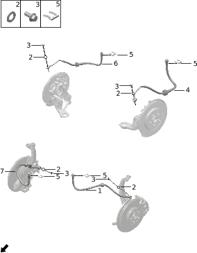

| Поз. | Артикул | Наименование | Кол-во | Применимость | Примечание |
| ---: | --- | --- | ---: | --- | --- |
| 1 | 350601001 | Левый передний тормозной шланг | 1 | с 2022-07-10 |  |
| 1 | 350601005 | Левый передний тормозной шланг | 1 | с 2024-04-23 |  |
| 2 | 350606002 | Монтажная шайба | 8 | с 2022-07-10 |  |
| 3 | 350607004 | Соединительный болт | 4 | с 2022-07-10 |  |
| 4 | 350610001 | Левый задний тормозной шланг | 1 | с 2022-07-10 |  |
| 5 | Q42001002 | Стопорное кольцо E-типа | 4 | с 2022-07-10 |  |
| 6 | 350611001 | Правый задний тормозной шланг | 1 | с 2022-07-10 |  |
| 7 | 350602001 | Правый передний тормозной шланг | 1 | с 2022-07-10 |  |
| 7 | 350602005 | Правый передний тормозной шланг | 1 | с 2024-04-23 |  |

## 3049-10 Тормозные трубки

- Применимость группы: с 2023-04-28
- Описание: Общая конфигурация: универсально для серии

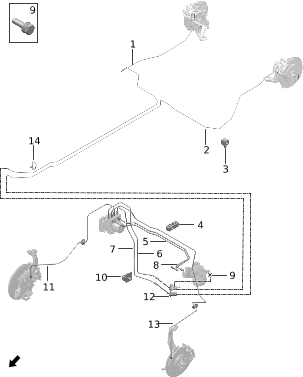

| Поз. | Артикул | Наименование | Кол-во | Применимость | Примечание |
| ---: | --- | --- | ---: | --- | --- |
| 1 | 294101002 | Задняя тормозная магистраль | 1 | с 2022-07-10 |  |
| 2 | 294101001 | Задняя тормозная магистраль | 1 | 2022-07-10 - 2024-10-30 |  |
| 2 | 350603010 | Передняя тормозная магистраль | 1 | с 2024-10-30 |  |
| 3 | 350605003 | Одинарный зажим тормозной магистрали | 12 | с 2023-07-06 |  |
| 4 | 350608002 | Тройной зажим тормозной магистрали | 4 | с 2022-07-10 |  |
| 5 | 350603002 | Передняя тормозная магистраль | 1 | 2022-07-10 - 2024-09-09 |  |
| 5 | 350603008 | Передняя тормозная магистраль | 1 | с 2024-06-15 |  |
| 6 | 350603006 | Передняя тормозная магистраль | 1 | с 2022-07-10 |  |
| 7 | 350603005 | Передняя тормозная магистраль | 1 | с 2022-07-10 |  |
| 8 | 350603001 | Передняя тормозная магистраль | 1 | 2022-07-10 - 2024-09-09 |  |
| 8 | 350603007 | Передняя тормозная магистраль | 1 | с 2024-06-15 |  |
| 9 | Q11002013 | Болт | 1 | с 2022-07-10 |  |
| 10 | 350604003 | Двойной зажим тормозной магистрали | 7 | с 2023-07-23 |  |
| 11 | 350603004 | Передняя тормозная магистраль | 1 | с 2022-07-10 |  |
| 12 | 350609001 | Четырёхходовой соединитель | 1 | с 2022-07-10 |  |
| 13 | 350603003 | Передняя тормозная магистраль | 1 | 2022-07-10 - 2024-09-09 |  |
| 13 | 350603009 | Передняя тормозная магистраль | 1 | с 2024-06-15 |  |
| 14 | 350612001 | Стяжка | 1 | с 2022-07-10 |  |

## 3050-10 Блок управления тормозами

- Применимость группы: с 2023-04-01
- Описание: Общая конфигурация: универсально для серии

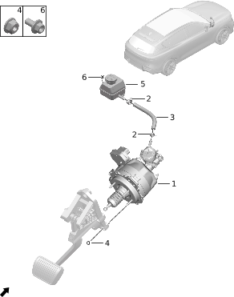

| Поз. | Артикул | Наименование | Кол-во | Применимость | Примечание |
| ---: | --- | --- | ---: | --- | --- |
| 1 | 361702001 | Интеллектуальный усилитель | 1 | с 2022-07-10 |  |
| 2 | Q31001004 | Зажим трубки | 2 | с 2022-07-10 |  |
| 3 | 353902001 | Соединительный шланг бачка | 1 | с 2022-07-10 |  |
| 4 | Q21002006 | Стопорная гайка | 4 | с 2022-07-10 |  |
| 5 | 353901001 | Бачок и принадлежности | 1 | с 2022-07-10 |  |
| 6 | Q11001002 | Фланцевый болт | 1 | с 2022-07-10 |  |

## 3051-10 Модуль управления шасси

- Применимость группы: с 2023-05-06
- Описание: Общая конфигурация: универсально для серии

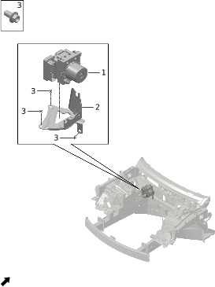

| Поз. | Артикул | Наименование | Кол-во | Применимость | Примечание |
| ---: | --- | --- | ---: | --- | --- |
| 1 | 361701005 | Исполнительный механизм ESC | 1 | с 2023-05-22 |  |
| 2 | 355005002 | Кронштейн исполнительного механизма ESC | 1 | с 2023-05-21 |  |
| 3 | Q11001015 | Фланцевый болт | 3 | с 2022-07-10 |  |

## 3053-10 Расширенные системы помощи водителю

- Применимость группы: с 2023-05-06
- Описание: Общая конфигурация: универсально для серии

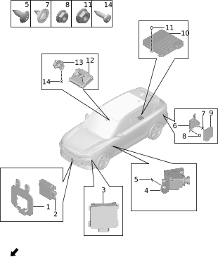

| Поз. | Артикул | Наименование | Кол-во | Применимость | Примечание |
| ---: | --- | --- | ---: | --- | --- |
| 1 | 362906005 | Кронштейн переднего миллиметрового радара | 1 | с 2023-02-05 | Оборудование ADAS L2.9 |
| 1 | 362906007 | Кронштейн переднего миллиметрового радара | 1 | с 2024-03-15 | Без оборудования ADAS L2.9 |
| 2 | 362902007 | Передний миллиметровый радар | 1 | с 2022-07-10 | Оборудование ADAS L2.9 |
| 2 | 362902012 | Передний миллиметровый радар | 1 | 2024-03-15 - 2024-05-16 | Без оборудования ADAS L2.9 |
| 2 | 362902013 | Передний миллиметровый радар | 1 | с 2024-03-28 | Без оборудования ADAS L2.9 |
| 3 | 362917006 | Левый передний угловой радар | 1 | 2022-07-10 - 2024-07-05 | Оборудование ADAS L2.9 |
| 3 | 362917011 | Левый передний угловой радар | 1 | с 2024-03-28 | Без оборудования ADAS L2.9 |
| 3 | 362917013 | Левый передний угловой радар | 1 | 2024-07-05 - 2024-07-09 | Оборудование ADAS L2.9 |
| 3 | 362917018 | Левый передний угловой радар | 1 | с 2024-07-09 | Оборудование ADAS L2.9 |
| 3 | 362918006 | Правый передний угловой радар | 1 | 2022-07-10 - 2024-07-05 | Оборудование ADAS L2.9 |
| 3 | 362918011 | Правый передний угловой радар | 1 | с 2024-03-28 | Без оборудования ADAS L2.9 |
| 3 | 362918013 | Правый передний угловой радар | 1 | 2024-07-05 - 2024-07-09 | Оборудование ADAS L2.9 |
| 3 | 362918016 | Правый передний угловой радар | 1 | с 2024-07-09 | Оборудование ADAS L2.9 |
| 4 | 362925002 | Левая задняя боковая камера | 1 | 2022-07-10 - 2024-07-06 | Оборудование ADAS L2.9 |
| 4 | 362925004 | Левая задняя боковая камера | 1 | с 2024-07-06 | Оборудование ADAS L2.9 |
| 4 | 362926002 | Правая задняя боковая камера | 1 | 2022-07-10 - 2024-07-06 | Оборудование ADAS L2.9 |
| 4 | 362926004 | Правая задняя боковая камера | 1 | с 2024-07-06 | Оборудование ADAS L2.9 |
| 5 | Q12002029 | Самонарезающий винт | 4 | с 2023-03-10 |  |
| 6 | 362915002 | Кронштейн левого заднего углового радара | 1 | с 2022-10-01 | Оборудование ADAS L2.9 |
| 6 | 362915003 | Кронштейн левого заднего углового радара | 1 | с 2024-03-15 | Без оборудования ADAS L2.9 |
| 6 | 362916002 | Кронштейн правого заднего углового радара | 1 | с 2022-10-01 | Оборудование ADAS L2.9 |
| 6 | 362916003 | Кронштейн правого заднего углового радара | 1 | с 2024-03-15 | Без оборудования ADAS L2.9 |
| 7 | Q12004001 | Самонарезающий винт с шайбой | 6 | с 2022-10-01 |  |
| 8 | Q21001003 | Фланцевая гайка | 6 | с 2022-07-10 |  |
| 9 | 362903009 | Левый задний угловой радар | 1 | 2022-07-10 - 2024-07-05 | Оборудование ADAS L2.9 |
| 9 | 362903014 | Левый задний угловой радар | 1 | с 2024-03-28 | Без оборудования ADAS L2.9 |
| 9 | 362903016 | Левый задний угловой радар | 1 | 2024-07-05 - 2024-07-09 | Оборудование ADAS L2.9 |
| 9 | 362903020 | Левый задний угловой радар | 1 | с 2024-07-09 | Оборудование ADAS L2.9 |
| 9 | 362904009 | Правый задний угловой радар | 1 | 2022-07-10 - 2024-07-05 | Оборудование ADAS L2.9 |
| 9 | 362904014 | Правый задний угловой радар | 1 | с 2024-03-28 | Без оборудования ADAS L2.9 |
| 9 | 362904016 | Правый задний угловой радар | 1 | 2024-07-05 - 2024-07-09 | Оборудование ADAS L2.9 |
| 9 | 362904020 | Правый задний угловой радар | 1 | с 2024-07-09 | Оборудование ADAS L2.9 |
| 10 | 362921002 | Контроллер домена ADAS | 1 | с 2022-12-25 | Оборудование ADAS L2.9 |
| 11 | Q21001002 | Фланцевая гайка | 4 | с 2022-07-10 |  |
| 12 | 362905007 | Передняя моно-камера | 1 | 2022-12-25 - 2024-03-26 | Оборудование ADAS L2.9 |
| 12 | 362905010 | Передняя моно-камера | 1 | с 2022-07-10 | Оборудование ADAS L2.9 |
| 12 | 362905011 | Передняя моно-камера | 1 | 2024-03-28 - 2024-12-30 | Без оборудования ADAS L2.9 |
| 12 | 362905016 | Передняя моно-камера | 1 | с 2024-12-30 | Без оборудования ADAS L2.9 |
| 13 | 362930001 | Передняя телекамера | 1 | 2022-07-10 - 2024-07-05 | Оборудование ADAS L2.9 |
| 13 | 362930002 | Передняя телекамера | 1 | с 2024-07-05 | Оборудование ADAS L2.9 |
| 14 | Q12002009 | Самонарезающий винт | 2 | с 2022-06-15 |  |

## 3056-10 Парковочная помощь

- Применимость группы: с 2023-04-01
- Описание: Общая конфигурация: универсально для серии

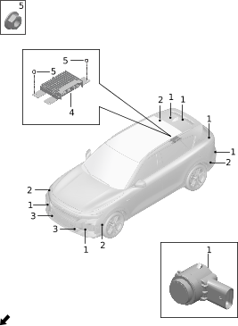

| Поз. | Артикул | Наименование | Кол-во | Применимость | Примечание |
| ---: | --- | --- | ---: | --- | --- |
| 1 | 378502008 | Датчик парковочного радара | 6 | 2022-07-10 - 2024-06-09 |  |
| 1 | 378502014 | Датчик парковочного радара | 6 | с 2024-06-09 |  |
| 2 | 378502007 | Датчик парковочного радара | 4 | 2022-07-10 - 2024-06-09 | Дальний |
| 2 | 378502016 | Датчик парковочного радара | 4 | с 2024-06-09 | Дальний |
| 3 | 378502010PK01 | Датчик парковочного радара | 2 | 2023-03-10 - 2024-06-08 | Z-образный; глянцевый чёрный |
| 3 | 378502015PK01 | Датчик парковочного радара | 2 | с 2024-06-08 | Z-образный; глянцевый чёрный |
| 4 | 362910021 | Контроллер автопарковки | 1 | 2024-03-15 - 2024-11-10 | Без ADAS L2.9 |
| 4 | 362910028 | Контроллер автопарковки | 1 | с 2024-03-28 | Без ADAS L2.9 |
| 5 | Q21001002 | Фланцевая гайка | 3 | с 2022-07-10 |  |

## 3057-10 Системы видеообзора

- Применимость группы: с 2023-04-01
- Описание: Общая конфигурация: универсально для серии

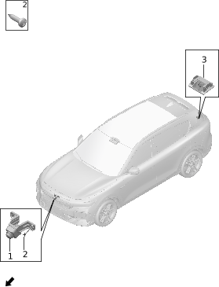

| Поз. | Артикул | Наименование | Кол-во | Применимость | Примечание |
| ---: | --- | --- | ---: | --- | --- |
| 1 | 791401004 | Передняя камера | 1 | 2022-07-10 - 2024-07-05 | Оборудование ADAS L2.9 |
| 1 | 791401007 | Передняя камера | 1 | с 2024-03-15 | Без оборудования ADAS L2.9 |
| 1 | 791401008 | Передняя камера | 1 | с 2024-07-05 | Оборудование ADAS L2.9 |
| 2 | Q12002009 | Самонарезающий винт | 2 | с 2022-06-15 |  |
| 3 | 791402005 | Задняя камера | 1 | 2022-07-10 - 2024-07-05 | Оборудование ADAS L2.9 |
| 3 | 791402008 | Задняя камера | 1 | 2024-03-15 - 2024-11-05 | Без оборудования ADAS L2.9 |
| 3 | 791402009 | Задняя камера | 1 | с 2024-07-05 | Оборудование ADAS L2.9 |
| 3 | 791402010 | Задняя камера | 1 | с 2024-11-05 | Без оборудования ADAS L2.9 |

