# Климатическая система и пассивная безопасность

- [4010-10 Конденсор](#4010-10)
- [4011-10 Компрессор кондиционера](#4011-10)
- [4012-10 Передняя система кондиционирования](#4012-10)
- [4013-10 Испаритель кондиционера](#4013-10)
- [4015-10 PTC кондиционера](#4015-10)
- [4016-10 Контроллер кондиционера](#4016-10)
- [4017-10 Панель управления кондиционером](#4017-10)
- [4018-10 Ароматизатор](#4018-10)
- [4020-10 Подушка безопасности водителя](#4020-10)
- [4021-10 Подушка безопасности пассажира](#4021-10)
- [4024-10 Передние ремни безопасности](#4024-10)
- [4027-10 Задние ремни безопасности](#4027-10)
- [4028-10 Регулятор высоты](#4028-10)
- [4030-10 Передний датчик столкновения](#4030-10)
- [4031-10 Боковые датчики столкновения](#4031-10)
- [4034-10 Блок управления подушками безопасности](#4034-10)

## 4010-10

### Конденсор

- Применимость группы: с 2023-05-06
- Описание: Тип силовой установки: EREV

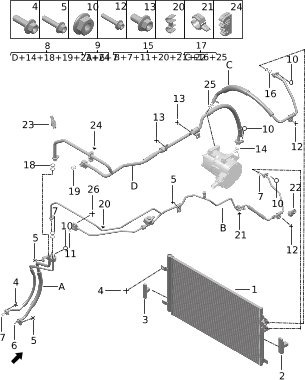

| Поз. | Артикул | Наименование | Кол-во | Применимость | Примечание |
| ---: | --- | --- | ---: | --- | --- |
| 1 | 810501002 | Конденсор | 1 | с 2022-07-10 |  |
| 2 | 810502001 | Правая уплотнительная прокладка конденсора | 1 | с 2022-07-10 |  |
| 3 | 810503001 | Левая уплотнительная прокладка конденсора | 1 | с 2022-07-10 |  |
| 4 | Q11001006 | Фланцевый болт | 4 | с 2022-07-10 |  |
| 5 | Q11001010 | Фланцевый болт | 4 | с 2022-07-10 |  |
| 6 | 810703008 | Уплотнительное кольцо O-ring | 1 | с 2022-07-10 | phi 10.8 x 2.4 |
| 7 | 810703002 | Уплотнительное кольцо O-ring | 9 | с 2022-07-10 | phi 7.65 x 1.78 |
| 8 | 810702005 | Выходная трубка переднего испарителя | 1 | 2023-05-10 - 2024-06-20 |  |
| 8 | 810702006 | Выходная трубка переднего испарителя | 1 | с 2024-06-20 |  |
| 9 | 810903002 | Трубка кондиционера модуля охлаждения батареи | 1 | с 2022-07-10 |  |
| 10 | Q21001002 | Фланцевая гайка | 4 | с 2022-07-10 |  |
| 11 | 810703003 | Уплотнительное кольцо O-ring | 2 | с 2024-06-20 | phi 6.8 x 1.9 |
| 12 | Q11001012 | Фланцевый болт | 2 | с 2022-07-10 |  |
| 13 | Q11001001 | Фланцевый болт | 2 | с 2022-07-10 |  |
| 14 | 810703027 | Уплотнительное кольцо O-ring | 2 | с 2024-06-20 |  |
| 15 | 810701004 | Входная трубка переднего испарителя | 1 | 2023-02-05 - 2024-06-20 |  |
| 15 | 810701005 | Входная трубка переднего испарителя | 1 | с 2024-06-20 |  |
| 16 | 810703001 | Уплотнительное кольцо O-ring | 2 | с 2024-07-05 | phi 10.82 x 1.78 |
| 17 | 810801009 | Нагнетательная трубка компрессора | 1 | 2023-05-10 - 2024-07-05 |  |
| 17 | 810801014 | Нагнетательная трубка компрессора | 1 | с 2024-07-05 |  |
| 18 | 810703005 | Уплотнительное кольцо O-ring | 2 | с 2024-06-20 | phi 14 x 1.78 |
| 19 | 810703004 | Уплотнительное кольцо O-ring | 2 | с 2024-06-20 | phi 13.6 x 2.43 |
| 20 | 810706001 | Двойной зажим трубок | 1 | с 2024-06-20 |  |
| 21 | 810706002 | Двойной зажим трубок | 1 | с 2024-06-20 |  |
| 22 | 810704001 | Датчик давления | 1 | с 2024-06-20 |  |
| 23 | 810705001 | Датчик давления и температуры | 1 | с 2024-06-20 |  |
| 24 | 810707001 | Двойной зажим трубок | 1 | с 2024-06-20 |  |
| 25 | 810703026 | Уплотнительное кольцо O-ring | 2 | с 2024-07-05 |  |
| 26 | Q11001107 | Фланцевый болт | 1 | с 2022-07-10 |  |

## 4011-10

### Компрессор кондиционера

- Применимость группы: с 2023-04-28
- Описание: Тип силовой установки: EREV

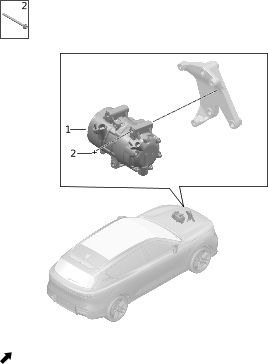

| Поз. | Артикул | Наименование | Кол-во | Применимость | Примечание |
| ---: | --- | --- | ---: | --- | --- |
| 1 | 810310010 | Компрессор | 1 | с 2023-05-10 |  |
| 2 | Q11001013 | Фланцевый болт | 3 | с 2022-07-10 |  |

## 4012-10

### Передняя система кондиционирования

- Применимость группы: с 2023-04-01
- Описание: Общая конфигурация: универсально для серии

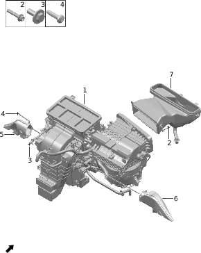

| Поз. | Артикул | Наименование | Кол-во | Применимость | Примечание |
| ---: | --- | --- | ---: | --- | --- |
| 1 | 810001002 | Блок кондиционера в сборе | 1 | 2022-07-10 - 2023-08-16 |  |
| 1 | 810001009 | Блок кондиционера в сборе | 1 | 2022-12-25 - 2024-09-19 |  |
| 1 | 810001024 | Блок кондиционера в сборе | 1 | с 2024-09-19 |  |
| 2 | Q11001004 | Фланцевый болт | 3 | с 2022-07-10 |  |
| 3 | Q11002003 | Болт | 6 | с 2022-07-10 |  |
| 4 | Q12002012 | Самонарезающий винт | 2 | с 2022-07-10 |  |
| 5 | 550132001 | Левый воздуховод обдува ног | 1 | с 2022-07-10 |  |
| 6 | 550133001 | Правый воздуховод обдува ног | 1 | с 2022-07-10 |  |
| 7 | 551701002 | Воздуховод впуска кондиционера | 1 | с 2022-07-10 |  |

## 4013-10

### Испаритель кондиционера

- Применимость группы: с 2023-05-17
- Описание: Общая конфигурация: универсально для серии

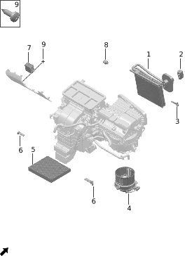

| Поз. | Артикул | Наименование | Кол-во | Применимость | Примечание |
| ---: | --- | --- | ---: | --- | --- |
| 1 | 810010001 | Сердцевина испарителя | 1 | с 2022-07-10 |  |
| 2 | 810007001 | Расширительный клапан | 1 | с 2022-07-10 |  |
| 3 | 810006001 | Датчик температуры испарителя | 1 | с 2022-07-10 |  |
| 4 | 810005001 | Вентилятор | 1 | с 2022-07-10 |  |
| 5 | 810004001 | Фильтрующий элемент кондиционера | 1 | с 2022-07-10 |  |
| 6 | 810011001 | Датчик температуры воздуховода | 4 | с 2022-07-10 |  |
| 7 | 360205005 | Датчик PM2.5 | 1 | с 2023-04-15 |  |
| 8 | 810012001 | Датчик качества воздуха | 1 | с 2022-07-10 |  |
| 9 | Q12002009 | Самонарезающий винт | 2 | с 2022-06-15 |  |

## 4015-10

### PTC кондиционера

- Применимость группы: с 2023-04-28
- Описание: Мониторинг качества воздуха: контроль воздуха в салоне

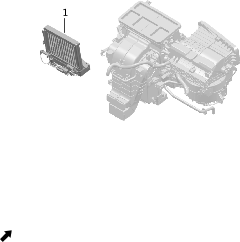

| Поз. | Артикул | Наименование | Кол-во | Применимость | Примечание |
| ---: | --- | --- | ---: | --- | --- |
| 1 | 810009001 | Блок PTC в сборе | 1 | 2022-07-10 - 2023-08-16 |  |
| 1 | 810009002 | Блок PTC в сборе | 1 | с 2022-12-25 |  |

## 4016-10

### Контроллер кондиционера

- Применимость группы: с 2023-04-28
- Описание: Общая конфигурация: универсально для серии

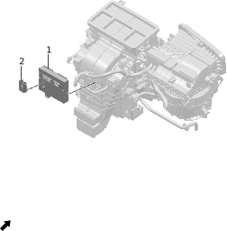

| Поз. | Артикул | Наименование | Кол-во | Применимость | Примечание |
| ---: | --- | --- | ---: | --- | --- |
| 1 | 810002006 | Контроллер автоматического кондиционера | 1 | с 2022-07-10 |  |
| 2 | 811401001 | Датчик температуры салона | 1 | с 2022-07-10 |  |

## 4017-10

### Панель управления кондиционером

- Применимость группы: с 2023-04-28
- Описание: Общая конфигурация: универсально для серии

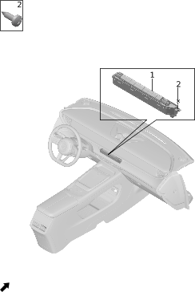

| Поз. | Артикул | Наименование | Кол-во | Применимость | Примечание |
| ---: | --- | --- | ---: | --- | --- |
| 1 | 373502001 | Панель управления автоматическим кондиционером | 1 | с 2022-07-10 | Матовый серебристый |
| 1 | 373502002 | Панель управления автоматическим кондиционером | 1 | с 2024-04-17 | Черный хром |
| 2 | Q12002011 | Самонарезающий винт | 2 | с 2022-07-10 |  |

## 4018-10

### Ароматизатор

- Применимость группы: с 2023-05-04
- Описание: Система автомобильного ароматизатора: установлена

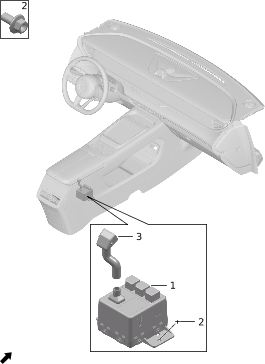

| Поз. | Артикул | Наименование | Кол-во | Применимость | Примечание |
| ---: | --- | --- | ---: | --- | --- |
| 1 | 810003007 | Ароматизатор | 1 | с 2022-07-10 |  |
| 2 | Q11001001 | Фланцевый болт | 3 | с 2022-07-10 |  |
| 3 | 810008001 | Трубка подачи аромата | 1 | с 2022-07-10 |  |

## 4020-10

### Подушка безопасности водителя

- Применимость группы: с 2023-05-04
- Описание: Общая конфигурация: универсально для серии

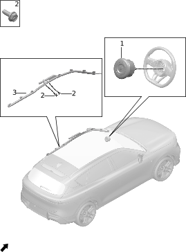

| Поз. | Артикул | Наименование | Кол-во | Применимость | Примечание |
| ---: | --- | --- | ---: | --- | --- |
| 1 | 823004024AG05 | Подушка безопасности водителя | 1 | с 2023-03-10 | Серо-бежевый; красный + бежевый |
| 1 | 823004024BKGA | Подушка безопасности водителя | 1 | с 2023-03-10 | Черный обсидиан + грубая текстура; черный + синий |
| 1 | 823004024BRGC | Подушка безопасности водителя | 1 | с 2023-03-10 | Светло-коричневый + грубая текстура; светло-коричневый + синий |
| 1 | 823004035JG10 | Подушка безопасности водителя | 1 | с 2024-04-17 | Облачный серый; черный + серый |
| 1 | 823004036JK01 | Подушка безопасности водителя | 1 | с 2024-04-17 | Черный обсидиан; черный + зеленый |
| 2 | Q11002020 | Болт | 2 | с 2022-07-10 |  |
| 3 | 823005002 | Левая шторка безопасности | 1 | с 2022-07-10 |  |

## 4021-10

### Подушка безопасности пассажира

- Применимость группы: с 2023-05-04
- Описание: Общая конфигурация: универсально для серии

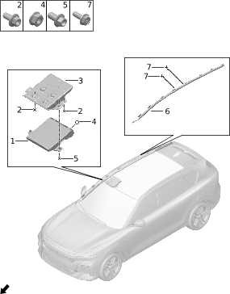

| Поз. | Артикул | Наименование | Кол-во | Применимость | Примечание |
| ---: | --- | --- | ---: | --- | --- |
| 1 | 823003002 | Подушка безопасности пассажира | 1 | 2022-07-10 - 2023-08-18 |  |
| 1 | 823003007 | Подушка безопасности пассажира | 1 | с 2023-08-18 |  |
| 2 | Q12001015 | Винт с внутренним шестигранником | 5 | с 2022-07-10 |  |
| 3 | 570001001 | Кронштейн пассажирской подушки | 1 | с 2022-07-10 |  |
| 4 | Q21001004 | Фланцевая гайка | 2 | с 2022-07-10 |  |
| 5 | Q11001015 | Фланцевый болт | 1 | с 2022-07-10 |  |
| 6 | 823006002 | Правая шторка безопасности | 1 | с 2022-07-10 |  |
| 7 | Q11002020 | Болт | 2 | с 2022-07-10 |  |

## 4024-10

### Передние ремни безопасности

- Применимость группы: с 2023-05-04
- Описание: Общая конфигурация: универсально для серии

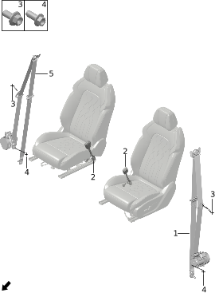

| Поз. | Артикул | Наименование | Кол-во | Применимость | Примечание |
| ---: | --- | --- | ---: | --- | --- |
| 1 | 821203014 | Левый передний ремень безопасности | 1 | 2022-10-31 - 2023-11-15 |  |
| 1 | 821203020 | Левый передний ремень безопасности | 1 | с 2023-11-15 |  |
| 2 | 821206007 | Замок переднего ремня безопасности | 2 | с 2022-12-25 |  |
| 3 | Q11001001 | Фланцевый болт | 2 | с 2022-07-10 |  |
| 4 | Q11002035 | Болт | 2 | с 2022-07-10 |  |
| 5 | 821204014 | Правый передний ремень безопасности | 1 | 2022-10-31 - 2023-11-14 |  |
| 5 | 821204020 | Правый передний ремень безопасности | 1 | с 2023-11-14 |  |

## 4027-10

### Задние ремни безопасности

- Применимость группы: с 2023-05-06
- Описание: Общая конфигурация: универсально для серии

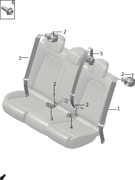

| Поз. | Артикул | Наименование | Кол-во | Применимость | Примечание |
| ---: | --- | --- | ---: | --- | --- |
| 1 | 821201007 | Боковой ремень безопасности второго ряда | 2 | 2022-10-26 - 2023-11-14 |  |
| 1 | 821201008 | Боковой ремень безопасности второго ряда | 2 | с 2023-11-14 |  |
| 2 | Q11002035 | Болт | 4 | с 2022-07-10 |  |
| 3 | 821208002 | Узел двойной задней пряжки | 1 | с 2023-02-05 |  |
| 4 | 821207003 | Узел одиночной задней пряжки | 1 | с 2023-02-05 |  |
| 5 | 821202007 | Центральный ремень безопасности второго ряда | 1 | 2022-10-31 - 2024-01-20 |  |
| 5 | 821202009 | Центральный ремень безопасности второго ряда | 1 | с 2023-11-14 |  |

## 4028-10

### Регулятор высоты

- Применимость группы: с 2023-05-04
- Описание: Общая конфигурация: универсально для серии

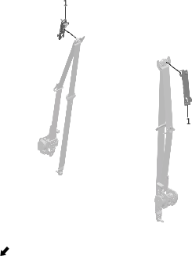

| Поз. | Артикул | Наименование | Кол-во | Применимость | Примечание |
| ---: | --- | --- | ---: | --- | --- |
| 1 | 821205002 | Регулятор высоты ремня безопасности | 2 | с 2022-07-10 |  |

## 4030-10

### Передний датчик столкновения

- Применимость группы: с 2023-05-04
- Описание: Общая конфигурация: универсально для серии

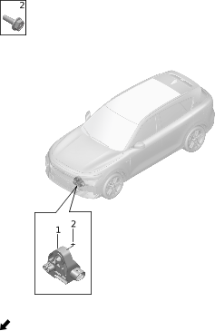

| Поз. | Артикул | Наименование | Кол-во | Применимость | Примечание |
| ---: | --- | --- | ---: | --- | --- |
| 1 | 360201001 | Передний датчик столкновения | 2 | с 2022-07-10 |  |
| 2 | Q11002021 | Болт | 2 | с 2022-07-10 |  |

## 4031-10

### Боковые датчики столкновения

- Применимость группы: с 2023-05-04
- Описание: Общая конфигурация: универсально для серии

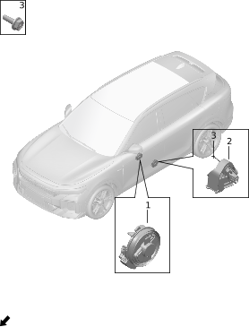

| Поз. | Артикул | Наименование | Кол-во | Применимость | Примечание |
| ---: | --- | --- | ---: | --- | --- |
| 1 | 360203001 | Датчик давления двери | 2 | с 2022-07-10 |  |
| 2 | 360202001 | Боковой датчик столкновения | 2 | с 2022-07-10 |  |
| 3 | Q11002018 | Болт | 2 | с 2022-07-10 |  |

## 4034-10

### Блок управления подушками безопасности

- Применимость группы: с 2023-05-04
- Описание: Общая конфигурация: универсально для серии

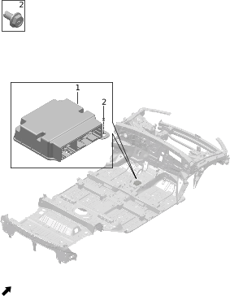

| Поз. | Артикул | Наименование | Кол-во | Применимость | Примечание |
| ---: | --- | --- | ---: | --- | --- |
| 1 | 360701001 | Электронный блок управления подушками безопасности | 1 | с 2022-07-10 |  |
| 2 | Q11002018 | Болт | 3 | с 2022-07-10 |  |

