- [6010-10 Передний бампер](#6010-10-передний-бампер)
- [6011-10 Задний бампер](#6011-10-задний-бампер)
- [6012-10 Передняя решетка](#6012-10-передняя-решетка)
- [6013-10 Внутреннее зеркало и солнцезащитные козырьки](#6013-10-внутреннее-зеркало-и-солнцезащитные-козырьки)
- [6014-10 Наружные зеркала заднего вида](#6014-10-наружные-зеркала-заднего-вида)
- [6015-10 Механизм переднего стеклоочистителя](#6015-10-механизм-переднего-стеклоочистителя)
- [6016-10 Механизм заднего стеклоочистителя](#6016-10-механизм-заднего-стеклоочистителя)
- [6017-10 Омыватель](#6017-10-омыватель)
- [6018-10 Лобовое стекло](#6018-10-лобовое-стекло)
- [6020-10 Заднее стекло](#6020-10-заднее-стекло)
- [6021-10 Стекла задних форточек](#6021-10-стекла-задних-форточек)
- [6022-10 Декоративные элементы окон](#6022-10-декоративные-элементы-окон)
- [6023-10 Люк](#6023-10-люк)
- [6024-10 Стеклянная крыша люка](#6024-10-стеклянная-крыша-люка)
- [6025-10 Рейлинги](#6025-10-рейлинги)
- [6026-10 Защитные элементы кузова](#6026-10-защитные-элементы-кузова)
- [6027-10 Кузовные уплотнители и молдинги](#6027-10-кузовные-уплотнители-и-молдинги)
- [6028-10 Спойлер](#6028-10-спойлер)
- [6029-10 Эмблемы и наклейки](#6029-10-эмблемы-и-наклейки)
- [6030-10 Накладки моторного отсека](#6030-10-накладки-моторного-отсека)
- [6032-10 Панель приборов](#6032-10-панель-приборов)
- [6033-10 Передние воздуховоды](#6033-10-передние-воздуховоды)
- [6034-10 Дефлекторы панели приборов](#6034-10-дефлекторы-панели-приборов)
- [6035-10 Поперечная балка панели приборов](#6035-10-поперечная-балка-панели-приборов)
- [6036-10 Центральная консоль](#6036-10-центральная-консоль)
- [6037-10 Задний воздуховод](#6037-10-задний-воздуховод)
- [6040-10 Обивка крыши](#6040-10-обивка-крыши)
- [6041-10 Передняя боковая обивка](#6041-10-передняя-боковая-обивка)
- [6042-10 Средняя боковая обивка](#6042-10-средняя-боковая-обивка)
- [6043-10 Задняя боковая обивка](#6043-10-задняя-боковая-обивка)
- [6044-10 Обивка передних дверей](#6044-10-обивка-передних-дверей)
- [6045-10 Обивка задних дверей](#6045-10-обивка-задних-дверей)
- [6046-10 Обивка задней двери](#6046-10-обивка-задней-двери)
- [6047-10 Ковровое покрытие](#6047-10-ковровое-покрытие)
- [6049-10 Облицовка заднего багажного отсека](#6049-10-облицовка-заднего-багажного-отсека)
- [6050-10 Шумоизоляционные элементы](#6050-10-шумоизоляционные-элементы)
- [6051-10 Сиденье водителя](#6051-10-сиденье-водителя)
- [6052-10 Подушка и спинка сиденья водителя](#6052-10-подушка-и-спинка-сиденья-водителя)
- [6053-10 Сиденье переднего пассажира](#6053-10-сиденье-переднего-пассажира)
- [6054-10 Подушка и спинка сиденья переднего пассажира](#6054-10-подушка-и-спинка-сиденья-переднего-пассажира)
- [6055-10 Сиденья второго ряда](#6055-10-сиденья-второго-ряда)
- [6056-10 Подушка и спинка сидений второго ряда](#6056-10-подушка-и-спинка-сидений-второго-ряда)

## 6010-10 Передний бампер

- Применимость группы: с 2023-05-17
- Описание: Версия продажи: Sport

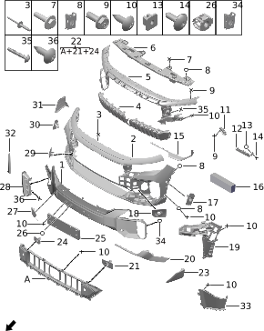

| Поз. | Артикул | Наименование | Кол-во | Применимость | Примечание |
| ---: | --- | --- | ---: | --- | --- |
| 1 | 280338011 | Облицовка переднего бампера | 1 | с 2023-02-05 |  |
| 2 | 280302006 | Нижняя облицовка переднего бампера | 1 | 2023-02-05 - 2023-08-30 |  |
| 2 | 280302009 | Нижняя облицовка переднего бампера | 1 | с 2023-08-30 |  |
| 2 | 280302010 | Нижняя облицовка переднего бампера | 1 |  |  |
| 3 | Q13001002 | Заклепка | 4 | с 2022-07-10 |  |
| 4 | 280328011 | Передняя решетка | 1 | с 2023-02-05 |  |
| 5 | 280312003 | Центральная опорная пластина переднего бампера | 1 | с 2023-02-05 |  |
| 6 | 280303007 | Центральный кронштейн переднего бампера | 1 | с 2023-05-26 |  |
| 7 | Q11002006 | Болт | 6 | с 2022-07-10 |  |
| 11 | 280317001 | Левая верхняя опора переднего бампера | 1 | с 2022-07-10 |  |
| 11 | 280318001 | Правая верхняя опора переднего бампера | 1 | с 2022-07-10 |  |
| 12 | 280315004 | Левая опора переднего бампера | 1 | с 2023-03-28 |  |
| 12 | 280316004 | Правая опора переднего бампера | 1 | с 2023-03-28 |  |
| 13 | 610508001 | Гайка | 2 | с 2022-07-10 |  |
| 14 | Q12001018 | Винт с внутренним шестигранником | 9 | с 2022-07-10 |  |
| 15 | 280351002 | Левая декоративная планка решетки | 1 | с 2023-02-05 |  |
| 15 | 280352002 | Правая декоративная планка решетки | 1 | с 2023-02-05 |  |
| 16 | 280361001 | Пеноматериал | 1 | с 2023-05-10 |  |
| 17 | 280313021 | Левый передний кронштейн радара | 1 | с 2023-02-05 |  |
| 18 | 280313022 | Левый передний кронштейн радара | 1 | с 2023-02-05 |  |
| 19 | 280310008 | Левая опорная пластина переднего бампера | 1 | 2023-02-05 - 2024-02-26 | Оборудование ADAS L2.9 |
| 19 | 280310009 | Левая опорная пластина переднего бампера | 1 | 2024-02-26 - 2024-09-25 | Оборудование ADAS L2.9 |
| 19 | 280310010 | Левая опорная пластина переднего бампера | 1 | 2024-03-15 - 2024-10-15 | Без оборудования ADAS L2.9 |
| 19 | 280310014 | Левая опорная пластина переднего бампера | 1 | с 2024-09-25 | Оборудование ADAS L2.9 |
| 19 | 280310015 | Левая опорная пластина переднего бампера | 1 | с 2024-10-15 | Без оборудования ADAS L2.9 |
| 19 | 280311008 | Правая опорная пластина переднего бампера | 1 | 2023-02-05 - 2024-02-26 | Оборудование ADAS L2.9 |
| 19 | 280311009 | Правая опорная пластина переднего бампера | 1 | 2024-02-26 - 2024-09-23 | Оборудование ADAS L2.9 |
| 19 | 280311010 | Правая опорная пластина переднего бампера | 1 | 2024-03-15 - 2024-10-15 | Без оборудования ADAS L2.9 |
| 19 | 280311014 | Правая опорная пластина переднего бампера | 1 | с 2024-09-23 | Оборудование ADAS L2.9 |
| 19 | 280311015 | Правая опорная пластина переднего бампера | 1 | с 2024-10-15 | Без оборудования ADAS L2.9 |
| 20 | 280308009 | Левая декоративная накладка переднего бампера | 1 | с 2023-02-05 |  |
| 20 | 280309009 | Правая декоративная накладка переднего бампера | 1 | с 2023-02-05 |  |
| 21 | 280313020 | Левый передний кронштейн радара | 1 | с 2023-02-05 |  |
| 22 | 280304010 | Нижняя решетка переднего бампера | 1 | с 2023-02-05 |  |
| 23 | 280353002 | Левая нижняя декоративная накладка переднего бампера | 1 | с 2023-02-05 |  |
| 24 | 280314020 | Правый передний кронштейн радара | 1 | с 2023-02-05 |  |
| 25 | 280307006 | Передняя рамка номерного знака | 1 | с 2023-02-05 |  |
| 26 | Q21007001 | Пружинная гайка | 1 | 2022-07-10 - 2023-12-27 |  |
| 27 | 280306003 | Заглушка переднего буксировочного крюка | 1 | с 2023-02-05 |  |
| 28 | 280355002 | Левый декоративный элемент переднего бампера | 1 | 2023-02-05 - 2024-04-22 |  |
| 28 | 280355003 | Левый декоративный элемент переднего бампера | 1 | с 2024-04-22 |  |
| 28 | 280356002 | Правый декоративный элемент переднего бампера | 1 | 2023-02-05 - 2024-04-22 |  |
| 28 | 280356003 | Правый декоративный элемент переднего бампера | 1 | с 2024-04-22 |  |
| 29 | 280314022 | Правый передний кронштейн радара | 1 | с 2023-02-05 |  |
| 30 | 280314021 | Правый передний кронштейн радара | 1 | с 2023-02-05 |  |
| 31 | 280354002 | Правая нижняя декоративная накладка переднего бампера | 1 | с 2023-02-05 |  |
| 32 | 280334003 | Правая декоративная планка переднего бампера | 1 | с 2023-02-05 | Серебристый, анодированный |
| 32 | 280334005 | Правая декоративная планка переднего бампера | 1 | с 2024-04-17 | Глянцевый черный |
| 32 | 280335003 | Левая декоративная планка переднего бампера | 1 | с 2023-02-05 | Серебристый, анодированный |
| 32 | 280335005 | Левая декоративная планка переднего бампера | 1 | с 2024-04-17 | Глянцевый черный |
| 33 | 280336003 | Правая внутренняя панель воздушной шторки переднего бампера | 1 | 2023-02-05 - 2024-10-18 |  |
| 33 | 280337003 | Левая внутренняя панель воздушной шторки переднего бампера | 1 | 2023-02-05 - 2024-10-18 |  |
| 34 | Q21003002 | Пластинчатая пружинная гайка | 4 | с 2022-07-10 |  |
| 35 | Q12002007 | Самонарезающий винт | 2 | с 2022-07-10 |  |
| 36 | Q12002020 | Самонарезающий винт | 4 | с 2024-01-26 |  |

## 6011-10 Задний бампер

- Применимость группы: с 2023-04-01
- Описание: Версия продажи: Sport

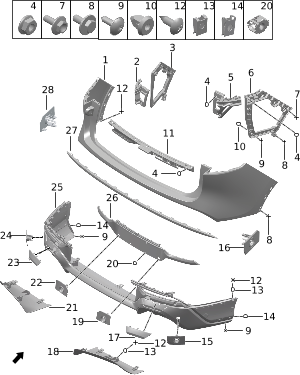

| Поз. | Артикул | Наименование | Кол-во | Применимость | Примечание |
| ---: | --- | --- | ---: | --- | --- |
| 1 | 280402001 | Верхняя облицовка заднего бампера | 1 | с 2022-07-10 |  |
| 2 | 280414001 | Левая верхняя опора заднего бампера | 1 | с 2022-07-10 |  |
| 3 | 280412001 | Левая опора заднего бампера | 1 | 2022-07-10 - 2024-10-28 |  |
| 4 | Q21001002 | Фланцевая гайка | 14 | с 2022-07-10 |  |
| 5 | 280415001 | Правая верхняя опора заднего бампера | 1 | с 2022-07-10 |  |
| 6 | 280413001 | Правая опора заднего бампера | 1 | 2022-07-10 - 2024-10-29 |  |
| 7 | Q11001070 | Фланцевый болт | 6 | с 2022-07-10 |  |
| 8 | Q11002001 | Болт | 2 | с 2022-07-10 |  |
| 9 | Q12001018 | Винт с внутренним шестигранником | 8 | с 2022-07-10 |  |
| 10 | Q41006003 | Герметичная клипса | 4 | с 2022-07-10 |  |
| 11 | 280411001 | Верхняя опора заднего бампера | 1 | с 2022-07-10 |  |
| 12 | Q12002013 | Самонарезающий винт | 5 | с 2022-07-10 |  |
| 13 | Q21003002 | Пластинчатая пружинная гайка | 7 | с 2022-07-10 |  |
| 14 | Q21003001 | Пластинчатая пружинная гайка | 4 | с 2022-07-10 |  |
| 15 | 280409017 | Правый задний кронштейн радара | 1 | с 2023-02-05 |  |
| 16 | 280409016 | Правый задний кронштейн радара | 1 | с 2023-02-05 |  |
| 17 | 280422002 | Правая заглушка заднего бампера | 1 | с 2023-02-05 |  |
| 18 | 280421002 | Правая нижняя декоративная накладка заднего бампера | 1 | с 2023-02-05 |  |
| 19 | 280409018 | Правый задний кронштейн радара | 1 | с 2023-02-05 |  |
| 20 | Q21007001 | Пружинная гайка | 4 | 2022-07-10 - 2023-12-27 |  |
| 21 | 280420002 | Левая нижняя декоративная накладка заднего бампера | 1 | с 2023-02-05 |  |
| 22 | 280408014 | Левый задний кронштейн радара | 1 | с 2023-02-05 |  |
| 23 | 280410003 | Заглушка заднего буксировочного крюка | 1 | с 2023-02-05 |  |
| 24 | 280408013 | Левый задний кронштейн радара | 1 | с 2023-02-05 |  |
| 25 | 280403004 | Нижняя облицовка заднего бампера | 1 | с 2023-02-05 |  |
| 26 | 280419003 | Задняя рамка номерного знака | 1 | с 2023-02-05 |  |
| 27 | 280406003 | Центральная декоративная планка заднего бампера | 1 | 2023-02-05 - 2024-02-22 |  |
| 27 | 280406004 | Центральная декоративная планка заднего бампера | 1 | с 2024-02-22 |  |
| 28 | 280408012 | Левый задний кронштейн радара | 1 | с 2023-02-05 |  |

## 6012-10 Передняя решетка

- Применимость группы: с 2023-04-01
- Описание: Тип силовой установки: EREV

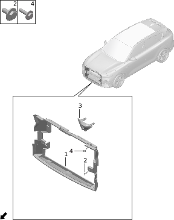

| Поз. | Артикул | Наименование | Кол-во | Применимость | Примечание |
| ---: | --- | --- | ---: | --- | --- |
| 1 | 280326004 | Направляющая рамка радиатора | 1 | с 2022-07-10 |  |
| 2 | Q11002001 | Болт | 3 | с 2022-07-10 |  |
| 3 | 280327002 | Декоративная панель передней камеры | 1 | с 2022-07-10 | Оборудование ADAS L2.9 |
| 3 | 280327003 | Декоративная панель передней камеры | 1 | с 2024-03-15 | Без оборудования ADAS L2.9 |
| 4 | Q11002041 | Болт | 2 | с 2022-07-10 |  |

## 6013-10 Внутреннее зеркало и солнцезащитные козырьки

- Применимость группы: с 2023-04-01
- Описание: Общая конфигурация: универсально для серии

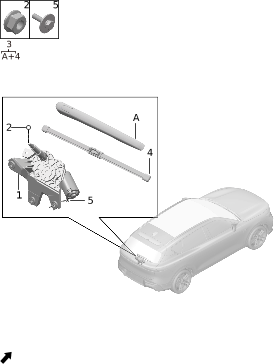

| Поз. | Артикул | Наименование | Кол-во | Применимость | Примечание |
| ---: | --- | --- | ---: | --- | --- |
| 1 | 820101007 | Внутреннее зеркало заднего вида | 1 | 2022-12-25 - 2024-01-10 |  |
| 1 | 820101011 | Внутреннее зеркало заднего вида | 1 | 2024-01-10 - 2024-10-03 |  |
| 1 | 820101012 | Внутреннее зеркало заднего вида | 1 | с 2024-10-03 |  |
| 2 | 820104004 | Задняя декоративная накладка внутреннего зеркала | 1 | 2022-07-10 - 2024-07-06 |  |
| 2 | 820104009 | Задняя декоративная накладка внутреннего зеркала | 1 | с 2024-07-06 |  |
| 3 | 820103005 | Передняя декоративная накладка внутреннего зеркала | 1 | с 2022-07-10 |  |
| 4 | 552501001BETA | Левый солнцезащитный козырек | 1 | с 2022-07-10 | Бежевый + ткань; черно-синий салон |
| 4 | 552501001BLGB | Левый солнцезащитный козырек | 1 | с 2022-07-10 | Космический синий + грубая текстура; светло-коричневый + синий салон |
| 4 | 552501004TG02 | Левый солнцезащитный козырек | 1 | с 2022-07-10 | Ткань + серо-бежевый; красный + бежевый |
| 4 | 552501018TG11 | Левый солнцезащитный козырек | 1 | с 2024-04-17 | Светло-пестрый серый; черный + серый |
| 4 | 552501019TK11 | Левый солнцезащитный козырек | 1 | с 2024-04-17 | Смесовый черный; черный + зеленый |
| 5 | 552505001BEGB | Накладка основания левого козырька | 1 | с 2022-07-10 | Бежевый + мелкая матовая текстура; черно-синий салон |
| 5 | 552505001BLGB | Накладка основания левого козырька | 1 | с 2022-07-10 | Космический синий + грубая текстура; светло-коричневый + синий салон |
| 5 | 552505002JG05 | Накладка основания левого козырька | 1 | с 2022-07-10 | Серо-бежевый + грубая текстура; красный + бежевый |
| 5 | 552505005GZS1 | Накладка основания левого козырька | 1 | с 2024-04-17 | Черный + зеленый |
| 5 | 552505006JG08 | Накладка основания левого козырька | 1 | с 2024-04-17 | Темно-серый или светло-серый; черный + серый |
| 6 | 552503002BEGB | Крючок левого козырька | 1 | с 2022-07-10 | Бежевый + мелкая матовая текстура; черно-синий салон |
| 6 | 552503002BLGB | Крючок левого козырька | 1 | с 2022-07-10 | Космический синий + грубая текстура; светло-коричневый + синий салон |
| 6 | 552503003JG05 | Крючок левого козырька | 1 | с 2022-07-10 | Серо-бежевый + грубая текстура; красный + бежевый |
| 6 | 552503004GZS1 | Крючок левого козырька | 1 | с 2024-04-17 | Черный + зеленый |
| 6 | 552503005JG08 | Крючок левого козырька | 1 | с 2024-04-17 | Темно-серый или светло-серый; черный + серый |
| 7 | Q12001011 | Винт с внутренним шестигранником | 6 | с 2022-07-10 |  |
| 8 | 552507001BEGB | Накладка крючка козырька | 2 | с 2022-07-10 | Бежевый + мелкая матовая текстура; черно-синий салон |
| 8 | 552507001BLGB | Накладка крючка козырька | 2 | с 2022-07-10 | Космический синий + грубая текстура; светло-коричневый + синий салон |
| 8 | 552507004JG05 | Накладка крючка козырька | 2 | с 2022-07-10 | Серо-бежевый + грубая текстура; красный + бежевый |
| 8 | 552507005GZS1 | Накладка крючка козырька | 2 | с 2024-04-17 | Черный + зеленый |
| 8 | 552507008JG08 | Накладка крючка козырька | 2 | с 2024-04-17 | Темно-серый или светло-серый; черный + серый |
| 9 | 552504002BEGB | Крючок правого козырька | 1 | с 2022-07-10 | Бежевый + мелкая матовая текстура; черно-синий салон |
| 9 | 552504002BLGB | Крючок правого козырька | 1 | с 2022-07-10 | Космический синий + грубая текстура; светло-коричневый + синий салон |
| 9 | 552504003GZS1 | Крючок правого козырька | 1 | с 2024-04-17 | Черный + зеленый |
| 9 | 552509003JG05 | Крючок козырька | 1 | с 2022-07-10 | Серо-бежевый + грубая текстура; красный + бежевый |
| 9 | 552509005JG08 | Крючок козырька | 1 | с 2024-04-17 | Темно-серый или светло-серый; черный + серый |
| 10 | 552506001BEGB | Накладка основания правого козырька | 1 | с 2022-07-10 | Бежевый + мелкая матовая текстура; черно-синий салон |
| 10 | 552506001BLGB | Накладка основания правого козырька | 1 | с 2022-07-10 | Космический синий + грубая текстура; светло-коричневый + синий салон |
| 10 | 552506002JG05 | Накладка основания правого козырька | 1 | с 2022-07-10 | Серо-бежевый + грубая текстура; красный + бежевый |
| 10 | 552506005GZS1 | Накладка основания правого козырька | 1 | с 2024-04-17 | Черный + зеленый |
| 10 | 552506006JG08 | Накладка основания правого козырька | 1 | с 2024-04-17 | Темно-серый или светло-серый; черный + серый |
| 11 | 552502001BETA | Правый солнцезащитный козырек | 1 | с 2022-07-10 | Бежевый + ткань; черно-синий салон |
| 11 | 552502001BLGB | Правый солнцезащитный козырек | 1 | с 2022-07-10 | Космический синий + грубая текстура; светло-коричневый + синий салон |
| 11 | 552502004TG02 | Правый солнцезащитный козырек | 1 | с 2022-07-10 | Ткань + серо-бежевый; красный + бежевый |
| 11 | 552502023TG11 | Правый солнцезащитный козырек | 1 | с 2024-03-15 | Светло-пестрый серый; черный + серый |
| 11 | 552502024TK11 | Правый солнцезащитный козырек | 1 | с 2024-03-15 | Смесовый черный; черный + зеленый |

## 6014-10 Наружные зеркала заднего вида

- Применимость группы: с 2023-05-10
- Описание: Общая конфигурация: универсально для серии

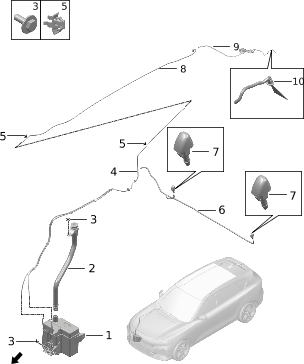

| Поз. | Артикул | Наименование | Кол-во | Применимость | Примечание |
| ---: | --- | --- | ---: | --- | --- |
| 1 | 820201019 | Левое наружное зеркало | 1 | 2022-07-10 - 2024-07-15 | Серебристый, анодированный; оборудование ADAS L2.9 |
| 1 | 820201041 | Левое наружное зеркало | 1 |  | Серебристый, анодированный; оборудование ADAS L2.9 |
| 1 | 820201043 | Левое наружное зеркало | 1 |  | Серебристый, анодированный; оборудование ADAS L2.9 |
| 1 | 820201044 | Левое наружное зеркало | 1 | с 2024-03-15 | Глянцевый черный; без оборудования ADAS L2.9 |
| 1 | 820201045 | Левое наружное зеркало | 1 | с 2024-07-16 | Глянцевый черный; оборудование ADAS L2.9 |
| 1 | 820201046 | Левое наружное зеркало | 1 | с 2024-07-15 | Серебристый, анодированный; оборудование ADAS L2.9 |
| 1 | 820201047 | Левое наружное зеркало | 1 | 2024-03-15 - 2024-07-16 | Глянцевый черный; оборудование ADAS L2.9 |
| 1 | 820202025 | Правое наружное зеркало | 1 | 2022-07-10 - 2024-07-15 | Серебристый, анодированный; оборудование ADAS L2.9 |
| 1 | 820202046 | Правое наружное зеркало | 1 |  | Серебристый, анодированный; оборудование ADAS L2.9 |
| 1 | 820202048 | Правое наружное зеркало | 1 |  | Серебристый, анодированный; оборудование ADAS L2.9 |
| 1 | 820202049 | Правое наружное зеркало | 1 | с 2024-03-15 | Глянцевый черный; без оборудования ADAS L2.9 |
| 1 | 820202050 | Правое наружное зеркало | 1 | с 2024-07-16 | Глянцевый черный; оборудование ADAS L2.9 |
| 1 | 820202051 | Правое наружное зеркало | 1 | с 2024-07-15 | Серебристый, анодированный; оборудование ADAS L2.9 |
| 1 | 820202052 | Правое наружное зеркало | 1 | 2024-03-15 - 2024-07-16 | Глянцевый черный; оборудование ADAS L2.9 |
| 2 | Q11001004 | Фланцевый болт | 6 | с 2022-07-10 |  |
| 3 | 820205003 | Стеклянный элемент левого наружного зеркала | 1 | с 2022-07-10 |  |
| 3 | 820206002 | Стеклянный элемент правого наружного зеркала | 1 | с 2022-07-10 |  |

## 6015-10 Механизм переднего стеклоочистителя

- Применимость группы: с 2023-05-10
- Описание: Общая конфигурация: универсально для серии

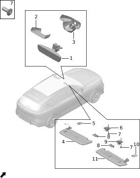

| Поз. | Артикул | Наименование | Кол-во | Применимость | Примечание |
| ---: | --- | --- | ---: | --- | --- |
| 1 | 520501001 | Привод переднего стеклоочистителя | 1 | с 2022-07-10 |  |
| 2 | 520503001 | Левая передняя щетка стеклоочистителя | 1 | с 2022-07-10 |  |
| 3 | 520506001 | Левый рычаг переднего стеклоочистителя | 1 | с 2022-07-10 |  |
| 4 | 520507001 | Правый рычаг переднего стеклоочистителя | 1 | с 2022-07-10 |  |
| 5 | 520504001 | Правая передняя щетка стеклоочистителя | 1 | с 2022-07-10 |  |
| 6 | 520502001 | Колпачок оси рычага стеклоочистителя | 2 | с 2022-07-10 |  |
| 7 | Q21001005 | Фланцевая гайка | 2 | с 2022-07-10 |  |
| 8 | Q11002016 | Болт | 3 | с 2022-07-10 |  |

## 6016-10 Механизм заднего стеклоочистителя

- Применимость группы: с 2023-05-10
- Описание: Общая конфигурация: универсально для серии

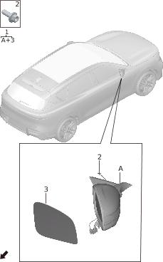

| Поз. | Артикул | Наименование | Кол-во | Применимость | Примечание |
| ---: | --- | --- | ---: | --- | --- |
| 1 | 520508001 | Привод заднего стеклоочистителя | 1 | с 2022-07-10 |  |
| 2 | Q21001004 | Фланцевая гайка | 1 | с 2022-07-10 |  |
| 3 | 520505001 | Задний стеклоочиститель в сборе | 1 | с 2022-07-10 |  |
| 4 | 520510001 | Задняя щетка стеклоочистителя | 1 | с 2022-07-10 |  |
| 5 | Q11002016 | Болт | 3 | с 2022-07-10 |  |

## 6017-10 Омыватель

- Применимость группы: с 2023-05-08
- Описание: Общая конфигурация: универсально для серии

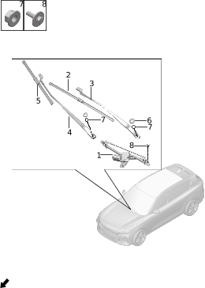

| Поз. | Артикул | Наименование | Кол-во | Применимость | Примечание |
| ---: | --- | --- | ---: | --- | --- |
| 1 | 520701004 | Бачок омывающей жидкости | 1 | с 2022-12-25 |  |
| 2 | 520707001 | Заливная трубка | 1 | с 2022-07-10 |  |
| 3 | Q11002003 | Болт | 4 | с 2022-07-10 |  |
| 4 | 520706001 | Передний трубопровод | 1 | с 2022-07-10 |  |
| 5 | Q31003001 | Одинарный зажим трубки | 4 | с 2022-07-10 |  |
| 6 | 520706002 | Передний трубопровод | 1 | с 2022-07-10 |  |
| 7 | 520703001 | Левая форсунка | 2 | с 2022-07-10 |  |
| 8 | 520705002 | Задний трубопровод | 1 | с 2022-07-10 |  |
| 9 | 520705007 | Задний трубопровод | 1 | с 2022-07-10 |  |
| 10 | 520702001 | Задняя форсунка | 1 | с 2022-07-10 |  |

## 6018-10 Лобовое стекло

- Применимость группы: с 2023-05-08
- Описание: Общая конфигурация: универсально для серии

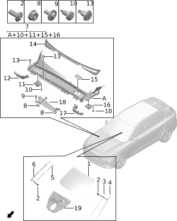

| Поз. | Артикул | Наименование | Кол-во | Применимость | Примечание |
| ---: | --- | --- | ---: | --- | --- |
| 1 | 520001019 | Лобовое стекло | 1 | 2022-07-10 - 2023-10-06 | Оборудование ADAS L2.9 |
| 1 | 520001022 | Лобовое стекло | 1 | 2023-10-06 - 2024-12-30 | Оборудование ADAS L2.9 |
| 1 | 520001029 | Лобовое стекло | 1 | 2024-03-15 - 2024-12-30 | Без оборудования ADAS L2.9 |
| 1 | 520001033 | Лобовое стекло | 1 | с 2024-12-30 | Оборудование ADAS L2.9 |
| 1 | 520001034 | Лобовое стекло | 1 | 2024-12-30 - 2025-01-05 | Без оборудования ADAS L2.9 |
| 1 | 520001035 | Лобовое стекло | 1 | с 2025-01-05 | Артефакт источника: без ADAS L2.9 |
| 2 | Q13001001 | Заклепка | 12 | с 2022-07-10 |  |
| 6 | 500621001 | Правая планка лобового стекла | 1 | с 2022-07-10 |  |
| 7 | 522001001 | Нижняя декоративная панель ветрового стекла | 1 | с 2022-07-10 |  |
| 8 | Q21001002 | Фланцевая гайка | 1 | с 2022-07-10 |  |
| 9 | Q12001002 | Винт с внутренним шестигранником | 1 | с 2022-07-10 |  |
| 10 | Q12002010 | Самонарезающий винт | 8 | с 2022-07-10 |  |
| 11 | 500626001 | Правый водоотводящий желоб | 1 | с 2022-07-10 |  |
| 12 | 522003002 | Правое уплотнение нижней крышки | 1 | с 2022-07-10 |  |
| 13 | Q41001028 | Клипса | 5 | с 2022-10-01 |  |
| 14 | 840207001 | Декоративная накладка задней кромки капота | 1 | с 2022-07-10 |  |
| 15 | 500609001 | Крышка заливки тормозной жидкости | 1 | с 2022-07-10 |  |
| 16 | 500625001 | Левый водоотводящий желоб | 1 | с 2022-07-10 |  |
| 17 | 522002002 | Левое уплотнение нижней крышки | 1 | с 2022-07-10 |  |
| 18 | 500622001 | Водоотводящий щиток | 1 | с 2022-07-10 |  |
| 19 | 820102005 | Основание декоративного кожуха внутреннего зеркала | 1 | с 2022-07-10 | Оборудование ADAS L2.9 |
| 19 | 820102006 | Основание декоративного кожуха внутреннего зеркала | 1 | 2024-03-15 - 2024-12-30 | Без оборудования ADAS L2.9 |
| 19 | 820102007 | Основание декоративного кожуха внутреннего зеркала | 1 | с 2024-12-30 | Без оборудования ADAS L2.9 |

## 6020-10 Заднее стекло

- Применимость группы: с 2023-05-10
- Описание: Общая конфигурация: универсально для серии

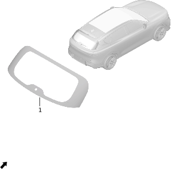

| Поз. | Артикул | Наименование | Кол-во | Применимость | Примечание |
| ---: | --- | --- | ---: | --- | --- |
| 1 | 520004001 | Заднее стекло в сборе | 1 | с 2022-12-25 |  |

## 6021-10 Стекла задних форточек

- Применимость группы: с 2023-05-08
- Описание: Общая конфигурация: универсально для серии

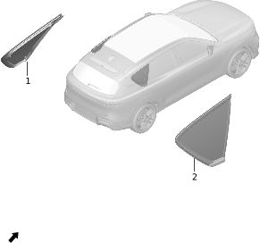

| Поз. | Артикул | Наименование | Кол-во | Применимость | Примечание |
| ---: | --- | --- | ---: | --- | --- |
| 1 | 520601001 | Левое стекло задней форточки | 1 | с 2022-07-10 | Серебристый, анодированный |
| 1 | 520601010 | Левое стекло задней форточки | 1 | с 2024-03-15 | Глянцевый черный |
| 2 | 520602001 | Правое стекло задней форточки | 1 | с 2022-07-10 | Серебристый, анодированный |
| 2 | 520602010 | Правое стекло задней форточки | 1 | с 2024-03-15 | Глянцевый черный |

## 6022-10 Декоративные элементы окон

- Применимость группы: с 2023-05-08
- Описание: Общая конфигурация: универсально для серии

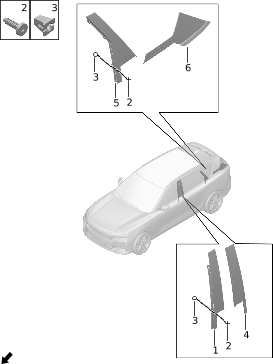

| Поз. | Артикул | Наименование | Кол-во | Применимость | Примечание |
| ---: | --- | --- | ---: | --- | --- |
| 1 | 500610001 | Накладка стойки B левой передней двери | 1 | с 2022-07-10 |  |
| 1 | 500611001 | Накладка стойки B правой передней двери | 1 | с 2022-07-10 |  |
| 2 | Q12001014 | Винт с внутренним шестигранником | 18 | с 2022-07-10 |  |
| 3 | Q21004005 | Пластиковая гайка | 18 | с 2022-07-10 |  |
| 4 | 500612001 | Накладка стойки B левой задней двери | 1 | с 2022-07-10 |  |
| 4 | 500613001 | Накладка стойки B правой задней двери | 1 | с 2022-07-10 |  |
| 5 | 500614002 | Накладка стойки C левой задней двери | 1 | с 2022-07-10 |  |
| 5 | 500615002 | Накладка стойки C правой задней двери | 1 | с 2022-07-10 |  |
| 6 | 500616001 | Накладка стойки D задней левой боковины | 1 | с 2022-07-10 | Серебристый, анодированный |
| 6 | 500616010 | Накладка стойки D задней левой боковины | 1 | 2024-05-16 - 2024-10-23 | Глянцевый черный |
| 6 | 500617001 | Накладка стойки D задней правой боковины | 1 | с 2022-07-10 | Серебристый, анодированный |
| 6 | 500617010 | Накладка стойки D задней правой боковины | 1 | 2024-05-16 - 2024-10-19 | Глянцевый черный |

## 6023-10 Люк

- Применимость группы: с 2023-05-08
- Описание: Люк: панорамный

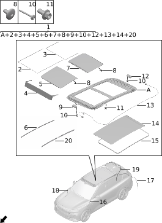

| Поз. | Артикул | Наименование | Кол-во | Применимость | Примечание |
| ---: | --- | --- | ---: | --- | --- |
| 1 | 551803005BETA | Люк в сборе | 1 | 2022-07-10 - 2024-12-30 | Бежевый + ткань; черно-синий салон |
| 1 | 551803005BLTA | Люк в сборе | 1 | 2022-07-10 - 2024-12-30 | Космический синий + ткань; светло-коричневый + синий салон |
| 1 | 551803005TG02 | Люк в сборе | 1 | 2022-07-10 - 2024-12-30 | Ткань + серо-бежевый; красно-бежевый салон |
| 1 | 551803014BETA | Люк в сборе | 1 |  | Бежевый + ткань; черно-синий салон |
| 1 | 551803014BLTA | Люк в сборе | 1 |  | Космический синий + ткань; светло-коричневый + синий салон |
| 1 | 551803014TG02 | Люк в сборе | 1 |  | Ткань + серо-бежевый; красно-бежевый салон |
| 1 | 551803014TG11 | Люк в сборе | 1 | 2024-04-17 - 2024-10-28 | Светло-пестрый серый; черно-серый |
| 1 | 551803014TK11 | Люк в сборе | 1 | 2024-04-17 - 2024-10-24 | Смесовый черный; черно-зеленый |
| 2 | 551816001 | Внутренний уплотнитель люка | 1 | 2022-07-10 - 2024-12-30 |  |
| 3 | 551817001 | Уплотнитель заднего стекла люка | 1 | 2022-07-10 - 2024-12-30 |  |
| 3 | 551817003 | Уплотнитель заднего стекла люка | 1 | с 2024-04-17 |  |
| 4 | 551815001 | Ветрозащитная сетка люка | 1 | 2022-07-10 - 2024-12-30 |  |
| 4 | 551815004 | Ветрозащитная сетка люка | 1 | с 2024-04-17 |  |
| 5 | 551813002 | Переднее стекло люка | 1 | 2022-07-10 - 2024-12-30 |  |
| 5 | 551813004 | Переднее стекло люка | 1 | с 2024-04-17 |  |
| 6 | 551831001 | Правый внутренний уплотнитель люка | 1 | с 2024-04-17 |  |
| 7 | 551814002 | Заднее стекло люка | 1 | 2022-07-10 - 2024-12-30 |  |
| 7 | 551814004 | Заднее стекло люка | 1 | с 2024-04-17 |  |
| 8 | Q12003040 | Винт | 12 | с 2024-04-17 |  |
| 9 | 551818001 | Электродвигатель люка | 1 | 2022-07-10 - 2024-12-30 |  |
| 9 | 551818004 | Электродвигатель люка | 1 | с 2024-04-17 |  |
| 10 | Q11007002 | Болт электродвигателя | 6 | с 2024-04-17 |  |
| 11 | Q11001001 | Фланцевый болт | 18 | с 2022-07-10 |  |
| 12 | 551819001 | Электродвигатель шторки люка | 1 | 2022-07-10 - 2024-12-30 |  |
| 12 | 551819004 | Электродвигатель шторки люка | 1 | с 2024-04-17 |  |
| 13 | 551820001 | Жгут проводки люка | 1 | 2022-07-10 - 2024-12-30 |  |
| 13 | 551820003 | Жгут проводки люка | 1 | с 2024-04-17 |  |
| 14 | 551821001BETA | Солнцезащитная шторка | 1 | 2022-07-10 - 2024-12-30 | Бежевый + ткань; черно-синий салон |
| 14 | 551821001BLTA | Солнцезащитная шторка | 1 | 2022-07-10 - 2024-12-30 | Космический синий + ткань; светло-коричневый + синий салон |
| 14 | 551821004TG02 | Солнцезащитная шторка | 1 | 2022-07-10 - 2024-12-30 | Ткань + серо-бежевый; красно-бежевый салон |
| 14 | 551821008TG11 | Солнцезащитная шторка | 1 | 2024-04-17 - 2024-10-28 | Светло-пестрый серый; черно-серый |
| 14 | 551821009TK11 | Солнцезащитная шторка | 1 | 2024-04-17 - 2024-10-24 | Смесовый черный; черно-зеленый |
| 15 | 551804001 | Планка люка | 1 | с 2022-07-10 |  |
| 17 | 551810004 | Левая задняя дренажная трубка люка | 1 | с 2024-11-18 |  |
| 18 | 551809001 | Правая передняя дренажная трубка люка | 1 | 2022-07-10 - 2024-11-17 |  |
| 18 | 551809005 | Правая передняя дренажная трубка люка | 1 | с 2024-11-17 |  |
| 19 | 551811001 | Правая задняя дренажная трубка люка | 1 | 2022-07-10 - 2024-11-18 |  |
| 19 | 551811004 | Правая задняя дренажная трубка люка | 1 | с 2024-11-18 |  |
| 20 | 551830001 | Левый внутренний уплотнитель люка | 1 | с 2024-04-17 |  |

## 6024-10 Стеклянная крыша люка

- Применимость группы: с 2023-05-08
- Описание: Тип стеклянной крыши: электрохромное стекло + атмосферная подсветка

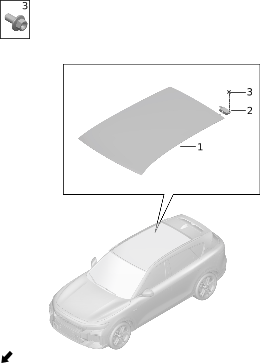

| Поз. | Артикул | Наименование | Кол-во | Применимость | Примечание |
| ---: | --- | --- | ---: | --- | --- |
| 1 | 551822002 | Стеклянная крыша люка | 1 | с 2022-07-10 |  |
| 2 | 570302001 | Контроллер электрохромного стекла | 1 | с 2022-07-10 |  |
| 3 | Q11001001 | Фланцевый болт | 2 | с 2022-07-10 |  |

## 6025-10 Рейлинги

- Применимость группы: с 2023-05-08
- Описание: Общая конфигурация: универсально для серии

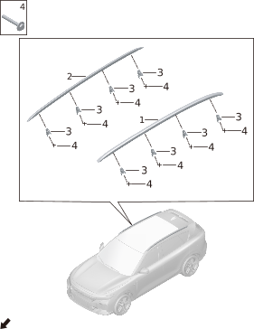

| Поз. | Артикул | Наименование | Кол-во | Применимость | Примечание |
| ---: | --- | --- | ---: | --- | --- |
| 1 | 570401003 | Левый рейлинг | 1 | с 2022-07-10 | Серебристый, анодированный |
| 1 | 570401007 | Левый рейлинг | 1 | с 2024-03-15 | Глянцевый черный |
| 1 | 570401009 | Левый рейлинг | 1 |  | Глянцевый черный |
| 2 | 570402003 | Правый рейлинг | 1 | с 2022-07-10 | Серебристый, анодированный |
| 2 | 570402007 | Правый рейлинг | 1 | с 2024-03-15 | Глянцевый черный |
| 2 | 570402009 | Правый рейлинг | 1 |  | Глянцевый черный |
| 3 | Q71001001 | Регулятор допуска | 8 | с 2022-07-10 |  |
| 4 | Q11002004 | Болт | 8 | с 2022-07-10 |  |

## 6026-10 Защитные элементы кузова

- Применимость группы: с 2023-05-08
- Описание: Общая конфигурация: универсально для серии

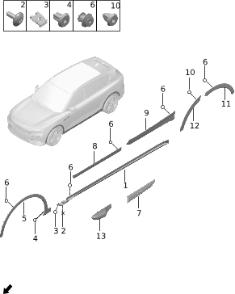

| Поз. | Артикул | Наименование | Кол-во | Применимость | Примечание |
| ---: | --- | --- | ---: | --- | --- |
| 1 | 310109001 | Левая нижняя юбка | 1 | с 2022-07-10 |  |
| 1 | 310110001 | Правая нижняя юбка | 1 | с 2022-07-10 |  |
| 2 | Q12001018 | Винт с внутренним шестигранником | 20 | с 2022-07-10 |  |
| 3 | Q21003003 | Пластинчатая пружинная гайка | 6 | с 2022-07-10 |  |
| 4 | Q41006003 | Герметичная клипса | 22 | с 2022-07-10 |  |
| 5 | 310103005 | Левая накладка передней арки | 1 | с 2023-02-05 |  |
| 5 | 310103012 | Левая накладка передней арки | 1 |  |  |
| 5 | 310104005 | Правая накладка передней арки | 1 | с 2023-02-05 |  |
| 5 | 310104012 | Правая накладка передней арки | 1 |  |  |
| 6 | 500627002 | Клипса | 88 | с 2022-07-10 |  |
| 7 | 500648003 | Верхняя декоративная планка левой передней двери | 1 | с 2022-07-10 | Оборудование ADAS L2.9 |
| 7 | 500648006 | Верхняя декоративная планка левой передней двери | 1 | с 2024-03-15 | Без оборудования ADAS L2.9 |
| 7 | 500649003 | Верхняя декоративная планка правой передней двери | 1 | с 2022-07-10 | Оборудование ADAS L2.9 |
| 7 | 500649006 | Верхняя декоративная планка правой передней двери | 1 | с 2024-03-15 | Без оборудования ADAS L2.9 |
| 8 | 500602001 | Левая защитная накладка передней двери | 1 | с 2022-07-10 |  |
| 8 | 500603001 | Правая защитная накладка передней двери | 1 | с 2022-07-10 |  |
| 9 | 500604001 | Левая защитная накладка задней двери | 1 | с 2022-07-10 |  |
| 9 | 500605001 | Правая защитная накладка задней двери | 1 | с 2022-07-10 |  |
| 10 | 500627001 | Клипса | 8 | с 2022-07-10 |  |
| 11 | 310107004 | Задняя секция левой накладки задней арки | 1 | с 2023-02-05 |  |
| 11 | 310107006PK01 | Задняя секция левой накладки задней арки | 1 |  | Глянцевый черный |
| 11 | 310108004 | Задняя секция правой накладки задней арки | 1 | с 2023-02-05 |  |
| 11 | 310108006PK01 | Задняя секция правой накладки задней арки | 1 |  | Глянцевый черный |
| 12 | 310105002 | Передняя секция левой накладки задней арки | 1 | с 2022-07-10 |  |
| 12 | 310105004PK01 | Передняя секция левой накладки задней арки | 1 |  | Глянцевый черный |
| 12 | 310106002 | Передняя секция правой накладки задней арки | 1 | с 2022-07-10 |  |
| 12 | 310106004PK01 | Передняя секция правой накладки задней арки | 1 |  | Глянцевый черный |
| 13 | 500644002 | Левая защитная панель камеры крыла | 1 | с 2022-07-10 | Оборудование ADAS L2.9 |
| 13 | 500644005 | Левая защитная панель камеры крыла | 1 | с 2024-03-15 | Без оборудования ADAS L2.9 |
| 13 | 500646002 | Правая защитная панель камеры крыла | 1 | с 2022-07-10 | Оборудование ADAS L2.9 |
| 13 | 500646005 | Правая защитная панель камеры крыла | 1 | с 2024-03-15 | Без оборудования ADAS L2.9 |

## 6027-10 Кузовные уплотнители и молдинги

- Применимость группы: с 2023-05-08
- Описание: Общая конфигурация: универсально для серии

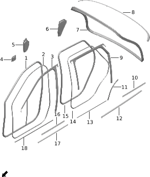

| Поз. | Артикул | Наименование | Кол-во | Применимость | Примечание |
| ---: | --- | --- | ---: | --- | --- |
| 1 | 610701001 | Уплотнитель рамки левой передней двери | 1 | с 2022-07-10 |  |
| 1 | 610702001 | Уплотнитель рамки правой передней двери | 1 | с 2022-07-10 |  |
| 2 | 610707001 | Уплотнитель левой передней двери | 1 | с 2022-07-10 |  |
| 2 | 610707003 | Уплотнитель левой передней двери | 1 |  |  |
| 2 | 610708001 | Уплотнитель правой передней двери | 1 | с 2022-07-10 |  |
| 2 | 610708003 | Уплотнитель правой передней двери | 1 |  |  |
| 3 | 610301001 | Направляющий желоб стекла левой передней двери | 1 | с 2022-07-10 |  |
| 3 | 610302001 | Направляющий желоб стекла правой передней двери | 1 | с 2022-07-10 |  |
| 4 | 610709001 | Влагозащитная пленка левой передней двери | 1 | с 2022-07-10 |  |
| 4 | 610710001 | Влагозащитная пленка правой передней двери | 1 | с 2022-07-10 |  |
| 5 | 610709002 | Влагозащитная пленка левой передней двери | 1 | с 2022-07-10 |  |
| 5 | 610710002 | Влагозащитная пленка правой передней двери | 1 | с 2022-07-10 |  |
| 6 | 620711001 | Влагозащитная пленка левой задней двери | 1 | с 2022-07-10 |  |
| 6 | 620712001 | Влагозащитная пленка правой задней двери | 1 | с 2022-07-10 |  |
| 7 | 630701001 | Уплотнитель рамки двери багажника | 1 | с 2022-07-10 |  |
| 8 | 630104005 | Молдинг двери багажника | 1 | с 2023-06-13 | Серебристый, анодированный |
| 8 | 630104008 | Молдинг двери багажника | 1 | с 2024-03-15 | Глянцевый черный |
| 9 | 620303001 | Направляющий желоб стекла левой задней двери | 1 | с 2022-07-10 |  |
| 9 | 620304001 | Направляющий желоб стекла правой задней двери | 1 | с 2022-07-10 |  |
| 10 | 620703001 | Внутренний уплотнитель подоконной линии левой задней двери | 1 | с 2022-07-10 |  |
| 10 | 620704001 | Внутренний уплотнитель подоконной линии правой задней двери | 1 | с 2022-07-10 |  |
| 11 | 620709001 | Защитная накладка колесной арки левой задней двери | 1 | с 2022-07-10 |  |
| 11 | 620710001 | Защитная накладка колесной арки правой задней двери | 1 | с 2022-07-10 |  |
| 12 | 620701001 | Наружный уплотнитель подоконной линии левой задней двери | 1 | с 2022-07-10 | Серебристый, анодированный |
| 12 | 620701007 | Наружный уплотнитель подоконной линии левой задней двери | 1 | с 2024-03-15 | Глянцевый черный |
| 12 | 620702001 | Наружный уплотнитель подоконной линии правой задней двери | 1 | с 2022-07-10 | Серебристый, анодированный |
| 12 | 620702007 | Наружный уплотнитель подоконной линии правой задней двери | 1 | с 2024-03-15 | Глянцевый черный |
| 13 | 620111001 | Защитная накладка левой задней двери | 1 | 2022-07-10 - 2024-09-08 |  |
| 13 | 620111004 | Защитная накладка левой задней двери | 1 | с 2024-09-08 |  |
| 13 | 620112001 | Защитная накладка правой задней двери | 1 | 2022-07-10 - 2024-09-15 |  |
| 13 | 620112004 | Защитная накладка правой задней двери | 1 | с 2024-09-15 |  |
| 14 | 620707001 | Уплотнитель левой задней двери | 1 | с 2022-07-10 |  |
| 14 | 620707002 | Уплотнитель левой задней двери | 1 |  |  |
| 14 | 620708001 | Уплотнитель правой задней двери | 1 | с 2022-07-10 |  |
| 14 | 620708002 | Уплотнитель правой задней двери | 1 |  |  |
| 17 | 610703001 | Наружный уплотнитель подоконной линии левой передней двери | 1 | с 2022-07-10 | Серебристый, анодированный |
| 17 | 610703010 | Наружный уплотнитель подоконной линии левой передней двери | 1 | с 2024-03-15 | Глянцевый черный |
| 17 | 610704001 | Наружный уплотнитель подоконной линии правой передней двери | 1 | с 2022-07-10 | Серебристый, анодированный |
| 17 | 610704010 | Наружный уплотнитель подоконной линии правой передней двери | 1 | с 2024-03-15 | Глянцевый черный |
| 18 | 610110001 | Защитная накладка левой передней двери | 1 | 2022-07-10 - 2024-09-13 |  |
| 18 | 610110006 | Защитная накладка левой передней двери | 1 | с 2024-09-13 |  |
| 18 | 610111001 | Защитная накладка правой передней двери | 1 | 2022-07-10 - 2024-09-14 |  |
| 18 | 610111006 | Защитная накладка правой передней двери | 1 | с 2024-09-14 |  |

## 6028-10 Спойлер

- Применимость группы: с 2023-05-08
- Описание: Общая конфигурация: универсально для серии

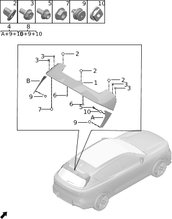

| Поз. | Артикул | Наименование | Кол-во | Применимость | Примечание |
| ---: | --- | --- | ---: | --- | --- |
| 1 | 500606003 | Спойлер | 1 | 2023-05-10 - 2024-04-30 |  |
| 1 | 500606005 | Спойлер | 1 | с 2024-04-09 |  |
| 2 | Q41006008 | Герметичная клипса | 3 | с 2024-07-13 |  |
| 3 | Q11002018 | Болт | 4 | с 2022-07-10 |  |
| 4 | 630103004 | Правый спойлер двери багажника | 1 | с 2023-04-10 |  |
| 4 | 630103007 | Правый спойлер двери багажника | 1 |  |  |
| 5 | Q11001001 | Фланцевый болт | 2 | с 2022-07-10 |  |
| 6 | 370016002 | Заглушка | 2 | с 2024-04-09 |  |
| 6 | 500623001 | Левая заглушка | 1 | 2022-07-10 - 2024-05-23 |  |
| 6 | 500624001 | Правая заглушка | 1 | 2022-07-10 - 2024-05-23 |  |
| 7 | Q21001011 | Фланцевая гайка | 3 | с 2022-07-10 |  |
| 8 | 630102004 | Левый спойлер двери багажника | 1 | с 2023-05-01 |  |
| 8 | 630102007 | Левый спойлер двери багажника | 1 |  |  |
| 9 | Q41006004 | Герметичная клипса | 4 | с 2022-07-10 |  |
| 10 | 610508005 | Гайка | 2 | с 2022-07-10 |  |

## 6029-10 Эмблемы и наклейки

- Применимость группы: с 2023-05-08
- Описание: Общая конфигурация: универсально для серии

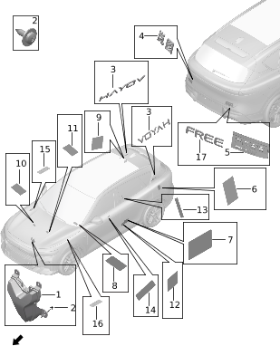

| Поз. | Артикул | Наименование | Кол-во | Применимость | Примечание |
| ---: | --- | --- | ---: | --- | --- |
| 1 | 392501001 | Передняя эмблема | 1 | с 2022-07-10 |  |
| 2 | Q12002015 | Самонарезающий винт | 4 | с 2022-07-10 |  |
| 3 | 392503001 | Боковой шильдик | 2 | с 2022-07-10 |  |
| 4 | 392502003 | Задний шильдик | 1 | с 2022-07-10 |  |
| 5 | 392301010 | Код модели | 1 | с 2022-12-25 |  |
| 5 | 392301013 | Код модели | 1 | с 2022-12-25 |  |
| 6 | 392303004 | Наклейка зарядной индикации | 1 | с 2022-07-10 |  |
| 7 | 392302006 | Предупреждающая наклейка давления в шинах | 1 | 2023-05-10 - 2024-07-13 |  |
| 7 | 392302010 | Предупреждающая наклейка давления в шинах | 1 |  |  |
| 7 | 392302017 | Предупреждающая наклейка давления в шинах | 1 | с 2024-07-13 |  |
| 8 | 392304001 | Наклейка залива тормозной жидкости | 1 | 2022-07-10 - 2024-07-13 |  |
| 8 | 392304003 | Наклейка залива тормозной жидкости | 1 | с 2024-07-13 |  |
| 9 | 392305002 | Предупреждающая наклейка заправки | 1 | 2023-03-10 - 2024-07-13 |  |
| 9 | 392305004 | Предупреждающая наклейка заправки | 1 | с 2024-07-13 |  |
| 10 | 392306001 | Предупреждающая наклейка вентилятора | 1 | 2022-07-10 - 2024-07-13 |  |
| 10 | 392306003 | Предупреждающая наклейка вентилятора | 1 | с 2024-07-13 |  |
| 11 | 392307002 | Наклейка хладагента кондиционера | 1 | 2022-07-10 - 2024-07-13 |  |
| 11 | 392307016 | Наклейка хладагента кондиционера | 1 | с 2024-07-13 |  |
| 12 | 392308002 | Шильдик кузова | 1 | с 2022-08-30 |  |
| 12 | 392308003 | Шильдик кузова | 1 |  |  |
| 13 | 392309001 | VIN-штрихкод | 1 | с 2022-08-30 | Задний пол / верх наружной панели арки / средняя часть внутренней панели средней стойки |
| 14 | 392309002 | VIN-штрихкод | 1 | с 2022-08-30 | VIN-штрихкод под лобовым стеклом |
| 15 | 392310001 | Наклейка крышки переднего электропривода | 1 | с 2022-03-06 | Емкость батареи 39 кВт*ч |
| 15 | 392310005 | Наклейка крышки переднего электропривода | 1 | с 2024-03-15 | Емкость батареи 43 кВт*ч |
| 16 | 392311001 | Наклейка крышки заднего электропривода | 1 | с 2022-03-06 | Артефакт источника: батарея 39 кВт*ч; задний электромотор 200 кВт |
| 16 | 392311008 | Наклейка крышки заднего электропривода | 1 | с 2024-03-15 | Артефакт источника: батарея 43 кВт*ч; задний электромотор 200 кВт |
| 16 | 392311010 | Наклейка крышки заднего электропривода | 1 | с 2024-06-15 | Артефакт источника: батарея 43 кВт*ч; задний электромотор 215 кВт |
| 17 | 392301004 | Код модели | 1 | с 2022-07-10 |  |

## 6030-10 Накладки моторного отсека

- Применимость группы: с 2023-05-08
- Описание: Тип силовой установки: EREV

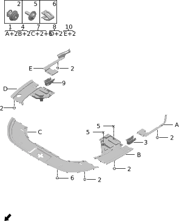

| Поз. | Артикул | Наименование | Кол-во | Применимость | Примечание |
| ---: | --- | --- | ---: | --- | --- |
| 1 | 840505001 | Левая задняя декоративная панель моторного отсека | 1 | с 2022-07-10 |  |
| 2 | Q41001003 | Клипса | 12 | с 2022-07-10 |  |
| 3 | 840510001 | Левая декоративная накладка шва | 1 | с 2022-07-10 |  |
| 4 | 840501005 | Левая передняя декоративная панель моторного отсека | 1 | с 2022-10-01 |  |
| 5 | Q12001002 | Винт с внутренним шестигранником | 4 | с 2022-07-10 |  |
| 6 | Q41002001 | Пластиковая клипса | 31 | с 2022-07-10 |  |
| 7 | 840503009 | Передняя центральная декоративная панель моторного отсека | 1 | с 2023-06-19 |  |
| 8 | 840502001 | Правая передняя декоративная панель моторного отсека | 1 | с 2022-07-10 |  |
| 9 | 840511001 | Правая декоративная накладка шва | 1 | с 2022-07-10 |  |
| 10 | 840506001 | Правая задняя декоративная панель моторного отсека | 1 | с 2022-07-10 |  |

## 6032-10 Панель приборов

- Применимость группы: с 2023-04-01
- Описание: Общая конфигурация: универсально для серии

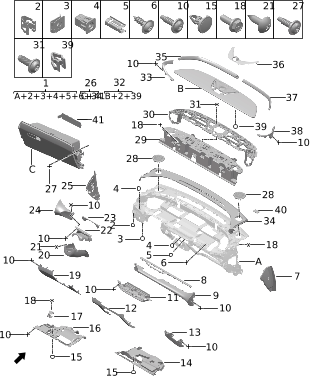

| Поз. | Артикул | Наименование | Кол-во | Применимость | Примечание |
| ---: | --- | --- | ---: | --- | --- |
| 1 | 550101007BKGA | Панель приборов в сборе | 1 | с 2023-05-21 | Черный обсидиан + грубая текстура; черно-синий салон |
| 1 | 550101007BLGB | Панель приборов в сборе | 1 | с 2023-05-21 | Космический синий + грубая текстура; светло-коричневый + синий салон |
| 1 | 550101007JR03 | Панель приборов в сборе | 1 | с 2023-06-13 | Терракотово-красный; красно-бежевый салон |
| 2 | Q41001007 | Клипса | 77 | с 2022-07-10 |  |
| 3 | Q21003006 | Пластинчатая пружинная гайка | 30 | с 2022-07-10 |  |
| 4 | Q21004004 | Пластиковая гайка | 8 | с 2022-07-10 |  |
| 5 | Q41001008 | Клипса | 2 | с 2022-07-10 |  |
| 6 | Q12003001 | Винт | 3 | с 2022-07-10 |  |
| 7 | 550131001BKGA | Правая торцевая крышка панели приборов | 1 | с 2022-07-10 | Черный обсидиан + грубая текстура; черно-синий салон |
| 7 | 550131001BLGB | Правая торцевая крышка панели приборов | 1 | с 2022-07-10 | Космический синий + грубая текстура; светло-коричневый + синий салон |
| 7 | 550131004JR03 | Правая торцевая крышка панели приборов | 1 | с 2022-07-10 | Терракотово-красный; красно-бежевый салон |
| 8 | 550106001GYPA | Задняя боковая декоративная планка | 1 | с 2022-07-10 | Окрашенный металлический серый |
| 8 | 550106003PK06 | Задняя боковая декоративная планка | 1 | с 2024-04-17 | Черный хром |
| 9 | 550113010AG04 | Правая декоративная панель | 1 | с 2022-10-01 | Терракотово-красный + серо-бежевый PVC; красно-бежевый салон |
| 9 | 550113010AG10 | Правая декоративная панель | 1 | с 2024-04-17 | Облачный серый; черно-серый |
| 9 | 550113010BKAA | Правая декоративная панель | 1 | с 2024-04-17 | Черный обсидиан + PVC; черно-зеленый |
| 9 | 550113010BLAB | Правая декоративная панель | 1 | с 2022-10-01 | (Коричневый) космический синий + PVC; черно-синий салон |
| 9 | 550113010BRAB | Правая декоративная панель | 1 | с 2022-10-01 | Светло-коричневый + PVC; светло-коричневый + синий салон |
| 10 | Q12001020 | Винт с внутренним шестигранником | 33 | с 2022-07-10 |  |
| 11 | 551702001 | Центральный дефлектор | 1 | с 2022-07-10 | Матовый серебристый |
| 11 | 551702004 | Центральный дефлектор | 1 | с 2024-04-17 | Черный хром |
| 12 | 550109003BKGA | Центральная защитная панель | 1 | с 2022-07-10 | Черный обсидиан + грубая текстура; черно-синий салон |
| 12 | 550109003BLGB | Центральная защитная панель | 1 | с 2022-07-10 | Космический синий + грубая текстура; светло-коричневый + синий салон |
| 12 | 550109003JR03 | Центральная защитная панель | 1 | с 2022-07-10 | Терракотово-красный; красно-бежевый салон |
| 13 | 550114001BKGA | Правая отделка бардачка | 1 | с 2022-07-10 | Черный обсидиан + грубая текстура; черно-синий салон |
| 13 | 550114001BLGB | Правая отделка бардачка | 1 | с 2022-07-10 | Космический синий + грубая текстура; светло-коричневый + синий салон |
| 13 | 550114002JR03 | Правая отделка бардачка | 1 | с 2022-07-10 | Терракотово-красный; красно-бежевый салон |
| 14 | 550129001BKGA | Правая нижняя панель панели приборов | 1 | с 2022-07-10 | Черный обсидиан + грубая текстура; черно-синий салон |
| 15 | Q41001002 | Клипса | 11 | с 2022-07-10 |  |
| 16 | 550128001BKGA | Левая нижняя панель панели приборов | 1 | 2022-07-10 - 2024-06-08 | Черный обсидиан + грубая текстура; черно-синий салон |
| 16 | 550128008BKGA | Левая нижняя панель панели приборов | 1 | с 2024-06-08 | Черный обсидиан + грубая текстура; черно-синий салон |
| 17 | 840201001 | Ручка открытия замка капота | 1 | с 2022-07-10 |  |
| 18 | Q11002020 | Болт | 27 | с 2022-07-10 |  |
| 19 | 550151011BKGA | Левая нижняя защитная панель в сборе | 1 | с 2023-02-05 | Черный обсидиан + грубая текстура; черно-синий салон |
| 19 | 550151011BLGB | Левая нижняя защитная панель в сборе | 1 | с 2023-02-05 | Космический синий + грубая текстура; светло-коричневый + синий салон |
| 19 | 550151011JR03 | Левая нижняя защитная панель в сборе | 1 | с 2023-02-05 | Терракотовый; красно-бежевый салон |
| 21 | Q12002015 | Самонарезающий винт | 3 | с 2022-07-10 |  |
| 22 | 550134001BKAA | Верхний кожух рулевой колонки | 1 | с 2022-07-10 | Черный обсидиан + PVC; черно-синий салон |
| 22 | 550134001BLAB | Верхний кожух рулевой колонки | 1 | с 2022-07-10 | (Коричневый) космический синий + PVC; черно-синий салон |
| 22 | 550134006JG05 | Верхний кожух рулевой колонки | 1 | с 2022-07-10 | Серо-бежевый + грубая текстура; красно-бежевый салон |
| 22 | 550134007JG10 | Верхний кожух рулевой колонки | 1 | с 2024-04-17 | Облачный серый; черно-серый |
| 22 | 550134007PK06 | Верхний кожух рулевой колонки | 1 | с 2024-04-17 | Сияющий черный; черно-зеленый |
| 23 | 550136001BLGB | Панель шторки | 1 | с 2022-07-10 | Космический синий + грубая текстура; светло-коричневый + синий салон |
| 23 | 550136001BRGC | Панель шторки | 1 | с 2022-07-10 | Светло-коричневый + грубая текстура; светло-коричневый + синий салон |
| 23 | 550136002JG05 | Панель шторки | 1 | с 2022-07-10 | Серо-бежевый + грубая текстура; красно-бежевый салон |
| 23 | 550136005BKGA | Панель шторки | 1 | с 2024-04-17 | Сияющий черный; черно-зеленый |
| 23 | 550136006JG10 | Панель шторки | 1 | с 2024-04-17 | Облачный серый; черно-серый |
| 24 | 550110001BLAB | Левая декоративная панель | 1 | с 2022-07-10 | (Коричневый) космический синий + PVC; черно-синий салон |
| 24 | 550110001BRAB | Левая декоративная панель | 1 | с 2022-07-10 | Светло-коричневый + PVC; светло-коричневый + синий салон |
| 24 | 550110006AG04 | Левая декоративная панель | 1 | с 2022-07-10 | Терракотово-красный + серо-бежевый PVC; красно-бежевый салон |
| 24 | 550110021AG10 | Левая декоративная панель | 1 | с 2024-04-17 | Облачный серый; черно-серый |
| 24 | 550110021BKAA | Левая декоративная панель | 1 | с 2024-04-17 | Сияющий черный; черно-зеленый |
| 25 | 550130001BKGA | Левая торцевая крышка панели приборов | 1 | с 2022-07-10 | Черный обсидиан + грубая текстура; черно-синий салон |
| 25 | 550130001BLGB | Левая торцевая крышка панели приборов | 1 | с 2022-07-10 | Космический синий + грубая текстура; светло-коричневый + синий салон |
| 25 | 550130004JR03 | Левая торцевая крышка панели приборов | 1 | с 2022-07-10 | Терракотово-красный; красно-бежевый салон |
| 26 | 550127001BKGA | Бардачок | 1 | с 2022-07-10 | Черный обсидиан + грубая текстура; черно-синий салон |
| 26 | 550127001BLGB | Бардачок | 1 | с 2022-07-10 | Космический синий + грубая текстура; светло-коричневый + синий салон |
| 26 | 550127004JR03 | Бардачок | 1 | с 2022-07-10 | Терракотово-красный; красно-бежевый салон |
| 26 | 550127009CK01 | Бардачок | 1 | с 2024-04-17 | Глянцевый черный хром |
| 27 | Q12001021 | Винт с внутренним шестигранником | 9 | с 2022-07-10 |  |
| 28 | 550139002BKPB | Крышка высокочастотного динамика | 2 | с 2022-07-10 | Окрашенный черный обсидиан; черно-синий салон |
| 28 | 550139002BLPD | Крышка высокочастотного динамика | 2 | с 2022-07-10 | Окрашенный космический синий; светло-коричневый + синий салон |
| 28 | 550139008PR02 | Крышка высокочастотного динамика | 2 | с 2023-04-11 | Терракотово-красный; красно-бежевый салон |
| 29 | 550137003 | Механизм подъема большого экрана | 1 | с 2022-11-01 |  |
| 30 | 550122001 | Каркас верхней крышки экрана | 1 | с 2022-07-10 |  |
| 31 | Q12001016 | Винт с внутренним шестигранником | 16 | с 2022-07-10 |  |
| 32 | 550125002BKAA | Верхняя крышка экрана | 1 | с 2022-07-10 | Черный обсидиан + PVC; черно-синий салон |
| 32 | 550125002BLAB | Верхняя крышка экрана | 1 | с 2022-07-10 | (Коричневый) космический синий + PVC; черно-синий салон |
| 32 | 550125006AR01 | Верхняя крышка экрана | 1 | с 2022-07-10 | Терракотово-красный; красно-бежевый салон |
| 33 | 550104001BKGA | Левая декоративная планка | 1 | с 2022-07-10 | Черный обсидиан + грубая текстура; черно-синий салон |
| 33 | 550104001BLGB | Левая декоративная планка | 1 | с 2022-07-10 | Космический синий + грубая текстура; светло-коричневый + синий салон |
| 33 | 550104002JR03 | Левая декоративная планка | 1 | с 2022-07-10 | Терракотово-красный; красно-бежевый салон |
| 33 | 550104006PK06 | Левая декоративная планка | 1 | с 2024-04-17 | Сияющий черный |
| 34 | 550138001BKGA | Передняя панель размораживателя | 1 | с 2022-07-10 | Черный обсидиан + грубая текстура; черно-синий салон |
| 34 | 550138002BLGB | Передняя панель размораживателя | 1 | с 2022-07-10 | Космический синий + грубая текстура; светло-коричневый + синий салон |
| 34 | 550138006JR03 | Передняя панель размораживателя | 1 | с 2022-07-10 | Терракотово-красный; красно-бежевый салон |
| 35 | 550102001GYPA | Левая передняя декоративная планка | 1 | с 2022-07-10 | Окрашенный металлический серый |
| 35 | 550102003PK06 | Левая передняя декоративная планка | 1 | с 2024-04-17 | Сияющий черный |
| 36 | 550126001BKGB | Кронштейн установки камеры | 1 | с 2022-07-10 | Черный обсидиан + мелкая текстура; черно-синий салон |
| 36 | 550126001BLGC | Кронштейн установки камеры | 1 | с 2022-07-10 | Космический синий + мелкая текстура; светло-коричневый + синий салон |
| 36 | 550126004PR02 | Кронштейн установки камеры | 1 | с 2022-07-10 | Терракотово-красный; красно-бежевый салон |
| 37 | 550103001GYPA | Правая передняя декоративная планка | 1 | с 2022-07-10 | Окрашенный металлический серый |
| 37 | 550103003PK06 | Правая передняя декоративная планка | 1 | с 2024-04-17 | Сияющий черный |
| 38 | 550105001BKGA | Правая декоративная планка | 1 | с 2022-07-10 | Черный обсидиан + грубая текстура; черно-синий салон |
| 38 | 550105001BLGB | Правая декоративная планка | 1 | с 2022-07-10 | Космический синий + грубая текстура; светло-коричневый + синий салон |
| 38 | 550105002JR03 | Правая декоративная планка | 1 | с 2022-07-10 | Терракотово-красный; красно-бежевый салон |
| 38 | 550105006PK06 | Правая декоративная планка | 1 | с 2024-04-17 | Сияющий черный |
| 39 | Q41001044 | Клипса | 20 | с 2022-07-10 |  |
| 40 | 550140001 | Фетровая накладка панели приборов | 5 | с 2022-07-10 |  |
| 41 | 550157001 | Сервисная крышка бардачка | 1 | с 2022-07-10 |  |

## 6033-10 Передние воздуховоды

- Применимость группы: с 2023-05-10
- Описание: Общая конфигурация: универсально для серии

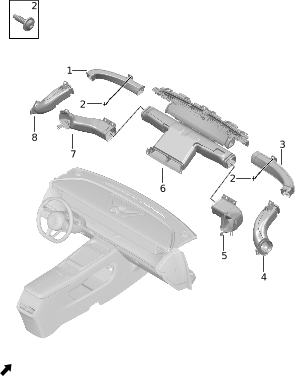

| Поз. | Артикул | Наименование | Кол-во | Применимость | Примечание |
| ---: | --- | --- | ---: | --- | --- |
| 1 | 550116001 | Левый воздуховод размораживателя | 1 | с 2022-07-10 |  |
| 2 | Q12001020 | Винт с внутренним шестигранником | 2 | с 2022-07-10 |  |
| 3 | 550117001 | Правый воздуховод размораживателя | 1 | с 2022-07-10 |  |
| 4 | 550120001 | Внутренняя часть правого воздуховода размораживателя | 1 | с 2022-07-10 |  |
| 5 | 553311002 | Правый гибкий воздуховод | 1 | с 2023-05-21 |  |
| 6 | 550118001 | Основной воздуховод в сборе | 1 | с 2022-07-10 |  |
| 7 | 553310002 | Левый гибкий воздуховод | 1 | с 2023-05-21 |  |
| 8 | 550119001 | Внутренняя часть левого воздуховода размораживателя | 1 | с 2022-07-10 |  |

## 6034-10 Дефлекторы панели приборов

- Применимость группы: с 2023-05-10
- Описание: Общая конфигурация: универсально для серии

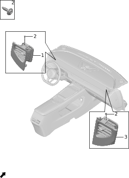

| Поз. | Артикул | Наименование | Кол-во | Применимость | Примечание |
| ---: | --- | --- | ---: | --- | --- |
| 1 | 550123001 | Левый дефлектор | 1 | с 2022-07-10 | Матовый серебристый |
| 1 | 550123004 | Левый дефлектор | 1 | с 2024-04-17 | Черный хром |
| 2 | Q12001020 | Винт с внутренним шестигранником | 2 | с 2022-07-10 |  |
| 3 | 550124001 | Правый дефлектор | 1 | с 2022-07-10 | Матовый серебристый |
| 3 | 550124003 | Правый дефлектор | 1 | с 2024-04-17 | Черный хром |

## 6035-10 Поперечная балка панели приборов

- Применимость группы: с 2023-05-10
- Описание: Общая конфигурация: универсально для серии

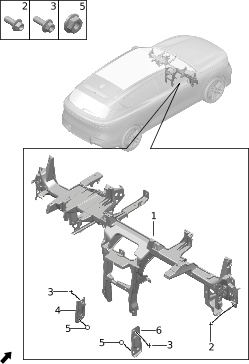

| Поз. | Артикул | Наименование | Кол-во | Применимость | Примечание |
| ---: | --- | --- | ---: | --- | --- |
| 1 | 550115001 | Поперечина панели приборов | 1 | с 2022-07-10 |  |
| 2 | Q11002042 | Болт | 8 | с 2022-07-10 |  |
| 3 | Q11001004 | Фланцевый болт | 4 | с 2022-07-10 |  |
| 4 | 550107001 | Левый кронштейн соединения CCB | 1 | с 2022-07-10 |  |
| 5 | Q21001002 | Фланцевая гайка | 4 | с 2022-07-10 |  |
| 6 | 550108001 | Правый кронштейн соединения CCB | 1 | с 2022-07-10 |  |

## 6036-10 Центральная консоль

- Применимость группы: с 2023-04-01
- Описание: Общая конфигурация: универсально для серии

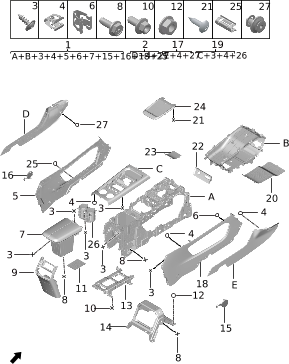

| Поз. | Артикул | Наименование | Кол-во | Применимость | Примечание |
| ---: | --- | --- | ---: | --- | --- |
| 1 | 550503015AB02 | Центральная консоль | 1 | с 2022-07-10 | Черный + синий интерьер |
| 1 | 550503015AG10 | Центральная консоль | 1 | с 2024-04-17 | Облачный серый; черный + серый |
| 1 | 550503015AR01 | Центральная консоль | 1 | с 2022-07-10 | Красный + бежевый |
| 1 | 550503015AW03 | Центральная консоль | 1 | с 2022-07-10 | Светло-коричневый + синий интерьер |
| 1 | 550503015BKAA | Центральная консоль | 1 | с 2024-04-17 | Черный обсидиан + покрытие PVC; черный + зеленый |
| 2 | 550512001BKGA | Левая передняя накладка-удлинитель | 1 | с 2022-07-10 | Черный + синий интерьер |
| 2 | 550512001BLGB | Левая передняя накладка-удлинитель | 1 | с 2022-07-10 | Светло-коричневый + синий интерьер |
| 2 | 550512004AR01 | Левая передняя накладка-удлинитель | 1 | с 2022-07-10 | Красный + бежевый |
| 3 | Q12003002 | Винт | 46 | с 2022-07-10 |  |
| 4 | Q41003006 | Металлическая клипса | 65 | с 2022-07-10 |  |
| 5 | 550501008JK01 | Левая боковая панель центральной консоли | 1 | с 2022-07-10 | Черный + синий |
| 5 | 550501009JR03 | Левая боковая панель центральной консоли | 1 | с 2022-07-10 | Красный + бежевый |
| 5 | 550501010JB02 | Левая боковая панель центральной консоли | 1 | с 2022-07-10 | Светло-коричневый + синий |
| 6 | Q41001007 | Клипса | 2 | с 2022-07-10 |  |
| 7 | 550529008AB02 | Подлокотник центральной консоли | 1 | с 2022-07-10 | Черный + синий интерьер |
| 7 | 550529009AR01 | Подлокотник центральной консоли | 1 | с 2022-07-10 | Красный + бежевый интерьер |
| 7 | 550529010AG10 | Подлокотник центральной консоли | 1 | с 2024-04-17 | Облачный серый; черный + серый |
| 7 | 550529010AW03 | Подлокотник центральной консоли | 1 | с 2022-07-10 | Светло-коричневый + синий интерьер |
| 7 | 550529010BKAA | Подлокотник центральной консоли | 1 | с 2024-04-17 | Черный обсидиан + покрытие PVC; черный + зеленый |
| 8 | Q11002020 | Болт | 10 | с 2022-07-10 |  |
| 9 | 550506008CK01 | Задняя крышка | 1 | с 2024-04-17 | Глянцевый черный хром |
| 9 | 550506008JB02 | Задняя крышка | 1 | с 2022-07-10 | Светло-коричневый + синий интерьер |
| 9 | 550506008JK01 | Задняя крышка | 1 | с 2022-07-10 | Черный + синий интерьер |
| 9 | 550506008JR03 | Задняя крышка | 1 | с 2022-07-10 | Красный + бежевый |
| 10 | Q11001001 | Фланцевый болт | 4 | с 2022-07-10 |  |
| 11 | 550505004 | Резиновый коврик подлокотника | 1 | с 2022-07-10 |  |
| 12 | Q21001010 | Фланцевая гайка | 4 | с 2022-07-10 |  |
| 13 | 500104001 | Средний кронштейн центральной консоли | 1 | с 2022-07-10 |  |
| 14 | 500105002 | Задний кронштейн центральной консоли | 1 | с 2022-10-01 |  |
| 15 | 550521003JK01 | Правая заглушка винта | 1 | с 2022-07-10 | Черный + синий интерьер |
| 15 | 550521004JR03 | Правая заглушка винта | 1 | с 2022-07-10 | Красный + бежевый интерьер |
| 15 | 550521005JB02 | Правая заглушка винта | 1 | с 2022-07-10 | Светло-коричневый + синий интерьер |
| 16 | 550522003JK01 | Левая заглушка винта | 1 | с 2022-07-10 | Черный + синий интерьер |
| 16 | 550522004JR03 | Левая заглушка винта | 1 | с 2022-07-10 | Красный + бежевый интерьер |
| 16 | 550522005JB02 | Левая заглушка винта | 1 | с 2022-07-10 | Светло-коричневый + синий интерьер |
| 17 | 550513001BKGA | Правая передняя накладка-удлинитель | 1 | с 2022-07-10 | Черный + синий интерьер |
| 17 | 550513001BLGB | Правая передняя накладка-удлинитель | 1 | с 2022-07-10 | Светло-коричневый + синий интерьер |
| 17 | 550513004AR01 | Правая передняя накладка-удлинитель | 1 | с 2022-07-10 | Красный + бежевый |
| 18 | 550502008JK01 | Правая боковая панель центральной консоли | 1 | с 2022-07-10 | Черный + синий |
| 18 | 550502009JR03 | Правая боковая панель центральной консоли | 1 | с 2022-07-10 | Красный + бежевый |
| 18 | 550502010JB02 | Правая боковая панель центральной консоли | 1 | с 2022-07-10 | Светло-коричневый + синий |
| 19 | 550511024AB02 | Верхняя панель в сборе | 1 | с 2022-07-10 | Черный + синий интерьер |
| 19 | 550511024AR01 | Верхняя панель в сборе | 1 | с 2022-07-10 | Красный + бежевый |
| 19 | 550511024AW03 | Верхняя панель в сборе | 1 | с 2022-07-10 | Светло-коричневый + синий интерьер |
| 19 | 550511034AG10 | Верхняя панель в сборе | 1 | с 2024-04-17 | Облачный серый; черный + серый |
| 19 | 550511034BKAA | Верхняя панель в сборе | 1 | с 2024-04-17 | Черный обсидиан + покрытие PVC; черный + зеленый |
| 20 | 550504001BKGB | Резиновый коврик вещевого ящика | 1 | с 2022-07-10 | Черный обсидиан |
| 21 | Q12002014 | Самонарезающий винт | 6 | с 2022-07-10 |  |
| 22 | 550514004 | Крышка USB | 1 | с 2022-12-25 |  |
| 23 | 550510001BKGB | Заглушка ароматизатора | 1 | с 2022-07-10 | Черный обсидиан |
| 24 | 550532002AB02 | Малый вещевой отсек центральной консоли | 1 | с 2022-07-10 | Черный + синий интерьер |
| 24 | 550532002AG16 | Малый вещевой отсек центральной консоли | 1 | с 2024-04-17 | Черный + серый |
| 24 | 550532002AR01 | Малый вещевой отсек центральной консоли | 1 | с 2022-07-10 | Красный + бежевый |
| 24 | 550532002AW03 | Малый вещевой отсек центральной консоли | 1 | с 2022-07-10 | Светло-коричневый + синий интерьер |
| 24 | 550532002BKAB | Малый вещевой отсек центральной консоли | 1 | с 2024-04-17 | Черный обсидиан + микрофибра; черный + зеленый |
| 25 | Q41001008 | Клипса | 2 | с 2022-07-10 |  |
| 26 | 553002002 | Открытый подстаканник | 1 | с 2022-07-10 |  |
| 26 | 553002006CK01 | Открытый подстаканник | 1 | с 2024-04-17 | Глянцевый черный хром + черный + зеленый |
| 27 | 550141002 | Защелка | 2 | с 2022-07-10 |  |

## 6037-10 Задний воздуховод

- Применимость группы: с 2023-04-01
- Описание: Общая конфигурация: универсально для серии

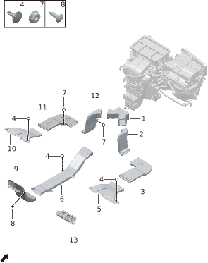

| Поз. | Артикул | Наименование | Кол-во | Применимость | Примечание |
| ---: | --- | --- | ---: | --- | --- |
| 1 | 553305001 | Распределитель канала обдува ног заднего ряда | 1 | с 2022-07-10 |  |
| 2 | 553302001 | Передняя секция правого заднего канала обдува ног | 1 | с 2022-07-10 |  |
| 3 | 553304001 | Средняя секция правого заднего канала обдува ног | 1 | с 2022-07-10 |  |
| 4 | Q41001011 | Защелка | 8 | с 2022-07-10 |  |
| 5 | 553307001 | Задняя секция правого заднего канала обдува ног | 1 | с 2022-07-10 |  |
| 6 | 553309001 | Передняя секция заднего лицевого воздуховода | 1 | с 2022-07-10 |  |
| 7 | Q21001002 | Фланцевая гайка | 4 | с 2022-07-10 |  |
| 8 | Q12002032 | Самонарезающий винт | 2 | с 2023-02-05 |  |
| 9 | 553308003 | Задняя часть воздуховода обдува лица | 1 | с 2022-07-10 |  |
| 10 | 553306001 | Задняя секция левого заднего канала обдува ног | 1 | с 2022-07-10 |  |
| 11 | 553303001 | Средняя секция левого заднего канала обдува ног | 1 | с 2022-07-10 |  |
| 12 | 553301001 | Передняя секция левого заднего канала обдува ног | 1 | с 2022-07-10 |  |
| 13 | 551703003 | Задний дефлектор | 1 | с 2022-07-10 | Матовый серебристый |
| 13 | 551703005 | Задний дефлектор | 1 | с 2024-04-17 | Черный хром |

## 6040-10 Обивка крыши

- Применимость группы: с 2023-05-09
- Описание: Общая конфигурация: универсально для серии

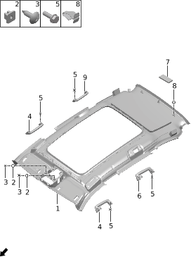

| Поз. | Артикул | Наименование | Кол-во | Применимость | Примечание |
| ---: | --- | --- | ---: | --- | --- |
| 1 | 551801012BETA | Обивка крыши | 1 | с 2022-12-25 | Бежевый + ткань; без стеклянной крыши + черный + синий |
| 1 | 551801012BLTA | Обивка крыши | 1 | с 2022-12-25 | Космический синий + ткань; без стеклянной крыши + светло-коричневый + синий |
| 1 | 551801012TG02 | Обивка крыши | 1 | с 2022-12-25 | Ткань + серо-бежевый; без стеклянной крыши + красный + бежевый |
| 1 | 551801015BETA | Обивка крыши | 1 | с 2022-12-25 | Бежевый + ткань; электрохромная стеклянная крыша + атмосферная подсветка + черный + ... |
| 1 | 551801015BLTA | Обивка крыши | 1 | с 2022-12-25 | Синий + ткань; электрохромная стеклянная крыша + атмосферная подсветка + светло-коричневый ... |
| 1 | 551801015TG02 | Обивка крыши | 1 | с 2022-12-25 | ... + серо-бежевый; электрохромная стеклянная крыша + атмосферная подсветка + красный + ... |
| 1 | 551801029TG11 | Обивка крыши | 1 | с 2024-04-23 | Светло-пестрый серый; черный + серый; электрохромная стеклянная крыша + атмосферная подсветка |
| 1 | 551801029TK11 | Обивка крыши | 1 | с 2024-04-23 | Смесовый черный; черный + зеленый; электрохромная стеклянная крыша + атмосферная подсветка |
| 1 | 551801030TG11 | Обивка крыши | 1 | с 2024-04-23 | Светло-пестрый серый; черный + серый; без стеклянной крыши |
| 1 | 551801030TK11 | Обивка крыши | 1 | с 2024-04-23 | Смесовый черный; черный + зеленый; без стеклянной крыши |
| 2 | Q21004006 | Пластиковая гайка | 2 | с 2022-07-10 |  |
| 3 | Q12002015 | Самонарезающий винт | 2 | с 2022-07-10 |  |
| 4 | 552601001BEGB | Передняя потолочная ручка | 2 | с 2022-07-10 | Бежевый + мелкозернистый матовый; черный + синий интерьер |
| 4 | 552601001BLGB | Передняя потолочная ручка | 2 | с 2022-07-10 | Космический синий + грубая текстура; светло-коричневый + синий интерьер |
| 4 | 552601004JG05 | Передняя потолочная ручка | 2 | с 2022-07-10 | Красный + бежевый |
| 4 | 552601007GZS1 | Передняя потолочная ручка | 2 | с 2024-04-17 | Черный + зеленый |
| 4 | 552601010JG08 | Передняя потолочная ручка | 2 | с 2024-04-17 | Темно-серый или светло-серый; черный + серый |
| 5 | Q12001005 | Винт с внутренним шестигранником | 8 | с 2022-07-10 |  |
| 6 | 552602001BEGB | Левая задняя потолочная ручка | 1 | с 2022-07-10 | Бежевый + мелкозернистый матовый; черный + синий интерьер |
| 6 | 552602001BLGB | Левая задняя потолочная ручка | 1 | с 2022-07-10 | Космический синий + грубая текстура; светло-коричневый + синий интерьер |
| 6 | 552602004JG05 | Левая задняя потолочная ручка | 1 | с 2022-07-10 | Серо-бежевый + грубая текстура; красный + бежевый |
| 6 | 552602007GZS1 | Левая задняя потолочная ручка | 1 | с 2024-04-17 | Черный + зеленый |
| 6 | 552602010JG08 | Левая задняя потолочная ручка | 1 | с 2024-04-17 | Темно-серый или светло-серый; черный + серый |
| 7 | 551802001 | Грибовидная застежка | 7 | с 2022-07-10 |  |
| 8 | Q41001006 | Защелка | 4 | с 2022-07-10 |  |
| 9 | 552603001BEGB | Правая задняя потолочная ручка | 1 | с 2022-07-10 | Бежевый + мелкозернистый матовый; черный + синий интерьер |
| 9 | 552603001BLGB | Правая задняя потолочная ручка | 1 | с 2022-07-10 | Космический синий + грубая текстура; светло-коричневый + синий интерьер |
| 9 | 552603004JG05 | Правая задняя потолочная ручка | 1 | с 2022-07-10 | Серо-бежевый + грубая текстура; красный + бежевый |
| 9 | 552603007GZS1 | Правая задняя потолочная ручка | 1 | с 2024-04-17 | Черный + зеленый |
| 9 | 552603010JG08 | Правая задняя потолочная ручка | 1 | с 2024-04-17 | Темно-серый или светло-серый; черный + серый |

## 6041-10 Передняя боковая обивка

- Применимость группы: с 2023-05-09
- Описание: Общая конфигурация: универсально для серии

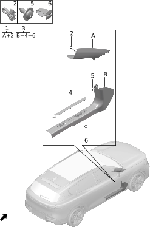

| Поз. | Артикул | Наименование | Кол-во | Применимость | Примечание |
| ---: | --- | --- | ---: | --- | --- |
| 1 | 552001011BETA | Левая верхняя накладка стойки A | 1 | с 2022-12-01 | Бежевый + ткань; черный + синий интерьер |
| 1 | 552001011BLTA | Левая верхняя накладка стойки A | 1 | с 2022-12-01 | Космический синий + ткань; светло-коричневый + синий интерьер |
| 1 | 552001011TG02 | Левая верхняя накладка стойки A | 1 | с 2022-12-01 | Ткань + серо-бежевый; красный + бежевый |
| 1 | 552001018TG11 | Левая верхняя накладка стойки A | 1 | с 2024-04-17 | Светло-пестрый серый; черный + серый |
| 1 | 552001019TK11 | Левая верхняя накладка стойки A | 1 | с 2024-04-17 | Смесовый черный; черный + зеленый |
| 1 | 552002011BETA | Правая верхняя накладка стойки A | 1 | с 2022-12-01 | Бежевый + ткань; черный + синий интерьер |
| 1 | 552002011BLTA | Правая верхняя накладка стойки A | 1 | с 2022-12-01 | Космический синий + ткань; светло-коричневый + синий интерьер |
| 1 | 552002011TG02 | Правая верхняя накладка стойки A | 1 | с 2022-12-01 | Ткань + серо-бежевый; красный + бежевый |
| 1 | 552002018TG11 | Правая верхняя накладка стойки A | 1 | с 2024-04-17 | Светло-пестрый серый; черный + серый |
| 1 | 552002019TK11 | Правая верхняя накладка стойки A | 1 | с 2024-04-17 | Смесовый черный; черный + зеленый |
| 2 | Q41001010 | Защелка | 23 | с 2022-07-10 |  |
| 3 | 551222008BKGA | Левая передняя накладка порога с приветственной подсветкой в сборе | 1 | с 2022-12-01 | Черный обсидиан + грубая текстура; черный + синий интерьер |
| 3 | 551222008BLGB | Левая передняя накладка порога с приветственной подсветкой в сборе | 1 | с 2022-12-01 | Космический синий + грубая текстура; светло-коричневый + синий интерьер |
| 3 | 551222008JR03 | Левая передняя накладка порога с приветственной подсветкой в сборе | 1 | с 2022-12-01 | Охристо-красный; красный + бежевый |
| 3 | 551223008BKGA | Правая передняя накладка порога с приветственной подсветкой в сборе | 1 | с 2022-12-01 | Черный обсидиан + грубая текстура; черный + синий интерьер |
| 3 | 551223008BLGB | Правая передняя накладка порога с приветственной подсветкой в сборе | 1 | с 2022-12-01 | Космический синий + грубая текстура; светло-коричневый + синий интерьер |
| 3 | 551223008JR03 | Правая передняя накладка порога с приветственной подсветкой в сборе | 1 | с 2022-12-01 | Охристо-красный; красный + бежевый |
| 4 | 551109002 | Левая передняя приветственная накладка порога | 1 | с 2022-07-10 |  |
| 4 | 551110002 | Правая передняя приветственная накладка порога | 1 | с 2022-07-10 |  |
| 5 | Q12002004 | Самонарезающий винт | 2 | с 2022-07-10 |  |
| 6 | Q41001006 | Защелка | 4 | с 2022-07-10 |  |

## 6042-10 Средняя боковая обивка

- Применимость группы: с 2023-05-10
- Описание: Общая конфигурация: универсально для серии

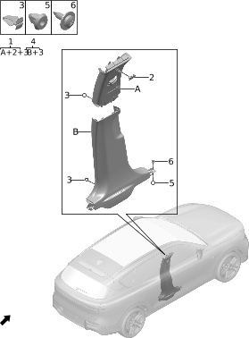

| Поз. | Артикул | Наименование | Кол-во | Применимость | Примечание |
| ---: | --- | --- | ---: | --- | --- |
| 1 | 552003015BETA | Левая верхняя накладка стойки B | 1 | с 2022-12-01 | Бежевый + ткань; черный + синий интерьер |
| 1 | 552003015BLTA | Левая верхняя накладка стойки B | 1 | с 2022-12-01 | Космический синий + ткань; светло-коричневый + синий интерьер |
| 1 | 552003015TG02 | Левая верхняя накладка стойки B | 1 | с 2022-12-01 | Ткань + серо-бежевый; красный + бежевый |
| 1 | 552003022TG11 | Левая верхняя накладка стойки B | 1 | с 2024-04-17 | Светло-пестрый серый; черный + серый |
| 1 | 552003023TK11 | Левая верхняя накладка стойки B | 1 | с 2024-04-17 | Смесовый черный; черный + зеленый |
| 1 | 552004015BETA | Правая верхняя накладка стойки B | 1 | с 2022-12-01 | Бежевый + ткань; черный + синий интерьер |
| 1 | 552004015BLTA | Правая верхняя накладка стойки B | 1 | с 2022-12-01 | Космический синий + ткань; светло-коричневый + синий интерьер |
| 1 | 552004015TG02 | Правая верхняя накладка стойки B | 1 | с 2022-12-01 | Ткань + серо-бежевый; красный + бежевый |
| 1 | 552004022TG11 | Правая верхняя накладка стойки B | 1 | с 2024-04-17 | Светло-пестрый серый; черный + серый |
| 1 | 552004023TK11 | Правая верхняя накладка стойки B | 1 | с 2024-04-17 | Смесовый черный; черный + зеленый |
| 2 | 552029004BEGE | Левая заглушка метки шторки безопасности стойки B | 2 | с 2022-12-01 | Бежевый + мелкая текстура; черный + синий |
| 2 | 552029005BLGC | Левая заглушка метки шторки безопасности стойки B | 2 | с 2022-12-01 | Космический синий + мелкая текстура; светло-коричневый + синий |
| 2 | 552029006JG05 | Левая заглушка метки шторки безопасности стойки B | 2 | с 2022-12-01 | Серо-бежевый + грубая текстура; красный + бежевый |
| 2 | 552030004BEGE | Правая заглушка метки шторки безопасности стойки B | 2 | с 2022-12-01 | Бежевый + мелкая текстура; черный + синий |
| 2 | 552030005BLGC | Правая заглушка метки шторки безопасности стойки B | 2 | с 2022-12-01 | Космический синий + мелкая текстура; светло-коричневый + синий |
| 2 | 552030006JG05 | Правая заглушка метки шторки безопасности стойки B | 2 | с 2022-12-01 | Серо-бежевый + грубая текстура; красный + бежевый |
| 3 | Q41001006 | Защелка | 12 | с 2022-07-10 |  |
| 4 | 552017008BKGA | Левая нижняя накладка стойки B | 1 | с 2022-12-01 | Черный обсидиан + грубая текстура; черный + синий интерьер |
| 4 | 552017008BLGB | Левая нижняя накладка стойки B | 1 | с 2022-12-01 | Космический синий + грубая текстура; светло-коричневый + синий интерьер |
| 4 | 552017008JR03 | Левая нижняя накладка стойки B | 1 | с 2022-12-01 | Охристо-красный; красный + бежевый |
| 4 | 552018008BKGA | Правая нижняя накладка стойки B | 1 | с 2022-12-01 | Черный обсидиан + грубая текстура; черный + синий интерьер |
| 4 | 552018008BLGB | Правая нижняя накладка стойки B | 1 | с 2022-12-01 | Космический синий + грубая текстура; светло-коричневый + синий интерьер |
| 4 | 552018008JR03 | Правая нижняя накладка стойки B | 1 | с 2022-12-01 | Охристо-красный; красный + бежевый |
| 5 | Q41006003 | Герметичная клипса | 4 | с 2022-07-10 |  |
| 6 | Q12002004 | Самонарезающий винт | 4 | с 2022-07-10 |  |

## 6043-10 Задняя боковая обивка

- Применимость группы: с 2023-05-10
- Описание: Общая конфигурация: универсально для серии

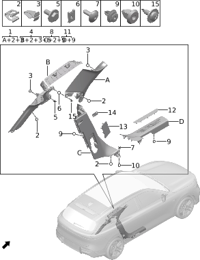

| Поз. | Артикул | Наименование | Кол-во | Применимость | Примечание |
| ---: | --- | --- | ---: | --- | --- |
| 1 | 552019010BETA | Левая верхняя накладка стойки C | 1 | с 2022-12-01 | Бежевый + ткань; черный + синий интерьер |
| 1 | 552019010BLTA | Левая верхняя накладка стойки C | 1 | с 2022-12-01 | Космический синий + ткань; светло-коричневый + синий интерьер |
| 1 | 552019010TG02 | Левая верхняя накладка стойки C | 1 | с 2022-12-01 | Ткань + серо-бежевый; красный + бежевый |
| 1 | 552019021TG11 | Левая верхняя накладка стойки C | 1 | с 2024-04-17 | Светло-пестрый серый; черный + серый |
| 1 | 552019022TK11 | Левая верхняя накладка стойки C | 1 | с 2024-04-17 | Смесовый черный; черный + зеленый |
| 1 | 552020010BETA | Правая верхняя накладка стойки C | 1 | с 2022-12-01 | Бежевый + ткань; черный + синий интерьер |
| 1 | 552020010BLTA | Правая верхняя накладка стойки C | 1 | с 2022-12-01 | Космический синий + ткань; светло-коричневый + синий интерьер |
| 1 | 552020010TG02 | Правая верхняя накладка стойки C | 1 | с 2022-12-01 | Ткань + серо-бежевый; красный + бежевый |
| 1 | 552020021TG11 | Правая верхняя накладка стойки C | 1 | с 2024-04-17 | Светло-пестрый серый; черный + серый |
| 1 | 552020022TK11 | Правая верхняя накладка стойки C | 1 | с 2024-04-17 | Смесовый черный; черный + зеленый |
| 2 | Q41004001 | Зажим | 10 | с 2022-07-10 |  |
| 3 | Q41001006 | Защелка | 22 | с 2022-07-10 |  |
| 4 | 552023008BEGA | Левая верхняя накладка стойки D | 1 | с 2022-12-01 | Бежевый + грубая текстура; черный + синий интерьер |
| 4 | 552023008BLGB | Левая верхняя накладка стойки D | 1 | с 2022-12-01 | Космический синий + грубая текстура; светло-коричневый + синий интерьер |
| 4 | 552023008JG05 | Левая верхняя накладка стойки D | 1 | с 2022-12-01 | Серо-бежевый + грубая текстура; красный + бежевый |
| 4 | 552023014JG08 | Левая верхняя накладка стойки D | 1 | с 2024-04-17 | Светло-пестрый серый; черный + серый |
| 4 | 552023015BKGA | Левая верхняя накладка стойки D | 1 | с 2024-05-16 | Смесовый черный; черный + зеленый |
| 4 | 552024008BEGA | Правая верхняя накладка стойки D | 1 | с 2022-12-01 | Бежевый + грубая текстура; черный + синий интерьер |
| 4 | 552024008BLGB | Правая верхняя накладка стойки D | 1 | с 2022-12-01 | Космический синий + грубая текстура; светло-коричневый + синий интерьер |
| 4 | 552024008JG05 | Правая верхняя накладка стойки D | 1 | с 2022-12-01 | Серо-бежевый + грубая текстура; красный + бежевый |
| 4 | 552024013JG08 | Правая верхняя накладка стойки D | 1 | с 2024-04-17 | Светло-пестрый серый; черный + серый |
| 4 | 552024014BKGA | Правая верхняя накладка стойки D | 1 | с 2024-05-16 | Смесовый черный; черный + зеленый |
| 5 | Q11002001 | Болт | 2 | с 2022-07-10 |  |
| 6 | Q21003005 | Пружинная гайка | 2 | с 2022-07-10 |  |
| 7 | Q12001018 | Винт с внутренним шестигранником | 4 | с 2022-07-10 |  |
| 8 | 552021006AR01 | Левая нижняя накладка стойки C | 1 | 2022-12-01 - 2024-12-05 | Охристо-красный; красный + бежевый |
| 8 | 552021006BKAA | Левая нижняя накладка стойки C | 1 | 2022-12-01 - 2024-08-09 | Черный обсидиан + покрытие PVC; черный + синий интерьер |
| 8 | 552021006BLAB | Левая нижняя накладка стойки C | 1 | 2022-12-01 - 2024-10-07 | ... космический синий + покрытие PVC; светло-коричневый + синий интерьер |
| 8 | 552022006AR01 | Правая нижняя накладка стойки C | 1 | 2022-12-01 - 2024-12-05 | Охристо-красный; красный + бежевый |
| 8 | 552022006BKAA | Правая нижняя накладка стойки C | 1 | 2022-12-01 - 2024-08-09 | Черный обсидиан + покрытие PVC; черный + синий интерьер |
| 8 | 552022006BLAB | Правая нижняя накладка стойки C | 1 | 2022-12-01 - 2024-10-07 | ... космический синий + покрытие PVC; светло-коричневый + синий интерьер |
| 9 | Q41001009 | Защелка | 14 | с 2022-07-10 |  |
| 10 | Q41006003 | Герметичная клипса | 4 | с 2022-07-10 |  |
| 11 | 551114007BKGA | Левая задняя накладка порога с приветственной подсветкой | 1 | с 2022-12-01 | Черный обсидиан + грубая текстура; черный + синий интерьер |
| 11 | 551114007BLGB | Левая задняя накладка порога с приветственной подсветкой | 1 | с 2022-12-01 | Космический синий + грубая текстура; светло-коричневый + синий интерьер |
| 11 | 551114007JR03 | Левая задняя накладка порога с приветственной подсветкой | 1 | с 2022-12-01 | Охристо-красный; красный + бежевый |
| 11 | 551115005BKGA | Правая задняя накладка порога с приветственной подсветкой | 1 | с 2022-12-01 | Черный обсидиан + грубая текстура; черный + синий интерьер |
| 11 | 551115005BLGB | Правая задняя накладка порога с приветственной подсветкой | 1 | с 2022-12-01 | Космический синий + грубая текстура; светло-коричневый + синий интерьер |
| 11 | 551115005JR03 | Правая задняя накладка порога с приветственной подсветкой | 1 | с 2022-12-01 | Охристо-красный; красный + бежевый |
| 12 | 551205001 | Левая задняя приветственная накладка порога | 1 | с 2022-07-10 |  |
| 12 | 551206001 | Правая задняя приветственная накладка порога | 1 | с 2022-07-10 |  |
| 13 | 552025003BKGA | Левая нижняя декоративная крышка стойки C | 1 | с 2022-12-01 | Черный обсидиан + грубая текстура; черный + синий интерьер |
| 13 | 552025003BLGB | Левая нижняя декоративная крышка стойки C | 1 | с 2022-12-01 | Космический синий + грубая текстура; светло-коричневый + синий интерьер |
| 13 | 552025003JR03 | Левая нижняя декоративная крышка стойки C | 1 | с 2023-08-30 | Охристо-красный; красный + бежевый |
| 13 | 552026003BKGA | Правая нижняя декоративная крышка стойки C | 1 | с 2022-12-01 | Черный обсидиан + грубая текстура; черный + синий интерьер |
| 13 | 552026003BLGB | Правая нижняя декоративная крышка стойки C | 1 | с 2022-12-01 | Космический синий + грубая текстура; светло-коричневый + синий интерьер |
| 13 | 552026003JR03 | Правая нижняя декоративная крышка стойки C | 1 | с 2023-09-01 | Охристо-красный; красный + бежевый |
| 14 | 552027003 | Левая декоративная накладка крюка фиксатора спинки сиденья | 1 | 2022-12-01 - 2024-12-05 |  |
| 14 | 552028003 | Правая декоративная накладка крюка фиксатора спинки сиденья | 1 | 2022-12-01 - 2024-12-05 |  |
| 15 | Q12002004 | Самонарезающий винт | 4 | с 2022-07-10 |  |

## 6044-10 Обивка передних дверей

- Применимость группы: с 2023-04-01
- Описание: Общая конфигурация: универсально для серии

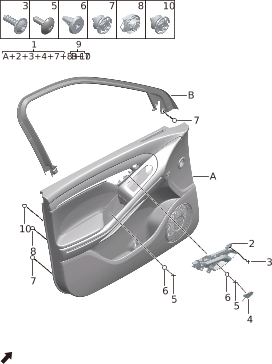

| Поз. | Артикул | Наименование | Кол-во | Применимость | Примечание |
| ---: | --- | --- | ---: | --- | --- |
| 1 | 551101027AR01 | Левая передняя дверная карта | 1 | с 2022-10-01 | Охристо-красный; Dynaudio + красный + бежевый |
| 1 | 551101027BKAC | Левая передняя дверная карта | 1 | с 2022-10-01 | Черно-синий + покрытие PVC; Dynaudio + черный + синий |
| 1 | 551101027BL02 | Левая передняя дверная карта | 1 | с 2022-10-01 | (Коричневый) космический синий + покрытие PVC + черная древесная текстура; Dynaudio + светло-коричневый + синий |
| 1 | 551101027UG05 | Левая передняя дверная карта | 1 | с 2024-04-17 | Черный + серый; Dynaudio |
| 1 | 551101027UK02 | Левая передняя дверная карта | 1 | с 2024-04-17 | Черный + зеленый; Dynaudio |
| 1 | 551103050AR01 | Правая передняя дверная карта | 1 | с 2022-12-12 | Охристо-красный; Dynaudio + красный + бежевый |
| 1 | 551103050BKAC | Правая передняя дверная карта | 1 | с 2022-12-12 | Черно-синий + покрытие PVC; Dynaudio + черный + синий |
| 1 | 551103050BL02 | Правая передняя дверная карта | 1 | с 2022-12-12 | (Коричневый) космический синий + покрытие PVC + черная древесная текстура; Dynaudio + светло-коричневый + синий |
| 1 | 551103050UG05 | Правая передняя дверная карта | 1 | с 2024-04-17 | Черный + серый; Dynaudio |
| 1 | 551103050UK02 | Правая передняя дверная карта | 1 | с 2024-04-17 | Черный + зеленый; Dynaudio |
| 2 | 551105001 | Левая внутренняя ручка открывания | 1 | с 2022-07-10 |  |
| 2 | 551106001 | Правая внутренняя ручка открывания | 1 | с 2022-07-10 |  |
| 3 | Q12003005 | Винт | 8 | с 2022-07-10 |  |
| 4 | 553504001 | Левая крышка винта внутренней ручки | 1 | с 2022-07-10 |  |
| 4 | 553505001 | Правая крышка винта внутренней ручки | 1 | с 2022-07-10 |  |
| 5 | Q12001018 | Винт с внутренним шестигранником | 6 | с 2022-07-10 |  |
| 6 | Q41006003 | Герметичная клипса | 6 | с 2022-07-10 |  |
| 7 | 551116001 | Водозащитная клипса | 20 | с 2022-07-10 |  |
| 8 | 551117000 | Противоударная клипса | 4 | с 2022-07-10 |  |
| 9 | 551107001 | Левая верхняя декоративная накладка рамки передней двери | 1 | с 2022-07-10 |  |
| 9 | 551108001 | Правая верхняя декоративная накладка рамки передней двери | 1 | с 2022-07-10 |  |
| 10 | 551127001 | Штифт противоударной клипсы | 3 | с 2022-07-10 |  |

## 6045-10 Обивка задних дверей

- Применимость группы: с 2023-04-01
- Описание: Аудиосистема: Dynaudio

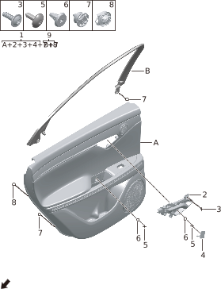

| Поз. | Артикул | Наименование | Кол-во | Применимость | Примечание |
| ---: | --- | --- | ---: | --- | --- |
| 1 | 551201044AR01 | Левая задняя дверная карта | 1 | с 2022-12-12 | Охристо-красный; Dynaudio + красный + бежевый |
| 1 | 551201044BKAC | Левая задняя дверная карта | 1 | с 2022-12-12 | Черно-синий + покрытие PVC; Dynaudio + черный + синий |
| 1 | 551201044BL02 | Левая задняя дверная карта | 1 | с 2022-12-12 | (Коричневый) космический синий + покрытие PVC + черная древесная текстура; Dynaudio + светло-коричневый + синий |
| 1 | 551201044UG05 | Левая задняя дверная карта | 1 | с 2024-04-17 | Черный + серый; Dynaudio |
| 1 | 551201044UK02 | Левая задняя дверная карта | 1 | с 2024-04-17 | Черный + зеленый; Dynaudio |
| 1 | 551202044AR01 | Правая задняя дверная карта | 1 | с 2022-12-12 | Охристо-красный; Dynaudio + красный + бежевый |
| 1 | 551202044BKAC | Правая задняя дверная карта | 1 | с 2022-12-12 | Черно-синий + покрытие PVC; Dynaudio + черный + синий |
| 1 | 551202044BL02 | Правая задняя дверная карта | 1 | с 2022-12-12 | (Коричневый) космический синий + покрытие PVC + черная древесная текстура; Dynaudio + светло-коричневый + синий |
| 1 | 551202044UG05 | Правая задняя дверная карта | 1 | с 2024-04-17 | Черный + серый; Dynaudio |
| 1 | 551202044UK02 | Правая задняя дверная карта | 1 | с 2024-04-17 | Черный + зеленый; Dynaudio |
| 2 | 551105001 | Левая внутренняя ручка открывания | 1 | с 2022-07-10 |  |
| 2 | 551106001 | Правая внутренняя ручка открывания | 1 | с 2022-07-10 |  |
| 3 | Q12003005 | Винт | 8 | с 2022-07-10 |  |
| 4 | 553504001 | Левая крышка винта внутренней ручки | 1 | с 2022-07-10 |  |
| 4 | 553505001 | Правая крышка винта внутренней ручки | 1 | с 2022-07-10 |  |
| 5 | Q12001018 | Винт с внутренним шестигранником | 6 | с 2022-07-10 |  |
| 6 | Q41006003 | Герметичная клипса | 6 | с 2022-07-10 |  |
| 7 | 551116001 | Водозащитная клипса | 20 | с 2022-07-10 |  |
| 8 | 551117000 | Противоударная клипса | 4 | с 2022-07-10 |  |
| 9 | 551211001 | Левая верхняя декоративная накладка рамки задней двери | 1 | с 2022-07-10 |  |
| 9 | 551212001 | Правая верхняя декоративная накладка рамки задней двери | 1 | с 2022-07-10 |  |

## 6046-10 Обивка задней двери

- Применимость группы: с 2023-05-09
- Описание: Общая конфигурация: универсально для серии

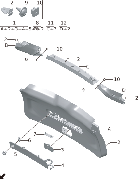

| Поз. | Артикул | Наименование | Кол-во | Применимость | Примечание |
| ---: | --- | --- | ---: | --- | --- |
| 1 | 551501001 | Нижняя декоративная панель двери багажника | 1 | с 2022-07-10 |  |
| 2 | Q41001006 | Защелка | 19 | с 2022-07-10 |  |
| 3 | 551508001 | Крышка аварийного отверстия | 1 | с 2022-07-10 |  |
| 4 | 551509001 | Основание крышки знака аварийной остановки | 1 | с 2022-07-10 |  |
| 5 | 551510001 | Ручка крышки знака аварийной остановки | 1 | с 2022-07-10 |  |
| 6 | 551511003 | Крепежная пластина ручки | 1 | с 2022-07-10 |  |
| 7 | 551506001 | Крышка защелки ручки | 1 | с 2022-07-10 |  |
| 8 | 551505001 | Правая декоративная панель двери багажника | 1 | с 2022-07-10 |  |
| 9 | Q12002004 | Самонарезающий винт | 7 | с 2022-07-10 |  |
| 10 | Q21004006 | Пластиковая гайка | 7 | с 2022-07-10 |  |
| 11 | 551502001 | Верхняя декоративная панель двери багажника | 1 | с 2022-07-10 |  |
| 12 | 551504001 | Левая декоративная панель двери багажника | 1 | с 2022-07-10 |  |

## 6047-10 Ковровое покрытие

- Применимость группы: с 2023-05-09
- Описание: Общая конфигурация: универсально для серии

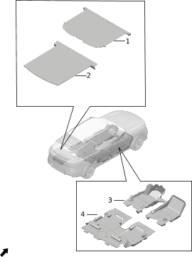

| Поз. | Артикул | Наименование | Кол-во | Применимость | Примечание |
| ---: | --- | --- | ---: | --- | --- |
| 1 | 551507001 | Шторка багажного отделения | 1 | с 2022-07-10 |  |
| 2 | 552201001 | Ковер багажника | 1 | 2022-07-10 - 2024-08-19 | Емкость батареи: 39kWh |
| 2 | 552201002 | Ковер багажника | 1 | 2024-05-07 - 2024-08-10 | Емкость батареи: 43kWh |
| 2 | 552201003 | Ковер багажника | 1 | с 2024-08-19 | Емкость батареи: 39kWh |
| 2 | 552201004 | Ковер багажника | 1 | с 2024-08-10 | Емкость батареи: 43kWh |
| 3 | 551901015 | Передний передний ковер пола | 1 | с 2023-02-05 |  |
| 4 | 551903008 | Передний задний ковер пола | 1 | с 2023-03-29 |  |

## 6049-10 Облицовка заднего багажного отсека

- Применимость группы: с 2023-05-09
- Описание: Общая конфигурация: универсально для серии

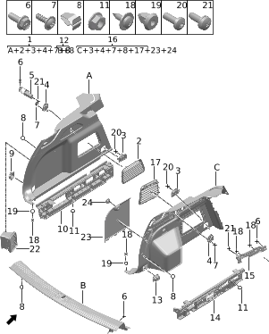

| Поз. | Артикул | Наименование | Кол-во | Применимость | Примечание |
| ---: | --- | --- | ---: | --- | --- |
| 1 | 552008002BKGA | Левая задняя боковая обивка | 1 | с 2022-07-10 | Черный обсидиан + грубая текстура; черный + синий интерьер |
| 1 | 552008002BLGB | Левая задняя боковая обивка | 1 | с 2022-07-10 | Космический синий + грубая текстура; светло-коричневый + синий интерьер |
| 1 | 552008006JG05 | Левая задняя боковая обивка | 1 | с 2022-07-10 | Серо-бежевый + грубая текстура; красный + бежевый |
| 2 | 552015001 | Левый вентиляционный выход багажника | 1 | с 2022-07-10 |  |
| 3 | 552005001 | Передний крючок багажника | 2 | с 2022-07-10 |  |
| 4 | 552014002JG05 | Крючок | 2 | с 2022-07-10 | Серо-бежевый + грубая текстура; красный + бежевый |
| 4 | 552014003BKGB | Крючок | 2 | с 2022-07-10 | Черный обсидиан + мелкая текстура; черный + синий интерьер |
| 4 | 552014004BLGC | Крючок | 2 | с 2022-07-10 | Космический синий + мелкая текстура; светло-коричневый + синий интерьер |
| 5 | 552012002 | Левый монтажный кронштейн задней боковины | 1 | с 2022-12-01 |  |
| 6 | Q11002020 | Болт | 7 | с 2022-07-10 |  |
| 7 | Q12003005 | Винт | 6 | с 2022-07-10 |  |
| 8 | Q41001006 | Защелка | 12 | с 2022-07-10 |  |
| 9 | 552006001 | Левый задний крючок багажника | 1 | с 2022-07-10 |  |
| 10 | 552010003 | Нижний левый кронштейн задней боковины | 1 | с 2022-12-01 |  |
| 11 | Q21001010 | Фланцевая гайка | 12 | с 2022-07-10 |  |
| 12 | 551503005BKGA | Накладка порога двери багажника | 1 | с 2022-12-01 | Черный обсидиан + грубая текстура; черный + синий интерьер |
| 13 | 552007001 | Правый задний крючок багажника | 1 | с 2022-07-10 |  |
| 14 | 552011002 | Нижний правый кронштейн задней боковины | 1 | с 2022-12-01 |  |
| 15 | 552013002 | Правый монтажный кронштейн задней боковины | 1 | с 2022-12-01 |  |
| 16 | 552009008BKGA | Правая задняя боковая обивка | 1 | с 2022-12-25 | Черный обсидиан + грубая текстура; черный + синий интерьер |
| 16 | 552009008BLGB | Правая задняя боковая обивка | 1 | с 2022-12-25 | Космический синий + грубая текстура; светло-коричневый + синий интерьер |
| 16 | 552009008JG05 | Правая задняя боковая обивка | 1 | с 2022-12-25 | Серо-бежевый + грубая текстура; красный + бежевый |
| 17 | 552016002 | Правый вентиляционный выход багажника | 1 | с 2022-12-25 |  |
| 18 | Q12002004 | Самонарезающий винт | 4 | с 2022-07-10 |  |
| 19 | Q41006003 | Герметичная клипса | 2 | с 2022-07-10 |  |
| 20 | Q12001006 | Винт с внутренним шестигранником | 2 | с 2022-07-10 |  |
| 21 | Q12002001 | Самонарезающий винт | 2 | с 2022-07-10 |  |
| 22 | 820002001 | Клапан сброса давления | 2 | 2022-07-10 - 2024-10-12 |  |
| 22 | 820002002 | Клапан сброса давления | 2 | с 2024-06-15 |  |
| 23 | 552031001 | Крышка инструментального отсека багажника | 1 | с 2022-07-10 |  |
| 24 | 552032001 | Ручка крышки инструментального отсека багажника | 1 | с 2022-07-10 |  |

## 6050-10 Шумоизоляционные элементы

- Применимость группы: с 2023-04-01
- Описание: Общая конфигурация: универсально для серии

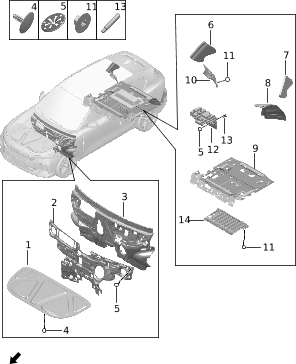

| Поз. | Артикул | Наименование | Кол-во | Применимость | Примечание |
| ---: | --- | --- | ---: | --- | --- |
| 1 | 501303001 | Шумоизоляционный мат передней крышки | 1 | с 2022-07-10 |  |
| 2 | 501305002 | Теплоизоляционный мат переднего отсека | 1 | 2022-07-10 - 2024-06-03 |  |
| 2 | 501309004 | Наружный шумоизоляционный мат передней перегородки | 1 | с 2024-06-03 |  |
| 3 | 501304003 | Шумоизоляционный мат щитка передней перегородки | 1 | 2022-07-10 - 2024-06-04 | Панорамная крыша |
| 3 | 501304004 | Шумоизоляционный мат щитка передней перегородки | 1 | 2022-07-10 - 2024-06-14 | Электрохромное стекло + атмосферная подсветка |
| 3 | 501308011 | Внутренний шумоизоляционный мат передней перегородки | 1 | с 2024-06-04 | Панорамная крыша |
| 3 | 501308012 | Внутренний шумоизоляционный мат передней перегородки | 1 | с 2024-06-14 | Электрохромное стекло + атмосферная подсветка |
| 4 | Q41001004 | Защелка | 11 | с 2022-07-10 |  |
| 5 | Q41003003 | Металлическая клипса | 25 | с 2022-10-01 |  |
| 6 | 501302001 | Правый звукопоглощающий мат задней боковины | 1 | 2022-07-10 - 2024-06-03 |  |
| 6 | 501302005 | Правый звукопоглощающий мат задней боковины | 1 | с 2024-06-03 |  |
| 7 | 501301001 | Левый звукопоглощающий мат задней боковины | 1 | с 2022-07-10 |  |
| 8 | 310401003 | Левый шумоизоляционный мат под облицовкой колесной арки | 1 | с 2023-06-16 |  |
| 9 | 501311004 | Внутренний шумоизоляционный мат пола багажника | 1 | 2022-07-10 - 2023-08-30 |  |
| 9 | 501311009 | Внутренний шумоизоляционный мат пола багажника | 1 | с 2023-08-30 |  |
| 10 | 310402001 | Правый шумоизоляционный мат под облицовкой колесной арки | 1 | 2022-07-10 - 2024-05-30 |  |
| 10 | 310402004 | Правый шумоизоляционный мат под облицовкой колесной арки | 1 | с 2024-05-30 |  |
| 11 | Q21004001 | Пластиковая гайка | 7 | с 2022-07-10 |  |
| 12 | 501338001 | Шумоизоляционная панель двигателя | 1 | 2022-07-10 - 2024-06-06 |  |
| 13 | Q13002001 | Шпилька | 1 | с 2022-07-10 |  |
| 14 | 501312003 | Наружный шумоизоляционный мат пола багажника | 1 | с 2022-07-10 |  |

## 6051-10 Сиденье водителя

- Применимость группы: с 2023-05-10
- Описание: Общая конфигурация: универсально для серии

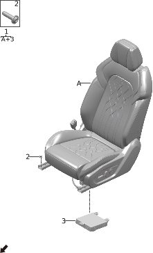

| Поз. | Артикул | Наименование | Кол-во | Применимость | Примечание |
| ---: | --- | --- | ---: | --- | --- |
| 1 | 690001052AG04 | Сиденье водителя в сборе | 1 | 2022-12-25 - 2024-01-02 | Охристо-красный + серо-бежевый PVC; красный + бежевый |
| 1 | 690001052BLAB | Сиденье водителя в сборе | 1 | 2022-12-25 - 2024-01-02 | (Коричневый) космический синий + PVC; светло-коричневый + синий |
| 1 | 690001052BLAD | Сиденье водителя в сборе | 1 | 2022-12-25 - 2024-01-02 | (Черный) космический синий + PVC; черный + синий |
| 1 | 690001094AG04 | Сиденье водителя в сборе | 1 | 2024-01-02 - 2024-04-19 | Охристо-красный + серо-бежевый PVC; красный + бежевый |
| 1 | 690001094BLAB | Сиденье водителя в сборе | 1 | 2024-01-02 - 2024-04-19 | (Коричневый) космический синий + PVC; светло-коричневый + синий |
| 1 | 690001094BLAD | Сиденье водителя в сборе | 1 | 2024-01-02 - 2024-04-19 | (Черный) космический синий + PVC; черный + синий |
| 1 | 690001112AG04 | Сиденье водителя в сборе | 1 | 2024-02-19 - 2024-09-05 | Охристо-красный + серо-бежевый PVC; красный + бежевый |
| 1 | 690001112BLAB | Сиденье водителя в сборе | 1 | 2024-02-19 - 2024-09-05 | (Коричневый) космический синий + PVC; светло-коричневый + синий |
| 1 | 690001112BLAD | Сиденье водителя в сборе | 1 | 2024-02-19 - 2024-09-05 | (Черный) космический синий + PVC; черный + синий |
| 1 | 690001119AG04 | Сиденье водителя в сборе | 1 |  | Охристо-красный + серо-бежевый PVC; красный + бежевый |
| 1 | 690001119BLAB | Сиденье водителя в сборе | 1 |  | (Коричневый) космический синий + PVC; светло-коричневый + синий |
| 1 | 690001119BLAD | Сиденье водителя в сборе | 1 |  | (Черный) космический синий + PVC; черный + синий |
| 1 | 690001120UG04 | Сиденье водителя в сборе | 1 | 2024-04-17 - 2024-09-05 | Черный + серый |
| 1 | 690001120UK02 | Сиденье водителя в сборе | 1 | 2024-04-17 - 2024-09-05 | Черный + зеленый |
| 1 | 690001124UG04 | Сиденье водителя в сборе | 1 |  | Черный + серый |
| 1 | 690001124UK02 | Сиденье водителя в сборе | 1 |  | Черный + зеленый |
| 1 | 690001130UG04 | Сиденье водителя в сборе | 1 | с 2024-09-05 | Черный + серый |
| 1 | 690001130UK02 | Сиденье водителя в сборе | 1 | с 2024-09-05 | Черный + зеленый |
| 1 | 690001131AG04 | Сиденье водителя в сборе | 1 | с 2024-09-05 | Охристо-красный + серо-бежевый PVC; красный + бежевый |
| 1 | 690001131BLAB | Сиденье водителя в сборе | 1 | с 2024-09-05 | (Коричневый) космический синий + PVC; светло-коричневый + синий |
| 1 | 690001132BLAD | Сиденье водителя в сборе | 1 | с 2024-09-05 | (Черный) космический синий + PVC; черный + синий |
| 2 | Q11002033 | Болт | 4 | с 2022-07-10 |  |
| 3 | 680914008 | Контроллер сиденья водителя | 1 | 2022-07-10 - 2024-01-02 |  |
| 3 | 680914010 | Контроллер сиденья водителя | 1 | 2022-07-10 - 2024-09-05 |  |
| 3 | 680914012 | Контроллер сиденья водителя | 1 | с 2024-08-26 |  |

## 6052-10 Подушка и спинка сиденья водителя

- Применимость группы: с 2023-05-09
- Описание: Общая конфигурация: универсально для серии

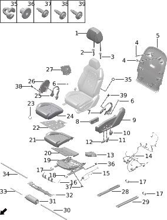

| Поз. | Артикул | Наименование | Кол-во | Применимость | Примечание |
| ---: | --- | --- | ---: | --- | --- |
| 1 | 680801001BKLA | Передний подголовник | 1 | с 2022-07-10 | Черный обсидиан + наппа; черный + синий |
| 1 | 680801001BRLA | Передний подголовник | 1 | с 2022-07-10 | Светло-коричневый + наппа; светло-коричневый + синий |
| 1 | 680801004AR01 | Передний подголовник | 1 | с 2022-07-10 | Охристо-красный; красный + бежевый |
| 1 | 680801016AG10 | Передний подголовник | 1 | с 2024-04-17 | Облачный серый; Voyah FREE318 |
| 1 | 680801016AK01 | Передний подголовник | 1 | с 2024-04-17 | Черный обсидиан; Voyah FREE318 |
| 1 | 680801017AR01 | Передний подголовник | 1 |  | Красно-бежевый, без вышитого логотипа |
| 2 | 680802001BKGC | Гладкая направляющая втулка подголовника | 1 | с 2022-07-10 | Черный обсидиан + мелкий матовый; черный обсидиан |
| 2 | 680802001BRGD | Гладкая направляющая втулка подголовника | 1 | с 2022-07-10 | Светло-коричневый + мелкий матовый; светло-коричневый + синий |
| 2 | 680802002JG10 | Гладкая направляющая втулка подголовника | 1 | с 2024-04-17 | Облачный серый; Voyah FREE318 |
| 2 | 680802002JR03 | Гладкая направляющая втулка подголовника | 1 | с 2022-07-10 | Охристо-красный; красный + бежевый |
| 3 | 680803001BKGC | Фиксируемая направляющая втулка подголовника | 1 | с 2022-07-10 | Черный обсидиан + мелкий матовый; черный обсидиан |
| 3 | 680803001BRGD | Фиксируемая направляющая втулка подголовника | 1 | с 2022-07-10 | Светло-коричневый + мелкий матовый; светло-коричневый + синий |
| 3 | 680803002JG10 | Фиксируемая направляющая втулка подголовника | 1 | с 2024-04-17 | Облачный серый; Voyah FREE318 |
| 3 | 680803002JR03 | Фиксируемая направляющая втулка подголовника | 1 | с 2022-07-10 | Охристо-красный; красный + бежевый |
| 4 | Q41001029 | Защелка | 2 | с 2022-07-10 |  |
| 5 | 680501005BKAA | Задняя панель сиденья | 1 | с 2022-07-10 | Черный обсидиан + PVC; черный + синий |
| 5 | 680501008BRAB | Задняя панель сиденья | 1 | с 2022-07-10 | Светло-коричневый + PVC; светло-коричневый + синий |
| 5 | 680501014AG10 | Задняя панель сиденья | 1 | с 2024-04-17 | Облачный серый + черный хром |
| 5 | 680501014AK01 | Задняя панель сиденья | 1 | с 2024-04-17 | Черный обсидиан + черный хром |
| 5 | 680501014AR01 | Задняя панель сиденья | 1 | с 2022-07-10 | Охристо-красный; красный + бежевый |
| 6 | 680907001BKAA | Внешняя внутренняя заглушка кожуха | 2 | с 2022-07-10 | Черный обсидиан + PVC; черный + синий |
| 6 | 680907001BLAB | Внешняя внутренняя заглушка кожуха | 2 | с 2022-07-10 | (Коричневый) космический синий + PVC; светло-коричневый + синий |
| 6 | 680907003JR03 | Внешняя внутренняя заглушка кожуха | 2 | с 2022-07-10 | Охристо-красный; красный + бежевый |
| 7 | 680904001BKAA | Внешний внутренний кожух со стороны водителя | 1 | с 2022-07-10 | Черный обсидиан + PVC; черный + синий |
| 7 | 680904001BLAB | Внешний внутренний кожух со стороны водителя | 1 | с 2022-07-10 | (Коричневый) космический синий + PVC; светло-коричневый + синий |
| 7 | 680904002JR03 | Внешний внутренний кожух со стороны водителя | 1 | с 2022-07-10 | Охристо-красный; красный + бежевый |
| 8 | 360802003 | Переключатель регулировки сиденья водителя | 1 | с 2022-07-10 |  |
| 9 | 680901002BKAA | Внешняя накладка сиденья водителя | 1 | с 2022-07-10 | Черный обсидиан + PVC; черный + синий |
| 9 | 680901002BLAB | Внешняя накладка сиденья водителя | 1 | с 2022-07-10 | (Коричневый) космический синий + PVC; светло-коричневый + синий |
| 9 | 680901005JR03 | Внешняя накладка сиденья водителя | 1 | с 2022-07-10 | Охристо-красный; красный + бежевый |
| 10 | 680909002CK01 | Переключатель поясничной опоры | 1 | с 2024-04-17 | Глянцевый черный + гальванический черный хром |
| 10 | 680909002PK01 | Переключатель поясничной опоры | 1 | с 2022-07-10 | Глянцевый черный |
| 11 | 680902003CK01 | Кнопка регулировки спинки | 1 | с 2024-04-17 | Глянцевый черный + гальванический черный хром |
| 11 | 680902003PK01 | Кнопка регулировки спинки | 1 | с 2022-07-10 | Глянцевый черный |
| 12 | 680903003CK01 | Кнопка электропривода сиденья | 1 | с 2024-04-17 | Глянцевый черный + гальванический черный хром |
| 12 | 680903003PK01 | Кнопка электропривода сиденья | 1 | с 2022-07-10 | Глянцевый черный |
| 13 | 680301002 | Вентилятор подушки переднего сиденья | 1 | с 2022-07-10 |  |
| 14 | 681001003 | Жгут проводов сиденья | 1 | с 2022-07-10 |  |
| 15 | 680302003 | Монтажная проволока внешней накладки сиденья | 1 | с 2022-07-10 |  |
| 16 | 680315001 | Нижняя проволока подушки сиденья | 1 | с 2022-07-10 |  |
| 17 | 691102001BKGC | Крышка салазок сиденья | 3 | с 2022-07-10 | Черный обсидиан + мелкий матовый; черный обсидиан |
| 18 | 691101001BKGC | Левая передняя крышка салазок водительского сиденья | 1 | с 2022-07-10 | Черный обсидиан + мелкий матовый; черный обсидиан |
| 19 | 680310001 | Каркас подушки водительского сиденья | 1 | с 2022-12-25 |  |
| 20 | 681002002 | Вентиляционный мешок подушки переднего сиденья | 1 | с 2022-07-10 |  |
| 21 | 680313001 | Пенный наполнитель подушки водительского сиденья | 1 | с 2022-12-25 |  |
| 22 | 680317001 | Нагревательный мат подушки сиденья | 1 | с 2022-07-10 |  |
| 23 | 700303001 | C-образное кольцо | 20 | с 2022-07-10 |  |
| 24 | 680305002BLAD | Обивка подушки водительского сиденья | 1 | с 2024-01-02 | (Черный) космический синий + PVC; черный + синий |
| 24 | 680305003BLAB | Обивка подушки водительского сиденья | 1 | с 2024-01-02 | (Коричневый) космический синий + PVC; светло-коричневый + синий |
| 24 | 680305006AG04 | Обивка подушки водительского сиденья | 1 | с 2022-12-25 | Охристо-красный + серо-бежевый PVC; красный + бежевый |
| 24 | 680305018UG04 | Обивка подушки водительского сиденья | 1 | с 2024-04-17 | Облачный серый + городской серый |
| 24 | 680305018UK02 | Обивка подушки водительского сиденья | 1 | с 2024-04-17 | Черный обсидиан + жизненный зеленый |
| 25 | 680906001BKAA | Внутренний внутренний кожух со стороны водителя | 1 | с 2022-07-10 | Черный обсидиан + PVC; черный + синий |
| 25 | 680906001BLAB | Внутренний внутренний кожух со стороны водителя | 1 | с 2022-07-10 | (Коричневый) космический синий + PVC; светло-коричневый + синий |
| 25 | 680906002JR03 | Внутренний внутренний кожух со стороны водителя | 1 | с 2022-07-10 | Охристо-красный; красный + бежевый |
| 26 | 680905001BKAA | Внутренняя накладка сиденья водителя | 1 | с 2022-07-10 | Черный обсидиан + PVC; черный + синий |
| 26 | 680905001BLAB | Внутренняя накладка сиденья водителя | 1 | с 2022-07-10 | (Коричневый) космический синий + PVC; светло-коричневый + синий |
| 26 | 680905002JR03 | Внутренняя накладка сиденья водителя | 1 | с 2022-07-10 | Охристо-красный; красный + бежевый |
| 27 | 680506001 | Вентилятор спинки переднего сиденья | 1 | с 2022-07-10 |  |
| 28 | 690117001 | Правая салазка в сборе | 1 | с 2022-12-25 |  |
| 29 | 690116001 | Левая салазка в сборе | 1 | с 2022-12-25 |  |
| 30 | 690114001 | Длинный гибкий вал | 1 | с 2022-12-25 |  |
| 31 | 690111001 | Горизонтальный мотор салазок | 1 | с 2022-12-25 |  |
| 32 | 690112001 | Кронштейн горизонтального мотора салазок | 1 | с 2022-12-25 |  |
| 33 | 690113001 | Короткий гибкий вал | 1 | с 2022-12-25 |  |
| 34 | 690115001 | Оболочка гибкого вала | 1 | с 2022-12-25 |  |
| 35 | Q41001042 | Защелка | 4 | с 2022-07-10 |  |
| 36 | 690118001 | Болт крепления тяги салазок | 4 | с 2022-12-25 |  |
| 37 | Q12003030 | Винт | 4 | с 2022-07-10 |  |
| 38 | Q12003029 | Винт | 1 | с 2022-07-10 |  |
| 39 | Q12003028 | Винт | 12 | с 2022-07-10 |  |

## 6053-10 Сиденье переднего пассажира

- Применимость группы: с 2023-05-09
- Описание: Общая конфигурация: универсально для серии

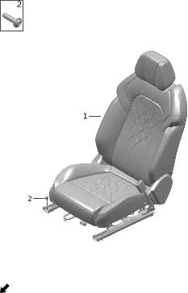

| Поз. | Артикул | Наименование | Кол-во | Применимость | Примечание |
| ---: | --- | --- | ---: | --- | --- |
| 1 | 690002048AG04 | Сиденье переднего пассажира в сборе | 1 | 2022-12-25 - 2024-01-02 | Охристо-красный + серо-бежевый PVC; красный + бежевый |
| 1 | 690002048BLAB | Сиденье переднего пассажира в сборе | 1 | 2022-12-25 - 2024-01-02 | (Коричневый) космический синий + PVC; светло-коричневый + синий |
| 1 | 690002048BLAD | Сиденье переднего пассажира в сборе | 1 | 2022-12-25 - 2024-01-02 | (Черный) космический синий + PVC; черный + синий |
| 1 | 690002092AG04 | Сиденье переднего пассажира в сборе | 1 | с 2024-01-02 | Охристо-красный + серо-бежевый PVC; красный + бежевый |
| 1 | 690002092BLAB | Сиденье переднего пассажира в сборе | 1 | с 2024-01-02 | (Коричневый) космический синий + PVC; светло-коричневый + синий |
| 1 | 690002092BLAD | Сиденье переднего пассажира в сборе | 1 | с 2024-01-02 | (Черный) космический синий + PVC; черный + синий |
| 1 | 690002103UG04 | Сиденье переднего пассажира в сборе | 1 | с 2024-04-17 | Черный + серый |
| 1 | 690002103UK02 | Сиденье переднего пассажира в сборе | 1 | с 2024-04-17 | Черный + зеленый |
| 2 | Q11002033 | Болт | 4 | с 2022-07-10 |  |

## 6054-10 Подушка и спинка сиденья переднего пассажира

- Применимость группы: с 2023-05-09
- Описание: Общая конфигурация: универсально для серии

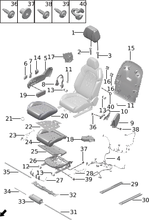

| Поз. | Артикул | Наименование | Кол-во | Применимость | Примечание |
| ---: | --- | --- | ---: | --- | --- |
| 1 | 680801001BKLA | Передний подголовник | 1 | с 2022-07-10 | Черный обсидиан + наппа; черный + синий |
| 1 | 680801001BRLA | Передний подголовник | 1 | с 2022-07-10 | Светло-коричневый + наппа; светло-коричневый + синий |
| 1 | 680801004AR01 | Передний подголовник | 1 | с 2022-07-10 | Охристо-красный; красный + бежевый |
| 1 | 680801016AG10 | Передний подголовник | 1 | с 2024-04-17 | Облачный серый; Voyah FREE318 |
| 1 | 680801016AK01 | Передний подголовник | 1 | с 2024-04-17 | Черный обсидиан; Voyah FREE318 |
| 2 | 680802001BKGC | Гладкая направляющая втулка подголовника | 1 | с 2022-07-10 | Черный обсидиан + мелкий матовый; черный обсидиан |
| 2 | 680802001BRGD | Гладкая направляющая втулка подголовника | 1 | с 2022-07-10 | Светло-коричневый + мелкий матовый; светло-коричневый + синий |
| 2 | 680802002JG10 | Гладкая направляющая втулка подголовника | 1 | с 2024-04-17 | Облачный серый |
| 2 | 680802002JR03 | Гладкая направляющая втулка подголовника | 1 | с 2022-07-10 | Охристо-красный; красный + бежевый |
| 3 | 680803001BKGC | Фиксируемая направляющая втулка подголовника | 1 | с 2022-07-10 | Черный обсидиан + мелкий матовый; черный обсидиан |
| 3 | 680803001BRGD | Фиксируемая направляющая втулка подголовника | 1 | с 2022-07-10 | Светло-коричневый + мелкий матовый; светло-коричневый + синий |
| 3 | 680803002JG10 | Фиксируемая направляющая втулка подголовника | 1 | с 2024-04-17 | Облачный серый |
| 3 | 680803002JR03 | Фиксируемая направляющая втулка подголовника | 1 | с 2022-07-10 | Охристо-красный; красный + бежевый |
| 4 | 681001006 | Жгут проводов сиденья | 1 | с 2022-07-10 |  |
| 5 | 680908002BKAA | Внешняя накладка пассажирского сиденья | 1 | с 2022-07-10 | Черный обсидиан + PVC; черный + синий |
| 5 | 680908002BLAB | Внешняя накладка пассажирского сиденья | 1 | с 2022-07-10 | (Коричневый) космический синий + PVC; светло-коричневый + синий |
| 5 | 680908005JR03 | Внешняя накладка пассажирского сиденья | 1 | с 2024-01-02 | Охристо-красный; красный + бежевый |
| 6 | 680903004CK01 | Кнопка электропривода сиденья | 1 | с 2024-04-17 | Глянцевый черный + гальванический черный хром |
| 6 | 680903004PK01 | Кнопка электропривода сиденья | 1 | с 2022-07-10 | Глянцевый черный |
| 7 | 680902004CK01 | Кнопка регулировки спинки | 1 | с 2024-04-17 | Глянцевый черный + гальванический черный хром |
| 7 | 680902004PK01 | Кнопка регулировки спинки | 1 | с 2022-07-10 | Глянцевый черный |
| 8 | 680911001BKAA | Внешний внутренний кожух пассажирского сиденья | 1 | с 2022-07-10 | Черный обсидиан + PVC; черный + синий |
| 8 | 680911001BLAB | Внешний внутренний кожух пассажирского сиденья | 1 | с 2022-07-10 | (Коричневый) космический синий + PVC; светло-коричневый + синий |
| 8 | 680911002JR03 | Внешний внутренний кожух пассажирского сиденья | 1 | с 2024-01-02 | Охристо-красный; красный + бежевый |
| 9 | 680912001BKAA | Внутренняя накладка пассажирского сиденья | 1 | с 2022-07-10 | Черный обсидиан + PVC; черный + синий |
| 9 | 680912001BLAB | Внутренняя накладка пассажирского сиденья | 1 | с 2022-07-10 | (Коричневый) космический синий + PVC; светло-коричневый + синий |
| 9 | 680912002JR03 | Внутренняя накладка пассажирского сиденья | 1 | с 2024-01-02 | Охристо-красный; красный + бежевый |
| 10 | 680913001BKAA | Внутренний внутренний кожух пассажирского сиденья | 1 | с 2022-07-10 | Черный обсидиан + PVC; черный + синий |
| 10 | 680913001BLAB | Внутренний внутренний кожух пассажирского сиденья | 1 | с 2022-07-10 | (Коричневый) космический синий + PVC; светло-коричневый + синий |
| 10 | 680913002JR03 | Внутренний внутренний кожух пассажирского сиденья | 1 | с 2024-01-02 | Охристо-красный; красный + бежевый |
| 11 | 680907001BKAA | Внешняя внутренняя заглушка кожуха | 2 | с 2022-07-10 | Черный обсидиан + PVC; черный + синий |
| 11 | 680907001BLAB | Внешняя внутренняя заглушка кожуха | 2 | с 2022-07-10 | (Коричневый) космический синий + PVC; светло-коричневый + синий |
| 11 | 680907003JR03 | Внешняя внутренняя заглушка кожуха | 2 | с 2022-07-10 | Охристо-красный; красный + бежевый |
| 12 | 691103001BKGC | Правая передняя крышка салазок пассажирского сиденья | 1 | с 2022-07-10 | Черный обсидиан + мелкий матовый; черный обсидиан |
| 13 | 691102001BKGC | Крышка салазок сиденья | 3 | с 2022-07-10 | Черный обсидиан + мелкий матовый; черный обсидиан |
| 14 | 680909002PK01 | Переключатель поясничной опоры | 1 | с 2022-07-10 | Глянцевый черный |
| 15 | 680501005BKAA | Задняя панель сиденья | 1 | с 2022-07-10 | Черный обсидиан + PVC; черный + синий |
| 15 | 680501008BRAB | Задняя панель сиденья | 1 | с 2022-07-10 | Светло-коричневый + PVC; светло-коричневый + синий |
| 15 | 680501014AG10 | Задняя панель сиденья | 1 | с 2024-04-17 | Облачный серый + черный хром |
| 15 | 680501014AK01 | Задняя панель сиденья | 1 | с 2024-04-17 | Черный обсидиан + черный хром |
| 15 | 680501014AR01 | Задняя панель сиденья | 1 | с 2022-07-10 | Охристо-красный; красный + бежевый |
| 16 | Q41001029 | Защелка | 2 | с 2022-07-10 |  |
| 17 | 680506001 | Вентилятор спинки переднего сиденья | 1 | с 2022-07-10 |  |
| 18 | 680301002 | Вентилятор подушки переднего сиденья | 1 | с 2022-07-10 |  |
| 19 | 360804003 | Переключатель регулировки пассажирского сиденья | 1 | с 2022-07-10 |  |
| 20 | 680306002BLAD | Обивка подушки пассажирского сиденья | 1 | с 2022-07-10 | (Черный) космический синий + PVC; черный + синий |
| 20 | 680306003BLAB | Обивка подушки пассажирского сиденья | 1 | с 2022-07-10 | (Коричневый) космический синий + PVC; светло-коричневый + синий |
| 20 | 680306006AG04 | Обивка подушки пассажирского сиденья | 1 | с 2022-07-10 | Охристо-красный + серо-бежевый PVC; красный + бежевый |
| 20 | 680306018UG04 | Обивка подушки пассажирского сиденья | 1 | с 2024-04-17 | Облачный серый + городской серый |
| 20 | 680306018UK02 | Обивка подушки пассажирского сиденья | 1 | с 2024-04-17 | Черный обсидиан + жизненный зеленый |
| 21 | 700303001 | C-образное кольцо | 16 | с 2022-07-10 |  |
| 22 | 680317001 | Нагревательный мат подушки сиденья | 1 | с 2022-07-10 |  |
| 23 | 680302003 | Монтажная проволока внешней накладки сиденья | 1 | с 2022-07-10 |  |
| 24 | 680323001 | Пенный наполнитель подушки пассажирского сиденья | 1 | с 2022-07-10 |  |
| 25 | 681002002 | Вентиляционный мешок подушки переднего сиденья | 1 | с 2022-07-10 |  |
| 26 | 680320001 | Каркас подушки правого переднего сиденья | 1 | с 2022-07-10 |  |
| 27 | 680315001 | Нижняя проволока подушки сиденья | 1 | с 2022-07-10 |  |
| 28 | 680324001 | Датчик SBR | 1 | с 2022-07-10 |  |
| 29 | 690117001 | Правая салазка в сборе | 1 | с 2022-12-25 |  |
| 30 | 690116001 | Левая салазка в сборе | 1 | с 2022-12-25 |  |
| 31 | 690114001 | Длинный гибкий вал | 1 | с 2022-12-25 |  |
| 32 | 690112001 | Кронштейн горизонтального мотора салазок | 1 | с 2022-12-25 |  |
| 33 | 690111002 | Горизонтальный мотор салазок | 1 | с 2022-12-25 |  |
| 34 | 690113001 | Короткий гибкий вал | 1 | с 2022-12-25 |  |
| 35 | 690115001 | Оболочка гибкого вала | 1 | с 2022-12-25 |  |
| 36 | Q12003028 | Винт | 12 | с 2022-07-10 |  |
| 37 | 690118001 | Болт крепления тяги салазок | 4 | с 2022-12-25 |  |
| 38 | Q12003029 | Винт | 1 | с 2022-07-10 |  |
| 39 | Q12003030 | Винт | 4 | с 2022-07-10 |  |
| 40 | Q41001042 | Защелка | 2 | с 2022-07-10 |  |

## 6055-10 Сиденья второго ряда

- Применимость группы: с 2023-05-09
- Описание: Подогрев сидений второго ряда: отсутствует

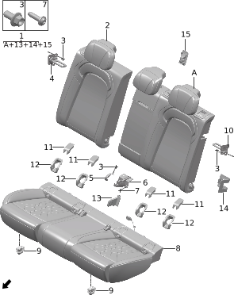

| Поз. | Артикул | Наименование | Кол-во | Применимость | Примечание |
| ---: | --- | --- | ---: | --- | --- |
| 1 | 700001020AG04 | Левая спинка заднего сиденья | 1 | 2023-02-05 - 2023-11-14 | Охристо-красный + серо-бежевый PVC; красный + бежевый |
| 1 | 700001020BLAB | Левая спинка заднего сиденья | 1 | 2023-02-05 - 2023-11-14 | (Коричневый) космический синий + PVC; светло-коричневый + синий |
| 1 | 700001020BLAD | Левая спинка заднего сиденья | 1 | 2023-02-05 - 2023-11-14 | (Черный) космический синий + PVC; черный + синий |
| 1 | 700001033AG04 | Левая спинка заднего сиденья | 1 | с 2023-11-14 | Охристо-красный + серо-бежевый PVC; красный + бежевый |
| 1 | 700001033BLAB | Левая спинка заднего сиденья | 1 | с 2023-11-14 | (Коричневый) космический синий + PVC; светло-коричневый + синий |
| 1 | 700001033BLAD | Левая спинка заднего сиденья | 1 | с 2023-11-14 | (Черный) космический синий + PVC; черный + синий |
| 1 | 700001042UG04 | Левая спинка заднего сиденья | 1 | с 2024-04-17 | Черный + серый |
| 1 | 700001042UK02 | Левая спинка заднего сиденья | 1 | с 2024-04-17 | Черный + зеленый |
| 2 | 700502009BLAB | Правая спинка заднего сиденья | 1 | с 2023-02-05 | (Коричневый) космический синий + PVC; светло-коричневый + синий |
| 2 | 700502009BLAD | Правая спинка заднего сиденья | 1 | с 2023-02-05 | (Черный) космический синий + PVC; черный + синий |
| 2 | 700502013AG04 | Правая спинка заднего сиденья | 1 | с 2023-02-05 | Охристо-красный + серо-бежевый PVC; красный + бежевый |
| 2 | 700502030UG04 | Правая спинка заднего сиденья | 1 | с 2024-04-17 | Черный + серый |
| 2 | 700502031UK02 | Правая спинка заднего сиденья | 1 | с 2024-04-17 | Черный + зеленый |
| 3 | Q11001015 | Фланцевый болт | 7 | с 2022-07-10 |  |
| 4 | 701002001 | Правый фиксатор спинки заднего сиденья | 1 | с 2022-07-10 |  |
| 5 | 701004001 | Крышка центрального кронштейна | 1 | с 2022-07-10 |  |
| 6 | 701003001 | Центральный кронштейн спинки заднего сиденья | 1 | с 2022-07-10 |  |
| 7 | Q11002033 | Болт | 4 | с 2022-07-10 |  |
| 8 | 700301017AG04 | Подушка заднего сиденья | 1 | с 2023-02-05 | Охристо-красный + серо-бежевый PVC; красный + бежевый |
| 8 | 700301017BLAB | Подушка заднего сиденья | 1 | с 2023-02-05 | (Коричневый) космический синий + PVC; светло-коричневый + синий |
| 8 | 700301017BLAD | Подушка заднего сиденья | 1 | с 2023-02-05 | (Черный) космический синий + PVC; черный + синий |
| 8 | 700301040UG04 | Подушка заднего сиденья | 1 | с 2024-04-17 | Черный + серый |
| 8 | 700301041UK02 | Подушка заднего сиденья | 1 | с 2024-04-17 | Черный + зеленый |
| 9 | Q41005001 | Клипса подушки сиденья | 2 | с 2022-07-10 |  |
| 10 | 701001001 | Левый фиксатор спинки заднего сиденья | 1 | с 2022-07-10 |  |
| 11 | 701011001BKGC | Крышка ISOFIX | 1 | с 2022-07-10 | Черный обсидиан + мелкий матовый; черный обсидиан |
| 11 | 701011002BRGD | Крышка ISOFIX | 1 | с 2022-07-10 | Светло-коричневый + мелкий матовый; светло-коричневый + синий |
| 11 | 701011004JR03 | Крышка ISOFIX | 1 | с 2022-07-10 | Охристо-красный; красный + бежевый |
| 11 | 701011008JG10 | Крышка ISOFIX | 1 | с 2024-04-17 | Облачный серый |
| 12 | 701012001BKGC | Основание крышки ISOFIX | 1 | с 2022-07-10 | Черный обсидиан + мелкий матовый; черный обсидиан |
| 12 | 701012002BRGD | Основание крышки ISOFIX | 1 | с 2022-07-10 | Светло-коричневый + мелкий матовый; светло-коричневый + синий |
| 12 | 701012004JR03 | Основание крышки ISOFIX | 1 | с 2022-07-10 | Охристо-красный; красный + бежевый |
| 12 | 701012005JG10 | Основание крышки ISOFIX | 1 | с 2024-04-17 | Облачный серый |
| 13 | 700805001BKGC | Крышка кронштейна подлокотника | 1 | с 2023-02-05 | Черный обсидиан + мелкий матовый; черный обсидиан |
| 13 | 700805001BRGD | Крышка кронштейна подлокотника | 1 | с 2023-02-05 | Светло-коричневый + мелкий матовый; светло-коричневый + синий |
| 13 | 700805001JG10 | Крышка кронштейна подлокотника | 1 | с 2024-04-17 | Облачный серый |
| 13 | 700805001JR03 | Крышка кронштейна подлокотника | 1 | с 2023-02-05 | Охристо-красный; красный + бежевый |
| 14 | 700806001 | Крышка замка спинки | 1 | с 2022-07-10 |  |
| 15 | 552102007 | Крышка детского сиденья | 1 | с 2022-07-10 |  |

## 6056-10 Подушка и спинка сидений второго ряда

- Применимость группы: с 2023-05-10
- Описание: Подогрев сидений второго ряда: отсутствует

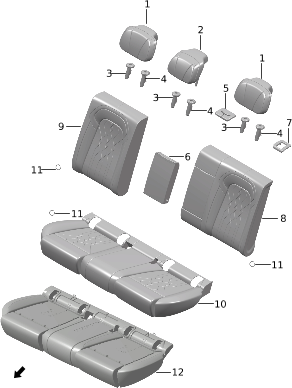

| Поз. | Артикул | Наименование | Кол-во | Применимость | Примечание |
| ---: | --- | --- | ---: | --- | --- |
| 1 | 700803004AR01 | Боковой подголовник заднего ряда | 2 | с 2022-07-10 | Охристо-красный; красный + бежевый |
| 1 | 700803005BKLA | Боковой подголовник заднего ряда | 2 | с 2022-07-10 | Черный обсидиан + наппа; черный + синий |
| 1 | 700803007BRLA | Боковой подголовник заднего ряда | 2 | с 2022-07-10 | Светло-коричневый + наппа; светло-коричневый + синий |
| 1 | 700803019AG10 | Боковой подголовник заднего ряда | 2 | с 2024-04-17 | Микрофибра + PVC (облачный серый) |
| 1 | 700803019AK01 | Боковой подголовник заднего ряда | 2 | с 2024-04-17 | Микрофибра + PVC (черный обсидиан + жизненный зеленый) |
| 2 | 700804001BKLA | Центральный подголовник заднего ряда | 1 | с 2022-07-10 | Черный обсидиан + наппа; черный + синий |
| 2 | 700804001BRLA | Центральный подголовник заднего ряда | 1 | с 2022-07-10 | Светло-коричневый + наппа; светло-коричневый + синий |
| 2 | 700804004AR01 | Центральный подголовник заднего ряда | 1 | с 2022-07-10 | Охристо-красный; красный + бежевый |
| 2 | 700804012AG10 | Центральный подголовник заднего ряда | 1 | с 2024-04-17 | Микрофибра + PVC (облачный серый) |
| 2 | 700804013AK01 | Центральный подголовник заднего ряда | 1 | с 2024-04-17 | Микрофибра + PVC (черный обсидиан + жизненный зеленый) |
| 3 | 700801001BKGC | Гладкая направляющая втулка подголовника | 3 | с 2022-07-10 | Черный обсидиан + мелкий матовый; черный обсидиан |
| 3 | 700801001BRGD | Гладкая направляющая втулка подголовника | 3 | с 2022-07-10 | Светло-коричневый + мелкий матовый; светло-коричневый + синий |
| 3 | 700801006JR03 | Гладкая направляющая втулка подголовника | 3 | с 2022-07-10 | Охристо-красный; красный + бежевый |
| 3 | 700801007JG10 | Гладкая направляющая втулка подголовника | 3 | с 2024-04-17 | Облачный серый, без ключа |
| 4 | 700802001BKGC | Фиксируемая направляющая втулка подголовника | 3 | с 2022-07-10 | Черный обсидиан + мелкий матовый; черный обсидиан |
| 4 | 700802001BRGD | Фиксируемая направляющая втулка подголовника | 3 | с 2022-07-10 | Светло-коричневый + мелкий матовый; светло-коричневый + синий |
| 4 | 700802006JR03 | Фиксируемая направляющая втулка подголовника | 3 | с 2022-07-10 | Охристо-красный; красный + бежевый |
| 4 | 700802007JG10 | Фиксируемая направляющая втулка подголовника | 3 | с 2024-04-17 | Облачный серый, с ключом |
| 5 | 701005001BKGC | Крышка ремня безопасности | 1 | с 2022-07-10 | Черный обсидиан + мелкий матовый; черный обсидиан |
| 5 | 701005001BRGD | Крышка ремня безопасности | 1 | с 2022-07-10 | Светло-коричневый + мелкий матовый; светло-коричневый + синий |
| 5 | 701005002JG10 | Крышка ремня безопасности | 1 | с 2024-04-17 | Облачный серый |
| 5 | 701005002JR03 | Крышка ремня безопасности | 1 | с 2022-07-10 | Охристо-красный; красный + бежевый |
| 6 | 700601001BKAB | Подлокотник в сборе | 1 | с 2022-07-10 | Черный обсидиан + микрофибра; черный обсидиан |
| 6 | 700601001BLAC | Подлокотник в сборе | 1 | с 2022-07-10 | Сине-коричневый + микрофибра; сине-коричневый |
| 6 | 700601002AG10 | Подлокотник в сборе | 1 | с 2024-04-17 | Облачный серый, без логотипа |
| 6 | 700601002AK01 | Подлокотник в сборе | 1 | с 2024-04-17 | Черный обсидиан + жизненный зеленый, без логотипа |
| 6 | 700601002AR01 | Подлокотник в сборе | 1 | с 2022-07-10 | Охристо-красный |
| 7 | 701101001BKGC | Крышка разблокировки спинки | 1 | с 2022-07-10 | Черный обсидиан + мелкий матовый; черный обсидиан |
| 7 | 701101001BRGD | Крышка разблокировки спинки | 1 | с 2022-07-10 | Светло-коричневый + мелкий матовый; светло-коричневый + синий |
| 7 | 701101004JR03 | Крышка разблокировки спинки | 1 | с 2022-07-10 | Охристо-красный; красный + бежевый |
| 7 | 701101006JG10 | Крышка разблокировки спинки | 1 | с 2024-04-17 | Облачный серый |
| 8 | 700501002BLAD | Обивка левой спинки заднего сиденья | 1 | с 2023-02-05 | (Черный) космический синий + PVC; черный + синий |
| 8 | 700501003BLAB | Обивка левой спинки заднего сиденья | 1 | с 2023-02-05 | (Коричневый) космический синий + PVC; светло-коричневый + синий |
| 8 | 700501005AG04 | Обивка левой спинки заднего сиденья | 1 | с 2023-02-05 | Охристо-красный + серо-бежевый |
| 8 | 700501008UG04 | Обивка левой спинки заднего сиденья | 1 | с 2024-04-17 | Искусственная замша + PVC (облачный серый) |
| 8 | 700501008UK02 | Обивка левой спинки заднего сиденья | 1 | с 2024-04-17 | Искусственная замша + PVC (черный обсидиан + жизненный зеленый) |
| 9 | 700504002BLAD | Обивка правой спинки заднего сиденья | 1 | с 2023-02-05 | (Черный) космический синий + PVC; черный + синий |
| 9 | 700504003BLAB | Обивка правой спинки заднего сиденья | 1 | с 2023-02-05 | (Коричневый) космический синий + PVC; светло-коричневый + синий |
| 9 | 700504005AG04 | Обивка правой спинки заднего сиденья | 1 | с 2023-02-05 | Охристо-красный + серо-бежевый |
| 9 | 700504008UG04 | Обивка правой спинки заднего сиденья | 1 | с 2024-04-17 | Искусственная замша + PVC (облачный серый) |
| 9 | 700504008UK02 | Обивка правой спинки заднего сиденья | 1 | с 2024-04-17 | Искусственная замша + PVC (черный обсидиан + жизненный зеленый) |
| 10 | 700302002BLAD | Обивка подушки заднего сиденья | 1 | с 2023-02-05 | (Черный) космический синий + PVC; черный + синий |
| 10 | 700302004BLAB | Обивка подушки заднего сиденья | 1 | с 2023-02-05 | (Коричневый) космический синий + PVC; светло-коричневый + синий |
| 10 | 700302006AG04 | Обивка подушки заднего сиденья | 1 | с 2023-02-05 | Охристо-красный + серо-бежевый |
| 10 | 700302010UG04 | Обивка подушки заднего сиденья | 1 | с 2024-04-17 | Искусственная замша + PVC (облачный серый) |
| 10 | 700302011UK02 | Обивка подушки заднего сиденья | 1 | с 2024-04-17 | Искусственная замша + PVC (черный обсидиан + жизненный зеленый) |
| 11 | 700303001 | C-образное кольцо | 8 | с 2022-07-10 |  |
| 12 | 700304003 | Пенный наполнитель подушки заднего сиденья в сборе | 1 | с 2022-07-10 |  |

