- [2010-10 Топливный бак](#2010-10-топливный-бак)
- [2011-10 Топливопроводы](#2011-10-топливопроводы)
- [2012-10 Система улавливания паров топлива](#2012-10-система-улавливания-паров-топлива)
- [2013-10 Система высокого давления топлива](#2013-10-система-высокого-давления-топлива)
- [2014-10 Воздушный фильтр](#2014-10-воздушный-фильтр)
- [2015-10 Свечи и катушки зажигания](#2015-10-свечи-и-катушки-зажигания)
- [2017-10 Генератор](#2017-10-генератор)
- [2018-10 Трубопроводы клапана рециркуляции ОГ](#2018-10-трубопроводы-клапана-рециркуляции-ог)
- [2019-10 Электронные компоненты двигателя](#2019-10-электронные-компоненты-двигателя)
- [2020-10 Горячая часть выхлопа](#2020-10-горячая-часть-выхлопа)
- [2022-10 Турбонагнетатель](#2022-10-турбонагнетатель)
- [2023-10 Трубопроводы впуска и выпуска](#2023-10-трубопроводы-впуска-и-выпуска)
- [2024-10 Впускной тракт](#2024-10-впускной-тракт)
- [2025-10 Глушитель](#2025-10-глушитель)
- [2027-10 Радиатор](#2027-10-радиатор)
- [2029-10 Передние трубопроводы охлаждения](#2029-10-передние-трубопроводы-охлаждения)
- [2029-11 Передние трубопроводы охлаждения](#2029-11-передние-трубопроводы-охлаждения)
- [2030-10 Задние трубопроводы охлаждения](#2030-10-задние-трубопроводы-охлаждения)
- [2031-10 Вентилятор охлаждения](#2031-10-вентилятор-охлаждения)
- [2032-10 Водяной насос](#2032-10-водяной-насос)

# 2010-10 Топливный бак

- Применимость группы: с 2023-04-26
- Описание: Тип силовой установки: последовательный гибрид

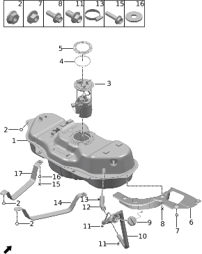

| Поз. | Артикул | Наименование | Кол-во | Применимость | Примечание |
| ---: | --- | --- | ---: | --- | --- |
| 1 | 110100003 | Топливный бак | 1 | с 2022-07-10 |  |
| 2 | Q21001006 | Фланцевая гайка | 3 | с 2022-07-10 |  |
| 3 | 110603002 | Топливный насос с датчиком в сборе | 1 | с 2022-07-10 |  |
| 4 | 110601001 | Уплотнительное кольцо топливного насоса | 1 | с 2022-07-10 |  |
| 5 | 110602001 | Прижимная пластина топливного насоса | 1 | с 2022-07-10 |  |
| 6 | 110300001 | Теплозащитный экран бака | 1 | 2022-07-10 - 2023-09-06 |  |
| 6 | 110300002 | Теплозащитный экран бака | 1 | с 2023-08-01 |  |
| 7 | Q21008004 | Шестигранная гайка | 2 | с 2022-07-10 |  |
| 8 | Q11001005 | Фланцевый болт | 2 | с 2022-07-10 |  |
| 9 | 110167051 | Крышка топливного бака | 1 | с 2022-07-10 |  |
| 10 | 110407001 | Заливная топливная труба | 1 | с 2022-07-10 |  |
| 11 | Q11001016 | Фланцевый болт | 3 | с 2022-07-10 |  |
| 12 | 110404002 | Шланг заливной топливной трубы | 1 | с 2022-07-10 |  |
| 13 | Q31002002 | Хомут | 2 | с 2022-07-10 |  |
| 14 | 110101001 | Крепежная лента топливного бака | 1 | с 2022-07-10 |  |
| 15 | Q11001072 | Фланцевый болт | 2 | с 2022-07-10 |  |
| 16 | Q22001004 | Шайба | 2 | с 2022-07-10 |  |
| 17 | 110101002 | Крепежная лента топливного бака | 1 | с 2022-07-10 |  |

# 2011-10 Топливопроводы

- Применимость группы: с 2023-04-26
- Описание: Тип силовой установки: последовательный гибрид

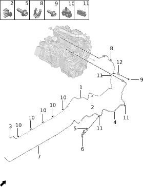

| Поз. | Артикул | Наименование | Кол-во | Применимость | Примечание |
| ---: | --- | --- | ---: | --- | --- |
| 1 | 110400004 | Подающая топливная трубка | 1 | 2022-07-10 - 2024-11-30 |  |
| 1 | 110400005 | Подающая топливная трубка | 1 | с 2024-11-30 |  |
| 2 | 110403002 | Зажим топливной трубки | 1 | с 2022-07-10 |  |
| 3 | 110400001 | Подающая топливная трубка | 1 | с 2022-07-10 |  |
| 4 | 110401009 | Трубка продувки адсорбера | 1 | с 2022-07-10 |  |
| 5 | Q11001004 | Фланцевый болт | 1 | с 2022-07-10 |  |
| 6 | 110409001 | Кронштейн топливопровода | 1 | с 2022-07-10 |  |
| 7 | 110401001 | Трубка продувки адсорбера | 1 | с 2022-07-10 |  |
| 8 | 110423001 | Одинарный зажим топливной трубки | 1 | с 2022-07-10 |  |
| 9 | Q11001001 | Фланцевый болт | 1 | с 2022-07-10 |  |
| 10 | 110422000 | Двойной зажим трубки | 5 | с 2022-07-10 |  |
| 11 | 110422003 | Двойной зажим трубки | 3 | с 2022-07-10 |  |
| 12 | 110409002 | Кронштейн топливопровода | 1 | с 2022-07-10 |  |

# 2012-10 Система улавливания паров топлива

- Применимость группы: с 2023-04-26
- Описание: Тип силовой установки: последовательный гибрид

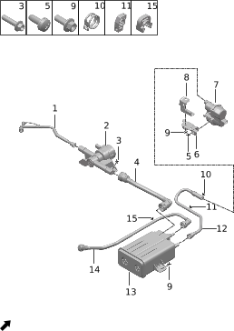

| Поз. | Артикул | Наименование | Кол-во | Применимость | Примечание |
| ---: | --- | --- | ---: | --- | --- |
| 1 | 110418058 | Трубка паров топлива | 1 | с 2023-06-19 |  |
| 2 | 111600001 | Изолирующий клапан бака | 1 | с 2022-07-10 |  |
| 3 | Q11001011 | Фланцевый болт | 2 | с 2022-07-10 |  |
| 4 | 110107002 | Направляющая изолирующего клапана бака | 1 | с 2023-06-17 |  |
| 5 | Q12002001 | Самонарезающий винт | 3 | с 2022-07-10 |  |
| 6 | 110108002 | Кронштейн модуля диагностики утечки бака | 1 | с 2022-07-10 |  |
| 7 | 110103003 | Модуль диагностики утечки бака | 1 | 2023-10-13 - 2024-08-23 |  |
| 7 | 110103004 | Модуль диагностики утечки бака | 1 | с 2024-08-23 |  |
| 8 | 110108003 | Кронштейн модуля диагностики утечки бака | 1 | с 2022-07-10 |  |
| 9 | Q11001005 | Фланцевый болт | 7 | с 2022-07-10 |  |
| 10 | Q31001005 | Зажим трубки | 1 | с 2022-07-10 |  |
| 11 | 110423004 | Одинарный зажим топливной трубки | 1 | с 2022-07-10 |  |
| 12 | 110410001 | Воздуховод чистого воздуха | 1 | с 2022-07-10 |  |
| 13 | 110106001 | Адсорбер | 1 | с 2022-07-10 |  |
| 14 | 110401008 | Трубка продувки адсорбера | 1 | с 2023-06-14 |  |
| 15 | 110423002 | Одинарный зажим топливной трубки | 1 | с 2022-07-10 |  |

# 2013-10 Система высокого давления топлива

- Применимость группы: с 2023-04-14
- Описание: Тип силовой установки: последовательный гибрид

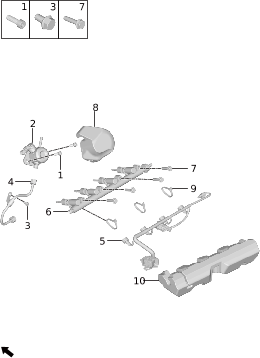

| Поз. | Артикул | Наименование | Кол-во | Применимость | Примечание |
| ---: | --- | --- | ---: | --- | --- |
| 1 | Q11002142 | Болт | 2 | с 2022-07-10 |  |
| 2 | 110608002 | Топливный насос высокого давления | 1 | с 2022-07-10 |  |
| 3 | Q11002143 | Болт | 1 | с 2022-07-10 |  |
| 4 | 110604002 | Топливная трубка высокого давления | 1 | с 2022-07-10 |  |
| 5 | 102533001 | Переходная линия топливной рампы | 1 | с 2022-07-10 |  |
| 6 | 110606002 | Узел системы впрыска | 1 | с 2022-07-10 |  |
| 7 | Q11002144 | Болт | 4 | с 2022-07-10 |  |
| 8 | 110607002 | Шумоизоляционный кожух ТНВД | 1 | с 2022-07-10 |  |
| 9 | 350612010 | Стяжка | 3 | с 2022-07-10 |  |
| 10 | 110605002 | Шумоизоляционный кожух топливной рампы | 1 | с 2022-07-10 |  |

# 2014-10 Воздушный фильтр

- Применимость группы: с 2023-04-26
- Описание: Тип силовой установки: последовательный гибрид

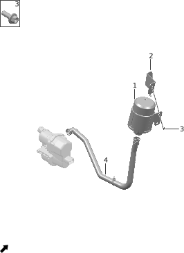

| Поз. | Артикул | Наименование | Кол-во | Применимость | Примечание |
| ---: | --- | --- | ---: | --- | --- |
| 1 | 110102001 | Воздушный фильтр | 1 | с 2022-07-10 |  |
| 2 | 110500001 | Кронштейн воздушного фильтра | 1 | с 2022-07-10 |  |
| 3 | Q11001005 | Фланцевый болт | 7 | с 2022-07-10 |  |
| 4 | 110406002 | Воздуховод воздушного фильтра | 1 | с 2022-07-10 |  |

# 2015-10 Свечи и катушки зажигания

- Применимость группы: с 2023-04-14
- Описание: Тип силовой установки: последовательный гибрид

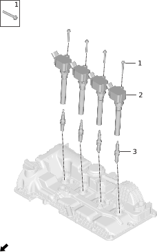

| Поз. | Артикул | Наименование | Кол-во | Применимость | Примечание |
| ---: | --- | --- | ---: | --- | --- |
| 1 | Q11002132 | Болт | 4 | с 2022-07-10 |  |
| 2 | 370501003 | Катушка зажигания | 4 | с 2022-07-10 |  |
| 3 | 370701003 | Свеча зажигания | 4 | с 2022-07-10 |  |

# 2017-10 Генератор

- Применимость группы: с 2023-04-26
- Описание: VVT: изменяемый выпуск

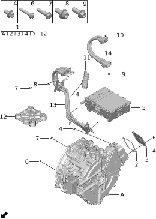

| Поз. | Артикул | Наименование | Кол-во | Применимость | Примечание |
| ---: | --- | --- | ---: | --- | --- |
| 1 | 101506003 | Генератор | 1 | с 2022-07-10 |  |
| 2 | 101520001 | Уплотнительное кольцо генератора | 1 | с 2022-07-10 |  |
| 3 | 101519001 | Крышка генератора | 1 | с 2022-07-10 |  |
| 4 | Q11001198 | Фланцевый болт | 14 | с 2022-07-10 |  |
| 5 | 361301007 | Контроллер генератора | 1 | с 2022-07-10 |  |
| 6 | Q11001119 | Фланцевый болт | 1 | с 2022-07-10 |  |
| 7 | Q11001117 | Фланцевый болт | 12 | с 2022-07-10 |  |
| 8 | Q11001002 | Фланцевый болт | 2 | с 2022-07-10 |  |
| 9 | Q11001020 | Фланцевый болт | 4 | с 2022-07-10 |  |
| 10 | 350612002 | Стяжка | 1 | с 2022-07-10 |  |
| 11 | 361303001 | Кожух трёхфазного провода | 1 | с 2024-05-30 |  |
| 12 | 101521001 | Переходная пластина опоры | 1 | с 2022-07-10 |  |
| 13 | 932522001 | Трёхфазный высоковольтный жгут генератора | 1 | с 2022-07-10 |  |
| 14 | 932521001 | Высоковольтный жгут контроллера генератора | 1 | с 2022-07-10 |  |

# 2018-10 Трубопроводы клапана рециркуляции ОГ

- Применимость группы: с 2023-04-18
- Описание: Тип силовой установки: последовательный гибрид

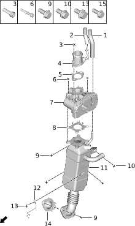

| Поз. | Артикул | Наименование | Кол-во | Применимость | Примечание |
| ---: | --- | --- | ---: | --- | --- |
| 1 | 102537001 | Передний шланг датчика перепада давления EGR | 1 | с 2022-07-10 |  |
| 2 | 102536001 | Задний шланг датчика перепада давления EGR | 1 | с 2022-07-10 |  |
| 3 | Q11002146 | Болт | 2 | с 2022-07-10 |  |
| 4 | 102538001 | Переходник клапана EGR | 1 | с 2022-07-10 |  |
| 5 | 120605002 | Прокладка клапана EGR | 1 | с 2022-07-10 |  |
| 6 | Q11002147 | Болт | 4 | с 2022-07-10 |  |
| 7 | 120603002 | Клапан EGR | 1 | с 2022-07-10 |  |
| 8 | 120605003 | Прокладка клапана EGR | 1 | с 2022-07-10 |  |
| 9 | Q11002130 | Болт | 4 | с 2022-07-10 |  |
| 10 | Q11002112 | Болт | 2 | с 2022-07-10 |  |
| 11 | 120601002 | Охладитель EGR | 1 | с 2022-07-10 |  |
| 12 | 102539001 | Кронштейн датчика | 1 | с 2022-07-10 |  |
| 13 | Q11002143 | Болт | 1 | с 2022-07-10 |  |
| 14 | 102540001 | Сетка и прокладка | 1 | с 2022-07-10 |  |

# 2019-10 Электронные компоненты двигателя

- Применимость группы: с 2023-04-14
- Описание: Тип силовой установки: последовательный гибрид

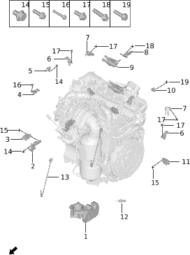

| Поз. | Артикул | Наименование | Кол-во | Применимость | Примечание |
| ---: | --- | --- | ---: | --- | --- |
| 1 | 361107002 | Электронный дроссельный узел | 1 | с 2022-07-10 |  |
| 2 | 102516001 | Кронштейн датчика перепада давления GPF | 1 | с 2022-07-10 |  |
| 3 | 111817002 | Датчик перепада давления | 1 | с 2022-07-10 |  |
| 4 | 810704002 | Датчик давления | 1 | с 2022-07-10 |  |
| 5 | 361106002 | Датчик положения коленвала | 1 | с 2022-07-10 |  |
| 6 | 375201002 | Датчик положения распредвала | 2 | с 2022-07-10 |  |
| 7 | 361102003 | Датчик давления и температуры впуска | 2 | с 2022-07-10 |  |
| 8 | 102512001 | Фиксатор клапана адсорбера | 1 | с 2022-07-10 |  |
| 9 | 113001002 | Клапан адсорбера | 1 | с 2023-10-24 |  |
| 9 | 113001005 | Клапан адсорбера | 1 | с 2022-07-10 |  |
| 10 | 361105003 | Датчик детонации | 1 | с 2022-07-10 |  |
| 11 | 102535001 | Датчик перепада давления EGR | 1 | с 2022-07-10 |  |
| 12 | 361109005 | Датчик температуры выхлопа | 1 | с 2022-07-10 |  |
| 13 | 361109004 | Датчик температуры выхлопа | 1 | с 2022-07-10 |  |
| 14 | Q11002134 | Болт | 2 | с 2022-07-10 |  |
| 15 | Q11002133 | Болт | 2 | с 2022-07-10 |  |
| 16 | Q11002132 | Болт | 1 | с 2022-07-10 |  |
| 17 | Q11002111 | Болт | 5 | с 2022-07-10 |  |
| 18 | Q11002127 | Болт | 1 | с 2022-07-10 |  |
| 19 | Q11002113 | Болт | 1 | с 2022-07-10 |  |

# 2020-10 Горячая часть выхлопа

- Применимость группы: с 2023-04-18
- Описание: Тип силовой установки: последовательный гибрид

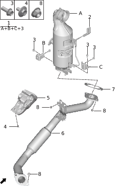

| Поз. | Артикул | Наименование | Кол-во | Применимость | Примечание |
| ---: | --- | --- | ---: | --- | --- |
| 1 | 120500002 | Каталитический нейтрализатор в сборе | 1 | с 2022-07-10 |  |
| 2 | 102517001 | Шланг контроля перепада давления GPF | 2 | с 2022-07-10 |  |
| 3 | Q11002112 | Болт | 4 | с 2022-07-10 |  |
| 4 | Q11001069 | Фланцевый болт | 4 | с 2022-07-10 |  |
| 5 | 910201001 | Теплозащитный экран переднего электродвигателя | 1 | с 2022-07-10 |  |
| 6 | 120301004 | Передняя выхлопная труба | 1 | с 2022-07-10 | Полный привод |
| 6 | 120301006 | Передняя выхлопная труба | 1 | с 2024-05-16 | Задний привод |
| 7 | 120513003 | Прокладка каталитического нейтрализатора | 1 | с 2022-07-10 |  |
| 8 | Q21002005 | Стопорная гайка | 6 | с 2022-07-10 |  |

# 2022-10 Турбонагнетатель

- Применимость группы: с 2023-04-18
- Описание: Тип силовой установки: последовательный гибрид

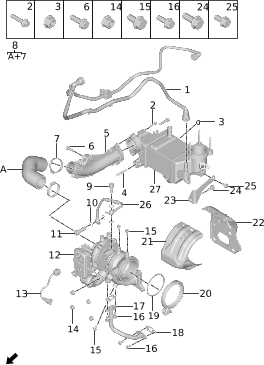

| Поз. | Артикул | Наименование | Кол-во | Применимость | Примечание |
| ---: | --- | --- | ---: | --- | --- |
| 1 | 110402002 | Трубка высокого давления продувки | 1 | с 2022-07-10 |  |
| 2 | Q11002129 | Болт | 2 | с 2022-07-10 |  |
| 3 | 610509008 | Гайка | 1 | с 2022-07-10 |  |
| 4 | Q13002004 | Шпилька | 1 | с 2022-07-10 |  |
| 5 | 102514001 | Выходной патрубок турбонагнетателя | 1 | с 2022-07-10 |  |
| 6 | Q11002131 | Болт | 1 | с 2022-07-10 |  |
| 7 | Q31002014 | Хомут | 2 | с 2022-07-10 |  |
| 8 | 102515001 | Соединительный шланг | 1 | с 2022-07-10 |  |
| 9 | 101505008 | Болт | 1 | с 2022-07-10 |  |
| 10 | Q22001015 | Шайба | 4 | с 2022-07-10 |  |
| 11 | 101505009 | Болт | 1 | с 2022-07-10 |  |
| 12 | 111803003 | Турбонагнетатель | 1 | с 2022-07-10 |  |
| 13 | 102534001 | Переходная линия перепускного клапана | 1 | с 2022-07-10 |  |
| 14 | 610509009 | Гайка | 4 | с 2022-07-10 |  |
| 15 | Q11002143 | Болт | 3 | с 2022-07-10 |  |
| 16 | Q11002145 | Болт | 4 | с 2022-07-10 |  |
| 17 | 100906003 | Трубка слива масла турбонагнетателя | 1 | с 2022-07-10 |  |
| 18 | 100908009 | Прокладка | 2 | с 2022-07-10 |  |
| 19 | 100309016 | Уплотнительное кольцо | 1 | с 2022-07-10 |  |
| 20 | Q31005003 | Хомут | 1 | с 2022-07-10 |  |
| 21 | 111801005 | Теплозащитный кожух турбонагнетателя | 1 | с 2022-07-10 |  |
| 22 | 111801004 | Теплозащитный кожух турбонагнетателя | 1 | с 2022-07-10 |  |
| 23 | 111903007 | Кронштейн интеркулера | 1 | с 2022-07-10 |  |
| 24 | Q11002130 | Болт | 1 | с 2022-07-10 |  |
| 25 | Q11002112 | Болт | 1 | с 2022-07-10 |  |
| 26 | 100905003 | Трубка подачи масла турбонагнетателя | 1 | с 2022-07-10 |  |
| 27 | 102513001 | Жидкостный интеркулер | 1 | с 2022-07-10 |  |

# 2023-10 Трубопроводы впуска и выпуска

- Применимость группы: с 2023-04-18
- Описание: Тип силовой установки: последовательный гибрид

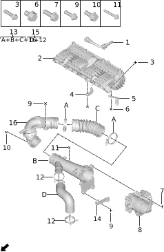

| Поз. | Артикул | Наименование | Кол-во | Применимость | Примечание |
| ---: | --- | --- | ---: | --- | --- |
| 1 | 102511001 | Низконапорная трубка отвода паров масла | 1 | с 2022-07-10 |  |
| 2 | 100802003 | Впускная труба | 1 | с 2022-07-10 |  |
| 3 | Q11002127 | Болт | 4 | с 2022-07-10 |  |
| 4 | 370012004 | Кронштейн жгута проводов | 1 | с 2022-07-10 |  |
| 5 | 370012003 | Кронштейн жгута проводов | 1 | с 2022-07-10 |  |
| 6 | Q11002128 | Болт | 2 | с 2022-07-10 |  |
| 7 | Q11002132 | Болт | 4 | с 2022-07-10 |  |
| 8 | 361107003 | Электронный дроссельный узел | 1 | с 2022-07-10 |  |
| 9 | Q11002131 | Болт | 3 | с 2022-07-10 |  |
| 10 | Q11002133 | Болт | 2 | с 2022-07-10 |  |
| 11 | Q11002130 | Болт | 1 | с 2022-07-10 |  |
| 12 | Q31005004 | Хомут | 2 | с 2022-07-10 |  |
| 13 | 102541001 | Впускная труба турбонагнетателя | 1 | с 2022-07-10 |  |
| 14 | 370012005 | Кронштейн жгута проводов | 1 | с 2022-07-10 |  |
| 15 | 102542001 | Соединительный шланг клапана EGR | 1 | с 2022-07-10 |  |
| 16 | 102544001 | Выходной патрубок | 1 | с 2022-07-10 |  |

# 2024-10 Впускной тракт

- Применимость группы: с 2023-04-26
- Описание: Модель: TZ220XSP01 && тип силовой установки:

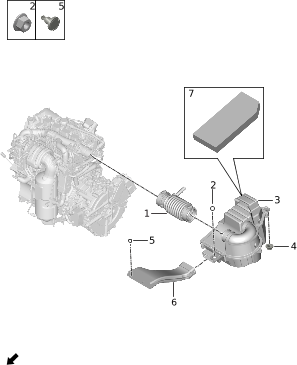

| Поз. | Артикул | Наименование | Кол-во | Применимость | Примечание |
| ---: | --- | --- | ---: | --- | --- |
| 1 | 110919001 | Выходная труба воздушного фильтра | 1 | с 2022-07-10 |  |
| 2 | Q21001003 | Фланцевая гайка | 1 | с 2022-07-10 |  |
| 3 | 110910002 | Воздушный фильтр в сборе | 1 | с 2022-07-10 |  |
| 4 | 110913000 | Резиновая опора воздушного фильтра | 2 | с 2022-07-10 |  |
| 5 | Q41001028 | Клипса | 2 | с 2022-10-01 |  |
| 6 | 110915001 | Впускная труба воздушного фильтра | 1 | с 2022-07-10 |  |
| 7 | 110901002 | Фильтрующий элемент воздушного фильтра | 1 | с 2022-07-10 |  |

# 2025-10 Глушитель

- Применимость группы: с 2023-05-06
- Описание: Тип силовой установки: последовательный гибрид

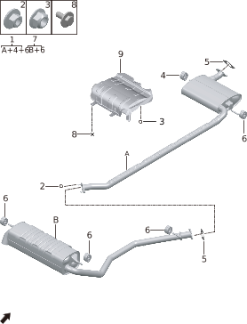

| Поз. | Артикул | Наименование | Кол-во | Применимость | Примечание |
| ---: | --- | --- | ---: | --- | --- |
| 1 | 120100004 | Передний глушитель | 1 | с 2022-07-10 | CATL, 39 kWh; мощность заднего электродвигателя 20 |
| 1 | 120100005 | Передний глушитель | 1 | с 2023-08-01 | kWh; CATL 43 kWh; задний электродвигатель |
| 1 | 120100008 | Передний глушитель | 1 | 2024-06-15 - 2024-08-30 | CATL 43 kWh; мощность заднего электродвигателя 215 |
| 2 | Q21001017 | Фланцевая гайка | 4 |  |  |
| 2 | Q21002005 | Стопорная гайка | 4 | с 2022-07-10 |  |
| 3 | Q21008004 | Шестигранная гайка | 5 | с 2022-07-10 |  |
| 4 | 120115002 | Подвес | 1 | с 2022-07-10 |  |
| 5 | 120114000 | Прокладка глушителя | 2 | с 2022-07-10 |  |
| 6 | 120115001 | Подвес | 4 | с 2022-07-10 |  |
| 7 | 120101004 | Задний глушитель | 1 | с 2022-07-10 | Мощность заднего электродвигателя 200 kW |
| 7 | 120101006 | Задний глушитель | 1 | 2024-06-15 - 2024-08-30 | Мощность заднего электродвигателя 215 kW |
| 8 | Q11002001 | Болт | 2 | с 2022-07-10 |  |
| 9 | 120102000 | Теплозащитный экран глушителя | 1 | с 2022-07-10 | CATL, 39 kWh |
| 9 | 120102001 | Теплозащитный экран глушителя | 1 | с 2023-08-01 | элементы, 39 kWh; CATL 43 kWh |

# 2027-10 Радиатор

- Применимость группы: с 2023-04-26
- Описание: Тип силовой установки: последовательный гибрид

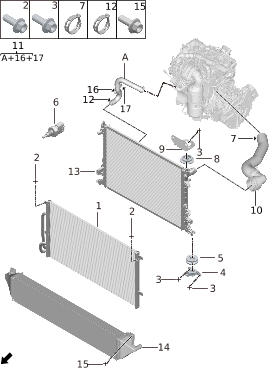

| Поз. | Артикул | Наименование | Кол-во | Применимость | Примечание |
| ---: | --- | --- | ---: | --- | --- |
| 1 | 130101001 | Низкотемпературный радиатор | 1 | с 2022-07-10 |  |
| 2 | Q11001007 | Фланцевый болт | 4 | с 2022-07-10 |  |
| 3 | Q11001011 | Фланцевый болт | 8 | с 2022-07-10 |  |
| 4 | 130201001 | Нижний кронштейн радиатора | 2 | с 2022-07-10 |  |
| 5 | 130106001 | Нижняя демпферная подушка радиатора | 2 | с 2023-06-14 |  |
| 6 | 100019002 | Датчик температуры охлаждающей жидкости радиатора | 1 | с 2023-05-10 |  |
| 7 | Q31004007 | Хомут | 1 | с 2022-07-10 |  |
| 8 | 130107001 | Верхняя демпферная подушка радиатора | 2 | 2023-06-13 - 2024-06-11 |  |
| 9 | 130204002 | Верхний кронштейн радиатора | 2 | с 2022-07-10 |  |
| 10 | 130380003 | Впускной патрубок высокотемпературного радиатора | 1 | с 2022-07-10 |  |
| 11 | 130381002 | Выпускной патрубок высокотемпературного радиатора | 1 | с 2022-07-10 |  |
| 12 | Q31001014 | Зажим трубки | 1 | с 2022-07-10 |  |
| 13 | 130102003 | Радиатор | 1 | с 2023-05-10 |  |
| 14 | 130101005 | Интеркулер | 1 | с 2022-07-10 | Подключается к турбонагнетателю |
| 15 | Q11001005 | Фланцевый болт | 2 | с 2022-07-10 |  |
| 16 | 810707006 | Двойной зажим | 1 | с 2022-07-10 |  |
| 17 | Q31001035 | Зажим трубки | 1 | с 2022-07-10 |  |

# 2029-10 Передние трубопроводы охлаждения

- Применимость группы: с 2023-04-26
- Описание: Тип привода: полный привод

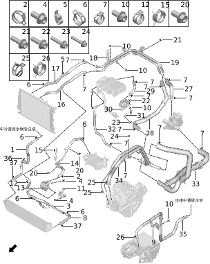

| Поз. | Артикул | Наименование | Кол-во | Применимость | Примечание |
| ---: | --- | --- | ---: | --- | --- |
| 1 | 130316011 | Впускной патрубок низкотемпературного радиатора | 1 | с 2022-07-10 |  |
| 2 | Q31001012 | Зажим трубки | 1 | с 2022-07-10 |  |
| 3 | 130394002 | Узел впускного патрубка насоса интеркулера | 1 | с 2023-06-30 |  |
| 4 | Q11001167 | Фланцевый болт | 5 | с 2022-07-10 |  |
| 5 | 130305005 | Зажим водяной трубки | 1 | с 2022-07-10 |  |
| 6 | Q31001008 | Зажим трубки | 2 | с 2022-07-10 |  |
| 7 | Q31001011 | Зажим трубки | 11 | с 2022-07-10 |  |
| 8 | 130330012 | Выпускной патрубок низкотемпературного радиатора | 1 | с 2022-07-10 |  |
| 9 | 130301014 | Кронштейн водяной трубки | 1 | с 2022-07-10 |  |
| 10 | Q11001002 | Фланцевый болт | 2 | с 2022-07-10 |  |
| 11 | 130395001 | Кронштейн насоса интеркулера | 1 | с 2022-07-10 |  |
| 12 | Q31001029 | Зажим трубки | 1 | с 2023-05-10 |  |
| 13 | 130396002 | Насос интеркулера | 1 | с 2023-05-10 |  |
| 14 | 130393001 | Патрубок от насоса интеркулера к интеркулеру | 1 | с 2022-07-10 |  |
| 15 | Q31002012 | Хомут | 1 | с 2022-07-10 |  |
| 16 | 130330010 | Выпускной патрубок низкотемпературного радиатора | 1 | с 2022-07-10 |  |
| 17 | 130316010 | Впускной патрубок низкотемпературного радиатора | 1 | с 2022-07-10 |  |
| 18 | 130301023 | Кронштейн водяной трубки | 1 | с 2022-07-10 |  |
| 19 | 130330011 | Выпускной патрубок низкотемпературного радиатора | 1 | с 2022-07-10 |  |
| 20 | Q11001005 | Фланцевый болт | 4 | с 2022-07-10 |  |
| 21 | Q11001095 | Фланцевый болт | 1 | с 2022-07-10 |  |
| 22 | Q11001011 | Фланцевый болт | 2 | с 2022-07-10 |  |
| 23 | Q11001201 | Фланцевый болт | 1 | с 2022-07-10 |  |
| 24 | Q11001016 | Фланцевый болт | 2 | с 2022-07-10 |  |
| 25 | Q31001010 | Зажим трубки | 2 | с 2022-07-10 |  |
| 26 | Q31001006 | Зажим трубки | 2 | с 2022-07-10 |  |
| 27 | 130346002 | Задняя секция выпускного патрубка радиатора | 1 | с 2022-07-10 |  |
| 28 | 130336003 | Выпускной патрубок генератора | 1 | с 2022-07-10 |  |
| 29 | 130333002 | Впускной патрубок контроллера расширителя хода | 1 | с 2022-07-10 |  |
| 30 | 130713002 | Узел водяного насоса электродвигателя | 1 | с 2022-07-10 |  |
| 31 | 130707007 | Кронштейн насоса | 1 | с 2022-07-10 |  |
| 32 | 130334002 | Выпускной патрубок контроллера расширителя хода | 1 | с 2022-07-10 |  |
| 33 | 130336005 | Выпускной патрубок генератора | 1 | с 2022-07-10 |  |
| 34 | 130392001 | Впускной/выпускной патрубок генератора | 1 | с 2022-07-10 |  |
| 35 | 130340003 | Мягкий выпускной патрубок центрального канала | 1 | с 2022-07-10 |  |
| 36 | Q31001036 | Зажим трубки | 1 | с 2022-07-10 |  |
| 37 | Q31004013 | Хомут | 2 | с 2023-12-15 |  |

# 2029-11 Передние трубопроводы охлаждения

- Применимость группы: с 2023-05-23
- Описание: Тип привода: задний привод

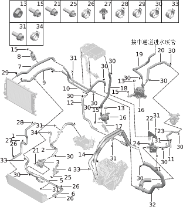

| Поз. | Артикул | Наименование | Кол-во | Применимость | Примечание |
| ---: | --- | --- | ---: | --- | --- |
| 1 | 130316011 | Впускной патрубок низкотемпературного радиатора | 1 | с 2022-07-10 |  |
| 2 | 130393001 | Патрубок от насоса интеркулера к интеркулеру | 1 | с 2022-07-10 |  |
| 3 | 130396002 | Насос интеркулера | 1 | с 2023-05-10 |  |
| 4 | 130395001 | Кронштейн насоса интеркулера | 1 | с 2022-07-10 |  |
| 5 | 130394002 | Узел впускного патрубка насоса интеркулера | 1 | с 2023-06-30 |  |
| 6 | 130330012 | Выпускной патрубок низкотемпературного радиатора | 1 | с 2022-07-10 |  |
| 7 | 130316014 | Впускной патрубок низкотемпературного радиатора | 1 | с 2024-03-15 |  |
| 8 | 130305005 | Зажим водяной трубки | 1 | с 2022-07-10 |  |
| 9 | 130330014 | Выпускной патрубок низкотемпературного радиатора | 1 | с 2024-03-15 |  |
| 10 | 130346003 | Задняя секция выпускного патрубка радиатора | 1 | с 2024-03-15 |  |
| 11 | 130301036 | Кронштейн водяной трубки | 1 | с 2024-03-15 |  |
| 12 | 130334002 | Выпускной патрубок контроллера расширителя хода | 1 | с 2022-07-10 |  |
| 13 | Q21001002 | Фланцевая гайка | 4 | с 2022-07-10 |  |
| 14 | 130392001 | Впускной/выпускной патрубок генератора | 1 | с 2022-07-10 |  |
| 15 | Q11001009 | Фланцевый болт | 9 | с 2022-07-10 |  |
| 16 | 130704011 | Узел водяного насоса | 2 | с 2024-03-15 |  |
| 17 | 130706002 | Кронштейн насоса | 2 | с 2024-03-15 |  |
| 18 | 130333004 | Впускной патрубок контроллера расширителя хода | 1 | с 2024-03-15 |  |
| 19 | 130338003 | Выпускной патрубок насоса | 1 | с 2024-03-15 |  |
| 20 | 130711010 | Впускной патрубок насоса электродвигателя | 1 | с 2024-03-15 |  |
| 21 | Q11001011 | Фланцевый болт | 2 | с 2022-07-10 |  |
| 22 | 130304015 | Кронштейн трёхходового клапана | 1 | с 2024-03-15 |  |
| 23 | 130318014 | Патрубок четырёхходового клапана | 1 | с 2024-03-15 |  |
| 24 | 130302002 | Трёхходовой клапан | 1 | с 2022-07-10 |  |
| 25 | Q11001167 | Фланцевый болт | 3 | с 2022-07-10 |  |
| 26 | Q31004013 | Хомут | 3 | с 2023-12-15 |  |
| 27 | Q31001036 | Зажим трубки | 1 | с 2022-07-10 |  |
| 28 | Q31001008 | Зажим трубки | 1 | с 2022-07-10 |  |
| 29 | Q31001012 | Зажим трубки | 2 | с 2022-07-10 |  |
| 30 | Q31001011 | Зажим трубки | 15 | с 2022-07-10 |  |
| 31 | Q11001005 | Фланцевый болт | 12 | с 2022-07-10 |  |
| 32 | 130336006 | Выпускной патрубок генератора | 1 | с 2024-03-15 |  |
| 33 | Q31001010 | Зажим трубки | 3 | с 2022-07-10 |  |
| 34 | Q31002012 | Хомут | 1 | с 2022-07-10 |  |

# 2030-10 Задние трубопроводы охлаждения

- Применимость группы: с 2023-04-26
- Описание: Тип силовой установки: последовательный гибрид

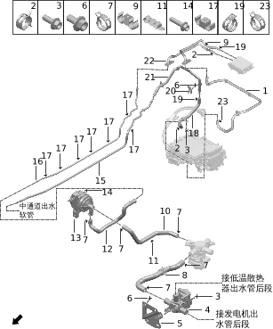

| Поз. | Артикул | Наименование | Кол-во | Применимость | Примечание |
| ---: | --- | --- | ---: | --- | --- |
| 1 | 130322008 | Впускной патрубок заднего электродвигателя | 1 | с 2022-07-10 |  |
| 2 | Q31001007 | Зажим трубки | 3 | с 2022-07-10 |  |
| 3 | Q11001005 | Фланцевый болт | 7 | с 2022-07-10 |  |
| 4 | 130302002 | Трёхходовой клапан | 1 | с 2022-07-10 |  |
| 5 | 130304006 | Кронштейн трёхходового клапана | 1 | с 2022-07-10 |  |
| 6 | Q11001002 | Фланцевый болт | 3 | с 2022-07-10 |  |
| 7 | Q31001011 | Зажим трубки | 5 | с 2022-07-10 |  |
| 8 | 130318011 | Патрубок четырёхходового клапана | 1 | с 2022-07-10 | CATL, 39 kWh |
| 8 | 130318012 | Патрубок четырёхходового клапана | 1 | с 2023-08-01 | элементы, 39 kWh; CATL 43 kWh |
| 9 | 810707003 | Двойной зажим | 1 | с 2022-07-10 |  |
| 10 | 130711004 | Впускной патрубок насоса электродвигателя | 1 | с 2022-07-10 | CATL, 39 kWh |
| 10 | 130711006 | Впускной патрубок насоса электродвигателя | 1 | с 2023-08-01 | элементы, 39 kWh; CATL 43 kWh |
| 11 | 130308003 | Тройной зажим водяной трубки | 1 | с 2022-07-10 |  |
| 12 | 130338002 | Выпускной патрубок насоса | 1 | с 2022-07-10 |  |
| 13 | 130704006 | Узел водяного насоса | 1 | с 2022-10-01 |  |
| 14 | Q11001011 | Фланцевый болт | 2 | с 2022-07-10 |  |
| 15 | 130339003 | Жёсткий выпускной патрубок центрального канала | 1 | с 2022-07-10 |  |
| 16 | 130321004 | Впускной патрубок центрального канала | 1 | с 2022-07-10 |  |
| 17 | 810707005 | Двойной зажим | 7 | с 2022-07-10 |  |
| 18 | 130323004 | Выпускной патрубок заднего электродвигателя | 1 | с 2022-07-10 |  |
| 19 | Q31001006 | Зажим трубки | 2 | с 2022-07-10 |  |
| 20 | 130301013 | Кронштейн водяной трубки | 1 | с 2022-07-10 |  |
| 21 | 130323006 | Выпускной патрубок заднего электродвигателя | 1 | с 2022-07-10 |  |
| 22 | 130317004 | Патрубок зарядного устройства | 1 | с 2022-07-10 |  |
| 23 | Q31001030 | Зажим трубки | 1 | с 2023-08-28 |  |

# 2031-10 Вентилятор охлаждения

- Применимость группы: с 2023-04-26
- Описание: Тип силовой установки: последовательный гибрид

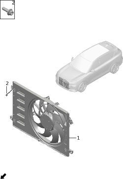

| Поз. | Артикул | Наименование | Кол-во | Применимость | Примечание |
| ---: | --- | --- | ---: | --- | --- |
| 1 | 130800002 | Вентилятор радиатора | 1 | 2022-07-10 - 2024-07-16 |  |
| 1 | 130800003 | Электродвигатель вентилятора радиатора | 1 | с 2024-06-15 |  |
| 2 | Q11001007 | Фланцевый болт | 2 | с 2022-07-10 |  |

# 2032-10 Водяной насос

- Применимость группы: с 2023-04-18
- Описание: Тип силовой установки: последовательный гибрид

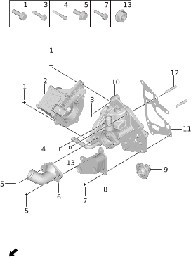

| Поз. | Артикул | Наименование | Кол-во | Применимость | Примечание |
| ---: | --- | --- | ---: | --- | --- |
| 1 | Q11002131 | Болт | 5 | с 2022-07-10 |  |
| 2 | 130704008 | Узел водяного насоса | 1 | с 2022-07-10 |  |
| 3 | Q11002135 | Болт | 1 | с 2022-07-10 |  |
| 4 | Q11002136 | Болт | 1 | с 2022-07-10 |  |
| 5 | Q11002130 | Болт | 2 | с 2022-07-10 |  |
| 6 | 102521001 | Крышка термостата | 1 | с 2022-07-10 |  |
| 7 | Q11002137 | Болт | 3 | с 2022-07-10 |  |
| 8 | 130010004 | Масляный охладитель | 1 | с 2022-07-10 |  |
| 9 | 102520001 | Термостат | 1 | с 2022-07-10 |  |
| 10 | 102522001 | Переходник водяного насоса | 1 | с 2022-07-10 |  |
| 11 | 100908005 | Прокладка | 1 | с 2022-07-10 |  |
| 12 | Q13002004 | Шпилька | 2 | с 2022-07-10 |  |
| 13 | 610509008 | Гайка | 2 | с 2022-07-10 |  |

