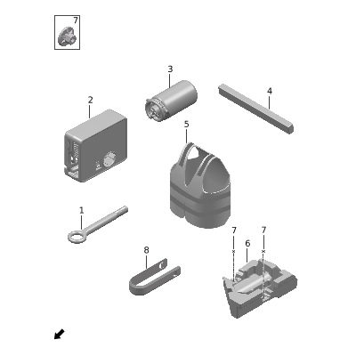

- [8010-10 Бортовой инструмент](#8010-10-бортовой-инструмент)
- [8012-10 Эксплуатационные жидкости и масла](#8012-10-эксплуатационные-жидкости-и-масла)
- [8013-10 Расходные материалы для ремонта](#8013-10-расходные-материалы-для-ремонта)

## 8010-10 Бортовой инструмент

- Применимость группы: с 2023-05-10
- Описание: Общая конфигурация: универсально для серии

| Поз. | Артикул | Наименование | Кол-во | Применимость | Примечание |
| ---: | --- | --- | ---: | --- | --- |
| 1 | 390101004 | Буксировочный крюк | 1 | с 2023-03-10 |  |
| 2 | 310501003 | Компрессор | 1 | с 2022-08-20 |  |
| 3 | 390001002 | Жидкость для ремонта шин | 1 | с 2022-07-10 |  |
| 4 | 392601003 | Аварийный треугольник | 1 | с 2022-10-01 |  |
| 5 | 390002002 | Светоотражающий жилет | 1 | с 2022-07-10 |  |
| 6 | 390003001 | Ящик бортового инструмента | 1 | с 2022-07-10 |  |
| 7 | Q21004001 | Пластиковая гайка | 2 | с 2022-07-10 |  |
| 8 | 391801002 | Съемник декоративных крышек | 1 | с 2022-07-10 |  |

## 8012-10 Эксплуатационные жидкости и масла

- Применимость группы: с 2023-06-05
- Описание: Общая конфигурация: универсально для серии

| Поз. | Артикул | Наименование | Кол-во | Применимость | Примечание |
| ---: | --- | --- | ---: | --- | --- |
| 1 | H41201005 | Масло range extender | 1 | с 2023-05-22 | 0W20 / SP 0W20, 4 л, Dongfeng Castrol, первичная заливка |
| 1 | H41201006 | Масло range extender | 1 | с 2023-05-22 | 0W20 / SP 0W20, 4 л, Mobil, premium aftermarket |
| 2 | H42001000 | Хладагент |  | с 2023-05-23 | R134a, 250 г/флакон |
| 3 | H41202002 | Масло электродвигателя |  | с 2023-05-22 | Для мотора Zhixin, 1 л/бутылка, CASTROL 805 |
| 4 | H42801000 | Тормозная жидкость |  | с 2023-05-22 | HZY4, 1 л/бутылка; PetroChina Kunlun |
| 5 | H41901000 | Охлаждающая жидкость |  | с 2023-05-23 | Lingjun H2, 4 л/бутылка; Dongfeng Castrol |
| 5 | H41901001 | Охлаждающая жидкость |  | с 2023-05-23 | Lingjun H2, 2 л/бутылка; Dongfeng Castrol |
| 5 | H41901004 | Охлаждающая жидкость |  |  | Для холодного климата, Lingjun H2, 4 л/бутылка |
| 5 | H41901007 | Охлаждающая жидкость |  | с 2023-05-23 | Lingjun H2, 4 л/бутылка; Dongfeng Castrol |
| 5 | H41901008 | Охлаждающая жидкость |  | с 2023-05-23 | Lingjun H2, 2 л/бутылка; Dongfeng Castrol |
| 6 | H41203001 | Масло высоковольтного генератора |  | с 2023-05-22 | 1 л/бутылка |
| 7 | H43001000 | Жидкость омывателя |  | с 2023-05-23 | Этаноловая -25C, 2 л/бутылка |
| 7 | H43001004 | Жидкость омывателя |  | с 2023-05-23 | Омыватель -40°, 2 л/бутылка |
| 7 | H43001006 | Жидкость омывателя |  | с 2023-05-23 | Омыватель -10°, 2 л/бутылка |

## 8013-10 Расходные материалы для ремонта

- Применимость группы: с 2023-06-05
- Описание: Общая конфигурация: универсально для серии

| Поз. | Артикул | Наименование | Кол-во | Применимость | Примечание |
| ---: | --- | --- | ---: | --- | --- |
| 1 | H45001001 | Клей для стекол |  | с 2023-05-23 | Shilihe; 310 мл/тюбик |
| 2 | H45002001 | Активатор стекольного клея |  | с 2023-05-23 | Shilihe; 150 мл/бутылка |
| 3 | H45003001 | Очиститель стекольного клея |  | с 2023-05-23 | Shilihe; 1 л/бутылка |
| 4 | H45101000 | Копировальная бумага |  | с 2023-05-23 | 100 шт |
| 5 | H45201000 | Антикоррозийное покрытие днища |  | с 2023-05-23 | 500 мл/бутылка |
| 6 | H45501002 | Защитное средство для клемм аккумулятора |  | с 2023-05-23 |  |
| 7 | H47402001 | Набор глубокой очистки кондиционера |  | с 2023-05-23 |  |
| 8 | H47403001 | Набор обслуживания тормозной системы |  | с 2023-05-23 |  |
| 9 | H47404001 | Средство для дезинфекции и удаления запаха в салоне |  | с 2023-05-23 |  |
| 10 | H44501003 | Очиститель кожи и интерьера |  | с 2023-05-23 |  |
| 11 | H44502002 | Средство по уходу за кожей |  | с 2023-05-23 |  |
| 12 | H41301002 | Очиститель дроссельной заслонки |  | с 2023-05-23 |  |
| 13 | H47405001 | Очиститель замши |  | с 2023-05-23 |  |
| 14 | H45401002 | Смазка |  | с 2023-05-23 |  |
| 15 | H45402002 | Проникающая смазка |  | с 2023-05-23 |  |
| 16 | H45601002 | Резьбовая паста |  | с 2023-05-23 |  |
| 17 | H45701003 | Герметик двигателя |  | с 2023-05-23 |  |
| 18 | H45801002 | Промышленный цианоакрилатный клей |  | с 2023-05-23 |  |
| 19 | H41601002 | Очиститель моторного отсека |  | с 2023-05-23 |  |
| 20 | H45901002 | Очиститель деталей |  | с 2023-05-23 |  |
| 21 | H43301002 | Очиститель дисков |  | с 2023-05-23 |  |
| 22 | H43401002 | Защитное средство для шин |  | с 2023-05-23 |  |
| 23 | H45602002 | Фиксатор резьбы |  | с 2023-05-23 |  |

