- [1010-10 Высоковольтная батарея](#1010-10-высоковольтная-батарея)
- [1010-11 Высоковольтная батарея](#1010-11-высоковольтная-батарея)
- [1010-12 Высоковольтная батарея](#1010-12-высоковольтная-батарея)
- [1011-10 Передний приводной электродвигатель](#1011-10-передний-приводной-электродвигатель)
- [1012-10 Задний приводной электродвигатель](#1012-10-задний-приводной-электродвигатель)
- [1013-10 Контроллер автомобиля](#1013-10-контроллер-автомобиля)
- [1014-10 Высоковольтная распределительная коробка](#1014-10-высоковольтная-распределительная-коробка)
- [1016-10 Зарядный разъем](#1016-10-зарядный-разъем)
- [1016-11 Зарядный разъем](#1016-11-зарядный-разъем)
- [1017-10 Бортовое зарядное устройство](#1017-10-бортовое-зарядное-устройство)
- [1017-11 Бортовое зарядное устройство](#1017-11-бортовое-зарядное-устройство)
- [1020-10 Высоковольтный жгут батарейного блока](#1020-10-высоковольтный-жгут-батарейного-блока)
- [1020-11 Высоковольтный жгут батарейного блока](#1020-11-высоковольтный-жгут-батарейного-блока)
- [1020-12 Высоковольтный жгут батарейного блока](#1020-12-высоковольтный-жгут-батарейного-блока)
- [1023-10 Высоковольтная часть компрессора и PTC](#1023-10-высоковольтная-часть-компрессора-и-ptc)
- [1030-10 Рендж-экстендер](#1030-10-рендж-экстендер)
- [1032-10 Крышка ГБЦ](#1032-10-крышка-гбц)
- [1033-10 Головка блока цилиндров](#1033-10-головка-блока-цилиндров)
- [1034-10 Декоративная крышка двигателя](#1034-10-декоративная-крышка-двигателя)
- [1035-10 Клапанный механизм](#1035-10-клапанный-механизм)
- [1036-10 Блок цилиндров](#1036-10-блок-цилиндров)
- [1037-10 Коленвал и маховик](#1037-10-коленвал-и-маховик)
- [1038-10 Поршень и шатун](#1038-10-поршень-и-шатун)
- [1039-10 Газораспределительный механизм](#1039-10-газораспределительный-механизм)
- [1040-10 Кожух цепи ГРМ и масляный насос](#1040-10-кожух-цепи-грм-и-масляный-насос)
- [1041-10 Масляный поддон и масляный фильтр](#1041-10-масляный-поддон-и-масляный-фильтр)
- [1042-10 Трубка вентиляции картера](#1042-10-трубка-вентиляции-картера)
- [1043-10 Контроллер двигателя](#1043-10-контроллер-двигателя)

# 1010-10 Высоковольтная батарея

- Применимость группы: с 2023-02-20
- Описание: CATL: элементы батареи && емкость батарейного блока: 3

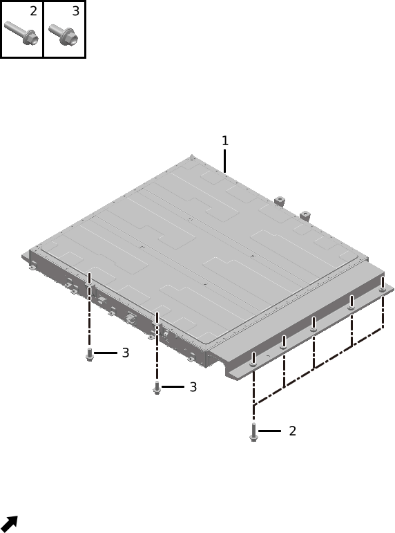

| Поз. | Артикул | Наименование | Кол-во | Применимость | Примечание |
| ---: | --- | --- | ---: | --- | --- |
| 1 | 920105023 | Тяговая батарея | 1 | с 2022-11-01 |  |
| 2 | Q11001057 | Фланцевый болт | 10 | с 2022-07-10 |  |
| 3 | Q11002039 | Болт | 4 | с 2022-07-10 |  |

# 1010-11 Высоковольтная батарея

- Применимость группы: с 2023-06-07
- Описание: Honeycomb: элементы батареи && емкость батарейного блока: 39

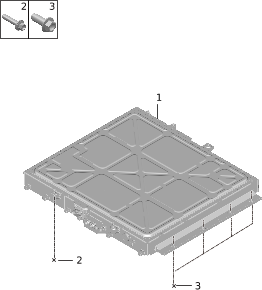

| Поз. | Артикул | Наименование | Кол-во | Применимость | Примечание |
| ---: | --- | --- | ---: | --- | --- |
| 1 | 920105025 | Тяговая батарея | 1 | с 2023-08-01 |  |
| 2 | Q11001179 | Фланцевый болт | 4 | с 2023-08-01 |  |
| 3 | Q11001180 | Фланцевый болт | 8 | с 2023-07-03 |  |

# 1010-12 Высоковольтная батарея

- Применимость группы: с 2023-05-23
- Описание: CATL: элементы батареи && емкость батарейного блока: 4

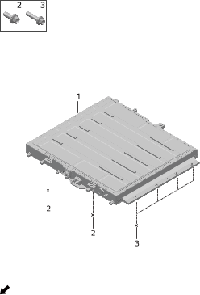

| Поз. | Артикул | Наименование | Кол-во | Применимость | Примечание |
| ---: | --- | --- | ---: | --- | --- |
| 1 | 920105051 | Тяговая батарея | 1 | с 2024-03-15 |  |
| 2 | Q11001179 | Фланцевый болт | 4 | с 2023-08-01 |  |
| 3 | Q11001180 | Фланцевый болт | 8 | с 2023-07-03 |  |

# 1011-10 Передний приводной электродвигатель

- Применимость группы: с 2023-04-26
- Описание: Тип привода: полный привод

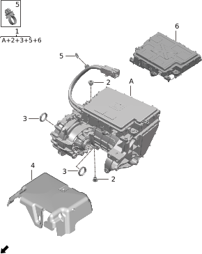

| Поз. | Артикул | Наименование | Кол-во | Применимость | Примечание |
| ---: | --- | --- | ---: | --- | --- |
| 1 | 910021009 | Передний приводной электродвигатель | 1 | 2022-12-04 - 2023-09-19 | Емкость батарейного блока: 39 kWh |
| 1 | 910021010 | Передний приводной электродвигатель | 1 | 2023-09-19 - 2024-06-11 | Емкость батарейного блока: 39 kWh |
| 1 | 910021011 | Передний приводной электродвигатель | 1 | с 2024-06-11 | Емкость батарейного блока: 39 kWh |
| 1 | 910021026 | Передний приводной электродвигатель | 1 | с 2024-03-15 | Емкость батарейного блока: 43 kWh |
| 2 | 362105004 | Пробка заливки и слива масла | 3 | с 2022-07-10 |  |
| 3 | 362103003 | Сальник полуоси | 2 | с 2022-07-10 |  |
| 4 | 553509005 | Кожух переднего электродвигателя | 1 | с 2023-05-10 |  |
| 5 | 371611016 | Клипса | 2 | с 2023-04-15 |  |
| 5 | Q41001020 | Клипса | 2 | 2022-07-10 - 2023-10-24 |  |
| 6 | 362180002 | Контроллер переднего приводного электродвигателя | 1 | с 2024-03-15 |  |

# 1012-10 Задний приводной электродвигатель

- Применимость группы: с 2023-04-26
- Описание: Общая конфигурация: универсально для серии

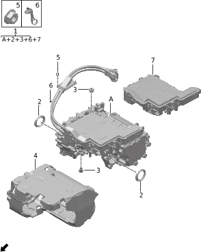

| Поз. | Артикул | Наименование | Кол-во | Применимость | Примечание |
| ---: | --- | --- | ---: | --- | --- |
| 1 | 910022009 | Задний приводной электродвигатель | 1 | 2022-12-11 - 2023-09-22 | Емкость батарейного блока: 39 kWh |
| 1 | 910022010 | Задний приводной электродвигатель | 1 | с 2023-09-22 | Емкость батарейного блока: 39 kWh |
| 1 | 910022035 | Задний приводной электродвигатель | 1 | с 2024-03-15 | Емкость батарейного блока: 43 kWh |
| 2 | 362103003 | Сальник полуоси | 2 | с 2022-07-10 |  |
| 3 | 362105004 | Пробка заливки и слива масла | 3 | с 2022-07-10 |  |
| 4 | 553510007 | Кожух заднего электродвигателя | 1 | с 2022-10-01 | Емкость батарейного блока: 39 kWh |
| 4 | 553510009 | Кожух заднего электродвигателя | 1 | с 2024-05-07 | Емкость батарейного блока: 43 kWh |
| 5 | Q21001010 | Фланцевая гайка | 4 | с 2022-07-10 |  |
| 6 | 350612009 | Стяжка | 1 | с 2022-07-10 |  |
| 7 | 362181002 | Контроллер заднего приводного электродвигателя | 1 | с 2023-12-26 |  |

# 1013-10 Контроллер автомобиля

- Применимость группы: с 2023-04-26
- Описание: Общая конфигурация: универсально для серии

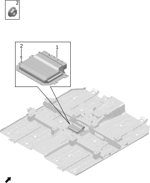

| Поз. | Артикул | Наименование | Кол-во | Применимость | Примечание |
| ---: | --- | --- | ---: | --- | --- |
| 1 | 361080006 | Контроллер автомобиля | 1 | с 2022-07-10 |  |
| 2 | Q21001001 | Фланцевая гайка | 4 | с 2022-07-10 |  |

# 1014-10 Высоковольтная распределительная коробка

- Применимость группы: с 2023-04-26
- Описание: Тип силовой установки: последовательный гибрид

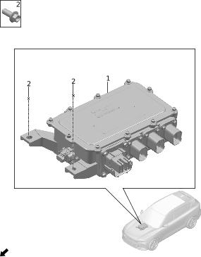

| Поз. | Артикул | Наименование | Кол-во | Применимость | Примечание |
| ---: | --- | --- | ---: | --- | --- |
| 1 | 932201001 | Высоковольтный блок переднего отсека | 1 | с 2024-03-15 | Задний привод |
| 1 | 932201002 | Высоковольтный блок переднего отсека | 1 | с 2022-07-10 | Полный привод |
| 2 | Q11001020 | Фланцевый болт | 4 | с 2022-07-10 |  |

# 1016-10 Зарядный разъем

- Применимость группы: с 2023-06-09
- Описание: Мощность бортового зарядного устройства: 6.6 kW

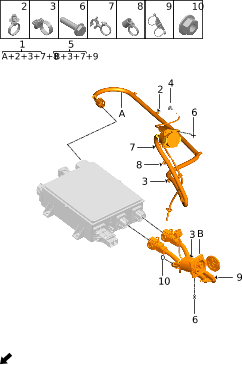

| Поз. | Артикул | Наименование | Кол-во | Применимость | Примечание |
| ---: | --- | --- | ---: | --- | --- |
| 1 | 934000005 | Разъем медленной зарядки | 1 | 2023-04-15 - 2023-09-23 |  |
| 1 | 934000006 | Разъем медленной зарядки | 1 | с 2023-08-01 |  |
| 2 | Q41001023 | Клипса | 2 | 2022-07-10 - 2023-10-24 |  |
| 3 | Q41001020 | Клипса | 4 | 2022-07-10 - 2023-10-24 |  |
| 4 | 840405001 | Ручка аварийного открытия | 1 | с 2022-07-10 |  |
| 5 | 934001002 | Разъем быстрой зарядки | 1 | 2022-07-10 - 2023-10-24 |  |
| 5 | 934001003 | Разъем быстрой зарядки | 1 | с 2023-08-01 |  |
| 6 | Q11008001 | Болт крепления разъема быстрой и медленной зарядки | 8 | с 2022-07-10 |  |
| 7 | Q41001034 | Клипса | 5 | 2022-07-10 - 2023-10-24 |  |
| 8 | Q41001022 | Клипса | 2 | 2022-07-10 - 2023-10-24 |  |
| 9 | Q41001021 | Клипса | 3 | 2022-07-10 - 2023-10-24 |  |
| 10 | Q21012001 | Гайка заземления | 1 | с 2022-07-10 |  |

# 1016-11 Зарядный разъем

- Применимость группы: с 2023-06-09
- Описание: Мощность бортового зарядного устройства: 11 kW, GB

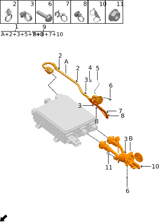

| Поз. | Артикул | Наименование | Кол-во | Применимость | Примечание |
| ---: | --- | --- | ---: | --- | --- |
| 1 | 934000003 | Разъем медленной зарядки | 1 | 2022-07-10 - 2023-10-24 |  |
| 1 | 934000007 | Разъем медленной зарядки | 1 | с 2023-08-01 |  |
| 2 | Q41001023 | Клипса | 2 | 2022-07-10 - 2023-10-24 |  |
| 3 | Q41001020 | Клипса | 4 | 2022-07-10 - 2023-10-24 |  |
| 4 | 840405001 | Ручка аварийного открытия | 1 | с 2022-07-10 |  |
| 5 | 934005001 | Трос электронного замка зарядного разъема | 1 | 2022-07-10 - 2023-10-24 |  |
| 6 | Q11008001 | Болт крепления разъема быстрой и медленной зарядки | 8 | с 2022-07-10 |  |
| 7 | Q41001034 | Клипса | 5 | 2022-07-10 - 2023-10-24 |  |
| 8 | Q41001022 | Клипса | 2 | 2022-07-10 - 2023-10-24 |  |
| 9 | 934001002 | Разъем быстрой зарядки | 1 | 2022-07-10 - 2023-10-24 |  |
| 9 | 934001003 | Разъем быстрой зарядки | 1 | с 2023-08-01 |  |
| 10 | Q41001021 | Клипса | 3 | 2022-07-10 - 2023-10-24 |  |
| 11 | Q21012001 | Гайка заземления | 1 | с 2022-07-10 |  |

# 1017-10 Бортовое зарядное устройство

- Применимость группы: с 2023-05-23
- Описание: Мощность зарядного устройства: 6.6 kW && тип силовой установки:

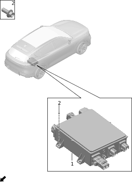

| Поз. | Артикул | Наименование | Кол-во | Применимость | Примечание |
| ---: | --- | --- | ---: | --- | --- |
| 1 | 934002019 | Бортовое зарядное устройство | 1 | 2023-04-15 - 2023-07-23 |  |
| 1 | 934002027 | Бортовое зарядное устройство | 1 | с 2023-07-23 |  |
| 2 | Q11001019 | Фланцевый болт | 4 | с 2022-07-10 |  |

# 1017-11 Бортовое зарядное устройство

- Применимость группы: с 2023-05-23
- Описание: Мощность зарядного устройства: 11 kW, GB && тип силовой установки

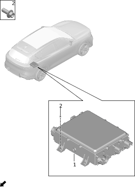

| Поз. | Артикул | Наименование | Кол-во | Применимость | Примечание |
| ---: | --- | --- | ---: | --- | --- |
| 1 | 934002022 | Бортовое зарядное устройство | 1 | с 2023-05-10 |  |
| 2 | Q11001019 | Фланцевый болт | 4 | с 2022-07-10 |  |

# 1020-10 Высоковольтный жгут батарейного блока

- Применимость группы: с 2023-04-26
- Описание: CATL: элементы батареи && емкость батарейного блока: 3

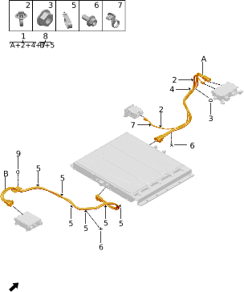

| Поз. | Артикул | Наименование | Кол-во | Применимость | Примечание |
| ---: | --- | --- | ---: | --- | --- |
| 1 | 932500010 | Передний высоковольтный жгут тяговой батареи | 1 | с 2023-04-15 |  |
| 2 | 371611016 | Клипса | 6 | с 2023-04-15 |  |
| 3 | Q21001002 | Фланцевая гайка | 7 | с 2022-07-10 |  |
| 4 | 350612011 | Стяжка | 8 | с 2023-04-15 |  |
| 5 | 932520002 | Жестяная кабельная скоба | 7 | с 2022-07-10 |  |
| 6 | Q11001002 | Фланцевый болт | 9 | с 2022-07-10 |  |
| 7 | Q41001026 | Клипса | 1 | с 2022-07-10 |  |
| 8 | 932501004 | Задний высоковольтный жгут тяговой батареи | 1 | с 2022-07-10 |  |
| 9 | Q21001011 | Фланцевая гайка | 4 | с 2022-07-10 |  |

# 1020-11 Высоковольтный жгут батарейного блока

- Применимость группы: с 2023-06-08
- Описание: Honeycomb: элементы батареи && емкость батарейного блока: 39

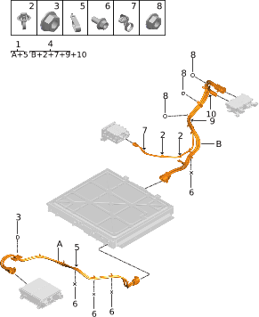

| Поз. | Артикул | Наименование | Кол-во | Применимость | Примечание |
| ---: | --- | --- | ---: | --- | --- |
| 1 | 932501009 | Задний высоковольтный жгут тяговой батареи | 1 | с 2023-08-01 |  |
| 2 | 371611016 | Клипса | 6 | с 2023-04-15 |  |
| 3 | Q21001011 | Фланцевая гайка | 4 | с 2022-07-10 |  |
| 4 | 932500011 | Передний высоковольтный жгут тяговой батареи | 1 | с 2023-08-01 |  |
| 5 | 932520002 | Жестяная кабельная скоба | 7 | с 2022-07-10 |  |
| 6 | Q11001002 | Фланцевый болт | 8 | с 2022-07-10 |  |
| 7 | Q41001026 | Клипса | 1 | с 2022-07-10 |  |
| 8 | Q21001002 | Фланцевая гайка | 7 | с 2022-07-10 |  |
| 9 | 350612011 | Стяжка | 8 | с 2023-04-15 |  |
| 10 | 350612012 | Стяжка | 1 | с 2023-08-01 |  |

# 1020-12 Высоковольтный жгут батарейного блока

- Применимость группы: с 2023-05-23
- Описание: CATL: элементы батареи && емкость батарейного блока: 4

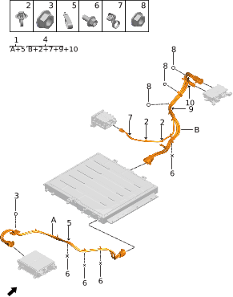

| Поз. | Артикул | Наименование | Кол-во | Применимость | Примечание |
| ---: | --- | --- | ---: | --- | --- |
| 1 | 932501009 | Задний высоковольтный жгут тяговой батареи | 1 | с 2023-08-01 |  |
| 2 | 371611016 | Клипса | 6 | с 2023-04-15 |  |
| 3 | Q21001011 | Фланцевая гайка | 4 | с 2022-07-10 |  |
| 4 | 932500011 | Передний высоковольтный жгут тяговой батареи | 1 | с 2023-08-01 |  |
| 5 | 932520002 | Жестяная кабельная скоба | 7 | с 2022-07-10 |  |
| 6 | Q11001002 | Фланцевый болт | 8 | с 2022-07-10 |  |
| 7 | Q41001026 | Клипса | 1 | с 2022-07-10 |  |
| 8 | Q21001002 | Фланцевая гайка | 7 | с 2022-07-10 |  |
| 9 | 350612011 | Стяжка | 8 | с 2023-04-15 |  |
| 10 | 350612012 | Стяжка | 8 | с 2023-08-01 |  |

# 1023-10 Высоковольтная часть компрессора и PTC

- Применимость группы: с 2023-04-01
- Описание: Тип силовой установки: последовательный гибрид

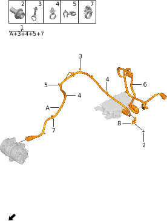

| Поз. | Артикул | Наименование | Кол-во | Применимость | Примечание |
| ---: | --- | --- | ---: | --- | --- |
| 1 | 932506010 | Высоковольтный жгут компрессора | 1 | 2023-05-10 - 2023-11-08 | Емкость батарейного блока: 39 kWh |
| 1 | 932506012 | Высоковольтный жгут компрессора | 1 | с 2023-11-08 | Емкость батарейного блока: 39 kWh |
| 1 | 932506014 | Высоковольтный жгут компрессора | 1 | с 2024-03-15 | Емкость батарейного блока: 43 kWh |
| 2 | Q11001002 | Фланцевый болт | 1 | с 2022-07-10 |  |
| 3 | Q41001032 | Клипса | 1 | с 2023-11-08 |  |
| 4 | 350612005 | Стяжка | 5 | с 2023-11-08 |  |
| 5 | Q41001031 | Клипса | 1 | с 2023-11-08 |  |
| 6 | 932504008 | Высоковольтный жгут PTC кондиционера | 1 | с 2022-07-10 |  |
| 7 | 371611016 | Клипса | 1 | с 2023-04-15 |  |
| 7 | Q41001020 | Клипса | 1 | 2022-07-10 - 2023-10-24 |  |
| 8 | 932513005 | Кронштейн высоковольтного жгута компрессора | 1 | с 2023-11-08 |  |

# 1030-10 Рендж-экстендер

- Применимость группы: с 2023-04-06
- Описание: Тип силовой установки: последовательный гибрид

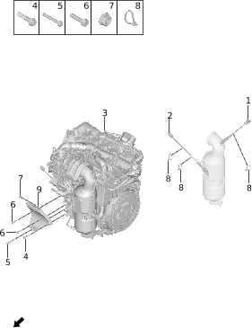

| Поз. | Артикул | Наименование | Кол-во | Применимость | Примечание |
| ---: | --- | --- | ---: | --- | --- |
| 1 | 111814002 | Передний кислородный датчик | 1 | с 2022-07-10 |  |
| 2 | 111813002 | Задний кислородный датчик | 1 | с 2022-07-10 |  |
| 3 | 100001005 | Рендж-экстендер | 1 | с 2022-07-10 |  |
| 4 | Q11002149 | Болт | 1 | с 2022-07-10 |  |
| 5 | Q11002148 | Болт | 1 | с 2022-07-10 |  |
| 6 | Q11002137 | Болт | 2 | с 2022-07-10 |  |
| 7 | 610509008 | Гайка | 1 | с 2022-07-10 |  |
| 8 | 350612010 | Стяжка | 3 | с 2022-07-10 |  |
| 9 | 810301004 | Кронштейн компрессора | 1 | с 2022-07-10 |  |

# 1032-10 Крышка ГБЦ

- Применимость группы: с 2023-04-14
- Описание: Тип силовой установки: последовательный гибрид

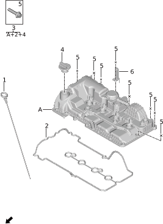

| Поз. | Артикул | Наименование | Кол-во | Применимость | Примечание |
| ---: | --- | --- | ---: | --- | --- |
| 1 | 100902003 | Масляный щуп | 1 | с 2022-07-10 |  |
| 2 | 100301002 | Прокладка крышки ГБЦ | 1 | с 2022-07-10 |  |
| 3 | 100304004 | Крышка ГБЦ | 1 | с 2022-07-10 |  |
| 4 | 100305002 | Крышка маслозаливной горловины | 1 | с 2022-07-10 |  |
| 5 | Q11002129 | Болт | 18 | с 2022-07-10 |  |
| 6 | 110609003 | Кронштейн топливной трубки | 1 | с 2022-07-10 |  |
| 6 | 110609004 | Кронштейн топливной трубки | 1 | с 2022-07-10 |  |

# 1033-10 Головка блока цилиндров

- Применимость группы: с 2023-04-14
- Описание: Тип силовой установки: последовательный гибрид

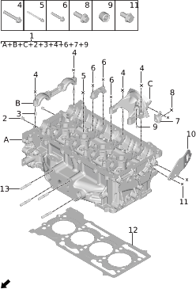

| Поз. | Артикул | Наименование | Кол-во | Применимость | Примечание |
| ---: | --- | --- | ---: | --- | --- |
| 1 | 100303005 | Головка блока цилиндров | 1 | с 2022-07-10 |  |
| 2 | 102502001 | Дроссельная форсунка | 2 | с 2022-07-10 |  |
| 3 | 100201001 | Установочная втулка | 4 | с 2022-07-10 |  |
| 4 | Q11002109 | Болт | 6 | с 2022-07-10 |  |
| 5 | 101513004 | Болт ГБЦ | 12 | с 2022-07-10 |  |
| 6 | Q11002110 | Болт | 14 | с 2022-07-10 |  |
| 7 | 101509002 | Кронштейн ГБЦ | 1 | с 2022-07-10 |  |
| 8 | Q11002111 | Болт | 2 | с 2022-07-10 |  |
| 9 | 102501001 | Резьбовая пробка | 1 | с 2022-07-10 |  |
| 10 | 100017004 | Проушина двигателя | 1 | с 2022-07-10 |  |
| 11 | Q11002112 | Болт | 2 | с 2022-07-10 |  |
| 12 | 101507004 | Прокладка ГБЦ | 1 | с 2022-07-10 |  |
| 13 | 100018002 | Шпилька | 4 | с 2022-07-10 |  |

# 1034-10 Декоративная крышка двигателя

- Применимость группы: с 2023-05-06
- Описание: Тип силовой установки: последовательный гибрид

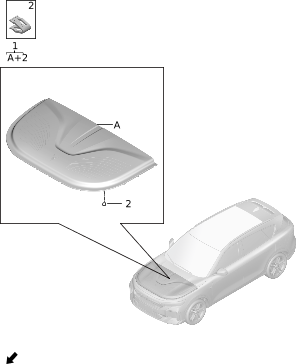

| Поз. | Артикул | Наименование | Кол-во | Применимость | Примечание |
| ---: | --- | --- | ---: | --- | --- |
| 1 | 840504008 | Декоративная крышка двигателя | 1 | с 2022-07-10 |  |
| 2 | Q41002001 | Пластиковая клипса | 13 | с 2022-07-10 |  |

# 1035-10 Клапанный механизм

- Применимость группы: с 2023-04-14
- Описание: Тип силовой установки: последовательный гибрид

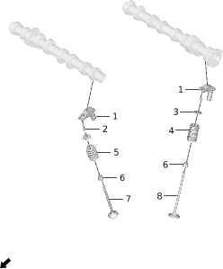

| Поз. | Артикул | Наименование | Кол-во | Применимость | Примечание |
| ---: | --- | --- | ---: | --- | --- |
| 1 | 100707073 | Толкатель клапана | 16 | с 2022-07-10 |  |
| 2 | 100703004 | Сухарь клапана | 32 | с 2022-07-10 |  |
| 3 | 100708003 | Верхняя тарелка клапанной пружины | 16 | с 2022-07-10 |  |
| 4 | 100704005 | Клапанная пружина | 8 | с 2022-07-10 | Впускной клапан |
| 5 | 100704004 | Клапанная пружина | 8 | с 2022-07-10 | Выпускной клапан |
| 6 | 100710003 | Маслосъемный колпачок выпускного клапана | 16 | с 2022-07-10 |  |
| 6 | 100710004 | Маслосъемный колпачок выпускного клапана | 16 | с 2022-07-10 |  |
| 7 | 100701004 | Выпускной клапан | 8 | с 2022-07-10 |  |
| 8 | 100702004 | Впускной клапан | 8 | с 2022-07-10 |  |

# 1036-10 Блок цилиндров

- Применимость группы: с 2023-04-18
- Описание: Тип силовой установки: последовательный гибрид

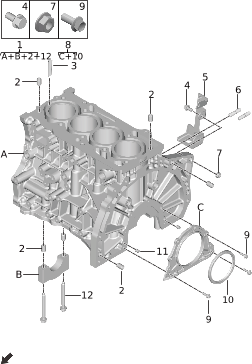

| Поз. | Артикул | Наименование | Кол-во | Применимость | Примечание |
| ---: | --- | --- | ---: | --- | --- |
| 1 | 100200004 | Блок цилиндров | 1 | с 2022-07-10 |  |
| 2 | 100005002 | Установочный штифт ГБЦ | 14 | с 2022-07-10 |  |
| 3 | 130727003 | Перегородка охлаждающей жидкости | 2 | с 2022-07-10 |  |
| 4 | Q11002114 | Болт | 1 | с 2022-07-10 |  |
| 5 | 102503001 | Кронштейн трехфазного провода | 1 | с 2022-07-10 |  |
| 6 | Q13002002 | Шпилька | 2 | с 2022-07-10 |  |
| 7 | 610508006 | Гайка | 1 | с 2022-07-10 |  |
| 8 | 100025001 | Крышка и сальник заднего коленвала | 1 | с 2022-07-10 |  |
| 9 | Q11002115 | Болт | 6 | с 2022-07-10 |  |
| 10 | 100024004 | Задний сальник коленвала | 1 | с 2022-07-10 |  |
| 10 | 100024005 | Задний сальник коленвала | 1 | с 2022-07-10 |  |
| 11 | 102504001 | Цилиндрический ролик | 2 | с 2022-07-10 |  |
| 12 | 101514003 | Болт | 10 | с 2022-07-10 |  |

# 1037-10 Коленвал и маховик

- Применимость группы: с 2023-04-14
- Описание: Тип силовой установки: последовательный гибрид

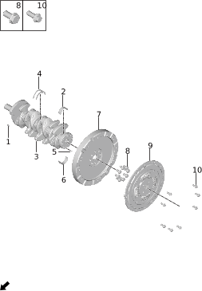

| Поз. | Артикул | Наименование | Кол-во | Применимость | Примечание |
| ---: | --- | --- | ---: | --- | --- |
| 1 | Q51001004 | Шпонка | 1 | с 2022-07-10 |  |
| 2 | 100502012 | Верхний коренной вкладыш | 5 | с 2022-07-10 | После определения группы по руководству по ремонту заказать у головного офиса |
| 3 | 100501005 | Коленчатый вал | 1 | с 2022-07-10 |  |
| 4 | 100015004 | Упорное полукольцо коленвала | 2 | с 2022-07-10 |  |
| 5 | 102504002 | Цилиндрический ролик | 1 | с 2022-07-10 |  |
| 6 | 100503012 | Нижний коренной вкладыш | 5 | с 2022-07-10 | После определения группы по руководству по ремонту заказать у головного офиса |
| 7 | 100504004 | Маховик | 1 | с 2022-07-10 |  |
| 8 | 101516004 | Болт маховика | 8 | с 2022-07-10 |  |
| 9 | 140101002 | Крутильный демпфер | 1 | с 2022-07-10 |  |
| 10 | Q11002120 | Болт | 9 | с 2022-07-10 |  |

# 1038-10 Поршень и шатун

- Применимость группы: с 2023-04-14
- Описание: Тип силовой установки: последовательный гибрид

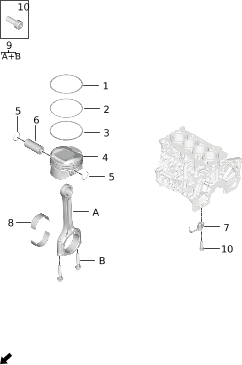

| Поз. | Артикул | Наименование | Кол-во | Применимость | Примечание |
| ---: | --- | --- | ---: | --- | --- |
| 1 | 100408002 | Первое компрессионное кольцо | 4 | с 2022-07-10 | Используется в паре с 100407002, 100406003 |
| 1 | 100408003 | Первое компрессионное кольцо | 4 | с 2022-07-10 | Используется в паре с 100407003, 100406002 |
| 2 | 100407002 | Второе компрессионное кольцо | 4 | с 2022-07-10 | Используется в паре с 100408002, 100406003 |
| 2 | 100407003 | Второе компрессионное кольцо | 4 | с 2022-07-10 | Используется в паре с 100408003, 100406002 |
| 3 | 100406002 | Маслосъемное кольцо | 4 | с 2022-07-10 | Используется в паре с 100407003, 100408003 |
| 3 | 100406003 | Маслосъемное кольцо | 4 | с 2022-07-10 | Используется в паре с 100407002, 100408002 |
| 4 | 100405007 | Поршень | 4 | с 2022-07-10 |  |
| 5 | 100401004 | Стопорное кольцо поршневого пальца | 8 | с 2022-07-10 |  |
| 6 | 100402004 | Поршневой палец | 4 | с 2022-07-10 |  |
| 7 | 130009003 | Форсунка охлаждения поршня | 4 | с 2022-07-10 |  |
| 8 | 100403012 | Шатунный вкладыш | 8 | с 2022-07-10 | После определения группы по руководству по ремонту заказать у головного офиса |
| 9 | 100404007 | Шатун | 4 | с 2022-07-10 |  |
| 10 | Q12001037 | Винт с внутренним шестигранником | 4 | с 2022-07-10 |  |

# 1039-10 Газораспределительный механизм

- Применимость группы: с 2023-04-14
- Описание: Тип силовой установки: последовательный гибрид

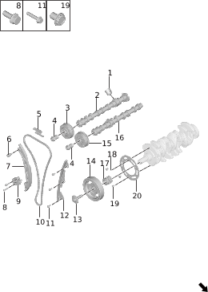

| Поз. | Артикул | Наименование | Кол-во | Применимость | Примечание |
| ---: | --- | --- | ---: | --- | --- |
| 1 | 102508001 | Толкатель масляного насоса | 1 | с 2022-07-10 |  |
| 2 | 100601004 | Впускной распредвал | 1 | с 2022-07-10 |  |
| 3 | 100618003 | Впускная шестерня VVT | 1 | с 2022-07-10 | 16005, 100615003, 10061400 |
| 3 | 100618004 | Впускная шестерня VVT | 1 | с 2022-07-10 | 16006, 100615004, 10061400 |
| 4 | 100616005 | Клапан управления маслом | 2 | с 2022-07-10 | 18003, 100615003, 10061400 |
| 4 | 100616006 | Клапан управления маслом | 2 | с 2022-07-10 | 18004, 100615004, 10061400 |
| 5 | 100619003 | Верхняя направляющая | 1 | с 2022-07-10 |  |
| 6 | Q11002121 | Болт | 1 | с 2022-07-10 |  |
| 7 | 100620003 | Направляющая натяжителя | 1 | с 2022-07-10 |  |
| 8 | Q11002122 | Болт | 2 | с 2022-07-10 |  |
| 9 | 100617003 | Натяжитель цепи ГРМ | 1 | с 2022-07-10 |  |
| 10 | 100604004 | Цепь ГРМ | 1 | с 2022-07-10 |  |
| 11 | Q11002123 | Болт | 3 | с 2022-07-10 |  |
| 12 | 100621003 | Фиксированная направляющая | 1 | с 2022-07-10 |  |
| 13 | 101505005 | Болт | 1 | с 2022-07-10 |  |
| 14 | 102507001 | Узел TVD | 1 | с 2022-07-10 |  |
| 15 | 100615003 | Выпускная шестерня VVT | 1 | с 2022-07-10 | 16005, 100618003, 10061400 |
| 15 | 100615004 | Выпускная шестерня VVT | 1 | с 2022-07-10 | 16006, 100618004, 10061400 |
| 16 | 100602004 | Выпускной распредвал | 1 | с 2022-07-10 |  |
| 17 | 100603004 | Звездочка коленвала ГРМ | 1 | с 2022-07-10 |  |
| 18 | 100509007 | Цилиндрический штифт | 1 | с 2022-07-10 |  |
| 19 | 101505006 | Болт | 3 | с 2022-07-10 |  |
| 20 | 100508003 | Сигнальный диск коленвала | 1 | с 2022-07-10 |  |

# 1040-10 Кожух цепи ГРМ и масляный насос

- Применимость группы: с 2023-04-18
- Описание: Тип силовой установки: последовательный гибрид

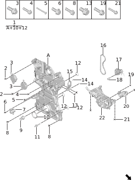

| Поз. | Артикул | Наименование | Кол-во | Применимость | Примечание |
| ---: | --- | --- | ---: | --- | --- |
| 1 | 100624003 | Кожух цепи ГРМ | 1 | с 2022-07-10 |  |
| 2 | Q11002111 | Болт | 4 | с 2022-07-10 |  |
| 3 | 100614005 | Электромагнитный клапан VVT | 1 | с 2022-07-10 | 16005, 100615003, 10061800 |
| 3 | 100614006 | Электромагнитный клапан VVT | 1 | с 2022-07-10 | 16006, 100615004, 10061800 |
| 4 | Q11002125 | Болт | 8 | с 2022-07-10 |  |
| 5 | Q11002124 | Болт | 1 | с 2022-07-10 |  |
| 6 | Q11002145 | Болт | 1 | с 2022-07-10 |  |
| 7 | 101103002 | Электромагнитный клапан масляного насоса | 1 | с 2022-07-10 |  |
| 8 | Q11002113 | Болт | 7 | с 2022-07-10 |  |
| 9 | 361112002 | Датчик давления масла | 1 | с 2022-07-10 |  |
| 10 | 102510002 | Сальник крышки | 1 | с 2022-07-10 |  |
| 10 | 102510003 | Сальник крышки | 1 | с 2022-07-10 |  |
| 11 | 111804002 | Шпилька турбонагнетателя | 1 | с 2022-07-10 |  |
| 12 | 100309015 | Уплотнительное кольцо | 3 | с 2022-07-10 |  |
| 13 | Q11002112 | Болт | 2 | с 2022-07-10 |  |
| 14 | 102504002 | Цилиндрический ролик | 2 | с 2022-07-10 |  |
| 15 | 100017005 | Проушина двигателя | 1 | с 2022-07-10 |  |
| 16 | 100623005 | Приводная цепь масляного насоса | 1 | с 2022-07-10 |  |
| 17 | 102509001 | Направляющая и торсионная пружина масляного насоса | 1 | с 2022-07-10 |  |
| 18 | 101505007 | Болт | 1 | с 2022-07-10 |  |
| 19 | Q11002133 | Болт | 2 | с 2022-07-10 |  |
| 20 | 102505001 | Маслоприемник | 1 | с 2022-07-10 |  |
| 21 | Q11002119 | Болт | 4 | с 2022-07-10 |  |
| 22 | 101101004 | Масляный насос | 1 | с 2022-07-10 |  |

# 1041-10 Масляный поддон и масляный фильтр

- Применимость группы: с 2023-04-14
- Описание: Тип силовой установки: последовательный гибрид

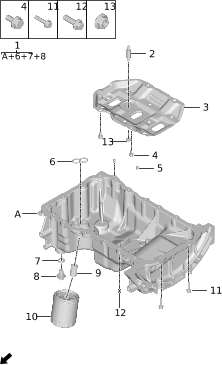

| Поз. | Артикул | Наименование | Кол-во | Применимость | Примечание |
| ---: | --- | --- | ---: | --- | --- |
| 1 | 100903007 | Масляный поддон | 1 | с 2022-07-10 |  |
| 2 | Q13002003 | Шпилька | 1 | с 2022-07-10 |  |
| 3 | 100903006 | Масляный поддон | 1 | с 2022-07-10 |  |
| 4 | Q11002116 | Болт | 4 | с 2022-07-10 |  |
| 5 | 102504002 | Цилиндрический ролик | 2 | с 2022-07-10 |  |
| 6 | 100309014 | Уплотнительное кольцо | 1 | с 2022-07-10 |  |
| 7 | Q22001014 | Шайба | 1 | с 2022-07-10 |  |
| 8 | 100907004 | Сливная пробка | 1 | с 2022-07-10 |  |
| 9 | 102506001 | Штуцер масляного фильтра | 1 | с 2022-07-10 |  |
| 10 | 101202004 | Масляный фильтр | 1 | с 2022-07-10 |  |
| 11 | Q11002117 | Болт | 12 | с 2022-07-10 |  |
| 12 | Q11002118 | Болт | 6 | с 2022-07-10 |  |
| 13 | 610508007 | Гайка | 1 | с 2022-07-10 |  |

# 1042-10 Трубка вентиляции картера

- Применимость группы: с 2023-04-14
- Описание: Тип силовой установки: последовательный гибрид

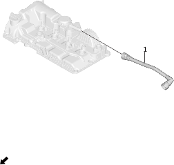

| Поз. | Артикул | Наименование | Кол-во | Применимость | Примечание |
| ---: | --- | --- | ---: | --- | --- |
| 1 | 101401004 | Вентиляционная трубка | 1 | с 2022-07-10 |  |

# 1043-10 Контроллер двигателя

- Применимость группы: с 2023-04-26
- Описание: Тип силовой установки: последовательный гибрид

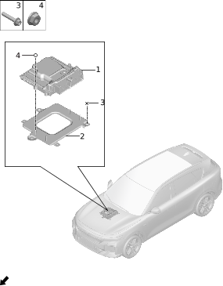

| Поз. | Артикул | Наименование | Кол-во | Применимость | Примечание |
| ---: | --- | --- | ---: | --- | --- |
| 1 | 360101003 | Контроллер двигателя | 1 | с 2022-07-10 |  |
| 2 | 500117002 | Кронштейн ECU | 1 | с 2022-07-10 |  |
| 3 | Q11001057 | Фланцевый болт | 3 | с 2022-07-10 |  |
| 4 | Q21001002 | Фланцевая гайка | 4 | с 2022-07-10 |  |

