# Электрооборудование, освещение и проводка

- [7010-10 Жгут проводки двигателя](#7010-10)
- [7011-10 Жгуты переднего отсека](#7011-10)
- [7013-10 Жгут панели приборов](#7013-10)
- [7014-10 Жгут центральной консоли](#7014-10)
- [7016-10 Жгут кузова](#7016-10)
- [7017-10 Жгуты передних дверей](#7017-10)
- [7018-10 Жгуты задних дверей](#7018-10)
- [7019-10 Жгут двери багажника](#7019-10)
- [7020-10 Жгут переднего бампера](#7020-10)
- [7021-10 Жгут заднего бампера](#7021-10)
- [7022-10 Жгуты массы](#7022-10)
- [7023-10 Аккумулятор](#7023-10)
- [7024-10 Разъемы питания](#7024-10)
- [7025-10 Беспроводная зарядка телефона](#7025-10)
- [7026-10 Передние фары](#7026-10)
- [7027-10 Противотуманные фонари](#7027-10)
- [7028-10 Задние фонари](#7028-10)
- [7029-10 Внешний индикатор зарядки](#7029-10)
- [7030-10 Салонное освещение](#7030-10)
- [7032-10 Подсветка дверей](#7032-10)
- [7033-10 Динамики](#7033-10)
- [7034-10 Контроллер предупреждения пешеходов](#7034-10)
- [7038-10 Видеорегистратор](#7038-10)
- [7039-10 Камера мониторинга водителя](#7039-10)
- [7041-10 Камера мониторинга заднего ряда](#7041-10)
- [7043-10 Переключатели](#7043-10)
- [7044-10 Комбинированные переключатели](#7044-10)
- [7045-10 Управление открытием и закрытием двери багажника](#7045-10)
- [7046-10 Мультимедийная головная система](#7046-10)
- [7047-10 Мультимедийный дисплей](#7047-10)
- [7048-10 Антенны](#7048-10)
- [7050-10 Акустические динамики](#7050-10)
- [7051-10 Микрофоны](#7051-10)
- [7052-10 Телематический блок](#7052-10)
- [7053-10 Бесключевой доступ и интеллектуальный запуск](#7053-10)
- [7054-10 Система сенсорного открытия ногой](#7054-10)
- [7055-10 Устройства управления кузовом](#7055-10)
- [7056-10 Предохранители и реле жгутов](#7056-10)
- [7057-10 Предохранители и реле жгутов](#7057-10)

## 7010-10

### Жгут проводки двигателя

- Применимость группы: с 2023-05-05
- Описание: Тип привода: range extender

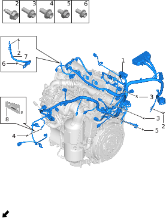

| Поз. | Артикул | Наименование | Кол-во | Применимость | Примечание |
| ---: | --- | --- | ---: | --- | --- |
| 1 | 372420006 | Жгут проводки двигателя | 1 | 2022-07-10 - 2023-09-11 |  |
| 1 | 372420008 | Жгут проводки двигателя | 1 | с 2023-09-11 |  |
| 2 | Q11004001 | Болт массы | 4 | с 2022-07-10 |  |
| 3 | Q11001004 | Фланцевый болт | 4 | с 2022-07-10 |  |
| 4 | Q11004003 | Болт массы | 1 | с 2022-07-10 |  |
| 5 | Q11001018 | Фланцевый болт | 1 | с 2023-06-30 |  |
| 6 | Q11001095 | Фланцевый болт | 1 | с 2022-07-10 |  |
| 7 | 373007001 | Жгут массы двигателя | 1 | с 2022-07-10 |  |
| 8 | 372310006 | Кронштейн жгута двигателя | 1 | с 2023-09-11 |  |

## 7011-10

### Жгуты переднего отсека

- Применимость группы: с 2023-05-05
- Описание: Общая конфигурация: универсально для серии

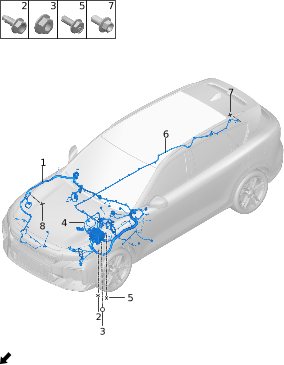

| Поз. | Артикул | Наименование | Кол-во | Применимость | Примечание |
| ---: | --- | --- | ---: | --- | --- |
| 1 | 372417014 | Правый жгут переднего отсека | 1 | с 2022-07-10 | Полный привод; аппаратное обеспечение ADAS L2.9 |
| 1 | 372417015 | Правый жгут переднего отсека | 1 | с 2024-03-15 | Полный привод; без аппаратного обеспечения ADAS L2.9 |
| 1 | 372417016 | Правый жгут переднего отсека | 1 | с 2024-03-15 | Задний привод; без аппаратного обеспечения ADAS L2.9 |
| 2 | Q11004004 | Болт массы | 1 | с 2023-10-09 |  |
| 3 | Q21001010 | Фланцевая гайка | 3 | с 2022-07-10 |  |
| 4 | 372415010 | Жгут переднего подрамника | 1 | с 2022-07-10 | Полный привод; 39kWh; мощность заднего двигателя 200kW |
| 4 | 372415013 | Жгут переднего подрамника | 1 | с 2024-03-15 | Задний привод; 43kWh; мощность заднего двигателя 200kW |
| 4 | 372415014 | Жгут переднего подрамника | 1 | с 2024-03-15 | Полный привод; 43kWh; мощность заднего двигателя 200kW |
| 4 | 372415016 | Жгут переднего подрамника | 1 | с 2024-06-15 | Полный привод; 43kWh; мощность заднего двигателя 215kW |
| 4 | 372415017 | Жгут переднего подрамника | 1 | с 2024-06-15 | Задний привод; 43kWh; мощность заднего двигателя 215kW |
| 5 | Q11002019 | Болт | 1 | с 2022-07-10 |  |
| 6 | 372416021 | Левый жгут переднего отсека | 1 | с 2023-02-13 | Полный привод; ADAS L2.9; ячейки CATL 39kWh и 43kWh; мощность заднего двигателя 200kW |
| 6 | 372416022 | Левый жгут переднего отсека | 1 | с 2023-04-15 | Полный привод; ADAS L2.9; ячейки SVOLT 39kWh; мощность заднего двигателя 200kW |
| 6 | 372416024 | Левый жгут переднего отсека | 1 | с 2024-03-15 | Полный привод; без ADAS L2.9; ячейки CATL 43kWh; мощность заднего двигателя 200kW |
| 6 | 372416025 | Левый жгут переднего отсека | 1 | с 2024-03-15 | Задний привод; без ADAS L2.9; ячейки CATL 43kWh; мощность заднего двигателя 200kW |
| 6 | 372416026 | Левый жгут переднего отсека | 1 | с 2024-06-15 | Полный привод; ADAS L2.9; ячейки CATL 43kWh; мощность заднего двигателя 215kW |
| 6 | 372416027 | Левый жгут переднего отсека | 1 | с 2024-06-15 | Задний привод; без ADAS L2.9; ячейки CATL 43kWh; мощность заднего двигателя 215kW |
| 6 | 372416028 | Левый жгут переднего отсека | 1 | с 2024-06-15 | Полный привод; без ADAS L2.9; ячейки CATL 43kWh; мощность заднего двигателя 215kW |
| 7 | Q11001095 | Фланцевый болт | 1 | с 2022-07-10 |  |
| 8 | Q11004001 | Болт массы | 6 | с 2022-07-10 |  |

## 7013-10

### Жгут панели приборов

- Применимость группы: с 2023-05-05
- Описание: Общая конфигурация: универсально для серии

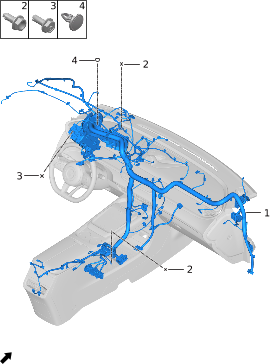

| Поз. | Артикул | Наименование | Кол-во | Применимость | Примечание |
| ---: | --- | --- | ---: | --- | --- |
| 1 | 372418067 | Жгут панели приборов | 1 | с 2022-12-25 | Без стеклянной крыши + ADAS L2.9 + левый и правый солнцезащитные козырьки с зеркалом |
| 1 | 372418068 | Жгут панели приборов | 1 | с 2022-12-25 | Электрохромное стекло + атмосферная подсветка + ADAS L2.9 + левый и правый солнцезащитные козырьки с зеркалом |
| 1 | 372418138 | Жгут панели приборов | 1 | с 2024-04-17 | Без стеклянной крыши + ADAS L2.9 + левое обычное зеркало + правое интеллектуальное зеркало |
| 1 | 372418139 | Жгут панели приборов | 1 | с 2024-04-17 | Электрохромное стекло + атмосферная подсветка + ADAS L2.9 + левое обычное зеркало + правое интеллектуальное зеркало |
| 1 | 372418140 | Жгут панели приборов | 1 | с 2024-03-15 | Без стеклянной крыши + без ADAS L2.9 |
| 1 | 372418141 | Жгут панели приборов | 1 | с 2024-03-15 | Электрохромное стекло + атмосферная подсветка + без ADAS L2.9 |
| 2 | Q11004001 | Болт массы | 5 | с 2022-07-10 |  |
| 3 | Q11002019 | Болт | 2 | с 2022-07-10 |  |
| 4 | Q41001002 | Клипса | 4 | с 2022-07-10 |  |

## 7014-10

### Жгут центральной консоли

- Применимость группы: с 2023-05-05
- Описание: Общая конфигурация: универсально для серии

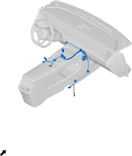

| Поз. | Артикул | Наименование | Кол-во | Применимость | Примечание |
| ---: | --- | --- | ---: | --- | --- |
| 1 | 372402008 | Жгут центральной консоли | 1 | с 2022-07-10 |  |

## 7016-10

### Жгут кузова

- Применимость группы: с 2023-05-05
- Описание: Общая конфигурация: универсально для серии

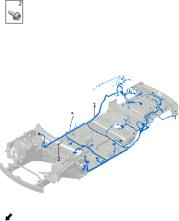

| Поз. | Артикул | Наименование | Кол-во | Применимость | Примечание |
| ---: | --- | --- | ---: | --- | --- |
| 1 | 372419117 | Жгут кузова | 1 | с 2022-07-10 | Ячейки CATL + панорамная крыша + ADAS L2.9 |
| 1 | 372419118 | Жгут кузова | 1 | с 2022-07-10 | Ячейки CATL + электрохромное стекло + атмосферная подсветка + ADAS L2.9 |
| 1 | 372419119 | Жгут кузова | 1 | с 2023-04-15 | Ячейки SVOLT + панорамная крыша + ADAS L2.9 |
| 1 | 372419120 | Жгут кузова | 1 | с 2023-04-15 | Ячейки SVOLT + электрохромное стекло + атмосферная подсветка + ADAS L2.9 |
| 1 | 372419203 | Жгут кузова | 1 | с 2024-03-15 | Задний привод + без ADAS L2.9 |
| 1 | 372419204 | Жгут кузова | 1 | с 2024-03-15 | Полный привод + без ADAS L2.9 |
| 2 | Q11004001 | Болт массы | 10 | с 2022-07-10 |  |

## 7017-10

### Жгуты передних дверей

- Применимость группы: с 2023-05-05
- Описание: Общая конфигурация: универсально для серии

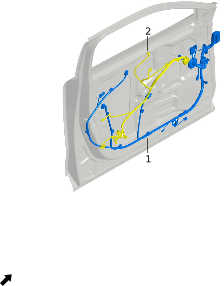

| Поз. | Артикул | Наименование | Кол-во | Применимость | Примечание |
| ---: | --- | --- | ---: | --- | --- |
| 1 | 372403010 | Левый жгут передней двери | 1 | с 2022-07-10 | ADAS L2.9; мощность заднего двигателя 200kW |
| 1 | 372403015 | Левый жгут передней двери | 1 | с 2024-03-15 | Без ADAS L2.9; мощность заднего двигателя 200kW |
| 1 | 372403022 | Левый жгут передней двери | 1 | с 2024-06-15 | ADAS L2.9; мощность заднего двигателя 215kW |
| 1 | 372405010 | Правый жгут передней двери | 1 | с 2022-07-10 | ADAS L2.9; мощность заднего двигателя 200kW |
| 1 | 372405015 | Правый жгут передней двери | 1 | с 2024-03-15 | Без ADAS L2.9; мощность заднего двигателя 200kW |
| 1 | 372405022 | Правый жгут передней двери | 1 | с 2024-06-15 | ADAS L2.9; мощность заднего двигателя 215kW |
| 2 | 372404002 | Левый жгут обивки передней двери | 1 | с 2022-10-01 |  |
| 2 | 372406001 | Правый жгут обивки передней двери | 1 | с 2022-07-10 |  |

## 7018-10

### Жгуты задних дверей

- Применимость группы: с 2023-05-05
- Описание: Общая конфигурация: универсально для серии

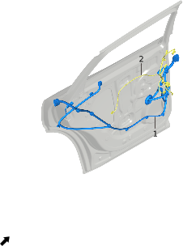

| Поз. | Артикул | Наименование | Кол-во | Применимость | Примечание |
| ---: | --- | --- | ---: | --- | --- |
| 1 | 372407007 | Левый жгут задней двери | 1 | с 2022-12-25 |  |
| 1 | 372409007 | Правый жгут задней двери | 1 | с 2022-12-25 |  |
| 2 | 372408004 | Левый жгут обивки задней двери | 1 | с 2022-12-25 |  |
| 2 | 372410004 | Правый жгут обивки задней двери | 1 | с 2022-12-25 |  |

## 7019-10

### Жгут двери багажника

- Применимость группы: с 2023-05-17
- Описание: Общая конфигурация: универсально для серии

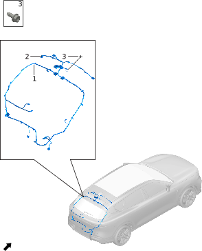

| Поз. | Артикул | Наименование | Кол-во | Применимость | Примечание |
| ---: | --- | --- | ---: | --- | --- |
| 1 | 372413003 | Жгут двери багажника | 1 | с 2022-07-10 |  |
| 2 | 372412002 | Переходной жгут двери багажника | 1 | с 2022-10-01 |  |
| 3 | Q11004001 | Болт массы | 1 | с 2022-07-10 |  |

## 7020-10

### Жгут переднего бампера

- Применимость группы: с 2023-05-10
- Описание: Общая конфигурация: универсально для серии

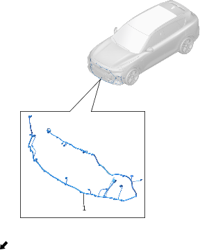

| Поз. | Артикул | Наименование | Кол-во | Применимость | Примечание |
| ---: | --- | --- | ---: | --- | --- |
| 1 | 372401013 | Жгут переднего бампера | 1 | с 2023-02-05 | ADAS L2.9; мощность заднего двигателя 200kW |
| 1 | 372401017 | Жгут переднего бампера | 1 | с 2024-03-15 | Без ADAS L2.9; мощность заднего двигателя 200kW |
| 1 | 372401024 | Жгут переднего бампера | 1 | с 2024-06-15 | ADAS L2.9; мощность заднего двигателя 215kW |

## 7021-10

### Жгут заднего бампера

- Применимость группы: с 2023-05-10
- Описание: Общая конфигурация: универсально для серии

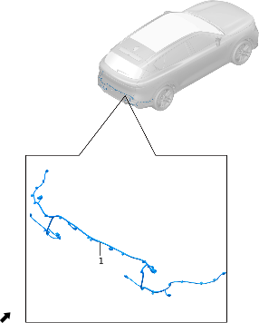

| Поз. | Артикул | Наименование | Кол-во | Применимость | Примечание |
| ---: | --- | --- | ---: | --- | --- |
| 1 | 372414006 | Жгут заднего бампера | 1 | с 2023-02-05 | ADAS L2.9; мощность заднего двигателя 200kW |
| 1 | 372414010 | Жгут заднего бампера | 1 | с 2024-03-15 | Без ADAS L2.9; мощность заднего двигателя 200kW |
| 1 | 372414014 | Жгут заднего бампера | 1 | с 2024-06-15 | ADAS L2.9; мощность заднего двигателя 215kW |

## 7022-10

### Жгуты массы

- Применимость группы: с 2023-05-09
- Описание: Тип привода: range extender

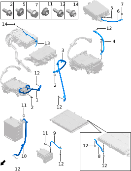

| Поз. | Артикул | Наименование | Кол-во | Применимость | Примечание |
| ---: | --- | --- | ---: | --- | --- |
| 1 | 372427003 | Провод массы переднего двигателя | 1 | с 2022-07-10 |  |
| 2 | Q11004003 | Болт массы | 2 | с 2022-07-10 |  |
| 3 | 372433002 | Провод массы высоковольтного блока | 1 | с 2022-07-10 |  |
| 4 | 373004003 | Жгут массы заднего двигателя | 1 | с 2022-10-01 | Емкость батареи: 39kWh |
| 4 | 373004007 | Жгут массы заднего двигателя | 1 | с 2024-05-20 | Емкость батареи: 43kWh |
| 5 | Q11001095 | Фланцевый болт | 4 | с 2022-07-10 |  |
| 6 | 372431004 | Провод массы onboard charger | 1 | с 2023-08-17 |  |
| 7 | Q11004002 | Болт массы | 1 | с 2022-07-10 |  |
| 8 | 372426002 | Провод массы тяговой батареи | 1 | с 2022-07-10 | Ячейки SVOLT 39kWh или CATL 43kWh |
| 8 | 372426007 | Провод массы тяговой батареи | 1 | с 2023-04-15 | Ячейки CATL 39kWh |
| 9 | 372434001 | Жгут массы PTC | 1 | с 2022-07-10 |  |
| 10 | 372425002 | Провод массы аккумулятора | 1 | 2022-07-10 - 2024-10-22 |  |
| 10 | 372425005 | Провод массы аккумулятора | 1 | с 2024-03-15 |  |
| 11 | Q21001010 | Фланцевая гайка | 2 | с 2022-07-10 |  |
| 12 | Q11004001 | Болт массы | 7 | с 2022-07-10 |  |
| 13 | 372435002 | Жгут массы GCU | 1 | с 2022-07-10 |  |
| 14 | Q11001015 | Фланцевый болт | 1 | с 2022-07-10 |  |

## 7023-10

### Аккумулятор

- Применимость группы: с 2023-05-10
- Описание: Тип привода: range extender

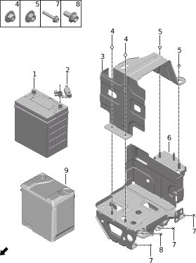

| Поз. | Артикул | Наименование | Кол-во | Применимость | Примечание |
| ---: | --- | --- | ---: | --- | --- |
| 1 | 370302002 | Аккумулятор | 1 | 2023-01-09 - 2024-06-06 |  |
| 1 | 370302003 | Аккумулятор | 1 | 2024-06-06 - 2024-06-11 |  |
| 1 | 370302004 | Аккумулятор | 1 | с 2024-05-27 |  |
| 2 | 370301001 | Датчик аккумулятора | 1 | 2022-07-10 - 2024-10-22 |  |
| 2 | 370301002 | Датчик аккумулятора | 1 | с 2024-03-15 |  |
| 3 | 500118002 | Крепежный ремень аккумулятора | 1 | с 2022-07-10 |  |
| 4 | Q21008001 | Шестигранная гайка | 2 | с 2022-07-10 |  |
| 5 | Q21008003 | Шестигранная гайка | 2 | с 2022-07-10 |  |
| 6 | 500111003 | Монтажный комплект аккумулятора | 1 | с 2022-07-10 |  |
| 7 | Q11001004 | Фланцевый болт | 6 | с 2022-07-10 |  |
| 8 | Q11001015 | Фланцевый болт | 2 | с 2022-07-10 |  |
| 9 | 370304001 | Теплоизоляционный мат аккумулятора | 1 | 2022-05-10 - 2024-03-15 |  |
| 9 | 370304002 | Теплоизоляционный мат аккумулятора | 1 | с 2024-03-15 |  |

## 7024-10

### Разъемы питания

- Применимость группы: с 2023-04-01
- Описание: Общая конфигурация: универсально для серии

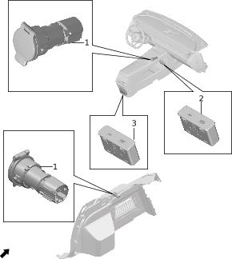

| Поз. | Артикул | Наименование | Кол-во | Применимость | Примечание |
| ---: | --- | --- | ---: | --- | --- |
| 1 | 372501001 | Розетка 12V | 2 | с 2022-07-10 |  |
| 2 | 362901005 | USB-зарядка | 1 | 2022-12-25 - 2024-10-17 |  |
| 2 | 362901012 | USB-зарядка | 1 | с 2024-10-17 |  |
| 3 | 362901006 | USB-зарядка | 1 | с 2022-07-10 |  |

## 7025-10

### Беспроводная зарядка телефона

- Применимость группы: с 2023-05-17
- Описание: Беспроводная зарядка телефона: передняя зарядка 15W

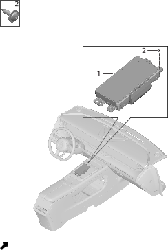

| Поз. | Артикул | Наименование | Кол-во | Применимость | Примечание |
| ---: | --- | --- | ---: | --- | --- |
| 1 | 360903003 | Контроллер беспроводной зарядки телефона | 1 | с 2022-07-10 |  |
| 1 | 360903007 | Контроллер беспроводной зарядки телефона | 1 | с 2024-07-13 |  |
| 2 | Q12002003 | Самонарезающий винт | 4 | с 2022-07-10 |  |

## 7026-10

### Передние фары

- Применимость группы: с 2023-05-09
- Описание: Общая конфигурация: универсально для серии

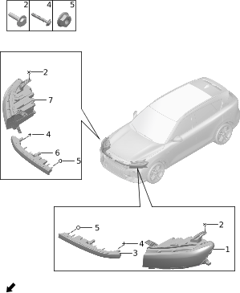

| Поз. | Артикул | Наименование | Кол-во | Применимость | Примечание |
| ---: | --- | --- | ---: | --- | --- |
| 1 | 371101030 | Левая передняя фара | 1 | с 2023-07-09 |  |
| 2 | Q11002040 | Болт | 8 | с 2022-07-10 |  |
| 3 | 371103003 | Левый передний габаритный огонь | 1 | 2022-07-10 - 2024-01-15 |  |
| 3 | 371103012 | Левый передний габаритный огонь | 1 | 2024-01-15 - 2024-10-28 |  |
| 3 | 371103013 | Левый передний габаритный огонь | 1 | с 2024-10-28 |  |
| 4 | Q12002007 | Самонарезающий винт | 2 | с 2022-07-10 |  |
| 5 | Q21001002 | Фланцевая гайка | 4 | с 2022-07-10 |  |
| 6 | 371104003 | Правый передний габаритный огонь | 1 | 2022-07-10 - 2024-01-15 |  |
| 6 | 371104012 | Правый передний габаритный огонь | 1 | 2024-01-15 - 2024-10-28 |  |
| 6 | 371104013 | Правый передний габаритный огонь | 1 | с 2024-10-28 |  |
| 7 | 371102030 | Правая передняя фара | 1 | с 2023-07-09 |  |

## 7027-10

### Противотуманные фонари

- Применимость группы: с 2023-05-10
- Описание: Задний противотуманный фонарь: LED

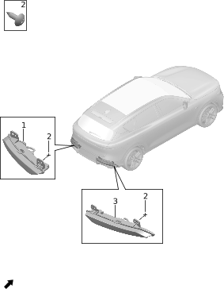

| Поз. | Артикул | Наименование | Кол-во | Применимость | Примечание |
| ---: | --- | --- | ---: | --- | --- |
| 1 | 371603002 | Левый задний противотуманный фонарь | 1 | с 2022-07-10 |  |
| 2 | Q12003001 | Винт | 8 | с 2022-07-10 |  |
| 3 | 371604002 | Правый задний противотуманный фонарь | 1 | с 2022-07-10 |  |

## 7028-10

### Задние фонари

- Применимость группы: с 2023-05-10
- Описание: Задние огни: LED

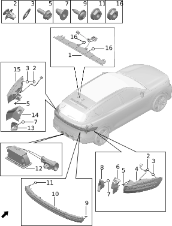

| Поз. | Артикул | Наименование | Кол-во | Применимость | Примечание |
| ---: | --- | --- | ---: | --- | --- |
| 1 | 371608003 | Высокий стоп-сигнал | 1 | с 2022-07-10 |  |
| 2 | 371611001 | Клипса | 3 | с 2022-07-10 |  |
| 3 | 820001001 | Уплотнительный поролон фигурной клипсы | 4 | с 2022-07-10 |  |
| 4 | 371602004 | Правая неподвижная секция заднего комбинированного фонаря | 1 | с 2022-12-29 |  |
| 5 | Q11002020 | Болт | 6 | с 2022-07-10 |  |
| 6 | 371610004 | Правая боковая панель неподвижной секции заднего комбинированного фонаря | 1 | с 2023-07-14 |  |
| 7 | Q41001005 | Защелка | 8 | с 2022-07-10 |  |
| 8 | 371607001 | Правая боковая панель подвижной секции заднего комбинированного фонаря | 1 | с 2022-07-10 |  |
| 9 | Q12002003 | Самонарезающий винт | 2 | с 2022-07-10 |  |
| 10 | 371605004 | Подвижная секция заднего комбинированного фонаря | 1 | с 2022-12-01 |  |
| 11 | Q21001002 | Фланцевая гайка | 6 | с 2022-07-10 |  |
| 12 | 371701001 | Подсветка номера | 1 | с 2022-07-10 |  |
| 13 | 371606001 | Левая боковая панель подвижной секции заднего комбинированного фонаря | 1 | с 2022-07-10 |  |
| 14 | 371609004 | Левая боковая панель неподвижной секции заднего комбинированного фонаря | 1 | с 2023-07-14 |  |
| 15 | 371601009 | Левая неподвижная секция заднего комбинированного фонаря | 1 | с 2022-12-29 |  |
| 16 | Q21001001 | Фланцевая гайка | 2 | с 2022-07-10 |  |

## 7029-10

### Внешний индикатор зарядки

- Применимость группы: с 2023-05-10
- Описание: Общая конфигурация: универсально для серии

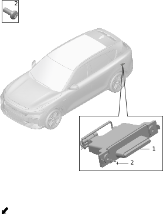

| Поз. | Артикул | Наименование | Кол-во | Применимость | Примечание |
| ---: | --- | --- | ---: | --- | --- |
| 1 | 840411006 | Индикатор зарядки | 1 | с 2023-07-20 |  |
| 2 | Q12001006 | Винт с внутренним шестигранником | 2 | с 2022-07-10 |  |

## 7030-10

### Салонное освещение

- Применимость группы: с 2023-04-01
- Описание: Общая конфигурация: универсально для серии

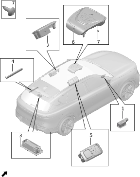

| Поз. | Артикул | Наименование | Кол-во | Применимость | Примечание |
| ---: | --- | --- | ---: | --- | --- |
| 1 | 371414001 | Точечный источник света | 4 | с 2022-07-10 |  |
| 2 | 371401013BEGE | Левый задний плафон | 1 | с 2023-08-09 | Бежевый + мелкая текстура; черно-синий интерьер |
| 2 | 371401013BLGC | Левый задний плафон | 1 | с 2023-08-16 | Космический синий + мелкая текстура; светло-коричневый + синий интерьер |
| 2 | 371401013JG05 | Левый задний плафон | 1 | с 2023-09-10 | Серо-бежевый + грубая текстура; красный + бежевый |
| 2 | 371401015JG08 | Левый задний плафон | 1 | с 2024-04-17 | Темно- или светло-серый; черный + серый |
| 2 | 371401016JK05 | Левый задний плафон | 1 | с 2024-04-17 | Классический черный; черный + зеленый |
| 3 | 371405003 | Правый фонарь багажника | 1 | с 2022-12-25 | Емкость батареи: 39kWh |
| 3 | 371405004 | Правый фонарь багажника | 1 | с 2024-05-07 | Емкость батареи: 43kWh |
| 4 | 371404001 | Левый фонарь багажника | 1 | с 2022-07-10 |  |
| 5 | 371401014BEGE | Правый задний плафон | 1 | с 2023-07-13 | Бежевый + мелкая текстура; черно-синий интерьер |
| 5 | 371401014BLGC | Правый задний плафон | 1 | с 2023-07-20 | Космический синий + мелкая текстура; светло-коричневый + синий интерьер |
| 5 | 371401014JG05 | Правый задний плафон | 1 | с 2023-09-19 | Серо-бежевый + грубая текстура; красный + бежевый |
| 5 | 371401017JG08 | Правый задний плафон | 1 | с 2024-04-17 | Темно- или светло-серый; черный + серый |
| 5 | 371401018JK05 | Правый задний плафон | 1 | с 2024-04-17 | Классический черный; черный + зеленый |
| 6 | 371403037BEGE | Передний плафон | 1 | с 2022-11-17 | Бежевый + мелкая текстура; rear occupant monitoring + без стеклянной крыши + черно-синий |
| 6 | 371403037BLGC | Передний плафон | 1 | с 2022-11-17 | Космический синий + мелкая текстура; rear occupant monitoring + без стеклянной крыши + светло-коричневый + синий |
| 6 | 371403037JG05 | Передний плафон | 1 | с 2022-11-17 | Серо-бежевый + грубая текстура; rear occupant monitoring + без стеклянной крыши + красный + бежевый |
| 6 | 371403040BEGE | Передний плафон | 1 | с 2022-11-17 | Бежевый + мелкая текстура; rear occupant monitoring + электрохромное стекло + атмосферная подсветка + черно-синий |
| 6 | 371403040BLGC | Передний плафон | 1 | с 2022-11-17 | Космический синий + мелкая текстура; rear occupant monitoring + электрохромное стекло + атмосферная подсветка + светло-коричневый + синий |
| 6 | 371403040JG05 | Передний плафон | 1 | с 2022-11-17 | Серо-бежевый + грубая текстура; rear occupant monitoring + электрохромное стекло + атмосферная подсветка + красный + бежевый |
| 6 | 371403053JG08 | Передний плафон | 1 | с 2024-04-17 | Черный + серый + без стеклянной крыши |
| 6 | 371403054JK05 | Передний плафон | 1 | с 2024-04-17 | Черный + зеленый + без стеклянной крыши |
| 6 | 371403055JG08 | Передний плафон | 1 | с 2024-04-17 | Черный + серый + электрохромное стекло + атмосферная подсветка |
| 6 | 371403056JK05 | Передний плафон | 1 | с 2024-04-17 | Черный + зеленый + электрохромное стекло + атмосферная подсветка |
| 7 | Q12002015 | Самонарезающий винт | 2 | с 2022-07-10 |  |

## 7032-10

### Подсветка дверей

- Применимость группы: с 2023-05-10
- Описание: Подсветка передних дверей: LED

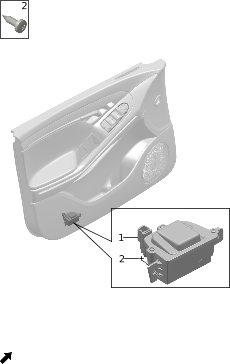

| Поз. | Артикул | Наименование | Кол-во | Применимость | Примечание |
| ---: | --- | --- | ---: | --- | --- |
| 1 | 371412001 | Левая подсветка передней двери | 1 | с 2022-07-10 |  |
| 1 | 371413001 | Правая подсветка передней двери | 1 | с 2022-07-10 |  |
| 2 | Q12002011 | Самонарезающий винт | 4 | с 2022-07-10 |  |

## 7033-10

### Динамики

- Применимость группы: с 2023-05-10
- Описание: Общая конфигурация: универсально для серии

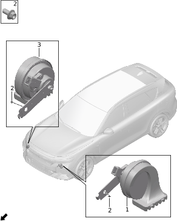

| Поз. | Артикул | Наименование | Кол-во | Применимость | Примечание |
| ---: | --- | --- | ---: | --- | --- |
| 1 | 372101004 | Низкочастотный динамик | 1 | с 2023-06-30 |  |
| 2 | Q11001015 | Фланцевый болт | 3 | с 2022-07-10 |  |
| 3 | 372102004 | Высокочастотный динамик | 1 | с 2023-06-30 |  |

## 7034-10

### Контроллер предупреждения пешеходов

- Применимость группы: с 2023-05-10
- Описание: Общая конфигурация: универсально для серии

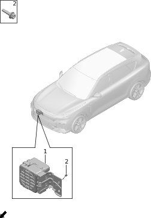

| Поз. | Артикул | Наименование | Кол-во | Применимость | Примечание |
| ---: | --- | --- | ---: | --- | --- |
| 1 | 362912003 | Контроллер предупреждения пешеходов | 1 | с 2022-07-10 |  |
| 2 | Q11001010 | Фланцевый болт | 2 | с 2022-07-10 |  |

## 7038-10

### Видеорегистратор

- Применимость группы: с 2023-04-01
- Описание: Видеорегистратор: установлен

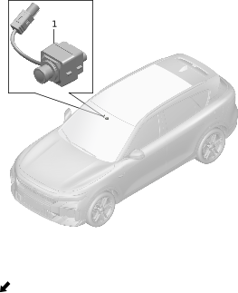

| Поз. | Артикул | Наименование | Кол-во | Применимость | Примечание |
| ---: | --- | --- | ---: | --- | --- |
| 1 | 791408004 | Камера видеорегистратора | 1 | с 2022-12-25 |  |

## 7039-10

### Камера мониторинга водителя

- Применимость группы: с 2023-05-10
- Описание: Контроль усталости: установлен

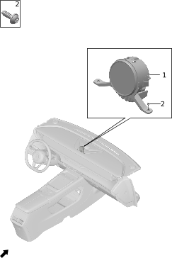

| Поз. | Артикул | Наименование | Кол-во | Применимость | Примечание |
| ---: | --- | --- | ---: | --- | --- |
| 1 | 791407006 | Камера мониторинга водителя | 1 | с 2022-12-25 | Матовый серебристый |
| 1 | 791407009 | Камера мониторинга водителя | 1 | с 2024-04-17 | Черный хром |
| 2 | Q12002002 | Самонарезающий винт | 2 | с 2022-07-10 |  |

## 7041-10

### Камера мониторинга заднего ряда

- Применимость группы: с 2023-05-10
- Описание: Мониторинг присутствия в салоне: задний ряд

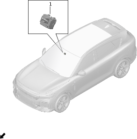

| Поз. | Артикул | Наименование | Кол-во | Применимость | Примечание |
| ---: | --- | --- | ---: | --- | --- |
| 1 | 791405001 | Камера мониторинга заднего ряда | 1 | с 2022-07-10 |  |

## 7043-10

### Переключатели

- Применимость группы: с 2023-05-10
- Описание: Общая конфигурация: универсально для серии

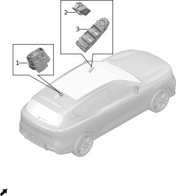

| Поз. | Артикул | Наименование | Кол-во | Применимость | Примечание |
| ---: | --- | --- | ---: | --- | --- |
| 1 | 374601001 | Переключатель стеклоподъемника | 3 | с 2022-07-10 | Матовый серебристый |
| 1 | 374601002 | Переключатель стеклоподъемника | 3 | с 2024-04-17 | Черный хром |
| 2 | 372004001 | Переключатель центрального замка | 1 | с 2022-07-10 | Матовый серебристый |
| 2 | 372004003 | Переключатель центрального замка | 1 | с 2024-04-17 | Черный хром |
| 3 | 372001003 | Переключатель окна левой передней двери | 1 | с 2022-07-10 | Матовый серебристый |
| 3 | 372001006 | Переключатель окна левой передней двери | 1 | с 2024-04-17 | Черный хром |

## 7044-10

### Комбинированные переключатели

- Применимость группы: с 2023-05-10
- Описание: Общая конфигурация: универсально для серии

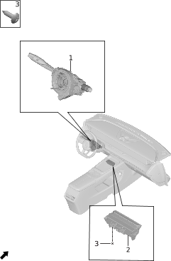

| Поз. | Артикул | Наименование | Кол-во | Применимость | Примечание |
| ---: | --- | --- | ---: | --- | --- |
| 1 | 372002007 | Переключатель рулевой колонки | 1 | 2022-07-10 - 2023-08-07 | Матовый серебристый |
| 1 | 372002010 | Переключатель рулевой колонки | 1 | 2022-07-10 - 2024-11-11 | Матовый серебристый |
| 1 | 372002012 | Переключатель рулевой колонки | 1 | 2024-04-17 - 2024-10-28 | Черный хром |
| 1 | 372002015 | Переключатель рулевой колонки | 1 | с 2024-11-02 | Матовый серебристый |
| 1 | 372002016 | Переключатель рулевой колонки | 1 | с 2024-10-28 | Черный хром |
| 2 | 373501005 | Комбинированный переключатель центральной консоли | 1 | с 2022-07-10 | Матовый серебристый + полуактивная пневмоподвеска |
| 2 | 373501007 | Комбинированный переключатель центральной консоли | 1 | с 2024-04-17 | Черный хром + без пневмоподвески |
| 2 | 373501008 | Комбинированный переключатель центральной консоли | 1 | с 2024-04-17 | Черный хром + полуактивная пневмоподвеска |
| 3 | Q12002014 | Самонарезающий винт | 4 | с 2022-07-10 |  |

## 7045-10

### Управление открытием и закрытием двери багажника

- Применимость группы: с 2023-05-10
- Описание: Общая конфигурация: универсально для серии

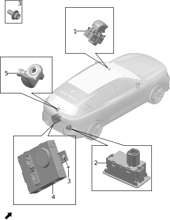

| Поз. | Артикул | Наименование | Кол-во | Применимость | Примечание |
| ---: | --- | --- | ---: | --- | --- |
| 1 | 372006001 | Переключатель двери багажника | 1 | с 2022-07-10 | Матовый серебристый |
| 1 | 372006002 | Переключатель двери багажника | 1 | с 2024-04-17 | Черный хром |
| 2 | 372007001 | Переключатель закрытия двери багажника | 1 | с 2022-07-10 |  |
| 3 | Q11001001 | Фланцевый болт | 2 | с 2022-07-10 |  |
| 4 | 361601009 | Контроллер электропривода двери багажника | 1 | с 2022-07-10 |  |
| 4 | 361601011 | Контроллер электропривода двери багажника | 1 | 2023-11-20 - 2023-12-09 |  |
| 5 | 372008002 | Переключатель открытия крышки багажника | 1 | с 2022-07-10 |  |

## 7046-10

### Мультимедийная головная система

- Применимость группы: с 2023-05-10
- Описание: Общая конфигурация: универсально для серии

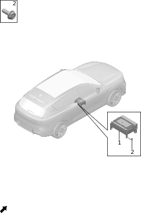

| Поз. | Артикул | Наименование | Кол-во | Применимость | Примечание |
| ---: | --- | --- | ---: | --- | --- |
| 1 | 790901017 | Головное устройство MP5 | 1 | 2023-05-10 - 2024-05-20 |  |
| 1 | 790901023 | Головное устройство MP5 | 1 | с 2024-05-21 |  |
| 1 | 790901026 | Головное устройство MP5 | 1 |  |  |
| 1 | 790901028 | Головное устройство MP5 | 1 |  |  |
| 2 | Q11002020 | Болт | 4 | с 2022-07-10 |  |

## 7047-10

### Мультимедийный дисплей

- Применимость группы: с 2023-05-10
- Описание: Общая конфигурация: универсально для серии

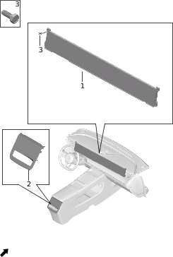

| Поз. | Артикул | Наименование | Кол-во | Применимость | Примечание |
| ---: | --- | --- | ---: | --- | --- |
| 1 | 791201012 | Мультимедийный дисплей | 2 | с 2023-09-07 |  |
| 2 | 791204005 | Экран управления автомобилем | 1 | с 2022-07-10 | Матовый серебристый |
| 2 | 791204006 | Экран управления автомобилем | 1 | с 2024-04-17 | Черный хром |
| 3 | Q11002034 | Болт | 7 | с 2022-07-10 |  |

## 7048-10

### Антенны

- Применимость группы: с 2023-04-01
- Описание: Общая конфигурация: универсально для серии

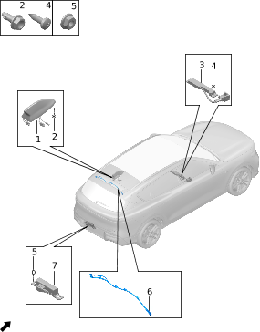

| Поз. | Артикул | Наименование | Кол-во | Применимость | Примечание |
| ---: | --- | --- | ---: | --- | --- |
| 1 | 790303001 | Плавниковая антенна | 1 | с 2022-07-10 |  |
| 1 | 790303002 | Плавниковая антенна | 2 |  |  |
| 2 | Q11004003 | Болт массы | 3 | с 2022-07-10 |  |
| 3 | 790307001 | Передняя PS-антенна | 1 | 2022-07-10 - 2024-07-18 |  |
| 3 | 790307005 | Передняя PS-антенна | 1 | с 2024-07-18 |  |
| 4 | Q12002008 | Самонарезающий винт | 2 | с 2022-07-10 |  |
| 5 | Q21001002 | Фланцевая гайка | 4 | с 2022-07-10 |  |
| 6 | 790304001 | Антенный кабель | 1 | 2022-07-10 - 2024-10-03 |  |
| 6 | 790304005 | Антенный кабель | 1 | с 2024-10-03 |  |
| 7 | 790308001 | Задняя PS-антенна | 2 | 2022-07-10 - 2024-07-16 |  |
| 7 | 790308002 | Задняя PS-антенна | 2 | с 2024-07-16 |  |

## 7050-10

### Акустические динамики

- Применимость группы: с 2023-05-10
- Описание: Аудиосистема: Dynaudio

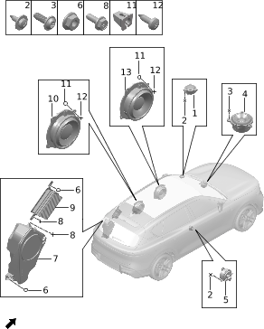

| Поз. | Артикул | Наименование | Кол-во | Применимость | Примечание |
| ---: | --- | --- | ---: | --- | --- |
| 1 | 790903001 | Высокочастотный динамик | 2 | с 2022-07-10 |  |
| 2 | Q12002002 | Самонарезающий винт | 12 | с 2022-07-10 |  |
| 3 | Q12001016 | Винт с внутренним шестигранником | 4 | с 2022-07-10 |  |
| 4 | 790904001 | Центральный динамик | 1 | с 2022-07-10 |  |
| 5 | 790903002 | Высокочастотный динамик | 2 | с 2022-07-10 |  |
| 6 | Q21001002 | Фланцевая гайка | 4 | с 2022-07-10 |  |
| 7 | 790905001 | Сабвуфер | 2 |  |  |

## 7051-10

### Микрофоны

- Применимость группы: с 2023-05-10
- Описание: Локализация источника звука: передний + задний ряд

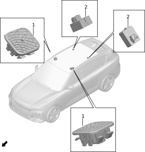

| Поз. | Артикул | Наименование | Кол-во | Применимость | Примечание |
| ---: | --- | --- | ---: | --- | --- |
| 1 | 791102005BEGC | Микрофон | 2 | 2022-07-10 - 2024-10-01 | Бежевый + мелкий матовый; черно-синий интерьер |
| 1 | 791102005BLGF | Микрофон | 2 | с 2022-07-10 | Космический синий + мелкий матовый; светло-коричневый + синий интерьер |
| 1 | 791102005JG05 | Микрофон | 2 | с 2022-07-10 | Серо-бежевый + грубая текстура; красный + бежевый |
| 1 | 791102023JG08 | Микрофон | 2 | с 2024-04-17 | Темно- или светло-серый; черный + серый |
| 1 | 791102024JK05 | Микрофон | 2 | с 2024-04-17 | Классический черный; черный + зеленый |
| 2 | 791101001 | Одинарный микрофон | 2 | 2022-07-10 - 2024-05-16 |  |
| 2 | 791101002 | Одинарный микрофон | 2 | с 2024-05-16 |  |

## 7052-10

### Телематический блок

- Применимость группы: с 2023-05-10
- Описание: Телематика: T-BOX (5G)

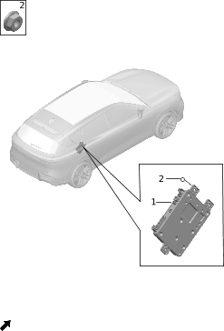

| Поз. | Артикул | Наименование | Кол-во | Применимость | Примечание |
| ---: | --- | --- | ---: | --- | --- |
| 1 | 363005025 | T-BOX | 1 | 2023-02-16 - 2023-09-29 |  |
| 1 | 363005031 | T-BOX | 1 | с 2023-09-29 |  |
| 1 | 363005040 | T-BOX | 1 |  |  |
| 2 | Q11001008 | Фланцевый болт | 2 | с 2022-07-10 |  |

## 7053-10

### Бесключевой доступ и интеллектуальный запуск

- Применимость группы: с 2023-05-10
- Описание: Общая конфигурация: универсально для серии

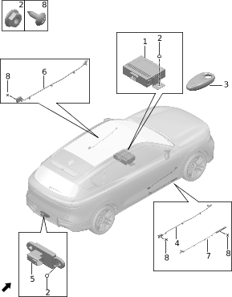

| Поз. | Артикул | Наименование | Кол-во | Применимость | Примечание |
| ---: | --- | --- | ---: | --- | --- |
| 1 | 360901012 | Основной Bluetooth-модуль | 1 | 2023-04-15 - 2023-09-11 |  |
| 1 | 360901016 | Основной Bluetooth-модуль | 1 | с 2023-04-15 |  |
| 2 | Q21001002 | Фланцевая гайка | 4 | с 2022-07-10 |  |
| 3 | 370401009 | Интеллектуальный пульт-ключ | 1 | с 2022-10-01 |  |
| 4 | 360907004 | Правый передний BLE-модуль | 1 | с 2023-04-15 |  |
| 5 | 360904004 | Задний BLE-модуль бампера | 1 | с 2023-04-15 |  |
| 6 | 360906004 | Левый передний BLE-модуль | 1 | с 2023-04-15 |  |
| 7 | 790305001 | Антенна бесключевого доступа левой передней двери | 1 | 2022-07-10 - 2024-08-21 |  |
| 7 | 790305002 | Антенна бесключевого доступа левой передней двери | 1 | с 2024-07-18 |  |
| 7 | 790306001 | Антенна бесключевого доступа правой передней двери | 1 | 2022-07-10 - 2024-08-21 |  |
| 7 | 790306002 | Антенна бесключевого доступа правой передней двери | 1 | с 2024-07-18 |  |
| 8 | Q12002008 | Самонарезающий винт | 8 | с 2022-07-10 |  |

## 7054-10

### Система сенсорного открытия ногой

- Применимость группы: с 2023-05-10
- Описание: Способ открытия: электропривод двери багажника с сенсором открытия ногой

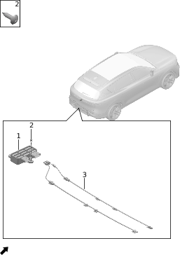

| Поз. | Артикул | Наименование | Кол-во | Применимость | Примечание |
| ---: | --- | --- | ---: | --- | --- |
| 1 | 360207005 | Контроллер сенсора открытия ногой | 1 | с 2023-06-15 |  |
| 2 | Q12002014 | Самонарезающий винт | 3 | с 2022-07-10 |  |
| 3 | 360204001 | Сенсорная планка открытия ногой | 1 | с 2022-07-10 |  |

## 7055-10

### Устройства управления кузовом

- Применимость группы: с 2023-05-10
- Описание: Общая конфигурация: универсально для серии

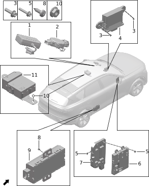

| Поз. | Артикул | Наименование | Кол-во | Применимость | Примечание |
| ---: | --- | --- | ---: | --- | --- |
| 1 | 362913006 | Система бесконтактной оплаты проезда | 1 | с 2022-10-01 |  |
| 2 | 360206001 | Датчик дождя и освещенности | 1 | с 2022-07-10 |  |
| 3 | Q11001008 | Фланцевый болт | 2 | с 2022-07-10 |  |
| 4 | 363004007 | Шлюз | 1 | с 2022-07-10 |  |
| 5 | Q11001004 | Фланцевый болт | 7 | с 2022-07-10 |  |
| 6 | 361001008 | Центральный блок управления | 1 | с 2022-07-10 |  |
| 7 | 361002001 | Кронштейн центрального блока управления | 1 | с 2022-07-10 |  |
| 8 | Q12002011 | Самонарезающий винт | 8 | с 2022-07-10 |  |
| 9 | 361603005 | Контроллер дверной ручки | 4 | с 2022-07-10 |  |
| 9 | 361603006 | Контроллер дверной ручки | 4 |  |  |
| 9 | 361603007 | Контроллер дверной ручки | 4 |  |  |
| 9 | 361603008 | Контроллер дверной ручки | 4 | 2024-04-23 - 2024-09-01 |  |
| 9 | 361603009 | Контроллер дверной ручки | 4 | с 2024-09-01 |  |
| 10 | Q21001002 | Фланцевая гайка | 2 | с 2022-07-10 |  |
| 11 | 361602003 | Контроллер защиты стекол от защемления | 1 | с 2022-11-15 | Закаленное privacy-стекло второго ряда |
| 11 | 361602004 | Контроллер защиты стекол от защемления | 1 | с 2024-03-15 | Шумоизолирующее privacy-стекло второго ряда |

## 7056-10

### Предохранители и реле жгутов

- Применимость группы: с 2023-05-10
- Описание: Общая конфигурация: универсально для серии

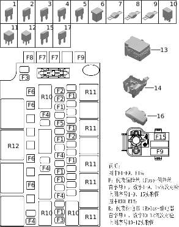

| Поз. | Артикул | Наименование | Кол-во | Применимость | Примечание |
| ---: | --- | --- | ---: | --- | --- |
| 1 | 372301001 | Предохранитель (MINI) | 12 | с 2023-05-22 | MINI_7.5A |
| 2 | 372301002 | Предохранитель (MINI) | 5 | с 2023-05-22 | MINI_10A |
| 3 | 372301003 | Предохранитель (MINI) | 5 | с 2023-05-22 | MINI_15A |
| 4 | 372301004 | Предохранитель (MINI) | 6 | с 2023-05-22 | MINI_20A |
| 5 | 372301005 | Предохранитель (MINI) | 1 | с 2023-05-22 | MINI_30A |
| 6 | 372302002 | Предохранитель (JCASE) | 5 | с 2023-05-22 | JCASE_40A |
| 7 | 372303001 | Предохранитель (MIDI) | 1 | с 2023-05-22 | MIDI_60A |
| 8 | 372303002 | Предохранитель (MIDI) | 2 | с 2023-05-22 | MIDI_80A |
| 9 | 372303003 | Предохранитель (MIDI) | 2 | с 2023-05-22 | MIDI_200A |
| 10 | 372304004 | Реле | 3 | с 2023-05-22 | Переключаемое, 35A |
| 10 | 372304010 | Реле | 3 | с 2023-05-22 | Переключаемое, 35A |
| 11 | 372304002 | Реле | 6 | с 2023-05-22 | 35A |
| 11 | 372304008 | Реле | 6 | с 2023-05-22 | 35A |
| 12 | 372304003 | Реле | 2 | с 2023-05-22 | 40A |
| 12 | 372304009 | Реле | 2 | с 2023-05-22 | 40A |
| 13 | 372305002 | Верхняя крышка блока предохранителей | 1 | с 2023-05-22 |  |
| 14 | 372306001 | Нижняя крышка блока предохранителей | 1 | с 2023-05-22 |  |
| 15 | 372301007 | Предохранитель (MINI) | 1 | с 2023-05-22 | MINI_5A |
| 16 | 372311001 | Блок предохранителей аккумулятора | 1 | с 2023-05-22 |  |
| 17 | 372303007 | Предохранитель (MIDI) | 2 | с 2023-05-22 | MIDI_70A |

## 7057-10

### Предохранители и реле жгутов

- Применимость группы: с 2023-05-10
- Описание: Общая конфигурация: универсально для серии

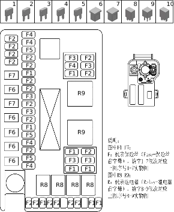

| Поз. | Артикул | Наименование | Кол-во | Применимость | Примечание |
| ---: | --- | --- | ---: | --- | --- |
| 1 | 372301001 | Предохранитель (MINI) | 9 | с 2023-05-22 | 7.5A-MINI |
| 2 | 372301002 | Предохранитель (MINI) | 20 | с 2023-05-22 | 10A-MINI |
| 3 | 372301003 | Предохранитель (MINI) | 6 | с 2023-05-22 | 15A-MINI |
| 4 | 372301004 | Предохранитель (MINI) | 5 | с 2023-05-22 | 20A-MINI |
| 5 | 372301005 | Предохранитель (MINI) | 3 | с 2023-05-22 | 30A-MINI |
| 6 | 372302001 | Предохранитель (JCASE) | 5 | с 2023-05-22 | 30A-JCASE |
| 7 | 372301008 | Предохранитель (MINI) | 1 | с 2023-05-22 | 25A-MINI |
| 7 | 372302002 | Предохранитель (JCASE) | 2 | с 2023-05-22 | 40A-JCASE |
| 7 | 372303004 | Предохранитель (MIDI) | 1 | с 2023-05-22 | 150A-MIDI |
| 7 | 372303006 | Предохранитель (MIDI) | 1 | с 2023-05-22 | 125A-MIDI |
| 8 | 372304002 | Реле | 4 | с 2023-05-22 | 35A |
| 8 | 372304008 | Реле | 4 | с 2023-05-22 | 35A |
| 9 | 372304003 | Реле | 2 | с 2023-05-22 | 40A |
| 9 | 372304009 | Реле | 2 | с 2023-05-22 | 40A |
| 10 | 372304004 | Реле | 3 | с 2023-05-22 | Переключаемое, 35A |
| 10 | 372304010 | Реле | 3 | с 2023-05-22 | Переключаемое, 35A |

