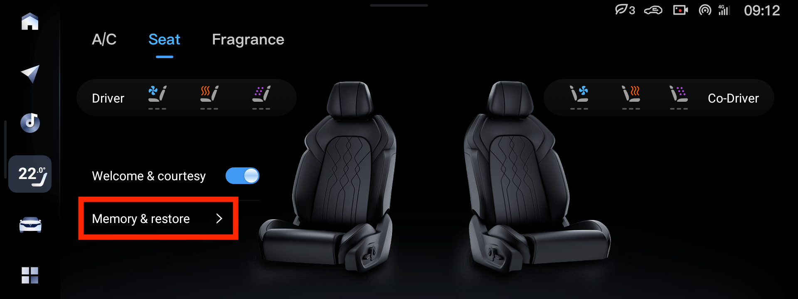
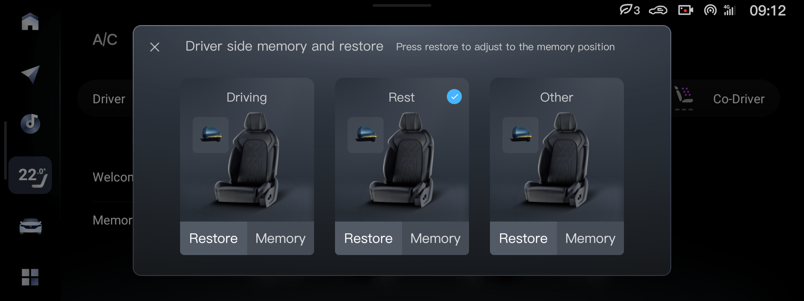
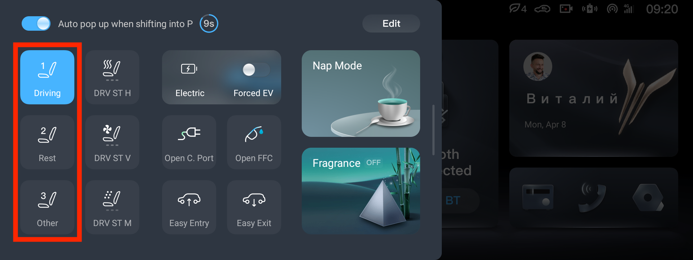
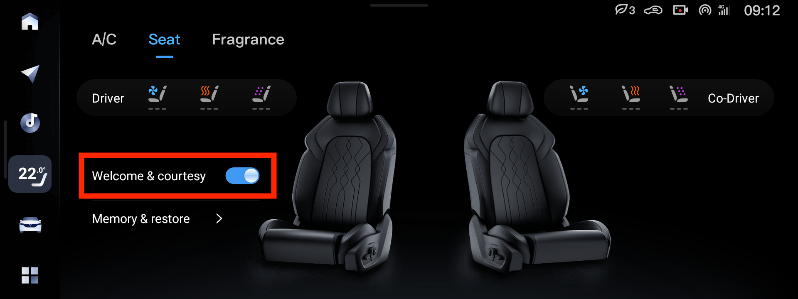

# Положение

Положение водительского сидения можно запомнить/восстановить

При нажатии появляется диалог сохранения/восстановления настроек

1. Основная настройка водителя
2. Положение для отдыха
3. Другой водитель

Так же этот диалог появляетсят при настройках водительского сидения кнопками слева снизу.

Быстро восстановить положение сидения можно вытянув шторку слева на центральном экране.

# Два водителя

Если машину используют два водителя возможны три варианта подстройки сидений

1. Сделать два аккаунта Lantu, войти каждым в машину и настроить Face Id для каждого водителя. В этом случае машина будет сама узнавать водителя, подстраивать сиденья и боковые зеркала.
2. Руками переключать между водителями вытянув шторку слева на центральном экране, предвадительно настроив положение сиденья для основного водителя (Driver) и дополнительного (Other)
3. [Установить VoyahTweaks](../common/tweaks.md) и через него восстанавливать положение сидений: долгое нажатие на иконку `Климат` в левой панели на центральном экране открывает вкладку `Комфорт` настроек VoyahTweaks

# Сдвиг водительского сидения

Отключить/включить сдвиг водительского сидения при открытии/закрытии двери

