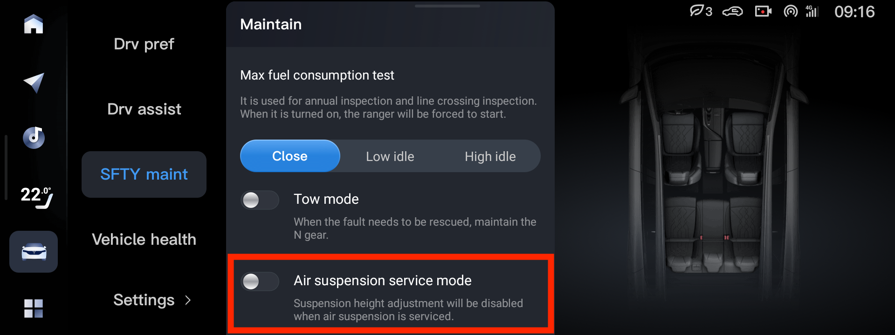

# Шины
## Стандартные

    - 255 / 45 / 20
    - 255 / 50 / 19

## Альтернативные

    - 245 / 50 / 20
    - 265 / 45 / 20
    - 275 / 40 / 20
    - 275 / 45 / 20
    - 265 / 50 / 19

# Шиномонтаж
При шиномонаже нужно переводить пневму в сервисный режим:

# Диски
    - 20 — 8.5, PCD 5x120, ET 30, DIA 66.1, нагрузка на диск 850кг
    - 19 — 8.0, PCD 5x120, ET 30, DIA 66.1, нагрузка на диск 850кг

# Датчики
## Autel MX-Sensor 315 / 433MHz
> Frequency - 433MHz 
> Relearn - A 
> Support by Autel(MX-Sensor) - Y 
> Support by Autel(Tool) - Y

> Стандартные TPMS датчики на 433 МГц. Практически все популярные датчики эту частоту поддерживают. Перед установкой на машину, нужно их просто настроить сканером который поддерживает купленные датчики. Аутелевские сканеры TPMS даже Voyah в базе имеют и могут датчики Autel настраивать даже без наличия оригинальных датчиков для клонирования.
>
> НО, есть один момент, датчики могут довольно долго регистрироваться в машине. Особенно если только короткие поездки. Autel неделю прописаться не могли, пока не сделал более-менее длинную поездку с нормальной скоростью.

## H56A7920001AC
[1Sensor для Dongfeng Voyah H56A7920001AC](https://www.ozon.ru/product/1sensor-dlya-dongfeng-voyah-li-xiang-h56a7920001ac-4sht-rezinovyy-1249198012/)
> Конкретно вот эти датчики, заработали из коробки, ничего никуда не прописывал, сканер не подключал ни к датчикам, ни к машине

[Voyah Free OEM: H56A7920001AC](https://www.ozon.ru/product/datchiki-davleniya-v-shinah-dlya-voyah-free-oem-h56a7920001ac-chernyy-metallicheskiy-nippel-4-shtuki-1152742344/)
> Датчики брал эти, НЕ прописывал ничего. Сами считались через 15 метров
